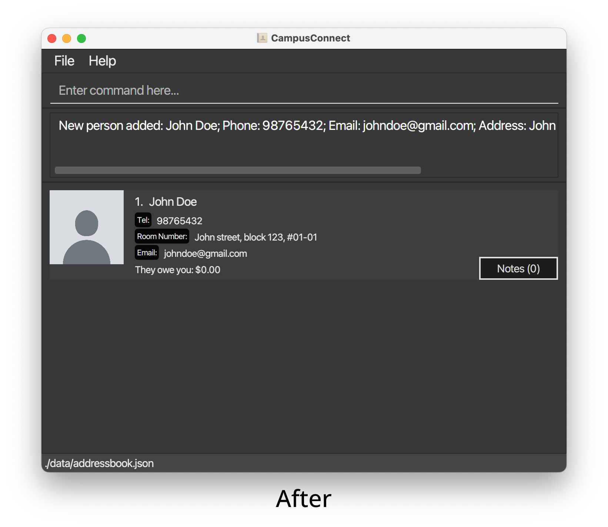
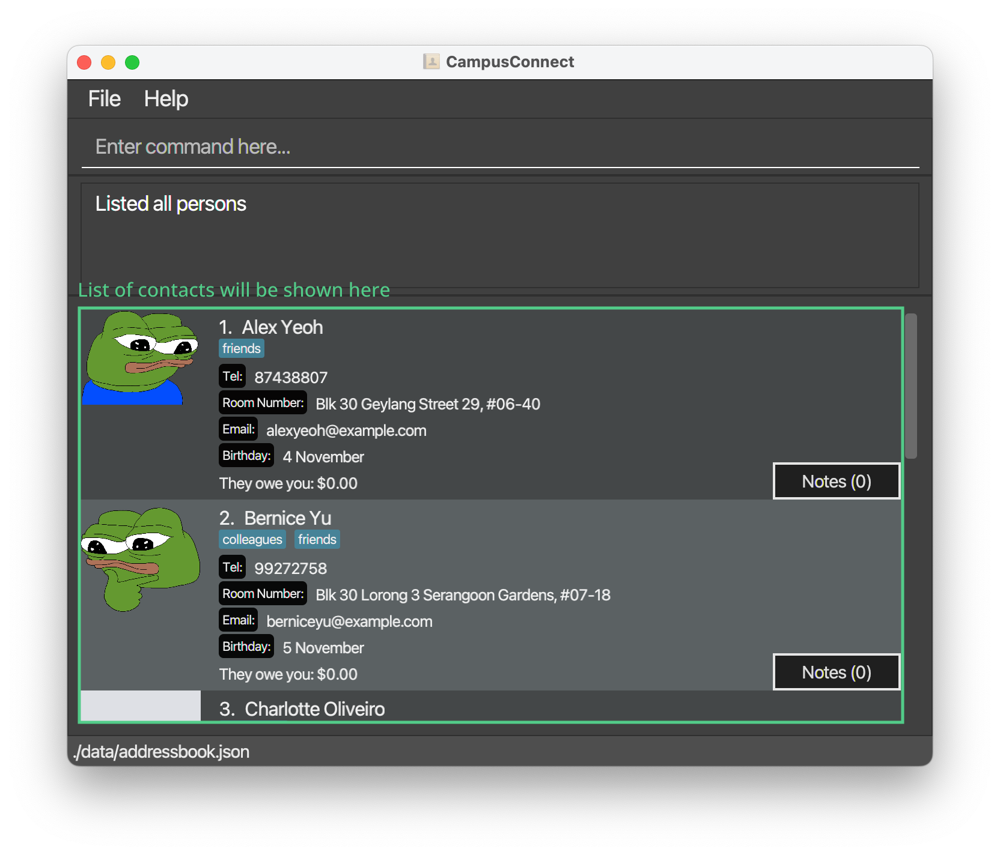
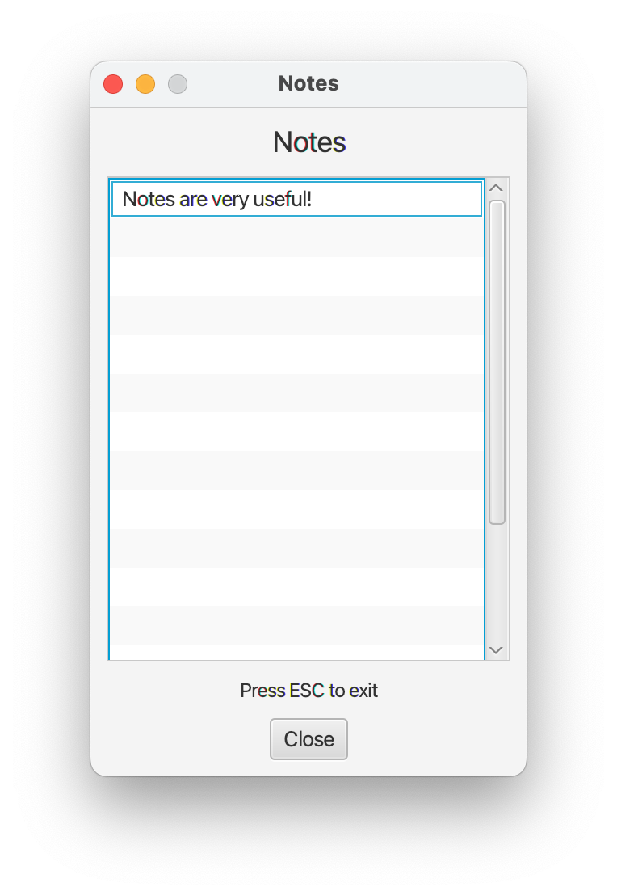
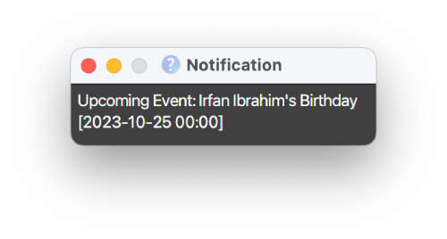

# CampusConnect User Guide

___Empowering connections in the NUS community is just a few keystrokes away!___

**CampusConnect** is a desktop application built for **NUS students** living on campus to help them **stay organised**, **stay connected**, and **make the on-campus experience at NUS stress-free**. It is **optimised for use** via **Command Line Interface (CLI)** while benefiting from a **Graphical User Interface (GUI)**.

Here is an **overview** of how CampusConnect can enhance your campus experience:

- Store and edit contact profiles of your friends
- Receive timely notifications to celebrate your friends' birthdays
- Tracks payments between you and your friends

## Using this Guide

This user guide shows you how to get started with using CampusConnect -- it has easy-to-understand explanations and examples to help you grasp its various features. 

### Who is this guide for?

Our guide is catered to CampusConnect users of all experiences! Here's a quick overview of who this guide is for, and how you can best use the guide:

| If you are... | You should... |
| :-----------: | :-----------: |
| New to CampusConnect | Read the **[Quick Start](#quick-start)** below! |
| An existing user | Skip to the **[Command Summary](#command-summary)** for a quick reference, or read through our **[Features](#features)** for a deeper look at each feature! |
| Interested in comprehensive technical details | Read our **[Developer Guide](DeveloperGuide.md)**, which is separate from this User Guide! |

### Visual Components

Our guide uses **visual components** to highlight key information for your convenience. Here's a quick overview of what each component means:

    

       <ol start="1">
        <li>Examples</li>
      </ol>
    

    

        <box theme="info" icon=":fa-solid-magnifying-glass:">

**Example usages** of a feature will be contained in a **light blue box** with this **magnifying glass icon** :fa-solid-magnifying-glass:. These examples will show you how a feature works, and will include sample commands that you can try out yourself!
        </box>
    

    

        <ol start="2">
            <li>Command Syntax Tables</li>
        </ol>
    

    

         
        <panel header=":fa-solid-book: **Command Parameter / Syntax Tables**" type="secondary" expanded no-close>
Large tables describing the **syntax or parameters** of **parameter-heavy commands**, or the **attributes of large models**, will be contained in a **collapsible grey panel** like this one with a **book icon** :fa-solid-book:.

| Sample | Table |
| ------ | ----- |
| Sample | Table Data |
| Sample 2 | Table Data 2 |

These tables will provide a quick reference on the meanings and usage of each parameter in commands which support many such parameters, or the attributes of large and complex models, such as our [Person model](#person-model).

PDF Users will always see these panels expanded, but users of the web version of this guide can click on the panel header to collapse (and then re-expand) the panel if the information is no longer necessary.
        </panel>
         
    

    

        <ol start="3">
            <li>Warnings / Error Cases</li>
        </ol>
    

    

        <box type="warning">
**Warnings / Error Cases** for features will be shown in a **yellow box** with this **exclamation mark icon** :fa-solid-exclamation: . These clarify cases which are expected to display errors to users, or explain enhancements that will be implemented in future releases of CampusConnect.

All planned enhancements will also be listed in the [Planned Enhancements / Known Issues](#planned-enhancements-known-issues) section near the end of the guide.
        </box>
         
    

    

        <ol start="4">
            <li>Tips</li>
        </ol>
    

    

        <box theme="primary" icon=":fa-solid-lightbulb:">
**Tips** which provide useful additional information about a feature will be contained in a **darker blue box** with this **lightbulb icon** :fa-solid-lightbulb:. These tips aren't required to get through basic functionality of our features, but will help you get the most out of CampusConnect!
        </box>
    

 

 

 

---

# Table of Contents
1. [Quick Start](#quick-start)
2. [Features](#features)
   - [Manage Contacts](#manage-contacts)
     - [Add contact: `add`](#add-contact-add)
     - [Add alternative information to contact: `addalt`](#add-alternative-information-to-contact-addalt)
     - [Edit contact information: `edit`](#edit-contact-information-edit)
     - [Update contact's photo: `updatephoto`](#update-contact-s-photo-updatephoto)
     - [List all contacts: `list`](#list-all-contacts-list)
     - [Delete contact: `delete`](#delete-contact-delete)
   - [Notes](#notes)
     - [Add a note to contact: `addnote`](#add-a-note-to-contact-addnote)
     - [Remove a note from contact: `removenote`](#remove-a-note-from-contact-removenote)
     - [View notes of a contact: `viewnotes`](#view-notes-of-a-contact-viewnotes)
   - [Notifications](#notifications)
     - [Birthday notifications](#birthday-notifications)
   - [Payments](#payments)
     - [Money Amount Format](#money-amount-format)
     - [Pay a contact money: `pay`](#pay-a-contact-money-pay)
     - [Owe a contact money: `owe`](#owe-a-contact-money-owe)
   - [Find Contacts](#find-contacts)
     - [Basic Filtering](#basic-filtering)
     - [Advanced Filtering](#advanced-filtering)
3. [FAQ](#faq)
4. [Planned Enhancements / Known Issues](#planned-enhancements--known-issues)
5. [Command summary](#command-summary)

--------------------------------------------------------------------------------------------------------------------

# Quick Start

1. Ensure you have Java `11` or above installed in your Computer.

2. Download the latest `CampusConnect.jar` from [here](https://github.com/AY2324S1-CS2103T-T13-2/tp/releases).

3. Copy the file to the folder you want to use as the _home folder_ for the application.

4. Open a command terminal, `cd` into the folder you put the jar file in, and use the `java -jar CampusConnect.jar` command to run the application. 
   CampusConnect will appear shortly, as shown in the image below. Note how CampusConnect contains some sample data. 
   

5. You can now start typing some command into the command box and press Enter to execute it. e.g. typing **`help`** and pressing Enter will open the help window. 

   To get you familiarised with our application, here are some example commands you can try:

   * `list` : Lists all of your contacts in CampusConnect.

   * `add n/John Doe p/98765432 e/johnd@example.com a/John street, block 123, #01-01` : Adds a contact named `John Doe` to CampusConnect.

   * `add n/Jane Doe p/98765433 e/janed@example.com a/Jane street, block 123, #01-01 t/floorball t/suitemate` : Adds a contact named `Jane Doe` to CampusConnect who is tagged with the `floorball` and `suitemate` tags.

   * `find n/Doe` : Finds all contacts who have "Doe" in their name.

   * `exit` : Exits the app.

6. Refer to the [Features](#features) below for details of each command.

--------------------------------------------------------------------------------------------------------------------

# Features

<box type="info" seamless>

**Notes about the command format:** 

* Words in `UPPER_CASE` are the parameters to be supplied by the user. 
  e.g. In `add n/NAME`, `NAME` is a parameter which can be used as `add n/John Doe`.

* Parameters in square brackets are optional, **with `addalt` and `edit` as an exception. (Refer to [Add alternative information to contact](#add-alternative-information-to-contact-addalt) and [Edit contact information](#edit-contact-information-edit) under Features)** 
  e.g In `n/NAME [t/TAG]`, `[t/TAG]` is an optional parameter which can be used as `n/John Doe t/friend` or as `n/John Doe`.

* Parameters with `…`​ after them can be used multiple times including zero times. 
  e.g. `[t/TAG]…​` can be used as ` ` (i.e. 0 times), `t/friend`, `t/friend t/family` etc.

* Parameters can be in any order, **except for `PERSON_INDEX` and `NOTE_INDEX`.** 
  e.g. If the command specifies `n/NAME p/PHONE_NUMBER`, `p/PHONE_NUMBER n/NAME` is also acceptable. However, if the command specifies `PERSON_INDEX n/NAME`, `n/NAME PERSON_INDEX` is **not acceptable.**

* Extraneous parameters for commands that do not take in parameters (such as `help`, `list`, `exit` and `clear`) will be ignored. 
  e.g. If the command specifies `help 123`, it will be interpreted as `help`.

* If you are using a PDF version of this document, be careful when copying and pasting commands that span multiple lines as space characters surrounding line-breaks may be omitted when copied over to the application.
</box>

## Manage Contacts

### Properties of contact

Before you proceed to use the manage contact features of CampusConnect, take a quick read of the table below that provides a summary of the accepted formats for each respective parameters.

<panel header=":fa-solid-book: **Command Parameter Table**" type="secondary" expanded no-close>

| Parameter                   | Format                                                                                                                                         | Example                        |
|-----------------------------|------------------------------------------------------------------------------------------------------------------------------------------------|--------------------------------|
| `NAME`                      | Use `a-z`, `A-Z`, `0-9` and whitespaces only                                                                                                   | John Doe                       |
| `PHONE_NUMBER`              | Use `0-9` only and should be at least 3 digits long                     | 98765432                       |
| `EMAIL` / `SECONDARY_EMAIL` | Have the format of `local-part@domain`                                                                                                         | johndoe@gmail.com              |
| `ADDRESS`                   | Use any characters                                                                                                                             | John street, block 123, #01-01 |
| `TAG`                       | Use `a-z`, `A-Z` and `0-9` only. Alternatively, use `RA` or `SOS` which are predefined tags that indicate your contact as an emergency contact | friend                         |
| `TELEGRAM`                  | Start with the `@` symbol, no whitespace with a minimum length of 5 characters. Use `a-z`, `0-9` and `_` only                                  | @john_doe123                   |
| `LINKEDIN`                  | Use `a-z`, `A-Z`, `0-9`, `_` and `-` only                                                                                                      | john-doe-b9a38128a             |
| `BIRTHDAY`                  | Have the format of `DD/MM`                                                                                                                     | 31/10                          |

</panel>

### Add contact: `add`

CampusConnect allows you to add contacts of the people you have met on campus. It helps you to store their contact information so that you can keep track of your contacts all in one place.

This feature involves the command: `add`, which adds basic information of your contact.

Format: `add n/NAME p/PHONE_NUMBER e/EMAIL a/ADDRESS [t/TAG]...`

<box type="info" icon=":fa-solid-magnifying-glass:">

Below are some examples on how to use the command:

 * `add n/John Doe p/98765432 e/johndoe@gmail.com a/John street, block 123, #01-01`: Adds a contact named "John Doe" with the phone "98765432", email "johndoe@gmail.com" and address "John street, block 123, #01-01".                                 
 * `add n/Betsy Crowe e/betsycrowe@example.com a/Newgate Prison p/98765431 t/friend`: Adds a contact named "Betsy Crowe" with the email "betsycrowe@example.com", address "Newgate Prison", phone "98765431", and a tag "friend".                     
 * `add n/Jane Doe p/98765433 e/janed@example.com a/Jane street, block 123, #01-01 t/floorball t/suitemate`: Adds a contact named "Jane Doe" with the phone "98765433", email "janed@example.com", address "Jane street, block 123, #01-01" and two tags "floorball" and "suitemate". 

Refer to [properties of contact](#properties-of-contact) on the accepted formats for the respective parameters.

</box>

Here is what CampusConnect looks like when you execute the `add` command.

  
  

<box type="warning">

If you are adding a new contact with a name ___(case sensitive)___ that is already saved in CampusConnect, you will not be able to add the new contact.

</box>

###  Add alternative information to contact: `addalt`

Besides adding basic information for your contacts, CampusConnect supports the addition of alternative information of your existing contacts in CampusConnect. It helps you to store more contact information so that you can stay better connected to them.

This feature involves the command: `addalt`, which adds alternative information of your contact.

Format: `addalt PERSON_INDEX [tg/TELEGRAM] [e2/SECONDARY_EMAIL] [li/LINKEDIN] [b/BIRTHDAY]`

<box type="info" icon=":fa-solid-magnifying-glass:">

Below are some examples on how to use the command:

* `addalt 1 tg/@johndoe_123 e2/johndoe@hotmail.com li/john-doe-b9a38128a b/31/10`: Adds telegram "@johndoe_123", secondary email "johndoe@hotmail.com", linkedin "john-doe-b9a38128a" and birthday "31/10" for contact at index 1 of your contact list.
* `addalt 2 e2/besty@hotmail.com tg/@betsycrowe li/besty-crowe-b7a15138b b/24/07`: Adds secondary email "besty@hotmail.com", telegram "@bestycrowe", linkedin "besty-crowe-b7a15138b" and birthday "24/07" for contact at index 2 of your contact list.
* `addalt 3 tg/@janedoe_123`: Adds telegram "@janedoe_123" for contact at index 3 of your contact list.

Refer to [properties of contact](#properties-of-contact) on the accepted formats for the respective parameters.

</box>

<box type="warning">

* You should provide a positive integer that is smaller than or equal to the number of contacts currently displayed in CampusConnect for `PERSON_INDEX`.
* You should provide at least one of the parameters, i.e., `[tg/TELEGRAM]`, `[e2/SECONDARY_EMAIL]`, `[li/LINKEDIN]`, or `[b/BIRTHDAY]` for the command to work.

</box>

###  Edit contact information: `edit`

If the details of your contacts have changed, CampusConnect enables you to edit your contacts with the latest updated information so that you can still continue to keep in touch with them! Moreover, if you have made a mistake earlier while adding your contact information, CampusConnect empowers you to correct your mistakes through the `edit` command!

This feature involves the command: `edit`, which edits existing information saved to your contact.

Format: `edit PERSON_INDEX [n/NAME] [p/PHONE_NUMBER] [e/EMAIL] [a/ADDRESS] [t/TAG] [tg/TELEGRAM] [e2/SECONDARY_EMAIL] [li/LINKEDIN] [b/BIRTHDAY]`

<box type="info" icon=":fa-solid-magnifying-glass:">

Below are some examples on how to use the command:

* `edit 1 tg/@johndoe e2/johndoe@gmail.com`: Edits telegram to "@johndoe" and secondary email to "johndoe@gmail.com" for contact at index 1 of your contact list.   
* `edit 2 n/Betsy e/betsy@example.com a/Newgate Heavan p/98765411 t/bestfriend`: Edits name to "Besty", email to "besty@example.com", address to "Newgate Heavan", phone to "98765411" and tag to "bestfriend" for contact at index 2 of your contact list.  

Refer to [properties of contact](#properties-of-contact) on the accepted formats for the respective parameters.

</box>

<box type="warning">

* You should provide a positive integer that is smaller than or equal to the number of contacts currently displayed in CampusConnect for `PERSON_INDEX`. 
* You should provide at least one of the parameters under [properties of contact](#properties-of-contact) for the command to work.
* You should not edit any empty alternative information i.e. **telegram, secondary email, linkedin, birthday** of your contact using this command. Refer to [add alternative information to contact](#add-alternative-information-to-contact) to add these information.
* You should not input `NAME` with a name ___(case sensitive)___ that already exists in CampusConnect.

</box>

###  Update contact's photo: `updatephoto`

If you are afraid that you may forget who the saved contact is in CampusConnect, our application enables you to update the photo of your contact so that you can visually remember and recognize them!

This feature involves the command: `updatephoto`, which updates the photo of an existing contact.

Format: `updatephoto PERSON_INDEX [path/NEW_PHOTO_PATH]`

You can get the path to the photo by using the following steps: 
  * Right click on the photo that you want to use.
  * Choose the option: Copy as path (on Windows) or Copy "name_of_file" as Pathname (on MacOS).
  * After pasting the copied path in CampusConnect, remember to remove the double quotation marks!

  

<box type="info" icon=":fa-solid-magnifying-glass:">

Below are some examples on how to use the command:
* `updatephoto 1 path/C:/photos/new_johndoe.jpg`: Updates the photo of the contact at index 1 with the specified image (Windows).
* `updatephoto 2 path//Users/john/Pictures/profile.png`: Updates the photo of the contact at index 2 with the specified image (macOS).

</box>  

<box type="warning">

* You should provide a positive integer that is smaller than or equal to the number of contacts currently displayed in CampusConnect for `PERSON_INDEX`. 
* Filetype of the photo must be either jpg or png
* Photos must not be larger than 5MB

</box>

###  List all contacts: `list`

After using CampusConnect's [find contact](#find-contacts) feature that filters the contacts you are looking for, you may want to have an overview of all your contacts again! Thus, CampusConnect allows you to list all your contacts.

This feature involves the command: `list`, which lists all of your saved contacts.

Format: `list`

<box type="info" icon=":fa-solid-magnifying-glass:">

Below is an example on how to use the command:

* `list`: Lists all your saved contacts in CampusConnect.

</box>

Here is what CampusConnect looks like after you execute the `list` command.

###  Delete contact: `delete`

In the event that you will like to organize your contact list by removing contacts that you no longer need, CampusConnect supports you in deleting your contacts to reduce the clutter you are experiencing.

This feature involves the command: `delete`, which deletes a specified contact.

Format: `delete PERSON_INDEX`

<box type="info" icon=":fa-solid-magnifying-glass:">

Below are some examples on how to use the command:
* `delete 1`: Deletes contact at index 1 of your contact list.
* `delete 2`: Deletes contact at index 2 of your contact list.

</box>

<box type="warning">

You should provide a positive integer that is smaller than or equal to the number of contacts currently displayed in CampusConnect for `PERSON_INDEX`.

</box>

## Notes

  

The notes feature allows you to add and remove notes for a person, and provides a convenient pop-up window to view all notes for a person. You can add notes to a person with the `addnote` command, remove notes with the `removenote` command, and view notes by using either the `viewnotes` command or by clicking the `Notes` button in the person's information window.

The parameters for these commands are `PERSON_INDEX`, `NOTE_INDEX` and `NOTE_CONTENT`. These parameters are explained in detail in the section below.

 

<panel header=":fa-solid-book: **Notes Command Parameters**" type="secondary" expanded no-close>

The fields you enter should follow the following format:
- `PERSON_INDEX`: The position of the person in the list you want to add a note to. This should be a positive integer, and should be within the bounds of the list.
- `NOTE_INDEX`: The position of the note in the person's list of notes you want to modify. This should be a positive integer, and should be within the bounds of the list.
- `NOTE_CONTENT`: The content of the note you want to add. It has to be non-empty, and can contain any printable ASCII character.
</panel>

 
<box type="warning">
Always make sure the indices provided are valid and within the bounds of the list. Invalid indices will result in an error.
</box>

### Add a note to contact: `addnote`
You can add notes to a person with the `addnote` command.

Format: `addnote PERSON_INDEX NOTE_CONTENT`

<box type="info" icon=":fa-solid-magnifying-glass:">
Below are some examples on how to use the commands:

- `addnote 1 This is a sample note for the person.`: Adds a note to the contact at index 1.
- `addnote 2 This is another sample note.`: Adds a note to the contact at index 2.

</box>

### Remove a note from contact: `removenote`
You can remove notes from a person with the `removenote` command.

Format: `removenote PERSON_INDEX NOTE_INDEX`

<box type="info" icon=":fa-solid-magnifying-glass:">
Below are some examples on how to use the commands:

- `removenote 1 2`: Removes the second note from the contact at index 1.
- `removenote 1 1`: Removes the first note from the contact at index 1.

</box>

### View notes of a contact: `viewnotes`

  
  

You can view notes by one of two ways: by using the `viewnotes` command, or by clicking on the `Notes` button in the person's information window. The notes window can be closed by either clicking the `Close` button or by pressing the `ESC` key, making it convenient for both CLI and GUI users to use the notes feature.

Format: `viewnotes PERSON_INDEX`
<box type="info" icon=":fa-solid-magnifying-glass:">
Below are some examples on how to use the commands:

- `viewnotes 1`: Shows all notes for the contact at index 1.
- `viewnotes 2`: Shows all notes for the contact at index 2.

</box>

## Notifications

For our forgetful users, CampusConnect provides a useful Notification System!
Upon opening the app, the notification system will prompt you about any upcoming notable events.

At the moment, only birthday notifications are supported.
More notification types will be supported in future releases of CampusConnect.

###  Birthday notifications

To ensure that you never forget to wish happy birthday to your friends, CampusConnect has an in-built birthday notification system.
Every time you open CampusConnect, a pop-up notification will appear for contacts whose birthdays are within one day.

<box type="info">

Here is what a sample birthday notification will look like when you open your CampusConnect app.

</box>

## Payments

CampusConnect allows you to keep track of payments between you and your contacts!
Each contact has a **balance**, which is the amount of money that you owe them (or that they owe you).
This balance is positive if they owe you money, and negative if you owe them money.

Every time you record a payment to or from a contact, their balance will be updated accordingly so that you can settle your debts easily.
Instead of displaying positive or negative balances, **balances are reflected directly in the contact list** with easily-understandable human-readable explanations, like so:

<box type="warning" id="payment-tracking-limit">

That said, CampusConnect's Payments feature should be only used for **casual transactions among friends**, and is not for commercial or business use.

We enforce this with a **strict payment tracking limit** of a maximum of **$10,000** owed to or from each contact.
If you attempt to record a payment that would cause a contact's balance to exceed this limit, you will see an error message stating that the payment cannot be recorded for this reason.
</box>

### Money Amount Format

As part of our payments feature, CampusConnect reads in money amounts from the user.

You should note that the money amount format is **strictly enforced**.
This is to ensure that the money amounts are entered correctly, and to prevent any errors that may arise from incorrect money formats.

An accepted money amount format follows these **three rules**:
1. It **must be a positive number**.
2. It **must be in dollars and cents, or just dollars**.
3. It **must have at most 2 decimal places** (we do not support precisions lower than cents).

Additionally, remember that CampusConnect enforces a [strict payment tracking limit](#payment-tracking-limit).

<box theme="primary" icon=":fa-solid-lightbulb:">

We also provide some **convenience features** for you to enter money amounts more easily, for cases where you may be copying and pasting money amounts from other sources.
These convenience features are as follows:
- You may enter money amounts with a **dollar sign** (`$`) prefix.
- You may enter money amounts with **trailing zeroes**.

</box>

<box theme="info" icon=":fa-solid-magnifying-glass:">

**Each format rule in action:**

- Rule 1: `10` is a valid money amount, but `-10` is not.
- Rule 2: `10.05`, `10.5`, `10`, `0.5`, `0.05` are all valid money amounts, but `.50` is not.
- Rule 3: `10.55` is a valid money amount, but `10.555` is not.

**Convenience features in action:**
- `$10` is a valid money amount, and is equivalent to `10`.
- `010` is a valid money amount, and is equivalent to `10`.
- `00000000005.55` is also a valid money amount, and is equivalent to `5.55`.

</box>

Now that you understand how to enter money when using our app, you can proceed to learn how to record payments in CampusConnect!

### Pay a contact money: `pay`

Records a payment from you to a contact. The amount **the contact owes you** increases by that amount after this transaction.

Format: `pay PERSON_INDEX AMOUNT`

- `PERSON_INDEX` is the index of the contact in the contact list.
- `AMOUNT` is the amount of money you pay the contact, written in valid [money format](#money-amount-format).

<box theme="info" icon=":fa-solid-magnifying-glass:">

**Examples:**

Suppose you have a contact at index `1` that owes you `$10`. Then:

- `pay 1 10` records a payment of `$10` from you to the contact at index `1`.
- `pay 1 $0.5` records a payment of `$0.50` from you to the contact at index `1`.

At the end of both commands, **the contact owes you `$20.50`**.

- `pay 1 -3` does NOT record any payment. Recall that money amounts must follow CampusConnect's [money format](#money-amount-format), which does not accept negative amounts.

</box>

If you're looking to record a payment from a contact to you, read ahead on how you can use the [owe](#owe-a-contact-money-owe) command instead!

### Owe a contact money: `owe`

Records a payment from a contact to you. The amount **you owe the contact** increases by that amount after this transaction.

Format: `owe PERSON_INDEX AMOUNT`

- `PERSON_INDEX` is the index of the contact in the contact list.
- `AMOUNT` is the amount of money you owe the contact, written in valid [money amount format](#money-amount-format).

<box theme="info" icon=":fa-solid-magnifying-glass:">

**Examples:**

Suppose you have a contact at index `1` that owes you `$10`. Then:

- `owe 1 9` records a payment of `$9` from the contact at index `1` to you.

At the end of the command, **the contact owes you `$1`**.

- `owe 1 $2.5` records a payment of `$2.50` from the contact at index `1` to you.

At the end of both commands, **you owe the contact `$1.50`**.

- `owe 1 $50000` does NOT record any payment. Recall that CampusConnect enforces a [strict payment tracking limit](#payment-tracking-limit).

</box>

---

## Find Contacts

Another feature of CampusConnect is the ability to search for contacts based on a variety of criteria. This is useful for quickly finding contacts whose details you may only partially remember, or for finding contacts who match a certain criteria.

This feature involves only 1 command: `find`, which list contacts whose fields match the specified find expression.

Format: `find FIND_EXPRESSION`

Find expressions have a low barrier to entry that allows for simple filtering by field. This basic filtering for contacts is likely sufficient for most of your use cases. We recommend that you first read the [basic filtering](#basic-filtering) section to learn how to perform simple filtering by a single field.

If you then find that the basic filtering is insufficient for your use case, you can read the [advanced filtering](#advanced-filtering) section to learn how to perform more complex filtering.

<panel header=":fa-solid-book: **Supported Fields**" type="secondary" id="find-fields-table" expanded no-close>
Across both basic and advanced filtering, the following fields are supported:  

| Field | Prefix | Description |
| ----- | ------ | ----------- |
| Name  | `n`   | Finds contacts whose names **contain** the given keyword. |
| Phone | `p`   | Finds contacts whose phone numbers **contain** the given digits. |
| Email | `e`   | Finds contacts whose email addresses **contain** the given keyword. |
| Address | `a` | Finds contacts whose addresses **contain** the given keyword. |
| Tag   | `t`   | Finds contacts who have **any tag** that **exactly matches** the given keyword. |
| Birthday | `b` | Finds contacts whose birthdays (represented in human-readable format, e.g. 10 December) **contain** the given keyword. |
| LinkedIn | `li` | Finds contacts whose LinkedIn usernames **contain** the given keyword. |
| Secondary Email | `e2` | Finds contacts whose secondary email addresses **contain** the given keyword. |
| Telegram | `tg` | Finds contacts whose telegram handles **contain** the given keyword. |
| Note | `nt` | Finds contacts who have **any note** that **contains** the given keyword. |
| Balance | `bal` | Keyword **must be valid balance** (see: [Money Amount Format](#money-amount-format)). Finds contacts who **owe user** an amount **more than or equal** to given balance.    Keyword **may start with a negative sign**, in which case finds contacts who **user owes** more than or equal to given balance. |

</panel>

 

<box type="info">

Note that in all cases, the search is case-insensitive for alphabetic characters. For example, `n/Joe` will match contacts who have the name `Joe`, `joE`, `Ajoeia`, `BobJOe Lee`, etc., and `t/friend` will match `friend`, `FriENd`, `FRIEND`, etc.
</box>

### Basic Filtering

Contacts can be filtered by a single field by typing:
- the **prefix** of the field you're searching through, followed by
- a **slash** (`/`), followed by
- the **keyword** you're looking for.

Such a search will return all contacts whose field matches the keyword based on the behavior specified in the [supported fields table](#find-fields-table).

We call this basic block of filtering a **find condition**, which is the smallest unit that act as a valid [**`FIND_EXPRESSION`**](#find-contacts).

<box theme="primary" icon=":fa-solid-lightbulb:">

By default, keywords can contain alphanumeric characters, alongside `@`, `$`, `#`, `_`, `-`, `,`, and `.`.

However, if you surround the keyword in **double-quote characters** (`"`), you may also include `(`, `)`, `!`, `&`, `|`, and **spaces** (` `) in the keyword.
This is especially useful for searching through fields that frequently contain spaces and special characters, such as addresses.
</box>

<box type="warning">

For now, there is no way to search for the double-quote character (`"`) itself.
This functionality will be added in a future release.
</box>

<box theme="info" icon=":fa-solid-magnifying-glass:">

For example, given the following contacts (some fields omitted for brevity):

| Name | Tags |
| ---- | ---- |
| John Doe | neighbor, colleague |
| Jane Doe | neighbor, friend |
| Alex Yeoh | friend |
| Yervis Alexis | girlfriend |

`n/do` is a **find condition** that will return all contacts whose names contain the substring `"do"`, in this case `"John Doe"` and `"Jane Doe"`.

Similarly, `t/friend` is a **find condition** that will return all contacts who have the `"friend"` tag, in this case `"Jane Doe"` and `"Alex Yeoh"` (and **not** `"Yervis Alexis"`, since [supported fields table](#find-fields-table) requires an exact tag match).

Since `n/do` and `t/friend` are both **find conditions**, they can constitute a **`FIND_EXPRESSION`**. The complete commands in each case would be:

- `find n/do`
- `find t/friend`

Additionally, **using the double-quote characters**, valid **find conditions** include:

- `a/"John street, block 123, #01-01"`
- `n/"Xiao Ming"`

</box>

### Advanced Filtering

While basic filtering is sufficient for most use cases, you may find that you need to perform more complex filtering. For example, you may want to find all contacts who have the tag `"friend"` *and* whose names contain the substring `"do"`. Or you may want to find all contacts whose addresses contain the substring `"street"` *or* whose names *do not* contain the substring `"ye"`.

You can accomplish this and more using our powerful advanced filtering syntax, which supports arbitrarily-complex **`FIND_EXPRESSION`**, which can be composed of many **find conditions** combined or transformed by **logical operators**.

<panel header=":fa-solid-book: **Supported Logical Operators**" type="secondary" id="find-logical-operators-table" expanded no-close>

The following logical operators are supported, and are listed in order of precedence (from highest to lowest):

| Operator | Description | Usage |
| -------- | ----------- | ------- |
| `(` and `)` | Parentheses for grouping | `(FIND_EXPRESSION)`
| `!`     | Logical NOT | `!FIND_EXPRESSION`
| `&&`    | Logical AND | `FIND_EXPRESSION && FIND_EXPRESSION`
| <code>&#124;&#124;</code> | Logical OR | <code>FIND_EXPRESSION &#124;&#124; FIND_EXPRESSION</code>

</panel>

 

Note that the smallest possible **find expressions** is simply a **find condition**.

**Find expressions** can be nested arbitrarily deeply, and that parentheses can be used to group  **find expressions** together to specify the order of evaluation.

 

<box theme="info" icon=":fa-solid-magnifying-glass:">

For example, given the following contacts (some fields omitted for brevity):

| Name | Tags |
| ---- | ---- |
| John Doe | neighbor, colleague |
| Jane Doe | neighbor, friend |
| Alex Yeoh | friend |
| Yervis Alexis | girlfriend |

The following are valid <b>`FIND_EXPRESSION`</b>s:

- `!n/do` will return all contacts whose names do **not** contain the substring `"do"`, in this case `"Alex Yeoh"` and `"Yervis Alexis"`
- `n/do && t/friend` will return all contacts whose names contain the substring `"do"` **and** who have the `"friend"` tag, in this case `"Jane Doe"`.
- `n/do || t/friend` will return all contacts whose names contain the substring `"do"` **or** who have the `"friend"` tag, in this case `"John Doe"`, `"Jane Doe"`, and `"Alex Yeoh"`.
- `n/do && (t/friend || t/colleague)` will return all contacts whose names contain the substring `"do"` **and** who have either the `"friend"` or `"colleague"` tag, in this case `"John Doe"`, `"Jane Doe"`, and `"Alex Yeoh"`.

Note that the last example is **not equivalent** to `n/do && t/friend || t/colleague`. Due to the higher precedence of `&&` compared to `||`, this will return all contacts whose names contain the substring `"do"` **and** who have the `"friend"` tag, **or** who have the `"colleague"` tag, in this case `"Jane Doe"` and `"Alex Yeoh"`.

</box>

--------------------------------------------------------------------------------------------------------------------

# FAQ

**Q**: How do I transfer my data to another Computer? 
**A**: Install the app in the other computer and overwrite the empty data file it creates with the file that contains the data of your previous CampusConnect home folder.

**Q**: Why can't I type in characters that aren't printable ASCII characters?
**A**: Currently, we only support printable ASCII characters. We plan to support Unicode characters in the future for greater internationalization support.

--------------------------------------------------------------------------------------------------------------------

# Planned Enhancements / Known Issues

1. **When using multiple screens**, if you move the application to a secondary screen, and later switch to using only the primary screen, the GUI will open off-screen. The remedy is to delete the `preferences.json` file created by the application before running the application again.
2. **When executing `add`/`edit` command**, if you try to add/edit a new/existing contact with the same [properties](#properties-of-contact) of another saved contact **(Note: 2 names are considered the same if both of them have the same casing and whitespaces)** in your contact list, CampusConnect allows you to do so. We plan to enhance the `add`/`edit` command such that it **takes into account what makes a contact unique in your contact list.**
3. **When executing `addalt` command**, if you input other prefixes that are not accepted by the command format, the error message shown does not prompt you to remove those prefixes and adhere strictly to the command format. We will be working on this in the future to **improve the specificity of error messages.**
4. **When executing commands with `PERSON_INDEX`**, if you did not input an appropriate index, the error message shown is generic; CampusConnect informs you the format of the command you should adhere to instead of prompting you to input a positive index. We will be working on this in the future to **improve the specificity of error messages.**
5. **When executing `updatephoto` command**, if the `PERSON_INDEX` contains characters besides `0-9`, CampusConnect will be unresponsive as we assume that you will input a valid integer for `PERSON_INDEX`. Moreover, successful execution of the same `updatephoto` command with the same image will still result in `Photo updated` even though the photo is not updated. In addition, you can input multiple valid paths and the command will update your contact profile with the last image. We will be working on **handling more errors and improving the specificity of messages in the future.**
6. **When executing all commands**, CampusConnect only accepts printable ASCII characters. Additionally, certain commands may only accept alphanumeric input (such as name field in `add` not accepting slashes). We plan to improve our internationalization support in the future, allowing for Unicode characters to be used throughout the app since users could have contacts with names including diacritics or non-alphabetic characters (e.g. Tamil, Arabic or Chinese names).
7. **When executing the `find` command**, if you input a `FIND_EXPRESSION` that is not accepted by the command format, the error message shows fairly general error messages. We will be working on this in the future to **improve the specificity of error messages.**
8. **When executing the `find` command**, it is impossible to search for keywords that include the double-quote character (`"`) under any circumstance. We will be working on this in the future to **support searching for the double-quote character**, which could appear in fields such as notes.
9. **When executing the `find` command**, the behavior of the `bal` field is not intuitive, especially for users who do not read the User Guide in-depth. We will be working on this in the future to **improve the ergonomics of `bal` field**, by implementing `>` and `<` operators so users can search for balance amounts below or above the keywords.

--------------------------------------------------------------------------------------------------------------------

# Command summary

Action        | Format, Examples
--------------|----------------------------------------------------------------------------------------------------------------------------------------------------------------------
**add**       | `add n/NAME p/PHONE_NUMBER e/EMAIL a/ADDRESS [t/TAG]…​`   e.g., `add n/John Doe p/98765432 e/johndoe@gmail.com a/John street, block 123, #01-01`
**addalt**    | `addalt PERSON_INDEX [tg/TELEGRAM] [e2/SECONDARY_EMAIL] [li/LINKEDIN]`   e.g., `addalt 1 tg/@johndoe_123 e2/johndoe@hotmail.com li/john-doe-b9a38128a b/31/10`
**edit** | `edit PERSON_INDEX [n/NAME] [p/PHONE_NUMBER] [e/EMAIL] [a/ADDRESS] [t/TAG] [tg/TELEGRAM] [e2/SECONDARY_EMAIL] [li/LINKEDIN] [b/BIRTHDAY]`   e.g., `edit 1 tg/@johndoe e2/johndoe@gmail.com`
**updatephoto** | `updatephoto INDEX path/NEW_PHOTO_PATH`   e.g., `updatephoto 1 path/C:/photos/new_johndoe.jpg`
**delete** | `delete PERSON_INDEX`   e.g., `delete 1`
**list** | `list`   e.g., `list`
**addnote** | `addnote PERSON_INDEX NOTE_CONTENT`   e.g., `addnote 1 This is a sample note for the person.`
**removenote** | `removenote PERSON_INDEX NOTE_INDEX`   e.g., `removenote 1 2`
**viewnotes** | `viewnotes PERSON_INDEX`   e.g., `viewnotes 1`
**pay** | `pay PERSON_INDEX AMOUNT`   e.g., `pay 1 10`
**owe** | `owe PERSON_INDEX AMOUNT`   e.g., `owe 1 9`
**find**      | `find FIND_EXPRESSION`   e.g., `find n/do`

