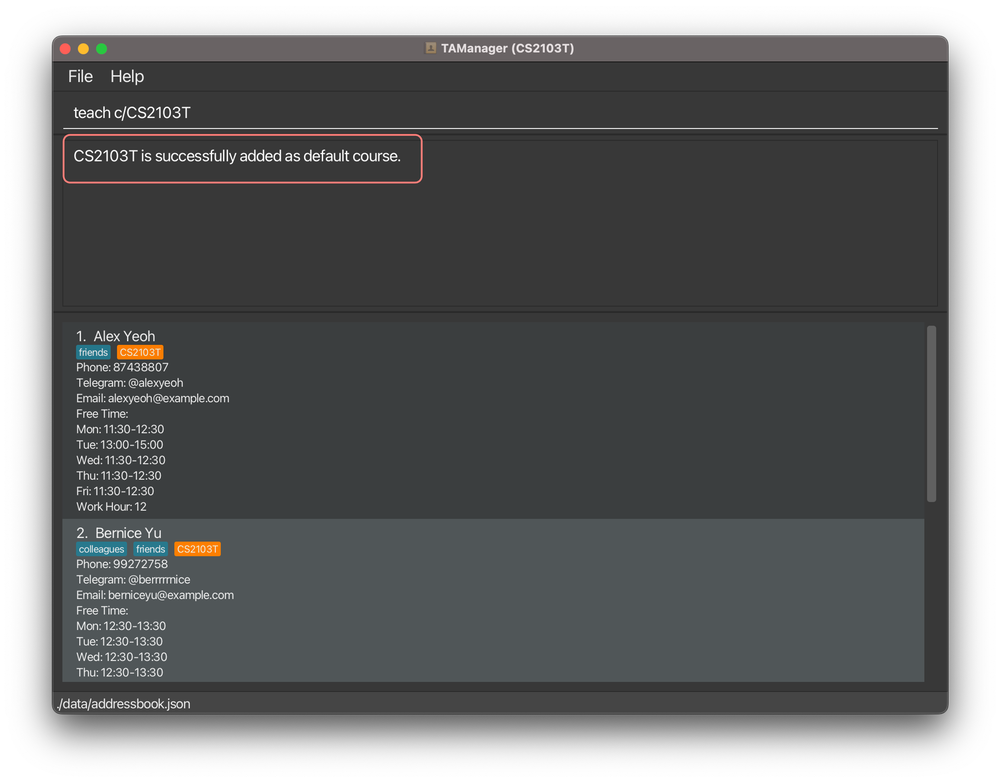

Teaching Assistant Manager (TAManager) is a desktop application for managing teaching assistants (TAs), optimized for use via a Command Line Interface (CLI) while still having the benefits of a Graphical User Interface (GUI). If you can type fast, TAM can help you manage your teaching assistant tasks more efficiently than traditional GUI apps.

* Table of Contents
{:toc}

---

## Quick Start

1. Ensure you have Java `11` or above installed on your computer.

2. Download the latest `TAManager.jar` from [here](https://github.com/AY2324S1-CS2103T-T10-1/tp/releases).

3. Copy the file to the folder you want to use as the home folder for your Teaching Assistant Manager.

4. Open a command terminal, `cd` into the folder where you placed the jar file, and use the `java -jar TAManager.jar` command to run the application.
   A GUI similar to the one below should appear in a few seconds. Note how the app contains some sample data.
   

5. Type the command in the command box and press Enter to execute it. For example, typing `help` and pressing Enter will open the help window.
   Here are some example commands you can try:

   - `list`: Lists all teaching assistants.
   - `add n/Snowball p/98765432 e/snowball@example.com tele/@snowball from/10:00 to/12:00 t/fulltime c/CS1231S h/10`: Adds a teaching assistant named Snowball to the list.
   - `delete 3`: Deletes the 3rd teaching assistant shown in the current list.
   - `clear`: Deletes all teaching assistants.
   - `exit`: Exits the app.

6. Refer to the [Features](#features) section below for details on each command.

--------------------------------------------------------------------------------------------------------------------

## Features

<div markdown="block" class="alert alert-info">

**:information_source: Notes about the command format:**<br>

* Words in `UPPER_CASE` are the parameters to be supplied by the user.<br>
  e.g. in `add n/NAME`, `NAME` is a parameter which can be used as `add n/John Doe`.

* Items in square brackets are optional.<br>
  e.g. `n/NAME [t/TAG]` can be used as `n/John Doe t/friend` or as `n/John Doe`.

* Items with `…`​ after them can be used multiple times including zero times.<br>
  e.g. `[t/TAG]…​` can be used as ` ` (i.e. 0 times), `t/friend`, `t/friend t/family` etc.

* Parameters can be in any order.<br>
  e.g. if the command specifies `n/NAME p/PHONE_NUMBER`, `p/PHONE_NUMBER n/NAME` is also acceptable.

* Extraneous parameters for commands that do not take in parameters (such as `help`, `list`, `exit` and `clear`) will be ignored.<br>
  e.g. if the command specifies `help 123`, it will be interpreted as `help`.

* If you are using a PDF version of this document, be careful when copying and pasting commands that span multiple lines as space characters surrounding line-breaks may be omitted when copied over to the application.
</div>

### Viewing help : `help`

Shows a message explaining how to access the help page.

Format: `help`


### Adding a Teaching Assistant: `add`

You can add a new teaching assistant to TAManager.

Format: `add n/NAME p/PHONE e/EMAIL tele/TELEGRAM [t/TAG]... [c/COURSE_CODE]... h/HOUR`

- `NAME` should be a string.
- `PHONE` should be a 3-10 digits integer.
- `EMAIL` should contain "@".
- `TELEGRAM` should be between 5-32 characters and start with "@", and it cannot contain any special characters except underscore.
- `TAG` should be an alphanumeric string without spaces.
- `COURSE_CODE` should start with 2-3 alphabets, followed by 4 numbers, and optionally end with an alphabet.
- `HOUR` should be an integer.

Example:
`add n/ Rayner Toh p/93812311 e/rayner@example.com tele/@raynertjx t/parttime c/CS2103T h/4` will add a new teaching assistant named Rayner Toh to TAManager.


When the command succeeds:

```
New teaching assistant added: Rayner Toh; Phone: 93812311; Email: rayner@example.com; Telegram: @raynertjx; 
Free Time:  Tags: [parttime]; 
Courses:
Name: Software Engineering
Lessons: [CS2103T Lecture 10:00-12:00, CS2103T Tutorial 10:00-12:00, CS2103T Laboratory 10:00-12:00]; 
Work Hour: 4
```

When the command fails:

- Incorrect format (e.g., missing information): `Invalid command format!`
- Duplicate input (the TA is already in the address book): `This TA has been registered.`
- Invalid telegram handle: `Telegram handle should be between 5-32 characters and start with @, and it cannot contain any special characters except underscore.`
- Invalid course code: `Course codes should have 2-3 alphabets, followed by 4 digits,
and optionally end with an alphabet.`
- Invalid free time: `TA's free time should have a start and end time in HH:mm format`
- Invalid work hour: `Hour should only be positive integers and should be less than 9999`

### Editing a Teaching Assistant: `edit`

You can change the details of a teaching assistant in TAManager.

Format: `edit INDEX [n/NAME] [p/PHONE] [e/EMAIL] [tele/TELEGRAM] [t/TAG]... [c/COURSE_CODE]... [h/HOUR]`

-  At least one field to edit must be provided.
- `NAME` should be a string.
- `PHONE` should be a 3-10 digits integer.
- `EMAIL` should contain "@".
- `TELEGRAM` should be between 5-32 characters and start with "@", and it cannot contain any special characters except underscore.
- `TAG` should be an alphanumeric string without spaces.
- `COURSE_CODE` should start with 2-3 alphabets, followed by 4 numbers, and optionally end with an alphabet.
- `HOUR` should be an integer.

Example: `edit INDEX tele/@raynertohjingxiang`


When the command succeeds:

```
Edited Teaching Assistant: Rayner Toh; Phone: 93812311; Email: rayner@example.com; Telegram: @raynertohjingxiang; 
Free Time: 
Mon: 08:00-12:00
Tue: 08:00-12:00
Wed: 08:00-12:00
Thu: 08:00-12:00
Fri: 08:00-12:00
Tags: [parttime]; 
Courses:
Name: Software Engineering
Lessons: [CS2103T Lecture 10:00-12:00, CS2103T Tutorial 10:00-12:00, CS2103T Laboratory 10:00-12:00]; 
Work Hour: 4
```

When the command fails:

- Incorrect format (e.g., missing information): `Invalid command format!`
- Duplicate input (the TA is already in the address book): `This TA has been registered.`
- Invalid telegram handle: `Telegram handle should be between 5-32 characters and should start with @, and it cannot contain any special characters except underscore.`
- Invalid course code: `Course codes should have 2-3 alphabets, followed by 4 digits,
  and optionally end with an alphabet.`
- Invalid free time: `TA's free time should have a start and end time in HH:mm format`
- Invalid work hour: `Hour should only be positive integers and should be less than 9999`

### Removing a Teaching Assistant: `delete`

You can remove a specified teaching assistant from TAManager.

Format: `delete INDEX`

- Deletes the teaching assistant at the specified `INDEX`.
- The index refers to the index number shown in the displayed TA list.
- The index must be a positive integer (1, 2, 3, ...).

Examples:

- `list` followed by `delete 2` deletes the 2nd teaching assistant in the address book.
- `find n/Betsy` followed by `delete 1` deletes the 1st teaching assistant in the results of the `find` command.


When the command succeeds:

```
Deleted Teaching Assistant: Rayner Toh; Phone: 93812311; Email: rayner@example.com; Telegram: @raynertohjingxiang; 
Free Time: 
Mon: 08:00-12:00
Tue: 08:00-12:00
Wed: 08:00-12:00
Thu: 08:00-12:00
Fri: 08:00-12:00
Tags: [parttime]; 
Courses:
Name: Software Engineering
Lessons: [CS2103T Lecture 10:00-12:00, CS2103T Tutorial 10:00-12:00, CS2103T Laboratory 10:00-12:00]; 
Work Hour: 4
```

When the command fails:

- Incorrect format (missing index or index is not a positive integer): `Invalid command format!`
- Index does not correspond to a TA: For example, there are only 5 TAs but the user tried to delete a TA at index 6

  `The person index provided is invalid`

### Finding a Teaching Assistant: `find`

You can find specific teaching assistants using various search parameters.

Format: `find PREFIX KEYWORD [MORE_KEYWORDS]`

- You can search by name, course or free time, using the prefixes `n/`, `c/` or `d/ from/ to/` respectively.
- The name prefix `n/` allows for multiple keywords to be used, separated by spaces. e.g. `find n/Alex Bernice`.
- The course prefix `c/` and free time prefix `d/ from/ to/` allows for one keyword to be used, separated by spaces.
e.g. `find c/CS2103T` or `find d/1 from/10:00 to/12:00`.
- For the free time, all three prefixes `d/ from/ to/` must be present and all respective parameters need to be correctly given.
- The search is case-insensitive. e.g `alex` will match `Alex`, `cs1231s` will match `CS1231S`.
- Only full words will be matched e.g. `Alex` will not match `Alexis`, `cs1231` will not match `cs1231s`.
- You can apply multiple search filters to narrow down the search results, through including multiple filters in 
one command.
- Teaching assistants matching all the search parameters will be returned.
- The search filters are applied to the original list of TAs, not the current view of TAs.

Examples:

- `find n/Alex` returns all teaching assistants with names containing `alex` (e.g. `Alex Yeoh`).
- `find c/cs1231s` returns all teaching assistants that are teaching `cs1231s`.
- `find d/1 from/10:00 to/12:00` returns all teaching assistants that are free on `Monday` from `10:00` to `12:00`.
- `find n/Alex c/cs1231s` returns all teaching assistants with names containing `alex` and are teaching `cs1231s`.
- `find c/cs2103t d/1 from/10:00 to/12:00` returns all teaching assistants that are teaching `cs2103t` and are free on `Monday` from `10:00` to `12:00`.


When the command succeeds:

```
Filters applied: [filters applied by the user]
[number of TAs found] persons listed!
```

When the command fails:

- Incorrect format (missing prefix or parameter): `Invalid command format!`

### Viewing Teaching Assistants: `list`

You can view the list of all teaching assistants in TAManager.

Format: `list`


When the command succeeds:

```
Listed all teaching assistants
[list of TAs]
```

### Updating Hours for All TAs in View: `hour`

You can add hours to all teaching assistants in the current list.

Format: `hour HOUR`

- This command update ths hour field for all TAs in view, by adding the `HOUR` value to their current values. This `HOUR` value can be both negative and positive.
- This command can be applied after the `find` command. e.g First type `find c/ CS2103T` will find all TAs with course
`CS2103T`, then type `hour 6` will add 6 hours to all `CS2103T` TAs only, other TAs will not be updated.
- The resulting working hour after updating should still be within range of 0-9999.

Examples:

- `hour 4` will add 4 hours to all TAs in the address book if you are at the default view of all TAs.
- `find c/CS1231S` then `hour 4` will add 4 hours to all `CS1231S` TAs and other TAs will not be affected.


When the command succeeds:

```
Hour updated to all TAs identified!
```

When the command fails:

- Invalid command format (updated new hour is invalid, either below 0 or above 9999): `Invalid command format!`

### Edit free time for a teaching assistant: `editft`

You can edit the free time on a specified day for a specific teaching assistant.

Format: `editft INDEX d/DAY from/FROM to/TO`

- This command update ths time interval for the TA at the specified `INDEX` for weekday `DAY`.
- Weekday `DAY` should be between 1 and 5, inclusive, and `FROM` and `TO` should be in "HH:SS" format and `FROM` time should be before `TO` time.
- All three prefixes must be present and all respective parameters need to be correctly given for the command to be executed.

Examples:

- `editft 1 d/2 from/13:00 to/15:00` will update the free time of the TA with index 1 by setting his Tuesday free time to be 13:00 to 15:00.


When the command succeeds:

```
Edited Teaching Assistant: [Details of TA specified]
```

When the command fails:

- Incorrect format (missing prefix or parameter, or `DAY` out of range, or invalid `FROM` or `TO` format): `Invalid command format!`
- Index out of range: `The person index provided is invalid`

### Viewing course information : `course`

You can view the information for a specific course and its tutorial timings.

Format: `course c/COURSE_CODE`

Example: `course c/CS2103T` returns the course information and tutorial timings for CS2103T.


When the command succeeds:
```
Course: CS2103T Software Engineering
CS2103T Lecture 10:00-12:00
CS2103T Tutorial 10:00-12:00
CS2103T Laboratory 10:00-12:00
```

### Adding a default course : `teach`

You can add a default course to TAManager.

The default course is usually the course that you are currently teaching.


Format: `teach c/COURSE_CODE`

Expected outcome:
- Updates the name of the window with the default course.
- Filters the list of TAs teaching under the course automatically.
- The default course is saved even after you close the application. 
- The next time you open the application, the list of TAs will be automatically filtered based on your default course.

Example: `teach c/CS2103T` sets the default course to the course CS2103T.



When the command succeeds:

```CS2103T is successfully added as default course.```

When the command fails:
- Incorrect format (e.g., missing information): `Invalid command format!`
- Invalid course code: `Course codes should have 2-3 alphabets, followed by 4 digits,
  and optionally end with an alphabet.`
- Valid course code, but course not found: `Course not found.`

### Reset the default course : `clearteach`

You can reset the default course in TAManager.

This will revert the changes made by the `teach` command.

If no default course is set, the command will execute successfully but nothing will happen.

Example: `clearteach`


When the command succeeds:

```Default course has been cleared!```

### Clearing all entries : `clear`

You can clear all entries from TAManager.

Format: `clear`

### Exiting the program : `exit`

Exits the program.

Format: `exit`

### Saving the data

TAManager data are saved in the hard disk automatically after any command that changes the data. There is no need to save manually.

### Editing the data file

TAManager data are saved automatically as a JSON file `[JAR file location]/data/addressbook.json`. Advanced users are welcome to update data directly by editing that data file.

<div markdown="span" class="alert alert-warning">:exclamation: **Caution:**
If your changes to the data file makes its format invalid, AddressBook will discard all data and start with an empty data file at the next run. Hence, it is recommended to take a backup of the file before editing it.
</div>

--------------------------------------------------------------------------------------------------------------------

## FAQ

**Q**: How do I transfer my data to another computer?<br>
**A**: Install the app in the other computer and overwrite the empty data file it creates with the file that contains the data of your previous TAManager.

--------------------------------------------------------------------------------------------------------------------

## Known issues

1. **When using multiple screens**, if you move the application to a secondary screen, and later switch to using only the primary screen, the GUI will open off-screen. The remedy is to delete the `preferences.json` file created by the application before running the application again.

--------------------------------------------------------------------------------------------------------------------

## Command summary

| Action         | Format, Examples                                                                                                                                                                                           |
|----------------|------------------------------------------------------------------------------------------------------------------------------------------------------------------------------------------------------------|
| **Add**        | `add n/NAME p/PHONE e/EMAIL tele/TELEGRAM [t/TAG]... [c/COURSE_CODE]... h/HOUR` <br> e.g. `add n/Snowball p/98765432 e/snowball@example.com tele/@snowball from/10:00 to/12:00 t/fulltime c/CS1231S h/10`  |
| **Clear**      | `clear`                                                                                                                                                                                                    |
| **ClearTeach** | `clearteach`                                                                                                                                                                                               |
| **Course**     | `course c/[COURSE_CODE]`<br> e.g. `course c/CS2103T`                                                                                                                                                       |
| **Delete**     | `delete INDEX`<br> e.g. `delete 3`                                                                                                                                                                         |
| **Edit**       | `add n/NAME p/PHONE e/EMAIL tele/TELEGRAM [t/TAG]... [c/COURSE_CODE]... h/HOUR` <br> e.g. `edit n/Snowball p/98765432 e/snowball@example.com tele/@snowball from/10:00 to/12:00 t/fulltime c/CS1231S h/10` |
| **Editft**     | `editft INDEX d/DAY from/FROM to/FROM` <br> e.g. `editft 1 d/2 from/12:30 to/13:30`                                                                                                                        |
| **Exit**       | `exit`                                                                                                                                                                                                     |
| **Find**       | `find PREFIX KEYWORD [MORE_KEYWORDS]`<br> e.g. `find n/Alex`, `find c/cs1231s`, `find from/10:00 to/12:00`, `find n/Alex c/cs1231s`, `find c/cs2103t from/10:00 to/12:00`                                  |
| **Help**       | `help`                                                                                                                                                                                                     |
| **Hour**       | `hour INTEGER`<br> e.g., `hour 2`                                                                                                                                                                                                   |
| **List**       | `list`                                                                                                                                                                                                     |
| **Teach**      | `teach c/[COURSE_CODE]`<br> e.g. `teach c/CS2103T`                                                                                                                                                         |

