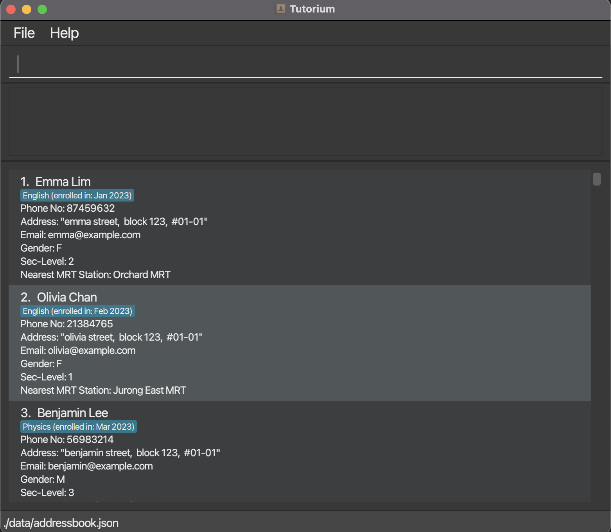
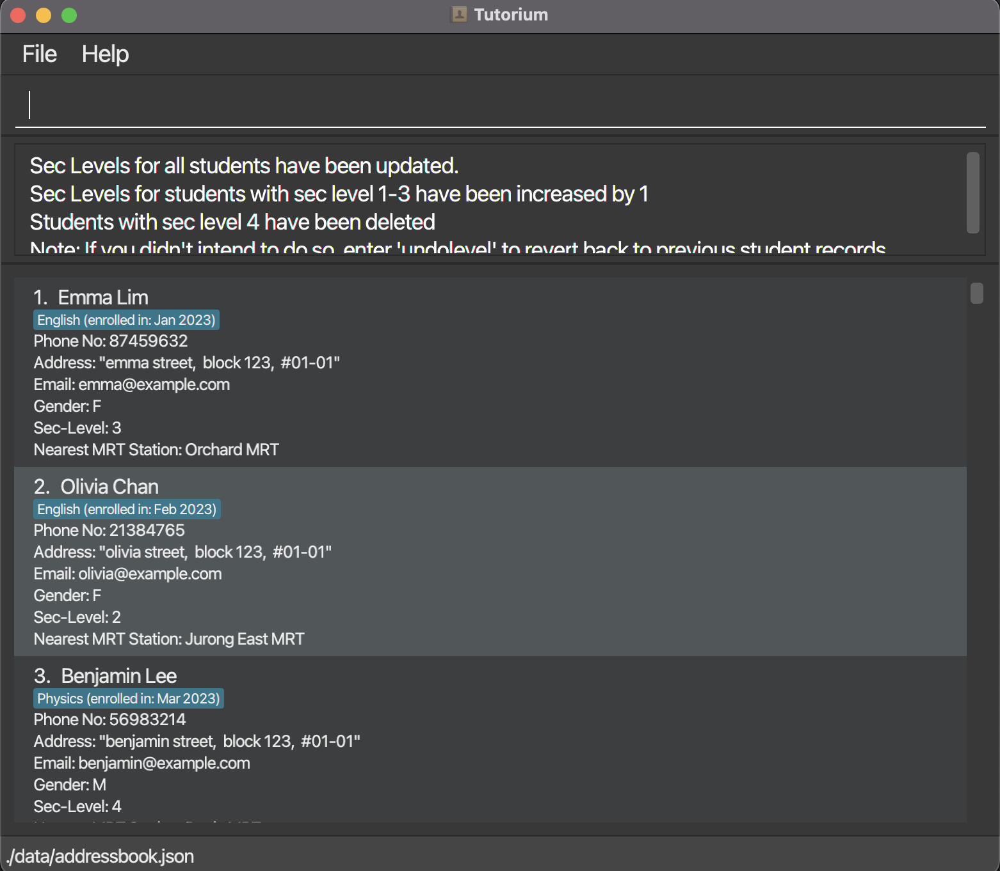
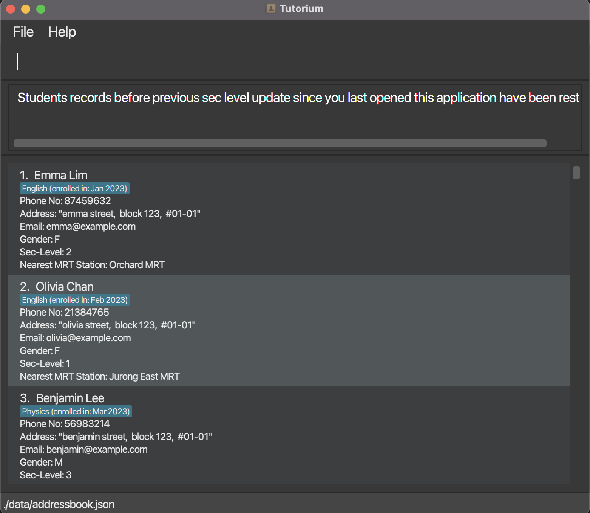
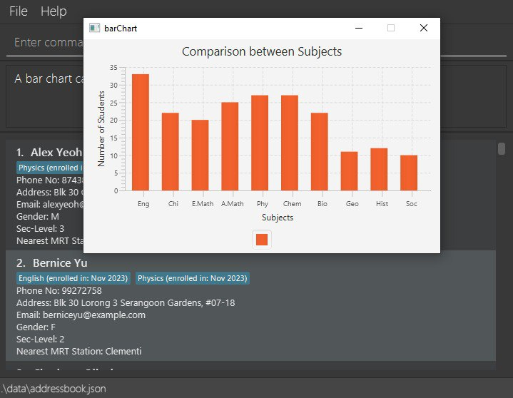

# Tutorium User Guide

Welcome to Tutorium! Tutorium is a **desktop application for tuition centre administrative staff** to conduct data analysis for the planning of marketing strategies. Users can interact with it using a Command Line Interface (CLI), and it has a Graphical User Interface(GUI) created with JavaFX.

Currently, Tutorium caters to the needs of tuition centre administrative staff under the O-Level and IP systems in Singapore, and supports adding data of students from Secondary 1 up to Secondary 4.

<!-- * Table of Contents -->
<page-nav-print />

--------------------------------------------------------------------------------------------------------------------

## Quick start

1. Ensure you have Java `11` or above installed in your Computer.

1. Download the latest `tutorium.jar` file from [here](https://github.com/AY2324S1-CS2103T-W13-2/tp/releases).

1. Copy the file to the folder you want to use as the _home folder_ for the Tutorium app.

1. Open a command terminal, `cd` into the folder you put the jar file in, and use the `java -jar tutorium.jar` command to run the application. 
   A GUI similar to the below should appear in a few seconds. Note that the app contains some sample data. 
   

1. Type the command in the command box and press Enter to execute it. e.g. typing **`help`** and pressing Enter will open the help window. 
   Some example commands you can try:

    * `list` : Lists all students.

    * `add n/John Doe p/12345678 e/johnd@example.com a/John street, block 123, #01-01 g/M l/2 m/KR mrt s/English` : Adds a student named `John Doe` to the Address Book.

    * `delete John Doe` : Deletes the student with the matching name in the current list.

    * `clear` : Deletes the data of all students.

    * `exit` : Exits the app.

1. Refer to the [Features](#features) below for details of each command.

--------------------------------------------------------------------------------------------------------------------

## Features

<box type="info" seamless>

**Notes about the command format:** 

* Words in `UPPER_CASE` are the parameters to be supplied by the user. 
  e.g. in `add n/NAME`, `NAME` is a parameter which can be used as `add n/John Doe`.

* Items in square brackets are optional. 
  e.g `n/NAME [t/TAG]` can be used as `n/John Doe t/friend` or as `n/John Doe`.

* Items with `…`​ after them can be used multiple times including zero times. 
  e.g. `[t/TAG]…​` can be used as ` ` (i.e. 0 times), `t/friend`, `t/friend t/family` etc.

* When providing parameters starting with any of the prefixes used by Tutorium `(n/, p/, e/, a/, g/, l/, n/, s/ and d/)` to fields,
  users are discouraged from adding spaces between the prefix for that field and the input value. This is because the addition
  of spaces will cause Tutorium to interpret the prefix in the input value as an actual prefix for a field and not as part of the input value.
  e.g. Filtering students with the address `e/house` should be done with the command `filter a/e/house` rather than `filter a/ e/house`.

* Parameters can be in any order. 
  e.g. if the command specifies `n/NAME p/PHONE_NUMBER`, `p/PHONE_NUMBER n/NAME` is also acceptable.

* Extraneous parameters for commands that do not take in parameters (such as `help`, `list`, `exit` and `clear`) will be ignored. 
  e.g. if the command specifies `help 123`, it will be interpreted as `help`.

* If you are using a PDF version of this document, be careful when copying and pasting commands that span multiple lines as space characters surrounding line-breaks may be omitted when copied over to the application.
  </box>

### Viewing help : `help`

Displays the URL for the User Guide.

Format: `help`

### Adding a student's data: `add`

Adds a student's data to the address book.

Format: `add n/NAME p/PHONE_NUMBER e/EMAIL a/ADDRESS g/GENDER l/SEC_LEVEL m/MRT STATION [s/SUBJECT]… [d/ENROL_DATE]…​`

* The accepted range of secondary school levels is from Secondary 1 to Secondary 4.
* When adding subjects, if no enrol date is provided, the date on which the command was executed will be applied to all subjects listed by default.
  * If only 1 enrol date is provided, the same enrol date will be applied to all subjects listed.
  * If the number of enrol dates provided is the same as the number of subjects listed, the order in which enrol dates are applied to subjects will be the same as the order in which they are provided.
  * Any mismatch between the number of subjects and the number of enrol dates provided (other than the cases listed above) will result in an error.
* Simply providing 1 enrol date without providing any corresponding subject(s) will result in an error.

Examples:
* `add n/John Doe p/12345678 e/johnd@example.com a/John street, block 123, #01-01 g/M l/2 m/KR mrt s/Chemistry s/Physics`
* `add n/Betsy Crowe p/87654321 e/betsycrowe@example.com a/Newgate Prison g/F l/2 m/KR mrt s/Chinese`
   
  

### Importing data from .csv file: `import`

Imports students' data into Tutorium.
1. Move your .csv file into the folder containing Tutorium.
2. Enter the import command with the following format (shown below).

Format: `import FILENAME.csv`

<box type="tip" seamless>

**Note:**
- The columns should be "Name", "Phone", "Email", "Address", "Gender", "Sec level", "Nearest Mrt Station", "Subject", "Enrol Date"
- Enrol Date can be left blank
- There must be a Enrol Date header after Subject header
- Example:

</box>

Examples:
* `import student_data.csv`
   
  

### Editing a student's data : `edit`

Edits an existing student's data in the address book.

Format:
1. `edit INDEX prefix/[field name]` or `edit NAME prefix/[field name]` (you can either specify the student you want to edit by index or his/her name)
2. `edit INDEX prefix1/[field1] prefix2/[field2]`  or `edit NAME prefix/[field] prefix/[field] prefix/[field]` (change multiple fields)

* At least one of the optional fields must be provided.
* Existing values will be updated to the input values.
* The accepted range of secondary school levels is from Secondary 1 to Secondary 4.
* When editing subjects, if no enrol date is provided, the date on which the command was executed will be applied to all subjects listed by default.
  * If only 1 enrol date is provided, the same enrol date will be applied to all subjects listed.
  * If the number of enrol dates provided is the same as the number of subjects listed, the order in which enrol dates are applied to subjects will be the same as the order in which they are provided.
  * Any mismatch between the number of subjects and the number of enrol dates provided (other than the cases listed above) will result in an error.
* Simply providing 1 enrol date without providing any corresponding subject(s) will result in an error.

Examples:
*  `edit John Doe n/Joe` specify that you want to edit John Doe's name to "Joe".
*  `edit 2 n/joey e/joey123@example.com` Edits the student (with index 2)'s name and email to be `joey` and `joey123@example.com`.
    
   

### Searching for data : `search`

Search for people whose names contain the given keyword.

Format: `search KEYWORD`

* The search is case-insensitive. e.g `joe` will match `Joe`
* Only the name is searched.
* Partial words can be matched. e.g. `Han` will match `Hans`
* All students matching the keyword will be returned (i.e. `OR` search).
  e.g. `Alfred` will return `alfred`, `Alfred Tan`

Examples:
* `search Lee` returns `Benjamin Lee` and `Eva Lee` 
   
  

### Deleting data : `delete`

Deletes data of a specified student.

Format: `delete [NAME]` or `delete [INDEX]`

* Deletes the student with the specified `NAME` or `[INDEX]`.
* `NAME`: The deletion is case-insensitive, but it must be the full name of the student.

Examples:
* `delete John Doe`
* `delete 1`
   
  

### Update sec level : `uplevel`, `undolevel`

- `uplevel` : update the sec levels for all students and remove all sec level 4 students.
  - `undolevel` : revert the student record to be before previous sec level update.
  Format: `uplevel`, `undolevel`

* Command is case-sensitive
* No prefix is required, only the command.
* Note that `undolevel` feature is provided in case when the user accidentally enter `uplevel` AND the user do not close application immediately.
* That means after doing `uplevel`, followed by any other `edit`, `add` or `delete` commands etc and then do `undolevel`, the commands in between will be invalid because the students records are revert back to before previous `uplevel`.
* `undolevel` can be performed only when there is / are `uplevel` performed (and has not been undone) since user open application.

Examples: `uplevel`, `undolevel`

  

  

  

### Filtering data : `filter`

Shows the list of students data that fulfills all given conditions.

Format: `filter prefix/FIELD_VALUE [MORE FIELDS]`

* FIELD_VALUE: Case-sensitive string.
* The student list shows only the students whose data fulfills all given conditions.
* At least one condition must be provided.
* All fields can be filtered except for the name and enrol date fields. When looking for students with a certain name or keyword in their name, refer to the section on the search feature.

Examples:
* `filter g/F s/English s/Physics`
* `filter s/Physics` returns all students taking the Physics subject  
   
  

### Sorting data : `sort`

Sort the list of students data by name.

Format: `sort in/[DESCRIPTION]`

* `DESCRIPTION` should be `ASC` or `DESC`, non-case-sensitive.

Examples:
* `sort in/ASC`  
  

### Clearing all entries : `clear`

Clears all entries from the address book.

Format: `clear`

### Exiting the program : `exit`

Exits the program.

Format: `exit`

### Showing statistical table
Showing a table either categorized by gender, sec level or subject.

Format: `table PREFIX`

* FIELD_VALUE is not needed.
* prefix is case-sensitive.
* Exactly one of `g/`, `l/`, `s/` or `d/yyyy` must be provided.
* For `d/yyyy`, `yyyy` represents year in 4 digits.

Examples:
* `table g/` will show a table categorized by student gender.
* `table l/` will show a table categorized by student sec level.
* `table s/` will show a table categorized by student subject.
* `table d/2023` will show a table categorized by months in year 2023.

### Showing bar chart
Showing a bar chart either categorized by gender, sec level or subject.

Format: `bar PREFIX`

* FIELD_VALUE is not needed.
* prefix is case-sensitive.
* Exactly one of `g/`, `l/`, or `s/` must be provided.
* For `d/yyyy`, `yyyy` represents year in 4 digits.

Examples:
* `bar g/` will show a bar chart categorized by student gender.
* `bar l/` will show a bar chart categorized by student sec level.
* `bar s/` will show a bar chart categorized by student subject.
* `bar d/2023` will show a bar chart categorized by months in year 2023.

Below is the chart generated after entering `bar l/`.

  

### Showing line chart
Showing a line chart describing number of students enrolled in each month in a specific year.

Format: `trend y/YEAR`
* {year} is a 4 digit number representing year
* {} is not required

Examples:
* `trend y/2023` will show a line chart describing number of students enrolled
in each month in year 2023.

Below is the chart generated after typing `trend y/2023`
   

### Export visual representation : `export`

Export the statistical table or bar chart into PNG format.

Format: `export v/VISUAL`

* `VISUAL` should be `TABLE` or `BAR`, non-case-sensitive.
* `TABLE` indicates exporting the table created, while `BAR` indicates exporting the bar chart created.
* A table should be created before exporting, this applies to exporting bar chart as well.
* The visual representation exported will be the one that is recently created.
  * i.e. if two bar charts are created consecutively, `export v/BAR` will export the most recent bar chart created (the 2nd bar chart)

Examples:
* `export v/TABLE`  

### Saving the data

Tutorium data are saved in the hard disk automatically after any command that changes the data. There is no need to save manually.

### Editing the data file

Tutorium data are saved automatically as a JSON file `[JAR file location]/data/addressbook.json`. Advanced users are welcome to update data directly by editing that data file.

<box type="warning" seamless>

**Caution:**
If your changes to the data file makes its format invalid, Tutorium will discard all data and start with an empty data file at the next run.  Hence, it is recommended to take a backup of the file before editing it.
</box>

### Archiving data files `[coming in v2.0]`

_Details coming soon ..._

--------------------------------------------------------------------------------------------------------------------

## FAQ

**Q**: How do I transfer my data to another Computer? 
**A**: Install the app in the other computer and overwrite the empty data file it creates with the file that contains the data of your previous Tutorium home folder.

--------------------------------------------------------------------------------------------------------------------

## Known issues

1. **When using multiple screens**, if you move the application to a secondary screen, and later switch to using only the primary screen, the GUI will open off-screen. The remedy is to delete the `preferences.json` file created by the application before running the application again.

--------------------------------------------------------------------------------------------------------------------

## Command summary

Action     | Format, Examples
-----------|----------------------------------------------------------------------------------------------------------------------------------------------------------------------
**Add**    | `add n/NAME p/PHONE_NUMBER e/EMAIL a/ADDRESS g/GENDER l/SEC_LEVEL m/MRT STATION [s/SUBJECT]…​`   e.g., `add n/John Doe p/98765432 e/johnd@example.com a/John street, block 123, #01-01 s/Chemistry`
**Import** | `import FILENAME.csv`  e.g., `import student_data.csv`
**Edit**   | `edit INDEX prefix1/[field1] prefix2/[field2]`    or `edit NAME prefix/[field] prefix/[field] prefix/[field]`   e.g., `edit John Doe n/Joe e/johndoe@example.com t/English`
**Search** | `search [KEYWORD]`  e.g., `search Lee`
**Delete** | `delete INDEX`  or `delete NAME`   e.g., `delete Joe`
**Update** | `uplevel`  or `undolevel`  
**Filter** | `filter prefix/FIELD_VALUE [MORE FIELDS]`   e.g., `filter g/F s/English s/Physics`
**Sort**   | `sort in/ [DESCRIPTION]`   e.g., `sort in/ ASC`
**Clear**  | `clear`
**Show Table** | `table prefix/`  or `table d/YEAR`  
**Show Bar Chart** | `bar prefix/`  or `bar d/YEAR`  
**Show Line Chart** | `trend y/{year}`
**Help**   | `help`
