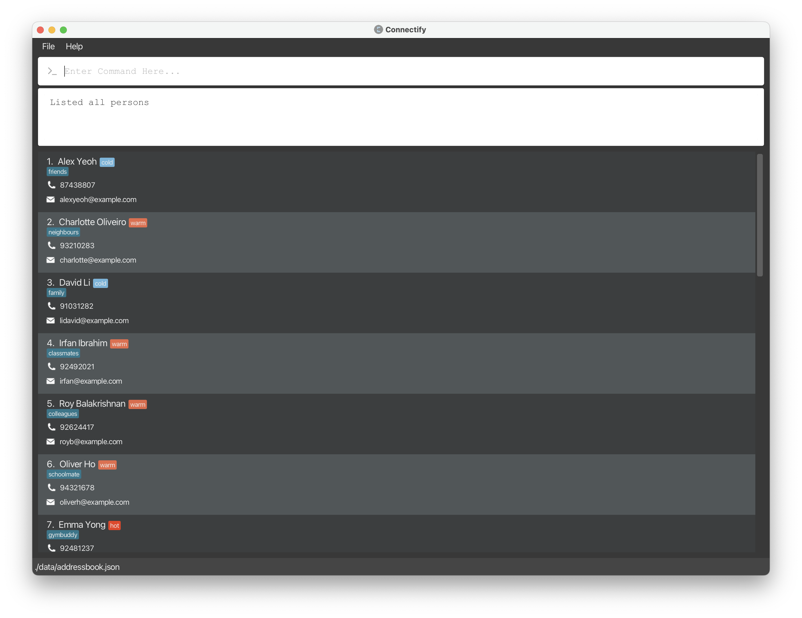

# Welcome to Connectify!


Connectify is a **desktop app for managing clients, optimized for use via a Command Line Interface** (CLI). Connectify helps salespersons manage their clients information records and data, boosting their efficiency in building customer relationships! If you can type fast, Connectify can get your client management tasks done faster than traditional GUI apps.

In this user guide, you will find instructions on how to install Connectify and use its many features to manage your clients.

Choose a topic from the table of contents below to find out how to manage your clients using Connectify!

# Table of Contents
* Table of Contents
{:toc}


--------------------------------------------------------------------------------------------------------------------

# Quick start

1. Ensure that you have Java 11 installed on your Computer.

2. Download the latest `connectify.jar` from our [releases](https://github.com/AY2324S1-CS2103T-F11-4/tp/releases/).

3. Copy the file over to the folder you would want to use as the home folder for Connectify. An option is to create a folder named `Connectify` in your`Desktop` and place the file there.

4. Open the command terminal.
   
    a. For Windows, you can open `Command Prompt` from your list of installed applications.

    b. For macOS and other operating systems, open the `Terminal` app.

5. Change the directory of the terminal by using the `cd` command.

    a. For example, if I saved my file at `C:\Users\John\Desktop\Connectify\connectify.jar`, run the command `cd C:\Users\John\Desktop\Connectify` in your terminal.

6. Run `java -jar connectify.jar` to start the application.

7. A window similar to the one below should appear in a few seconds, containing sample data.

   <figure>
       
       <figcaption align="center">
           <em>The GUI you see on start-up may be slightly different due to differences in data.</em>
       </figcaption>
   </figure>
   <br>
   
8. Type the command in the command box and press `Enter` to execute it.
   
   Some examples you can try:

   - `list`: Lists all client profiles.
   
   - `create n/John Doe p/98765432 e/johnd@example.com a/John street, block 123, #01-01`: Creates a client named `John Doe` in the client list.
   
   - `delete 3`: Deletes the 3rd contact currently shown in the displayed client list.
   
   - `exit`: Exits the app.

9. Refer to [Features](#features) below for more commands and details for each command.

[↑ Back to Table of Contents](#table-of-contents)

--------------------------------------------------------------------------------------------------------------------
# Reading the examples in this user guide

The examples in this guide are formatted with the following conventions:
* **Command** - The command to be typed into the command box.
* **Command word(s)** - Words that specify the type of command to be executed. Written in ***bold italics***, always at the start of a line.
* **Flags** - Indicators to differentiate various parts of the command. Always take the format `$/` followed by a **Parameter**. The `$` varies depending on the type of flag. <br/> E.g., `o/` in ***interaction*** command specifies the **Outcome** of the interaction, while `l/` in ***edit*** command specifies the **Lead** of the client.
* **Parameters** - Component of the command that usually follows a **Flag**. A parameter might be written without a flag for some commands where it is clear what the parameter is referring to. <br/> E.g., `INDEX` following an ***edit*** command specifies the index of the client to be edited.

[↑ Back to Table of Contents](#table-of-contents)

--------------------------------------------------------------------------------------------------------------------

# Features

## Quick notes about the command format
- Everything related to the command is case-sensitive unless otherwise stated.
- Words in `UPPER_CASE` are the parameters to be supplied by the user. <br/> E.g., in `n/NAME`, `NAME` is a parameter which can be used as `n/John Doe`.
- Parameters that are optional are indicated with square brackets `[OPTIONAL]`. <br/> E.g., in `[tg/TELEGRAM]`, `TELEGRAM` is an optional parameter which can be used as `tg/@john_doe` or omitted.
- Parameters specified in the command can be written in any order. <br/> E.g., `n/John Doe tg/@john_doe` is equivalent to `tg/@john_doe n/John Doe`.
- Optional parameters with `...` after the square bracket can be repeated any number of times, including zero. <br/> E.g., in `[tag/TAG]...`, multiple tags can be supplied as `tag/important tag/urgent` or omitted.

## Viewing help: ***help***

Shows a message explaining how to access the user guide.

<figure>
    
    <figcaption align="center">
        <em>Pop-up message that appears after running help.</em>
    </figcaption>
</figure>

## Adding

### Adding a client profile: ***create***

Your job as a salesperson starts with adding a client profile to Connectify. This is a one-time process for each client that has been made simple for you.
Use the ***create*** command to add a client profile.

**Format**
```text
create n/NAME p/PHONE e/EMAIL a/ADDRESS [t/TAG]... [tg/TELEGRAM]
[pf/PROFESSION] [i/INCOME] [d/DETAILS]
```

**Example**
```text
create n/Bernice Yu p/99272758 e/berniceyu@example.com
a/Blk 30 Lorong 3 Serangoon Gardens, #07-18 t/colleagues
t/friends tg/@yuyubern pf/Graphic Designer i/60000
```

<figure>
    
    <figcaption align="center">
        <em>Result of executing the above create command: Bernice Yu's profile is at index 7. Indices may be different.</em>
    </figcaption>
</figure>
<br>

You should directly see the client profile added to the list of clients in the application window. After adding a client profile, you can now perform various operations on the client profile as specified in the next few sections!

### Adding a client interaction: ***interaction***

After adding a client profile, you can now log your interactions with the client.  Use the ***interaction*** command to add an interaction to a client profile.

**Format**
```text
interaction INDEX o/OUTCOME [DETAILS]
```
Where `INDEX` refers to the index of the client profile in the displayed list of clients.

Note that at least one of the `OUTCOME` or `DETAILS` parameters must be provided.

**Examples**
```
interaction 1 o/INTERESTED Meeting with client
```
```
interaction 1 Meeting with client
```

You should directly see the interaction added to the client profile in the application window.

[↑ Back to Table of Contents](#table-of-contents)

--------------------------------------------------------------------------------------------------------------------

## Viewing

Connectify has 2 main views: the dashboard and the list of clients.

The dashboard is a summarized view of all your client interactions and upcoming events. It is useful for you to quickly catch up on your progress and what's coming up.

Sometimes, you may want to view the details of a client profile or the interactions you have had with a client to quickly catch up on the client's profile before contacting them.
Or, you might just want to view the list of clients you have added to Connectify.

This section contains multiple commands that allow you to view various details of your clients that is collated in a single view and collate them in a single place for your convenience.

### Viewing the dashboard: ***dashboard***

Use the ***dashboard*** command to view a summarized information of all your clients and their interactions with you in a single place.

**Format**
````text
dashboard
````

You should see the dashboard view in the application window.

### Viewing the list of clients: ***list***

You might want to go back to the list of clients you have added to Connectify. Use the ***list*** command to view all clients.

**Format**
```text
list
```

You should then see the list of clients in the application window.

<div markdown="span" class="alert alert-primary">
:bulb: **Tip:**
You can quickly switch between the dashboard and the list of clients using the `dashboard` and `list` commands.
</div>

### Finding a client by name: ***find***

Managing a large number of clients can be difficult. Some of our commands use indexes to refer to a client profile. This might be difficult to remember if you have a large number of clients.

Don't worry, though, we have a solution for you! You can use the ***find*** command to search for a client by name.

**Format**
```text
find NAME
```

You don't need to type the full name of the client. You can type a part of the name and the command will return the index of the first client whose name contains the search term.

Example:
Finding a client with the name "John Doe"
```
find John Doe
```

Example:
Finding a client with the name "Chemmy Lee". Notice that you don't need to type the full name of the client.
```
find Chemmy
```

### Viewing the full details of a client: ***view***

Catching up on the details of a client before contacting them is important. Most of the time, remembering the details of previous interactions with a client is difficult as the data is scattered everywhere.

Well, not anymore! With Connectify, you can view the full details of a client and past interactions in a single place using the ***view*** command.

**Format**
```text
view INDEX
```
where INDEX refers to the index of the client profile in the displayed list of clients.

[↑ Back to Table of Contents](#table-of-contents)

--------------------------------------------------------------------------------------------------------------------

## Editing

### Editing a client profile: ***edit***

Each different client may be marked with different lead (hot, warm, cold) that may change over time.
Not only that, you might find yourself needing to update the details of a client profile. Use the command ***edit*** to edit the specified client profile in your client list.

**Format**
```text
edit INDEX [n/NAME] [p/PHONE] [e/EMAIL] [a/ADDRESS] [t/TAG] [l/LEAD]
[tg/TELEGRAM] [pf/PROFESSION] [i/INCOME] [d/DETAILS]
```

Note that at least one of the optional parameters must be provided.

Example
1. `edit 1 l/HOT`
2. `edit 2 e/berniceyu@gmail.com p/123456789`
3. `edit 3 t/buddies t/relatives`

<figure>
    
    <figcaption align="center">
        <em>Initial state of 4 contacts.</em>
    </figcaption>
</figure>

<figure>
    
    <figcaption align="center">
        <em>Result of running commands (1) to (3).</em>
    </figcaption>
</figure>

[↑ Back to Table of Contents](#table-of-contents)

--------------------------------------------------------------------------------------------------------------------

## Deleting

### Deleting a client profile: ***delete***

Keep the list of clients in Connectify clean by deleting client profiles that are no longer relevant.

Deleting a client profile is easy with the ***delete*** command.

Format: `delete INDEX`

Example:
```
delete 1
```

[↑ Back to Table of Contents](#table-of-contents)

--------------------------------------------------------------------------------------------------------------------

# FAQ [coming soon]


--------------------------------------------------------------------------------------------------------------------

# Known issues [coming soon]

--------------------------------------------------------------------------------------------------------------------

# Command summary

| Action              | Format                                                                                                            | Example                                                                                                                                                              |
|---------------------|-------------------------------------------------------------------------------------------------------------------|----------------------------------------------------------------------------------------------------------------------------------------------------------------------|
| Help                | `help`                                                                                                            | `help`                                                                                                                                                               |
| Add Client          | `create n/NAME p/PHONE e/EMAIL a/ADDRESS [t/TAG] [tg/TELEGRAM] [pf/PROFESSION] [i/INCOME] [d/DETAILS]`            | `create n/Bernice Yu p/99272758 e/berniceyu@example.com a/Blk 30 Lorong 3 Serangoon Gardens, #07-18 t/colleagues t/friends tg/@yuyubern pf/Graphic Designer i/60000` |
| Add Interaction     | `interaction INDEX o/OUTCOME [DETAILS]`                                                                           | `interaction 1 o/INTERESTED d/Client is interested in our products`                                                                                                  |
| View Dashboard      | `dashboard`                                                                                                       | `dashboard`                                                                                                                                                          |                                                                                                                                                        |
| View Client List    | `list`                                                                                                            | `list`                                                                                                                                                               |
| Find Client         | `find NAME`                                                                                                       | `find Chemmy`                                                                                                                                                        |
| View Client Details | `view INDEX`                                                                                                      | `view 1`                                                                                                                                                             |
| Edit Client         | `edit INDEX [n/NAME] [e/EMAIL] [a/ADDRESS] [t/TAG] [l/LEAD] [tg/TELEGRAM] [pf/PROFESSION] [i/INCOME] [d/DETAILS]` | `edit 2 e/berniceyu@gmail.com p/123456789`                                                                                                                           |
| Delete Client       | `delete INDEX`                                                                                                    | `delete 1`                                                                                                                                                           |
| Exit                | `exit`                                                                                                            | `exit`                                                                                                                                                               |

[↑ Back to Table of Contents](#table-of-contents)
