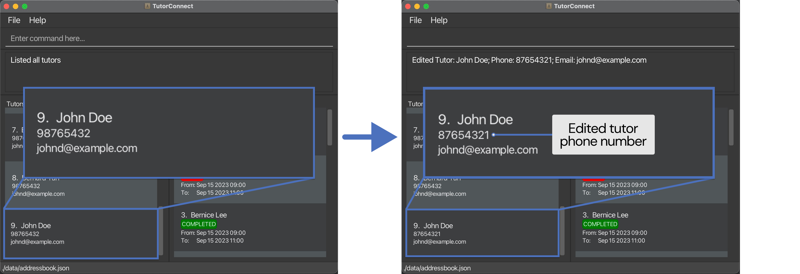
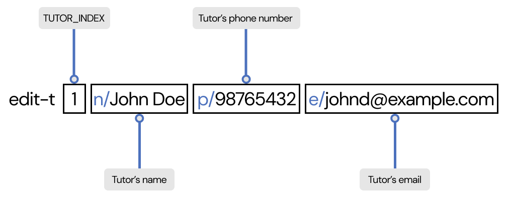
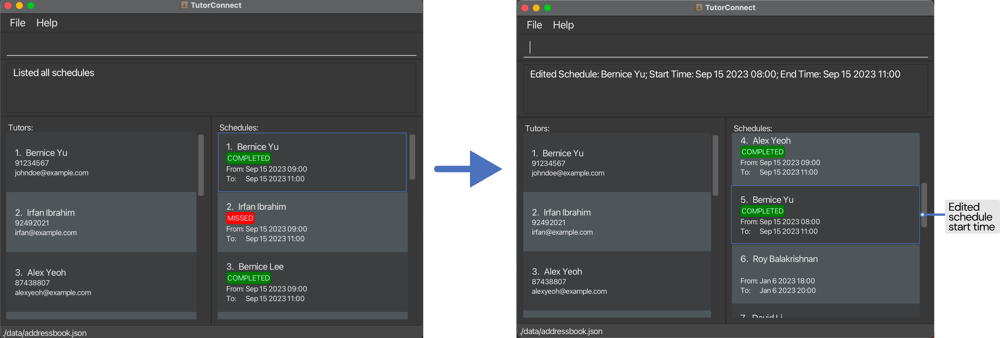
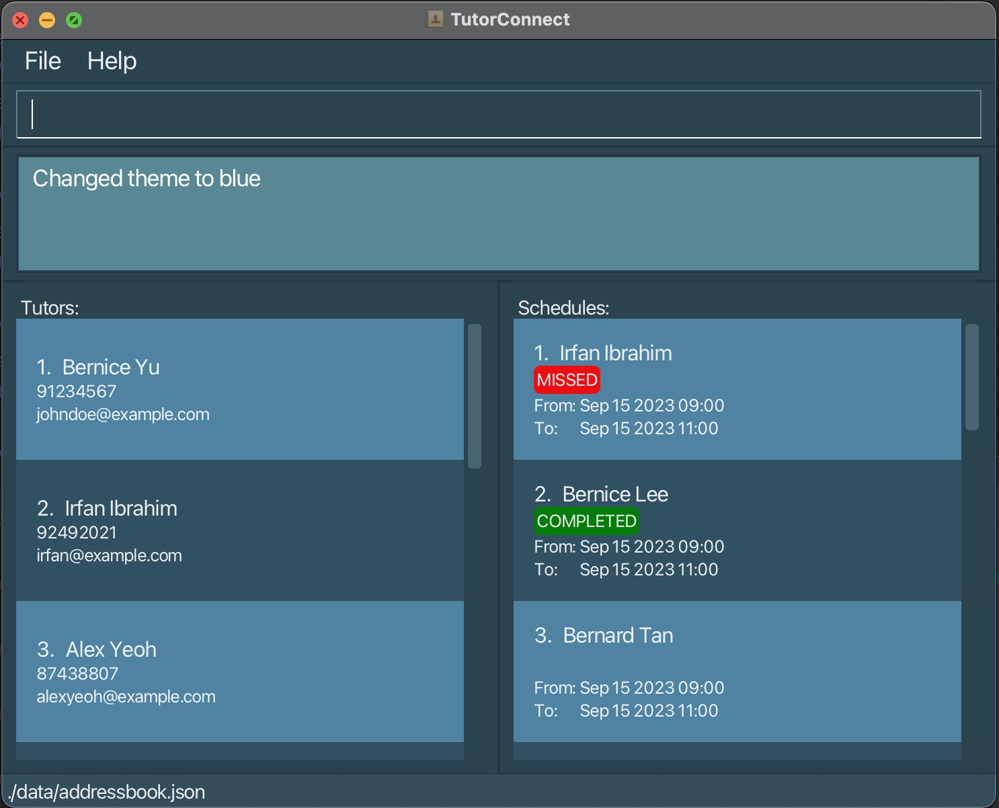

## Welcome to TutorConnect

TutorConnect is an address book made for **tuition centre coordinators** to easily track and schedule tuition classes.

Say goodbye to scheduling conflicts and the complicated process of allocating classes to your tutors!

Here’s an overview of what you can do with TutorConnect:
* Store and edit information about your tutors
* Create and plan your tutor availability and schedule
* View upcoming schedules

Sounds good, right? On top of these functionalities, we believe in bringing you the most efficient scheduling tool. 
TutorConnect is **optimised for users who can type fast** and utilise the [Command Line Interface (CLI)](#glossary) to complete tasks using the keyboard faster than using the mouse.

## Table of Contents
* Table of Contents
{:toc}

## Usage of the User Guide

This User Guide is designed to be used alongside TutorConnect, for you to make the most of the app and get the most
enjoyable experience tracking and scheduling tuition classes.

A warm welcome to TutorConnect! Before we dive into the details, let's get you started with a quick overview of how 
to navigate and use this User Guide successfully.

For **Beginner Users**, we're thrilled to have you onboard! Get started with a [Tutorial](#tutorconnect-tutorial-for-new-users) here.

For **Experienced Users**, thank you for choosing TutorConnect! You may refer to the [Command Summary](#command-summary) here.

### Navigating the User Guide
TutorConnect's User Guide is made with you in mind. It is designed to be user-friendly and easy to navigate. Here are a 
few tips for smooth navigation:
* Hyperlinks: Throughout this guide, you'll find [hyperlinks](#usage-of-the-user-guide) that can take you to related sections or external 
  resources. Click on these links to access additional information or jump to different parts of the guide.
* Back to Top Button: At the end of each section, you'll find a [Back To Top](#table-of-contents) button, to return 
  you to the Table of Contents.

### Common Notation
Throughout this User Guide, you will also find some common notations, to provide you with extra information you may 
need. Look out for these coloured boxes!

**:bulb: Tip** 

`Tips` are used to provide helpful advice, suggestions, or best practices to enhance your experience by making a task easier or more efficient.

**:warning: Warning** 

`Warnings` are used to alert you about potential issues, errors, or risks associated with a task or action. They are essential for preventing mistakes and ensuring safety.

**:information_source: Information** 

`Information` sections provide additional background knowledge or context to help you understand a topic better.

[Back To Top](#table-of-contents)

## Quick Start

Welcome to TutorConnect! We are excited to get you started with a more efficient scheduling method.

1. Ensure you have Java `11` installed in your Computer. To verify, perform the following steps:
    1. Open a terminal. Refer to the following guides on how:
        1. [MacOS](https://support.apple.com/en-sg/guide/terminal/apd5265185d-f365-44cb-8b09-71a064a42125/mac#:~:text=Terminal%20for%20me-,Open%20Terminal,%2C%20then%20double%2Dclick%20Terminal)
        2. [Windows](https://www.howtogeek.com/235101/10-ways-to-open-the-command-prompt-in-windows-10/#:~:text=anywhere%20you%20like.-,Open%20Command%20Prompt%20from%20the%20Run%20Box,open%20an%20administrator%20Command%20Prompt)
    2. Type `java -version` and press Enter.
    3. If it says a version other than 11 or `command not found`, please install Java 11 by following this [guide](https://www.java.com/en/download/help/download_options.html).

2. Download the latest jar file (`TutorConnect.jar`) from our [Github Releases](https://github.com/AY2324S1-CS2103T-T17-3/tp/releases).

3. Move the jar file into a new folder called “TutorConnect”.

4. Double-click the jar file to launch the application.

**:information_source: Mac users** 

If you are a Mac user, you may encounter a warning that says
the jar file cannot be opened because it is from an unidentified developer. To continue:

1. Right-click on the jar file and select `Open With > JavaLauncher (default)`
2. Press Open when prompted

**:warning: Unable to open jar file** 

If the jar file cannot launch on double-click:

1. Open a command terminal (using [Windows](https://www.lifewire.com/open-command-prompt-in-a-folder-5185505) or [Mac](https://support.apple.com/en-sg/guide/terminal/trmlb20c7888/mac#:~:text=On%20your%20Mac%2C%20open%20a,window%3A%20Choose%20Open%20in%20Terminal.)) on the folder where `TutorConnect.jar` is. 
2. Type the following command in the terminal: `java -jar TutorConnect.jar` and hit enter.
3. The command should run and launch the application.

### Navigating the Interface

TutorConnect comes equipped with a [GUI](#glossary) interface that provides visual feedback to you.
Below is a quick overview of the various components of our interface.

| Component        | Description                                                                                | 
|------------------|--------------------------------------------------------------------------------------------|
| Command Box      | You will enter your [commands](#glossary) along with its input here.                       |
| Menu Bar         | Contains relevant buttons for the application.                                             |
| Result Display   | Displays the results of your commands. Any error messages will also be displayed here. | 
| Tutor Details    | Contains information related to the tutor like name, phone number etc.                     |
| Schedule Details | Contains information related to the schedule like assigned tutor, start time etc.          |
| Current Time     | Displays the current date and time.                                                        |

[Back To Top](#table-of-contents)

## TutorConnect Tutorial (for new users)

Hello and welcome to TutorConnect! We're delighted you've chosen our platform to manage your tuition centre's tutors and schedules. 

Before we begin, please ensure that you have viewed the following sections of the guide:
* [Quick Start](#quick-start) to help you get TutorConnect up and running.
* [Navigating the Interface](#navigating-the-interface) to get you familiarised with navigating TutorConnect.

This tutorial aims to guide you through the essential features and functionalities of TutorConnect that you will use 
on a day-to-day basis. You will be adding your first tutor and corresponding schedule!

Click on any of these below to jump to the respective sections of the tutorial!
* [Start](#start)
* [Adding your first tutor](#adding-your-first-tutor)
* [Adding your first schedule](#adding-your-first-schedule)
* [Marking your schedule as completed](#marking-your-schedule-as-completed)

### Start

When you first launch TutorConnect, you will notice that it comes preloaded with sample data for you to experiment with.
You may use the sample data to familiarise yourself with the various [features](#features) that TutorConnect provides.

Once you're ready to start using TutorConnect for your tuition centre, you can easily remove all the sample data:
1. Type `clear` into the command box
2. Hit enter

Yay! Now it's time to get started with TutorConnect!

### Adding your first tutor

Let's say you have a tutor named **John Doe**. He has provided you with his phone number: **9123 4567** and his 
email address: **johndoe@example.com**.

Here is how you would use the [**add-t**](#adding-a-tutor-add-t) command to add John Doe to TutorConnect:
1. Simply type `add-t n/John Doe p/91234567 e/johnd@example.com` into the command box
2. Hit enter
3. Voila! John Doe is now in TutorConnect

### Adding your first schedule

Now that your tutors are in TutorConnect, it's time to start scheduling classes for them!

Let's say you have a class on **1 October 2023** from **9AM to 11AM**.

Let's assign the class to **John Doe**.

Here is how to use the [**add-s**](#adding-a-schedule-add-s) command to assign the schedule to John Doe:
1. Get the **`TUTOR_INDEX`** of the tutor you wish to assign the schedule to
   
2. Simply type `add-s 1 st/2023-10-01T09:00 et/2023-10-01T11:00` into the command box
3. Hit enter
4. Tada! John Doe now has a class scheduled on **1 October 2023** from **9AM to 11AM**

### Marking your schedule as completed

Now that class is over, it is time to mark the schedule as completed!

Here is how to use the [**mark**](#marking-a-schedule-mark) command to mark the schedule as completed:
1. Get the **`SCHEDULE_INDEX`** of the schedule you wish to mark as completed
   
2. Simply type `mark 1 m/1` into the command box
3. Hit enter
4. Tada! The schedule is now marked as completed

**Congratulations!** You have successfully added your first tutor and schedule, and also marked a schedule as 
completed in TutorConnect. We hope that this tutorial has helped guide you through the basic features of 
TutorConnect. Please refer to the [**Features Section**](#features) to see what else TutorConnect can do. 
Alternatively, you can visit the [**FAQ Section**](#frequently-asked-questions).

[Back To Top](#table-of-contents)

## Features
From pairing classes with tutors to managing your tuition centre schedules, TutorConnect provides you with a 
fuss-free solution for all your scheduling needs. This section shows you how to use TutorConnect to its full 
potential. Let's get started!

### Tutor Related Features

Tutors are the core of your tuition centre management. This section will show you all the features related to 
tracking tutor information within your tuition centre.

#### Adding a tutor: `add-t`

Adds a tutor to TutorConnect.

##### :star: First time users
{:.no_toc}

**Scenario**

A new tutor named **John Doe** has just joined your tuition centre. His phone number is **98765432** and his email 
address is **johnd@example.com**.

Let’s add him into TutorConnect.

**Follow these steps**

Type in `add-t n/John Doe p/98765432 e/johnd@example.com` and press enter.

**What you can expect to see**

Amazing! Tutor John Doe has now been added to the bottom of the displayed list.

##### :star::star::star: Experienced users
{:.no_toc}

**Command format**

**:information_source: Tutor's name** 

Take note of the following constraints regarding tutor's names!
* Tutor's name can only include letters and numbers.
* Tutor's name is case-sensitive. E.g., `John` and `john` are considered different names!

**Errors you might encounter**

Here is a list of the error messages you may encounter, when the command is entered incorrectly:

| Error Message                                                                              | Reason                                                                    |
|--------------------------------------------------------------------------------------------|---------------------------------------------------------------------------|
| `Invalid command format!`                                                                  | One or more of the tags `n/`, `p/`, `e/` is missing.                      |
| `Names should only contain alphanumeric characters and spaces, and it should not be blank` | Tutor name input was either invalid or blank.                             |
| `Phone numbers should only contain numbers, and it should be at least 3 digits long`       | Tutor phone number input was either invalid or blank.                     |
| `Emails should be of the format local-part@domain and adhere to the following constraints` | Tutor email input was  either invalid or blank[2](#note2). |
| `Multiple values specified for the following single-valued field(s): n/`                   | More than 1 `n/` was given in the command.                                |
| `Multiple values specified for the following single-valued field(s): p/`                   | More than 1 `p/` was given in the command.                                |
| `Multiple values specified for the following single-valued field(s): e/`                   | More than 1 `e/` was given in the command.                                |
| `This tutor already exists in the address book`                                            | There is a tutor with the same name in the address book.                  |

Refer to [input information](#input-examples) for details about valid inputs.

[Back To Top](#table-of-contents)

#### Editing a tutor: `edit-t`

Edits an existing tutor found in TutorConnect.

##### :star: First time users
{:.no_toc}

**Scenario**

Imagine that tutor John Doe has changed his phone number to **87654321**.\
As a tuition centre coordinator, you want to have the most up-to-date information on your tutors.  

Let's use the edit tutor command to update his phone number!

**Follow these steps**

1. Type in `list-t`, press enter, and find John Doe in the list of tutors.
2. Let's say you found him at position 9.
3. Type in `edit-t 9 p/87654321` and press enter.

**What you can expect to see**

Voila! His phone number has now been updated to **87654321**.

##### :star::star::star: Experienced users
{:.no_toc}

**Command format**

**Errors you might encounter**

Here is a list of the error messages you may encounter, when the command is entered incorrectly:

| Error Message                                                                              | Reason                                                               |
|--------------------------------------------------------------------------------------------|----------------------------------------------------------------------|
| `Invalid command format!`                                                                  | Invalid or missing `TUTOR_INDEX`.                                    |
| `The person index provided is invalid`                                                     | `TUTOR_INDEX` entered is not in the range of number of tutors.       |
| `Names should only contain alphanumeric characters and spaces, and it should not be blank` | Tutor name input was either invalid or blank.                        |
| `Phone numbers should only contain numbers, and it should be at least 3 digits long`       | Tutor phone number input was either invalid or blank.                |
| `Emails should be of the format local-part@domain and adhere to the following constraints` | Tutor email input was either invalid or blank[2](#note2). |
| `Multiple values specified for the following single-valued field(s): n/`                   | More than 1 `n/` was given in the command.                           |
| `Multiple values specified for the following single-valued field(s): p/`                   | More than 1 `p/` was given in the command.                           |
| `Multiple values specified for the following single-valued field(s): e/`                   | More than 1 `e/` was given in the command.                           |
| `This tutor already exists in the address book`                                            | There is a tutor with the same name in the address book.             |
| `At least one field to edit must be provided`                                              | There is no `n/`, `p/` or `e/` tag provided to edit a field.         |

You can also refer to [input information](#input-examples) for details about valid inputs.

[Back To Top](#table-of-contents)

#### Listing all tutors: `list-t`

Displays a list of all tutors in TutorConnect.

##### :star: First time users
{:.no_toc}

**Scenario**

Imagine that you have found the details of the tutor **John Doe** and want to go back to view the list of tutors.\
As a tuition centre coordinator, you want to view the list of tutors after filtering the list of tutors.

Let's use the list tutor command to view the most updated list of tutors!

**Follow these steps:**

1. Type in `find-t John` and press enter to find any tutors with the name John.
2. Let's say you have successfully found one tutor named John Doe.
3. Type in `list-t` and press enter to go back to view the full updated list of tutors.

**What you can expect to see**

Great job! You have found the full updated list of tutors.

##### :star::star::star: Experienced users
{:.no_toc}

Unlike [`list-s`](#listing-all-schedules-list-s), `list-t` does not take in any fields.\
Anything you type after `list-t` will be ignored.

[Back To Top](#table-of-contents)

#### Locating tutors by name: `find-t`

Finds tutors whose names contain any of the given keywords.

##### :star: First time users
{:.no_toc}

**Scenario**

You would like to contact tutor **John Doe**, but you can't remember his phone number. You try to look for him in the 
list of tutors but the list has gotten far too long, and you can't find him.

If this has happened to you before, fret not! The find tutor command is here to save the day.

**Follow these steps**

Type in `find-t john` and press enter.

**What you can expect to see**

Tada! You have found tutor **John Doe** (and any other tutors whose name contains John).

##### :star::star::star: Experienced users
{:.no_toc}

**Command format**

**Errors you might encounter**

This command is relatively straight forward to use and has only 1 possible error:

| Error Message             | Reason                     |
|---------------------------|----------------------------|
| `Invalid command format!` | No `KEYWORD` was provided. |

Learn more about the [search behaviour1](#note1) and supercharge your search now!

You can also refer to [input information](#input-examples) for details about valid inputs.

[Back To Top](#table-of-contents)

#### Deleting a tutor: `delete-t`

Deletes a tutor from TutorConnect.

##### :star: First time users
{:.no_toc}

**Scenario**

Imagine the tutor **John Doe** has left the tuition centre and you want to remove him from the tutor list to keep
the list of tutors updated.

No worries! Let the delete tutor command help you to remove **John Doe** from the tutor list.

**Follow these steps**

1. Type `list-t` and press enter to get the index number of the tutor to be deleted.
2. Let's say the tutor to be deleted **John Doe**, is in position 9 of the tutor list.
3. Type `delete-t 9` and press enter.

**What you can expect to see**

Well done! You have deleted tutor **John Doe**.

##### :star::star::star: Experienced users
{:.no_toc}

**Command format**

**Errors you might encounter**

Here is a list of the error messages you may encounter, when the command is entered incorrectly:

| Error Message                          | Reason                                                         |
|----------------------------------------|----------------------------------------------------------------|
| `Invalid command format!`              | Invalid or missing `TUTOR_INDEX`.                              |
| `The person index provided is invalid` | `TUTOR_INDEX` entered is not in the range of number of tutors. |

You can also refer to [input information](#input-examples) for details about valid inputs.

[Back To Top](#table-of-contents)

### Schedule Related Features
As busy tuition centre coordinators, creating conflict-free schedules is no easy feat. Don't worry! TutorConnect has 
you covered with our extensive list of features, all about creating and managing scheduling issues.

#### Adding a schedule: `add-s`

Adds a schedule to a specified tutor.

##### :star: First time users
{:.no_toc}

**Scenario**

You have a new upcoming class on **1 December 2023** from **9AM to 11AM**. 

Let's assign this class to the tutor **Bernice Yu**.

**Follow these steps**

Type in `add-s 1 st/2023-12-01T09:00 et/2023-12-01T11:00` and press enter.

**What you can expect to see**

Wow! The new schedule for Bernice Yu has now been added to the list of schedules.

**:information_source: Position of new schedule** 

Too many schedules? Don't worry! Upcoming and past schedules are displayed as separate lists. Schedules are also sorted 
in order of closest to current date.

##### :star::star::star: Experienced users
{:.no_toc}

**Command format**

Here is a list of the error messages you may encounter, when the command is entered incorrectly:

| Error Message                                                                                                      | Reason                                                                                       |
|--------------------------------------------------------------------------------------------------------------------|----------------------------------------------------------------------------------------------|
| `Invalid command format!`                                                                                          | Invalid `TUTOR_INDEX` or some of the tags `st/`, `et/` is missing.                           |
| `StartTime should only contain a valid date and time in the format "yyyy-MM-ddTHH:mm", and it should not be blank` | The start time entered is not in the correct datetime format[3](#note3).          |
| `EndTime should only contain a valid date and time in the format "yyyy-MM-ddTHH:mm", and it should not be blank`   | The end time entered is not in the correct datetime format[3](#note3).            |
| `Multiple values specified for the following single-valued field(s): st/`                                          | More than 1 `st/` was given in the command.                                                  |
| `Multiple values specified for the following single-valued field(s): et/`                                          | More than 1 `et/` was given in the command.                                                  |
| `This schedule already exists in the address book`                                                                 | There is a schedule for the same tutor with the same start and end time in the address book. |
| `This tutor has a clashing schedule in the address book`                                                           | There is a schedule for the same tutor with overlapping times in the address book.           |
| `Schedules start time must be before its end time and both should be on the same day`                              | The provided start time is either before the end time or they are not on the same day.       |

Refer to [input information](#input-examples) for details about valid inputs.

[Back To Top](#table-of-contents)

#### Editing a schedule: `edit-s`

Edits an existing schedule in TutorConnect.

##### :star: First time users
{:.no_toc}

**Scenario**

One day, tutor Bernice Yu requested to change the timing of a class on 15th September, so that it starts at 8am 
instead of 9am.

The edit schedule function is here for that!

**Follow these steps**

1. Type in `list-s` to find the schedule to update.
2. Let's say the schedule to be updated is in position 1.
3. Type in `edit-s 1 st/2023-09-15T08:00` and press enter.

**What you can expect to see**

Tada! The schedule has now been updated to 8am.

##### :star::star::star: Experienced users
{:.no_toc}

**Command format**

**Errors you might encounter**

Here is a list of the error messages you may encounter, when the command is entered incorrectly:

| Error Message                                                                                                      | Reason                                                                                       |
|--------------------------------------------------------------------------------------------------------------------|----------------------------------------------------------------------------------------------|
| `Invalid command format!`                                                                                          | Invalid or missing `SCHEDULE_INDEX`.                                                         |
| `The schedule index provided is invalid`                                                                           | `SCHEDULE_INDEX` entered is not in the range of number of schedules.                         |
| `EndTime should only contain a valid date and time in the format "yyyy-MM-ddTHH:mm", and it should not be blank`   | The end time entered is not in the correct datetime format[3](#note3).            |
| `StartTime should only contain a valid date and time in the format "yyyy-MM-ddTHH:mm", and it should not be blank` | The start time entered is not in the correct datetime format[3](#note3).          |
| `Multiple values specified for the following single-valued field(s): st/`                                          | More than 1 `st/` was given in the command.                                                  |
| `Multiple values specified for the following single-valued field(s): et/`                                          | More than 1 `et/` was given in the command.                                                  |
| `This schedule already exists in the address book`                                                                 | There is a schedule for the same tutor with the same start and end time in the address book. |
| `This tutor has a clashing schedule in the address book`                                                           | There is a schedule for the same tutor with overlapping times in the address book.           |
| `At least one field to edit must be provided`                                                                      | There is no `st/` or `et/` tag provided to edit a field.                                     |
| `Schedules start time must be before its end time and both should be on the same day`                              | The provided start time is either before the end time or they are not on the same day.       |

You can also refer to [input information](#input-examples) for details about valid inputs.

[Back To Top](#table-of-contents)

#### Listing all schedules: `list-s`

Displays a list of all schedules in TutorConnect. List can be filtered by tutors assigned or status.

##### :star: First time users
{:.no_toc}

**Scenario**

You wish to view schedules assigned to tutor **Irfan Ibrahim** that have been marked as COMPLETED.

Use the list schedule function!

**Follow these steps**

1. On the left panel that shows the list of tutors, check the `TUTOR_INDEX` of Irfan Ibrahim. Here, the index is 2.
2. Type in `list-s 2 m/1` and press enter.

**What you can expect to see**

Tada! For step 2, the schedule list has now been updated to show schedules assigned to tutor Irfan Ibrahim that are 
marked as COMPLETED.

**:bulb: `list-s` usage** 

Good news! `list-s` command is equipped with various options to view a list of schedules that covers the following 
scenarios:
- `list-s` : To show all schedules.
- `list-s TUTOR_INDEX` : To show schedules assigned to the tutor with index `TUTOR_INDEX`.
- `list-s m/0` : To show all schedules marked as MISSED.
- `list-s m/1` : To show all schedules marked as COMPLETED.
- `list-s TUTOR_INDEX m/0` : To show schedules assigned to the tutor with index `TUTOR_INDEX` marked as MISSED.

##### :star::star::star: Experienced users
{:.no_toc}

**Command format**

**:information_source: Optional inputs** 

`TUTOR_INDEX` and `m/` are optional fields. You don't need to include them. If you do, make sure that the 
input is valid!

**Errors you might encounter**

Here is a list of the error messages you may encounter, when the command is entered incorrectly:

| Error Message                                                            | Reason                                                         |
|--------------------------------------------------------------------------|----------------------------------------------------------------|
| `Invalid command format!`                                                | `TUTOR_INDEX` is not a valid number.                           |
| `The person index provided is invalid`                                   | `TUTOR_INDEX` entered is not in the range of number of tutors. |
| `Status has to be either MISSED (m/0) or COMPLETED (m/1)`                | Schedule status entered is not 0 or 1.                         |
| `Multiple values specified for the following single-valued field(s): m/` | More than 1 `m/` was given in the command.                     |

You can also refer to [input information](#input-examples) for details about valid inputs.

[Back To Top](#table-of-contents)

#### Locating schedules by name: `find-s`

Finds schedules assigned to tutors whose names contain any of the given keywords.

##### :star: First time users
{:.no_toc}

**Scenario**

You wish to view the list of schedules from a tutor named **Bernice**. Unfortunately, you forgot what her last name is.

The find schedule function is here for that!

**Follow these steps**

1. Type in `find-s Bernice` and press enter. 

**What you can expect to see**

Tada! The schedule list has now been updated to show schedules assigned to tutors whose names contain the word "Bernice".

##### :star::star::star: Experienced users
{:.no_toc}

**Command format**

Learn more about the [search behaviour1](#note1) and supercharge your search now!

**Errors you might encounter**

Here is a list of the error messages you may encounter, when the command is entered incorrectly:

| Error Message             | Reason                 |
|---------------------------|------------------------|
| `Invalid command format!` | No `KEYWORD` provided. |

You can also refer to [input information](#input-examples) for details about valid inputs.

[Back To Top](#table-of-contents)

#### Marking a schedule: `mark`

Sets the status of a schedule in TutorConnect.

##### :star: First time users
{:.no_toc}

**Scenario**

A class has ended and hence the schedule representing that class should be now marked as COMPLETED.

Fret not, as you can do just that with the mark command.

**Follow these steps**

1. Type in `list-s`, press enter, and find the schedule you want to mark as COMPLETED.
2. Let's say the schedule is at position 1.
3. Type in `mark 1 m/1` and press enter.

**What you can expect to see**

Yay! The schedule has been marked as COMPLETED.

##### :star::star::star: Experienced users
{:.no_toc}

**Command format**

**:information_source: Schedule status** 

* There are only two types of schedule status: MISSED or COMPLETED.
* To set the status of the specified schedule to MISSED, use `m/0` as 0 indicates the MISSED status.
* To set the status of the specified schedule to COMPLETED, use `m/1` as 1 indicates the COMPLETED status.
* You can provide multiple values for the status field, e.g. `mark 1 m/0 m/0 m/1`. Only the last status field will be 
  used. In the example earlier, it will use m/1 and set the schedule status to be COMPLETED.

**Errors you might encounter**

Here is a list of the error messages you may encounter, when the command is entered incorrectly:

| Error Message                                             | Reason                                                               |
|-----------------------------------------------------------|----------------------------------------------------------------------|
| `Invalid command format!`                                 | Invalid or missing `SCHEDULE_INDEX` or missing schedule status.      |
| `The schedule index provided is invalid`                  | `SCHEDULE_INDEX` entered is not in the range of number of schedules. |
| `Status has to be either MISSED (m/0) or COMPLETED (m/1)` | Schedule status entered is not 0 or 1.                               |

You can also refer to [input information](#input-examples) for details about valid inputs.

[Back To Top](#table-of-contents)

#### Unmarking a schedule: `unmark`

Removes the status of a schedule.

##### :star: First time users
{:.no_toc}

**Scenario**

Oops! You have accidentally marked the wrong schedule to be COMPLETED.\
The class for that schedule has yet to occur so its status should be left empty.

Don't worry, as you can do just that with the unmark command.

**Follow these steps**

1. Type in `list-s`, press enter, and find the schedule you want to unmark.
2. Let's say the schedule to be unmarked is at position 1.
3. Type in `unmark 1` and press enter.

**What you can expect to see**

Phew! The schedule has now been unmarked.

##### :star::star::star: Experienced users
{:.no_toc}

**Command format**

**Errors you might encounter**

Here is a list of the error messages you may encounter, when the command is entered incorrectly:

| Error Message                            | Reason                                                               |
|------------------------------------------|----------------------------------------------------------------------|
| `Invalid command format!`                | Invalid or missing `SCHEDULE_INDEX`.                                 |
| `The schedule index provided is invalid` | `SCHEDULE_INDEX` entered is not in the range of number of schedules. |

You can also refer to [input information](#input-examples) for details about valid inputs.

[Back To Top](#table-of-contents)

#### Deleting a schedule: `delete-s`

Deletes a schedule from TutorConnect.

##### :star: First time users
{:.no_toc}

**Scenario**

Imagine the schedule assigned to **Bernice Yu** on **15 September 9am to 11am** has been cancelled, and you want to remove the schedule.

No worries! Let the delete schedule command help you!

**Follow these steps**

1. Type `list-s` and press enter to get the index number of the schedule to be deleted.
2. Let's say the schedule to be deleted is in position 1 of the schedule list.
3. Type `delete-s 1` and press enter.

**What you can expect to see**

Well done! You have deleted the schedule assigned to **Bernice Yu**.

##### :star::star::star: Experienced users
{:.no_toc}

**Command format**

**Errors you might encounter**

Here is a list of the error messages you may encounter, when the command is entered incorrectly:

| Error Message                            | Reason                                                            |
|------------------------------------------|-------------------------------------------------------------------|
| `Invalid command format!`                | Invalid or missing `SCHEDULE_INDEX`.                              |
| `The schedule index provided is invalid` | `SCHEDULE_INDEX` entered is not in the range of number of tutors. |

You can also refer to [input information](#input-examples) for details about valid inputs.

[Back To Top](#table-of-contents)

#### Viewing calendar: `show`

Displays schedules on a specified day as a calendar view.

##### :star: First time users
{:.no_toc}

**Scenario**

After adding all your tutors' schedules, you would like to view the schedules on a given day as a calendar.

You're in luck with the calendar view command!

**Follow these steps**

To view the schedules on **15 September 2023** as a calendar, type in `show 2023-09-15` and press enter.

**What you can expect to see**

Woah look at that! The schedules are now being displayed in a calendar form.

**:bulb: Worried about having too many schedules to view?** 

1. Simply use [`find-t`](#locating-tutors-by-name-find-t) to show the tutors first (e.g. `find-t John` to show all
  tutors with the name John).
2. Now, just use the [`show`](#viewing-calendar-show) command to view their schedules in calendar view on a given date. 
   It's that simple!

**Note**: Use [`list-t`](#listing-all-tutors-list-t) before [`show`](#viewing-calendar-show) to view the schedules for all 
  tutors again.

##### :star::star::star: Experienced users
{:.no_toc}

**Command format**

**Errors you might encounter**

This command might seem complicated, but it is easy to use with only 1 possible error:

| Error Message             | Reason                     |
|---------------------------|----------------------------|
| `Invalid command format!` | Invalid or missing `DATE`. |

**:warning: Calendar limitations** 
* Schedules with very short duration may not be displayed correctly  (the schedule's information will not be readable).
* Using any other commands will hide the calendar view. Use the `show` command to view calendar again. 

You can also refer to [input information](#input-examples) for details about valid inputs.

[Back To Top](#table-of-contents)

### System Feature

Beyond just providing you with powerful features related to tutors and schedule tracking, TutorConnect offers some 
additional system features to take your experience with us to the next level!

#### Changing theme: `theme`

Changes the theme of TutorConnect.

##### :star: First time users
{:.no_toc}

**Scenario**

Want a change of scenery? TutorConnect supports 3 colour palettes for you to choose from! No more looking at a
boring interface. Let's say you want to switch to `blue` theme.

**Follow these steps**

Type in `theme blue`.

**What you can expect to see**

Wow! A whole new colour scheme.

##### :star::star::star: Experienced users
{:.no_toc}

**Command format**

**:information_source: Extra `NEW_THEME` inputs are ignored** 

The theme command is a lenient one! Only the first input you provide is used. Any additional inputs thereafter will be 
ignored. 

For example:
- `theme blue white`, is equivalent to `theme blue`.
- `theme white blue`, is equivalent to `theme white` and will encounter an error message.

**Errors you might encounter**

Here is a list of the error messages you may encounter, when the command is entered incorrectly:

| Error Message                   | Reason                                               |
|---------------------------------|------------------------------------------------------|
| `Invalid command format!`       | `NEW_THEME` field was left blank and not specified.  |
| `Theme provided does not exist` | `NEW_THEME` field was not `dark`, `light` or `blue`. |

You can also refer to [input information](#input-examples) for details about valid inputs.

[Back To Top](#table-of-contents)

#### Clearing all data: `clear`

Clears all data in TutorConnect.

##### :star: First time users
{:.no_toc}

**Scenario**

You realised that all your current tutors and schedules created are wrong, and you would like to delete them all.

Instead of deleting them one by one, use the clear command!

**:warning: Warning** 

This action is irreversible! Your tutors and schedules will be gone **FOREVER**.

Do not enter the command unless you are very sure.

**Follow these steps**

Type in `clear` and press enter.

**What you can expect to see**

That's it. It's all gone. TutorConnect should now display an empty address book.

##### :star::star::star: Experienced users
{:.no_toc}

There are no additional information about this command.

As an experienced user, you should be aware of the dangers of the `clear` command.  

[Back To Top](#table-of-contents)

#### Opening the help window: `help`

Opens a window with instructions for getting help.

**Scenario**

Unsure of how to use a command? Encountered an unknown error?

Get help from within the app by using the help command!

**Follow these steps**

Type in `help` and press enter.

**What you can expect to see**

Is that a bird? Is that a plane?
Nope, it's the help window!

**:bulb: Tip** 

The help window can also be accessed by the button in the menu bar (above the command box)!

[Back To Top](#table-of-contents)

#### Exiting the program: `exit`

Exits TutorConnect.

**Scenario**

Done using TutorConnect? Quit the app!

**Follow these steps**

Just type the `exit` command and enter.

**What you can expect to see**

TutorConnect closes and the program stops, going into deep slumber, disappearing from your screen...zzz

[Back To Top](#table-of-contents)

#### Saving the data

All your data in TutorConnect is automatically saved in your computer. No more worrying about losing your unsaved data!

##### :star::star::star: Experienced users
{:.no_toc}

**:warning: Exiting the app** 

To prevent any unexpected behaviour in TutorConnect, exit the app using only the [`exit command`](#exiting-the-program-exit) or
the close window button.

Do not stop the app from the command terminal (using [Windows](https://www.lifewire.com/open-command-prompt-in-a-folder-5185505) or [Mac](https://support.apple.com/en-sg/guide/terminal/trmlb20c7888/mac#:~:text=On%20your%20Mac%2C%20open%20a,window%3A%20Choose%20Open%20in%20Terminal)).

[Back To Top](#table-of-contents)

#### Editing the data

##### :star::star::star: Experienced users
{:.no_toc}

TutorConnect supports manual edits to the data file created locally in your computer.
Advanced users are welcome to update data directly by editing that data file.

**:warning: Invalid edits to data file** 

If your changes make the data file invalid, TutorConnect will discard all data at the next run. This data
cannot be recovered so proceed with caution!

As such, TutorConnect highly recommends you to make a backup of the file before you edit it.

[Back To Top](#table-of-contents)

## Frequently Asked Questions
Have some burning questions you want answered? Check out this FAQ section to find out if others have had the same 
question!

**Q**: How do I transfer my data to another Computer? 
**A**: Install the app in the other computer and overwrite the empty data file it creates with the file that contains the data of your previous AddressBook home folder.

**Q**: What if I make a mistake when typing a command? 
**A**: Don't worry! If you make a mistake while typing a command, TutorConnect will provide an error message to guide you. Simply correct the command and try again.

**Q**: Can I view schedules in a different time zone? 
**A**: Currently, TutorConnect displays schedules in your local time zone. If you need to coordinate with tutors in different time zones, you may consider using a world clock or time zone converter alongside the application.

**Q**: Is there a way to export my data from TutorConnect? 
**A**: Currently, TutorConnect doesn't have an export feature. However, you can manually copy the `data.json` file from the "TutorConnect" folder for backup or transfer purposes.

**Q**: How do I report a bug or suggest a feature? 
**A**: We value your feedback! Please visit our [Github repository](https://github.com/AY2324S1-CS2103T-T17-3/tp) and open an issue to report a bug or make a feature request.

**Q**: I'm encountering an issue not covered here. What should I do? 
**A**: Feel free to reach out to our support team at [support@tutorconnect.com](mailto:support@tutorconnect.com). We'll do our best to assist you.

[Back To Top](#table-of-contents)

## Known Issues

TutorConnect is always looking to improve. Currently, there are a few known issues within the app that our 
development team is working round the clock to solve. Don't worry, every version of TutorConnect released for you to 
use is sure to solve your scheduling needs.

1. **When using multiple screens**, if you move the application to a secondary screen, and later switch to using only 
   the primary screen, the GUI will open off-screen. The remedy is to delete the `preferences.json` file created by 
   the application before running the application again.
2. **When running Java versions older than `Java 11`**, users may encounter an error after double clicking to launch 
   the application. The solution is to launch the application with a command terminal as described in `Warning
   for unable to open jar file` in the [Quick Start](#quick-start) section.

[Back To Top](#table-of-contents)

## Glossary

### Definitions
Here are some descriptions of the words you might come across in the User Guide:

| Term                       | Definition                                                                                                                                                     |
|----------------------------|----------------------------------------------------------------------------------------------------------------------------------------------------------------|
| CLI  | CLI is a text-based user interface that allows users to interact with the application by typing commands.                                                      |
| GUI                        | GUI is a user interface that allows users to interact with the application using graphical elements like text fields, buttons, and menus.                      |
| Command                    | A command is an instruction given to the application to perform a specific action. For example, `list-t` is a command to list all tutors in the address book.  |

### Input Examples

| Input Fields                       | :heavy_check_mark:                               | :x:                                 |
|------------------------------------|--------------------------------------------------|-------------------------------------|
| `n/NAME`                           | John Doe, John Doe123                            | John@Doe                            |
| `p/PHONE NUMBER`                   | 98765432, 987                                    | abc, 98                             |
| `e/EMAIL`                          | johnd@example.com, jo@example123-example.com | johnd, johnd@p                      |
| `st/START_TIME` `et/END_TIME`  | 2023-09-15T09:00, 2023-09-15T11:00           | 2023-09-15 09:00, 2023-09-15T09 |
| `m/SCHEDULE STATUS`                | 0, 1                                             | 3, abc                              |
| `TUTOR_INDEX` `SCHEDULE_INDEX` | 1                                                | 0, abc                              |
| `DATE`                             | 2023-09-15                                       | 2023-09-15T09:00                    |
| `NEW_THEME`                        | dark, light, blue                                | white, brown, black                 |

### Input Information
Here are some inputs you might come across in the User Guide:

| Input               | Description                                       | Limitations                                                                                                                                                |
|---------------------|---------------------------------------------------|------------------------------------------------------------------------------------------------------------------------------------------------------------|
| `n/NAME`            | Refers to the name of the tutor.                  | Only contain alphanumeric characters and spaces, and should not be blank.                                                                                  |
| `p/PHONE NUMBER`    | Refers to the phone number of the tutor.          | Only contain numbers, and should be at least 3 digits long.                                                                                                |
| `e/EMAIL`           | Refers to the email address of the tutor.         | Of the format local-part@domain[2](#note2).                                                                                                     |
| `st/START_TIME`     | Refers to the start time of the schedule.         | Only datetime in `yyyy-MM-ddTHH:mm`[3](#note3) format is accepted.                                                                              |
| `et/END_TIME`       | Refers to the end time of the schedule.           | Only datetime in `yyyy-MM-ddTHH:mm`[3](#note3) format is accepted.                                                                              |
| `m/SCHEDULE STATUS` | Refers to the status of schedule in the list.     | Only numerical inputs of 0 for MISSED status and 1 for COMPLETED status is accepted                                                                        |
| `TUTOR_INDEX`       | Refers to the position of tutor in the list.      | Only numerical input that ranges from 1 to the last tutor shown in the list of tutors. Additionally, the input cannot be greater than 2147483647.       |
| `SCHEDULE_INDEX`    | Refers to the position of schedule in the list.   | Only numerical input that ranges from 1 to the last schedule shown in the list of schedules. Additionally, the input cannot be greater than 2147483647. |
| `DATE`              | Refers to the date to view schedules for.         | Only date in `yyyy-MM-dd` format is accepted.                                                                                                              |
| `NEW_THEME`         | Refers to the name of the new theme to switch to. | Only `dark`, `light` and `blue` themes are supported.                                                                                                      |

**1 `KEYWORD` Search Format and Behaviour**

Commands reference: [find-t](#locating-tutors-by-name-find-t), [find-s](#locating-schedules-by-name-find-s)
* The `KEYWORD` search has no restriction on characters entered e.g. `h@ns` is a valid input, but will only return entries matching to `h@ns`.
* The `KEYWORD` search is case-insensitive. e.g. `hans` will match for `Hans` too!
* The order of the `KEYWORD` does not matter. e.g. `Hans Bo` will match `Bo Hans`.
* Only full words will be matched. e.g. `Han` will not match `Hans`.
* Tutors matching at least one `KEYWORD` will be matched. e.g. `Hans Bo` will match both `Hans Gruber` and `Bo Yang`.
* The `KEYWORD` entered will match ANY part of the tutor's name, while `KEYWORD` that do not match a tutor's name are ignored. e.g. `Hans Bl@bl@$lah` will match `Hans Gruber` and `Hans Yang`.

**2 Email Format**

Commands reference: [add-t](#adding-a-tutor-add-t), [edit-t](#editing-a-tutor-edit-t)
1. The local-part should only contain alphanumeric characters and these special characters, excluding the parentheses, (+_.-). The local-part may not start or end with any special characters.
2. This is followed by a '@' and then a domain name. The domain name is made up of domain labels separated by periods.

The domain name must:
* end with a domain label at least 2 characters long.
* have each domain label start and end with alphanumeric characters.
* have each domain label consist of alphanumeric characters, separated only by hyphens, if any.

**3 `yyyy-MM-ddTHH:mm` Format**

Commands reference: [add-s](#adding-a-schedule-add-s), [edit-s](#editing-a-schedule-edit-s)
* `yyyy` represents the **year** (e.g., 2023).
* `MM` represents the **month** with a leading zero (e.g., 09 for September, 10 for October).
* `dd` represents the **day** of the month with a leading zero (e.g., 03, 15).
* `T` is a **separator** indicating the start of the time portion.
* `HH` represents the **hour** in **24-hour format** with a leading zero (e.g., 09 for 9 AM, 21 for 9 PM).
* `mm` represents the **minutes** with a leading zero (e.g., 05).

[Back To Top](#table-of-contents)

## Command Summary

| Action                                                  | Format, Examples                                                                                           |
|---------------------------------------------------------|------------------------------------------------------------------------------------------------------------|
| **[Add Tutor](#adding-a-tutor-add-t)**                  | `add-t n/NAME p/PHONE NUMBER e/EMAIL`   e.g., `add-t n/John Doe p/98765432 e/johnd@example.com`         |
| **[Edit Tutor](#editing-a-tutor-edit-t)**               | `edit-t TUTOR_INDEX n/NAME p/PHONE_NUMBER e/EMAIL`  e.g.,`edit-t 2 n/James Lee e/jameslee@example.com`  |
| **[List Tutor](#listing-all-tutors-list-t)**            | `list-t`                                                                                                   |
| **[Delete Tutor](#deleting-a-tutor-delete-t)**          | `delete-t TUTOR_INDEX`  e.g., `delete-t 3`                                                              |
| **[Find Tutor](#locating-tutors-by-name-find-t)**       | `find-t KEYWORD [MORE_KEYWORDS]`  e.g., `find-t James Jake`                                             |
| **[Add Schedule](#adding-a-schedule-add-s)**            | `add-s TUTOR_INDEX st/START_TIME et/END_TIME`   e.g., `add-s 1 st/2023-09-15T09:00 et/2023-09-15T11:00` |
| **[Edit Schedule](#editing-a-schedule-edit-s)**         | `edit-s SCHEDULE_INDEX [st/START_TIME] [et/END_TIME]`   e.g., `edit-s 1 st/2023-09-15T13:00`            |
| **[List Schedule](#listing-all-schedules-list-s)**      | `list-s`, `list-s TUTOR_INDEX m/SCHEDULE STATUS`   e.g., `list-s 1 m/0`                                 |
| **[Mark Schedule](#marking-a-schedule-mark)**           | `mark SCHEDULE_INDEX m/SCHEDULE STATUS`  e.g., `mark 3 m/0`                                             |
| **[Unmark Schedule](#unmarking-a-schedule-unmark)**     | `unmark SCHEDULE_INDEX`  e.g., `unmark 3`                                                               |
| **[Delete Schedule](#deleting-a-schedule-delete-s)**    | `delete-s SCHEDULE_INDEX`  e.g., `delete-s 3`                                                           |
| **[Find Schedule](#locating-schedules-by-name-find-s)** | `find-s KEYWORD [MORE_KEYWORDS]`  e.g., `find-s James Jake`                                             |
| **[View Calendar](#viewing-calendar-show)**             | `show DATE`   e.g., `show 2023-09-15`                                                                   |
| **[Change Theme](#changing-theme-theme)**               | `theme NEW_THEME`   e.g., `theme dark`                                                                  |
| **[Clear](#clearing-all-data-clear)**                   | `clear`                                                                                                    |
| **[Help](#opening-the-help-window-help)**               | `help`                                                                                                     |
| **[Exit](#exiting-the-program-exit)**                   | `exit`                                                                                                     |

[Back To Top](#table-of-contents)
