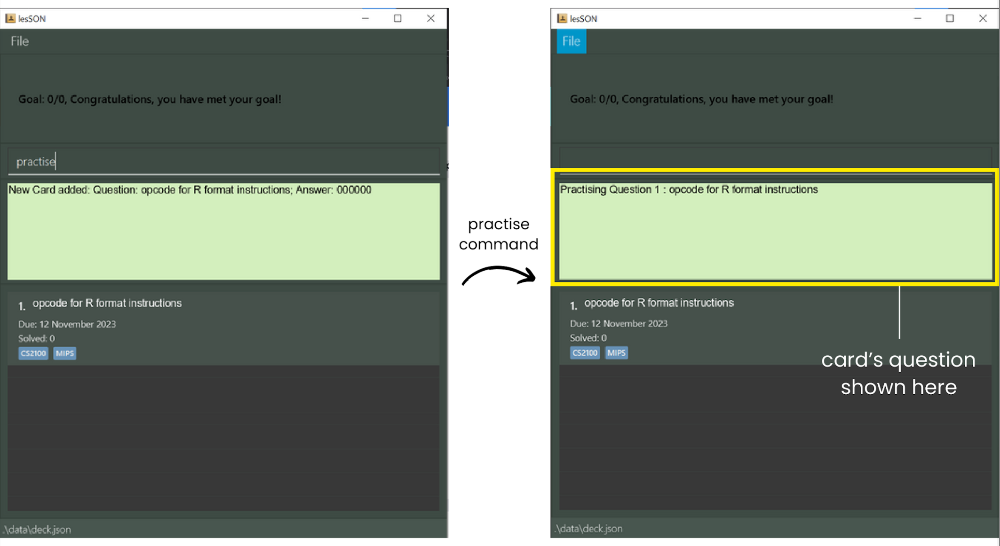
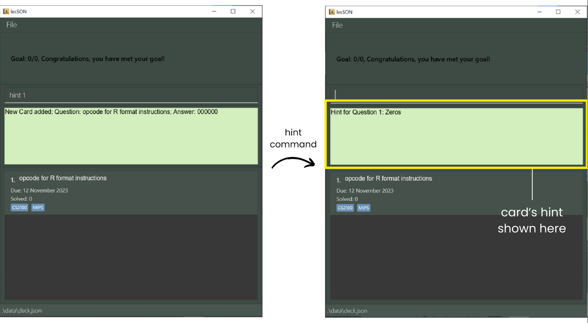
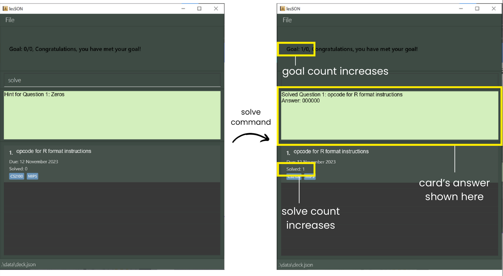
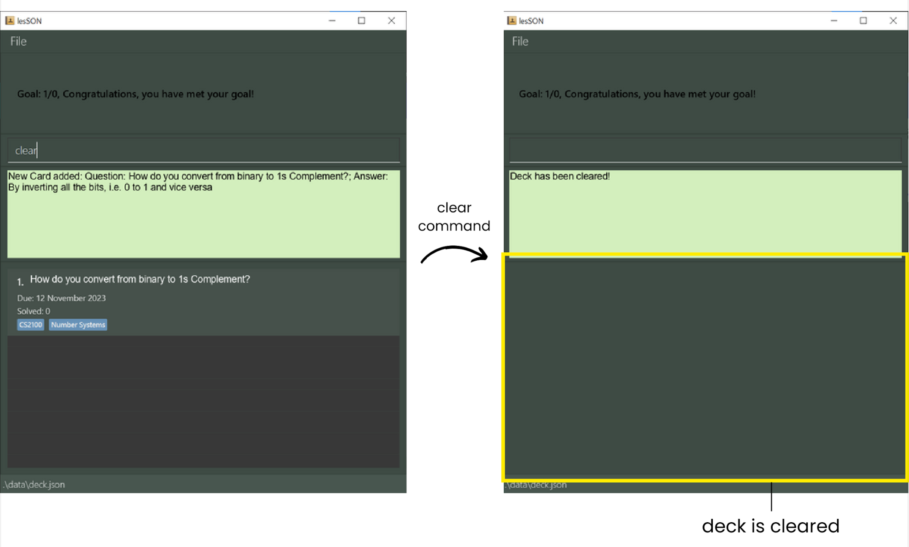
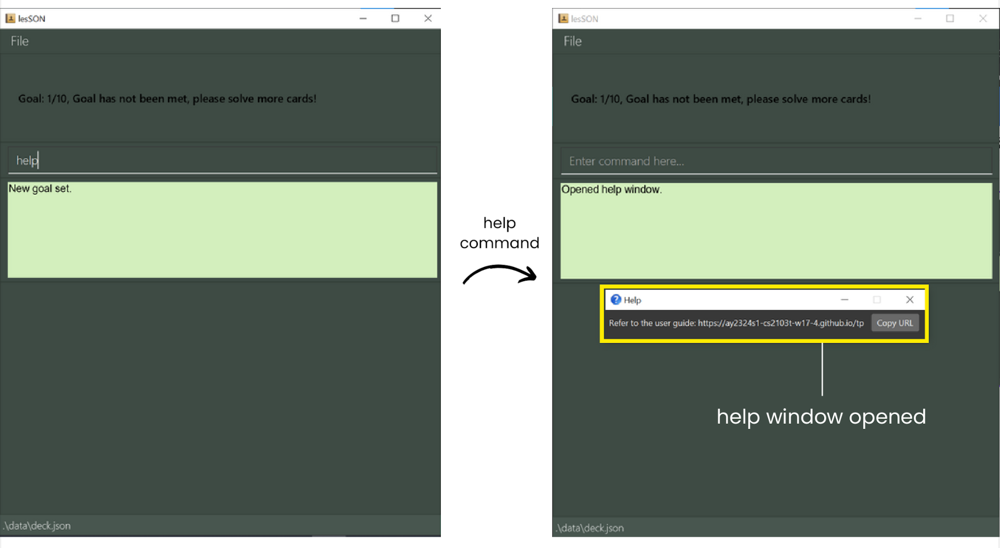

# Welcome to lesSON

***Revolutionise your studying experience with lesSON!***

lesSON is a **desktop application** aimed to help NUS Computer Science undergraduates make flashcards to aid with
their memory work for school content.<br>
Here are some benefits of adopting lesSON in your studying experience:
- Create and Edit flashcards about key concepts taught in your courses
- Take advantage of inbuilt **Spaced Repetition** to improve memory retention
- Tag your flashcards based on their courses or topics to stay organised
- Customise your flashcards using our markdown feature

--------------------------------------------------------------------------------------------------------------------

# Table of Contents
1. [Installation](#installation)
2. [Quick start](#quick-start)
3. [Glossary](#glossary)
4. [User Interface Overview](#user-interface-overview)
5. [Tutorial](#tutorial)
6. [Feature list](#feature-list)
   - [Adding a FlashCard](#adding-a-flashcard-add)
   - [Deleting a Flashcard](#deleting-a-flashcard--delete)
   - [View All Flashcards](#view-all-flashcards--list)
   - [Editing a Specific Flashcard](#editing-a-specific-flashcard--edit)
   - [Practise Flashcards](#practise-flashcards-practise)
   - [Hints for Flashcards](#hints-for-flashcards-hint)
   - [Solve Flashcards](#solving-flashcards-solve)
   - [Setting Difficulty for Flashcards](#setting-difficulty-of-flashcards-set)
   - [Randomly Practise Flashcards](#randomly-practise-flashcards--random)
   - [Clear all Flashcards](#clear-all-flashcards-clear)
   - [Setting goals](#setting-goals-goal)
   - [Getting help](#getting-help-help)
7. [Additional Features](#additional-features)
   - [Markdown Syntax](#markdown-syntax)
   - [Importing and Exporting Decks](#importing-and-exporting-decks)
8. [FAQ](#frequently-asked-questions)

--------------------------------------------------------------------------------------------------------------------

# Installation

1. Make sure that you have [Java 11 or above](https://www.java.com/en/download/) installed on your computer.
2. Download the latest jar file from [here](https://github.com/AY2324S1-CS2103T-W17-4/tp/releases/tag/v1.3(trial)).
3. Move the jar file installed to a working folder you would store all of your flashcards
4. Launch lesson by doing the following:
   1. In the terminal or command prompt, use the `cd` command to navigate to the working folder.
   [Not sure how to use cd?](https://www.ibm.com/docs/en/aix/7.2?topic=directories-changing-another-directory-cd-command)
   2. Run lesSON using `java -jar lesSON.jar`

--------------------------------------------------------------------------------------------------------------------

# Quick Start

1. To understand the terms we use in this guide better, check out [our glossary](#glossary).
2. Better understand the GUI using [this guide](#user-interface-overview).
3. For new users, we recommend reading [this tutorial](#tutorial).
4. For advanced users, view all feature details in the [feature list](#feature-list).

--------------------------------------------------------------------------------------------------------------------

# Glossary

### Definitions

`Deck` - A scrollable list of flashcards on the GUI.

`Flashcard`- A card created by the user containing its index, question, answer (not shown) and due date.

`Index` - The relative position of a flashcard within the deck.

`Parameter` - Field that needs to be filled up.

### Parameter Information

The parameters used in lesSON have certain specifications. Here are some information to guide you through 
how to use them. Invalid inputs are just one of many examples of invalid inputs. Cases that do not appear in the table may also be invalid if it is not of the accepted format.

| Parameter  | Prefix | Accepted Format                                                                                                         | Valid Input                                               | Invalid Input |
|------------|--------|-------------------------------------------------------------------------------------------------------------------------|-----------------------------------------------------------|---------------|
| QUESTION   | q/     | Alphanumerical values and certain special characters.                                                                   | How many types of instruction formats are there for MIPS? | 什么            | 
| ANSWER     | a/     | Alphanumerical values and certain special characters.                                                                   | The opcode for R-format instruction is 000000.            | こんにちは         |
| TAG        | t/     | Alphanumerical values.                                                                                                  | CS2100                                                    | !factorials   |
| HINT       | h/     | Alphanumerical values, whitespace and certain special characters, i.e. !@#$%^&*(),./?";:{}[]-=_+                        | 1 + 1                                                     | 💡            |
| DIFFICULTY | d/     | Only "easy", "medium" or "hard".                                                                                        | easy                                                      | difficult     |
| INDEX      | NA     | Positive integer less than size of deck or `r` for certain cases (see [random](#randomly-practise-flashcards--random)). | 1                                                         | 0             |
| NUMBER     | NA     | Positive integer not more than 2147483647                                                                               | 1000                                                      | 2147483648    |

### Command Format

| Format                                                                                 | Details                                                                                                                                                                                        | Example                                                                                                                           |
|----------------------------------------------------------------------------------------|------------------------------------------------------------------------------------------------------------------------------------------------------------------------------------------------|-----------------------------------------------------------------------------------------------------------------------------------|
| `UPPER_CASE` words                                                                     | Field to be filed in by users. Must not be empty or only containing whitespace (except certain cases, see [edit](#editing-a-specific-flashcard--edit)).                                        | `add q/QUESTION a/ANSWER` means users need to input a question after the `q/` prefix.                                             |
| Phrases with square brackets, i.e. `[ ]`                                               | Optional parameters that can be omitted by the users.                                                                                                                                          | `add q/QUESTION a/ANSWER [h/HINT]` means users can choose to omit hints when adding a card.                                       |
| Phrases with ellipsis, i.e. `...`                                                      | Parameters that can be input repeatedly.                                                                                                                                                       | `add q/QUESTION a/ANSWER [t/TAG...]` means user can choose to add multiple tags while creating the card, each with a prefix `t/`. |
| Certain combinations of characters are not allowed, i.e characters that form a prefix. | Inputs that contain prefixes are not valid inputs.                                                                                                                                             | Having `q/`, `a/`, `t/`, `h/` or `d/` in certain input fields.                                                                    |
| Inputs are case-sensitive.                                                             | Cards with question that differ only in case will be regarded as different cards.                                                                                                              | `add q/QUESTION a/ANSWER` and `add q/question a/answer` will generate 2 different cards.                                          | 
| Parameters can be input in any order                                                   | Parameters can be reordered without having any effect on the command.                                                                                                                          | `add q/QUESTION a/ANSWER` and `add a/ANSWER q/QUESTION` are both valid inputs that generates the same card.                       |
| Commands that do not take in any parameters will disregard extraneous parameters.      | Certain commands such as `help`, `clear`, `exit`, `random` and `list` (in certain cases, see [list](#view-all-flashcards--list) for more details) will disregard any inputs after the command. | `help 123 ` or `clear a/abc` will be regarded as `help` and `clear`.                                                              |
--------------------------------------------------------------------------------------------------------------------

# User Interface Overview

Here is a quick overview of the user interface to get you oriented with where things are.


* Command Line Box - lesSON is optimised for typing commands. Type your commands in the command box
to create and change flashcards!
* Result Box - after inputting a command, the result will show up here. Any errors produced will also appear here, for
instance in the event of a wrongfully formatted command.
* Deck List - shows the list of flashcards

--------------------------------------------------------------------------------------------------------------------

# Tutorial

This tutorial explains how to add, edit, tag, and practise your flashcards. Feel free to follow along with lesSON open!
For advanced users, feel free to look at the [feature list](#feature-list) instead.

1. Firstly, let's add a card. type: <br>`add q/what does + mean in boolean algebra? a/it means OR.`
2. Next, let's capitalise our previous input! Assuming the card is at index `1`, input: <br>`edit 1 q/What does + mean in boolean
algebra? a/It means OR.`
3. Next, let's tag it under the module CS1231S by inputting: <br>`edit 1 t/CS1231S`
4. Feel free to add a few more cards by following steps 1 to 3!
5. Next, to practise the first card, do: <br> `practise`
6. Try to recall the answer, and when you are ready to reveal the answer, do: <br> `solve`
7. How hard was the answer to recall? set the difficulty by doing one of these: <br>
`set d/easy`
`set d/medium`
`set d/hard`
8. The card will automatically be reinserted into deck. This is based on how difficult you found the card. Due to our
spaced repetition system, as you practise, the more difficult cards will surface more at the top.
9. Note that the `practise`, `solve`, and `set` commands support indexes, but it is recommended to use them without
indexes, as in this tutorial, to always operate on the most difficult card.

--------------------------------------------------------------------------------------------------------------------

# Feature list
## Commands
### Adding a Flashcard: `add`

Adds a flashcard to the deck for the user.

#### Format:
```
add q/QUESTION a/ANSWER [t/TAG...] [h/HINT]
```

#### Examples:

_A flashcard with only a question and answer field._
```
add q/What are the three ways to implement binary systems? a/1s Complement, 2s Complement, and Sign and Magnitude
```
_A flashcard with a question, answer and tag field._
```
add q/How do you convert from binary to 1s Complement? a/By inverting all the bits, i.e. 0 to 1 and vice versa t/CS2100 t/Number Systems
```
_A flashcard with a question, answer, tag and hint field._
```
add q/What are the 5 stages of MIPS? a/Fetch, Decode, Execute, Memory, Write Back t/CS2100 h/5 stages: IF, ID, EX, MEM, WB
```

#### To Note:
1. Tagging is not supported in v1.2 and earlier.
2. Hint is not supported before v1.3.

#### Expected Output:

1. User Input:
   ```
   add q/opcode for R format instructions a/000000 t/CS2100 t/MIPS
   ```

2. Successful Output
   1. Result box displays: `New Card added: Question: opcode for R format instructions; Answer: 000000`
   2. The corresponding card with the **question**, **due date**, **solve count** and **tags** is created and added to the deck.


### Deleting a Flashcard : `delete`
Deletes a flashcard in the deck

#### Format:
```
delete INDEX
```

#### Examples:
_Deleting the card in the deck with an index of 2._
```
delete 2
```

#### Expected Outputs:
1. User Input: 
   ```
   add q/opcode for R format instructions a/000000 t/CS2100 t/MIPS
   delete 1
   ```

2. Successful Output
   1. Result box displays: `Deleted Card: Question: opcode for R format instructions; Answer: 000000`
   2. The corresponding card is deleted from the deck.


### View All Flashcards : `list`
Shows a list of all flashcards in the deck. A keyword may be specified to filter out the list.

#### Format: 
```
list [q/QUESTION] [t/TAG...]
```
### Examples:
_List full deck of flashcards._
```
list
```
_List all flashcards with question starting with "What"._
```
list q/What
```
_List all flashcards with the CS2100 Tag._
```
list t/CS2100
```

#### To note:
1. Any extraneous parameters not `q/` and `t/` will be ignored, i.e. `list 12345` or `list a/000000` will be regarded as `list`.
2. Listing questions with markdown syntax should include their relevant markdown notation.

#### Expected output:
1. User Input:
   ```
   add q/What are the three ways to implement binary systems? a/1s Complement, 2s Complement, and Sign and Magnitude
   add q/How do you convert from binary to 1s Complement? a/By inverting all the bits, i.e. 0 to 1 and vice versa t/CS2100 t/Number Systems
   add q/What are the 5 stages of MIPS? a/Fetch, Decode, Execute, Memory, Write Back t/CS2100 h/5 stages: IF, ID, EX, MEM, WB 
   list t/CS2100
   ```

2. Successful Output
   1. Result box displays: `All cards listed`
   2. The corresponding cards matching the keyword and tags is displayed.


### Editing a Specific Flashcard : `edit`
Edits an existing Flashcard in the deck.

#### Format:
```
edit INDEX [q/QUESTION] [a/ANSWER] [t/TAG...] [h/HINT]
```

#### Examples:
_Change the question at index 1 to "What is the colour of the sun?"._
```
edit 1 q/What is the colour of the sun?
```
_Change the answer at index 1 to "Red"._
```
edit 1 a/Red
```
_Change the tag at index 1 to "Weather" and "Geography"._
```
edit 1 t/Weather t/Geogaphy
```
_Change the hint at index 1 to "Apple"._
```
edit 1 h/Apple
```

#### To Note:
1. There must be at least one optional parameter included for the command input.
2. Empty input after `t/` and `h/` will remove existing tags or hint respectively.
3. Tagging is not supported in v1.2 and earlier.
4. Hint is not supported before v1.3.

#### Expected output:
1. User Input:
   ```
   add q/How do you convert from binary to 1s Complement? a/By inverting all the bits, i.e. 0 to 1 and vice versa 
   edit 1 a/If is a negative number, invert all the bits, i.e. 0 to 1 and vice versa t/CS2100 t/Number Systems
   ```

2. Successful Output
    1. Result box displays: `Edited Card: Question: How do you you convert from binary to 1s Complement?; Answer: If is a negative number, invert all the bits, i.e. 0 to 1 and vice versa`
    2. The corresponding card in the deck will be updated.
       

### Practise Flashcards: `practise`
Practise a single Flashcard in the deck

#### Format:
```
practise [INDEX]
```

#### Examples:
_Practising the card in the deck with an index of 2._
```
practise 2
```

#### To Note:
1. If user omits INDEX in the command input, the first card in the deck will be practised.

#### Expected outputs:
1. User Input
   ```
   add q/opcode for R format instructions a/000000 t/CS2100 t/MIPS
   practise
   ```
2. Successful Output
   1. Result box displays: `Practising Question 1 : opcode for R format instructions`
   

### Hints for Flashcards: `hint`
See the hint for a question at the given index

Format: 
```
hint INDEX
```

#### Examples:
_Hint the card in the deck with an index of 3._
```
hint 3
```

#### Expected outputs:
1. User Input
   ```
   add q/opcode for R format instructions a/000000 t/CS2100 t/MIPS h/Zeros
   hint 1
   ```
2. Successful Output
   1. Result box displays: `Hint for Question 1: Zeros`
   
   

### Solving Flashcards: `solve`
Solves the question at the given index

Format: 
```
solve [INDEX]
```

#### Examples:
_Solve the card in the deck with an index of 2._
```
solve 2
```

#### To Note:
1. If user omits INDEX in the command input, the first card in the deck will be solved.

#### Expected outputs:
1. User Input
   ```
   add q/opcode for R format instructions a/000000 t/CS2100 t/MIPS h/Zeros
   solve
   ```

2. Successful Output
   1. Result box displays: `Solved Question 1: opcode for R format instructions Answer: 000000`
   2. Solve count of the card gets updated.
   


### Setting Difficulty of Flashcards: `set`
Setting the difficulty of a flashcard, based on the user.

Format: 
```
set [INDEX] d/DIFFICULTY
```

#### Example:
_Set the first card as easy_
```
set 1 d/easy
```

#### To Note:
1. If user omits INDEX in the command input, the first card in the deck will be set.

#### Expected outputs:
1. User Input
   ```
   add q/opcode for R format instructions a/000000 t/CS2100 t/MIPS h/Zeros
   set d/easy
   ```

2. Successful Output
   1. Result box displays: `Set Difficulty for Question 1 (Difficulty level: EASY)`
   2. Due date of the card updated.
   

### Randomly Practise Flashcards: `random`
Practise a single random Flashcard in the deck.

#### Format: 
```
random
```

#### Examples:
_Practise a random card._
```
random
```

#### To Note:
1. Users can choose to note the index of question and solve and set based on the index. Alternatively, users can also use `r` as the index.

#### Expected outputs:
1. User Input
   ```
   add q/How do you convert from binary to 1s Complement? a/By inverting all the bits, i.e. 0 to 1 and vice versa t/CS2100 t/Number Systems
   add q/What are the 5 stages of MIPS? a/Fetch, Decode, Execute, Memory, Write Back t/CS2100 h/5 stages: IF, ID, EX, MEM, WB
   random
   ```
2. Successful Output (assuming random chooses the card at index 2)
   1. Result box displays: `Practising Question 2 : What are the 5 stages of MIPS?`
      

### Clear all flashcards: `clear`
Clears all flashcards found in the Deck. Deck is reset back to empty.

#### Format: 
```
clear
```

#### Example:
_Delete all flashcards from the deck._
```
clear
```

#### Expected outputs:
1. User Input
   ```
   add q/How do you convert from binary to 1s Complement? a/By inverting all the bits, i.e. 0 to 1 and vice versa t/CS2100 t/Number Systems
   clear
   ```
2. Successful Output
   1. Result box displays: `Deck has been cleared!`
      

### Setting goals: `goal`
Set a goal for the current studying session.

#### Format:
```
goal NUMBER
```

#### Example:
_Set a goal of 5 for this session._
```
goal 5
```

#### To Note:
1. On initialisation of lesSON, the target of the goal will be the size of the deck and the number of cards solved will be 0.

#### Expected outputs:
1. User Input
   ```
   goal 10
   ```
2. Successful Output
   1. Result box displays: `New goal set.`
   2. Goal box updated with new target and goal completion status.
      

      
### Getting help: `help`
Seek more details from a link provided leading to the User Guide.
Users can also access this function by clicking on the **File** button located at the top
left of the application, and then navigating to the **Help** tab.

#### Format: 
```
help
```

#### Example:
_Open help window._
```
help
```

#### Expected outputs:
1. User Input
   ```
   help
   ```
2. Successful Output
   1. Result box displays: `Opened help window.`
   2. Popup window with link ot User Guide is generated.
      
--------------------------------------------------------------------------------------------------------------------
# Additional Features

## MarkDown Syntax

For user who wish to incorporate styling in lesSON, there are 3 font styles currently supported:
1. Bold
2. Italic
3. Underline

### Bold
To bold a line of text, wrap text with `**`

#### Example:
_Bolding a phrase in the question_
```
edit 1 q/How many bits can a **Half Adder** add up
```

#### Expected Result:
1. User Input
   ```
   add q/What is the **Stage** where calculations are operated? a/ALU
   ```
2. Successful Output
   1. Result box displays: `New Card added: Question: What is the Stage where calculations are operated?; Answer: ALU`
   2. The corresponding card with the **question**, **due date**, **solve count** and **tags** is created and added to the deck.
   3. `Stage` will appear bolded in both instances.


### Italic
To italicise a line of text, wrap text with `*`

#### Example:
_Italicising a phrase in the question_
```
edit 1 q/How many bits can a *Half Adder* add up
```
#### Expected Result:
1. User Input
   ```
   add q/What is the *Stage* where calculations are operated? a/ALU
   ```
2. Successful Output
   1. Result box displays: `New Card added: Question: What is the Stage where calculations are operated?; Answer: ALU`
   2. The corresponding card with the **question**, **due date**, **solve count** and **tags** is created and added to the deck.
   3. `Stage` will appear italicised in both instances.
      

### Underline
To underline a line of text, insert `<u>` at the beginning of the text,
and end with `</u>` at the end of the underlined text.

#### Example:
_Underlining a phrase in the question_
```
edit 1 q/How many bits can a <u>Half Adder</u> add up
```
#### Expected Result:
1. User Input
   ```
   add q/What is the <u>Stage</u> where calculations are operated? a/ALU
   ```
2. Successful Output
   1. Result box displays: `New Card added: Question: What is the Stage where calculations are operated?; Answer: ALU`
   2. The corresponding card with the **question**, **due date**, **solve count** and **tags** is created and added to the deck.
   3. `Stage` will appear underlined in both instances.
      


### To Note:
1. Do not stack MarkDown Syntax. This may lead to unexpected behavior of text in the display view. 
2. Do ensure that the phrase intended for styling is wrapped within an open and close syntax of the same type, i.e. `**bold**` for bold `*italics*` for italics and `<u>underline</u>` for underline. 
3. In the case when unexpected MarkDown format is observed, edit the flashcard again with the without the MarkDown syntax/with appropriate syntaxes.

# Importing and Exporting Decks

<div markdown="block" class="alert alert-info">

**:information_source: Notes about Export and Import**<br>

The import and export functions are meant to be used before and after revision respectively <br>

They are not to be confused as commands input by user, but rather as a method to transfer and import data easily <br>

</div>

Users can share their own Decks with others or download their Decks to their own.
Both import and export features reside in the **File** menu.

## Export
Users can share their own Deck by clicking on the `Export` button. Their own Deck
will be displayed as a JSON file which can be easily copied either through the `Copy Data`
button provided or other means.

## Import
Users can enjoy the Decks of others by clicking on the `Import` button. A text field
is displayed for users to paste in the JSON file containing the decks of others. The
app will close upon clicking the `Import Data` button. Users will have to rerun the app
to see their new decks.

--------------------------------------------------------------------------------------------------------------------

# Frequently Asked Questions

### I can't run lesSON! What should I do?
Please check that you have correctly installed lesSON by following the instructions [here](#installation). For further
queries, feel free to contact us!
