ManaGease is a **desktop app for <ins>HR managers</ins> to manage full time staff in the workplace, optimized for use via a Command Line Interface** (CLI) while still having the benefits of a Graphical User Interface (GUI). If you can type fast, ManaGease can get your employee management tasks done faster than traditional apps.

Our app simplifies and accelerates your experiences of employee information management, payroll management and leave tracking. If this is the first time you are using ManaGease, we recommend that you read our user guide to familiarise with all commands we provide, and learn how to use them from our step-by-step tutorial. You may start with the [Quick Start](#quick-start) below. Otherwise, jump straight to the [Table of Contents](#table-of-contents) or [Command Summary](#command-summary) section for details of the command you are looking for.

To help you avoid detrimental errors in your experience with ManaGease, we have included some possible outputs and respective error messages for each command. Along the way, there will be some notes and cautions to help you use ManaGease more efficiently.

<div markdown="span" class="alert alert-primary">:bulb: **Note:**
Please input the field parameters in the correct format. You can refer to the <a href="#parameter-formats">parameter formats</a> for more information.
</div>

<div markdown="span" class="alert alert-warning">:exclamation: **Caution:**
Please do not use negative integers, non-integers and extremely large integers(integers greater than 2147483647) for the <code>INDEX</code>.
</div>

You can refer to the [FAQ](#faq) section for more information if you encounter some problems while using ManaGease.

If you still have any questions, feel free to contact us at E0968838@u.nus.edu.

We hope you enjoy using ManaGease as much as we enjoyed building it.

<div style="page-break-after: always;"></div>

---
## Table of Contents
<!-- TOC -->
  * [Table of Contents](#table-of-contents)
  * [Quick Start](#quick-start)
  * [Features](#features)
    * [Parameter formats](#parameter-formats)
    * [Viewing help: `help`](#viewing-help-help)
    * [Adding an employee: `add`](#adding-an-employee-add)
    * [Editing an employee: `edit`](#editing-an-employee-edit)
    * [Deleting an employee: `delete`](#deleting-an-employee-delete)
    * [Reading an employee's information: `read`](#reading-an-employees-information-read)
    * [Adding leave to an employee: `addleave`](#adding-leave-to-an-employee-addleave)
    * [Deleting leave from an employee: `deleteleave`](#deleting-leave-from-an-employee-deleteleave)
    * [View employee who is on leave: `viewleave`](#view-employee-who-is-on-leave-viewleave)
    * [View the calendar of upcoming month: `nm`](#view-the-calendar-of-upcoming-month-nm)
    * [View the calendar of previous month: `pm`](#view-the-calendar-of-previous-month-pm)
    * [View the calendar of current month: `cm`](#view-the-calendar-of-current-month-cm)
    * [Adding a deduction to the payroll of an employee: `deduct`](#adding-a-deduction-to-the-payroll-of-an-employee-deduct)
    * [Adding a benefit to the payroll of an employee: `benefit`](#adding-a-benefit-to-the-payroll-of-an-employee-benefit)
    * [Calculating an employee's payroll: `payroll`](#calculating-an-employees-payroll-payroll)
    * [Generating payslips for an employee: `payslip`](#generating-payslips-for-an-employee-payslip)
    * [Marking an employee's attendance: `mark`](#marking-an-employees-attendance-mark)
    * [View an employee's attendance report: `attendance`](#view-an-employees-attendance-report-attendance)
    * [Listing all employees: `list`](#listing-all-employees-list)
    * [Locating employees by name: `find`](#locating-employees-by-name-find)
    * [Clearing all entries: `clear`](#clearing-all-entries-clear)
    * [Exiting the program: `exit`](#exiting-the-program-exit)
    * [Saving the data](#saving-the-data)
    * [Editing the data file](#editing-the-data-file)
  * [FAQ](#faq)
  * [Glossary](#glossary)
  * [Command summary](#command-summary)
<!-- TOC -->

--------------------------------------------------------------------------------------------------------------------
<div style="page-break-after: always;"></div>

## Quick Start

1. Ensure you have Java `11` or above installed on your Computer. 
2. Download the latest `ManaGease.jar` from [here](https://github.com/AY2324S1-CS2103T-W12-2/tp/releases)
3. Copy the file to the folder you want to use as the **home folder** for your ManaGease. 
4. Open a command terminal, `cd` into the folder you put the jar file in(i.e. `cd DIRECTORY_PATH`), and enter the `java -jar ManaGease.jar` command to run the application.<br>
   A GUI similar to the one below should appear in a few seconds. Note how the app contains some sample data.
   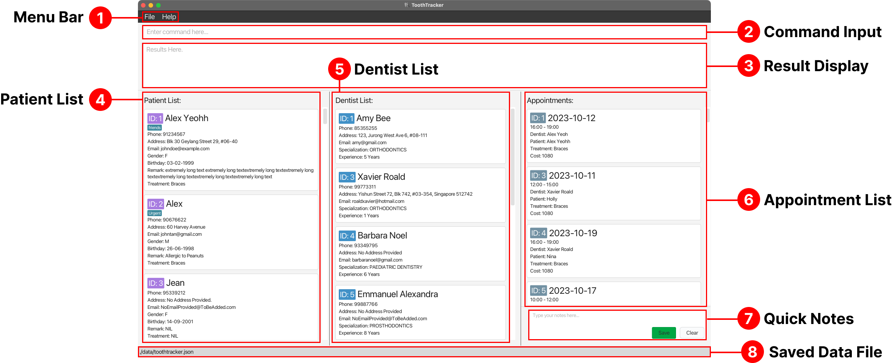

   <div markdown="span" class="alert alert-primary">:bulb: **Note:**
   The calendar and clock are generated based on the local date and time of your machine. Please verify your machine's date and time before starting the application!
   </div>

    Employee information is displayed on the person card below:
    

5. Type the command in the command box and press Enter on your keyboard to execute it. e.g. typing **`help`** and pressing Enter will open the help window.<br>
   Some example commands you can try:

   * `list`: Lists all employees.

   * `add /n Jane Smith /e jane@email.com /p 12345678 /a 123 Main St /b 123456789 /jd 12/09/2023 /s 1000.00 /l 10`: Adds an employee named `Jane Smith` to ManaGease

   * `delete 3`: Deletes the 3rd employee shown in the current list.
   
   * `read 3 /b`: Reads the bank account of the 3rd employee shown in the current list.
   
   * `edit 2 /n Betsy Crower`: Edits the name of the 2nd employee to be `Betsy Crower`.

   * `clear`: Deletes all employees.

   * `exit`: Exits the app.

Refer to [Command Summary](#command-summary) below for a summary of all commands, and the [Features](#features) below for details of each command.
* Go back to [Table of Contents](#table-of-contents)

--------------------------------------------------------------------------------------------------------------------
<div style="page-break-after: always;"></div>

## Features

* For a quick glance at all the commands and features, please refer to the [Command Summary](#command-summary).

<div markdown="block" class="alert alert-info">

**:information_source: Notes about the command format:**<br>

* Words in `UPPER_CASE` are the parameters to be supplied by the user.<br>
  e.g. in `edit INDEX /n NAME`, `INDEX` and `NAME` are parameters that can be used as `edit 3 /n John Doe`.

* Commands, prefixes and most parameters are to be entered in lowercase. You can only enter capitalized letters for parameters of `NAME`, `EMAIL` and `ADDRESS`.<br>

* Items in square brackets are optional.<br>
  e.g. `/n NAME [/p PHONE]` can be used as `/n John Doe /p 98988989` or as `/n John Doe`.

* Parameters can be in any order.<br>
  e.g. if the command specifies `/n NAME /p PHONE`, `/p PHONE /n NAME` is also acceptable.

* Extraneous parameters for commands that do not take in parameters (such as `help`, `list`, `exit` and `clear`) will be ignored.<br>
  e.g. if the command specifies `help 123`, it will be interpreted as `help`.

* If you are using a PDF version of this document, be careful when copying and pasting commands that span multiple lines as space characters surrounding line-breaks may be omitted when copied over to the application.
</div>

<div style="page-break-after: always;"></div>

### Parameter formats
* All parameters provided must be in the correct format.<br>

| Prefix  | Parameter         | Format                                                                                                                                                                                                                                                                                                                                                                                                                                                                                                                                                                 | Example                     |
|---------|-------------------|------------------------------------------------------------------------------------------------------------------------------------------------------------------------------------------------------------------------------------------------------------------------------------------------------------------------------------------------------------------------------------------------------------------------------------------------------------------------------------------------------------------------------------------------------------------------|-----------------------------|
| `/n`    | `NAME`            | non-empty and non-blank alphanumeric string                                                                                                                                                                                                                                                                                                                                                                                                                                                                                                                            | `/n jibtaf`                 |
| `/p`    | `PHONE`           | string containing at least 3 integers                                                                                                                                                                                                                                                                                                                                                                                                                                                                                                                                  | `/p 98988989`               |
| `/e`    | `EMAIL`           | local-part@domain<br/>1. The local-part should only contain alphanumeric characters and `+`, `_`, `.`, `-`. It may not start or end with any special characters.<br/>2. This is followed by a '@' and then a domain name. The domain name is made up of domain labels separated by periods.<br/>The domain name must:<br/>    - end with a domain label at least 2 characters long<br/>    - have each domain label start and end with alphanumeric characters<br/>    - have each domain label consist of alphanumeric characters, separated only by hyphens, if any. | `/e john_doe@u.nus.edu`     |
| `/a`    | `ADDRESS`         | non-empty and non-blank alphanumeric string                                                                                                                                                                                                                                                                                                                                                                                                                                                                                                                            | `/a PGPR, Singapore 118420` |
| `/b`    | `BANK_ACCOUNT`    | string containing 5 to 17 integers, inclusive                                                                                                                                                                                                                                                                                                                                                                                                                                                                                                                          | `/b 1029384756`             |
| `/jd`   | `JOIN_DATE`       | date in the form of DD/MM/YYYY, and must be valid (e.g., 29/02/2023 and 31/09/2023 are not valid dates)                                                                                                                                                                                                                                                                                                                                                                                                                                                                | `/jd 20/04/2018`            |
| `/s`    | `SALARY`          | numeric digits in 2 decimal places, without any sign for currencies                                                                                                                                                                                                                                                                                                                                                                                                                                                                                                    | `/s 2000.00`                |
| `/v`    | `VALUE`           | numeric digits in 2 decimal places, without any sign for currencies                                                                                                                                                                                                                                                                                                                                                                                                                                                                                                    | `/v 150.00`                 |
| `/l`    | `ANNUAL_LEAVE`    | numeric digits                                                                                                                                                                                                                                                                                                                                                                                                                                                                                                                                                         | `/l 25`                     |
| `/from` | `FROM_DATE`       | date in the form of DD/MM/YYYY, and must be valid (e.g., 29/02/2023 and 31/09/2023 are not valid dates)                                                                                                                                                                                                                                                                                                                                                                                                                                                                | `/from 20/04/2018`          |
| `/to`   | `TO_DATE`         | date in the form of DD/MM/YYYY, and must be valid (e.g., 29/02/2023 and 31/09/2023 are not valid dates)                                                                                                                                                                                                                                                                                                                                                                                                                                                                | `/to 20/04/2018`            |
| `/on`   | `DATE`            | date in the form of DD/MM/YYYY, and must be valid (e.g., 29/02/2023 and 31/09/2023 are not valid dates)                                                                                                                                                                                                                                                                                                                                                                                                                                                                | `/on 20/04/2018`            |
| `/t`    | `MONTH_YEAR_DATE` | date in the form of DD/MM/YYYY, and must be valid (e.g., 29/02/2023 and 31/09/2023 are not valid dates)                                                                                                                                                                                                                                                                                                                                                                                                                                                                | `/t 20/04/2018`             |
| `/r`    | `REASON`          | case-insensitive words from the following list:<br/>1. cpf (means `EMPLOYEE_CPF_DEDUCTION`)<br/>2. absence (means `ABSENCE`)<br/>3. no pay (means `NO_PAY_LEAVE`)<br/>4. bonus (means `ANNUAL_BONUS`)<br/>5. transport (means `TRANSPORT_ALLOWANCE`)                                                                                                                                                                                                                                                                                                                   | `/r no pay`                 |
| `/at`   | `ATTENDANCE_TYPE` | case-insensitive words from the following list:<br/>1. present (means `PRESENT`)<br/>2. late (means `LATE`)<br/>3. absent (means `ABSENT`)                                                                                                                                                                                                                                                                                                                                                                                                                             | `/at late`                  |

<div style="page-break-after: always;"></div>

### Viewing help: `help`
**What it does:**

Shows a message explaining how to access the help page.

**Command Format:**

`help`

**Output:**

* A new window will pop up with the link to the help page.
  

* Go back to [Table of Contents](#table-of-contents)

<div style="page-break-after: always;"></div>

### Adding an employee: `add`

**What it does**

This feature allows users to add a new employee to the ManaGease app, creating a profile with essential details.

**Command format:**
```
add /n NAME /e EMAIL /p PHONE /a ADDRESS /b BANK_ACCOUNT /jd JOIN_DATE 
    /s SALARY /l ANNUAL_LEAVE
```

<div markdown="span" class="alert alert-primary">:bulb: **Note:**
An employee must have all parameters shown in the command format.
</div>

<div markdown="span" class="alert alert-primary">:bulb: **Note:**
Please input the field parameters in the correct format. You can refer to the <a href="#parameter-formats">parameter formats</a> for more information.
</div>

<div markdown="span" class="alert alert-primary">:bulb: **Note:**
Please note that the <code>NAME</code> parameter is case-sensitive. E.g., If you have an employee named <code>John Doe</code>, you are advised not to add another employee named <code>john doe</code>. This will be fixed by the next update.
</div>

**Example:**
* `add /n Jane Smith /e jane@email.com /p 12345678 /a 123 Main St /b 123456789
  /jd 12/09/2023 /s 1000.00 /l 10` adds an employee named `Jane Smith` with given information to ManaGease.

**Output:**
* ManaGease should display a confirmation message indicating that the employee has been successfully added to the database.
* The employee's profile should be updated with the provided information.
  <br>
  <br>

**Possible Error Output:**
* If prefix used is not defined, an error message will appear.
  <br>

* If a new employee is added with the same name, email, phone number, address, bank account, join date, salary and number of leaves as an existing employee, an error message will appear. 
  <br>

* Go back to [Table of Contents](#table-of-contents)

<div style="page-break-after: always;"></div>

### Editing an employee: `edit`

**What it does**

Edits an existing employee in the address book.

**Command Format:**

`edit INDEX [/n NAME] [/e EMAIL] [/p PHONE] [/a ADDRESS] [/b BANK_ACCOUNT] [/jd JOIN_DATE] [/s SALARY] [/l ANNUAL_LEAVE] `

* Edits the employee at the specified `INDEX`.
* The `INDEX` refers to the index number shown in the displayed employee list.
* The `INDEX` **must be a positive integer**, and **must be within the range of the list (Total number of employees in the current list displayed)**.
<div markdown="span" class="alert alert-warning">:exclamation: **Caution:**
Please do not use negative integers, non-integers and extremely large integers(integers greater than 2147483647) for the <code>INDEX</code>.
</div>

* **At least one** of the optional fields must be provided.
* Existing values will be updated to the input values.

<div markdown="span" class="alert alert-primary">:bulb: **Note:**
Please input the field parameters in the correct format. You can refer to the <a href="#parameter-formats">parameter formats</a> for more information.
</div>

**Examples:**
*  `edit 1 /p 91234567 /e johndoe@example.com` edits the phone number and email address of the 1st employee to be `91234567` and `johndoe@example.com` respectively.
*  `edit 2 /n Betsy Crower ` edits the name of the 2nd employee to be `Betsy Crower` and clears all existing tags.

**Output:**
* ManaGease should display the information of the updated employee.
* The employee's profile should be updated with the provided information.
  <br>

**Possible Error Output:**
* If the index is not within the numbers in the list, the app should display `The employee index provided is invalid`.
* If the command is incorrect, the app should display the following message.
  <br>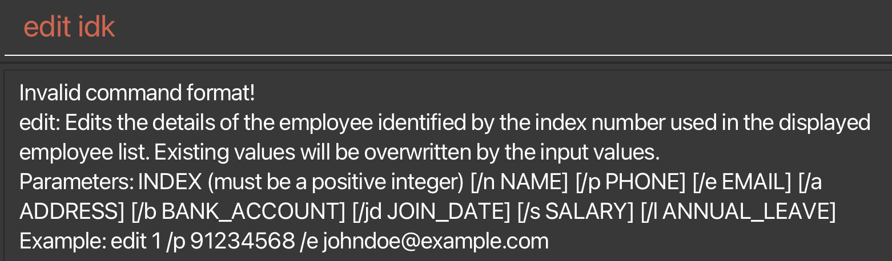
* If you did not specify any field to edit, the app should display the following message.
  <br>
* If you try to edit the field without any change, i.e., the existing field is exactly the same as the one you want to change into, the app should display the following message.
  <br>
  <br>

* Go back to [Table of Contents](#table-of-contents)

<div style="page-break-after: always;"></div>

### Deleting an employee: `delete`

**What it does**

This feature allows users to delete an employee based on index or name.

**Command Format**

`delete INDEX` or `delete /n NAME`


* Deletes the employee at the specified `INDEX` or with the name `NAME`.
* The `INDEX` refers to the index number shown in the displayed employee list.
* The `INDEX` **must be a positive integer**, and **must be within the range of the list (Total number of employees in the current list displayed)**.
<div markdown="span" class="alert alert-warning">:exclamation: **Caution:**
Please do not use negative integers, non-integers and extremely large integers(integers greater than 2147483647) for the <code>INDEX</code>.
</div>

* The `NAME` must be in the correct [format](#parameter-formats).

<div markdown="span" class="alert alert-primary">:bulb: **Note:**
To allow greater flexibility in terms of searching, if there are 2 or more employees with same name, i.e. Amy Tan and Amy Teo, entering the command <code>delete /n FULLNAME</code> of any of the employee will still return a list of these employees instead of deleting the employee that matches the full name. 
</div>

**Examples:**
* `list` followed by `delete 2` deletes the 2nd employee in the employee directory.
* `find Betsy` followed by `delete 1` deletes the 1st employee in the results of the `find` command.
* `delete /n Betsy` will delete the employee with the name 'Betsy' if there is only one such employee with this name. If there is no such employee, there will be an error message displayed. Otherwise, it will return you a list of employees with the name 'Betsy' and you will have to follow up with a `delete INDEX` command to delete the 'Betsy' that you want using the index displayed in the list.

**Output:**
* If the index is valid or there is only one employee in the list, whose name contains the keyword, ManaGease should display a confirmation message indicating that the employee information has been successfully deleted.
* The employee's list should be updated by removing the employee.
  <br>

**Possible Error Output:**
* If there are multiple employees with the same name, all the matching employees would be displayed. Hence, ManaGease will return “Here is the list of the matching employees:”
  <br>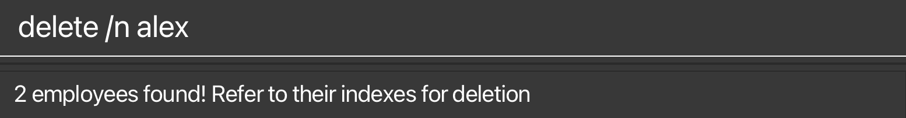
  <br>

* Go back to [Table of Contents](#table-of-contents)

<div style="page-break-after: always;"></div>

### Reading an employee's information: `read`

**What it does**

This feature allows users to view specific information **<ins>(except the name)</ins>** about an employee.

**Command Format**

`read INDEX PREFIX`

* Reads the employee's information specified by the `PREFIX` at the specified `INDEX`.
* The `INDEX` refers to the index number shown in the displayed employee list.
* The `INDEX` **must be a positive integer**, and **must be within the range of the list (Total number of employees in the current list displayed)**.
<div markdown="span" class="alert alert-warning">:exclamation: **Caution:**
Please do not use negative integers, non-integers and extremely large integers(integers greater than 2147483647) for the <code>INDEX</code>.
</div>


**Examples:**
* `read 1 /a` reads the address of the first employee in the most recently displayed list.

**Output:**

* ManaGease should display the information of the employee specified by the `INDEX` and `PREFIX`, if the input is valid.
  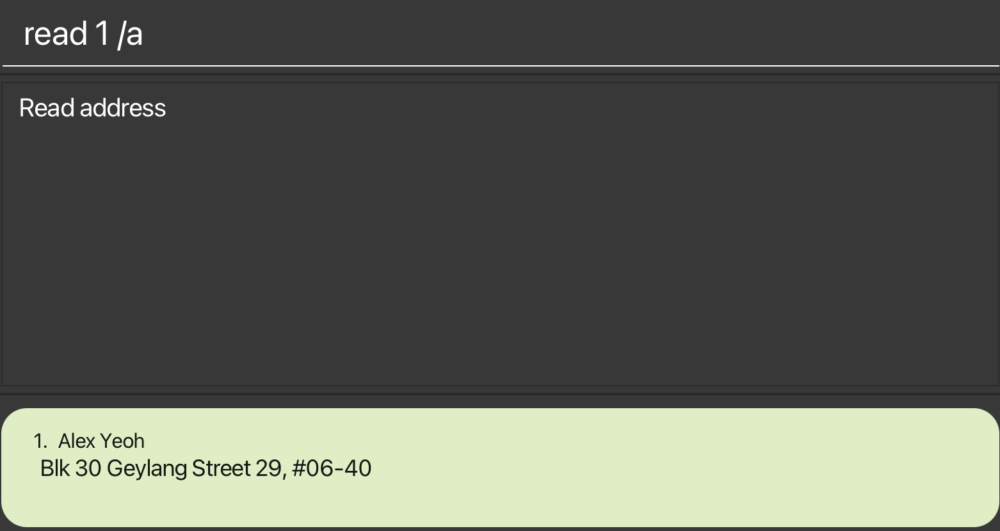

**Possible Error Output:**
* If the index is not within the numbers in the list, the app should display `The employee index provided is invalid`.
  
* If the command is incorrect, the app should display the following message.
  
* If the `PREFIX` provided is not valid, the app should display `The field to read provided is invalid`. Please refer to the [parameter formats](#parameter-formats) for a list of all supported fields.

* Go back to [Table of Contents](#table-of-contents)

<div style="page-break-after: always;"></div>

### Adding leave to an employee: `addleave`

**What it does**

This feature allows users to add leave(s) to an employee.

**Command Format**

`addleave INDEX /on DATE` or `addleave INDEX /from DATE /to DATE`


* Adds leave to the employee specified by the `INDEX`. 
* You have the flexibility to add leave for a single day or multiple consecutive days. 
* You can add leave for the current year and the upcoming year, but you won't be able to add leave for past dates.

<div markdown="span" class="alert alert-primary">:bulb: **Note:**
Please note that the sum of:
    (1)number of days of leave you are tyring to add, and
    (2)number of days the employee has been on leave
should not exceed the total number of days of leave allowed for an employee (displayed on the employee's person card).
To check (2), you may use the <a href="#view-an-employees-attendance-report-attendance"><code>attendance</code></a> command to see the number of days of leave the employee has been on.
</div>

* The `INDEX` refers to the index number shown in the displayed employee list.
* The `INDEX` **must be a positive integer**, and **must be within the range of the list (Total number of employees in the current list displayed)**.
<div markdown="span" class="alert alert-warning">:exclamation: **Caution:**
Please do not use negative integers, non-integers and extremely large integers(integers greater than 2147483647) for the <code>INDEX</code>.
</div>

* The `DATE` must be in `DD/MM/YYYY` format, e.g. `01/01/2024`.
* For adding in multiple days of leave, the second `DATE` must be after the first `DATE`.

**Examples:**
* `addleave 3 /on 01/01/2024` adds a single day of leave of `01/01/2024` to the third employee in the most recently displayed list.
* `addleave 3 /from 01/01/2024 /to 04/01/2024` adds in multiple days of leave to the third employee in the most recently displayed list from `01/01/2024` to `04/01/2024`, inclusive.

**Output:**
* If there are no errors, the app should display the following success message that the leave(s) has been added and display the number of leave left for the current year and the following year.
  <br>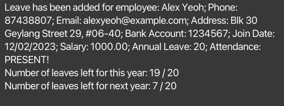
* Note that the `ANNUAL_LEAVE` field displayed on the employee card remains unchanged, as it represents the promised number of annual leave.

**Possible Error Output:**
* If the index is not within the numbers in the list, or the format of the command is incorrect, the app should display the following error message.
  <br>

* If the `DATE` provided is not in the correct format, the app should display the following error message.
  <br>

* If the `DATE` has already been added to the employee, the app should display the following error message.
  <br>

* If the second `DATE` is before the first `DATE` when adding in multiple days of leave, the app should display the following error message.
  <br>

* If any of the `DATE` is not in the current year or next year, or if the total number of days of leave added to an employee exceeds the total days of leave allowed for an employee, the app should display the following error message.
  <br>

* Go back to [Table of Contents](#table-of-contents)

<div style="page-break-after: always;"></div>

### Deleting leave from an employee: `deleteleave`

**What it does**

This feature allows users to delete leave(s) from an employee.

**Command Format**

`deleteleave INDEX /on DATE` or `deleteleave INDEX /from DATE /to DATE`

* Deletes leave from the employee specified by the `INDEX`.
* You have the flexibility to delete leave for a single day or multiple consecutive days.
* The `INDEX` refers to the index number shown in the displayed employee list.
* The `INDEX` **must be a positive integer**, and **must be within the range of the list (Total number of employees in the current list displayed)**.
<div markdown="span" class="alert alert-warning">:exclamation: **Caution:**
Please do not use negative integers, non-integers and extremely large integers(integers greater than 2147483647) for the <code>INDEX</code>.
</div>

* The `DATE` must be in `DD/MM/YYYY` format, e.g. `01/01/2024`.
* For deleting multiple days of leave, the second `DATE` must be after the first `DATE`.

**Examples:**
* `deleteleave 3 /on 01/01/2024` deletes a single day of leave of `01/01/2024` from the third employee in the most recently displayed list.
* `deleteleave 3 /from 01/01/2024 /to 04/01/2024` deletes multiple days of leave from the third employee in the most recently displayed list from `01/01/2024` to `04/01/2024`, inclusive.

**Output:**
* If there are no errors, the app should display the following success message that the leave(s) has been added and display the number of leave left for the current year and the following year.
  <br>

**Possible Error Output:**
* If the index is not within the numbers in the list, or the format of the command is incorrect, the app should display the following error message.
  <br>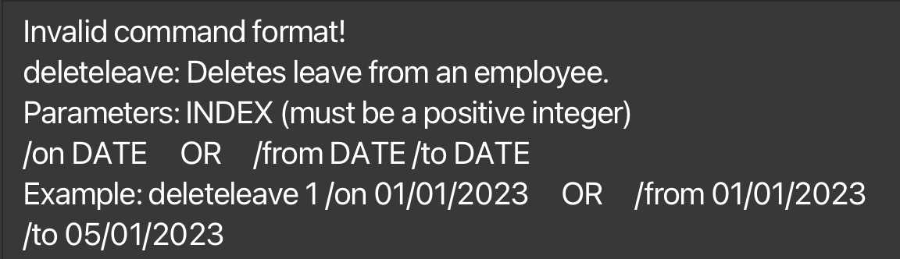

* If the `DATE` provided is not in the correct format, the app should display the following error message.
  <br>

* If the `DATE` has not been added to the employee, the app should display the following error message.
  <br>

* If the second `DATE` is before the first `DATE` when adding in multiple days of leave, the app should display the following error message.
  <br>

* Go back to [Table of Contents](#table-of-contents)

<div style="page-break-after: always;"></div>

### View employee who is on leave: `viewleave`

**What it does**

This feature allows users to view employees who are on leave on a specific date.

**Command Format**

`viewleave /on DATE`

* Views employees who are on leave on a specific DATE **(must be a single date)**.

* The `DATE` must be in `DD/MM/YYYY` format, e.g. `01/01/2024`.

**Examples:**
* `viewleave /on 01/01/2024` view employee who is on leave on 01/01/2024.

**Output:**
* If the command executes successfully, the app should display the employee who is on leave on the specific date.

<br>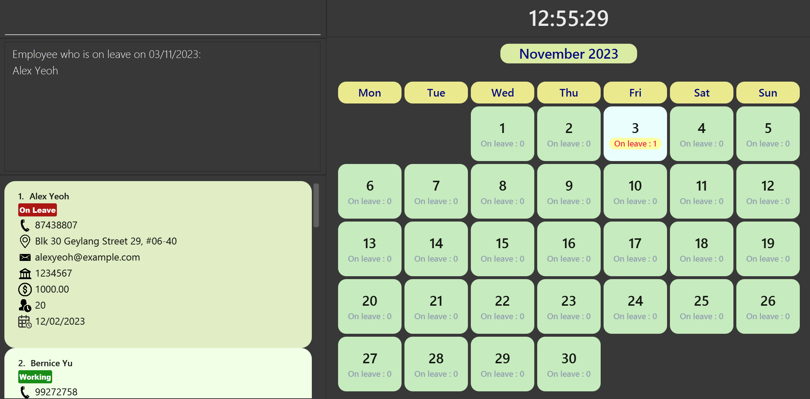

**Possible Error Output:**
* If the command is incorrect, the app should display an error message indicating the command format is invalid followed by the command usage message.
  
<br>

* If the `DATE` provided is not in the correct format, the app should display an error message indicating the date format is invalid and provide guidance on the correct date format.'
  
<br>

* If there is no employee on leave on the specific date, the app should display an error message indicating there is no employee on leave on the specific date.
  
<br>

* Go back to [Table of Contents](#table-of-contents)

<div style="page-break-after: always;"></div>

### View the calendar of upcoming month: `nm`

**What it does**

This feature allows users to view the calendar of the upcoming month on the app.

**Command Format**

`nm`

* Go back to [Table of Contents](#table-of-contents)

### View the calendar of previous month: `pm`

**What it does**

This feature allows users to view the calendar of the previous month on the app.

**Command Format**

`pm`

* Go back to [Table of Contents](#table-of-contents)

### View the calendar of current month: `cm`

**What it does**

This feature allows users to view the calendar of the current month on the app.

**Command Format**

`cm`

* Go back to [Table of Contents](#table-of-contents)

<div style="page-break-after: always;"></div>

### Adding a deduction to the payroll of an employee: `deduct`

**What it does**

This feature allows users to add a deduction to the payroll of an employee.

**Command Format**

`deduct INDEX /v VALUE /r REASON` or `deduct /n NAME /v VALUE /r REASON`

* Adds a deduction with given `VALUE` and `REASON` to the employee specified by the `INDEX` or `NAME`.
* The `INDEX` refers to the index number shown in the displayed employee list.
* The `INDEX` **must be a positive integer**, and **must be within the range of the list (Total number of employees in the current list displayed)**.
<div markdown="span" class="alert alert-warning">:exclamation: **Caution:**
Please do not use negative integers, non-integers and extremely large integers(integers greater than 2147483647) for the <code>INDEX</code>.
</div>

* The `VALUE` must be a **positive number**, and **must be in the [format](#parameter-formats) of 2 decimal places**.
* The `REASON` must be a **non-empty and non-blank string**. It must take one of the three values: `absence`, `cpf` or `no pay`, which stands for `Absence from work`, `Employee CPF deduction` and `No pay leave` respectively.
* The `REASON` is **case-insensitive**.
* The `NAME` must be in the correct [format](#parameter-formats).

**Examples:**
* `deduct 3 /v 100.00 /r absence` adds a deduction of $100.00 for being absent from work to the third employee in the most recently displayed list.
* `deduct /n John Doe /v 100.00 /r cpf` adds a deduction of $100.00 for employee CPF deduction to the employee named John Doe.

**Output:**

* ManaGease should display the deduction information of the employee specified, including the newly added deduction, if the input is valid.
  <br>

**Possible Error Output:**

* If the index is not within the numbers in the list, the app should display `The employee index provided is invalid`.
* If the command is incorrect, the app should display the following message.
  <br>
* If the `VALUE` provided is not in the correct format, the app should display the following message.
  <br>
  Here it says that `Payment should only contain unmerical digits.`. This is because the `VALUE` field refers to the amount of money to be deducted from the employee's salary, which is a `Payment`. This also applies to the `VALUE` field in the [`benefit`](#adding-a-benefit-to-the-payroll-of-an-employee-benefit) command and the `SALARY` field in the [`add`](#adding-an-employee-add) and [`edit`](#editing-an-employee-edit) command.
* If the `REASON` field is missing, the app should display the following message.
  <br>
* If the `REASON` provided is not supported (i.e. not one of the five reasons in the [parameter formats](#parameter-formats)), the app should display the following message.
  <br>
* If the `REASON` provided is not a valid one for a deduction, the app should display the following message.
  <br>

* Go back to [Table of Contents](#table-of-contents)

<div style="page-break-after: always;"></div>

### Adding a benefit to the payroll of an employee: `benefit`

**What it does**

This feature allows users to add a benefit to the payroll of an employee.

**Command Format**

`benefit INDEX /v VALUE /r REASON` or `benefit /n NAME /v VALUE /r REASON`

* Adds a benefit with given `VALUE` and `REASON` to the employee specified by the `INDEX` or `NAME`.
* The `INDEX` refers to the index number shown in the displayed employee list.
* The `INDEX` **must be a positive integer**, and **must be within the range of the list (Total number of employees in the current list displayed)**.
<div markdown="span" class="alert alert-warning">:exclamation: **Caution:**
Please do not use negative integers, non-integers and extremely large integers(integers greater than 2147483647) for the <code>INDEX</code>.
</div>

* The `VALUE` must be a **positive number**, and **must be in the [format](#parameter-formats) of 2 decimal places**.
* The `REASON` must be a **non-empty and non-blank string**. It must take one of the two values: `bonus` or `transport`, which stands for `Annual bonus` and `Transport allowance` respectively.
* The `REASON` is **case-insensitive**.
* The `NAME` must be in the correct [format](#parameter-formats).

**Examples:**
* `benefit 3 /v 1000.00 /r bonus` adds a benefit of $1000.00 for annual bonus to the third employee in the most recently displayed list.
* `benefit /n John Doe /v 200.00 /r transport` adds a benefit of $200.00 for transport allowance to the employee named John Doe.

**Output:**

* ManaGease should display the benefit information of the employee specified, including the newly added benefit, if the input is valid.
  <br>

**Possible Error Output:**

* If the index is not within the numbers in the list, the app should display `The employee index provided is invalid`.
* If the command is incorrect, the app should display the following message.
  <br>
* If the `VALUE` provided is not in the correct format, the app should display the following message.
  <br>
  Here it says that `Payment should only contain unmerical digits.`. This is because the `VALUE` field refers to the amount of money to be added to the employee's salary, which is a `Payment`. This also applies to the `VALUE` field in the [`deduct`](#adding-a-deduction-to-the-payroll-of-an-employee-deduct) command and the `SALARY` field in the [`add`](#adding-an-employee-add) and [`edit`](#editing-an-employee-edit) command.
* If the `REASON` field is missing, the app should display the following message.
  <br>
* If the `REASON` provided is not supported (i.e. not one of the five reasons in the [parameter formats](#parameter-formats)), the app should display the following message.
  <br>
* If the `REASON` provided is not a valid one for a benefit, the app should display the following message.
  <br>

* Go back to [Table of Contents](#table-of-contents)

<div style="page-break-after: always;"></div>

### Calculating an employee's payroll: `payroll`

**What it does**

This feature allows users to calculate the payroll of an employee.

**Command Format**

`payroll INDEX` or `payroll /n NAME`

* Calculates the payroll of the employee specified by the `INDEX` or `NAME`, where the payroll period is the current month.
* The `INDEX` refers to the index number shown in the displayed employee list.
* The `INDEX` **must be a positive integer**, and **must be within the range of the list (Total number of employees in the current list displayed)**.
<div markdown="span" class="alert alert-warning">:exclamation: **Caution:**
Please do not use negative integers, non-integers and extremely large integers(integers greater than 2147483647) for the <code>INDEX</code>.
</div>

* The `NAME` must be in the correct [format](#parameter-formats).

<div markdown="span" class="alert alert-primary">:bulb: **Note:**
Editing the basic salary component (i.e., <code>SALARY</code>) of an employee will only take effect from the next payroll period onwards,  and it will only apply to the calculation of next payroll onwards.
E.g., If you edit the basic salary of an employee in January 2024, the basic salary will only be updated from the payroll period of February 2024 onwards.
</div>

**Examples:**

* `payroll 3` calculates the payroll of the third employee in the most recently displayed list.
* `payroll /n John Doe` calculates the payroll of the employee named John Doe.

**Output:**
* ManaGease should display the payroll of the employee specified by the `INDEX` or `NAME`, if the input is valid.
  <br>

**Possible Error Output:**

* If the index is not within the numbers in the list, the app should display `The employee index provided is invalid`.
* If there are more than one employee with the same name in the command, the app will display `x employees found! Refer to their indexes for payroll calculation` and will list down those employees for the user to view. The user should then use their index numbers to calculate the payroll.
  <br>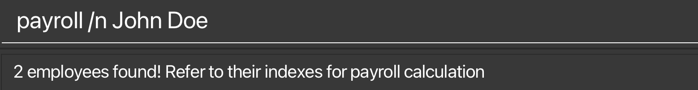
  <br>
* If the command is incorrect, the app should display the following message.
  <br>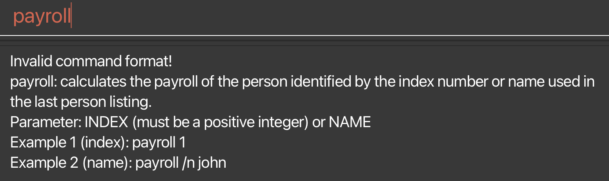

* Go back to [Table of Contents](#table-of-contents)

<div style="page-break-after: always;"></div>

### Generating payslips for an employee: `payslip`

**What it does**

This feature allows users to generate payslips for an employee.

**Command Format**

`payslip INDEX [/t DATE]` or `payslip /n NAME [/t DATE]`

* Generates a payslip based on the latest payroll for the employee specified by the `INDEX` or `NAME`.
* If the optional `/t DATE` is provided, the payslip will be generated for the month specified by the date.
* The `INDEX` refers to the index number shown in the displayed employee list.
* The `INDEX` **must be a positive integer**, and **must be within the range of the list (Total number of employees in the current list displayed)**.
<div markdown="span" class="alert alert-warning">:exclamation: **Caution:**
Please do not use negative integers, non-integers and extremely large integers(integers greater than 2147483647) for the <code>INDEX</code>.
</div>

* The `NAME` must be in the correct [format](#parameter-formats).
* The optional `DATE` must be in `DD/MM/YYYY` format, e.g. `01/01/2024`.

<div markdown="span" class="alert alert-primary">:bulb: **Note:**
Editing the basic salary component (i.e., <code>SALARY</code>) of an employee will only take effect from the next payslip period onwards, and it will only apply to the generation of next payslip onwards.
E.g., If you edit the basic salary of an employee in January 2024, the basic salary will only be updated from the payslip period of February 2024 onwards.
</div>

**Examples:**

* `payslip 3` generates a payslip based on the latest payroll for the third employee in the most recently displayed list.
* `payslip /n John Doe` generates a payslip based on the latest payroll for the employee named John Doe.
* `payslip 3 /t 01/01/2024` generates a payslip for the third employee in the most recently displayed list for the month of January 2024.

**Output:**

* ManaGease should display a success message saying that the payslip has been generated successfully, if the input is valid.
  <br>
* A payslip report in PDF format will be generated in the `payslips` folder in the ManaGease home directory.
  <br>
  <br>
<div markdown="span" class="alert alert-warning">:exclamation: **Caution:**
Please close any payslip PDF file before generating another payslip. Otherwise, the payslip PDF file will not be generated successfully.
</div>

**Possible Error Output:**

* If the index is not within the numbers in the list, the app should display `The employee index provided is invalid`.
* If the command is incorrect, the app should display the following message.
  <br>
* If the date provided is not in the correct format, the app should display the following message.
  <br>

* Go back to [Table of Contents](#table-of-contents)

<div style="page-break-after: always;"></div>

### Marking an employee's attendance: `mark`

**What it does**

Marks the indicated employee as “Absent”, “Late”, or “Present”.

**Command Format**

`mark INDEX /at Attendance_Type` or `mark /n NAME /at Attendance_Type`

* The `INDEX` refers to the index number shown in the displayed employee list.
* The `INDEX` **must be a positive integer**, and **must be within the range of the list (Total number of employees in the current list displayed)**.
<div markdown="span" class="alert alert-warning">:exclamation: **Caution:**
Please do not use negative integers, non-integers and extremely large integers(integers greater than 2147483647) for the <code>INDEX</code>.
</div>

* The `NAME` must be in the correct [format](#parameter-formats).
* The `Attendance_Type` can only be: `ABSENT`, `LATE`, or `PRESENT`.
* It is case-insensitive. e.g. you can either enter ABSENT or absent.

**Examples:**

* `mark /n John /at Absent` marks John as absent.
* `mark 1 /at Present` marks the first employee in the current list to be present.

**Output:**

* If the command is successful, the app should display the following message. The employee’s attendance status should also be updated accordingly.
  <br>
  <br>

**Possible Error Output:**

* If the index is not within the numbers in the list, the app should display `The employee index provided is invalid.`
* If the command is incorrect, the app should display the following message.
  <br>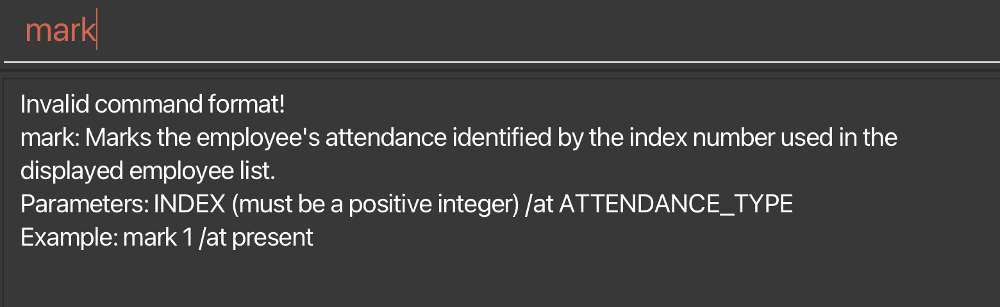
* If the ATTENDANCE_TYPE is not within the valid list, the app should display the following message.
  <br>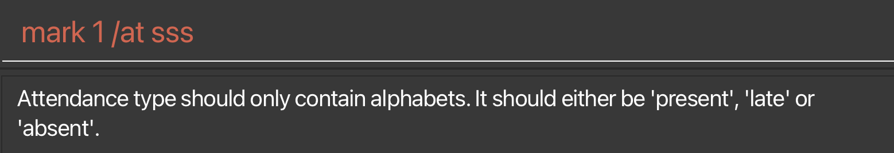

* Go back to [Table of Contents](#table-of-contents)

<div style="page-break-after: always;"></div>

### View an employee's attendance report: `attendance`

**What it does**

View employee’s attendance report.

**Command Format**

`attendance INDEX` or `attendance /n NAME`

* The `INDEX` refers to the index number shown in the displayed employee list.
* The `INDEX` **must be a positive integer**, and **must be within the range of the list (Total number of employees in the current list displayed)**.
<div markdown="span" class="alert alert-warning">:exclamation: **Caution:**
Please do not use negative integers, non-integers and extremely large integers(integers greater than 2147483647) for the <code>INDEX</code>.
</div>

* The `NAME` must be in the correct [format](#parameter-formats).

**Examples:**

* `attendance /n John` views John’s attendance report for the year up till today.
* `attendance 1` views the first employee’s attendance report for the year up till today.

**Output:**
* If the command is successful, the app should display the attendance. The address book’s display of the employee’s attendance status should also be updated accordingly.
  <br>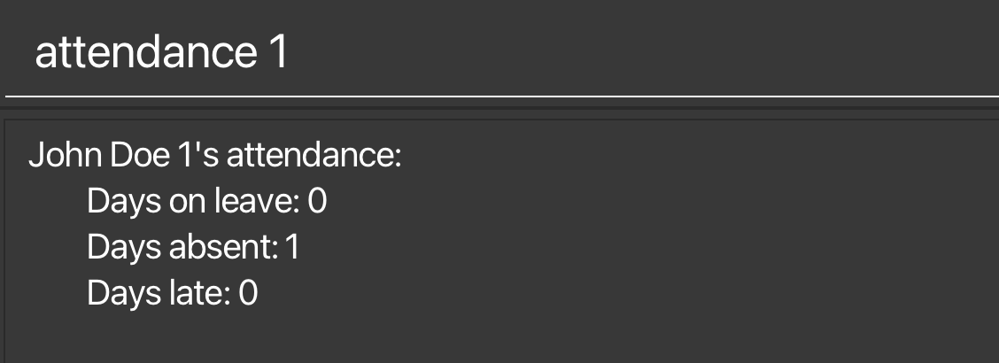

**Possible Error Output:**

* If the index is not within the numbers in the list, the app should display `The employee index provided is invalid.`
* If the command is incorrect, the app should display `Invalid command format!`
  <br>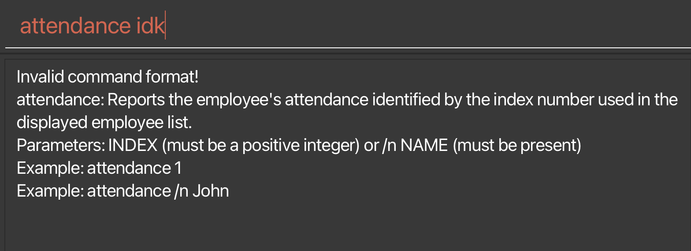

* Go back to [Table of Contents](#table-of-contents)

<div style="page-break-after: always;"></div>

### Listing all employees: `list`

**What it does**

Shows a list of all employees in the workplace.

**Command format:**

`list`

**Output:**

* ManaGease should display a list of all employees in the workplace.
  <br>
  <br>

* Go back to [Table of Contents](#table-of-contents)

<div style="page-break-after: always;"></div>

### Locating employees by name: `find`

**What it does**

Finds employees whose names contain any of the given keywords.

**Command Format**

`find KEYWORD [MORE_KEYWORDS]`

* The search is case-insensitive. e.g. `alex` will match `Alex`
* The order of the keywords does not matter. e.g. `Yeoh Alex` will match `Alex Yeoh`
* Only the name is searched.
* Only full words will be matched e.g. `Ale` will not match `Alex`
* Employees matching at least one keyword will be returned (i.e. `OR` search).
  e.g. `Hans Bo` will return `Hans Gruber`, `Bo Yang`

**Example:**
* `find alex david` returns `Alex Yeoh`, `David Li`<br>
  <br>
  <br>

* Go back to [Table of Contents](#table-of-contents)

<div style="page-break-after: always;"></div>

### Clearing all entries: `clear`

**What it does**

Clears all entries from the address book.

**Command format:**

`clear`

* Go back to [Table of Contents](#table-of-contents)

### Exiting the program: `exit`

**What it does**

Exits the program.

**Command format:**

`exit`

* Go back to [Table of Contents](#table-of-contents)

<div style="page-break-after: always;"></div>

### Saving the data

Employee data are saved in the hard disk automatically after any command that changes the data. There is no need to save manually.

### Editing the data file

ManaGease data are saved automatically as a JSON file `[JAR file location]/data/employees.json`. You are discouraged from editing the data file to make sure ManaGease works well to help you with your business.

<div markdown="span" class="alert alert-warning">:exclamation: **Caution:**
If your changes to the data file makes its format invalid, ManaGease will not run. Hence, it is recommended not to edit the data file directly, and you can edit the data through our useful commands.
</div>

--------------------------------------------------------------------------------------------------------------------

## FAQ

**Q**: How do I transfer my data to another Computer?<br>
**A**: Install the app in the other computer and overwrite the empty data file it creates with the file that contains the data of your previous ManaGease home folder.

**Q**: I am using multiple screens. If I move the application to a secondary screen, and later switch to using only the primary screen, the GUI will open off-screen.<br>
**A**: Delete the `preferences.json` file created by the application before running the application again.

**Q**: Is internet access necessary for the application? <br>
**A**: ManaGease doesn't need internet access as the data are stored locally in your machine.

--------------------------------------------------------------------------------------------------------------------

<div style="page-break-after: always;"></div>

## Glossary

| Term                                                                | Description                                                                                        |
|------------------------------------------------------------------------|------------------------------------------------------------------------------------------------------------------------------------------------------------------------------------------------------------------------------|
| **Benefit**                                     | Benefit are additional financial rewards provided to employees.  |
| **Deduction**                                   | Deductions refer to the removal of a specified amount from an employee's salary. |
| **Payslip**                                     | An itemised payslip generated based on payroll in pdf format. The template payslip is retrieved from Ministry of Manpower (MOM) website|
| **Payroll**                                     | A report that show the net salary, basic pay, total deductions and total benefits in the result box.   |
| **Attendace report**                            | A report that show the number of days on leave, absent and late for an employee in the result box.   |

<div style="page-break-after: always;"></div>

## Command summary

| Action                                                                 | Format and Examples                                                                                                                                                                                                          |
|------------------------------------------------------------------------|------------------------------------------------------------------------------------------------------------------------------------------------------------------------------------------------------------------------------|
| **[Add](#adding-an-employee-add)**                                     | `add /n NAME /e EMAIL /p PHONE /a ADDRESS /b BANK_ACCOUNT /jd JOIN_DATE /s SALARY /l ANNUAL_LEAVE`<br /> e.g., `add /n Jane Smith /e jane@email.com /p 12345678 /a 123 Main St /b 123456789 /jd 12/09/2023 /s 1000.00 /l 10` |
| **[Clear](#clearing-all-entries-clear)**                               | `clear`                                                                                                                                                                                                                      |
| **[Delete](#deleting-an-employee-delete)**                             | `delete INDEX`<br /> e.g., `delete 3`                                                                                                                                                                                        |
| **[Edit](#editing-an-employee-edit)**                                  | `edit INDEX [/n NAME] [/e EMAIL] [/p PHONE] [/a ADDRESS] [/b BANK_ACCOUNT] [/jd JOIN_DATE] [/s SALARY] [/l ANNUAL_LEAVE]`<br /> e.g.,`edit 2 /n James Lee e/jameslee@example.com`                                            |
| **[Read](#reading-an-employees-information-read)**                     | `read INDEX PREFIX`<br /> e.g., `read 3 /n`                                                                                                                                                                                  |
| **[List](#listing-all-employees-list)**                                | `list`                                                                                                                                                                                                                       |
| **[Find](#locating-employees-by-name-find)**                           | `find KEYWORD [MORE_KEYWORDS]`<br /> e.g., `find alex`                                                                                                                                                                       |
| **[Deduct](#adding-a-deduction-to-the-payroll-of-an-employee-deduct)** | `deduct INDEX /v VALUE /r REASON` or `deduct /n NAME /v VALUE /r REASON`<br /> e.g., `deduct 3 /v 200.00 /r cpf`                                                                                                             |
| **[Benefit](#adding-a-benefit-to-the-payroll-of-an-employee-benefit)** | `benefit INDEX /v VALUE /r REASON` or `benefit /n NAME /v VALUE /r REASON`<br /> e.g., `benefit 3 /v 1000.00 /r bonus`                                                                                                       |
| **[Payroll](#calculating-an-employees-payroll-payroll)**               | `payroll INDEX` or `payroll /n NAME`<br /> e.g., `payroll 3`                                                                                                                                                                 |
| **[Payslip](#generating-payslips-for-an-employee-payslip)**            | `payslip INDEX [/t DD/MM/YYYY]` or `payslip /n NAME [/t DD/MM/YYYY]`<br /> e.g., `payslip 3`                                                                                                                                 |
| **[Add Leave](#adding-leave-to-an-employee-addleave)**                 | `addleave INDEX /on DATE` or `addleave INDEX /from DATE /to DATE`<br /> e.g., `addleave 3 /from 12/12/2024 /to 14/12/2024`                                                                                                   |
| **[Delete Leave](#deleting-leave-from-an-employee-deleteleave)**       | `deleteleave INDEX /on DATE` or `deleteleave INDEX /from DATE /to DATE`<br /> e.g., `deleteleave 3 /from 12/12/2024 /to 14/12/2024`                                                                                          |
| **[View Leave](#view-employee-who-is-on-leave-viewleave)**             | `viewleave /on DATE`<br /> e.g., `viewleave /on 12/12/2024`                                                                                                                                                                  |
| **[View Previous Month](#view-the-calendar-of-previous-month-pm)**     | `pm`                                                                                                                                                                                                                         |
| **[View Current Month](#view-the-calendar-of-current-month-cm)**       | `cm`                                                                                                                                                                                                                         |
| **[View Next Month](#view-the-calendar-of-upcoming-month-nm)**         | `nm`                                                                                                                                                                                                                         |
| **[Mark](#marking-an-employees-attendance-mark)**                      | `mark INDEX /at ATTENDANCE_TYPE` or `mark /n NAME /at ATTENDANCE_TYPE`<br /> e.g, `mark 3 /at present`                                                                                                                       |
| **[Attendance](#view-an-employees-attendance-report-attendance)**      | `attendance INDEX` or `attendance /n NAME`<br /> e.g, `attendance 3`                                                                                                                                                         |
| **[Help](#viewing-help-help)**                                         | `help`                                                                                                                                                                                                                       |
| **[Exit](#exiting-the-program-exit)**                                  | `exit`                                                                                                                                                                                                                       |


* Go back to [Features](#features)
* Go back to [Table of Contents](#table-of-contents)
  
