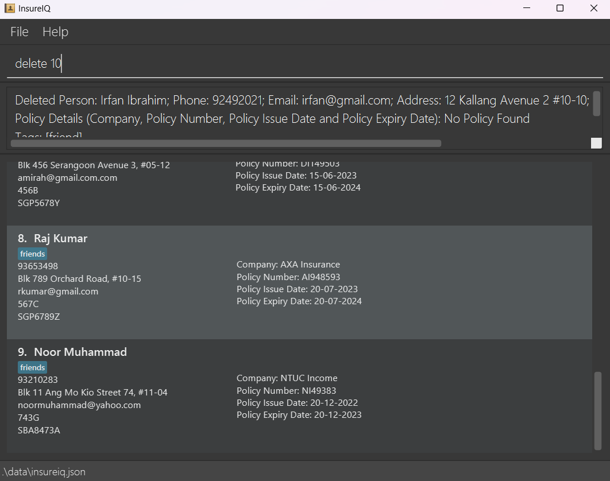
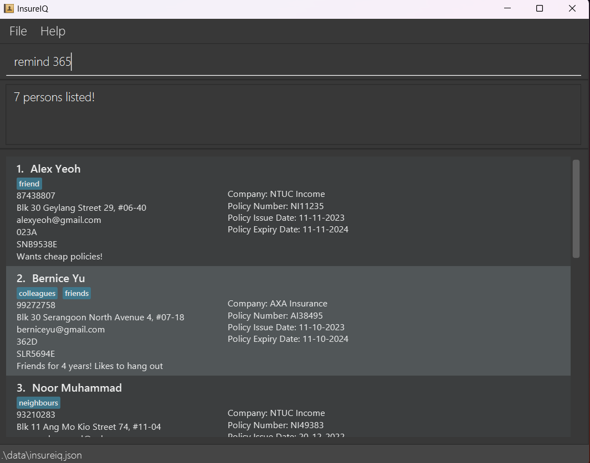
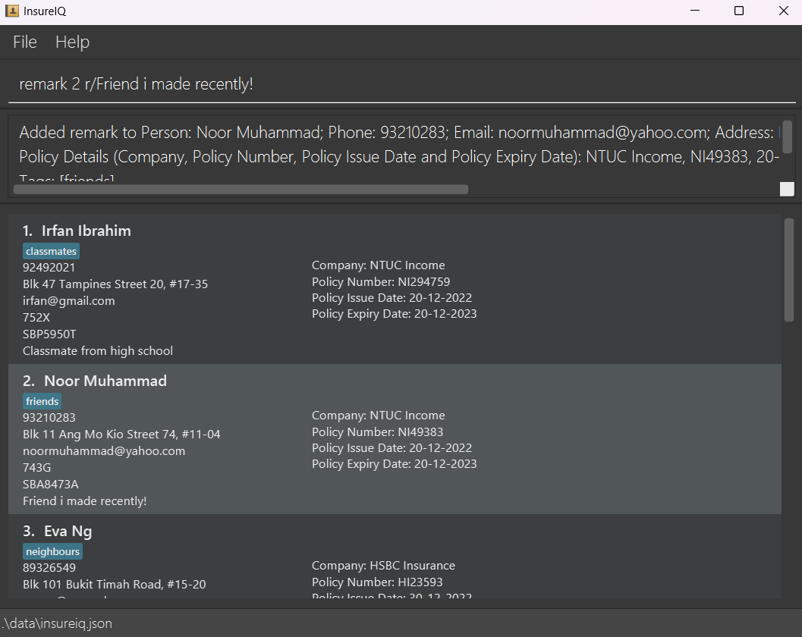

Welcome to the user guide for InsureIQ, the ultimate **contact management system for car insurance agents to keep track of multiple clients' details and policies**. Designed with efficiency in mind, this tool combines the speed of a Command Line Interface (CLI) with the user-friendly benefits of a Graphical User Interface (GUI). Experience a faster and more efficient contact management solution tailored to the unique needs of car insurance agents!

* Table of Contents
{:toc}

--------------------------------------------------------------------------------------------------------------------

<div style="page-break-after: always;"></div>

## Quick start

1. Ensure you have Java `11` or above installed in your Computer.

1. Download the latest `insureiq.jar` from [here](https://github.com/AY2324S1-CS2103T-W16-3/tp/releases/tag/v1.4).

1. Copy the file to the folder you want to use as the _home folder_ for InsureIQ.

1. Open a command terminal, `cd` into the folder you put the jar file in, and use the `java -jar insureiq.jar` command to run the application.<br>
   A GUI similar to the below should appear in a few seconds. Note how the app contains some sample data.<br>
   

1. Type the command in the command box and press Enter to execute it. e.g. typing **`help`** and pressing Enter will open the help window.<br>
   Some example commands you can try:

   * `list` : Lists all clients.

   * `delete 3` : Deletes the 3rd client shown in the current list.

   * `clear` : Deletes all clients.

   * `exit` : Exits the app.

1. Refer to the [Features](#features) below for details of each command. 

1. Look out for additional information in these alert blocks to master the use of InsureIQ!

<div markdown="span" class="alert alert-info">
**:information_source: Notes:**
Additional information for your understanding.
</div>

<div markdown="block" class="alert alert-success">
**:bulb: Tips:**
Tips for you to maximise efficiency.
</div>

<div markdown="block" class="alert alert-warning">
**:exclamation: Warnings:**
Important information you need to be careful about!
</div>


--------------------------------------------------------------------------------------------------------------------

<div style="page-break-after: always;"></div>


## Features

<div markdown="block" class="alert alert-info">

**:information_source: About the command format:**<br>

* Words in `UPPER_CASE` are the parameters to be supplied by you.<br>
  e.g. in `add n/NAME`, `NAME` is a parameter which can be used as `add n/John Doe`.

* Items in square brackets are optional.<br>
  e.g `n/NAME [t/TAG]` can be used as `n/John Doe t/friend` or as `n/John Doe`.

* Items with `…`​ after them can be used multiple times including zero times.<br>
  e.g. `[t/TAG]…​` can be used as ` ` (i.e. 0 times), `t/friend`, `t/friend t/family` etc.

* Parameters can be in any order.<br>
  e.g. if the command specifies `n/NAME p/PHONE_NUMBER`, `p/PHONE_NUMBER n/NAME` is also acceptable.

* Extraneous parameters for commands that do not take in parameters (such as `help`, `list`, `exit`, `sort` and `clear`) will be ignored.<br>
  e.g. if the command specifies `help 123`, it will be interpreted as `help`.

* If you are using a PDF version of this document, be careful when copying and pasting commands that span multiple lines as space characters surrounding line-breaks may be omitted when copied over to the application.
</div>

### Viewing help : `help`

Leads you to the help page, which is this user guide.


Format: `help`


### Listing all clients : `list`

Shows you all clients in your client list.

Format: `list`


### Adding a client : `add`

Adds client details to your client list. You can also choose to include policy details attached to a client.

<div markdown="span" class="alert alert-success">
**:bulb: Importing client information from a data file:**
InsureIQ data is stored in a JSON file, which you can add clients directly into. More information can be found in the section [Editing the data file](#editing-the-data-file).
</div>

Format: `add n/NAME i/NRIC p/CONTACT NUMBER e/EMAIL a/ADDRESS [t/TAG]... l/LICENCE PLATE [c/COMPANY
 pn/POLICY NUMBER pi/POLICY ISSUE DATE pe/POLICY EXPIRY DATE]`

* **All** client details **except tag** must be present when using this command.
* Tag is optional and this command allows multiple tags.
* If adding a client’s policy, all 4 policy fields must be present when using this command:
  * `c/COMPANY`
  * `pn/POLICY NUMBER`
  * `pi/POLICY ISSUE DATE`
  * `pe/POLICY EXPIRY DATE`

Examples:
* `add n/Irfan Ibrahim i/752X p/92492021 e/irfan@example.com a/Blk 47 Tampines Street 20,#17-35 t/classmates l/SBP8888T` adds a client Irfan without a policy.
* `add n/Bob Anderson i/578A p/54783402 e/bobanderson@gmail.com a/Blk 233 Serangoon Avenue 3, #05-12 t/teacher l/SGP1208J c/DEF Insurance pn/263J pi/20-09-2023 pe/19-09-2024` adds a client Bob with the policy he bought.

Acceptable values for each parameter:
* `n/NAME`: Alphanumeric.
* `i/NRIC`: Alphanumeric, _exactly_ 4 characters (3 digits + 1 letter).
* `p/CONTACT NUMBER`: Numeric, _exactly_ 8 characters.
* `e/EMAIL`: Alphanumeric and/or special characters, no white spaces allowed, standard email format.
* `a/ADDRESS`: Alphabets and/or special characters, white spaces allowed.
* `t/TAG`: Alphanumeric, no white spaces allowed.
* `l/LICENCE PLATE`: Alphanumeric, _up to_ 8 characters.
* `c/COMPANY`: Alphanumeric and/or special characters, white spaces allowed.
* `pn/POLICY NUMBER`: Alphanumeric, _up to_ 8 characters.
* `pi/POLICY ISSUE DATE` and `pe/POLICY EXPIRY DATE`: Date in the format dd-mm-yyyy.

Expected output upon success: <br>


Expected output upon failure:
* Missing any of the compulsory fields:<br>
```
Invalid command format! 
Error: Some of the required fields are missing. 
Please include the following: - NRIC(i/) - Licence Plate(l/) 
```
* Incomplete policy details:<br>
```
Invalid command format! 
Please include either all or none of the policy variables. 
You are missing the following: - Policy Expiry Date(pe/)
```
* Adding a client with an existing policy number:<br>
```
Error: The policy number is already in use
```
* Adding a client that already exists:<br>
```
Error: This person already exists in the address book
```

<div markdown="span" class="alert alert-info">
**:information_source: Adding clients with duplicate fields:**
The above error will only be raised when **ALL** fields in the client's details (name, NRIC, contact number, email, address) are the same.
</div>


### Editing a client : `edit`

Modify and/or updates existing policy information in your client list.

Format: `edit INDEX [n/NAME] [i/NRIC] [p/CONTACT NUMBER] [e/EMAIL] [a/ADDRESS] [t/TAG]... [c/COMPANY] [l/LICENCE PLATE]
 [pn/POLICY NUMBER] [pi/POLICY ISSUE DATE] [pe/POLICY EXPIRY DATE]`

* Edits the client policy details at the specified `INDEX`. The index refers to the index number shown in the displayed person list. The index **must be a positive integer** 1, 2, 3, …​
* **At least one** of the optional fields must be provided.
* Existing values will be updated to the input values.

<div markdown="block" class="alert alert-info">
**:information_source: Important notes about usage:**

* If you are adding a new policy number to a client with no attached policy, you **must** also add the company, policy issue date and policy expiry date.
* In case of already existing policy, individual updates to the policy number, company, policy issue date and policy expiry date are allowed.
* To delete an existing policy from a user, you may use any one of the following (using more than one of the below, or using while updating another policy field will still result in the deletion of the policy)
  * `c/!@#NO_COMPANY!@#` or 
  * `pi/01-01-1000` or 
  * `pe/01-01-1000` or 
  * `pn/NOPOLICY`, as per the 'Format' mentioned above.

</div>

Examples:
*  `edit 1 l/SNB9876E` updates the policy at the INDEX number 1 with the new licence plate provided.
*  `edit 2 pn/AB12345J pe/31-12-2024` updates the policy at the INDEX number 2 with the new policy number and expiry date.
*  `edit 3 c/!@#NO_COMPANY!@#` deletes the policy at the INDEX number 3.
*  `edit 4 pn/AB12345J c/!@#NO_COMPANY!@#` deletes the policy at the INDEX number 4.
*  `edit 5 pn/NO_POLICY c/!@#NO_COMPANY!@# pe/01-01-1000` deletes the policy at the INDEX number 5.

Acceptable values for each parameter:
* `n/NAME`: Alphanumeric.
* `i/NRIC`: Alphanumeric, _exactly_ 4 characters (3 digits + 1 letter).
* `p/CONTACT NUMBER`: Numeric, _exactly_ 8 characters.
* `e/EMAIL`: Alphanumeric and/or special characters, no white spaces allowed, standard email format.
* `a/ADDRESS`: Alphabets and/or special characters, white spaces allowed.
* `t/TAG`: Alphanumeric, no white spaces allowed.
* `l/LICENCE PLATE`: Alphanumeric, _up to_ 8 characters.
* `c/COMPANY`: Alphanumeric and/or special characters, white spaces allowed.
* `pn/POLICY NUMBER`: Alphanumeric, _up to_ 8 characters.
* `pi/POLICY ISSUE DATE` and `pe/POLICY EXPIRY DATE`: Date in the format dd-mm-yyyy.

Expected output upon success: <br>


Expected output upon failure:
* Invalid command format or no specified `INDEX` or negative `INDEX`:<br>
```
Invalid command format! 
edit: Edits the details of the person identified by the index number used in the displayed person list. Existing values will be overwritten by the input values.
Parameters: INDEX (must be a positive integer) [n/NAME] [p/PHONE] [e/EMAIL] [a/ADDRESS] [t/TAG]... [i/NRIC] [l/LICENCE_PLATE] [c/COMPANY] [pn/POLICY_NUMBER] [pi/POLICY_ISSUE_DATE] [pe/POLICY_EXPIRY_DATE] Example: edit 1 p/91234567 e/johndoe@example.com
```
* No field provided:<br>
```
At least one field to edit must be provided. 
```
* Editing a client such that all fields match with an existing client:
```
Error: This person already exists in the client list.
```


### Locating clients by fields : `find`

Finds client(s) based on conditions you specify.

Format: `find [n/NAME] [i/NRIC] [p/CONTACT NUMBER] [l/LICENCE PLATE] [e/EMAIL] [t/TAG]
[c/COMPANY] [pn/POLICY NUMBER] [pi/POLICY ISSUE DATE] [pe/POLICY EXPIRY DATE]`

* The search is case-insensitive e.g. `hans` will match `Hans`.
* **At least one** of the fields must be present.
* Value given with white spaces for each field is treated as 1 value e.g. `find n/Hans Bo` will return clients with 
names `Hans Bo` in it.
* Clients that partially matches with the field given will be returned e.g. `find l/SLA` will return all clients whose
licence plates contains `SLA`.

Examples:
* `find n/mary` returns all clients that has the name `Mary` such as `Mary Lim`, `Mary Koh`, `Mary White`.
* `find n/Hans Bo` returns all clients that has the name `Hans Bo` but not those with only `Hans` or `Bo` in it.
* `find n/john pn/AB12345J` returns all clients whose name contains `John` with policy number `AB12345J`.

<div markdown="span" class="alert alert-info">
**:information_source: Format of values do not matter:**
Unlike previous commands, the fields do not have to be in a specific format.
</div>

Expected output upon success:<br>


Expected output upon failure:

<div style="page-break-after: always;"></div>

* No field or invalid arguments given:
```
Invalid command format!  
find: Finds all persons whose names contain any of the specified fields (case-insensitive for values) and displays them as a list with index numbers.  
Parameters: [n/NAME] [l/LICENCE PLATE] [n/NAME] [i/NRIC] [p/CONTACT NUMBER] [l/LICENCE PLATE] [e/EMAIL] [c/COMPANY] [pn/POLICY NUMBER] [pi/POLICY ISSUE DATE] [pe/POLICY EXPIRY DATE]  
At least one parameter must be present.  
Example: find n/Alice Rodriguez
```
* Field prefix given but no value e.g. `n/ c/` :<br>
```
Error: No value detected for the following field(s): n/ c/
```

### Deleting a client : `delete`

Deletes the specified client from your client list.

Format: `delete INDEX`

* Deletes the client at the specified `INDEX`.
* The index refers to the index number shown in the displayed list of clients and is a compulsory field.

Examples:
* `list` followed by `delete 2` deletes the 2nd client in the data file.
* `find n/Betsy` followed by `delete 1` deletes the 1st client in the results of the `find` command.

Acceptable values for each parameter:
* `INDEX` : It must be a **must be a positive integer** 1, 2, 3, …​

Expected output upon success :


Expected output upon failure:
* Profile at the specified `INDEX` cannot be found:<br>
```
Error: Invalid Index
```
* Missing `INDEX` parameter:<br>
```
Error: Missing Index
```
* Incorrect `INDEX` parameter:<br>
```
Error: The parameter is not of the type positive integer
```

### Batch delete clients: `batchdelete`

Batch delete clients based on a specific condition.

<div markdown="span" class="alert alert-success">
**:bulb: Usefulness of `batchdelete`:**
Use `batchdelete` to quickly delete clients whose policies have expired, or for companies you are no longer working with. 
</div>

Format: `batchdelete [c/COMPANY] [dm/DELETE MONTH]`

* Batch delete specific clients in the data file.
* **Only one** of the optional fields must be provided.
* Clients that partially matches with the field given will be deleted e.g. `batchdelete c/NTUC` will delete all clients
  who buy policy from companies `NTUC Company` and `NTUC Insurance`.

Examples:
* `batchdelete dm/07-2020` batch delete clients whose policy expiry date is in July 2020.
* `batchdelete c/DEF Insurance` batch delete clients who buy policy from the company DEF Insurance.

Acceptable values for each parameter:
* `c/COMPANY`: Alphanumeric and/or special characters, white spaces allowed.
* `dm/DELETE MONTH`: Month and year in the format mm-yyyy.

Expected output upon success: <br>


<div markdown="span" class="alert alert-info">
**:information_source: Confirmation message**
Even if no clients are deleted, InsureIQ will still show a confirmation message to let you know that the `batchdelete` 
command has been successfully processed.
</div>

Expected output upon failure:
* No field provided:<br>
```
Invalid command format! 
batchdelete: batch delete people whose policy: 
(i) expiry date is in the corresponding month and year OR 
(ii) belongs to a company.
(i) Parameter: dm/MM-yyyy
Example: batchdelete dm/11-2022
(ii) Parameter: c/COMPANY NAME
Example: batchdelete c/Allianz 
```
* Both fields exist:<br>
```
Error: Please contain only either one field of dm/ or c/.
```
* Incorrect format for delete month:<br>
```
Delete month should be in the format MM-yyyy
```


### Sorting clients by policy expiry date : `sort`

Sorts the client list.

Format: `sort`

* Sorts the data file from earliest to latest policy expiry date.
* People in the list with no policy data will be at the end of the sorted list.

Examples:
* `sort` rearranges the displayed list to show which policies are expiring soonest.
* `find c/Google` followed by `sort` shows the policies expiring soonest in the results of the `find` command.

Expected output upon success :


<div style="page-break-after: always;"></div>

### Remind user of clients policy expiry date : `remind`

Reminds you of clients that have approaching policy expiry date within a certain number of days.

Format: `remind NUMBER_OF_DAYS`

* Filters the list based on policy expiry date that is within `NUMBER_OF_DAYS` from current date

Examples:
* `remind 30` returns the all clients with policy expiry date within 30 days from current date

Acceptable values for each parameter:
* `NUMBER_OF_DAYS` : Numeric, range from _0_ to _7305_

Expected output upon success (Current date is 12-11-2023):<br>


Expected output upon failure:
* `NUMBER_OF_DAYS` not in range _0_ to _7305_:<br>
```
Error: The value has to be between 0 and 7305 (both inclusive)
```
* `NUMBER_OF_DAYS` not numeric:<br>
```
Invalid command format! Error: The value is not a number
```
* `NUMBER_OF_DAYS` not given:
```
Invalid command format!  
remind: Finds all persons whose policy expiry dates is within the specified number of days.  
Parameters: Number of days  
Example: remind 30
```

<div style="page-break-after: always;"></div>

### Adding or removing remark to a client : `remark`

Adds or removes a remark to a client.

Format: `remark INDEX r/[REMARK]`

* `REMARK` is the remark that is going to be attached to the client
* `INDEX` refers to the index number shown in the displayed list of clients and is a compulsory field
* If `REMARK` is not given, it will remove the remark for the client at `INDEX`

Examples:
* `remark 1 r/Wants cheaper policies!` will attach the comment `Wants cheaper policies!` to the client that is at index `1`
* `remark 1` or `remark 1 r/` will remove the comment that is attached to client that is at index `1`

Acceptable values for each parameter:
* `INDEX` : It **must be a positive integer** 1, 2, 3, …​
* `REMARK` : Any characters

Expected output upon success:<br>


Expected output upon failure:
* Invalid `INDEX` parameter or no `INDEX` :<br>
```
Invalid command format!  
remark: Edits the remark of the person identified by the index number used in the last person listing. Existing remark will be overwritten by the input.
Parameters: INDEX (must be a positive integer) r/REMARK
Example: remark 1 r/Likes to swim.
```

<div style="page-break-after: always;"></div>


### Clearing all entries : `clear`

Clears all entries from your client list.

Format: `clear`

<div markdown="span" class="alert alert-warning">
**:exclamation: Caution:**This action is irreversible! You can copy the data file before clearing to have a backup.
</div>


### Exiting the program : `exit`

Exits the program.

Format: `exit`


### Saving the data

InsureIQ data are saved in the hard disk automatically after any command that changes the data. There is no need to save manually.


### Editing the data file

InsureIQ data are saved automatically as a JSON file `[JAR file location]/data/insureiq.json`. Advanced users are welcome to update data directly by editing that data file.

A sample client entry in the JSON file is as follows. The respective formats are specified in the [`add` feature guide](#adding-a-client--add).
```
{
    "name" : "Alex Yeoh",
    "phone" : "87438807",
    "email" : "alexyeoh@gmail.com",
    "address" : "Blk 30 Geylang Street 29, #06-40",
    "tags" : [ "friend" ],
    "nric" : "023A",
    "licencePlate" : "SNB9538E",
    "remark" : "Wants cheap policies!",
    "company" : "NTUC Income",
    "policyNumber" : "NI11235",
    "policyIssueDate" : "11-11-2023",
    "policyExpiryDate" : "11-11-2024"
}
```

<div markdown="span" class="alert alert-warning">
**:exclamation: Caution:** If your changes to the data file makes its format invalid, InsureIQ will discard all data and start with an empty data file at the next run. Hence, it is recommended to take a backup of the file before editing it.
</div>

--------------------------------------------------------------------------------------------------------------------

## FAQ

**Q1**: How do I check my Java version?<br>
**A1**: <br>
  1. For Window users, open Command Prompt.<br>
    * For Mac and Linux (Ubuntu) users, open Terminal.
  2. Type `java -version` and press Enter.
  3. If Java is installed, it will display the installed version.
     

**Q2**: What should I do if Java 11 is not installed in my device?<br>
**A2**: <br>
No worries! You can download Java 11 by the instruction below:
  1. If your device has other version of Java, we recommend you to uninstall it by visit the website below: <br>
    * Windows users: [uninstall Java on Windows](https://www.java.com/en/download/help/uninstall_java.html)<br>
    * Mac users: [uninstall Java on Mac](https://www.java.com/en/download/help/mac_uninstall_java.html)<br>
    * Linux users: [uninstall Java on Linux](https://www.java.com/en/download/help/linux_uninstall.html)
  2. Visit [Oracle's Java SE Downloads Page](https://www.oracle.com/java/technologies/downloads/#java11).
  3. Select the appropriate version for your operating system, click to accept the license agreement.
  4. Download the installer for your operating system.
  5. Run the installer and follow the installation instructions.

**Q3**: Can I transfer my InsureIQ data to another Computer?<br>
**A3**:<br>
Sure! you can transfer your data to another computer by the following steps below:
1. In the original computer you use InsureIQ, open the InsureIQ home folder, you can see a folder named `data` inside.
   
2. Clicking this folder, you will see a JSON file named `insureiq`.
   
3. After installing InsureIQ in the other computer, open the InsureIQ home folder.
4. If you see a `data` folder, open the folder, overwrite the file inside with the JSON file in step 2.
5. If you don't see a `data` folder, create the folder, copy the JSON file in step 2 into the folder you created.

--------------------------------------------------------------------------------------------------------------------

<div style="page-break-after: always;"></div>

## Known issues

1. **When using multiple screens**, if you move the application to a secondary screen, and later switch to using only the primary screen, the GUI will open off-screen. The remedy is to delete the `preferences.json` file created by the application before running the application again.

--------------------------------------------------------------------------------------------------------------------

## Glossary

_{TO DO}_


--------------------------------------------------------------------------------------------------------------------

## Command summary

| Action          | Format, Examples                                                                                                                                                                                                                                                                            |
|-----------------|---------------------------------------------------------------------------------------------------------------------------------------------------------------------------------------------------------------------------------------------------------------------------------------------|
| **Add**         | `add n/NAME i/NRIC p/CONTACT NUMBER e/EMAIL a/ADDRESS [t/TAG]... l/LICENCE PLATE [c/COMPANY pn/POLICY NUMBER pi/POLICY ISSUE DATE pe/POLICY EXPIRY DATE]` <br> e.g., `add n/Irfan Ibrahim i/752X p/92492021 e/irfan@example.com a/Blk 47 Tampines Street 20,#17-35 t/classmates l/SBP8888T` |
| **Clear**       | `clear`                                                                                                                                                                                                                                                                                     |
| **Delete**      | `delete INDEX`<br> e.g., `delete 3`                                                                                                                                                                                                                                                         |
| **Edit**        | `edit INDEX [n/NAME] [i/NRIC] [p/CONTACT NUMBER] [e/EMAIL] [a/ADDRESS] [t/TAG]... [c/COMPANY] [l/LICENCE PLATE] [pn/POLICY NUMBER] [pi/POLICY ISSUE DATE] [pe/POLICY EXPIRY DATE]`<br> e.g.,`edit 2 n/Bernice Yeo p/88881111`                                                               |
| **Exit**        | `exit`                                                                                                                                                                                                                                                                                      |
| **Find**        | `find [n/NAME] [i/NRIC] [p/CONTACT NUMBER] [l/LICENCE PLATE] [e/EMAIL] [t/TAG] [c/COMPANY] [pn/POLICY NUMBER] [pi/POLICY ISSUE DATE] [pe/POLICY EXPIRY DATE]`<br> e.g. `find n/John pn/AB12345J`                                                                                            |
| **List**        | `list`                                                                                                                                                                                                                                                                                      |
| **Help**        | `help`                                                                                                                                                                                                                                                                                      |
| **Sort**        | `sort`                                                                                                                                                                                                                                                                                      |
| **Remind**      | `remind NUMBER_OF_DAYS`<br> e.g. `remind 30`                                                                                                                                                                                                                                                | 
| **Remark**      | `remark INDEX r/[REMARK]`<br> e.g. `remark 1 r/Likes to swim`                                                                                                                                                                                                                               |
 | **BatchDelete** | `batchdelete [c/COMPANY] [dm/DELETE MONTH]` <br> e.g. `batchdelete c/DEF Insurance`                                                                                                                                                                                                         |

--------------------------------------------------------------------------------------------------------------------

Appendix

## UG workload distribution

| Full Name of Team Member | Agreed allocated sections, duties, roles                                 | Changes if any, record date and reasons for changes | Actual contribution to the UG                                            |
|--------------------------|--------------------------------------------------------------------------|-----------------------------------------------------|--------------------------------------------------------------------------|
| Brendan Neo Jia Wei      | Features `find` and `remind`, standardise image size of screenshots      | No change                                           | Features `find` and `remind`, standardise image size of screenshots      |
| Chua Yao Xuan            | Feature `remark`, rephrase UG to be user friendly                        | No change                                           | Feature `remark`, rephrase UG to be user friendly                        |
| Kum Chai Yin             | Features `add` and `batchdelete`, update section FAQ, create UG PDF file | No change                                           | Features `add` and `batchdelete`, update section FAQ, create UG PDF file |
| Rohan Sapra              | Features `delete` and `sort`                                             | No change                                           | Features `delete` and `sort`                                             |
| Suryansh Kushwaha        | Feature `edit`                                                           | No change                                           | Feature `edit`                                                           |
