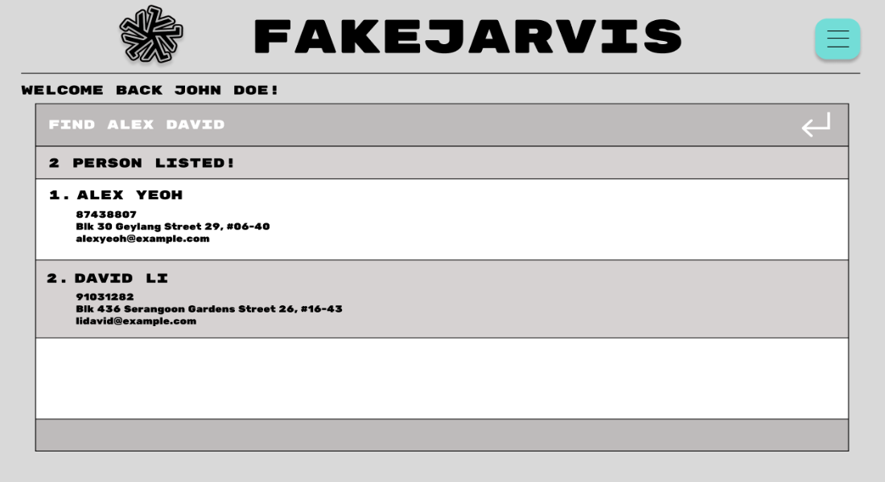

UniMate is a desktop app for students to **manage contacts** and **manage schedules** optimized for use via a Command Line Interface (CLI) while still having the benefits of a Graphical User Interface (GUI). If you can type fast, UniMate can get your contact management tasks done faster than traditional GUI apps.

<!-- * Table of Contents -->
<page-nav-print />

--------------------------------------------------------------------------------------------------------------------

## Quick start

1. Ensure you have Java `11` or above installed in your Computer.

1. Download the latest `UniMate.jar` from [here](https://github.com/se-edu/addressbook-level3/releases).

1. Copy the file to the folder you want to use as the _home folder_ for UniMate.

1. Open a command terminal, `cd` into the folder you put the jar file in, and use the `java -jar UniMate.jar` command to run the application. 
   A GUI similar to the below should appear in a few seconds. Note how the app contains some sample data. 
   

1. Type the command in the command box and press Enter to execute it. e.g. typing **`help`** and pressing Enter will open the help window. 
   Some example commands you can try:

   * `list` : Lists all contacts.

   * `add n/John Doe p/98765432 e/johnd@example.com a/John street, block 123, #01-01` : Adds a contact named `John Doe` to the Address Book.

   * `delete 3` : Deletes the 3rd contact shown in the current list.

   * `clear` : Deletes all contacts.

   * `exit` : Exits the app.

1. Refer to the [Features](#features) below for details of each command.

--------------------------------------------------------------------------------------------------------------------

## Features

<box type="info" seamless>

**Notes about the command format:** 

* Words in `UPPER_CASE` are the parameters to be supplied by the user. 
  e.g. in `add n/NAME`, `NAME` is a parameter which can be used as `add n/John Doe`.

* Items in square brackets are optional. 
  e.g `n/NAME [t/TAG]` can be used as `n/John Doe t/friend` or as `n/John Doe`.

* Items with `…`​ after them can be used multiple times including zero times. 
  e.g. `[t/TAG]…​` can be used as ` ` (i.e. 0 times), `t/friend`, `t/friend t/family` etc.

* Parameters can be in any order. 
  e.g. if the command specifies `n/NAME p/PHONE_NUMBER`, `p/PHONE_NUMBER n/NAME` is also acceptable.

* Extraneous parameters for commands that do not take in parameters (such as `help`, `list`, `exit` and `clear`) will be ignored. 
  e.g. if the command specifies `help 123`, it will be interpreted as `help`.

* If you are using a PDF version of this document, be careful when copying and pasting commands that span multiple lines as space characters surrounding line-breaks may be omitted when copied over to the application.
</box>

### Viewing help : `help`

Shows a message explaning how to access the help page.

Format: `help`

## Address Book Management

### Adding a person: `add`

Adds a person to the address book.

Format: `add n/NAME p/PHONE_NUMBER e/EMAIL a/ADDRESS [t/TAG]…​`

<box type="tip" seamless>

**Tip:** A person can have any number of tags (including 0)
</box>

Examples:
* `add n/John Doe p/98765432 e/johnd@example.com a/John street, block 123, #01-01`
* `add n/Betsy Crowe t/friend e/betsycrowe@example.com a/Newgate Prison p/1234567 t/criminal`

### Listing all persons : `list`

Shows a list of all persons in the address book.

Format: `list`

### Editing a person : `edit`

Edits an existing person in the address book.

Format: `edit INDEX [n/NAME] [p/PHONE] [e/EMAIL] [a/ADDRESS] [t/TAG]…​`

* Edits the person at the specified `INDEX`. The index refers to the index number shown in the displayed person list. The index **must be a positive integer** 1, 2, 3, …​
* At least one of the optional fields must be provided.
* Existing values will be updated to the input values.
* When editing tags, the existing tags of the person will be removed i.e adding of tags is not cumulative.
* You can remove all the person’s tags by typing `t/` without
    specifying any tags after it.

Examples:
*  `edit 1 p/91234567 e/johndoe@example.com` Edits the phone number and email address of the 1st person to be `91234567` and `johndoe@example.com` respectively.
*  `edit 2 n/Betsy Crower t/` Edits the name of the 2nd person to be `Betsy Crower` and clears all existing tags.

### Locating persons by name: `find`

Finds persons whose names contain any of the given keywords.

Format: `find KEYWORD [MORE_KEYWORDS]`

* The search is case-insensitive. e.g `hans` will match `Hans`
* The order of the keywords does not matter. e.g. `Hans Bo` will match `Bo Hans`
* Only the name is searched.
* Only full words will be matched e.g. `Han` will not match `Hans`
* Persons matching at least one keyword will be returned (i.e. `OR` search).
  e.g. `Hans Bo` will return `Hans Gruber`, `Bo Yang`

Examples:
* `find John` returns `john` and `John Doe`
* `find alex david` returns `Alex Yeoh`, `David Li` 
  

### Locating persons by tag: `filter`

Finds persons whose fields contain any of the given keywords.

Format: `filter [n/NAME] [p/PHONE] [e/EMAIL] [a/ADDRESS] [t/TAG]…​`

* Filter is case-insensitive. e.g. `cs2103` will match `CS2103`
* The order of the fields does not matter.
* All provided fields are searched
* All tags containing the words will be matched e.g. `Ba` will return `Badminton` or `Basketball` or `Football` or `Backgammon`.
* Only persons matching all specified fields will be returned (i.e. `and` search).

Examples:
* `filter t/CS2103` - Displays all contacts with the CS2103 tag or tags containing ``CS2103`` e.g. CS2103T
* `filter t/MA2116 t/CS1010S n/John e/@u.nus.edu` - Displays all contacts with the ``MA2116`` and ``CS1010S`` tags as well as
with a name containing ``John`` and an email address with the domain ``u.nus.edu``

### Deleting a person : `delete`

Deletes the specified person from the address book.

Format: `delete INDEX`

* Deletes the person at the specified `INDEX`.
* The index refers to the index number shown in the displayed person list.
* The index **must be a positive integer** 1, 2, 3, …​

Examples:
* `list` followed by `delete 2` deletes the 2nd person in the address book.
* `find Betsy` followed by `delete 1` deletes the 1st person in the results of the `find` command.

### Sort persons : `sort`

* Sorts all persons by specified `comparator`.
* The comparator refers to the attribute(s) provided for the basis to sort.
* Sorting is done in ascending order by default. To sort by descending order, the keyword `reverse` can be used (see Examples below).

Examples:
* `sort /byname` sorts all contacts in UniMate address book by the full name of `Person`
* `sort /byaddress /reverse` sorts all contacts in UniMate address book by the address of `Person`

### Clearing all entries : `clear`

Clears all entries from the address book.

Format: `clear`

### Exiting the program : `exit`

Exits the program.

Format: `exit`

## Calendar System

The Calendar System enables users to visually see the events that the 
user has in store for the current week. Additionally, the user is also
able to compare and isolate common pockets of free time with any of their contacts 
to plan activities together.

### Date Time Format

When inputting a date and time into a command, the following format is used: 

* `yyyy-MM-dd HH:mm` where
    * `yyyy` represents the year,
    * `MM` represents the month,
    * `dd` represents the day,
    * `HH` represents the hours and
    * `mm` represents the minutes.

### Adding an event: `addEvent`

Adds an event to the user's calendar.

Format: `addEvent d/DESCRIPTION ts/START_DATE_TIME ts/END_DATE_TIME`

* Adds the event starting from `START_DATE_TIME` and ending at `END_DATE_TIME`
* `START_DATE_TIME` and `END_DATE_TIME` must be in `yyyy-MM-dd HH:mm` format

Example:
* `addEvent Cry about deadlines d/12/12/2012 s/2200 e/2359`

### Deleting an event: `deleteEvent`

Deletes an event from the user's calendar.

Format `deleteEvent DATE_TIME_DURING_EVENT`

* Deletes an event at the specified date and time.
* An event is considered to be at that date and time if the date time lies between the start time (inclusive) and the
end time (exclusive).
* If there is no event during `DATE_TIME_DURING_EVENT`, an error will be thrown.

Example:
`deleteEvent 2023-11-01 12:00`

### Deleting multiple events: `clearEvents`

Clears all events within a specified time range.

Format: `clearEvents ts/START_DATE_TIME te/END_DATE_TIME c/CONFIRMATION`

* Deletes all events from the specified start date and time to the specified end date and time.
* An event is considered to be within the time range if overlaps with the time range for any period of time.
* When the `CONFIRMATION` is absent, the command shows all events within the time range but does not delete them. The
same command is then shown with the confirmation included that can be copied and pasted to execute the command.
* If there is no `START_DATE_TIME` or `END_DATE_TIME`, an error will be thrown.

### Viewing all events

Events can be viewed from the calendar that appears on the right.

Additionally, a list of all events are displayed by default at the bottom. This list at the bottom can be switched to a
task list with the `switchList` command. More information can be found under `Viewing all Tasks`.

### Adding an event to a contact

Adds an event to a contact's calendar at the specified index.

Format: `addContactEvent INDEX d/DESCRIPTION ts/START_DATE_TIME ts/END_DATE_TIME`

* Adds the event starting from `START_DATE_TIME` and ending at `END_DATE_TIME`
* `START_DATE_TIME` and `END_DATE_TIME` must be in `yyyy-MM-dd HH:mm` format

Example:
* `addContactEvent 1 d/Team Meeting ts/2024-01-01 09:00 te/2024-01-01 11:00`

### Deleting an event from a contact

Deletes an event from a contact's calendar at the specified index.

Format `deleteContactEvent INDEX ts/DATE_TIME`

* Deletes an event that contains the `DATE_TIME` from the contact

Example:
* `deleteContactEvent 1 ts/2024-01-01 09:00`

### Comparing calendars with AddressBook Contacts

There are two ways for the user to compare calendars with their AddressBook Contacts. 
Namely, the user can either isolate contacts of interest with their respective index,
or compare calendars with a group of contacts using their tags.

The resulting pop-up calendar will pop up with the time periods where all parties
are not available greyed out. The pop-up has to be closed in order for the user to access
the main application again.

## 1. Comparison by index

Format `compareCalendars INDEX1 INDEX2 ...`

* Compare calendar with the contacts at the respective `INDEX`
* `INDEX` must be a positive non-zero integer that is smaller than the size of the AddressBook
* If the `INDEX` number provided is invalid, an error will be returned

Example:
`compareCalendars 1 3 5`

## 2. Comparison by tag

Format `compareGroupCalendars TAG1 TAG2 ...`

* Compare calendar with the contacts with the specified `TAG`s
* If all the `TAG`s provided are invalid, the resulting pop-up will just display the user's calendar

Example:
`compareGroupCalendars school friends`

### Import *.ics files (Coming Soon)

User can import *.ics files, which will automatically be integrated into
their UniMate calendars.

Format: `import FILE_PATH`

### View other weeks of Calendar (Coming Soon)

User can view other weeks of their calendar schedule beyond just the
current week.

Format: `viewWeek DATE`

### Viewing another person's events: `viewContactEvents`

Creates a pop-up that displays a list of all events of a calendar belonging to a person in the Addressbook.

Format: `viewContactEvents INDEX`

* Views the event list of the person at `INDEX` as displayed.

## Task Management System

Tasks consist of a `DESCRIPTION` and a `DEADLINE`. 

### Viewing tasks: `switchList`

Switches the bottom list between the event list and the task list.

Format: `switchList`

* All input after `switchList` will be ignored.
* The bottom list displays the event list by default.

### Adding tasks: `addTask`

Adds a task to the Task Manager.

Format: `addTask d/DESCRIPTION [te/DEADLINE]`

* `DESCRIPTION` cannot be empty.
* `DEADLINE` must be in the same format given above for date and time.
* `DEADLINE` can also be omitted to create a task with no specified deadline

Examples: 
* `addTask d/Go for a run te/2023-02-14 19:00`
* `addTask d/Hydrate regularly!`

### Deleting tasks: `deleteTask`

Deletes a task from the Task Manager according to the index of the task displayed in the task list.

Format: `deleteTask INDEX`
        
* Throws an error if there is no `INDEX` present or if it exceeds the length of the task list.

### Sorting tasks: `sortTask`

Changes the way tasks in the Task Manager are displayed in the task list.

Format: `sortTasks PARAMETER`

* `PARAMETER` can only be `DESCRIPTION` or `DEADLINE`.

Examples:
* `sortTasks DESCRIPTION` sorts tasks by their `DESCRIPTION` alphabetically.
* `sortTasks DEADLINE` sorts tasks by their `DEADLINE`. Tasks with deadlines are prioritised above tasks with no 
deadline.

## Miscellaneous

### Force saving all contacts and events

Forces a save of all current contacts and events iin the program.

Format: `save`

* All data is also saved in the hard disk automatically when the program is closed.

### Saving the data

All data is saved in the hard disk automatically after any command that changes the data. There is no need to save manually.

### Editing the data file

AddressBook data is saved automatically as a JSON file `[JAR file location]/data/addressbook.json`.
Calendar data is saved automatically as a JSON file `[JAR file location]/data/calendar.json`.
Task-list data is saved automatically as a JSON file `[JAR file location]/data/taskmanager.json`.
Advanced users are welcome to update data directly by editing the data files.

<box type="warning" seamless>

**Caution:**
If your changes to the data file makes its format invalid, AddressBook will discard all data and start with an empty data file at the next run.  Hence, it is recommended to take a backup of the file before editing it.
</box>

### Archiving data files `[coming in v2.0]`

_Details coming soon ..._

--------------------------------------------------------------------------------------------------------------------

## FAQ

**Q**: How do I transfer my data to another Computer? 
**A**: Install the app in the other computer and overwrite the empty data file it creates with the file that contains the data of your previous UniMate home folder.

--------------------------------------------------------------------------------------------------------------------

## Known issues

1. **When using multiple screens**, if you move the application to a secondary screen, and later switch to using only the primary screen, the GUI will open off-screen. The remedy is to delete the `preferences.json` file created by the application before running the application again.

--------------------------------------------------------------------------------------------------------------------

## Command summary

Action     | Format, Examples
-----------|----------------------------------------------------------------------------------------------------------------------------------------------------------------------
**Add**    | `add n/NAME p/PHONE_NUMBER e/EMAIL a/ADDRESS [t/TAG]…​`   e.g., `add n/James Ho p/22224444 e/jamesho@example.com a/123, Clementi Rd, 1234665 t/friend t/colleague`
**Clear**  | `clear`
**Delete** | `delete INDEX`  e.g., `delete 3`
**Edit** | `edit INDEX [n/NAME] [p/PHONE_NUMBER] [e/EMAIL] [a/ADDRESS] [t/TAG]…​`  e.g.,`edit 2 n/James Lee e/jameslee@example.com`
**Find** | `find KEYWORD [MORE_KEYWORDS]`  e.g., `find James Jake`
**Filter** | `filter TAG [MORE_TAGS]`   e.g., `filter CSGOD CS2103`
**List** | `list`
**Help** | `help`
**addEvent** | `addEvent d/DESCRIPTION ts/START_DATE_TIME te/END_DATE_TIME`   e.g., `addEvent d/Cry about deadlines ts/2023-01-01 00:01 te/2023-12-31 23:59`
**deleteEvent** | `deleteEvent DATE_TIME`   e.g., `deleteEvent 2023-02-03 12:00`
**addContactEvent** | `addContactEvent INDEX d/DESCRIPTION ts/START_DATE_TIME te/END_DATE_TIME`   e.g., `addContactEvent 1 d/Cry about deadlines ts/2023-01-01 00:01 te/2023-12-31 23:59`
**deleteContactEvent** | `deleteContactEvent INDEX ts/DATE_TIME`   e.g., `deleteContactEvent 1 ts/2023-02-03 12:00`
**clearEvents** | `clearEvent ts/START_DATE_TIME te/END_DATE_TIME`   e.g., `clearEvent ts/2023-02-03 12:00 te/2023-02-03 14:00`
**addTask** | `addTask d/DESCRIPTION [te/DEADLINE]`   e.g. `addTask d/Go for a run te/2023-02-14 19:00`
**deleteTask** | `deleteTask INDEX`
**sortTasks** | `sortTasks PARAMETER`   e.g. `sortTasks DESCRIPTION`   e.g. `sortTasks DEADLINE`
**switchList** | `switchList`
**viewContactEvents** | `viewContactEvents INDEX`