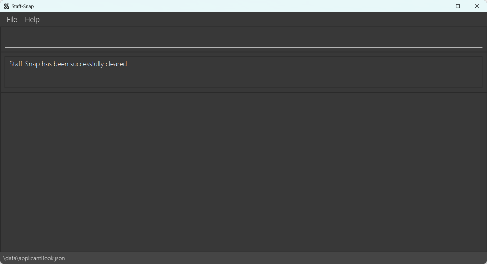

# Staff-Snap User Guide

## Introduction

Staff-Snap is an application meant HR managers hiring candidates to make applicant tracking easier.

## Table of Contents

- [Quick start ](#quick-start)
- [Glossary](#glossary)
  * [Definitions](#definitions-br)
  * [Parameters](#parameters-br)
  * [Notation Gudie](#notation-guide-br)

- [User Interface Guide](#user-interface-guide)
  * [Main Window GUI](#main-window-gui-br)
  * [Applicant Card GUI](#applicant-card-gui-br)
- [Features](#features)
  * [`help` : Viewing help](#help--viewing-help)
  * [`add` : Adding a new applicant](#add--adding-a-new-applicant)
  * [`edit` : Editing an applicant](#edit--editing-an-applicant)
  * [`list` : Listing all applicants](#list--listing-all-applicants)
  * [`delete` : Deleting an applicant](#delete--deleting-an-applicant)
  * [`find` : Finding an applicant by name](#find--finding-an-applicant-by-name)
  * [`sort`: Sorting applicants by descriptor](#sort--sorting-applicants-by-descriptor)
  * [`addi` : Adding an interview to an applicant](#addi--adding-an-interview-to-an-applicant)
  * [`editi` : Editing an interview of an applicant](#editi--editing-an-interview-of-an-applicant)
  * [`deletei` : Deleting an interview from an applicant](#deletei--deleting-an-interview-from-an-applicant)
  * [`status` : Editing an applicant status](#status--editing-an-applicant-status)
  * [`clear` : Clearing all applicant entries](#clear--clearing-all-applicant-entries)
  * [`exit` : Exiting the program](#exit--exiting-the-program)
  * [Saving the data](#saving-the-data)
  * [Editing the data file](#editing-the-data-file)

## Quick start 

- Download the latest jar file (`staffsnap.jar`) from [here](https://github.com/AY2324S1-CS2103T-W08-1/tp/releases/tag/v1.2.1). 
- Move the jar file to an empty folder where you would like to store the applicant data. 
  - Create a new empty folder (e.g. staffsnap) where you would like to store the applicant data 
  - Move the downloaded jar file from the download address into this folder.
- Open the `staffsnap.jar` file. 
  - For Mac Users:
    - For users not familiar with using the terminal window, 
    you can right-click the **file > Open With > JavaLauncher.app**. 
    Users may be shown a warning stating *“macOS cannot verify the developer of “staffsnap.jar”. Are you sure you want to open it?”*
    when opening the file for the first time. It is completely fine to click Open to continue launching Staff-Snap. 
    You should see the GUI displayed as shown below. 
    - For users more comfortable using the terminal window, 
    open a new Terminal window and navigate to the location of the folder containing the `staffsnap.jar` file 
    using the `cd` command. Launch the programme by typing in `java -jar staffsnap.jar` 
    and pressing Enter. You should see the GUI displayed as shown below.

  - For Windows Users:
    - Double-click the `staffsnap.jar` file to launch the application. 
    You should see the GUI displayed as shown below.
    - For users more comfortable using the command prompt, 
    you can open the command prompt and navigate to the folder containing the `staffsnap.jar` file using the `cd` 
    command followed by typing `java -jar staffsnap.jar` and pressing Enter. 
    You should see the GUI displayed as shown below.

 
## Glossary 

As Staff-Snap is packed with features and components to take note of, 
we’ve prepared tables summarising the important definitions, command formats, and parameters to take note of.

### Definitions  

| Term                           | Definition                                                                                                                                     |
|--------------------------------|------------------------------------------------------------------------------------------------------------------------------------------------|
| Parameter                      | Parameters are the details needed to perform a specific command. (e.g. When adding an applicant, a parameter can be the name of the applicant) |
| Command                        | A Command is an instruction given by the user to perform a certain action.                                                                     |
| Index                          | The position of a certain applicant in a list. The first applicant on a list in Staff-Snap will always have the index 1.                       |
| Graphical User Interface (GUI) | The GUI is the visual display of the application which users can interact with.                                                                |
| Command Line Interface (CLI)   | The CLI is a text-based interface that allows users to type in commands to interact with the application.                                      |

### Parameters  

| Parameter | Description                   | Constraints                                                                                                                                                                                                                                                                                                                                                                                                                                                                                                                                                                                                                                                                                                                                  | Valid Examples                 | Invalid Examples                    |
|-----------|-------------------------------|----------------------------------------------------------------------------------------------------------------------------------------------------------------------------------------------------------------------------------------------------------------------------------------------------------------------------------------------------------------------------------------------------------------------------------------------------------------------------------------------------------------------------------------------------------------------------------------------------------------------------------------------------------------------------------------------------------------------------------------------|--------------------------------|-------------------------------------|
| **n/**    | Name of applicant             | Names should only contain alphanumeric characters and spaces, should not be blank, and should not exceed 25 characters.                                                                                                                                                                                                                                                                                                                                                                                                                                                                                                                                                                                                                      | James Lee, Rosemary Lee Curtis | ~Avaa~, James-Lee Curtis, 晓明        |
| **hp/**   | Handphone number of applicant | Phone numbers should only contain numbers, should be at least 3 digits long, and at most 30 digits long.                                                                                                                                                                                                                                                                                                                                                                                                                                                                                                                                                                                                                                     | 98765432, 8123456798           | 9aaa9123, 21                        |
| **e/**    | Email of applicant            | Emails should be of the format **local-part@domain**.    The **local-part** should only contain alphanumeric characters and these special characters, excluding the parentheses, (+_.-). The **local-part** may not start or end with any special characters.    This is followed by a **'@'** and then a **domain name**. The **domain name** is made up of domain labels separated by periods. The domain name must end with a domain label at least 2 characters long, have each domain label start and end with alphanumeric characters, and have each domain label consist of alphanumeric characters, separated only by hyphens, if any.    The entire email address must not be more than 30 characters long. | james@example.com              | james.com                           |
| **p/**    | Position applied              | Position applied can take any values, and it should not be blank                                                                                                                                                                                                                                                                                                                                                                                                                                                                                                                                                                                                                                                                             | Software Engineer, Salesperson | *empty string*                      |
| **d/**    | Descriptor                    | Descriptor must be either a [name], [phone], [email], [position], [score], or [status].                                                                                                                                                                                                                                                                                                                                                                                                                                                                                                                                                                                                                                                      | [name], [position], [status]   | age, 123123                         |
| **t/**    | Interview type                | Interview types should not be empty and should be at most 14 characters long.                                                                                                                                                                                                                                                                                                                                                                                                                                                                                                                                                                                                                                                                | Behavioural                    | Group assessment, Online assessment |
| **r/**    | Interview rating              | Interview ratings should be a number between 0.0 and 10.0 to 1 decimal place.                                                                                                                                                                                                                                                                                                                                                                                                                                                                                                                                                                                                                                                                | 9.9, 8.9                       | 9.3333333, 11.2                     |
| **i/**    | Interview index               | Interview index must be a positive integer and not more than the total number of interviews.                                                                                                                                                                                                                                                                                                                                                                                                                                                                                                                                                                                                                                                 | 1                              | a99a, 25                            |
| **s/**    | Status of applicant           | The status of an applicant can only be "o" (offered), "r" (rejected), or "u" (undecided).                                                                                                                                                                                                                                                                                                                                                                                                                                                                                                                                                                                                                                                    | o, r, u                        | offered, 999                        |

### Notation Guide  

| Notation                                                                                                                     | Explanation                                                                                               | Example                                                                                                                                            |
|------------------------------------------------------------------------------------------------------------------------------|-----------------------------------------------------------------------------------------------------------|----------------------------------------------------------------------------------------------------------------------------------------------------|
| Words in `UPPER_CASE`                                                                                                        | These are the parameters to be supplied by the user.                                                      | The command format `addi INDEX t/TYPE r/RATING` can be used in the form `addi 1 t/behavioural r/9.8` with the necessary details as the parameters. |
| Items in square brackets                                                                                                     | These are optional parameters for the users to supply.                                                    | The command `find KEYWORD [MORE_KEYWORDS]` can be used in the form `find Johnny Lee` as well as `find Johnny`                                      |
| Parameters can be in any order                                                                                               | Parameters for all commands are valid regardless of the order they are supplied in.                       | Both the commands `add n/Lee Soo Man hp/98891131…` and `add hp/98891131 n/Lee Soo Man…` are valid and will be accepted.                            |
| Extraneous parameters for commands that do not take in parameters such as `help`, `list`, `clear`, `exit` will be ignored.   | If any parameters are given for commands that do not require them, the given parameters will be ignored.  |

## User Interface Guide

### Main Window GUI  

| GUI Component | Purpose                                                                 |
|---------------|-------------------------------------------------------------------------|
| Command Area  | This area is where users type in commands for the application.          |
| Response Area | This is where Staffsnap displays messages in response to user commands. |
| Working Area  | This is where the list of applicants is displayed.                      |

### Applicant Card GUI  

| GUI Component     | Purpose                                                                                                                                       |
|-------------------|-----------------------------------------------------------------------------------------------------------------------------------------------|
| Applicant details | This is where details about the applicant are displayed. These include their name, handphone number, email, and position applied.             |
| Applicant status  | This is where the status of the applicant is displayed. The status is categorised into Offered, Rejected, and Undecided.                      |
| Overall score     | This is where the overall score of the applicant is displayed. This allows for a fast and easy way to know the performance of each applicant. |
| Interview score   | This is where the score for a specific interview is stored.                                                                                   |

## Features

---

### `help` : Viewing help

Opens up the user guide in the browser. Also displays a list of basic commands the user can use.

Format: `help`

UI mockup:

---

### `add` : Adding a new applicant

Adds a new applicant to the current list.

Format: `add n/NAME hp/PHONE e/EMAIL p/POSITION`

Example:
* `add n/John Doe hp/91234567 e/johndoe@gmail.com p/Software Engineer`
* `add n/Jane Greenwood p/Project Manager e/janeg@yahoo.com hp/91234567`

UI mockup:

---

### `edit` : Editing an applicant

Edits the details of an applicant in the list.

Format: `edit INDEX [n/NAME] [hp/PHONE] [e/EMAIL] [p/POSITION]`
* Edits the person at the specified `INDEX`. The index refers to the index number shown in the displayed person list.
* At least one of the optional fields must be provided.
* Existing values will be updated by the input values.

Example:
* `edit 1 n/Vijay Sankar Kumar` edits the name of the 1st applicant in the list.
* `edit 2 hp/80081234 e/newEmail@hotmail.com` edits the phone number and email of the 2nd applicant in the list.

UI mockup:

---

### `list` : Listing all applicants

Displays the full list of all applicants.

Format: `list`

UI mockup:

---

### `delete` : Deleting an applicant

Deletes a particular applicant based on their index number.

Format: `delete INDEX`
* Deletes the person at the specified `INDEX`.
* The index refers to the index number shown in the displayed applicant list.
* The index **must be a positive integer** 1, 2, 3, ….

Examples:
* `list` followed by `delete 2` deletes the 2nd person in the applicant list.
* `sort d/name` followed by `delete 3` deletes the 3rd person in the sorted applicant list.

UI mockup:

---

### `find` : Finding an applicant by name

Find employees whose name contains a particular keyword.

Format: `find KEYWORD [MORE_KEYWORDS]`
* The search is case-insensitive, e.g. `JOHN` will return `john`.
* The order of the keywords does not matter, e.g. `Alice Tan` will match `Tan Alice`.
* Only the applicant name is searched.
* Any person whose name contains the sequence of characters given as the keyword will be given as a result, e.g. `Ed` will match both `Edward` and `Ed`.
* Persons matching at least one keyword will be returned (i.e. OR search), e.g. `Ben Bobby` will return `Ben Yang`, `Bobby Chin`.

Examples:
* `find IVAN` finds any applicant whose name contains “ivan”.
* `find IVAN CHEW` finds any applicant whose name contains “ivan” or contains “chew”.

UI mockup:

---

### `sort`: Sorting applicants by descriptor

Sorts the applicant list by using a particular descriptor as the sorting criteria.

Format: `sort d/DESCRIPTOR`
* `DESCRIPTOR` must be either `name` or `phone` or `email` or `position` or `score` or `status`.

Examples:
* `sort d/name` sorts the applicant list by name in alphabetical order.
* `sort d/phone` sorts the applicant list by phone numbers in ascending order.
* `sort d/email` sorts the applicant list by email in alphabetical order.
* `sort d/position` sorts the applicant list by positions in alphabetical order.
* `sort d/score` sorts the applicant list by score in descending order.
* `sort d/status` sorts the applicant list by status in alphabetical order.

UI mockup:

---

### `addi` : Adding an interview to an applicant

Adds a new interview to an applicant. In the case of duplicate names, the system will automatically increment the last 
number in the user input by 1, or add 1 if there is no number.

Duplicate handling: 
* Entering `technical12`, then `technical12` again will result in the 2nd entry being converted to 
`technical13`.
* Entering `technical`, then `technical` again will result in the 2nd entry being converted to `technical1`.

Format: `addi INDEX t/TYPE [r/RATING]`

Examples:
* `addi 1 t/technical r/8.6` adds a Technical interview with rating 8.6 to the 1st person in the displayed applicant list.
* `addi 3 t/screening` adds a Screening interview without rating to the 3rd person in the displayed applicant list.

---

### `editi` : Editing an interview of an applicant

Edits an interview of an applicant.

Format: `editi INDEX i/INTERVIEW_INDEX [t/TYPE] [r/RATING]`
* Edits the person at the specified `INDEX`. The index refers to the index number shown in the displayed person list.
* At least one of the optional fields must be provided.
* Existing values will be updated by the input values.

Examples:
* `editi 1 i/1 t/technical r/7.8` edits the 1st interview of the 1st person in the displayed applicant list to a technical interview with rating 7.8.
* `editi 3 i/2 t/screening` edits the 2nd interview type of the 3rd person in the displayed applicant list to a screening interview.
* `editi 2 i/1 r/8.9` edits the 1st interview rating of the 2nd person in the displayed applicant list to 8.9.

---

### `deletei` : Deleting an interview from an applicant

Deletes an interview from an applicant.

Format: `deletei INDEX i/INTERVIEW_INDEX`

Examples:
* `deletei 1 i/2` deletes the 2nd interview of the 1st person in the displayed applicant list.

---

### `status` : Editing an applicant status

Edits the status of an applicant.

Format: `status INDEX s/STATUS`
* Edits the person at the specified `INDEX`. The index refers to the index number shown in the displayed person list.
* `STATUS` must be either `o`(offered) or `r`(rejected) or `u`(undecided).

Examples:
* `status 3 s/o` updates the status of the 3rd person in the displayed applicant list to OFFERED.

---

### `clear` : Clearing all applicant entries

After typing `clear`, system asks the user to confirm clearing. If user types `yes`, all the current data stored 
in the system is the cleared. Else, the clear process is cancelled. 

Format: `clear`

UI mockup:

---

### `exit` : Exiting the program

Exits the program.

Format: `exit`

---

### Saving the data

Automatically saves the data to a local storage whenever there is a change to the applicant list. There is no need to save manually.

---

### Editing the data file

<box type="warning" header="**Caution**">
    If the format of the edited data file is invalid, Staff-Snap will override the existing data file with an empty data file in the next run. Please make a backup before you attempt to edit the data file!
</box>

Staff-Snap applicant data are saved automatically as a JSON file `[JAR file location]/data/applicantBook.json`. Advanced users are welcome to update data directly by editing that data file.

