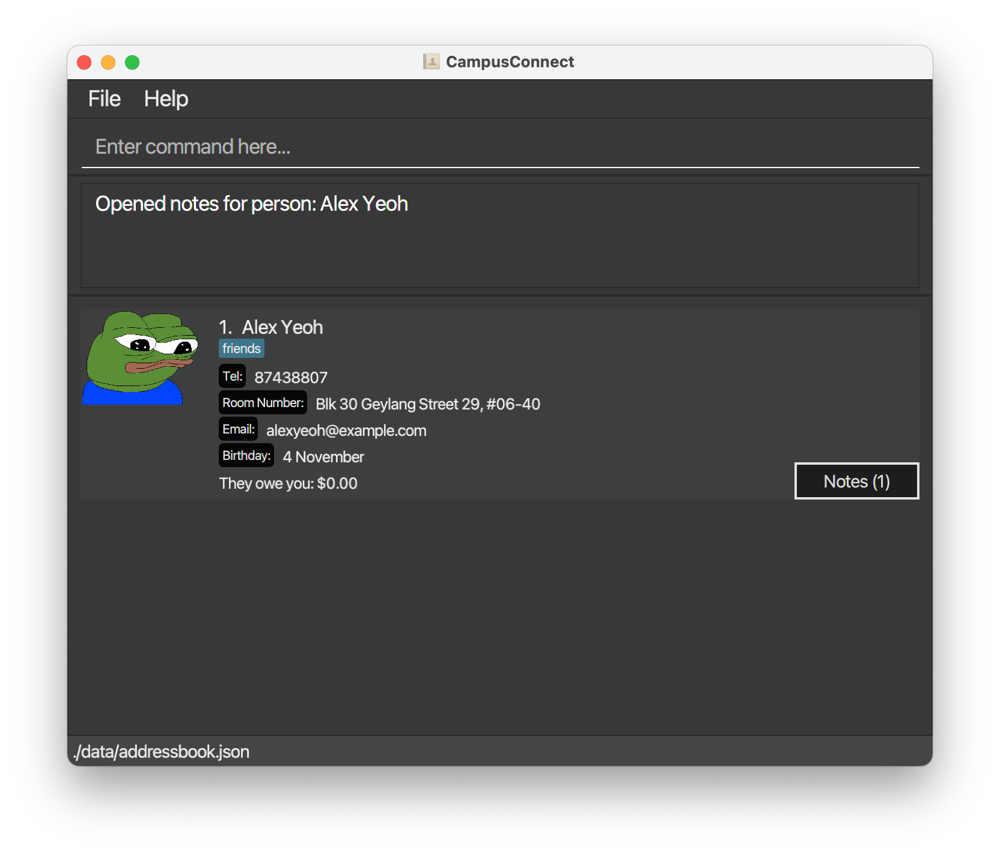

# CampusConnect User Guide

___Empowering connections in the NUS community is just a few keystrokes away!___

**CampusConnect** is a desktop application built for **NUS students** living on campus to help them **stay organised**, **stay connected**, and **make the on-campus experience at NUS stress-free**. It is **optimised for use** via **Command Line Interface (CLI)** while benefiting from a **Graphical User Interface (GUI)**.

Here is an **overview** of how CampusConnect can enhance your campus experience:

- Store and edit contact profiles of your friends
- Receive timely notifications to celebrate your friends' birthdays
- Tracks debts owed by you to your friends or owed to you by your friends

This user guide shows you how to get started with using CampusConnect -- it has easy-to-understand explanations and examples to help you grasp its various features.

For a more technical and comprehensive overview of CampusConnect's codebase, please refer to our [Developer Guide](DeveloperGuide.md).

# Table of Contents
1. Quick Start
2. Features 
   - Request help [Coming Soon]
   - Add normal contact
   - Add emergency contact
   - Add alternative information to contact
   - Upload contact's photo
   - Update contact's photo
   - Search contact
   - List all contacts
   - List emergency contacts
   - Delete normal contact
   - Delete emergency contact
   - Undo last action [Coming Soon]
   - Receive actual birthday notification 
   - Receive upcoming birthday notification [Coming Soon]
   - Opt out notification
   - Track payment [Coming Soon]
   - Change language [Coming Soon]
3. Troubleshooting / FAQ

--------------------------------------------------------------------------------------------------------------------

## Quick start

1. Ensure you have Java `11` or above installed in your Computer.

2. Download the latest `CampusConnect.jar` from [here](https://github.com/AY2324S1-CS2103T-T13-2/tp/releases).

3. Copy the file to the folder you want to use as the _home folder_ for the application.

4. Open a command terminal, `cd` into the folder you put the jar file in, and use the `java -jar CampusConnect.jar` command to run the application. 
   A GUI similar to the below should appear in a few seconds. Note how the app contains some sample data. 
   

5. Type the command in the command box and press Enter to execute it. e.g. typing **`help`** and pressing Enter will open the help window. 
   Some example commands you can try:

   * `list` : Lists all contacts.

   * `add n/John Doe p/98765432 e/johnd@example.com a/John street, block 123, #01-01` : Adds a contact named `John Doe` to CampusConnect.

   * `add n/Jane Doe p/98765433 e/janed@example.com a/Jane street, block 123, #01-01 t/floorball t/suitemate` : Adds a contact named `Jane Doe` to CampusConnect who is tagged with the `floorball` and `suitemate` tags.

   * `optout notify birthdays` : Opts out from birthday notifications.

   * `addemer 3 RA` : Marks the 3rd contact in the list as an RA (Residential Assistant).

   * `find name/Doe` : Finds all contacts who have "Doe" in their name.

   * `exit` : Exits the app.

6. Refer to the [Features](#features) below for details of each command.

--------------------------------------------------------------------------------------------------------------------

## Features

<box type="info" seamless>

**Notes about the command format:** 

* Words in `UPPER_CASE` are the parameters to be supplied by the user. 
  e.g. in `add n/NAME`, `NAME` is a parameter which can be used as `add n/John Doe`.

* Items in square brackets are optional, ___with `addalt` as an exception. (Refer to [addalt](#addalt) under Features)___ 
  e.g `n/NAME [t/TAG]` can be used as `n/John Doe t/friend` or as `n/John Doe`.

* Items with `…`​ after them can be used multiple times including zero times. 
  e.g. `[t/TAG]…​` can be used as ` ` (i.e. 0 times), `t/friend`, `t/friend t/family` etc.

* Parameters can be in any order. 
  e.g. if the command specifies `n/NAME p/PHONE_NUMBER`, `p/PHONE_NUMBER n/NAME` is also acceptable.

* Extraneous parameters for commands that do not take in parameters (such as `help`, `list`, `exit` and `clear`) will be ignored. 
  e.g. if the command specifies `help 123`, it will be interpreted as `help`.

* If you are using a PDF version of this document, be careful when copying and pasting commands that span multiple lines as space characters surrounding line-breaks may be omitted when copied over to the application.
</box>

### Request help [Coming Soon]

### Add normal contact

Add a new contact with basic details like name, phone number, email, and address.

Format: `add n/NAME p/PHONE_NUMBER e/EMAIL a/ADDRESS [t/TAG]`
* `n/NAME` Replace NAME with the contact's name.
* `p/PHONE_NUMBER` Replace PHONE_NUMBER with the contact's phone number.
* `e/EMAIL` Replace EMAIL with the contact's email address.
* `a/ADDRESS` Replace ADDRESS with the contact's physical address.
* `[t/TAG] (Optional)` You can add tags to help categorise your contacts. Replace TAG with the desired tag, e.g., "friend", "colleague", etc. Multiple tags can be added by repeating the `[t/TAG]` format.

Examples
* `add n/John Doe p/98765432 e/johnd@example.com a/John street, block 123, #01-01 t/friend`
  * Adds a contact named "John Doe" with the phone number "98765432", email "johnd@example.com", address "John street, block 123, #01-01", and a tag "friend"
* `add n/Betsy Crowe e/betsycrowe@example.com a/Newgate Prison p/1234567 t/friend t/colleague`
  * Adds a contact named "Betsy Crowe" with the email "betsycrowe@example.com", address "Newgate Prison", phone "1234567", and two tags "friend" and "colleague"

### Add emergency contact

Adds an existing contact as an emergency contact.

Format: `addemer INDEX [tag/TAG]`
* `tag/TAG` Optional tag indicating the type of emergency contact, e.g. RA (residential assistant) or SO (security officer)

Examples:
* `addemer 1 RA`
  * Indicates that the contact at index 1 is the residential assistant (RA) for contact during emergencies

###  Add alternative information to contact

Adds alternative contact information to an existing contact.

Format: `addalt INDEX [tg/TELEGRAM] [e2/SECONDARY_EMAIL] [li/LINKEDIN]`

At least one of the optional fields must be provided.

Examples:
* addalt 1 tg/johndoe_telegram e2/johndoe2@example.com 
  * Adds John Doe's Telegram and secondary email
* addalt 2 li/betsycrowe_linkedin
  * Adds Betsy Crowe's LinkedIn

###  Upload contact's photo

Uploads a photo for an existing contact.

Format: `uploadphoto INDEX path/PHOTO_PATH`

Examples:
* `uploadphoto 1 path/C:/photos/johndoe.jpg`
  * Uploads a photo for the 1st person from the specified path.
* `uploadphoto 2 path/C:/photos/betsycrowe.png`
  * Uploads a photo for the 2nd person from the specified path.

###  Update contact's photo

Updates the photo of an existing contact.

Format: `updatephoto INDEX path/NEW_PHOTO_PATH`

Examples:
* `updatephoto 1 path/C:/photos/new_johndoe.jpg`
  * Updates the photo for the 1st person with a new image from the specified path.
* `updatephoto 2 path/C:/photos/new_betsycrowe.png`
  * Updates the photo for the 2nd person with a new image from the specified path.

###  Search contact

Generally, search commands will contain the following tokens:

* `FIELD`: Specifies the field to search within (name, phone, email, address, tag).

* `KEYWORD`: Words or characters you're looking for in a contact's information.

Format: `find FIELD/KEYWORD [FIELD/KEYWORD]`

You may include multiple field-keyword combinations. The `find` command will perform a logical `AND` on all field-keyword combinations.

#### Search contact by name

Locates persons in the address book whose names contain the given keywords.

Format: `find name/KEYWORD`

Examples:
* `find name/John`
  * Returns all contacts with names that contain "John" (e.g. "John Smith", "John Doe")
* `find name/Alex name/Ye`
  * Returns all contacts with names that contain both "Alex" and "Ye" (e.g. "Alex Yeoh", "Yervis Alexis")

#### Search contact by phone number

Locates persons in the address book whose phone numbers contain the given digits.

Format: `find phone/KEYWORD`

Examples:
* `find phone/9876`
  * Returns all contacts with phone numbers that contain "9876"

#### Search contact by email

Locates persons in the address book whose email addresses contain the given keywords.

Format: `find email/KEYWORD`

Examples:
* `find email/tan email/@u.nus.edu`
  * Returns all contacts with email addresses that contain "tan" and "@u.nus.edu"

#### Search contact by address

Locates persons in the address book whose addresses contain the given keywords.

Format: `find address/KEYWORD`

Examples:
* `find address/street`
  * Returns all contacts with addresses that contain the word "street"

#### Search contact by tag

Locates persons in the address book that have the given tags.

Format: `find tag/KEYWORD`

Examples:
* `find tag/RA`
  * Returns all contacts that have tags containing the string "RA"

#### Multiple field search

Combines multiple search criteria for more specific searching. Search criteria are combined with the logical `AND`.

Format: `find FIELD/KEYWORD FIELD/KEYWORD [ANOTHER_FIELD/ANOTHER_KEYWORD]`

Examples:
* `find name/John tag/friend`
  * Returns all contacts named John who also have the "friend" tag
* `find email/@u.nus.edu phone/9876`
  * Returns all contacts with emails containing "@u.nus.edu" and phone numbers containing "9876"

###  List all contacts

Shows a list of all contacts.

Format: `list`

###  List emergency contacts

Lists all emergency contacts that have been registered.

Format: `listemer [tag/TAG]`
* `tag/TAG` Optional tag to filter for emergency contacts of a certain type, e.g. RA (residential assistant) or SO (security officer)

Examples:
* `listemer`
* `listemer tag/RA`
  * Only lists emergency contacts tagged as residential assistants (RA)

###  Delete normal contact

Deletes an existing contact from the address book.

Format: `delete INDEX`

Examples:
* `delete 1`
  * Deletes the 1st person from the list
* `delete 2`
  * Deletes the 2nd person from the list

###  Delete emergency contact

Removes contact as an emergency contact.

Note: Contact will not be deleted, only unmarked as an emergency contact.

Format: `delemer INDEX`

Examples:
* `delemer 1`
  * Indicates that contact at index 1 is no longer an emergency contact

###  Undo last action [Coming Soon]
###  Receive actual birthday notification

Receives a pop-up notification that contains a list of people in CampusConnect whose birthdays have arrived.

Upon launching the application, if any of your contacts’ birthday in CampusConnect have arrived, you should see the following pop-up notification:  

The notification will contain the names of the birthday individuals saved in CampusConnect.

###  Receive upcoming birthday notification [Coming Soon]
###  Opt out notification

Opts you out from receiving birthday related notifications, such as turning off actual birthday notification feature.

Format: `optout NOTIFICATION_DESCRIPTION`

- `NOTIFICATION_DESCRIPTION` Mandatory field to enter which only includes the following and are not case-sensitive:
    - `Notify Birthdays`
    - `All`

Examples:
- `optout notify birthdays`
- `optout Notify Birthdays`
- `optout NOTIFY BIRTHDAYS`
    - Requests to opt out from receiving actual birthday notifications in the future.
- `optout all`
    - Requests to turn off all kinds of notifications CampusConnect will send.

Upon request to opt out notification, you should see the following pop-up message:  

Select `OK` to opt out notifications or `Cancel` to cancel the request.

Below shows some examples of ___invalid usage___ of the command and the response that CampusConnect will provide.

Invalid Input Example | Application Output
---|---
**optout notifications** | Invalid `NOTIFICATION_DESCRIPTION` (refer to aforementioned for the list of `NOTIFICATION_DESCRIPTION` to enter).
**optout** | `NOTIFICATION_DESCRIPTION` cannot be empty.

### Notes feature

#### 1. Adding Notes to a Person

##### Command Format:
    note INDEX NOTE_CONTENT

##### Parameters:
- `INDEX`: The position of the person in the list you want to add a note to. This should be a positive integer.
- `NOTE_CONTENT`: The content of the note you want to add.

##### Example:
If you want to add a note to the person at position 1 in the list, you would use:
    
    note 1 This is a sample note for the person.

This will add a note "This is a sample note for the person." to the person at index 1.

#### 2. Removing Notes from a Person

##### Command Format:
    removenote INDEX_PERSON INDEX_NOTE

##### Parameters:
- `INDEX_PERSON`: The position of the person in the list you want to remove a note from. This should be a positive integer.
- `INDEX_NOTE`: The position of the note in the person's list of notes you want to remove. This should be a positive integer.

##### Example:
If you want to remove the 2nd note from the person at position 1 in the list, you would use:
    
    removenote 1 2

This will remove the 2nd note from the person at index 1.

##### Note:
Always make sure the indices provided are valid and within the bounds of the list. Invalid indices will result in an error.
Make sure to familiarize yourself with the commands and use them as per your needs. If you have any issues or questions, refer to the application's help section or contact the support team.

###  Track payment [Coming Soon]
###  Change language [Coming Soon]

--------------------------------------------------------------------------------------------------------------------

## FAQ

**Q**: How do I transfer my data to another Computer? 
**A**: Install the app in the other computer and overwrite the empty data file it creates with the file that contains the data of your previous CampusConnect home folder.

--------------------------------------------------------------------------------------------------------------------

## Known issues

1. **When using multiple screens**, if you move the application to a secondary screen, and later switch to using only the primary screen, the GUI will open off-screen. The remedy is to delete the `preferences.json` file created by the application before running the application again.

--------------------------------------------------------------------------------------------------------------------

## Command summary

Action        | Format, Examples
--------------|----------------------------------------------------------------------------------------------------------------------------------------------------------------------
**Add**       | `add n/NAME p/PHONE_NUMBER e/EMAIL a/ADDRESS [t/TAG]…​`   e.g., `add n/James Ho p/22224444 e/jamesho@example.com a/123, Clementi Rd, 1234665 t/friend t/colleague`
**Addemer**   | `addemer INDEX [tag/TAG]`
**Addalt**    | `addalt INDEX [tg/TELEGRAM] [e2/SECONDARY_EMAIL] [li/LINKEDIN]`   e.g., `addalt 1 tg/johndoe_telegram e2/johndoe2@example.com`
**Delemer**   | `delemer INDEX`
**Listemer**  | `listemer [tag/TAG]`
**Optout**    | `optout NOTIFICATION_DESCRIPTION`
**Find**      | `find FIELD/KEYWORD [FIELD/KEYWORD]`

