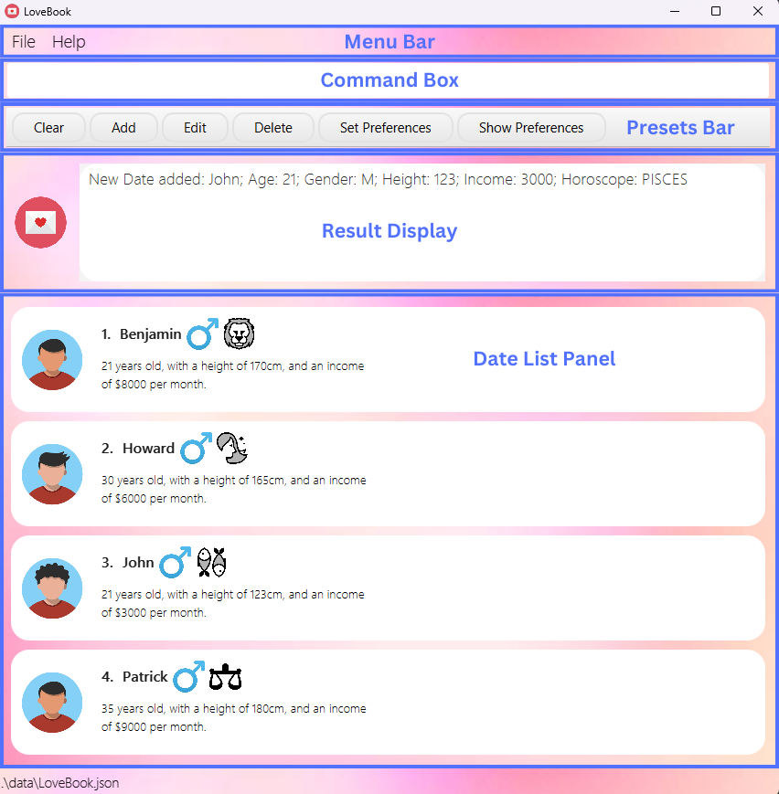
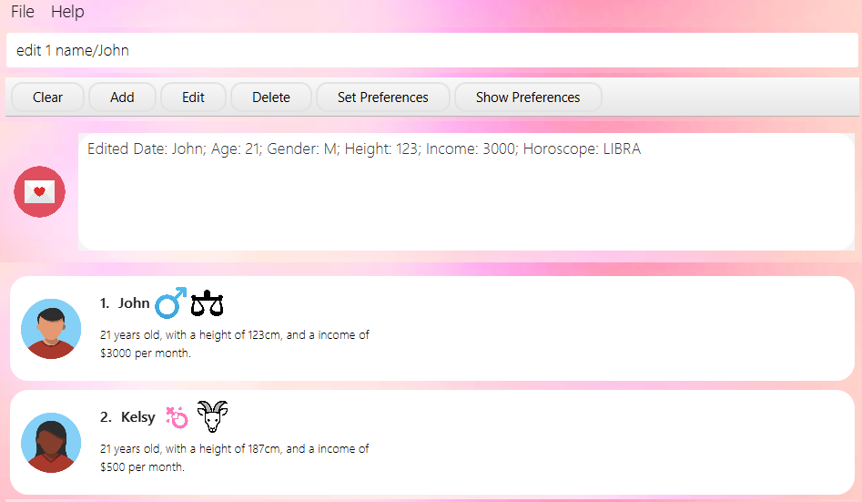
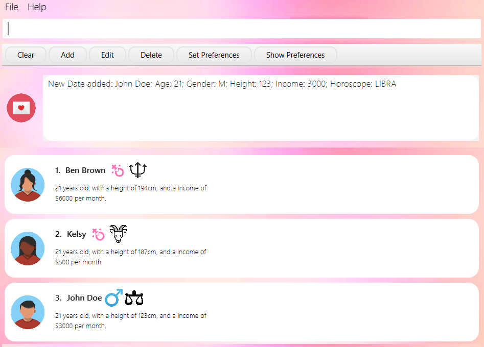

# LoveBook User Guide

LoveBook, is a **dating-focused** application, revolving around providing users with a **convenient**
and **enjoyable** tool to enhance their dating experiences. Featuring **user preferences management**, **date organization**,
**customizable filtering options** and **best match algorithms**, LoveBook enhances the **efficiency** and **effectiveness** of your
online dating journey.

<!-- * Table of Contents -->
<page-nav-print />

--------------------------------------------------------------------------------------------------------------------
## **Quick Start**

### **Download and Installation**

1. Ensure that you have Java `11` or above installed in your Computer.

2. Download the latest `LoveBook.jar` from [here](https://github.com/AY2324S1-CS2103T-F10-2/tp).

3. Double-click the file to start the app. The window that appears will be similar to the below should appear in a few
   seconds.<br>
   
   *Figure 1: A view of LoveBook at startup*

4. Type the command in the command box and press Enter to execute it. e.g. typing `help` and pressing `Enter` to
   open the help window.<br>
   Some commands you can try:

    * `list` : Lists all dates and their associated details

    * `exit` : Exits the app

5. Refer to the features below for details of each command.

### **Navigating the GUI**

If you're new to this program, the initial screen might appear a bit daunting. Don't fret; let's explore the various elements of the LoveBook interface together.
We suggest enlarging the program window for a clearer perspective, allowing you to view more content.

Here's the detailed breakdown of the LoveBook screen: <br>


- **Menu Bar** - This is where you can find the `File` and `Help` options. Click on `File` to access the `Exit` option. Click on `Help` to access the `Help` option.
- **Command Box** - This is where you type in your commands. Press `Enter` to execute the command.
- **Presets Bar** - This is where you can find the preset commands. Click on a preset command to populate your command box.
- **Result Display** - This is where the results of your commands are displayed.
- **Date List Panel** - This is where the list of dates are displayed. The list is scrollable, and you can scroll up and down to view the entire list.

### **Common Symbols**

As you navigate through the application, you may come across certain symbols depicting your date's gender and horoscope.
Here's a quick guide to help you understand what they mean.

#### Gender Symbols
| Gender  | Symbol                                                                                                                                 |
|---------|----------------------------------------------------------------------------------------------------------------------------------------|
| Male    |    |
| Female  |  |

#### Horoscope Symbols
| Horoscope   | Symbol                                                                                                                                         | Birthday Range            |
|-------------|------------------------------------------------------------------------------------------------------------------------------------------------|---------------------------|
| Aries       |        | March 21 - April 19       |
| Taurus      |       | April 20 - May 20         |
| Gemini      |       | May 21 - June 20          |
| Cancer      |       | June 21 - July 22         |
| Leo         |          | July 23 - August 22       |
| Virgo       |        | August 23 - September 22  |
| Libra       |        | September 23 - October 22 |
| Scorpio     |      | October 23 - November 21  |
| Sagittarius |  | November 22 - December 21 |
| Capricorn   |    | December 22 - January 19  |
| Aquarius    |     | January 20 - February 18  |
| Pisces      |       | February 19 - March 20    |

--------------------------------------------------------------------------------------------------------------------

## **Features**

<div markdown="block" class="alert alert-info">

**:information_source: Notes about the command format:**<br>

* Words in `UPPER_CASE` are the parameters to be supplied by the user.<br>
  e.g. in `edit INDEX METRIC/NEW_ARG`, `INDEX`, `NEW_ARG` and `METRIC` are parameters which can be used as
    `edit 2 income/3000`.

* Items in square brackets are optional.<br>
  e.g `age/AGE [horoscope/HOROSCOPE]` can be used as `age/22 horoscope/ARIES` or as `age/22`.

* Parameters can be in any order.<br>
  e.g. if the command specifies `name/NAME age/AGE`, `age/AGE name/NAME` is also acceptable.

* For commands that accept a positive integer, the integer cannot be preceded with a leading zero.
  For instance, `star 9` is valid, but `star 09` is invalid

* Extraneous parameters for commands that do not take in parameters (such as `help`, `list`, `exit` and `clear`)
  will be ignored.<br> e.g. if the command specifies `help 123`, it will be interpreted as `help`.

* If you are using a PDF version of this document, be careful when copying and pasting commands that span multiple lines
  as space characters surrounding line-breaks may be omitted when copied over to the application.
</div>

 ### Prefix Table
| Metric | Prefix | Constraints                                                                             |
|--------|--------|-----------------------------------------------------------------------------------------|
| Name | `name/` | Name can only contain letters, numbers and spaces. It must not be left blank.           |
| Age | `age/` | Age should be a positive integer between 18 and 150 (inclusive).                        |
| Gender | `gender/` | Gender should be either M or F. It is case sensitive.                                   |
| Height | `height/` | Height should be a positive integer in cm between 100cm and 250cm (inclusive).          |
| Income | `income/` | Income (per month) should be a positive integer in SGD less than or equal to a million. |
| Horoscope | `horoscope/` | Horoscope should be a valid zodiac sign. It is case insensitive.                        |

--------------------------------------------------------------------------------------------------------------------
### **Managing Dates**
 
### **Adding a new date: `add`**

Adds a date to the LoveBook.

Format: `add name/NAME age/AGE gender/GENDER height/HEIGHT horoscope/HOROSCOPE income/INCOME`

Example: `add name/Cleon age/22 gender/F height/176 horoscope/Taurus income/3000`


Expected output: `New date added: Cleon; Age: 22; Gender: F; Height: 176; Income: 3000; Horoscope: TAURUS`

Output if error:

```
Invalid command format! 
add: Adds a Date to the LoveBook. Parameters: name/NAME age/AGE gender/GENDER height/HEIGHT income/INCOME horoscope/HOROSCOPE
Example: add name/John Doe age/21 gender/M height/123 income/3000 horoscope/Libra
```

### **Editing a date: `edit`**

Edits a date in the specified index in the LoveBook.

Format: `edit INDEX [name/NAME] [age/AGE] [gender/GENDER] [height/HEIGHT] [income/INCOME] [horoscope/HOROSCOPE]`

<box type="tip" seamless>
    The index must be a positive integer, and be within the range of the recorded dates.
    For example, if there are 3 Dates in LoveBook, the indices are 1, 2 and 3.
</box>

Parameter constraints:
- Metric is limited to `gender, age, horoscope, name, height, income` only
- New argument replaces the existing argument for that metric
- User can edit up to n number of metrics in one command line, where n refers to the number of metrics available

Examples:

- `edit 3 name/Cleon` (editing 1 metric)
- `edit 3 name/Cleon horoscope/Cancer` (editing 2 metrics)
- `edit 3 horoscope/Cancer name/Cleon` (sequence doesn't matter)



Expected Output: `Edited Date: Cleon; Age: 12; Gender: M; Height: 123; Income: 3000; Horoscope: CANCER`

Output if error:

```
edit: Edits the details of the Date identified by the index number used in the displayed Date list. Existing values will be overwritten by the input values.
Parameters: INDEX (must be a positive integer) [name/NAME] [age/AGE] [gender/GENDER] [height/HEIGHT] [income/INCOME] [horoscope/HOROSCOPE]
Example: edit 1 age/24 gender/M height/180 income/3000 horoscope/SCORPIO 
```

### **Deleting a date: `delete`**

Deletes the specified date from the LoveBook.

Format: `delete INDEX`

<box type="tip" seamless>
    The index must be a positive integer, and be within the range of the recorded dates.
    For example, if there are 3 Dates in LoveBook, the indices are 1, 2 and 3.
</box>

Example: `delete 1`


Expected output: `Deleted Date: Ben Brown; Age: 21; Gender: F; Height: 194; Income: 6000; Horoscope: GEMINI`

Output if error :
```
Invalid command format! 
delete: Deletes the Date identified by the index number used in the displayed Date list.
Parameters: INDEX (must be a positive integer)
Example: delete 1
```

### **Listing all dates: `list`**

Shows a list of all dates in the LoveBook.

Format: `list`


Expected output: `Listed all Dates`

### **Clearing all dates: `clear`**

Clears all dates in the LoveBook.

Format: `clear`




Expected output: `LoveBook has been cleared!`

### **Starring a date: `star`**

Stars a date in the LoveBook.

Format: `star INDEX`

Example: `star 1`

Expected output: `Starred Date: John Doe; Age: 21; Gender: F; Height: 245; Income: 3000; Horoscope: LIBRA`

Output if invalid command format:
```
Invalid command format!
star: stars the date identified by the index number used in the displayed Date list.
Parameters: INDEX (must be a positive integer)
Example: star 1
```

<box type="info" seamless>

* Output if index out of bounds: `The date index provided is invalid`
* If Date is already starred, it will display the output `Date has already been starred`

</box>

### **Unstarring a date: `unstar`**

Unstars a date in the LoveBook.

Format: `unstar INDEX`

Example: `unstar 1`

Expected output: `Unstarred Date: John Doe; Age: 21; Gender: M; Height: 123; Income: 3000; Horoscope: LIBRA`

Output if invalid command format:
```
Invalid command format!
unstar: unstars the date identified by the index number used in the displayed Date list.
Parameters: INDEX (must be a positive integer)
Example: star 1
```

Output if index out of bounds:

`The date index provided is invalid`

<box type="info" seamless>

* If Date is already unstarred, it will display the output `Date has already been unstarred`

</box>

### **Sorting, Searching for dates**

### **Finding a date: `find`**

Finds a date in the LoveBook by a specific name(s)

Format: `find NAME [MORE_NAMES]`

Parameter constraints:

- Name should be a non non-empty string.
- More names can be added to the command line, and the search will be conducted for all names provided

Example:

- `find Cleon`
- `find Cleon John`

Expected Output: `Lists the dates with the name(s) specified`

Output if error: `0 dates listed!`

### **Filtering dates by a certain metric: `filter`**

Filters the dates in the LoveBook by a specific metric.

Format: `filter METRIC/ARG`

* Parameter constraints:
* Filter must be from list of metrics
* Metric is limited to `gender, age, name, height` only
* Arg can only be one keyword

Example:

- `filter name/Cleon`
- `filter gender/M`
- `filter gender/M name/Cleon`

Expected Output: `Lists the dates with the metric specified`

Output if error: `No dates found!`

### **Sorting dates by a certain metric: `sort`**

Sorts the dates in the LoveBook by a specific metric.

Format: `sort METRIC/ORDER`

Parameter constraints:

<box type="info" seamless>

**Caution:**

* The relevant metrics are
  * `name/ORDER`
  * `age/ORDER`
  * `height/ORDER`
  * `income/ORDER`
  * `horoscope/ORDER`

* Order is limited to `increasing` or `decreasing` only

</box>

Example:

- `sort name/increasing`
- `sort horoscope/decreasing`

Expected Output: `Lists the dates in the order specified`

Output if error:

```
Invalid command format! 
sort: Sorts all dates in LoveBook alphabetically or numerically.
Parameters: name/ OR age  OR height/ OR income/ OR horoscope/ AND increasing OR decreasing
Example: sort name/increasing
```

### **Managing Preferences and Getting Matches**

<box type="info" seamless>

* By default, Date Preference is set to:
  * AGE: 21
  * HEIGHT: 170
  * INCOME: 10000
  * HOROSCOPE: ARIES

* If you wish to change your Date Preference, please use the [`setP`](#setting-your-date-preferences-setp) command.
* The [`bestMatch`](#getting-a-recommended-date-bestmatch) command will use the Date Preference set by the user.

</box>

### **Showing your date preferences: `showP`**

Shows the User's Date Preference. This can be edited using the [`setP`](#setting-your-date-preferences-setp) command.

Format: `showP`

Expected output: `Here are your preferences: Age: 22; Height: 180; Income: 2000; Horoscope: TAURUS`

### **Setting your date preferences: `setP`**

Sets the user's preferences for the matching algorithm.

<box type="info" seamless>

* Note: At least one field to edit must be provided.
* The user's preferences will be used in the [`bestMatch`](#getting-a-recommended-date-bestmatch) command.
* Gender is not taken into account here

* The relevant fields are
  * `age/AGE`
  * `height/HEIGHT`
  * `income/INCOME`
  * `horoscope/HOROSCOPE`

</box>

Format: `setP [age/AGE] [height/HEIGHT] [income/INCOME] [horoscope/HOROSCOPE]`

Example: `setP age/22 height/180 income/2000 horoscope/TAURUS`


Expected output:
```
Updated Preferences: Age: 22; Height: 180; Income: 2000; Horoscope: TAURUS
```

Output if error:
```
At least one field to edit must be provided.
Please try the following command format: setP: Sets Date Preference. Parameters: age/AGE height/HEIGHT income/INCOME horoscope/HOROSCOPE.
Example: setP age/21 height/180 income/3000 horoscope/Scorpio
```

### **Getting a recommended date: `bestMatch`**

Filters out the most compatible date based on the set preferences.

Format: `bestMatch`


Expected Output: `Here's your best match!`

Output if error: `Initialise list with dates before calling bestMatch`

### **Getting a blind date: `blindDate`**

Outputs a blind date from the LoveBook.

Format: `blindDate`


Expected Output: `Here's a blind date for you!`

Output if error: `Initialise list with dates before calling blindDates`

### **Other Commands**

### **Exiting the application: `exit`**

Exits the program.

Format: `exit`

Expected output: `Exiting LoveBook...`

### **Getting help: `help`**

Shows a window to bring user to the LoveBook User Guide.

Format: `help`


Expected output: `Opened help window.`

--------------------------------------------------------------------------------------------------------------------

## **FAQ**

**Q**: How do I transfer my data to another Computer?<br>
**A**: Install the app in the other computer and overwrite the empty data file with the file that
contains the data of your previous LoveBook home folder.

**Q**: Is my data stored in the cloud? Will I be open to data breaches?<br>
**A**: No, all your data is stored locally, no need to fear a potential data hack.

**Q**: Do I have to save before exiting the application for my data to safely backed up on my computer? <br>
**A**: All your data is saved on your computer as soon as you enter in the command. There is no need to manually save
your data. In the event of a power outage, all your data will be safe.

**Q**: Where do I go if I have issues with LoveBook? <br>
**A**: You may leave your issues [here](https://github.com/AY2324S1-CS2103T-F10-2/tp/issues).

**Q**: What happens if I enter invalid data into the stored data file? <br>
**A**: LoveBook will clear all the existing data and reset to as it was when you installed it. It is highly discouraged
to manually edit the data file.

**Q**: How do I change my date's avatar? <br>
**A**: Currently, the avatars are randomly selected from a pool of 9 avatars. We are working on a feature to allow users
to choose their own avatars.

--------------------------------------------------------------------------------------------------------------------

## **Command Summary**

| Action                                                                            | Format                                                                                                    | Examples                                                               |
|-----------------------------------------------------------------------------------|-----------------------------------------------------------------------------------------------------------|------------------------------------------------------------------------|
| [Adding a new date](#adding-a-new-date-add)                                       | `add name/NAME age/AGE gender/GENDER height/HEIGHT horoscope/HOROSCOPE income/INCOME`                     | `add name/John age/25 gender/M height/175 horoscope/Aries income/5000` |
| [Getting a recommended date](#getting-a-recommended-date-bestmatch)               | `bestMatch`                                                                                               | `bestMatch`                                                            |
| [Getting a blind date](#getting-a-blind-date-blinddate)                           | `blindDate`                                                                                               | `blindDate`                                                            |
| [Clearing all dates](#clearing-all-dates-clear)                                   | `clear`                                                                                                   | `clear`                                                                |
| [Deleting a date](#deleting-a-date-delete)                                        | `delete INDEX`                                                                                            | `delete 2`                                                             |
| [Editing a date](#editing-a-date-edit)                                            | `edit INDEX [name/NAME] [age/AGE] [gender/GENDER] [height/HEIGHT] [income/INCOME] [horoscope/HOROSCOPE]`  |  `edit 3 name/Cleon`                                                   |
| [Exiting the application](#exiting-the-application-exit)                          | `exit`                                                                                                    | `exit`                                                                 |
| [Filtering dates by a certain metric](#filtering-dates-by-a-certain-metric-filter) | `filter METRIC/ARG`                                                                                       | `filter name/Cleon`                                                    |
| [Finding a date](#finding-a-date-find)                                            | `find NAME [MORE_NAMES]`                                                                                  | `find Cleon`                                                           |
| [Help](#getting-help-help)                                                        | `help`                                                                                                    | `help`                                                                 |
| [Listing all dates](#listing-all-dates-list)                                      | `list`                                                                                                    | `list`                                                                 |
| [Setting date preferences](#setting-your-date-preferences-setp)                   | `setP [age/AGE] [height/HEIGHT] [income/INCOME] [horoscope/HOROSCOPE]`                                    | `setP age/22 height/180 income/2000 horoscope/TAURUS`                  |
| [Showing date preferences](#showing-your-date-preferences-showp)                  | `showP`                                                                                                   | `showP`                                                                |
| [Sorting dates by a certain metric](#sorting-dates-by-a-certain-metric-sort)      | `sort METRIC/ORDER`                                                                                       | `sort name/increasing`                                                 |
| [Starring a date](#starring-a-date-star)                                          | `star INDEX`                                                                                              | `star 1`                                                               |
| [Unstarring a date](#unstarring-a-date-unstar)                                    | `unstar INDEX`                                                                                            | `unstar 1`                                                             |

--------------------------------------------------------------------------------------------------------------------

## **Glossary**

| Term                       | Definition                                                                                                        |
|----------------------------|-------------------------------------------------------------------------------------------------------------------|
| Date                       | A person that the user is interested in and is currently seeing.                                                  |
| Metric | A certain characteristic of a date. (e.g. Gender, Height)                                                         |
| Command | Text that the user types into the application to perform an action.                                               |
| Parameter | A value that the user provides to the application when executing a command. (e.g. in `gender/M` M is a parameter) |
| GUI | Graphical User Interface                                                                                          |
| CLI | Command Line Interface                                                                                            |
| Mainstream OS |  Windows, Linux, Unix, OS-X |
