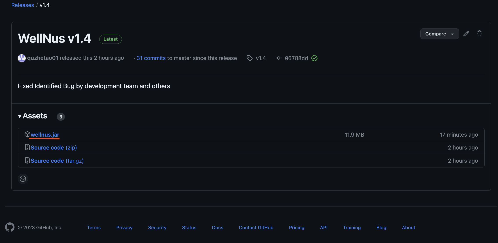

WellNUS is a *desktop application* used by **NUS Counsellors** to **manage and schedule appointments** with their student clients.

NUS counsellors have a hectic consultation schedule that constantly has to updated based on students' availability. This can lead to burnout due
to administrative task overload.

WellNUS eases this burden by providing a one-stop application for NUS counsellors to manage students' contact details and scheduling appointments.
It provides better visibility through neatly organized information, while preventing counsellors from making oversights like double booking a timeslot.

This user guide serves as a beginner-friendly (yet comprehensive!) walkthrough for all NUS counsellors on how to fully utilise the WellNUS application.
Our guide has three main components: 
1. Instructions on *downloading and setting up* the application
2. List of *available features*, and
3. Our *Frequently Asked Questions (FAQs)*. Refer to the [Table of Contents](#table-of-contents) below to navigate to your area of interest.

If you are interested in more technical details, please refer to our [Developer Guide](https://ay2324s1-cs2103t-w13-4.github.io/tp/DeveloperGuide.html).

<div markdown="block" class="alert alert-info">
:information_source: 
WellNUS is optimised for use via a **Command Line Interface** (CLI) while still having the benefits of a Graphical User Interface (GUI).
If you can type fast, WellNUS can get your contact management and scheduling tasks done faster than traditional GUI apps.
</div>

## Table of Contents
{:toc}

--------------------------------------------------------------------------------------------------------------------

## 1. Getting started

###  1.1 Accessing the app

1. Ensure you have Java `11` or above installed in your Computer. 
   1. To check the current version of Java installed on your system, refer to [this guide](https://www.java.com/en/download/help/version_manual.html).
   2. If Java is not installed or you have an outdated version, you may download it [here](https://www.oracle.com/sg/java/technologies/javase/jdk11-archive-downloads.html).

2. Download the latest `wellnus.jar` from [here](https://github.com/AY2324S1-CS2103T-W13-4/tp/releases/tag/v1.3).
   1. Click on the link above to be redirected to our *github repository*.
   2. Under *Assets*, click on the `wellnus.jar` file (underlined in red) to begin the download.


   

3. Copy the file to the folder you want to use as the _home folder_ for WellNUS.
   1. Navigate to the folder `wellnus.jar` has been installed in. By default, it will be downloaded in the *Downloads* folder.
   2. Create a new folder on your Desktop (or any folder you want to put your application in) and move the `wellnus.jar` file into the folder.


4. Start up the WellNUS application.
   1. Open the *Command Prompt* (for Windows users) or *Terminal* (for Mac users). `cd` into the folder you put the jar file in, and use the `java -jar wellnus.jar` command to run the application.
   2. Alternatively, if you moved it into a folder created on Desktop, you may run the following command:
      ```
      cd Desktop/{your_folder_name}
      java -jar wellnus.jar
      ```
      
   <div markdown="block" class="alert alert-info">
   :information_source: Note:
   You may also use any applications (e.g. Windows Powershell, Visual Studio Code) that support command line inputs.
   </div>

   A window similar to the below should appear in a few seconds. Note how the app contains some sample data.

   

5. Type the command in the command box and press Enter to execute it.
   Some example commands you can try:
   * `help` : Opens the help window.
   * `view g/all` : View all students and appointments.
   * `exit` : Exits the app.

6. Refer to the [Features](#2-features) below for details of each command.

### 1.2 About the command format

All instructions executed in WellNUS generally use the following command format: `COMMAND_WORD PREFIX/PARAMETER`.
The list of all available prefixes and parameters, as well as constraints of each parameter, is shown in the table below. 
To see a list of all command words, refer to the [Command Summary](#5-command-summary) section.

| Prefix    | Parameter         | Parameter Meaning                | Example Usage                      | Parameter Constraints                                                                                                                            |
|-----------|-------------------|----------------------------------|------------------------------------|--------------------------------------------------------------------------------------------------------------------------------------------------|
| **n/**    | STUDENT_NAME      | Name of student                  | n/Peter Johnson                    | STUDENT_NAME **must** only contain **alphabetical characters and spaces**, be **unique** up to **100 characters** long, and **cannot be blank**. |
| **c/**    | CONTACT_NUMBER    | Contact number of student        | c/94738484                         | CONTACT_NUMBER **must** only contain **numerical characters**, be **exactly 8 digits long** (without spaces) and **cannot be blank**.            |
| **a/**    | ADDRESS           | Address of student               | a/Blk 515 Choa Chu Kang Avenue 6   | ADDRESS can take any value up to **200 characters** long, and **cannot be blank**.                                                               |
| **r/**    | RISK_LEVEL        | Risk level assigned to student   | r/high                             | RISK_LEVEL **must** be one of the following three values: **high**, **medium**, **low**. **Case-insensitive**.                                   |
| **note/** | NOTE              | Note associated with student     | note/Struggles with 3rd grade math | NOTE can take any value up to **500 characters** long.                                                                                           |
| --        | STUDENT_INDEX     | Index of student in the list     | --                                 | STUDENT_INDEX **must** be a **positive integer** (i.e. 1, 2, 3, ...) up to the size of the student list.                                         |
| **date/** | DATE              | Date of appointment              | date/2023-10-12                    | DATE **must** be in the following format: `yyyy-MM-dd`. Specified date must be **within a year from the current date**.                          |
| **from/** | START_TIME        | Start time of appointment        | from/16:30                         | START_TIME **must** be in the following format: `HH:mm`, in **24-hour format**.                                                                  |
| **to/**   | END_TIME          | End time of appointment          | to/17:30                           | END_TIME **must** be in the following format: `HH:mm`, in **24-hour format**.                                                                    |
| **d/**    | DESCRIPTION       | Description of appointment       | d/3rd counselling session          | DESCRIPTION can take any value up to **100 characters** long, and **cannot be blank**.                                                           |
| --        | APPOINTMENT_INDEX | Index of appointment in the list | --                                 | APPOINTMENT_INDEX **must** be a **positive integer** (i.e. 1, 2, 3, ...) up to the size of the appointment list.                                 |
| **g/**    | CATEGORY          | Category of search               | g/appointments                     | CATEGORY **must** be one of the following three values: **students**, **appointments**, **all**.                                                 |


<div markdown="block" class="alert alert-info">

**:information_source: Notes about the command format:**<br>

* Words in `UPPER_CASE` are the parameters to be supplied by the user.<br>
  e.g. in `add n/NAME c/CONTACT_NUMBER`, `NAME` and `CONTACT_NUMBER` are parameters
  which can be used as `add n/John Doe c/98172645`.

* Items in square brackets are optional.<br>
  e.g `n/NAME [r/RISK_LEVEL]` can be used as `n/John Doe r/low` or as `n/John Doe`.

* Parameters can be in any order.<br>
  e.g. if the command specifies `n/NAME p/PHONE_NUMBER`, `p/PHONE_NUMBER n/NAME` is also acceptable.

* Extraneous parameters for commands that do not take in parameters (such as `help` and `exit`) will be ignored.<br>
  e.g. if the command specifies `help 123`, it will be interpreted as `help`.

* If you are using a PDF version of this document, be careful when copying and pasting commands that span multiple lines as space characters surrounding line-breaks may be omitted when copied over to the application.
</div>


### 1.3 About student notes

Student notes of a student can be viewed by double-clicking on the specific student that you want under the "Student"
column. You can only view student notes for one student at a time. When you perform any commands, the notes column
will be cleared (You will have to double-click once again).

If you have any feedback on our features pertaining to student notes, feel free to send your feedback to the 
developer team!


--------------------------------------------------------------------------------------------------------------------

## 2. Features
### 2.1 Utility Commands

#### 2.1.1 Viewing help: `help`

Shows a message with a link to this user guide.


Format: `help`

### 2.2 Student Commands

#### 2.2.1 Adding a Student: `add`

Adds a student with their relevant details.

Format: `add n/STUDENT_NAME c/CONTACT_NUMBER a/HOME_ADDRESS [r/RISK_LEVEL]`

**Parameters**:
1. Student Name
   - Must contain alphabetical characters only. Symbols and numerical characters are not allowed
   - Must be unique
   - Maximum of 100 characters
2. Contact Number
   - Numerical characters only, must be exactly 8 characters long
3. Home Address
   - Maximum of 200 characters, cannot be blank
4. Risk Level
   - Must be `high`, `medium`, or `low`

Valid examples:
* `add n/John c/81349705 a/Yishun Street 56 Blk 21 #05-07`
* `add n/Sally c/94149785 a/Woodlands Street 11 Blk 888 #08-08 r/low`

Invalid examples:
* `add n/Sally c/94149785` (missing address)
* `add n/Sally! c/1234 a/Woodlands Street 11 Blk 888 #08-08` (invalid name and phone number)
* `add n/Sally c/94149785 a/` (address is blank)
* `add n/Sally c/1234 a/Woodlands Street 11 Blk 888 #08-08 r/abc` (invalid risk level)

#### 2.2.2 Deleting a Student: `delete`

<div markdown="span" class="alert alert-warning">:exclamation: **Be careful when deleting a student!**
Deleting a Student also cancels all appointments associated to that Student.
</div>

Deletes an existing student.

Format: `delete STUDENT_INDEX`

**Parameters**:
1. Student Index
   - Must be an integer starting from 1
   - Must be found in the students list

Valid example:
* `delete 2`

Invalid examples:
* `delete 0` (student index only starts from 1)
* `delete John` (index should be a number)

<div markdown="span" class="alert alert-primary">:bulb: **Tip:**
If you know the name of the student you want to delete, use the `find` command to filter the student list first.
</div>

#### 2.2.3 Adding notes for a Student: `note`

<div markdown="block" class="alert alert-info">

**:information_source: Note:**<br>
Double-clicking on the Student card displays the Student notes under the Notes section!
The “Notes” column will inform you if there are no student notes for a particular Student.
</div>

Adds a note to an existing student, overwrites any existing note.

Format: `note STUDENT_INDEX note/NOTE`

**Parameters**:
1. Student Index
   - Must be an integer starting from 1
   - Must be found in the students list
2. Note
   - Maximum of 500 characters

Valid examples:
* `note 1 note/Preferred language: mandarin`
* `note 2` (deletes the note at index 2)

Invalid examples:
* `note 0` (invalid index)
* `note Alex note/Likes dogs.` (index should be a number)

<div markdown="span" class="alert alert-primary">:bulb: **Tip:**
To delete an existing note, simply use `note STUDENT_INDEX` or `note STUDENT_INDEX note/`
</div>

#### 2.2.4 Finding Students by Name: `find`

Find students and their related appointments based on their name. Can choose to find student based on their first name, last name or full name.
If the name does not match entirely, the student will not be shown. Refer to the examples below for a better understanding

Format: `find STUDENT_NAME`

**Parameters**:
1. Student Name
   - Must contain alphabetical characters only

Valid example:
* `find Mike Oxlong`

Invalid example:
* `find 39 Jane Street` (contains numerical characters)
* `find @9th Jan!` (contains special characters)


<div markdown="block" class="alert alert-info">

**:information_source: How the find command works:**<br>
The intended behaviour of the find instruction might be confusing. To illustrate the proper behaviour, consider the example scenario below.<br>
Given a Student named `Roy Lee` is in the WellNUS student list:
* `find Roy`, `find Lee` and `find Roy Lee` will successfully find the Student.
* `find Royy`, `find Le`, `find Roy L`, `find RoyLee` will not find the Student.
</div>


<p align="center">
<em>Find student Alex Yeoh</em>
</p>

#### 2.2.5 Assigning risk level to Student: `tag`

Tags a student to a specific risk level.

Format: `tag STUDENT_INDEX r/RISK_LEVEL`

**Parameters**:
1. Student Index
   - Must be an integer starting from 1
   - Must be found in the students list
2. Risk Level
   - Must be `high`, `medium`, or `low`
   - Case-insensitive, i.e. `HIGH` is a valid input

Valid examples:
* `tag 2 r/high`
* `tag 1 r/MEDIUM`

Invalid examples:
* `tag -1 r/high` (invalid index)
* `tag 1 r/lowrisk` (invalid risk level)

#### 2.2.6 Editing Student details: `edit`

Edit a student's contact number or address.

Format `edit STUDENT_INDEX [c/CONTACT_NUMBER] [a/HOME_ADDRESS] [r/RISK_LEVEL]`

**Parameters**:
1. Student Index
   - Must be an integer starting from 1
   - Must be found in the students list
2. Contact Number
   - Numbers only, must be 8 characters long
3. Home Address 
   - Maximum of 200 characters, cannot be blank
4. Risk Level
   - Must be `high`, `medium`, or `low`
   - Case-insensitive, i.e. `HIGH` is a valid input

<div markdown="block" class="alert alert-info">
**:information_source: Note:**<br>
- The `tag STUDENT_INDEX r/RISK_LEVEL` command is equivalent to `edit STUDENT_INDEX r/RISK_LEVEL`.
- Providing the same field as before (eg. changing contact from 99998888 to 99998888) will not throw an error
</div>

Valid examples:
* `edit 1 c/98765432 a/Woodlands Street 11 Blk 888 #08-08`
* `edit 2 c/98574321`

Invalid example:
* `edit 1` (Edit must contain at least 1 field)

### 2.3 Appointment Commands

<div markdown="span" class="alert alert-info">:information_source:
Appointments will be **automatically sorted** by Date and Time in **ascending order**.
</div>

#### 2.3.1 Scheduling an Appointment: `schedule`

<div markdown="span" class="alert alert-warning">:exclamation:
The Student must exist before an Appointment can be scheduled for the Student!
</div>

Schedules a new appointment for a student.

Format: `schedule n/STUDENT_NAME date/DATE from/START_TIME to/END_TIME d/DESCRIPTION`

**Parameters**:
1. Name
   - Cannot contain symbols, alphabetical characters only
   - Maximum of 100 characters
   - Must be the name of a student found in the students list
2. Date
    - Must be in the following format: `yyyy-MM-dd`
    - Must be within a year from now
3. Start/End Time
    - Must be in the following format: `HH:mm` in 24-hour format.
4. Description
   - Maximum of 100 characters, cannot be blank

Valid examples:
* `schedule n/Jon date/2023-12-30 from/16:30 to/17:30 d/monthly check-up`
* `schedule n/Yin Kiat date/2023-12-09 from/07:00 to/10:45 d/first counselling session`

Invalid examples:
* `schedule n/Jon date/2001-12-09 from/07:00 to/10:45 d/first counselling session` (date is in the past)
* `schedule n/Jon date/2023-12-09 from/16:00 to/12:45 d/first counselling session` (end time is before start time)
* `schedule n/Jon date/09-12-2023 from/1100 to/1230 d/first counselling session` (date and time are in the wrong format)
* `schedule n/Jon date/2023-12-30 from/16:30 to/17:30 d/` (description is empty)

<div markdown="span" class="alert alert-info">:information_source: **Note:**
WellNUS automatically checks for overlaps between appointments whenever a new appointment is being added. If there is an
overlap between the new appointment to be scheduled and existing appointments, the new appointment will be **not be scheduled**
and will inform the user to reschedule the appointment.
</div>

#### 2.3.2 Cancelling an Appointment: `cancel`

Cancels an existing appointment.

Format: `cancel APPOINTMENT_INDEX`

**Parameters**:
1. Appointment Index
   - Must be an integer starting from 1
   - Must be found in the appointments list

Valid example:
* `cancel 2`

Invalid examples:
* `cancel 0` (invalid index)
* `cancel first appointment` (index should be a number)

#### 2.3.3 Filtering Appointments by Date: `filter`

Filters appointments based on given date. 

Format: `filter DATE`

**Parameters**
1. Date
   - Must be in the following format: `yyyy-MM-dd`

Valid example:
* `filter 2023-10-16`

Invalid examples:
* `filter 16-10-2023` (date is in wrong format)
* `filter 16 October 2023` (date is in wrong format)


<p align="center">
<em>Filter appointments on 15 December 2023</em>
</p>

### 2.4 Others

#### 2.4.1 Viewing all Students and/or Appointments: `view`

Shows a list of all available Students and/or Appointments, depending on specified input.

Format: `view g/CATEGORY`

**Parameters**:
1. Category
   - Must be `students`, `appointments` or `all`

Valid examples:
* `view g/all`
* `view g/appointments`
* `view g/students`

#### 2.4.2 Exiting the program: `exit`

Exits the program.

Format: `exit`

#### 2.4.3 Clearing storage: `clear`

Resets the storage, deleting **all** Appointments and Students. 

Format: `clear`

#### 2.4.4 Saving the data

WellNUS data is saved in the hard disk automatically after any command that changes the data. There is no need to save manually.

#### 2.4.5 Editing the data file

WellNUS data is saved automatically as a JSON file `[JAR file location]/data/addressbook.json`. Advanced users are welcome to update data directly by editing that data file
<div markdown="span" class="alert alert-warning">:exclamation: **Caution:**
If your changes to the data file makes its format invalid, WellNUS will discard all data and start with an empty data file at the next run. Hence, it is recommended to take a backup of the file before editing it.
</div>

### 2.5 Tracking TODOS `[Coming soon]`

_Details coming soon ..._

--------------------------------------------------------------------------------------------------------------------

## 3. Frequently Asked Questions (FAQ)

1. **How do I transfer my data to another Computer ?**<br/>
Install the app in the other computer and overwrite the empty data file it creates with the file that contains the data of your previous WellNUS home folder.

2. **How can I view my appointments scheduled today ?**<br/>
You can use the filter command with today's date. 
Here's an example: `filter 2023-12-07`. Replace `2023-12-07` with today's date in `yyyy-mm-dd` format.

3. **How do I clear all data in WellNUS ?**<br/>
To clear all data, use the `clear` command. This resets the storage, deleting all appointments and students. 
Exercise caution, as this action cannot be undone.

4. **How do I exit the WellNUS application ?**<br/>
To exit the program, use the `exit` command. This closes the application.

5. **I am unsure of a new student's risk level, what should I put ?**<br/>
If you're unsure of a new student's risk level, you can leave the risk level parameter blank when adding the student using the add command. 
WellNUS is designed to handle optional parameters. Here's an example:
`add n/John Doe c/98172645 a/821, Bishan, #02-124`
You can always update the risk level later using the tag command when more information becomes available.

--------------------------------------------------------------------------------------------------------------------

## 4. Known issues

1. **When using multiple screens**, if you move the application to a secondary screen, and later switch to using only the primary screen, the GUI will open off-screen. The remedy is to delete the `preferences.json` file created by the application before running the application again.

--------------------------------------------------------------------------------------------------------------------

## 5. Command summary

| Action                                                                                     | Format, Valid examples                                                                                                                                                |
|--------------------------------------------------------------------------------------------|-----------------------------------------------------------------------------------------------------------------------------------------------------------------|
| [Help](#211-viewing-help-help)                                                             | `help`                                                                                                                                                          |
| [Add Student](#221-adding-a-student-add)                                                   | `add n/STUDENT_NAME c/CONTACT_NUMBER a/HOME_ADDRESS [r/RISK_LEVEL]` <br> e.g., `add n/John c/81349705 a/Yishun Street 56 Blk 21 #05-07 r/medium`                |
| [Delete Student](#222-deleting-a-student-delete)                                           | `delete STUDENT_INDEX`<br> e.g., `delete 3`                                                                                                                     |
| [Add Student Note](#223-adding-notes-for-a-student-note)                                   | `note STUDENT_INDEX note/NOTE` <br> e.g., `note 1 note/Likes dogs`                                                                                              |
| [Find Students](#224-finding-students-by-name-find)                                        | `find STUDENT_NAME` <br> e.g., `find John`                                                                                                                      |
| [Assign Risk Level to Student](#225-assigning-risk-level-to-student-tag)                   | `tag STUDENT_INDEX r/RISK_LEVEL`<br> e.g.,`tag 4 r/high`                                                                                                        |
| [Edit Student details](#226-editing-student-details-edit)                                  | `edit STUDENT_INDEX c/CONTACT_NUMBER A/HOME_ADDRESS`<br> e.g.,`edit 1 c/91234567`                                                                               |
| [Schedule Appointment](#231-scheduling-an-appointment-schedule)                            | `schedule n/STUDENT_NAME date/DATE from/START_TIME to/END_TIME d/DESCRIPTION`<br> e.g., `schedule n/Jon date/2023-12-30 from/16:30 to/17:30 d/monthly check-up` |
| [Cancel Appointment](#232-cancelling-an-appointment-cancel)                                | `cancel APPOINTMENT_INDEX`<br> e.g., `cancel 3`                                                                                                                 |
| [Filter Appointments](#233-filtering-appointments-by-date-filter)                          | `filter DATE` <br> e.g., `filter 2023-10-16`                                                                                                                    |
| [View all Students and/or Appointments](#241-viewing-all-students-andor-appointments-view) | `view g/CATEGORY` <br> e.g., `view g/all`                                                                                                                       |
| [Exit](#242-exiting-the-program-exit)                                                      | `exit`                                                                                                                                                          |
| [Delete all data](#243-clearing-storage-clear)                                             | `clear`                                                                                                                                                         |


