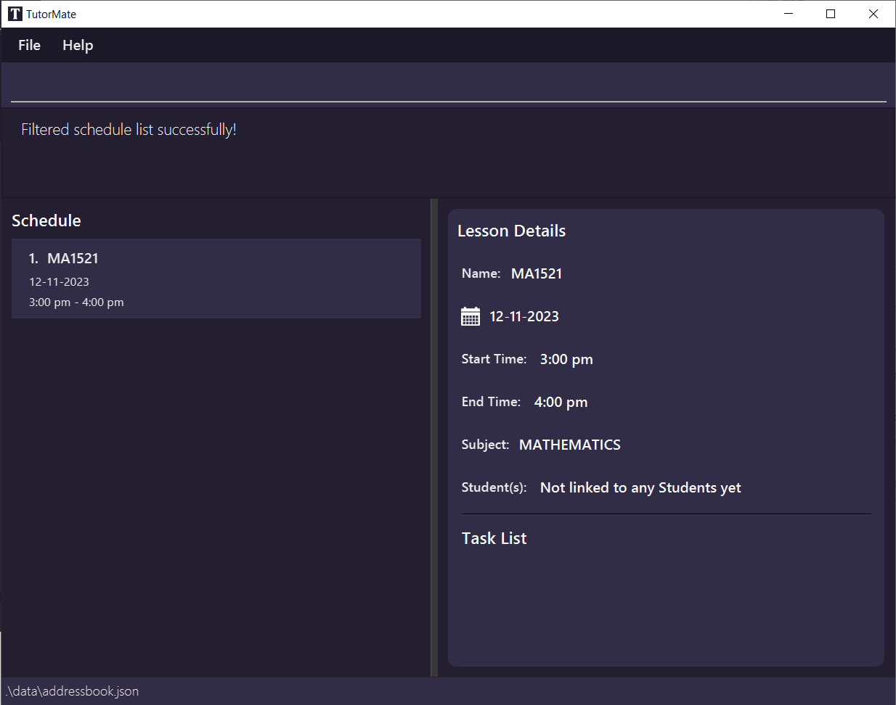
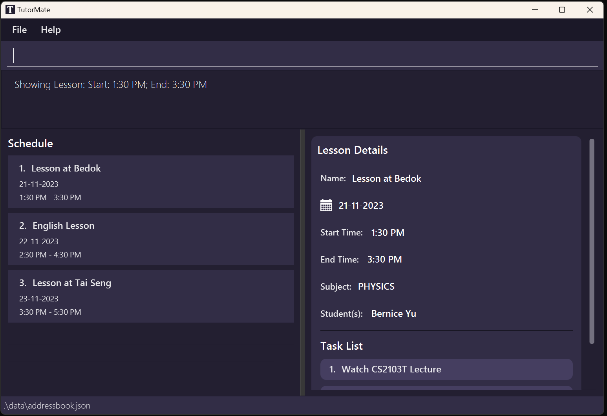
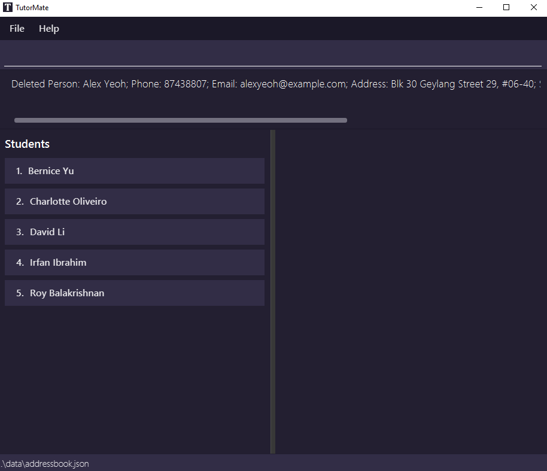
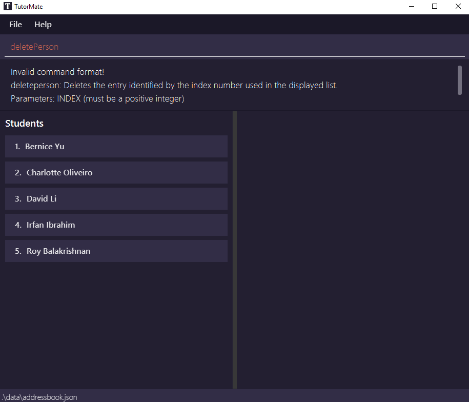
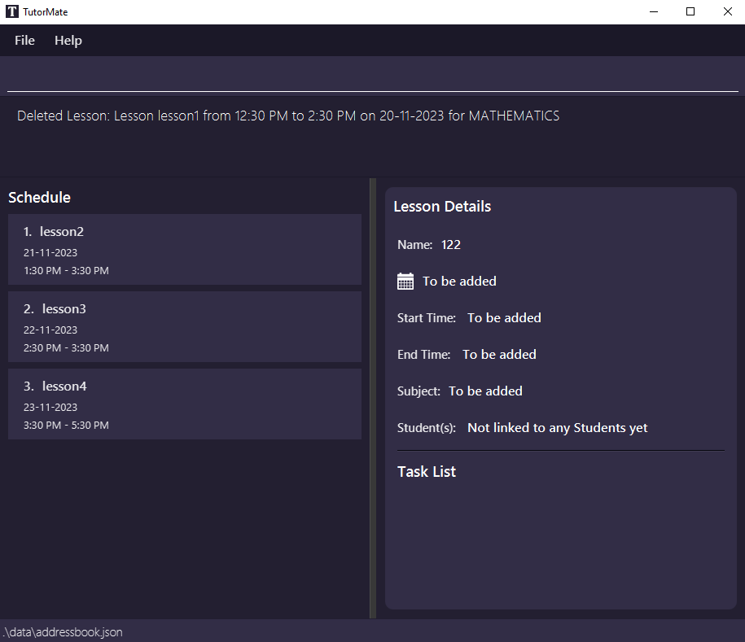
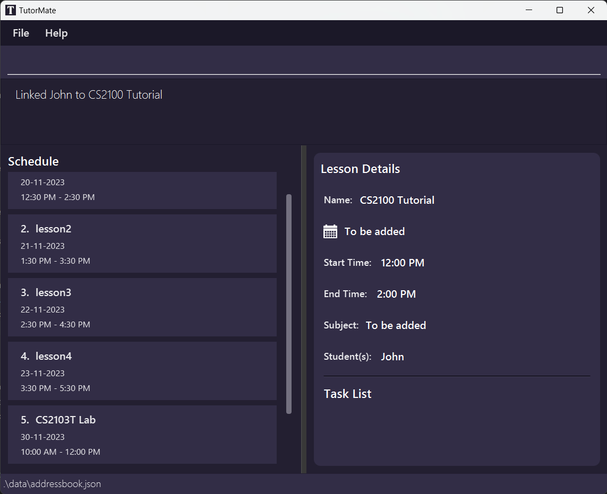

# TutorMate User Guide

TutorMate is a desktop app targeted to tuition teachers for managing contacts of tuition students.

It is optimized for use via a Command Line Interface (CLI) while still having the benefits of a Graphical User Interface (GUI). If you can type fast, TutorMate can get your administrative tasks done faster than traditional GUI apps.

This project is based on the [AddressBook-Level3 project](https://se-education.org).

<!-- * Table of Contents -->
<page-nav-print />

--------------------------------------------------------------------------------------------------------------------

## About
This document describes the main features of TutorMate. The main features of TutorMate are the Student Management 
System, Schedule of Lessons and Task List of each lesson.
With a customised student list and schedule in TutorMate just for you, organising lessons and managing students 
will be the least of your worries.
<br>
<br>


--------------------------------------------------------------------------------------------------------------------

## Quick start

1. Ensure you have Java `11` or above installed in your Computer.

1. Download the latest `tutormate.jar` from [here](https://github.com/AY2324S1-CS2103T-T11-3/tp/releases).

1. Copy the file to the folder you want to use as the _home folder_ for your TutorMate.

1. Open a command terminal, `cd` into the folder you put the jar file in, and use the `java -jar tutormate.jar` command to run the application.<br>
   A GUI similar to the below should appear in a few seconds. Note how the app contains some sample data.<br>
   

1. Type the command in the command box and press Enter to execute it. e.g. typing **`help`** and pressing Enter will open the help window.<br>
   Some example commands you can try:

    * `list students` : Lists all students with their `NAME`.

    * In list `STUDENTS`:     

      * `add -name Leah` : Adds a student named `Leah` to the application.

      * `show 3` : Shows the details of the person with the index 3 in TutorMate.

    * `exit` : Exits the app.

1. Refer to the [Features](#features) below for details of each command.

--------------------------------------------------------------------------------------------------------------------

## Features

<box type="info" seamless>

**Notes about the command format:**<br>

* Words in upper case are compulsory parameters to be supplied by the user.<br>
  e.g. in `add -name NAME`, `NAME` is a parameter which can be used as `add -name Leah`.
  In this case, "Leah" is substituted for `NAME`.

* Items in square brackets are optional.<br>
  e.g. `list [LIST] [KEYWORDS]` can be used as `list` or as `list students email`.

* Flags can be in any order.<br>
  e.g. if the command specifies `-name NAME -phone PHONE_NUMBER`, `-phone PHONE_NUMBER -name NAME` is also acceptable.

* Extraneous parameters for commands that do not take in parameters (such as `help`, `exit` and `clear`) will be ignored.<br>
  e.g. if the command entered is `help 123`, it will be interpreted as `help`.

* If you are using a PDF version of this document, be careful when copying and pasting commands that span multiple lines as space characters surrounding line-breaks may be omitted when copied over to the application.

</box>


### Viewing help : `help`

Shows a message explaining how to access the help page.


Format: `help`


### Listing upcoming lessons / tasks / students : `list`

The list command has different behaviours depending on the keywords given.
Lists all the students, lessons and tasks saved in the application, with students list having optional specified information through space-separated keywords.

Format: `list [LIST] [KEYWORDS]`
* Shows the list and associated detail panel for the specified `[LIST]`.
* `[LIST]` is case-insensitive: e.g. `STUDENTS`, `students`, `stuDEnts` are all valid.
* The `[KEYWORDS]` is for which specifying student details to display, and is only valid for students list.
* Keyword specifiers for students list is **case-sensitive**: `subjects` is valid, but `SUBJECTS` or `SubJEcts` are not.

To show the `SCHEDULE` list:
* Format: `list schedule`
* By default, `list` will also show the `SCHEDULE` list and list all the lessons with their lesson name.
* This is also the default view when you first open the application.

To show the `TASKS` list:
* Format: `list tasks`
    * displays all the tasks with their description.

To show the `STUDENTS` list:
* Format: `list students [KEYWORDS]`
    * displays all the students with their name in alphabetical order.
    * The `[KEYWORDS]` allows for an optional list of valid (case-sensitive) space-separated information of the student to be displayed.

Acceptable values for the keywords:
* `phone`
* `email`
* `address`
* `tags`
* `subjects`
* `remark`
* `none` (resets to only showing student names)
* `all` (shows all student detail fields)

Examples:
* `list` and `list schedule` displays the `SCHEDULE` list with all the lessons with their names in time order.
* `list students` displays all the students with their names (including previously specified fields).
* `list students subjects` displays all the students with their names and a list of subjects for each student.
* `list students subjects email` displays all the students with their names, a list of subjects for each student and their email.
* `list tasks` displays all the tasks with their description.


Success Output:
* For the command `list` or `list schedule`:
  `Showing list SCHEDULE`
  
* For the command `list students` (with no additional student details):
  `Showing list STUDENT`
  
* For the command `list tasks`
  `Showing list TASK`
  

Notes
* If there are no entries, e.g. there are no students added yet or there are no tasks added yet, an empty list is displayed.
  


Failure Output:
* When there are invalid keywords specified as a parameter:
```Invalid command format!
  list: Displays the specified list, which can be a STUDENTS list, SCHEDULE list or TASKS list. Default command without specified list displays the schedule list. When specifying STUDENTS list, optional parameters can be used to specify what student details to display.
  Parameters: [LIST] [KEYWORDS]...
  Example: list schedule
  Example: list students phone email
  Example: list tasks
```

### Filtering the lesson / student list
You can filter the list of lessons (obtained by typing `list schedule`) or the list of students (obtained by typing `list students`).
The filter command will show only the relevant entries that match the entered flags and values.
The filter command has different supported filter properties depending on the current list (refer to the `list` command [here](#listing-upcoming-lessons--tasks--students--list)):

1. In `SCHEDULE` list:
    - Shows a list of lessons that match the provided filters
    - Format: `filter [-name NAME] [-subject SUBJECT] [-before DATE] [-on DATE] [-after DATE] [-remark REMARK]`
    - Note: Only one of `-before`, `-on`, `-after` can be used at once. For example, you cannot use both `-before` and `-after` in the same filter command.
      - Allowed: `filter -before 2022/10/10`
      - Not allowed: `filter -before 2022/10/10 -after 2022/01/01`
2. In `STUDENTS` list:
    - Shows a list of students that match the provided filters
    - Format: `filter [-name NAME] [-subject SUBJECT] [-tag TAG] [-remark REMARK]`

Explanation of fields that can be filtered

| Flag         | Used when showing...    | Filter results                                                                                                                   | Example                                                                                            |
|--------------|-------------------------|----------------------------------------------------------------------------------------------------------------------------------|----------------------------------------------------------------------------------------------------|
| **-name**    | Students, Schedule      | Lessons or students whose name partially or fully matches the name entered                                                       | `filter -name John`                                                                                |
| **-subject** | Students, Schedule      | Lessons or students that have the specified subject. Valid values: MATHEMATICS, PHYSICS, BIOLOGY, CHEMISTRY or ENGLISH.          | `filter -subject Mathematics`                                                                      |
| **-before**  | Schedule                | Lessons that occur before (not including) the specified date. Valid input formats: `YYYY/MM/DD` or `YY/MM/DD` or `MM/DD` or `DD` | `filter -before 2023/12/01`, `filter -before 23/12/01`, `filter -before 12/01`, `filter -before 1` |
| **-on**      | Schedule                | Lessons that occur on the specified date. Valid input formats: `YYYY/MM/DD` or `YY/MM/DD` or `MM/DD` or `DD`                     | `filter -on 2023/12/01`, `filter -on 23/12/01`, `filter -on 12/01`, `filter -on 1`                 |
| **-after**   | Schedule                | Lessons that occur after (not including) the specified date. Valid input formats: `YYYY/MM/DD` or `YY/MM/DD` or `MM/DD` or `DD`  | `filter -after 2023/12/01`, `filter -after 23/12/01`, `filter -after 12/01`, `filter -after 1`     |
| **-remark**  | Students, Schedule      | Lessons or students whose remarks partially or fully matches the remark entered                                                  | `filter -remark assistance`                                                                        |                                                                                                                                                                                                                                 |
| **-tag**     | Students                | Students who have at least one tag that fully matches the tag name entered                                                       | `filter -tag primary`                                                                              |
 
Notes
- When filtering, all text is case-insensitive. That is, `filter -name LEAH` is the same as `filter -name leah`. 
- You can filter by any number of flags, and in any order.
- To reset the filter (view all students / lessons), type `list students` or `list schedule`.

Examples:
- In `SCHEDULE` list:
  - `filter -name CS2103T -before 2023/12/11`
- In `STUDENT` list:
  - `filter -name Alex -tag primary -subject Mathematics`

Success Output:
- For the command `filter -name Alex -tag primary -subject Mathematics` in the _Student List_ with all detail fields shown

- For the command `filter -name Alex -tag secondary` (No such students matching the filter found)


Failure output:
- When there are invalid values specified in the command `filter -on 2/2/2` (invalid date format)

```
Invalid lesson format: 2/2/2 is not a valid date, please use yyyy/mm/dd or mm/dd or dd
for example, assume today is 2023/11/3, to add 2023/11/29, could use 29, 11/29, 2023/11/29 or 23/11/29. 
Usage: filter -(any number of unique -[name|subject|before|on|after|remark] [value]). 
```

### Locating students/lessons by name: `find`

The find command generally finds items by its exact name, but has different behaviours depending on the current list:

Format: `find SEARCH_STRING`

1. In `SCHEDULE` list:
    * Finds lesson(s) whose names contain the given search string.
    * The search is case-insensitive. e.g. `lesson` will match `Lesson`.
    * Lesson(s) with names containing the search string will be returned.
      e.g. Both `Lesson Chem` and `sson Che` will return `Lesson Chemistry`, `Bishan Lesson Chem`.

2. In `STUDENTS` list:
    * Finds student(s) whose names contain the given search string.
    * The search is case-insensitive. e.g `hans` will match `Hans`.
    * Student(s) with names containing the search string will be returned.
      e.g. `Hans` will return `Hanso Gruber`, `Lee Hansel`.

3. In `TASKS` list:
    * Find tasks by name/description is disabled.
    * Tasks can be found based on the lesson (find lesson by name) and `show` lesson to see task list of the lesson.

Success Output:
* In `SCHEDULE` list:
```
2 lessons listed!
```
* In `STUDENTS` list:
```
3 persons listed!
```
These are also counted as success outputs, since they can be a result of finding a valid search string (with no results):
* In `SCHEDULE` list:
```
0 lessons listed!
```
* In `STUDENTS` list:
```
0 persons listed!
```

Failure Output:
```
Invalid command format! 
find: Finds all persons or lesson whose names contains the specified search string (case-insensitive) and displays them as a list with index numbers.
Parameter: SEARCH_STRING
Example: find alex yeoh
```

### Showing a lesson / task / student's details : `show`

The show command has different behaviours depending on the current list (refer to the `list` command [here](#listing-upcoming-lessons--tasks--students--list)):

1. In `SCHEDULE` list:
    - Shows the details of the specified lesson from the schedule list in the application. 
2. In `TASKS` list:
    - Shows the details of the specified task from the full task list in the application.
3. In `STUDENTS` list:
    - Shows the details of the specified student from the contact list in the application.

Format: `show INDEX`

* Shows the details of the lesson/task/student at the specified `INDEX`.
* The index refers to the index number shown in the displayed schedule/task/student list.
* The index **must be a positive integer between 0 and 99999** 1, 2, 3, …​

Examples:
1. In `SCHEDULE` list:
    *  `list SCHEDULE` followed by `show 2` shows the details of the 2nd lesson in the schedule list.
    * `find lesson1` followed by `show 1` shows the details of the 1st lesson in the results of the `find` command.
2. In `TASKS` list:
    *  `list TASKS` followed by `show 2` shows the description of the 2nd task in the full task list.
3. In `STUDENTS` list:
    * `list STUDENTS` followed by `show 2` shows the details of the 2nd student in the student list.
    * `find Betsy` followed by `show 1` shows the details of the 1st student in the results of the `find` command.

Success Output:
* In `SCHEDULE` list:
  * Input: `show 1`
```
Showing Lesson: Start: 12:30 PM; End: 2:30 PM
```


* In `TASKS` list:
    * Input: `show 1`
```
Showing Task: Description: Revise CS2103T Materials
```


* In `STUDENTS` list:
    * Input: `show 1`
```
Showing Person: Alex Yeoh; Phone: 87438807; Email: alexyeoh@example.com; Address: Blk 30 Geylang Street 29, #06-40; Subjects: BIOLOGYCHEMISTRY; Tags: [friends]; Remark: To be added
```


Failure Output:
```  
  Invalid command format!
  show: Shows the details of the item identified by the index number used in the last item listing.
  Parameters: INDEX (must be a positive integer)
  Example: show 1
 ```


### Adding a student : `addPerson`

Adds a student to the contact list in application.

Format: `addPerson -name NAME [-phone PHONE_NUMBER] [-email EMAIL] [-address ADDRESS] 
[-subject SUBJECT] [-tag TAG] [-remark REMARK]`

<box type="tip" seamless>

**Tips:** 
- A student can have any number of unique tags (including 0)
- A new student cannot have the same name as existing students in the contact list.
- If the user is currently in `STUDENTS` list (refer to the `list` command [here](#listing-upcoming-lessons--tasks--students--list)), the command can be shortened to `add`.
- For flags that can take multiple values (eg. -subject, -tag), separate the values with commas.
- Subjects can only be MATHEMATICS, PHYSICS, BIOLOGY, CHEMISTRY or ENGLISH.
- Tags must be alphanumeric. '-', ',' and spaces are not allowed.
- Duplicate phone numbers are allowed, since it is possible for 2 children to use their parent's number.
</box>

Examples:
* `addPerson -name John -phone 91234567`
* `addPerson -name John -phone 91234567 -email test@gmail.com -address 10 Kent Ridge Drive -subject MATHEMATICS`
* `addPerson -name John -phone 91234567 -email test@gmail.com -address 10 Kent Ridge Drive -subject MATHEMATICS,PHYSICS -tag abc,cde,fgh`
* In `STUDENTS` list :
  * `add -name John -phone 91234567`
  * `add -name John -phone 91234567 -email test@gmail.com -address 10 Kent Ridge Drive -subject MATHEMATICS`
  * `add -name John -phone 91234567 -email test@gmail.com -address 10 Kent Ridge Drive -subject MATHEMATICS,PHYSICS -tag abc,cde,fgh`

Success Output:
* Input: `addPerson -name John -phone 91234567 -email test@gmail.com -address 10 Kent Ridge Drive -subject MATHEMATICS`
```
New person added: John; Phone: 91234567; Email: test@gmail.com; Address: 10 Kent Ridge Drive; Subjects: MATHEMATICS; Tags: ; Remark: To be added
```


Failure Output:
* Input: `addPerson`
```  
Invalid person format: Flag name not found. 
Usage: addPerson -name [NAME] (any number of unique -[phone|email|address|subject|tag|remark] [value]). 
For example, addPerson -name John -phone 91234567
If you are currently displaying student list, you could use 'add' inplace of 'addPerson'. 
Note you must provide a 'name' not already in the address book.
 ```


### Editing a student : `editPerson` 

Edits an existing student in the application.

Format: `editPerson INDEX [-name NAME] [-phone PHONE_NUMBER] [-email EMAIL] [-address ADDRESS] [-subject SUBJECT] [-tag TAG] [-remark REMARK]` <br>

* Edits the student at the specified `INDEX`. The index refers to the index number shown in the displayed student list. The index **must be a positive integer** 1, 2, 3, …​
* If the user is currently in list `STUDENTS`, the command can be shortened to `edit INDEX`
* If the user is currently in list `STUDENTS` with a student shown, the index can be omitted and the command can be shortened to `edit`. The shown student will be edited.
* At least one of the optional fields must be provided.
* Existing values will be updated to the input values.
* For flags that can take multiple values (eg. -subject, -tag), separate the values with commas
* When editing subjects, tags and remarks, the existing subjects/tags/remarks of the student will be removed i.e. adding of subjects/tags/remarks is not cumulative.
* Subjects can only be MATHEMATICS, PHYSICS, BIOLOGY, CHEMISTRY or ENGLISH. 
* Subjects stated are case-insensitive.

Examples:
*  `editPerson 1 -phone 91234567 -email johndoe@example.com` <br> Edits the phone number and email address of the 1st student to be `91234567` and `johndoe@example.com` respectively.
*  `editPerson 2 -name Betsy Crower -tag Secondary`<br> Edits the name of the 2nd student to be `Betsy Crower` and sets the tag to `Secondary`.
*  `editPerson 3 -subject chemistry, biology` <br> Sets the subjects of the 3rd student to be `CHEMISTRY` and `BIOLOGY`.
* In list `STUDENTS`:
  * `edit 1 -name John -phone 91234567` <br> Edits the name and phone number of the 1st student to be `John` and `91234567` respectively.
* In list `STUDENTS` and 2nd student is shown:
  * `edit -subject chemistry, english` <br> Edits the subject of the 2nd lesson to be `CHEMISTRY` and `ENGLISH`

    
### Deleting a student : `deletePerson`

Deletes a student in the contact list of the application. The command is case-insensitive: eg. `deleteperson`, `deletePerson` and `DELETEPERSON` are all valid.

Format: `deletePerson INDEX`

* Deletes the student at the specified `INDEX`.
* The index refers to the index number shown in the displayed `STUDENT` list.
* The index **must be a positive integer** 1, 2, 3, …​

<box type="tip" seamless>

**Tips:**
- If the user is currently in `STUDENTS` list (refer to the `list` command [here](#listing-upcoming-lessons--tasks--students--list)), the command can be shortened to `delete`.

</box>

Examples:
* `deletePerson 1`

* In `STUDENTS` list :
    * `delete 1`

Success Output:
* Input: `deletePerson 1`
```
Deleted Person: Alex Yeoh; Phone: 87438807; Email: alexyeoh@example.com; Address: Blk 30 Geylang Street 29, #06-40; Subjects: BIOLOGYCHEMISTRY; Tags: [friends]; Remark: To be added
```



Failure Output:
* Input: `deletePerson`
```  
Invalid command format! 
deleteperson: Deletes the entry identified by the index number used in the displayed list.
Parameters: INDEX (must be a positive integer)
Example: delete 1
 ```



### Adding a Lesson : `addLesson`

Adds a lesson to the schedule list in application.

Format: `addLesson -name NAME [-start HH:MM] [-end HH:MM] [-day YYYY/MM/DD or YY/MM/DD or MM/DD or DD] [-subject SUBJECT]` <br>
Note: If no year and month is specified, the year and month is assumed to be current year and month respectively.
<box type="tip" seamless>

**Tips:**
- A new lesson cannot have the same name as existing lessons in the schedule list.
- A new lesson cannot have overlapping timings with existing lessons in the schedule list.
- Start time cannot be after end time.
- If the user is currently in list `SCHEDULE`, the command can be shortened to `add`
- Only one subject can be assigned to a lesson.
- Subjects can only be MATHEMATICS, PHYSICS, BIOLOGY, CHEMISTRY or ENGLISH.
  </box>

Examples:
* `addLesson -name Chemistry Lesson at Bishan -start 14:00 -end 15:00 -day 2023/12/12 -subject MATHEMATICS`
* `addLesson -name Lesson at Tai Seng -start 09:00 -end 11:00 -day 03/21 -subject PHYSICS`
* In list `SCHEDULE`:
    * `add -name Lesson at Tai Seng -start 09:00 -end 11:00 -day 03/21 -subject PHYSICS`

Success Output:
```
New lesson added: Lesson Chemistry Lesson at Bishan from 2:00 PM to 3:00 PM on 12-12-2023
```
Failure Output:
```
Exist lesson clashes with this lesson: Lesson Chemistry Lesson at Bishan from 2:00 PM to 3:00 PM on 12-12-2023
```
### Editing a lesson : `editLesson`

Edits an existing lesson in the application.

Format: `editLesson INDEX [-name NAME] [-start HH:MM] [-end HH:MM] [-day YYYY/MM/DD or YY/MM/DD or MM/DD or DD] [-subject SUBJECT]` <br>
Note: If no year and month is specified, the year and month is assumed to be current year and month respectively.

* Edits the lesson at the specified `INDEX`. The index refers to the index number shown in the displayed schedule list. The index **must be a positive integer** 1, 2, 3, …​
* If the user is currently in list `SCHEDULE`, the command can be shortened to `edit INDEX`
* If the user is currently in list `SCHEDULE` with a lesson shown, the index can be omitted and the command can be shortened to `edit`. The shown lesson will be edited.
* At least one of the optional fields must be provided.
* Existing values will be updated to the input values.
* Start time cannot be after end time.
* Editing the start and end time of a lesson that overlaps with another existing lesson is not allowed.
* Editing the name of a lesson to a name of another existing lesson is not allowed.
* Only one subject can be specified. For example, `editLesson 2 -subject mathematics, biology` is not allowed.
* Subjects can only be MATHEMATICS, PHYSICS, BIOLOGY, CHEMISTRY or ENGLISH.

Examples:
*  `editLesson 1 -name Lesson at Farrer Road -start 14:00 -end 15:00`<br> Edits the lesson name, start and end time of the 1st lesson to be `Lesson at Farrer Road`, `14:00` and `15:00` respectively.
* In list `SCHEDULE`:
  * `edit 2 -start 14:00 -end 15:00`
  * `edit 2 -name Chemistry lesson at Bedok`
* In list `SCHEDULE` and a lesson is shown:
    * `edit -start 14:00 -end 15:00`
    * `edit -day 2023/12/30`

Success output:
```
Edit success.
 from: Lesson Lesson Tai Seng from 8:00 AM to 10:00 AM on 21-12-2023 for PHYSICS
 to: Lesson Lesson Tai Seng from 9:00 AM to 11:00 AM on 21-12-2023 for PHYSICS
```
Failure Output:
```
Invalid lesson format. Invalid lesson input:  is not a valid time. 
Usage: addLesson -name [NAME] (any number of unique -[subject|day|start|end|remark] [value]). 
 For example, addLesson -name John -subject English -day 23 -start 14:30 -end 16:30
 If you are currently displaying schedule list, you could use 'add' inplace of 'addLesson'. 
 Note you must provide a 'name' not already in the schedule and 'start' must be before 'end'.
Usage: edit <Index> (at least one of -[name|subject|day|start|end|remark] [value]). 
For example, edit 1 -name lesson2 -subject English -day 23/12 -start 14:30 -end 16:30
If you want to edit the currently shown lesson, you could omit the index. 
Note your edited 'name' must not already in the schedule and 'start' must be before 'end'.
```


### Deleting a lesson : `deleteLesson`

Deletes a lesson in the schedule list of the application. The command is case-insensitive: eg. `deletelesson`, `deleteLesson` and `DELETELESSON` are all valid.

Format: `deleteLesson INDEX`

* Deletes the lesson at the specified `INDEX`.
* The index refers to the index number shown in the displayed `SCHEDULE` list.
* The index **must be a positive integer** 1, 2, 3, …​

<box type="tip" seamless>

**Tips:**
- If the user is currently in `SCHEDULE` list (refer to the `list` command [here](#listing-upcoming-lessons--tasks--students--list)), the command can be shortened to `delete`.

</box>

Examples:
* `deleteLesson 1`

* In `SCHEDULE` list :
    * `delete 1`

Success Output:
* Input: `deleteLesson 1`
```
Deleted Lesson: Lesson lesson1 from 12:30 PM to 2:30 PM on 20-11-2023 for MATHEMATICS
```



Failure Output:
* Input: `deleteLesson`
```  
Invalid command format! 
deletelesson: Deletes the lesson identified by the index number used in the displayed schedule list.
Parameters: INDEX (must be a positive integer)
Example: deletelesson 1
 ```


### Adding a task : `addTask`
Adds a task to the specified lesson.

Format: `addTask LESSON_INDEX TASK_DESCRIPTION`

* Adds the task to the lesson at specified `LESSON_INDEX`.
* Task description cannot be empty.
* If a lesson is shown, the command can be shortened to `addTask` without `LESSON_INDEX`.
* A new task cannot have the same description as existing tasks in the task list of that specific lesson.
* The lesson index refers to the index number of the lesson shown in the displayed schedule list.
* The index **must be a positive integer** 1, 2, 3, …​

Examples:
* `list schedule` followed by `addTask 2 mark homework` adds a task to the second lesson in the schedule.

Success Output:
```
New task added to lesson with index 2: mark homework
```

Failure Output:
```
No lesson with index 10!
```
```
Lesson index has to be a positive value!
```
```
Existing task with same task description with index dmnfdn!
Usage: addTask/task + [lesson index] [description]. You could omit the lesson index when adding task to showing lesson.
Example1: addtask 1 do homework
Example2 (a lesson is shown): addtask do homeworkPlease note that there cannot be two tasks with the same description in any lesson.
```

### Deleting a task : `deleteTask`
Deletes the specified task from the shown lesson in the application.

Format: `deleteTask TASK_INDEX`

* Deletes the task at the specified `TASK_INDEX` of the task list in shown lesson.
* The index refers to the index number shown in the displayed task list of the lesson.
* The index **must be a positive integer** 1, 2, 3, …​

Examples:
* `show 1` followed by `deleteTask 2` deletes the 2nd task of the 1st lesson in the schedule list.

Success Output:
```
Deleted Task: mark extra practice questions 
```

Failure Output:
```
Task index do not belong to any tasks!
```
```
Invalid command format! 
deleteTask: Deletes the task identified by the task index from the currently displayed lesson.
Parameters: task index (must be a positive integer)
Example: deleteTask 1
```
If no lesson is shown:
```
Please use show lessonIndex before deleting task!
```

### Linking students to lessons
You can link lessons to students, and vice versa. For example, if a lesson has a few students, you can link each of the students to the lesson, so that you can quickly see who is attending this specific lesson.
To use this command, you must have selected a lesson or student using the `show` command (see [here](#showing-a-lesson--task--students-details--show)).

#### Command format
- In the student list and a student is selected:
  - `linkTo LESSON_NAME`
- In the schedule list and a lesson is selected:
  - `linkTo STUDENT_NAME`

<box type="tip" seamless>

**Tips:**
- A lesson can have multiple students, and a student can have multiple lessons. Just run the `linkTo` command multiple times.
- As of now, you cannot unlink a student from a lesson and vice versa. Use caution when running the `linkTo` command.
- To link a lesson to a student, the lesson must first be selected. To link a student to a lesson, the student must first be selected.
</box>

#### Example usage
- In the student list and a student is selected:
  - `linkTo CS2103T Lab`
  - Result: The student is linked to the lesson with name "CS2103T Lab"
- In the schedule list and a lesson is selected:
  - `linkTo Bernice Yu`
  - Result: The lesson is linked to the student "Bernice Yu"

#### Success outputs
- For the command `linkTo CS2103T Lab` in the student list when "Alex Wong" is selected:

- For the command `linkTo John` in the schedule list when "CS2100 Tutorial" is selected:


#### Failure outputs
- In the schedule list and a lesson is NOT selected, when trying to link a student:

```
No lesson is shown
LinkTo command usage: linkTo [STUDENT_NAME]
Example: linkTo Alice Pauline
Note: This command is only available when a lesson is shown
```

- In the schedule list and a lesson is selected, when the student name specified in the `linkTo nonexisting student` command cannot be found:

```
No such student with name nonexisting student found
```

- In the student list and a student is NOT selected, when trying to link a lesson:

```
No student is shown
LinkTo command usage: linkTo [LESSON_NAME]
Example: linkTo CS2103T lab1
Note: This command is only available when a student is shown
```

### Viewing the linked students of a lesson, or the linked lessons of a student : `nav`
After linking students to lessons or vice versa, you can "navigate" between the student and their linked lessons, or the lesson and its linked students.
This comes in handy when you want to view the details of students in a lesson, or see what lessons a student has upcoming.

#### Command format
- When a lesson or a student is selected and there are associated students/lessons:
  - `nav`

<box type="tip" seamless>

**Tips:**
- The lesson (or student) must have at least one linked student (or lesson) for the command to work.
  </box>

#### Example usage
- When a lesson is selected and it has linked students:
  - `nav`
  - Result: The app changes to the student list and only shows the students that are linked to the lesson.
- When a lesson is selected and it has linked students:
  - `nav`
  - Result: The app changes to the schedule list and only shows the lessons that are linked to the student.

#### Success outputs
- When "CS2100 Tutorial" is selected that has two students ("Bernice Yu" and "John") linked to it:


- When "John" is selected and is linked to two lessons ("lesson1", "CS2100 Tutorial"):


#### Failure outputs
- When the `nav` command is used without selecting either a student or a lesson:


```
No lesson is currently displayed
```
Solution: Select a lesson or student using the `show` command (here)

- When a lesson has no linked students:


```
This lesson has no linked students
```
Solution: link a student using the `linkTo` command (here)

- When a student has no linked lessons:


```
This student has no linked lessons
```
Solution: link a student using the `linkTo` command (here)

### Command history

The command history feature allows you to retrieve previously typed commands into the command text box.
Cycle through the command history using the up and down arrows.
Use the up arrow to go back to previous commands, and down arrow to go to next commands.

Example: 

`list students`, `list schedule`, `list tasks` were entered in this order.
1. Pressing up arrow will go back in the command history and retrieve: `list tasks`. 
2. Pressing up arrow will go further back in the command history and retrieve: `list schedule`. 
3. Pressing down arrow will go forward in the command history and retrieve: `list tasks`.

Command history is only valid per session, it does not save into storage.
Invalid commands are also saved into command history.
Retrieved commands will replace the existing text in command box.

To start navigating the command history, press the up or down arrow, which will point and return the most recent command text (for invalid commands, it will retrieve it again since it is also saved, hence it will not change the command text yet).
Press up or down to navigate through the history, going beyond the command history will retrieve the oldest or newest command text respectively. 
During each successful command execution, the pointer resets again, hence pressing the up or down arrow will point and return the most recent command text.

Example:
Previously typed commands are `list tasks`, `list students`, `list schedule` in this order.

The index in command history remains when user clears the command box while scrolling through the history.
(e.g. for the history [`list tasks`, `list students`, `list schedule`], if user is retrieves the command history with `list students` and clears his command box, pressing up again will retrieve `list tasks`.)

### Exiting the program : `exit`

Exits the program.

Format: `exit`

### Clearing data : `clear`

Clears the program data.

Format: `clear`


### Saving the data

TutorMate data is saved in the hard disk automatically after any command that changes the data. There is no need to save manually.


### Editing the data file

TutorMate data is saved automatically as JSON files `[JAR file location]/data/addressbook.json`, `[JAR file location]/data/schedulelist.json` and `[JAR file location]/data/personLessonMap.json`. Advanced users are welcome to update data directly by editing that data file.
Be very careful, especially when you modify attributes such as Start and End time of lessons, as any overlapping lesson timings will render the data as invalid. For example, lesson clashes will not be detected. Scenarios like these are not exhaustive.

<box type="warning" seamless>

**Caution:**
If your changes to the data file makes its format invalid, TutorMate will discard all data and start with an empty data file at the next run.  Hence, it is recommended to take a backup of the file before editing it.
</box>


--------------------------------------------------------------------------------------------------------------------

## FAQ

**Q**: How do I transfer my data to another Computer?<br>
**A**: Install the app in the other computer and overwrite the empty data file it creates with the file that contains the data of your previous AddressBook home folder.

--------------------------------------------------------------------------------------------------------------------

## Known issues

1. **When using multiple screens**, if you move the application to a secondary screen, and later switch to using only the primary screen, the GUI will open off-screen. The remedy is to delete the `preferences.json` file created by the application before running the application again.

--------------------------------------------------------------------------------------------------------------------

## Command summary
Note: Add, Edit & Delete commands are dependent on the list type [`SCHEDULE`, `TASKS`, `STUDENTS`].


| Action            | Format, Examples                                                                                                                                                                                                                                        | List, Remarks                                                                     |
|-------------------|---------------------------------------------------------------------------------------------------------------------------------------------------------------------------------------------------------------------------------------------------------|-----------------------------------------------------------------------------------|
| **Help**          | `help`                                                                                                                                                                                                                                                  |                                                                                   |
| **List**          | `list`, `list schedule`, `list students [KEYWORDs]`, `list tasks`                                                                                                                                                                                       | NA                                                                                |
| **Show**          | `show INDEX`<br> e.g., `show 1`                                                                                                                                                                                                                         | `SCHEDULE`, `STUDENTS`, `TASKS`                                                   |
| **Add Person**    | `addPerson -name NAME [-phone PHONE_NUMBER] [-email EMAIL] [-address ADDRESS] [-subject SUBJECT] [-tag TAG] [-remark REMARK]` <br> e.g., `addPerson -name John -phone 91234567 -email test@gmail.com -address 10 Kent Ridge Drive -subject MATHEMATICS` | ANY LIST                                                                          |
| **Edit Person**   | `editPerson INDEX [-name NAME] [-phone PHONE_NUMBER] [-email EMAIL] [-address ADDRESS] [-tag TAG,…​] [-subject SUBJECT,…​`]<br> e.g.,`editPerson 2 -name James Lee -email jameslee@example.com`                                                   | ANY LIST                                                                          |
| **Delete Person** | `deletePerson INDEX`<br> e.g., `deletePerson 3`                                                                                                                                                                                                         | `SCHEDULE`, `STUDENTS`                                                            |
| **Add Lesson**    | `addLesson -name NAME [-start HH:MM] [-end HH:MM] [-day YYYY/MM/DD] [-subject SUBJECT]`                                                                                                                                                                 | ANY LIST                                                                          |
| **Edit Lesson**   | `editLesson INDEX [-start HH:MM] [-end HH:MM] [-day YYYY/MM/DD] [-subject SUBJECT]` <br> e.g.,`editLesson 2 -start 13:00 -end 14:00`                                                                                                                    | ANY LIST                                                                          |
| **Delete Lesson** | `deleteLesson INDEX`<br> e.g., `deleteLesson 3`                                                                                                                                                                                                         | `SCHEDULE`, `STUDENTS`                                                            |
| **Add Task**      | `addTask LESSON_INDEX DESCRIPTION`                                                                                                                                                                                                                      | `SCHEDULE`                                                                        |
| **Delete Task**   | `deleteTask TASK_INDEX`<br> e.g., `deleteTask 3`                                                                                                                                                                                                        | `SCHEDULE`, <br> `show LESSON_INDEX` has to be used prior to `deleteTask` command |
| **Find**          | `find KEYWORD`                                                                                                                                                                                                                                          | `SCHEDULE`, `STUDENTS`                                                            |
| **Clear**         | `clear`                                                                                                                                                                                                                                                 | NA                                                                                |
| **Exit**          | `exit`                                                                                                                                                                                                                                                  | NA                                                                                |

