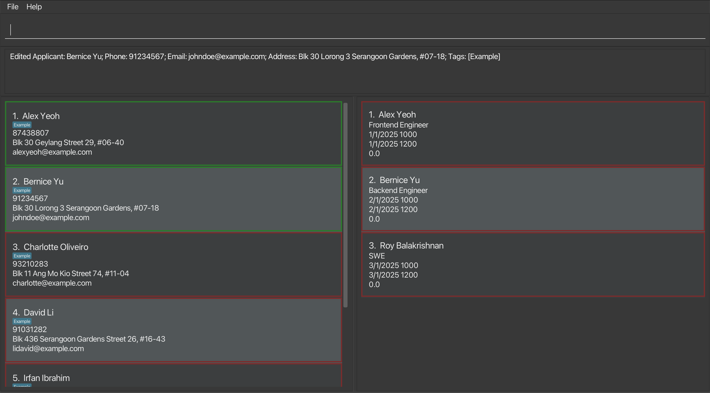
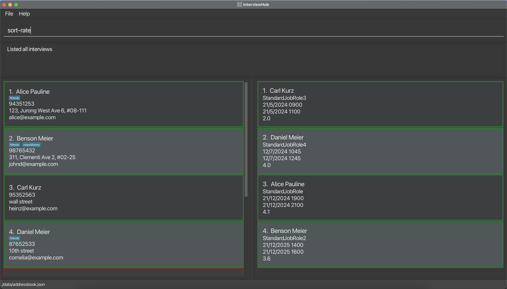
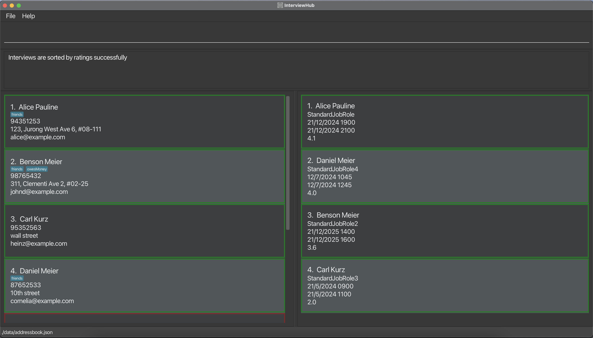

# Welcome to InterviewHub!

**Dear Engineering Hiring Managers,**

Welcome to **InterviewHub**! We are excited to introduce you to your new partner in recruitment and interview scheduling. 

As an engineering hiring manager, you understand the importance of time. That's why we've optimized **InterviewHub** for those who can type fast, think faster, and make decisions on the fly. Navigate through applicants, schedule interviews, and manage your hiring pipeline with commands that execute in the blink of an eye.

This guide is your roadmap to mastering **InterviewHub**. We'll guide you through each feature, helping you to leverage our interface to its full potential—so you can focus on what you do best: securing top talent.

Let's dive into **InterviewHub** and transform the way you recruit!

--------------------------------------------------------------------------------------------------------------------

# Table of Contents

- [Introduction](#introduction---what-is-interviewhub)
- [How to use this user guide](#how-to-use-this-user-guide)
- [Quick Start](#quick-start)
- [GUI Summary](#gui-summary)
- [Features](#features)
  - [General Features](#general-features)
    - [Viewing help: `help`](#viewing-help--help)
    - [Clearing all the data: `clear`](#clearing-all-applicants-and-interviews--clear)
    - [Exiting the program: `exit`](#exiting-the-program--exit)
    - [Saving the data](#saving-the-data)
  - [Applicant Management Features](#applicant-management-features)
    - [Adding an applicant: `add-a`](#adding-an-applicant--add-a)
    - [Deleting an applicant: `delete-a`](#deleting-an-applicant--delete-a)
    - [Editing an applicant: `edit-a`](#editing-an-applicant--edit-a)
    - [Finding applicants from the list: `find-a`](#finding-applicants--find-a)
    - [Listing all applicants: `list-a`](#listing-all-applicants--list-a)
  - [Interview Management Features](#interview-management-features)
    - [Adding an interview: `add-i`](#adding-an-interview--add-i)
    - [Deleting an interview: `delete-i`](#deleting-an-interview--delete-i)
    - [Editing an interview: `edit-i`](#editing-an-interview--edit-i)
    - [Finding interviews by job role: `find-i`](#finding-interviews-by-job-role--find-i)
    - [Listing all interviews: `list-i`](#listing-all-interviews--list-i)
    - [Listing all free timing for the given date: `list-freetime`](#listing-all-free-time-for-the-given-date--list-freetime)
    - [Listing all interviews for today: `list-i-today`](#listing-all-interviews-for-today--list-i-today)
    - [Marking an interview as done: `mark`](#marking-an-interview-as-done--mark)
    - [Rating an interview: `rate`](#rating-an-interview--rate)
    - [Listing all completed interview: `list-i-done`](#listing-all-completed-interview--list-i-done)
    - [Listing all incomplete interview: `list-i-not-done`](#listing-all-incomplete-interview--list-i-not-done)
    - [Sorting interviews by rating: `sort-rate`](#sorting-interviews-by-rating--sort-rate)
    - [Sorting interviews by start time: `sort-time`](#sorting-interviews-by-start-time--sort-time)
- [Frequently Asked Questions](#frequently-asked-questions)
- [Known Issues](#known-issues)
- [Command Summary](#command-summary)
  - [General Commands](#general-commands)
  - [Applicant Management Commands](#applicant-management-commands)
  - [Interview Management Commands](#interview-management-commands)
- [Glossary](#glossary)

--------------------------------------------------------------------------------------------------------------------

# Introduction - What is InterviewHub?

**InterviewHub**  is a desktop app for engineering hiring managers to schedule job interviews and manage applicants' contact information.
**InterviewHub** allows users to:
* seamlessly update and manage applicants for various job openings,
* schedule and keep track of interviews with each applicant,

through an all-in-one user-friendly platform!

It is optimized for use via a **Command Line Interface** (CLI) while still having the benefits of a **Graphical User Interface** (GUI).
If you are an engineering hiring manager who have a good understanding in CLI-based application and can type fast, **InterviewHub** can get your Interview and applicant management tasks done faster than traditional GUI apps.

--------------------------------------------------------------------------------------------------------------------

# How to use this user guide

To quickly find the information you need, refer to the [Table of Contents](#table-of-contents) located at the beginning of this guide.
It lists all the chapters and sections, allowing you to jump directly to the relevant content.

Next, to get you started, we've included a [Quick Start](#quick-start) section in this user guide to ensure that you have no trouble setting up **InterviewHub**.

To get a better understanding of what you see, you can head over to [GUI Summary](#gui-summary) for a quick overview of the User-Interface.

Along the way if you encounter unfamiliar terms, our [Glossary](#glossary) provides definitions and explanations for product-specific terminology. Refer to it whenever needed.

Before we begin, the table below describes some symbols and syntax you may see throughout our guide:

| Symbol                                    | Meaning                                                                                          |
|-------------------------------------------|--------------------------------------------------------------------------------------------------|
| :warning: **Warning**                     | Important information that must be understood as the action may leads to unexpected consequences |
| :information_source: **Note**             | Important information that you should pay attention to                                           |
| :bulb: **Tip**                            | Helpful information to improve your experience                                                   |
| `Highlighted text block`                  | Commands or parameters relevant to the application                                               |
| [Hyperlinks](#how-to-use-this-user-guide) | When clicked, you will be led to a designated section within this document or an external link   |

--------------------------------------------------------------------------------------------------------------------

# Quick Start

1. Ensure you have **Java 11** or above [installed in your Computer](#q-how-do-i-check-if-i-have-the-correct-version-of-java-installed).

2. Download the latest `InterviewHub.jar` from [here](https://github.com/AY2324S1-CS2103T-T11-2/tp/releases).

3. Copy the file to the folder you want to use as the home folder for **InterviewHub**.

4. Open a terminal, and navigate to the folder you put the JAR file in. 

5. Launch the app by using the command `java -jar InterviewHub.jar` in your terminal. 

6. The Graphical User Interface(GUI) should appear in a few seconds. Note that the app contains some sample data.

7. Type the command in the command box and press Enter to execute it. E.g. typing **`help`** and pressing Enter will
   open the help window. 
   Some example commands you can try to get comfortable with **InterviewHub**:

   * **`help`** : Opens the help window, which contains a link to this User Guide.

   * **`list-a`** : Lists all job applicants.

   * **`add-a n/James Ho p/22224444 e/jamesho@example.com a/123, Clementi Rd, 1234665`** :
     Adds an applicant information for `James Ho` to **InterviewHub**. 
     * The applicant's phone number is `22224444`, 
     * the applicant's email address is `jamesho@example.com`, and 
     * the applicant's residential address is at `123, Clementi Rd, 1234665`.

   * **`delete 1`** : Deletes the first job applicant displayed in **InterviewHub**.

   * **`exit`** : Exits **InterviewHub**.

8. Refer to the [Features](#features) below for details of each command.

--------------------------------------------------------------------------------------------------------------------

# GUI Summary

The following is an annotated breakdown of InterviewHub’s GUI:

For each **applicant**, we see the following details:

| Information | Description                                 |
|-------------|---------------------------------------------|
| **Name**    | The full name of the applicant              |
| **Tags**    | Tags for the applicant (if any)             |
| **Phone**   | The mobile phone number of the applicant    |
| **Address** | The residential address of the applicant    |
| **Email**   | The email address of the applicant          |

For each **interview**, we see the following details:

| Information          | Description                                                    |
|----------------------|----------------------------------------------------------------|
| **Applicant's Name** | The full name of the applicant                                 |
| **Job Role**         | The job role which the applicant is applying for               |
| **Start Time**       | Start time of the interview                                    |
| **End Time**         | Projected end time of the interview                            |
| **Rating**           | Interview performance rating of the applicant (from 0.0 - 5.0) |

[Back to the Table of Contents](#table-of-contents)

--------------------------------------------------------------------------------------------------------------------

# Features

**:information_source: Notes about the command format:** 

* Words in `UPPER_CASE` are the parameters to be supplied by the user. 
  e.g. in `add n/NAME`, `NAME` is a parameter which can be used as `add n/John Doe`.

* Items in square brackets are optional. 
  e.g. `n/NAME [t/TAG]` can be used as `n/John Doe t/friend` or as `n/John Doe`.

* Items with `…`​ after them can be used multiple times including zero times. 
  e.g. `[t/TAG]…​` can be used as ` ` (i.e. 0 times), `t/friend`, `t/friend t/family` etc.

* Items with `(S)` after them can be used multiple times without the tag.  
  e.g. `n/KEYWORD(S)` can be used as `n/John`, `n/John Alice Bob`

* Parameters can be in any order. 
  e.g. if the command specifies `n/NAME p/PHONE_NUMBER`, `p/PHONE_NUMBER n/NAME` is also acceptable.

* Extraneous parameters for commands that do not take in parameters (such as `help`, `list-i`, `list-a`, `list-i-done`, `list-i-not-done`,
  `list-today`, `sort-rate`, `sort-time`, `exit`, and `clear`) will be ignored. 
  e.g. if the command specifies `help 123`, it will be interpreted as `help`.

* List of accepted date formats:
  * DD/MM/YYYY and time:
    * `16 May 2024 TIME`
    * `16-05-2024 TIME`
    * `16-05-24 TIME`
    * `16/05/2024 TIME`
    * `16/05/24 TIME`
  * MM, DD and time:
    * `16 May TIME`
    * `16 January TIME`
    * `16/5 TIME`
    * `16/05 TIME`
  * The `TIME` placeholder can be replaced with the formats below:
    * `1515`
    * `3.15pm`
    * `3pm`
  * The `TIME` must be between 9am to 5pm.
  * If the date is a parameter for the `list-freetime` command, please omit `TIME` and enter the date only (e.g. `16 May 2024`)

[Back to the Table of Contents](#table-of-contents)

--------------------------------------------------------------------------------------------------------------------

## General Features

### Viewing help : `help`

A pop-up window, containing the link as shown below, will appear to guide you to the **InterviewHub** User Guide.

Format: `help`

### Exiting the program : `exit`

Exits **InterviewHub**.

Format: `exit`

### Clearing all applicants and interviews : `clear`

Clears all applicants and interviews from **InterviewHub**.

Format: `clear`

**:warning: Warning:**  
* This action is irreversible, therefore do proceed with caution!

### Saving the data

InterviewHub data are saved in the hard disk automatically after any command that changes the data. There is no need to save manually.

[Back to the Table of Contents](#table-of-contents)

## Applicant Management Features

### Adding an applicant : `add-a`

Adds an applicant to **InterviewHub**.

Format: `add-a n/NAME p/PHONE_NUMBER e/EMAIL a/ADDRESS [t/TAG]...`

| Parameter      | Representation                    | Constraints                                                   |
|----------------|-----------------------------------|---------------------------------------------------------------|
| `NAME`         | The name of the applicant         | Must contain only alphanumeric characters and cannot be blank |
| `PHONE_NUMBER` | The phone number of the applicant | Must contain only numbers and be at least 3 digits long       |
| `EMAIL`        | The email of the applicant        | Must be in the format: `local-part@domain`                    |
| `ADDRESS`      | The address of the applicant      | No constraints as long as it is not blank                     |
| `TAG`          | A tag belonging to the applicant  | Must be a single word containing only alphanumeric characters |

Examples:
* `add-a n/James Ho p/22224444 e/jamesho@example.com a/123, Clementi Rd, 1234665 t/Engineer t/Frontend`.

[Back to the Table of Contents](#table-of-contents)

### Deleting an applicant : `delete-a`

Deletes the applicant at the specified `APPLICANT_INDEX` from **InterviewHub**

Format: `delete-a APPLICANT_INDEX`

| Parameter         | Representation                                                   | Constraints                                                                                              |
|-------------------|------------------------------------------------------------------|----------------------------------------------------------------------------------------------------------|
| `APPLICANT_INDEX` | The index of the target applicant as shown in the applicant list | Must be a positive unsigned integer and must not exceed the size of the current displayed applicant list |

**:warning: Warning:**  

* This action is irreversible, therefore do proceed with caution!

Examples:
* `delete-a 1` deletes the 1st applicant in the address book.

[Back to the Table of Contents](#table-of-contents)

### Editing an applicant : `edit-a`

Edits the applicant at the specified `APPLICANT_INDEX` from **InterviewHub**

Format: `edit-a APPLICANT_INDEX [n/NAME] [p/PHONE_NUMBER] [e/EMAIL] [a/ADDRESS] [t/TAG]...`

| Parameter         | Representation                                                   | Constraints                                                                                              |
|-------------------|------------------------------------------------------------------|----------------------------------------------------------------------------------------------------------|
| `APPLICANT_INDEX` | The index of the target applicant as shown in the applicant list | Must be a positive unsigned integer and must not exceed the size of the current displayed applicant list |
| `NAME`            | The name of the applicant                                        | Must contain only alphanumeric characters and cannot be blank                                            |
| `NUMBER`          | The phone number of the applicant                                | Must contain only numbers and be at least 3 digits long                                                  |
| `EMAIL`           | The email of the applicant                                       | Must be in the format: `local-part@domain`                                                               |
| `ADDRESS`         | The address of the applicant                                     | No constraints as long as it is not blank                                                                |
| `TAG`             | A tag belonging to the applicant                                 | Must be a single word containing only alphanumeric characters                                            |

**:information_source: Note about the command usage.** 

* At least one of the optional fields must be provided.
* Existing values will be updated to the input values.

Examples:
*  `edit-a 1 n/John Doe` Edits the name of the 1st applicant to be `John Doe`.
*  `edit-a 2 p/91234567 e/johndoe@example.com` Edits the phone number and email address of the 2nd applicant to be `91234567` and `johndoe@example.com` respectively.

   Before:
   
   After:
   

[Back to the Table of Contents](#table-of-contents)

### Finding applicants : `find-a`

Finds applicants whose attributes contain any of the given keywords.

Format: ``find-a [n/KEYWORD(S)] [p/NUMBER]
[e/KEYWORD(S)] [a/KEYWORD(S)] [t/KEYWORD(S)]``

The table below summarises how each field is matched in the search.

| Parameter      | Match                                                                                          | Examples                                                                       |
|----------------|------------------------------------------------------------------------------------------------|--------------------------------------------------------------------------------|
| `NAME`         | Only full words will be matched                                                                | `Han` will match `Han Bo` but not `Hans Bo`                                    |
| `PHONE_NUMBER` | Partial numbers will be matched                                                                | `987` will match `98765432`                                                    |
| `EMAIL`        | Must be an exact match to the entire email, the part before the `@`, or the part after the `@` | `john`, `example.com` and `john@example.com` will all match `john@example.com` |
| `ADDRESS`      | Only full words will be matched                                                                | `Serangoon` will match `Serangoon Road` but not `Rangoon road`                 |
| `TAG`          | Only full words will be matched                                                                | `Eng` will match `Eng` but not `Engineer`                                      |

**:information_source: Note about the command usage.** 

* Any of the fields (name, phone, email, address, tags) can be searched
* At least one of the optional fields must be provided
* Multiple keywords must be either space or comma separated
* The search is case-insensitive. e.g. `hans` will match `Hans`
* The order of the keywords does not matter. e.g. `Hans Bo` will match `Bo Hans`
* Applicants matching at least one keyword will be returned (i.e. `OR` search).
  e.g. `Hans Bo` will return `Hans Gruber`, `Bo Yang`

Examples:
* `find-a n/alex david` returns `Alex Yeoh`, `David Li` 
  
* `find-a p/874 a/serangoon ang` returns `97438807`, `Serangoon Gardens`,
  `Serangoon Gardens Street`, `Ang Mo Kio` 
  

[Back to the Table of Contents](#table-of-contents)

### Listing all applicants : `list-a`

Shows a list of all applicants in **InterviewHub** onto the GUI.

Format: `list-a`

[Back to the Table of Contents](#table-of-contents)

## Interview Management Features

### Adding an interview : `add-i`

Adds an interview to **InterviewHub**.

Format: `add-i app/APPLICANT_INDEX jr/JOB_ROLE start/START_DATE_AND_TIME end/END_DATE_AND_TIME`

| Parameter             | Representation                                            | Constraints                                                                                                     |
|-----------------------|-----------------------------------------------------------|-----------------------------------------------------------------------------------------------------------------|
| `APPLICANT_INDEX`     | The index of the applicant as shown in the applicant list | Must be a positive unsigned integer and must not exceed the size of the current displayed applicant list        |
| `JOB_ROLE`            | The job role which the applicant is applying for          | No constraint                                                                                                   |
| `START_DATE_AND_TIME` | Starting time of the interview                            | Must be in one of the [accepted formats](#features), before the end time and on the same day as the end time    |
| `END_DATE_AND_TIME`   | Ending time of the interview                              | Must be in one of the [accepted formats](#features), after the start time and on the same day as the start time |

:bulb: **Tip:** `JOB_ROLE` allows empty strings to be entered to handle situations where the applicant is applying
to the company in general.

Examples of accepted date formats (full list [here](#features)):
* DD/MM/YYYY and time:
  * `16 May 2024 1515`
  * `16 May 2024 3.15pm`
* MM, DD and time:
  * `16 May 1515`
  * `16 May 3.15pm`

Example:
Result of `add-i app/3 jr/Software engineer start/12-12-2023 1400 end/12-12-2023 1500`

A common error that you may encounter is entering an invalid time or time format,
please refer to the informative error message or [accepted formats list](#features) and reenter the command with proper parameters

After `add-i app/4 jr/Software engineer start/Next Tuesday 4pm end/6pm that day`:

[Back to the Table of Contents](#table-of-contents)

### Deleting an interview : `delete-i`

Deletes the interview at the specified `INTERVIEW_INDEX` from **InterviewHub**

Format: `delete-i INTERVIEW_INDEX`

| Parameter         | Representation                                                   | Constraints                                                                                              |
|-------------------|------------------------------------------------------------------|----------------------------------------------------------------------------------------------------------|
| `INTERVIEW_INDEX` | The index of the target interview as shown in the interview list | Must be a positive unsigned integer and must not exceed the size of the current displayed interview list |

**:warning: Warning:**  

* This action is irreversible, therefore do proceed with caution!

Examples:
* `delete-i 1` deletes the 1st interview in **InterviewHub**.

Before `delete-i`: You should see the applicant and interview list (may be filtered depending on whether your previous commands filtered the lists)

After `delete-i 1`: You should see a success message in the command result box. And the targeted interview is removed from the interview list.
Also, the applicant associated with the interview will have their border change to red.

If you do not specify a valid index (or an index at all) you may encounter one of the informative error messages appearing in the command result box
that should assist you with troubleshooting:

[Back to the Table of Contents](#table-of-contents)

### Editing an interview : `edit-i`

Edits an existing interview at the specified `INTERVIEW_INDEX`.

Format: `edit-i INTERVIEW_INDEX [jr/JOB_ROLE] [start/START_DATE_AND_TIME] [end/END_DATE_AND_TIME]`

| Parameter             | Representation                                            | Constraints                                                                                                  |
|-----------------------|-----------------------------------------------------------|--------------------------------------------------------------------------------------------------------------|
| `INTERVIEW_INDEX`     | The index of the interview as shown in the interview list | Must be a positive unsigned integer and must not exceed the size of the current displayed interview list     |
| `JOB_ROLE`            | The role the applicant is interviewing for                | No constraints                                                                                               |
| `START_DATE_AND_TIME` | Starting time of the interview                            | Must be one of the [accepted formats](#features), before the end time and on the same day as the end time    |
| `END_DATE_AND_TIME`   | Ending time of the interview                              | Must be one of the [accepted formats](#features), after the start time and on the same day as the start time |

**:information_source: Note about the command usage.** 

* At least one of the optional fields must be provided.
* Existing values will be updated to the input values.
* To edit the `RATING` field (re-rating an interview), please refer to the [rate command](#rating-an-interview--rate)

Examples of accepted date formats (full list [here](#features)):
* DD/MM/YYYY and time:
  * `16 May 2024 1515`
  * `16 May 2024 3.15pm`
* MM, DD and time:
  * `16 May 1515`
  * `16 May 3.15pm`

Examples:
*  `edit-i 1 jr/software-engineer` Edits the job role of the 1st interview to be `software-engineer`.
*  `edit-i 2 jr/data-analyst` Edits the job role of the 2nd interview to be `data-analyst`.

View of the Interview list before editing:

View of the application after `edit-i 1 jr/Network Engineer`:

You can see that Alex Yeoh's role has been updated from Frontend Engineer to Network Engineer

[Back to the Table of Contents](#table-of-contents)

### Finding interviews by job role : `find-i`

Find interviews which jobs roles contain any of the given keywords.

Format: `find-i KEYWORD(S)`

| Parameter         | Representation                             | Constraints                                                                                 |
|-------------------|--------------------------------------------|---------------------------------------------------------------------------------------------|
| `KEYWORD`         | The job role the interview is assigned for | Each keyword must not contain any spaces, otherwise it will be treated as multiple keywords |

**:information_source: Note about the command usage.** 

* The search is case-insensitive. e.g. `ANALYST` will match `analyst`
* Must provide at least one keyword
* The order of the keywords does not matter. e.g. `Software Engineer` will match `Engineer Software`
* Only the job role is searched.
* Only full words will be matched e.g. `Analyst` will not match `Analysts`
* Interviews matching at least one keyword will be returned (i.e. `OR` search).
  e.g. `Software Engineer` will return interviews with the job role of `Software Developer` and `System Engineer`

Examples:
* `find-i software data` returns `Software Engineer` and `Data Analyst`.

[Back to the Table of Contents](#table-of-contents)

### Listing all interviews : `list-i`

Shows a list of all interviews in the address book onto the GUI.

Format: `list-i`

After `list-i`: You should see a success message in the command result box and the full list of interviews in the interview list

[Back to the Table of Contents](#table-of-contents)

### Listing all free time for the given date : `list-freetime`

Displays a list of all the blocks of free time the user has in
  the given `DATE`, within the 9am to 5pm window of that day.

Format: `list-freetime DATE`

| Parameter | Representation                                                            | Constraints                                                                                                                            |
|-----------|---------------------------------------------------------------------------|----------------------------------------------------------------------------------------------------------------------------------------|
| `DATE`    | The date for which the user wants to view the list of blocks of free time | The input date must be one of the [accepted formats](#features) and cannot be in the past. Must contain only the date without the time |

**:information_source: Note about the command usage.** 

* Additional parameters separated by non-number characters will be accepted.
* e.g. 12-12-2024hello

* If there is no free time, there will be no blocks of
  free time that will be displayed
  * This indicates that the entire day is not free

* If there are no interviews on that day, the block of free time
  listed will be: `from: 09:00 to: 17:00`
  * This indicates that the entire day is free

* If the `DATE` not valid at all, this error message will
  be shown:`Please specify a valid date!`

* If the `DATE` is valid but in the past, this error message will
  be shown:`Input date cannot be in the past!`

Examples: 
* `list-freetime 03-11-2024`
* `list-freetime 5-5-2025`

[Back to the Table of Contents](#table-of-contents)

### Listing all interviews for today : `list-i-today`

Displays all the interviews that the user has on the day the
command is executed.

Format: `list-i-today`

**:information_source: Note about the command usage.** 

* Lists all interviews that have a start date that falls on the
  day on which the user executed the command
  * For example, if the user executed this command on `12/12/2023`,
    the app will display all the interviews that the user has scheduled
    on `12/12/2023`
* If there are no interviews scheduled on the day on which the command
  was executed, the app will not display any interviews
* Upon successful execution of the command, this message will be
  shown: `Listed all interviews today`

Example: `list-i-today`

Suppose we have three interviews scheduled on 09/11/2023.

Result of `list-i-today` on 09/11/2023.

[Back to the Table of Contents](#table-of-contents)

### Marking an interview as done : `mark`

Mark the specified `INTERVIEW_INDEX` in the **InterviewHub** as done.

Format: `mark INTERVIEW_INDEX`

| Parameter         | Representation                                                   | Constraints                                                                                              |
|-------------------|------------------------------------------------------------------|----------------------------------------------------------------------------------------------------------|
| `INTERVIEW_INDEX` | The index of the target interview as shown in the interview list | Must be a positive unsigned integer and must not exceed the size of the current displayed interview list |

Examples:
* `mark 1` marks the first interview shown on the list as done.
* `mark 3` marks the third interview shown on the list as done.

[Back to the Table of Contents](#table-of-contents)

### Rating an interview : `rate`

Rate the specified `INTERVIEW_INDEX` in the **InterviewHub** with the indicated `RATING`.

Format: `rate INTERIVEW_INDEX RATING`

**:information_source: Note about the command usage.** 
* The interview has to be marked done before it can be rated.
* The new rating will always replace the existing rating.

| Parameter         | Representation                                                   | Constraints                                                                                              |
|-------------------|------------------------------------------------------------------|----------------------------------------------------------------------------------------------------------|
| `INTERVIEW_INDEX` | The index of the target interview as shown in the interview list | Must be a positive unsigned integer and must not exceed the size of the current displayed interview list |
| `RATING`          | The rating number to be assigned to the interview indicated      | Must be a positive unsigned one decimal place number between 0.0 to 5.0 inclusive                        |

Examples:
* `rate 1 3.0` rates the first interview with a rating of 3.0.

Before rating the interview at `INTERVIEW_INDEX` 1:

After rating the interview at `INTERVIEW_INDEX` 1 with a `RATING` of 4.0:

[Back to the Table of Contents](#table-of-contents)

### Listing all completed interview : `list-i-done`

Shows a list of all the interviews in **InterviewHub** that are done onto the GUI.

Format: `list-i-done`

:bulb: **Tip:** 
To see all interviews regardless of completion status, use the command `list-i`.

Before `list-i-done`:

After `list-i-done`:

[Back to the Table of Contents](#table-of-contents)

### Listing all incomplete interview : `list-i-not-done`

Show a list of all the interviews in **InterviewHub** that are not done onto the GUI.

Format:`list-i-not-done`

:bulb: **Tip:** 
To see all interviews regardless of completion status, use the command `list-i`.

Before `list-i-not-done`:

After `list-i-not-done`:

[Back to the Table of Contents](#table-of-contents)

### Sorting interviews by rating : `sort-rate`

Sort the shown interview list by rating in descending order (highest to the lowest rating).

Format: `sort-rate`

:bulb: **Tip:** 
To sort the full unfiltered interview list, use the command `list-i` before using `sort-rate`.

Before `sort-rate`:

After `sort-rate`:

[Back to the Table of Contents](#table-of-contents)

### Sorting interviews by start time : `sort-time`

Sort the shown interview list by interview start time
in chronologically ascending order (interviews with earlier start times
will be shown first).

Format: `sort-time`

:bulb: **Tip:** 
To sort the full unfiltered interview list, use the command `list-i` before using `sort-time`.

Before `sort-time`:

After `sort-time`:

[Back to the Table of Contents](#table-of-contents)

### Editing the data file

InterviewHub data are saved automatically as a JSON file `[JAR file location]/data/interviewhub.json`. Advanced users are welcome to update data directly by editing that data file.

:exclamation: **Warning:**
If your changes to the data file makes its format invalid, InterviewHub will discard all data and start with an empty data file at the next run. Hence, it is recommended to take a backup of the file before editing it.

[Back to the Table of Contents](#table-of-contents)

--------------------------------------------------------------------------------------------------------------------

# Frequently Asked Questions

### **Q**: How do I transfer my data to another Computer?
**A**: Install the app in the other computer and overwrite the empty data file it creates with the file that contains the data of your previous InterviewHub home folder.

### **Q**: How do I check if I have the correct version of Java installed?
**A**: You can check the version of Java installed in your computer by opening the terminal and running the `java --version` command.
The correct version of Java required to run **InterviewHub** is **Java 11**. If you do not have Java (or the correct version of it) installed, you can download it [here](https://www.oracle.com/java/technologies/downloads/#java11).

### **Q**: Do I need an active internet connection to use InterviewHub? 
**A**: No. It is an offline app.

[Back to the Table of Contents](#table-of-contents)

--------------------------------------------------------------------------------------------------------------------

# Known issues

1. **When using multiple screens**, if you move the application to a secondary screen, and later switch to using only the primary screen, the GUI will open off-screen. The remedy is to delete the `preferences.json` file created by the application before running the application again.

[Back to the Table of Contents](#table-of-contents)

--------------------------------------------------------------------------------------------------------------------

# Command Summary

## General Commands

| Action                                  | Format, Examples |
|-----------------------------------------|------------------|
| **Clear all applicants and interviews** | `clear`          |
| **Help**                                | `help`           |
| **Exit**                                | `exit`           |

## Applicant Management Commands

| Action               | Format, Examples                                                                                                                                                        |
|----------------------|-------------------------------------------------------------------------------------------------------------------------------------------------------------------------|
| **Add applicant**    | `add-a n/NAME p/PHONE_NUMBER e/EMAIL a/ADDRESS [t/TAG]`   e.g., `add-a n/James Ho p/22224444 e/jamesho@example.com a/123, Clementi Rd, 1234665 t/friend t/colleague` |
| **Delete applicant** | `delete-a APPLICANT_INDEX`  e.g., `delete-a 3`                                                                                                                       |
| **Edit applicant**   | `edit-a APPLICANT_INDEX [n/NAME] [p/PHONE_NUMBER] [e/EMAIL] [a/ADDRESS] [t/TAG]...`  e.g.,`edit-a 2 n/John Doe`                                                      |
| **Find applicant**   | `find-a [n/KEYWORD(S)] [p/NUMBER] [e/KEYWORD(S)] [a/KEYWORD(S)] [t/KEYWORD(S)]`   e.g., `find-a n/John Bob p/98765432 e/john@example.com`                            |
| **List applicants**  | `list-a`                                                                                                                                                                |

## Interview Management Commands

| Action                           | Format, Examples                                                                                                                                                                |
|----------------------------------|---------------------------------------------------------------------------------------------------------------------------------------------------------------------------------|
| **Add interview**                | `add-i app/APPLICANT_INDEX jr/JOB_ROLE start/START_DATE_AND_TIME end/END_DATE_AND_TIME`   e.g., `add-i app/3 jr/Software Engineer start/12-12-2024 1500 end/12-12-2024 1600` |
| **Delete interview**             | `delete-i INTERVIEW_INDEX`  e.g., `delete-i 3`                                                                                                                               |
| **Edit interview**               | `edit-i INTERVIEW_INDEX [jr/JOB_ROLE] [start/START_DATE_AND_TIME] [end/END_DATE_AND_TIME] `  e.g.,`edit-i 2 jr/software-engineer`                                            |
| **Find interview by job**        | `find-i KEYWORD(S)`  e.g., `find-i software-engineer`                                                                                                                        |
| **List interview**               | `list-i`   e.g. `list-i`                                                                                                                                                    |
| **List free time**               | `list-freetime INTERVIEW_DATETIME`   e.g, `list-freetime 12-12-2023`, `list-freetime 12/12/2023`, `list-freetime 12/12`, `list-freetime 12 Dec`                              |
| **List interview for today**     | `list-i-today`   e.g. `list-i-today`                                                                                                                                        |
| **Mark interview as done**       | `mark INTERVIEW_INDEX`   e.g., `mark 3`                                                                                                                                      |
| **Rate interview**               | `rate INTERVIEW_INDEX RATING`   e.g., `rate 1 3.0`                                                                                                                           |
| **List completed interview**     | `list-i-done`   e.g. `list-i-done`                                                                                                                                          |
| **List incomplete interview**    | `list-i-not-done`   e.g. `list-i-not-done`                                                                                                                                  |
| **Sort interview by rating**     | `sort-rate`   e.g. `sort-rate`                                                                                                                                              |
| **Sort interview by start time** | `sort-time`   e.g. `sort-time`                                                                                                                                              |

[Back to the Table of Contents](#table-of-contents)

--------------------------------------------------------------------------------------------------------------------

# Glossary

| Term          | Definition                                                                                                                                                                                               |
|---------------|----------------------------------------------------------------------------------------------------------------------------------------------------------------------------------------------------------|
| **JAR File**  | JAR (Java Archive) files are archive files that include a Java-specific manifest file. They are built on the ZIP format and typically have a `.jar` file extension.                                      |
| **JSON File** | JSON (JavaScript Object Notation) is a lightweight data interchange format that is easy to understand and use.                                                                                           |
| **CLI**       | A CLI (Command Line Interface) is a means of interacting with a computer program by inputting lines of text called command-lines.                                                                        |
| **GUI**       | A GUI (Graphical User Interface) is user interface that allows users to interact with the program with interactive visual components instead of text-based UIs, typed command labels or text navigation. |

[Back to the Table of Contents](#table-of-contents)
