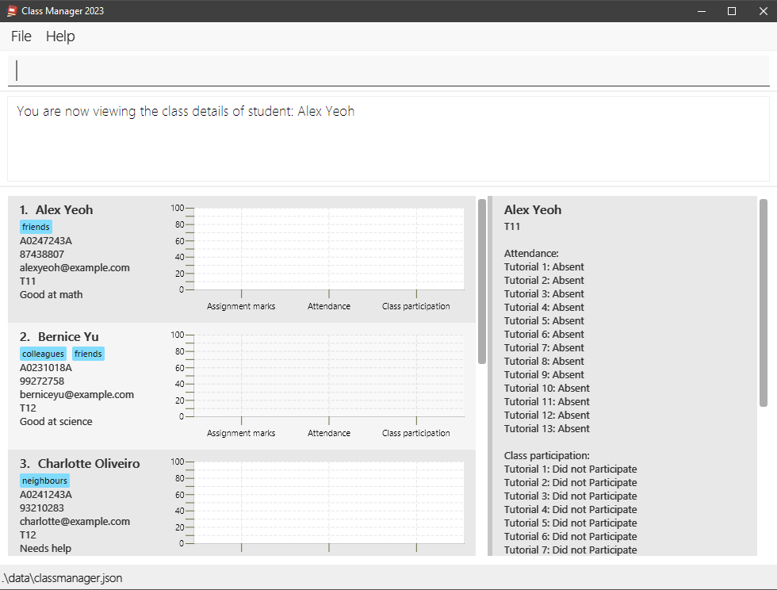

# Class Manager 2023 User Guide 

## Welcome to Class Manager 2023!

To all CS2103/T Teaching Assistants (TAs), 

We understand your struggles in managing your students' information. We know that you have to keep track of your students' contact information, attendance, class participation and assignment grades. We also know that you have to manage multiple classes while juggling your own schoolwork and other commitments.

This is why we are excited to introduce **Class Manager 2023**, an all-in-one application designed to streamline your class management duties. **Class Manager 2023** will help you to save time, streamline your TA duties and allow you to focus on what matters most - your students.

This user guide is your key to mastering **Class Manager 2023**, with step-by-step instructions on how you can install and use our application. **Class Manager 2023** is designed to be intuitive and easy to use, so you can get started right away!

<!-- * Table of Contents -->
<page-nav-print />

--------------------------------------------------------------------------------------------------------------------

# Overview

**Class Manager 2023** is an offline desktop application for CS2103/T: Software Engineering Teaching Assistants (TAs) in National University of Singapore to manage their students' contacts and class information. 

**Class Manager 2023** allows users to:
* store and manage student's contact information,
* keep track of and visualise student's class information such as attendance, class participation and assignment grades,
* easily mark the attendance of multiple students for each tutorial session,
* and much more!

**Class Manager 2023** is optimized for use via a Command Line Interface (CLI), while still having the benefits of a Graphical User Interface (GUI). Since CS2103/T TAs have an adequate understanding of CLI, **Class Manager 2023** will allow class management tasks to be completed faster than traditional GUI apps.

--------------------------------------------------------------------------------------------------------------------

# Quick start

1. Ensure you have Java `11` or above installed in your Computer.

2. Download the latest `class-manager-2023.jar` from [here](https://github.com/AY2324S1-CS2103T-T11-1/tp/releases).

3. Copy the file to the folder you want to use as the _home folder_ for **Class Manager 2023**.

4. Open a command terminal, `cd` into the folder you put the jar file in, and use the `java -jar class-manager-2023.jar` command to run the application.
   Note the app contains some sample data. 

5. Type the command in the command box and press Enter to execute it. e.g. typing **`help`** and pressing Enter will open the help window. 
   Some example commands you can try:

   * `list` : Lists all student details.

   * `add n/John Doe p/98765432 e/johnd@example.com s/A0245234A c/T11` : Adds a student named `John Doe` to **Class Manager 2023**.

   * `delete s/A0245234A` : Deletes the student with student number A0245234A, which is added in the previous step.

   * `exit` : Exits the app.

6. To begin using **Class Manager 2023**, configure **Class Manager 2023** with your module information using the `config` command. For example:
   * `config #t/10 #a/1` configures **Class Manager 2023** to have 10 tutorials and 1 assignment.

7. That's it! You can now explore **Class Manager 2023**! Refer to the [Commands](#commands) below for details of each command.  
   You can also refer to the [Command Summary](#command-summary).

--------------------------------------------------------------------------------------------------------------------

# GUI Overview

The blurred image below shows an annotated overview of **Class Manager 2023's** GUI:

  

The **GUI** has 6 notable sections:

1. **Command Box** - This is where you can type in commands to execute.
2. **Result Display Box** - This is where the results of the commands and any errors will be displayed.
3. **Data Visualisation** - This is where the average grades, attendance and class participation percentages of a student will be displayed.
4. **View Panel** - This is where the class information of the selected student, such as attendance, class participation and assignment grades, will be displayed.
5. **Student List** - This is where the current list of students will be displayed in card form.
6. **Status Bar** - This is where the current file path of the loaded data file will be displayed.

--------------------------------------------------------------------------------------------------------------------

# Features

<box type="info" seamless>

**Notes about the command format:** 

* Words in `UPPER_CASE` are the parameters to be supplied by the user. 
  e.g. in `add n/NAME`, `NAME` is a parameter which can be used as `add n/John Doe`.

* Items in square brackets are optional. 
  e.g. `n/NAME [t/TAG]` can be used as `n/John Doe t/friend` or as `n/John Doe`.

* Items with `…`​ after them can be used multiple times including zero times. 
  e.g. `[t/TAG]…​` can be used as ` ` (i.e. 0 times), `t/friend`, `t/friend t/family` etc.

* Parameters can be in any order. 
  e.g. if the command specifies `n/NAME c/CLASS_NUMBER`, `c/CLASS_NUMBER n/NAME` is also acceptable.

* Extraneous parameters for commands that **do not** take in parameters (such as `help`, `list`, `exit` and `clear`) will be ignored. 
  e.g. if the command specifies `help 123`, it will be interpreted as `help`.

* Extraneous parameters for commands that **do** take in parameters will be considered as invalid.  
  e.g. if the command specifies `delete 123 s/A0249112A` or `delete s/A0249112A c/T11`, it will be considered as invalid.  
  Please **<u>refrain</u>** from using prefixes as input under another prefix.

* If you are using a PDF version of this document, be careful when copying and pasting commands that span multiple lines as space characters surrounding line-breaks may be omitted when copied over to the application.
</box>

## Class Number

* Class Number refers to the tutorial class number of a particular course.
* Class Number is case-sensitive, and it must begin with a capital "T", followed by any number of characters. Class Number must not be blank as well.
* Class Number is stored verbatim based on your input, with case being preserved. 
* Here are some valid examples of Class Number:
    - `T11`
    - `TG11`
    - `TG10B`

## Student Number

Student Number refers to the unique matriculation number of a NUS student. In **Class Manager 2023**, it must begin with the capital letter 'A', followed by 1 or more consecutive digits, and end with a single alphabetical character. Student Number must not be blank as well.

**Class Manager 2023** uses the Student Number to uniquely identify each student in most commands. The Student Number is not case-sensitive. e.g. Student Number `A123V` and `A123v` refers to the same student.

## Data visualisation

**Data Visualisation** of student information will be automatically generated in the Data Visualisation segment of the GUI (within the student list segment).
* There will be 3 bar graphs, each representing the average grades, attendance and class participation percentages of a student.

## Command navigation

**Class Manager 2023** allows you to navigate to previously entered commands using the arrow keys. Navigate to earlier commands using the **up arrow** key, and later commands using the **down arrow** key.

## Saving your data

**Class Manager 2023** data is saved on your computer automatically after any command that changes the data. There is no need to save manually.

## Editing the data file

**Class Manager 2023's** data is saved as a JSON file at `[JAR file location]/data/classmanager.json`. Advanced users are welcome to update data directly by editing that data file. You can refer to a valid sample of the JSON file in the image below. 

The size of `attendanceTracker` and `classParticipationTracker` arrays must match the configured tutorial count. Similarly, the size of `assignmentTracker` array must match the configured assignment count. **Class Manager 2023** is configured to have 13 tutorials and 6 assignments by default. You can configure **Class Manager 2023** using the `config` command first before loading the edited data file. 

   

<box type="warning" seamless>

**Caution:**
If your changes to the data file make its format invalid (missing value pairs or not matching the configured tutorial and assignment count), **Class Manager 2023** will discard all data and start with an empty data file at the next run. Hence, it is recommended to take a backup of the file before editing it.
</box>

--------------------------------------------------------------------------------------------------------------------

# Commands

## Essential commands

### Configure Class Manager 2023 : `config`

<box type="warning" seamless>

**Caution:**
Configuring **Class Manager 2023** resets the class information (grades, attendance and class participation details) of all students, as well as the past states of **Class Manager 2023**. This **cannot** be undone using the `undo` command. It is recommended to configure **Class Manager 2023** before adding students.
</box>

Before you begin using **Class Manager 2023**, it is recommended that you configure the number of tutorials and assignments that your module has. This can be done using the `config` command, and allows **Class Manager 2023** to automatically generate the correct number of class information fields for each student.   
**Class Manager 2023** can be configured _at any time_, but do take note of the warning above regarding **loss** of student data and past **Class Manager 2023** states. If you configure **Class Manager 2023** after adding students, each student will have the correct number of tutorials and assignments. However, their class information data will be **reset** and there will be no previous states of **Class Manager 2023** you can return to via the `undo` command.

Format: `config #t/TUTORIAL_COUNT #a/ASSIGNMENT_COUNT`

* `TUTORIAL_COUNT` and `ASSIGNMENT_COUNT` must be a positive integer between 1 and 40 inclusive.
* Inputting the same `TUTORIAL_COUNT` and `ASSIGNMENT_COUNT` as the previous configuration will also **reset** the class information of all students.
* `config` resets the state history of **Class Manager 2023**, preventing you from using the `undo` command to reach a state before the `config` command was executed.

Examples:
* `config #t/13 #a/1`

Before `config` is executed:

After `config` is executed successfully and `view s/A0247243A` is executed to view the first student's class information:

Possible errors and their corresponding error messages:
* If `TUTORIAL_COUNT` or `ASSIGNMENT_COUNT` is missing
    * Error message: `Invalid command format! 
        config: Configures Class Manager with the module information.
        WARNING: Configuring Class Manager resets the grades, attendance and class participation details of all students. This cannot be undone.
        The default Class Manager is configured with 13 tutorials and 6 assignments.
        Parameters: #t/TUTORIAL_COUNT #a/ASSIGNMENT_COUNT
        Example: config #t/10 #a/4`
* If `TUTORIAL_COUNT` or `ASSIGNMENT_COUNT` is less than 1 
    * Error message: `Invalid count values! The count value of tutorials/assignments cannot be less than 1.`
* If `TUTORIAL_COUNT` or `ASSIGNMENT_COUNT` is more than 40
    * Error message: `Invalid count values! The count value of tutorials/assignments cannot be more than 40.`

---

### Open help window : `help`

Opens the help window that shows a summary of all commands and its parameters, with a `Copy URL` button that provides access to this help page.

Format: `help`

After `help` is executed successfully:

---

## Miscellaneous commands

### Exit Class Manager 2023 : `exit`

Exits **Class Manager 2023** immediately.

Format: `exit`

---

### View command history : `history`

Shows a list of all previously entered inputs, with the most recent inputs at the top of the list.

Format: `history`

After `history` is executed successfully: Result display box shows `Entered commands (from most recent to earliest):` and lists all previously entered inputs.

---

### Load a save file : `load`

Load student information from an existing JSON file. To load a file, first copy the JSON file to be loaded into the `/data` folder. Next, the JSON file can be loaded into the app via the `load` command. This file also becomes the new default save file. You can refer to [this section](#editing-the-data-file) for more information on the valid format of the data file.

Format: `load f/FILE_NAME`
* File name must not include the .json extension.
* File name is case-insensitive
* File must be valid and exist in the `/data` folder.
* Number of tutorials and assignments in the loaded file must be the same as the current configuration of **Class Manager 2023**. You can reconfigure **Class Manager 2023** to match the number of tutorials and assignments in the loaded file using the `config` command.
* `load` resets the state history of **Class Manager 2023**, preventing you from using the `undo` command to reach a state before the `load` command was executed.

Example:
* `load f/sample` loads `sample.json` file in the `/data` folder.

Before `load f/sample` is executed:

   

After `load f/sample` is executed successfully:

   

The file path at the bottom left of the application is updated to `.\data\sample.json`.

Possible errors and their corresponding error messages:
* If `sample.json` does not exist in the `/data` folder
  * Error message: `The file sample.json cannot be found. Please make sure the file is in the /data folder.`
* The file name entered is not a valid JSON file, or the tutorial and assignment count does not match the current configuration of **Class Manager 2023**
  * Error message: `The file sample.json cannot be loaded. Please make sure the file is formatted correctly.`

---

### Randomly select students : `random`

Randomly select a specific number of students from all students displayed in **Class Manager 2023**.

Format: `random NUMBER_OF_STUDENTS`

* `NUMBER_OF_STUDENTS` must be a valid positive integer, smaller than or equal to the number of current students displayed in **Class Manager 2023**.

Example:

* `random 2`

---

### Undo a command : `undo`

Undo the previous command that modified the state of **Class Manager 2023**. Undo only works with the commands mentioned below that modifies the state of **Class Manager 2023**, and does not work with commands such as `load` and `config`. **Class Manager 2023** only stores up to 10 modified states, which **resets** after a `load` or `config` command. Undo can be used multiple times to undo multiple commands, or until **Class Manager 2023** reaches its last stored state after a maximum of 9 undoes.

Format: `undo`

Here is the list of commands that can be undone/redone:
* `add`
* `class-part`
* `clear`
* `comment`
* `delete`
* `edit`
* `grade`
* `present`
* `absent`
* `present-all`
* `absent-all`
* `tag`
* `view`

Displayed result if undo is successful: `Undo success!`

Displayed result if there are no more commands to undo: `No more commands to undo!`

---

### Redo a command : `redo`

Redo a previously undone command that modified the state of **Class Manager 2023**. Redo only works with commands that can be undone. **Class Manager 2023** only stores up to 10 modified states, which **resets** after a `load` or `config` command. Redo can be used multiple times to redo multiple undo commands, or until **Class Manager 2023** reaches its most recent state after a maximum of 9 redoes.

Format: `redo`

Here is the list of commands that can be redone after they are undone (same list as undo):
* `add`
* `class-part`
* `clear`
* `comment`
* `delete`
* `edit`
* `grade`
* `present`
* `absent`
* `present-all`
* `absent-all`
* `tag`
* `view`

Displayed result if redo is successful: `Redo success!`

Displayed result if there are no more commands to redo: `No more commands to redo!`

---

### Toggle UI theme : `theme`

Toggles between light and dark color themes.

Format: `theme`

#### Dark theme
   

#### Light theme

---

## Student list commands

### Add a student : `add`

Adds a student to **Class Manager 2023**.

Format: `add n/NAME p/PHONE e/EMAIL s/STUDENT_NUMBER c/CLASS_NUMBER [t/TAG]…​`

* **ALL** the fields must be provided.
* The `NAME` field is case-sensitive.
* `PHONE` must be a 3 to 20 digit positive integer.
* [`STUDENT_NUMBER`](#student-number) needs to be unique, and must not be blank.
* When a student is added, their grades, attendance and class participation details will be initialised to `0`, `absent` and `false` respectively for all tutorials.
* Comment for a student can only be added after the student is instantiated.

<box type="tip" seamless>

**Tip:** A student can have any number of tags (including 0)
</box>

Examples:
* `add n/John Doe p/98765432 e/johnd@example.com s/A0245234A c/T11 t/friends t/owesMoney`
* `add n/John Doe p/98765432 e/johnd@example.com s/A0245234A c/T11`

---

### Comment on a student : `comment`

Adds or replaces a comment of an existing student in **Class Manager 2023**.

Format: `comment s/STUDENT_NUMBER cm/COMMENT`

* The [`STUDENT_NUMBER`](#student-number) must be valid and exist.
* Every student can only have 1 comment.
* The `COMMENT` must be a valid string.
    * Take note that the `COMMENT` string must not include any prefix.
    * e.g. `comment s/A0249112A cm/This student is very hardworking. t/Hardworking` is not allowed.
    * This means comments such as "This student is very hardworking. t/Hardworking" is not allowed.
* `comment` can only be performed after the student is created.
* Edit commands will not affect the comment of a student.
* Comment can be deleted by using an empty string as `COMMENT`.

Examples:
* `comment s/A0249112A cm/This student is very hardworking.`
* `comment s/A0249112A cm/This student is very hardworking and smart.`
* `comment s/A0249112A cm/` (_This deletes the comment_)

---

### Delete all students : `clear`

Clears all existing students from **Class Manager 2023**. This command will not delete the data file. Use the `undo` command to undo this command.

Format: `clear`

---

### Delete one student : `delete`

Deletes an existing student in **Class Manager 2023** by specifying the student number of the student to be deleted.

Format: `delete s/STUDENT_NUMBER`

* The [`STUDENT_NUMBER`](#student-number) must be valid and exist.

Example:
* `delete s/A0249112A`

---

### Edit a student's details : `edit`

Edits an existing student's details in **Class Manager 2023**. One or more details can be edited at once.

Format: `edit STUDENT_NUMBER [n/NAME] [p/PHONE] [e/EMAIL] [s/NEW_STUDENT_NUMBER] [c/CLASS_NUMBER]`

<box type="warning" seamless>

**Note:**
The student number entered __without__ the `s/` prefix is the **current** student number.
</box>

* [`STUDENT_NUMBER`](#student-number) must be valid and exist.
* [`STUDENT_NUMBER`](#student-number) must be entered before the details to be modified.
* Replace the student's existing student number with `NEW_STUDENT_NUMBER`.
* `PHONE` must be a positive integer with 3 or more digits.
* At least one of the optional fields must be provided.
* Existing values will be updated to the input values.
* The `NEW_STUDENT_NUMBER` must be valid and unique (does not exist in **Class Manager 2023**).

Examples:
*  `edit A0245234A p/91234567 e/johndoe@example.com` Edits the phone number and email address of the student with `STUDENT_NUMBER` A0245234A to be `91234567` and `johndoe@example.com` respectively.
*  `edit A0223344A n/Betsy Crower` Edits the name of the student with `STUDENT_NUMBER` A0223344A to be `Betsy Crower`.

---

### List all students : `list`

Shows a list of all students in **Class Manager 2023**.

Format: `list`

---

### Lookup students : `lookup`

Search and display students satisfying all given fields (Only one keyword needs to match per field).

Format: `lookup [c/CLASS_NUMBER] [p/PHONE] [n/NAME] [e/EMAIL] [s/STUDENT_NUMBER] [t/TAG]`

<box type="warning" seamless>

**Caution:**
- _At least one_ of the optional fields must be provided. `lookup` alone is not allowed.  
- This command will not check for field validation. e.g. `lookup c/class 11` is allowed even though `class 11` is not a valid class number.
</box>

* The command is **case-insensitive**. e.g. `hans` will match `Hans`
* Only **full words** will be matched e.g. `Han` will not match `Hans`
* The order of the fields does **not** matter. e.g. `lookup n/li c/T11` will return the same result as `lookup c/T11 n/li`
* Field with nothing will be ignored. e.g. `lookup n/ c/T11` will return the same result as `lookup c/T11`.
* This command can take multiple words per field. e.g. `lookup c/T11 T12` will return all students in `T11` or `T12`.
* Complicated lookup can be done by combining multiple fields. e.g. `lookup n/alex david c/T11 T12`
  will return all students with name `alex` or `david` **and** is in class `T11` or `T12`.

Examples:

* `lookup n/alex david` returns `Alex Yeoh`, `David Li` 
     
* `lookup c/T11` returns all students in class number T11 
     

---

### Tag a student : `tag`

Tags the existing student in **Class Manager 2023**.

Format: `tag s/STUDENT_NUMBER [/add] [/delete] t/[TAG]…​`

* Tags the student with the specified `STUDENT_NUMBER`.
* When editing tags without `/add` or `/delete`, the existing tags of the student will be overwritten.
* You can remove all the student’s tags by typing `t/` without specifying any tags after it.

Examples:
* `tag s/A1234567N t/smart t/shy t/funny` replace all tags of the specified student with smart, shy and funny.
* `tag s/A1234567N /add t/Java` adds the Java tag to specified student.
* `tag s/A1234567N /delete t/shy` removes the shy tag from the specified student.
* `tag s/A1234567N t/` clear all tags from the specified student.

---

## Class information commands

### Mark a student as absent : `absent`

Mark the tutorial attendance for an existing student as absent in **Class Manager 2023**.

Format: `absent s/STUDENT_NUMBER tut/TUTORIAL_INDEX`

* The `STUDENT_NUMBER` must be valid and exist.
* The `TUTORIAL_INDEX` must be a valid positive integer, within the configured tutorial count given in the [**<u>`config`</u>**](#configure-class-manager-2023--config) command.

Examples:
* `absent s/A0245234A tut/1`

---

### Mark a student as present : `present`

Mark the tutorial attendance for an existing student as present in **Class Manager 2023**.

Format: `present s/STUDENT_NUMBER tut/TUTORIAL_INDEX`

* The `STUDENT_NUMBER` must be valid and exist.
* The `TUTORIAL_INDEX` must be a valid positive integer, within the configured tutorial count given in the [**<u>`config`</u>**](#configure-class-manager-2023--config) command.

Examples:
* `present s/A0245234A tut/1`

---

### Mark all displayed students as absent : `absent-all`

Mark the tutorial attendance for all students in the current list displayed as absent in **Class Manager 2023**.

Format: `absent-all tut/TUTORIAL_INDEX`

* The `TUTORIAL_INDEX` must be a valid positive integer, within the configured tutorial count given in the [**<u>`config`</u>**](#configure-class-manager-2023--config)) command.

Examples:
* `absent-all tut/1`

---

### Mark all displayed students as present : `present-all`

Mark the tutorial attendance for all students in the current list displayed as present in **Class Manager 2023**.

Format: `present-all tut/TUTORIAL_INDEX`

* The `TUTORIAL_INDEX` must be a valid positive integer, within the configured tutorial count given in the [**<u>`config`</u>**](#configure-class-manager-2023--config) command.

Examples:
* `present-all tut/1`

---

### Record class participation for a student : `class-part`

Record the class participation for an existing student in **Class Manager 2023**.

<box type="warning" seamless>

**Caution:** Currently, we allow a student not present for a tutorial session to have their class participation recorded as `true`.
This will be changed in the future.
</box>

Format: `class-part s/STUDENT_NUMBER tut/TUTORIAL_SESSION part/PARTICIPATION`

* `STUDENT_NUMBER` must be valid and exist.
* `TUTORIAL_SESSION` must be a valid positive integer, within the configured tutorial count given in the [**<u>`config`</u>**](#configure-class-manager-2023--config) command.
* `PARTICIPATION` must be either `true` or `false`.
    * The `true` value indicates that the student has participated in the tutorial, while the `false` value indicates that the student has not participated in the tutorial.
* `PARTICIPATION` is case-insensitive.
* _**Coming soon**_ `PARTICIPATION` will be replaced with various levels of participation.
    * The proposed levels includes: `none`, `minimal`, `sufficient`, `good`, `excellent`.

Examples:
* `class-part s/A0249112A tut/1 part/true`

---

### Set assignment grade for a student : `grade`

Setting an assignment grade for an existing student in **Class Manager 2023**.

Format: `grade s/STUDENT_NUMBER a/ASSIGNMENT_INDEX g/GRADE`

* The `STUDENT_NUMBER` must be valid and exist.
* The `ASSIGNMENT_INDEX` must be a valid positive integer, within the configured assignment count given in the [**<u>`config`</u>**](#configure-class-manager-2023--config) command.
* The `GRADE` must be a valid integer between 0 and 100.

Examples:
* `grade s/A0249112A a/1 g/100`

---

### View a student's class information : `view`

View the class information of a student that will be displayed on the right side of the application.

Format: `view s/STUDENT_NUMBER`

* The STUDENT_NUMBER must be valid.
* The STUDENT_NUMBER must belong to a student in **Class Manager 2023**.

Example:

* `view s/A0245234A`

---

--------------------------------------------------------------------------------------------------------------------

# FAQ

**Q**: How do I transfer my data to another computer? 
**A**: Install **Class Manager 2023** on the other computer and overwrite the empty data file it creates with your saved data file.
  
**Q**: How do I save a file with a different name? 
**A**: You can rename the file manually after saving it. Launch **Class Manager 2023** and use the `load` command to load the renamed file. Note that the renamed file will then become the new default save file.
  
**Q**: I am unable to load my save file, what should I do? 
**A**: Ensure that the save file is located in the `[JAR file location]/data` folder, and that the file name is valid. In addition, make sure that the number of tutorials and assignments in the save file is the same as the current configuration of **Class Manager 2023**. You can reconfigure **Class Manager 2023** to match the number of tutorials and assignments in the save file using the `config` command.
  
**Q**: I am unable to load my save file and I have tried all the solutions above, what should I do? 
**A**: The save file may be corrupted. You can try to edit the save file manually to fix the corrupted save file. You can refer to [this section](#editing-the-data-file) for more information on the valid format of the data file.
  
**Q**: How do I change the save file location? 
**A**: The save file is located at `[JAR file location]/data`. We currently do not support changing the save file location.
  
**Q**: Why does the GUI open off-screen? 
**A**: This is a known issue with JavaFX when you have multiple screens. If you move the application to a secondary screen, and later switch to using only the primary screen, the GUI will open off-screen. The remedy is to delete the `preferences.json` file before running **Class Manager 2023** again.
  
**Q**: I have found a bug with **Class Manager 2023**, how can I report it? 
**A**: Please report the bug by creating a new issue on the [Class Manager 2023 issue tracker](https://github.com/AY2324S1-CS2103T-T11-1/tp/issues).

--------------------------------------------------------------------------------------------------------------------

# Command summary

## Essential commands
| Action                                                                    | Format, Examples                                                            |
|---------------------------------------------------------------------------|-----------------------------------------------------------------------------|
| [**Configure Class Manager 2023**](#configure-class-manager-2023--config) | `config #t/TUTORIAL_COUNT #a/ASSIGNMENT_COUNT`  e.g. `config #t/10 #a/3` |
| [**Open help window**](#open-help-window--help)                           | `help`                                                                      |

## Miscellaneous commands
| Action                                                            | Format, Examples                                 |
|-------------------------------------------------------------------|--------------------------------------------------|
| [**Exit Class Manager 2023**](#exit-class-manager-2023--exit)     | `exit`                                           |
| [**View command history**](#view-command-history--history)        | `history`                                        |
| [**Load a save file**](#load-a-save-file--load)                   | `load f/FILE_NAME`  e.g. `load f/sample`      |
| [**Randomly select students**](#randomly-select-students--random) | `random NUMBER_OF_STUDENTS`   e.g. `random 2` |
| [**Redo a command**](#redo-a-command--redo)                       | `redo`                                           |
| [**Undo a command**](#undo-a-command--undo)                       | `undo`                                           |
| [**Toggle UI theme**](#toggle-ui-theme--theme)                    | `theme`                                          |

## Student list commands
| Action                                                         | Format, Examples                                                                                                                                             |
|----------------------------------------------------------------|--------------------------------------------------------------------------------------------------------------------------------------------------------------|
| [**Add a student**](#add-a-student--add)                       | `add n/NAME p/PHONE e/EMAIL s/STUDENT_NUMBER c/CLASS_NUMBER [t/TAG]…​`   e.g `add n/James Ho p/22224444 e/jamesho@example.com s/A0245234A c/T11 t/friend` |
| [**Comment on a student**](#comment-on-a-student--comment)     | `comment s/STUDENT_NUMBER cm/COMMENT`   e.g. `comment s/A0249112A cm/This student is very hardworking.`                                                   |
| [**Delete all students**](#delete-all-students--clear)         | `clear`                                                                                                                                                      |
| [**Delete one student**](#delete-one-student--delete)          | `delete s/STUDENT_NUMBER`  e.g. `delete s/A0249112A`                                                                                                      |
| [**Edit a student's details**](#edit-a-students-details--edit) | `edit STUDENT_NUMBER [n/NAME] [p/PHONE] [e/EMAIL] [s/NEW_STUDENT_NUMBER] [c/CLASS_NUMBER]`  e.g.`edit A0245234A n/John Bob p/98761234 e/johnd@exp.com`    |
| [**List all students**](#list-all-students--list)              | `list`                                                                                                                                                       |
| [**Lookup students**](#lookup-students--lookup)                | `lookup [c/CLASS_NUMBER] [n/NAME] [p/PHONE] [e/EMAIL] [s/STUDENT_NUMBER] [t/TAG]`   e.g. `lookup c/T11`                                                   |
| [**Tag a student**](#tag-a-student--tag)                       | `tag s/STUDENT_NUMBER [/add] [/delete] t/[TAG]…​`   e.g. `tag s/A0123456N t/smart t/shy`                                                                  |

## Class information commands
| Action                                                                                                | Format, Examples                                                                                                         |
|-------------------------------------------------------------------------------------------------------|--------------------------------------------------------------------------------------------------------------------------|
| [**Mark a student as absent**](#mark-a-student-as-absent--absent)                                     | `absent s/STUDENT_NUMBER tut/TUTORIAL_SESSION`   e.g. `absent s/A0245234A tut/1`                                      |
| [**Mark a student as present**](#mark-a-student-as-present--present)                                  | `present s/STUDENT_NUMBER tut/TUTORIAL_SESSION`   e.g. `present s/A0245234A tut/1`                                    |
| [**Mark all displayed students as absent**](#mark-all-displayed-students-as-absent--absent-all)       | `absent-all tut/TUTORIAL_SESSION`   e.g. `absent-all tut/1`                                                           |
| [**Mark all displayed students as present**](#mark-all-displayed-students-as-present--present-all)    | `present-all tut/TUTORIAL_SESSION`   e.g. `present-all tut/1`                                                         |
| [**Record class participation for a student**](#record-class-participation-for-a-student--class-part) | `class-part s/STUDENT_NUMBER tut/TUTORIAL_SESSION part/PARTICIPATION`   e.g. `class-part s/A0245234A tut/1 part/true` |
| [**Set assignment grade for a student**](#set-assignment-grade-for-a-student--grade)                  | `grade s/STUDENT_NUMBER a/ASSIGNMENT_NUMBER g/GRADE`   e.g. `grade s/A0245234A a/1 g/100`                             |
| [**View a student's class information**](#view-a-students-class-information--view)                    | `view s/STUDENT_NUMBER`   e.g. `view s/A0245234A`                                                                     |

--------------------------------------------------------------------------------------------------------------------

# Glossary

* **cd**: Change directory command in terminal/command line. cd takes the name of the folder you want to navigate to as an argument. The full command is cd `your-directory`.
* **Student Number**: Unique matriculation number of a NUS student. In **Class Manager 2023**, it must begin with the capital letter 'A', followed by 1 or more consecutive digits, and end with a single alphabetical character. Student Number must not be blank as well.
* **Email**: Any valid electronic mail address, such as NUS email address (eXXXXXXX@u.nus.edu).
* **CLI**: Command Line Interface.
* **GUI**: Graphical User Interface.
* **JSON**: JavaScript Object Notation, a lightweight data-interchange format.
* **JAR**: Java Archive, a package file format typically used to aggregate many Java class files and associated metadata and resources (text, images, etc.) into one file to distribute application software or libraries on the Java platform.
* **Class information**: The grades, attendance and class participation details of a student in **Class Manager 2023**.
