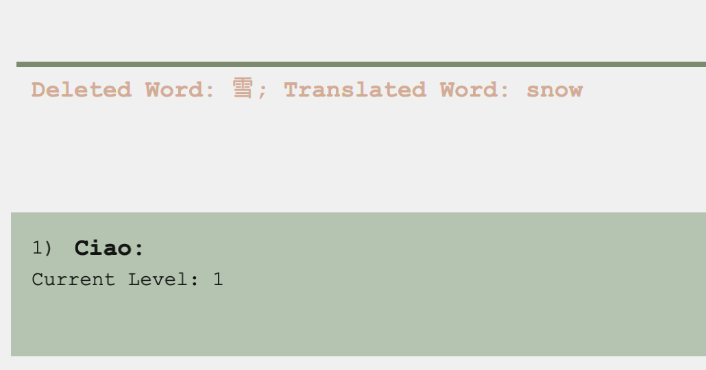
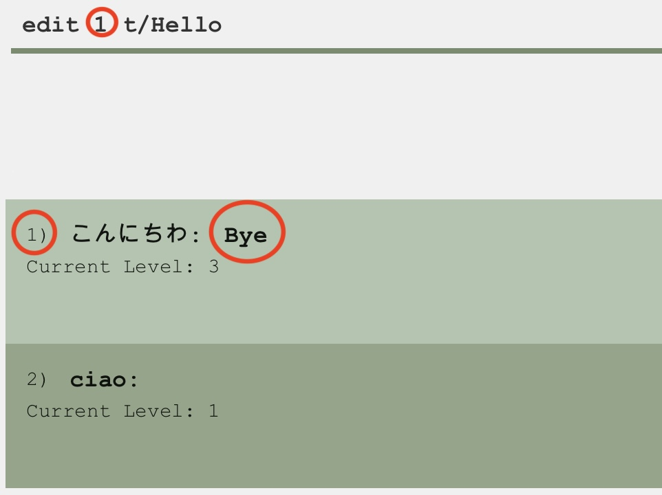
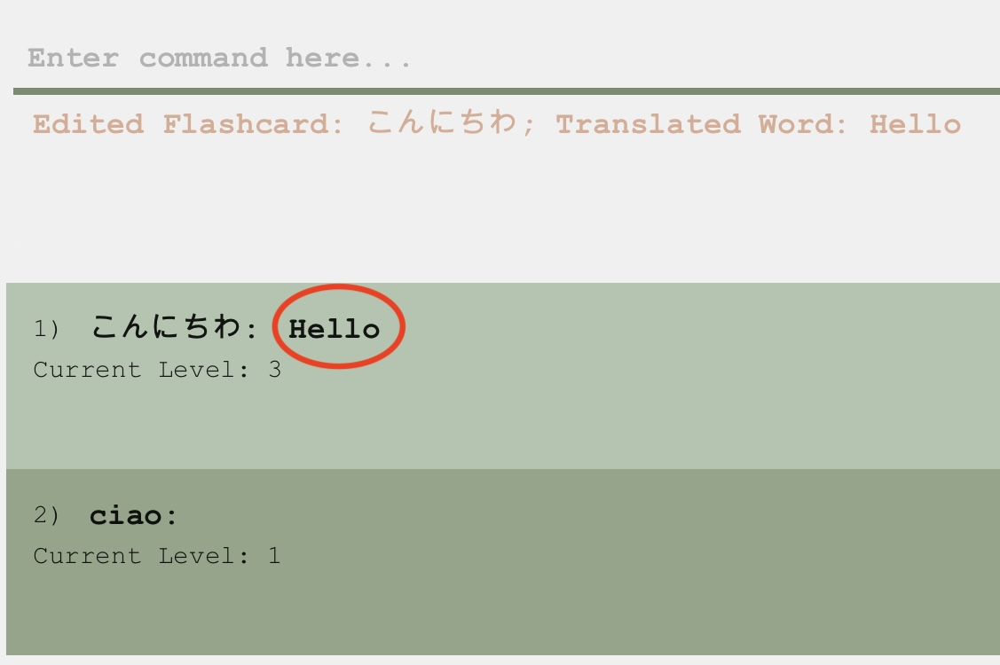
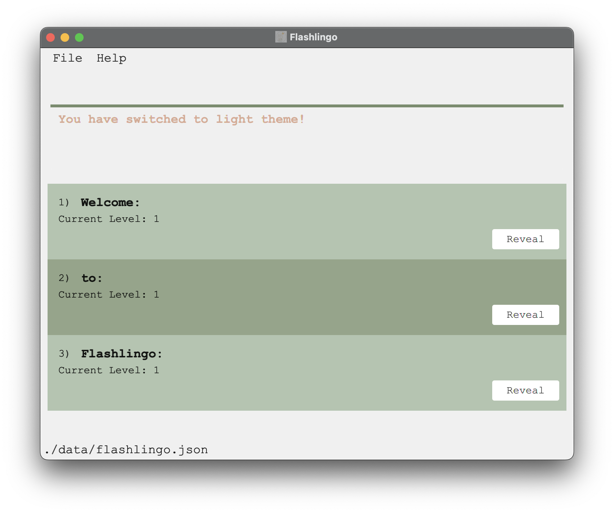
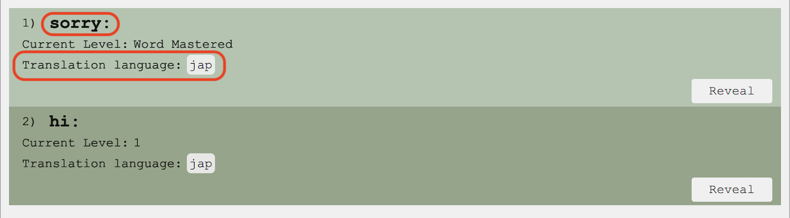

* Table of Contents
{:toc}

--------------------------------------------------------------------------------------------------------------------

## Introduction
Flashlingo is a versatile desktop application centered around learning words through flashcards. It is optimized for use via a Command Line Interface (CLI), 
while also providing the advantages of a Graphical User Interface (GUI). Tailored with a focus on beginner language 
learners, Flashlingo specializes in expanding vocabulary.

The application leverages the scientifically-proven principle of the [**Forgetting Curve**](https://en.wikipedia.org/wiki/Forgetting_curve). 
By incorporating the forgetting curve concept, Flashlingo schedules review sessions, ensuring words are revisited at 
optimal intervals to enhance long-term memory retention. This method assists users in effectively retaining and expanding their vocabulary over time.

--------------------------------------------------------------------------------------------------------------------

## Application Features
Flashlingo predominantly consists of two main features: **Managing flash cards** and **Reviewing flash cards**
- **Managing flash cards**
  - Users are given the ability to add, delete and edit flash cards. And each flashcard is assigned with a `level`, which
  indicates the proficiency of the user with the word. The level of the flashcard will be updated after each review session.
* **Reviewing flash cards**
   - In each review session, words that require reviewing will be presented to users one by one. For each word, users can indicate whether
     - they have memorized the word  
     This will advance the word into the next `level`, meaning less frequent review for the word in the near future.
     - they have forgotten the word  
        This will decrease the `level` by 1, meaning more frequent review for the word in the near future.

--------------------------------------------------------------------------------------------------------------------

## Quick start

1. Ensure you have Java `11` or above installed in your Computer.

2. Download the latest `flashlingo.jar` from [here](https://github.com/AY2324S1-CS2103T-T11-4/tp/releases) (Not finished yet).

3. Copy the file to the folder you want to use as the _home folder_ for your Flashlingo.

4. Open a command terminal, `cd` into the folder you put the jar file in, and use the `java -jar flashlingo.jar` command to run the application.
   Below shows the steps to perform such a task
    1. Open up the terminal.
    * For mac users, press `Command + Space` to open Spotlight search, type `Terminal`, and press `Enter`.
      
    * For windows users, press `Windows + R` keys simultaneously, type `cmd` and press `Enter`.
    2. Navigate to the folder containing the jar file. In this example, it is in the Downloads folder.
       <br>
       ``cd Downloads```

    3. Simply type in `java -jar flashlingo.jar` to get started!

       A GUI similar to the below should appear in a few seconds. Note how the app contains some sample data.<br>
       

### Using the application

1. Type the command in the command box and press Enter to execute it.
   

2. The image below shows the result of typing in a command. A log message will be displayed below the command box to give information about the outcome of the command.
   

3. Refer to the [Commands](#commands) below for details of each command.


--------------------------------------------------------------------------------------------------------------------

## Commands

<div markdown="block" class="alert alert-info">

**:information_source: Notes about the command format:**<br>

* Words in `<UPPER_CASE>` are the parameters to be supplied by the user.<br>
  e.g. in `delete <INDEX>`, index is a parameter which needs to be added to the command, without the <>. `delete 1` is an example of the usage.

* Words in square brackets, ie. `[<UPPER_CASE>]` indicate that the parameter is optional and can be omitted if deemed unnecessary
  e.g. in `add w/<WORD> t/<TRANSLATION> [wl/WORD_LANGUAGE] [tl/TRANSLATION_LANGUAGE]`, the `WORD` and `TRANSLATION` parameters are *MANDATORY*, whereas the `WORD_LANGUAGE` and `TRANSLATION_LANGUAGE` do not need to be in the command.
  For example, both `add w/entschuldigung wl/Deutsch t/sorry tl/English` and `add w/regarder t/look` are valid usage of the command

* If the parameters have ... as a suffix, ie. `<UPPER_CASE...>`, it means that it can take multiple parameters that are comma separated.
* Extraneous parameters for commands that do not take in parameters (such as `help`, `list`and `exit`) will be ignored.<br>
  e.g. if the command specifies `help 123`, it will be interpreted as `help`.

* If you are using a PDF version of this document, be careful when copying and pasting commands that span multiple lines as space characters surrounding line-breaks may be omitted when copied over to the application.
</div>


### Adding a flash card: `add`
:information_source: Notes about adding words:
* In order to give users full customizability, there's no any restriction on input, as long as it is not empty.

Adds a word to the flash card with its translation.
* Creates a wild flash card.
* Works to add a word with its translation in their respective languages.
* The already saved translation can be overridden with a new translation in a different language.

Format: `add w/<WORD> t/<TRANSLATION> [wl/<WORD_LANGUAGE>] [tl/<TRANSLATION_LANGUAGE>]`
> The default language for both word and translation are blank (`""`)

Examples:
* `add w/雪 t/snow` saves the translation of **雪** as **snow**
* `add w/雪 wl/Chinese t/snow tl/English` saves the translation of the **Chinese** word **雪** as an **English** word **snow**

| Words without language  |  |
|:-----------------------:|:------------------------------------------:|
| **Words with language** |     |

**Note**
* Users are not allowed to add two **exact** same flash cards
    * Same word **and** word language
    * Same translation **and** translation language
* Users can add two flash cards with the **same word and translation BUT in different language**<br>
  The following three commands can exist in the same list:
    * `add w/雪 t/snow`
    * `add w/雪 t/snow wl/Chinese tl/English`
    * `add w/雪 t/snow wl/Japanese tl/English`
> The error message:<br>
> This flash card already exists


### Deleting a flash card : `delete`

Deletes a words and its related information
* Deletes a flash card.

Format: `delete <INDEX>`

Examples:
* `delete 2` deletes the word and its translation at index 2

Output:

|  Before delete   |  |
|:----------------:|:-----------------------------------:|
| **After delete** |   |

### Editing a flash card : `edit`

Edits the word and its translation at the given index.
* Edits a wild flash card.

Format: `edit <INDEX> [w/<WORD>] [t/<TRANSLATION>] [wl/<WORD_LANGUAGE>] [tl/<TRANSLATION_LANGUAGE>]`

Examples:
* `edit 1 w/こんにちわ t/Hello` edits the translation at index 1

Output:

|  Before edit   |  |
|:--------------:|:---------------------------------:|
| **After edit** |   |

**Note**
* Users are not allowed to edit a flash card to an existing flash card
* `<INDEX>` is the index of each flash card in the `list`
* Users change at **LEAST** one certain parameter by using certain prefix
    * Word: `w/WORD`
    * Word Language: `wl/WORD_LANGUAGE`
    * Translation: `t/TRANSLATION`
    * Translation Language: `tl/TRANSLATION_LANGUAGE`
> The error message: <br>
> `This flash card already exists in Flashlingo`

### Finding a flash card : `find`

Finds words whose original word or translation contains the given keyword.
* Finds a flash card.
* The search is insensitive. e.g `look` will match `Look`

Format: `find <KEYWORDS...>`

Examples:
* `find look` returns the flash card list and its translation that contains the keyword `look`
* `find look, hello, goodbye` returns the flash card list that has all flash cards that contain `look`, `hello` and `goodbye`

### Listing all flash cards : `list`

Shows the list of flash cards with both the original word and the corresponding translation.

Format: `list`

Output:
* `Listed all flash cards`
  `1. ORIGINAL_WORD - TRANSLATION`
  `2. ORIGINAL_WORD - TRANSLATION`
  `3. ORIGINAL_WORD - TRANSLATION`
  `...`

###  Starts review session : `start`

To start a review session, user simply needs to type in `start` command.

Format: `start`

Output: `Review Session has been started.`

**Note**
* Users are not allowed to start a new review session if they are already in one. In this case,
  `Sorry, currently you are in a review session. Your command is not supported. Please end the review session first.` will be prompted.
* If there are no words to review, users will not be able to start review session. `You have no more words to review!`
  will be displayed.


### Ending the current review session : `end`

Ends the current flash card session and returns to the main menu.

Format: `end`

Output: `Review Session has ended.`

**Note**
* Users are not allowed to end a review session if the session hasn't been started yet. The message of `You are not in a review session.`
  will be given.

### Revealing the other side of the flashcard: `reveal`

To show the translation of the flash card in

Format: `reveal [<INDEX>]`

Output : `Flashcard has been revealed!`

Examples:

**Note**
* When <INDEX> is omitted, the default value is 1.
* Pressing `reveal` or `hide` button will have the same effect.

### Indicating user has memorized the word : `yes`

Marks the word as memorized and advances the word into the next retention stage. If there are still remaining words to review,
they will be automatically shown in the section below. Otherwise, review session will be closed by default.

Format: `yes`

Output: 
or

if there's no word left in the review session.

**Note**
* `yes` command will only take effect during review session. Otherwise, error message `You are not in a review session.`
  will be printed out.
* Pressing `yes` button will have the same effect.

###  Indicating user has forgotten the word : `no`

Marks the word as not grasped and leaves it in its current retention stage. If there are still remaining words to review,
they will be automatically shown in the section below. Otherwise, review session will be closed by default.

Format: `no`

Output: 
or

if there's no word left in the review session.
**Note**
* `no` command will only take effect during review session. Otherwise, error message`You are not in a review session.`
  will be printed out.
* Pressing `no` button will have the same effect.

### Show learning statistics : `stats`

Displays learning statistics, i.e, the total number of flash cards and the number of words remembered.

Format: `stats`


### Filtering list with specified language : `language`

Displays a list where each word is from specified language.

Format: `language <SPECIFIED_LANGUAGE>`

### Getting list for revision : `review`

* `review` : Returns a list of words that the user should revise today.

Format: `review`

### Loading list of words: `load`
Loads an Excel file of words into the app. The words will be added to the current list of flash cards and included in the
review session automatically.

Format: `load <FILE_NAME>`

<div markdown="block" class="alert alert-info">

**:information_source: Notes about the file input:**<br>
* **File format:** The file must be an Excel Workbook with the `.xlsx` extension.
* **File location:** The file must be located in the **same folder** as the `flashlingo.jar` file.
* **File content:** The app would only read the **first sheet** of the workbook. The sheet must contain only the following
  **two** columns:
    1. First column - The original words
    2. Second column - The translation of the words
* **Resources:** A sample file can be found [here](SampleData.xlsx).
</div>

Output:
* You have successfully loaded file: `<FILE_NAME>`: Successful loading.
* File not found or accessible:
>⚠️ Make sure the file is in the correct directory with read permission.
* File cannot be read due to invalid content or format:
>⚠️ Make sure the file contains only two columns with the nonempty words/translations.
* `FLASH_CARD` flash card already exists!:
>⚠️ Modify the duplicated word/translation in the file.

### Switching color theme : `switch`
Switches between light and dark appearance of UI dashboard.
* The theme will be saved and loaded when Flashlingo is restarted.
* Default color theme is the **light theme**.

Format: `switch`

Output:

|  light theme   |  |
|:--------------:|:---------------------------------:|
| **dark theme** |   |

### Viewing help : `help`

Opens a browser with the help page (User Guide).

Format: `help`


### Exiting the program : `exit`

Closes the GUI and terminates the Java program

Format: `exit`


### Saving the data

Flashlingo data are saved in the hard disk automatically after any command that changes the data. There is no need to save manually.

### Editing the data file

Flashlingo data are saved automatically as a JSON file `[JAR file location]/data/flashlingo.json`. Advanced users are welcome to update data directly by editing that data file.

<div markdown="span" class="alert alert-warning">:exclamation: **Caution:**
If your changes to the data file makes its format invalid, Flashlingo will discard all data and start with an empty data file at the next run. Hence, it is recommended to take a backup of the file before editing it.
</div>

--------------------------------------------------------------------------------------------------------------------

## Planned Enhancement

### Adding language tags in UI

The UI will display translation language tag of the flash cards to users. This will allow users to distinguish different languages of the translations and help them
recall the translation and verify the correctness of the translation by further entering the `reveal` command.

UI Prototype:



--------------------------------------------------------------------------------------------------------------------

## FAQ

**Q**: How do I transfer my data to another Computer?<br>
**A**: Install the app in the other computer and overwrite the empty data file it creates with the file that contains the data of your previous Flashlingo home folder.

**Q**: How can I import my data to the app?<br>
**A**: Save your words and translations in the format specified above in an Excel file. Move the file to the same folder with `flashlingo.jar`.
Then, use the `load` command to import the data.

--------------------------------------------------------------------------------------------------------------------

## Command summary

| Action                  | Format, Examples                                                                                                           |
|-------------------------|----------------------------------------------------------------------------------------------------------------------------|
| **Help**                | `help`                                                                                                                     |
| **List**                | `list`                                                                                                                     |
| **Add**                 | `add w/<WORD> t/<TRANSLATION> [wl/<WORD_LANGUAGE>] [tl/<TRANSLATION_LANGUAGE>]` <br> e.g., `add w/regarder t/look`         |
| **Delete**              | `delete <Index>`<br> e.g., `delete 1`                                                                                      |
| **Edit**                | `edit <INDEX> [w/<WORD>] [t/<TRANSLATION>] [wl/<WORD_LANGUAGE>] [tl/<TRANSLATION_LANGUAGE>]`<br> e.g., `edit 1 w/bye t/再见` |
| **Find**                | `find KEYWORD`<br> e.g., `find bye`                                                                                        |
| **Start**               | `start`                                                                                                                    |
| **Reveal**              | `reveal <INDEX>`                                                                                                           |
| **Yes**                 | `yes`                                                                                                                      |
| **No**                  | `no`                                                                                                                       |
| **End**                 | `end`                                                                                                                      |
| **Language**            | `language SPECIFIED_LANGUAGE`<br> e.g., `language French`                                                                  |
| **Review**              | `review`                                                                                                                   |
| **Learning Statistics** | `stats`                                                                                                                    |
| **Load**                | `load FILE_NAME`<br> e.g., `load SampleData.xlsx`                                                                          |
| **Switch**              | `switch`                                                                                                                   |
| **Exit**                | `exit`                                                                                                                     |

--------------------------------------------------------------------------------------------------------------------

## Glossary
| Term                                  | Definition                                                                                                                                                                                                                                                                                                                       |
|---------------------------------------|----------------------------------------------------------------------------------------------------------------------------------------------------------------------------------------------------------------------------------------------------------------------------------------------------------------------------------|
| CLI                                   | A command line interface (CLI) is a text-based interface where you can input commands that interact with a computer's operating system.                                                                                                                                                                                          |
| GUI                                   | A graphical user interface (GUI) is a digital interface in which a user interacts with graphical components such as icons, buttons, and menus.                                                                                                                                                                                   |
| JSON (JavaScript Object Notation)     | JSON is a lightweight data format commonly used for representing structured data.                                                                                                                                                                                                                                                |
| Level                                 | The level represents the proficiency with a specific flashcard.                                                                                                                                                                                                                                                                  |
| Review Session                        | A review session is a designated phase within the system where words requiring review are presented individually. Users can confirm their understanding or signal a need for further review.                                                                                                                                     |
| Forgetting Curve                      | The forgetting curve illustrates the decline in memory retention over time if information is not periodically reviewed or reinforced. It demonstrates a rapid loss of information shortly after learning, with the most significant decline in the initial hours or days. The rate of forgetting gradually decreases over time.  |
