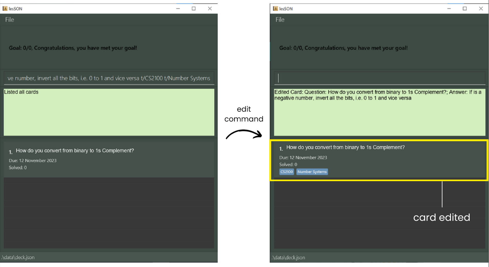

# User Guide for <span style="color: green;">lesSON</span>

## Table of Contents
1. [Introduction](#introduction)
2. [How to use the guide](#how-to-use-this-guide)
3. [Glossary](#glossary)
4. [Quick start](#quick-start)
5. [Feature list](#feature-list)
   - [Adding a FlashCard](#adding-a-flashcard-add)
   - [Deleting a Flashcard](#deleting-a-flashcard--delete)
   - [View All Flashcards](#view-all-flashcards--list)
   - [Editing a Specific Flashcard](#editing-a-specific-flashcard--edit)
   - [Practise Flashcards](#practise-flashcards-practise)
   - [Hints for Flashcards](#hints-for-flashcards-hint)
   - [Solve Flashcards](#solving-flashcards-solve)
   - [Setting Difficulty for Flashcards](#setting-difficulty-of-flashcards-set)
   - [Randomly Practise Flashcards]()
   - [Clear all Flashcards](#clear-all-flashcards-clear)
   - [Setting goals](#setting-goals-goal)
   - [Getting help](#getting-help-help)
6. [Additional Features](#additional-features)
   - [Markdown Syntax](#markdown-syntax)
   - [Importing and Exporting Decks](#importing-and-exporting-decks)
7. [FAQ](#frequently-asked-questions)
8. [Known Issues](#known-issues)
9. [Contact Us](#contact-us)

--------------------------------------------------------------------------------------------------------------------

## Introduction

#### ***Revolutionise your studying experience with <span style="color: green;">lesSON</span>!***

Welcome to the user guide for <span style="color: green;">lesSON</span>, your ultimate companion in mastering the
Computer Science curriculum at the National University of Singapore (NUS). This guide is designed to provide you with a
comprehensive understanding of the app and how to leverage its powerful features for your academic success.

#### What is lesSON?

<span style="color: green;">lesSON</span> is not just another study app; it's a game-changer in the world of education.
Tailored specifically for NUS Computer Science students, this **desktop application** enables incredibly easy creation
of flashcards for revision. It employs the efficacy of [active recall](#definitions) when you practise with the
[flashcards](#definitions) you made to increase memory retention. Say goodbye to time-consuming note-taking,
and say hello to a more efficient, effective, and enjoyable study experience.

Made with the intention to maximise your study experience, here are some features we believe you'll love:
1. **Enhanced Memory Retention:** Thanks to lesSON's inbuilt [spaced repetition](#definitions) system, you can
supercharge your memory and recall the important details needed. The app optimizes when you should review your
flashcards, ensuring you remember and grasp complex concepts with ease.
2. **Intuitive Card Categorisation:** lesSON helps you categorize your flashcards based on subject. This feature
makes it a breeze to organize and access specific topics, keeping your study sessions focused and productive.

*... and many more!*

#### Prerequisites


Before you get started with <span style="color: green;">lesSON</span>, here's what we recommend you need to make
full use of the app:

- **Comfortable with English**: Since <span style="color: green;">lesSON</span> is an English-based app, a basic
understanding of the language will ensure a smooth and enjoyable experience.
- **Typing Proficiency**: <span style="color: green;">lesSON</span> primarily uses a
[Command Line Interface (CLI)](#definitions) on top of a [Graphic User Interface (GUI)](#definitions). This means that
most of the interaction with <span style="color: green;">lesSON</span> is through the use of [keystrokes](#definitions).
Being comfortable and efficient at typing will help you make the most of the app and enhance your user experience.

[Go to Table of Contents](#table-of-contents)

### Parameter Information

The parameters used in lesSON have certain specifications. Here are some information to guide you through 
how to use them. Invalid inputs are just one of many examples of invalid inputs. Cases that do not appear in the table may also be invalid if it is not of the accepted format.

| Parameter  | Prefix | Accepted Format                                                                                                         | Valid Input                                               | Invalid Input |
|------------|--------|-------------------------------------------------------------------------------------------------------------------------|-----------------------------------------------------------|---------------|
| QUESTION   | q/     | Alphanumerical values and certain special characters.                                                                   | How many types of instruction formats are there for MIPS? | 什么            | 
| ANSWER     | a/     | Alphanumerical values and certain special characters.                                                                   | The opcode for R-format instruction is 000000.            | こんにちは         |
| TAG        | t/     | Alphanumerical values.                                                                                                  | CS2100                                                    | !factorials   |
| HINT       | h/     | Alphanumerical values, whitespace and certain special characters, i.e. !@#$%^&*(),./?";:{}[]-=_+                        | 1 + 1                                                     | 💡            |
| DIFFICULTY | d/     | Only "easy", "medium" or "hard".                                                                                        | easy                                                      | difficult     |
| INDEX      | NA     | Positive integer less than size of deck or `r` for certain cases (see [random](#randomly-practise-flashcards--random)). | 1                                                         | 0             |
| NUMBER     | NA     | Positive integer not more than 2147483647                                                                               | 1000                                                      | 2147483648    |

### Command Format

| Format                                                                                 | Details                                                                                                                                                                                        | Example                                                                                                                           |
|----------------------------------------------------------------------------------------|------------------------------------------------------------------------------------------------------------------------------------------------------------------------------------------------|-----------------------------------------------------------------------------------------------------------------------------------|
| `UPPER_CASE` words                                                                     | Field to be filed in by users. Must not be empty or only containing whitespace (except certain cases, see [edit](#editing-a-specific-flashcard--edit)).                                        | `add q/QUESTION a/ANSWER` means users need to input a question after the `q/` prefix.                                             |
| Phrases with square brackets, i.e. `[ ]`                                               | Optional parameters that can be omitted by the users.                                                                                                                                          | `add q/QUESTION a/ANSWER [h/HINT]` means users can choose to omit hints when adding a card.                                       |
| Phrases with ellipsis, i.e. `...`                                                      | Parameters that can be input repeatedly.                                                                                                                                                       | `add q/QUESTION a/ANSWER [t/TAG...]` means user can choose to add multiple tags while creating the card, each with a prefix `t/`. |
| Certain combinations of characters are not allowed, i.e characters that form a prefix. | Inputs that contain prefixes are not valid inputs.                                                                                                                                             | Having `q/`, `a/`, `t/`, `h/` or `d/` in certain input fields.                                                                    |
| Inputs are case-sensitive.                                                             | Cards with question that differ only in case will be regarded as different cards.                                                                                                              | `add q/QUESTION a/ANSWER` and `add q/question a/answer` will generate 2 different cards.                                          | 
| Parameters can be input in any order                                                   | Parameters can be reordered without having any effect on the command.                                                                                                                          | `add q/QUESTION a/ANSWER` and `add a/ANSWER q/QUESTION` are both valid inputs that generates the same card.                       |
| Commands that do not take in any parameters will disregard extraneous parameters.      | Certain commands such as `help`, `clear`, `exit`, `random` and `list` (in certain cases, see [list](#view-all-flashcards--list) for more details) will disregard any inputs after the command. | `help 123 ` or `clear a/abc` will be regarded as `help` and `clear`.                                                              |
--------------------------------------------------------------------------------------------------------------------

## How to use this guide?

### Directory
If you are a first time user, do visit our seamless onboarding process explained in the
[quick start](#quick-start) section. <br>
<br>
For beginners, we recommend familiarising yourself with the basic commands shown in our [tutorial](#tutorial)
for new users. <br>
<br>
If you are already comfortable using <span style="color: green;">lesSON</span>, do try out all of our other [features](#feature-list). <br> 
For a summary of available commands, visit [here]().

### Legend
Throughout this user guide, you will encounter some of these colored blocks highlighting some important information.

<div markdown="block" class="alert alert-success">
    💡 Green blocks contain tips to enhance your experience using lesSON.
</div>

<div markdown="block" class="alert alert-info">
    ℹ️ Blue blocks contain useful information to address doubts you might have.
</div>

<div markdown="span" class="alert alert-danger">
    ⚠️ Red blocks contain warnings that you must heed so that lesSON works as intended.
</div>

<span style="color: red;">This is red text</span>

[Go to Table of Contents](#table-of-contents)

--------------------------------------------------------------------------------------------------------------------

## Glossary

### Definitions
|             Term             | Definition                                                                                                                                                                                     |
|:----------------------------:|:-----------------------------------------------------------------------------------------------------------------------------------------------------------------------------------------------|
|        Active recall         | A popular method to strengthen memory retention by actively testing the memory to retrieve a piece of information.                                                                             |
| Command Line Interface (CLI) | A text-based interface where you interact with the software by typing commands into a terminal or command prompt, providing more direct and precise control over the system.                   |
|          Flashcard           | A card created by the user containing a question, answer (not shown) and due date.                                                                                                             |
| Graphic User Interface (GUI) | A user-friendly interface that allows you to interact with the software through visual elements like windows, icons, buttons, and menus, making it easy to navigate with a mouse and keyboard. |
|          Keystrokes          | Act of pressing a key on a computer keyboard                                                                                                                                                   |
|      Spaced repetition       | An evidence-based learning technique where newly created and more difficult flashcards are shown more frequently than older and less difficult flashcards                                      |

[Go to Table of Contents](#table-of-contents)

--------------------------------------------------------------------------------------------------------------------

## Quick Start

Get ready to embark on your productive study session with <span style="color: green;">lesSON</span>!

### Installation

1. Make sure that you have [Java 11 or above](https://www.java.com/en/download/) installed on your computer.
   - [How do I check my version of Java installed?](#check-version-of-java-installed)
   - For macOS users, follow the instructions listed [here](https://nus-cs2103-ay2324s1.github.io/website/admin/programmingLanguages.html) instead to install Java.
2. Download the latest `lesSON.jar` file from [here](https://github.com/AY2324S1-CS2103T-W17-4/tp/releases/tag/v1.3(trial)).
3. Move the jar file to a working folder where you would store all of your flashcards.
4. Launch lesSON.
   - For Windows users:
      - Open the folder where `lesSON.jar` was moved to.
      - Double-click `lesSON.jar` to start the application.
   - For macOS users,
     - Open a new Terminal window<br>
     Press <kbd>Command</kbd> + <kbd>Space</kbd> and type Terminal, then press <kbd>Enter</kbd>.
     - Navigate to the folder where you have stored the jar file using the `cd` command.
       - [Not sure how to use cd?](https://www.ibm.com/docs/en/aix/7.2?topic=directories-changing-another-directory-cd-command)
     - Type `java -jar lesSON.jar` and press <kbd>Enter</kbd>.
5. You should be able to see the GUI pop up here.
   - If you are unable to see the GUI or are stuck anywhere in the installation process, follow a more detailed set of
   instructions [here]().

### Navigating the app

<span style="color: green;">lesSON</span> uses a [Graphical User Interface (GUI)](#glossary) to display the flashcards
you have created to you. Here is a brief overview of the GUI to help you familiarise yourself with the key elements and
their locations.


Here is a summary of what each component in the GUI displays.

| Name of component | Description                                                                                                                                                |
|:-----------------:|------------------------------------------------------------------------------------------------------------------------------------------------------------|
|    Menu button    | Lists the Help, Import, Export and Exit buttons when pressed.                                                                                              |
|       Goal        | Displays the number of flashcards to practise for the session.                                                                                             |
| Command Line Box  | Interface for users to input commands.                                                                                                                     |
|    Result Box     | Displays the results of inputted command back to the user. Error messages will be shown to guide the user to the correct input if the input was incorrect. |
|       Deck        | Lists all the flashcards in a scrollable view. The deck can be filtered using commands.                                                                    |
|       Card        | Displays the key information of a flashcard such as its question, tags and index.                                                                          |
|      Footer       | Displays where the storage of flashcards is located at.                                                                                                    |

### Tutorial

This is a tutorial for **first-time** and **beginner** <span style="color: green;">lesSON</span> users. For more advanced users,
feel free to explore the other features in the [feature list](#feature-list) instead. In this tutorial, we will explain how to
*add, edit, tag, and practise* your flashcards.

1. Launch <span style="color: green;">lesSON</span>.
   - Refer to the instructions [here](#installation) if you are unsure how to launch
   <span style="color: green;">lesSON</span>.
   - Note that users who are launching <span style="color: green;">lesSON</span> for the first time will have an
   empty deck.
2. First, let's try to add your very first flashcard. Type the following command and hit <kbd>Enter</kbd>: <br>
`add q/what does + mean in boolean algebra? a/it means OR.`
3. Congratulations, you have created your first flashcard! Now, let's try to edit the card created from the
previous input by capitalising it! Note that the flashcard just created is at index `1`. Type the following command
and hit <kbd>Enter</kbd>: <br>`edit 1 q/What does + mean in boolean algebra? a/It means OR.`
4. Next, let's tag it under the module CS1231S. Type the following command and hit <kbd>Enter</kbd>:
<br>`edit 1 t/CS1231S`
5. Let's add another flashcard. Type the following command and hit <kbd>Enter</kbd>: <br>
`add q/What are the different hazards to consider when using pipelining? a/Structural, Data and Control t/CS2100`
6. Feel free to add a few more cards by following steps 1 to 4!
7. Next, to practise the first card, do: <br> `practise`
8. Try to recall the answer, and when you are ready to reveal the answer, type the following command and hit
<kbd>Enter</kbd>: <br>`solve`
9. How hard was the answer to recall? Set the difficulty of the flashcard by typing any of the following command and hit
<kbd>Enter</kbd>: <br>
`set d/easy`<br>
`set d/medium`<br>
`set d/hard`
10. The flashcard will automatically be reinserted into deck. This is based on how difficult you found the question
to be. With our inbuilt [spaced repetition](#glossary) system, as you practise, flashcards you find more difficult will
surface more at the top.
11. Note that the `practise`, `solve`, and `set` commands support indexes, but we recommended to use them without
indexes as shown in this tutorial. This is to optimise the effectiveness of the [spaced repetition](#glossary) by
testing your memory with the most difficult flashcard.
12. Get familiar with these commands and when you are ready, move on to the other commands listed [here]().

[Go to Table of Contents](#table-of-contents)

--------------------------------------------------------------------------------------------------------------------


# Feature list
## Commands
### Adding a Flashcard: `add`

Adds a flashcard to the deck for the user.

#### Format:
```
add q/QUESTION a/ANSWER [t/TAG...] [h/HINT]
```

#### Examples:

_A flashcard with only a question and answer field._
```
add q/What are the three ways to implement binary systems? a/1s Complement, 2s Complement, and Sign and Magnitude
```
_A flashcard with a question, answer and tag field._
```
add q/How do you convert from binary to 1s Complement? a/By inverting all the bits, i.e. 0 to 1 and vice versa t/CS2100 t/Number Systems
```
_A flashcard with a question, answer, tag and hint field._
```
add q/What are the 5 stages of MIPS? a/Fetch, Decode, Execute, Memory, Write Back t/CS2100 h/5 stages: IF, ID, EX, MEM, WB
```

#### To Note:
1. Tagging is not supported in v1.2 and earlier.
2. Hint is not supported before v1.3.

#### Expected Output:

1. User Input:
   ```
   add q/opcode for R format instructions a/000000 t/CS2100 t/MIPS
   ```

2. Successful Output
   1. Result box displays: `New Card added: Question: opcode for R format instructions; Answer: 000000`
   2. The corresponding card with the **question**, **due date**, **solve count** and **tags** is created and added to the deck.


### Deleting a Flashcard : `delete`
Deletes a flashcard in the deck

#### Format:
```
delete INDEX
```

#### Examples:
_Deleting the card in the deck with an index of 2._
```
delete 2
```

#### Expected Outputs:
1. User Input: 
   ```
   add q/opcode for R format instructions a/000000 t/CS2100 t/MIPS
   delete 1
   ```

2. Successful Output
   1. Result box displays: `Deleted Card: Question: opcode for R format instructions; Answer: 000000`
   2. The corresponding card is deleted from the deck.


### View All Flashcards : `list`
Shows a list of all flashcards in the deck. A keyword may be specified to filter out the list.

#### Format: 
```
list [q/QUESTION] [t/TAG...]
```
### Examples:
_List full deck of flashcards._
```
list
```
_List all flashcards with question starting with "What"._
```
list q/What
```
_List all flashcards with the CS2100 Tag._
```
list t/CS2100
```

#### To note:
1. Any extraneous parameters not `q/` and `t/` will be ignored, i.e. `list 12345` or `list a/000000` will be regarded as `list`.
2. Listing questions with markdown syntax should include their relevant markdown notation.

#### Expected output:
1. User Input:
   ```
   add q/What are the three ways to implement binary systems? a/1s Complement, 2s Complement, and Sign and Magnitude
   add q/How do you convert from binary to 1s Complement? a/By inverting all the bits, i.e. 0 to 1 and vice versa t/CS2100 t/Number Systems
   add q/What are the 5 stages of MIPS? a/Fetch, Decode, Execute, Memory, Write Back t/CS2100 h/5 stages: IF, ID, EX, MEM, WB 
   list t/CS2100
   ```

2. Successful Output
   1. Result box displays: `All cards listed`
   2. The corresponding cards matching the keyword and tags is displayed.


### Editing a Specific Flashcard : `edit`
Edits an existing Flashcard in the deck.

#### Format:
```
edit INDEX [q/QUESTION] [a/ANSWER] [t/TAG...] [h/HINT]
```

#### Examples:
_Change the question at index 1 to "What is the colour of the sun?"._
```
edit 1 q/What is the colour of the sun?
```
_Change the answer at index 1 to "Red"._
```
edit 1 a/Red
```
_Change the tag at index 1 to "Weather" and "Geography"._
```
edit 1 t/Weather t/Geogaphy
```
_Change the hint at index 1 to "Apple"._
```
edit 1 h/Apple
```

#### To Note:
1. There must be at least one optional parameter included for the command input.
2. Empty input after `t/` and `h/` will remove existing tags or hint respectively.
3. Tagging is not supported in v1.2 and earlier.
4. Hint is not supported before v1.3.

#### Expected output:
1. User Input:
   ```
   add q/How do you convert from binary to 1s Complement? a/By inverting all the bits, i.e. 0 to 1 and vice versa 
   edit 1 a/If is a negative number, invert all the bits, i.e. 0 to 1 and vice versa t/CS2100 t/Number Systems
   ```

2. Successful Output
    1. Result box displays: `Edited Card: Question: How do you you convert from binary to 1s Complement?; Answer: If is a negative number, invert all the bits, i.e. 0 to 1 and vice versa`
    2. The corresponding card in the deck will be updated.
       

### Practise Flashcards: `practise`
Practise a single Flashcard in the deck

#### Format:
```
practise [INDEX]
```

#### Examples:
_Practising the card in the deck with an index of 2._
```
practise 2
```

#### To Note:
1. If user omits INDEX in the command input, the first card in the deck will be practised.

#### Expected outputs:
1. User Input
   ```
   add q/opcode for R format instructions a/000000 t/CS2100 t/MIPS
   practise
   ```
2. Successful Output
   1. Result box displays: `Practising Question 1 : opcode for R format instructions`
   

### Hints for Flashcards: `hint`
See the hint for a question at the given index

Format: 
```
hint INDEX
```

#### Examples:
_Hint the card in the deck with an index of 3._
```
hint 3
```

#### Expected outputs:
1. User Input
   ```
   add q/opcode for R format instructions a/000000 t/CS2100 t/MIPS h/Zeros
   hint 1
   ```
2. Successful Output
   1. Result box displays: `Hint for Question 1: Zeros`
   
   

### Solving Flashcards: `solve`
Solves the question at the given index

Format: 
```
solve [INDEX]
```

#### Examples:
_Solve the card in the deck with an index of 2._
```
solve 2
```

#### To Note:
1. If user omits INDEX in the command input, the first card in the deck will be solved.

#### Expected outputs:
1. User Input
   ```
   add q/opcode for R format instructions a/000000 t/CS2100 t/MIPS h/Zeros
   solve
   ```

2. Successful Output
   1. Result box displays: `Solved Question 1: opcode for R format instructions Answer: 000000`
   2. Solve count of the card gets updated.
   


### Setting Difficulty of Flashcards: `set`
Setting the difficulty of a flashcard, based on the user.

Format: 
```
set [INDEX] d/DIFFICULTY
```

#### Example:
_Set the first card as easy_
```
set 1 d/easy
```

#### To Note:
1. If user omits INDEX in the command input, the first card in the deck will be set.

#### Expected outputs:
1. User Input
   ```
   add q/opcode for R format instructions a/000000 t/CS2100 t/MIPS h/Zeros
   set d/easy
   ```

2. Successful Output
   1. Result box displays: `Set Difficulty for Question 1 (Difficulty level: EASY)`
   2. Due date of the card updated.
   

### Randomly Practise Flashcards: `random`
Practise a single random Flashcard in the deck.

#### Format: 
```
random
```

#### Examples:
_Practise a random card._
```
random
```

#### To Note:
1. Users can choose to note the index of question and solve and set based on the index. Alternatively, users can also use `r` as the index.

#### Expected outputs:
1. User Input
   ```
   add q/How do you convert from binary to 1s Complement? a/By inverting all the bits, i.e. 0 to 1 and vice versa t/CS2100 t/Number Systems
   add q/What are the 5 stages of MIPS? a/Fetch, Decode, Execute, Memory, Write Back t/CS2100 h/5 stages: IF, ID, EX, MEM, WB
   random
   ```
2. Successful Output (assuming random chooses the card at index 2)
   1. Result box displays: `Practising Question 2 : What are the 5 stages of MIPS?`
      

### Clear all flashcards: `clear`
Clears all flashcards found in the Deck. Deck is reset back to empty.

#### Format: 
```
clear
```

#### Example:
_Delete all flashcards from the deck._
```
clear
```

#### Expected outputs:
1. User Input
   ```
   add q/How do you convert from binary to 1s Complement? a/By inverting all the bits, i.e. 0 to 1 and vice versa t/CS2100 t/Number Systems
   clear
   ```
2. Successful Output
   1. Result box displays: `Deck has been cleared!`
      

### Setting goals: `goal`
Set a goal for the current studying session.

#### Format:
```
goal NUMBER
```

#### Example:
_Set a goal of 5 for this session._
```
goal 5
```

#### To Note:
1. On initialisation of lesSON, the target of the goal will be the size of the deck and the number of cards solved will be 0.

#### Expected outputs:
1. User Input
   ```
   goal 10
   ```
2. Successful Output
   1. Result box displays: `New goal set.`
   2. Goal box updated with new target and goal completion status.
      

      
### Getting help: `help`
Seek more details from a link provided leading to the User Guide.
Users can also access this function by clicking on the **File** button located at the top
left of the application, and then navigating to the **Help** tab.

#### Format: 
```
help
```

#### Example:
_Open help window._
```
help
```


#### Expected outputs:
1. User Input
   ```
   help
   ```
2. Successful Output
   1. Result box displays: `Opened help window.`
   2. Popup window with link ot User Guide is generated.
      

### Exiting lesSON: `exit`
Exits and closes the lesSON application.

#### Format:
```
exit
```

#### Example:
_Closes lesSON._
```
exit
```

#### Expected outputs:
1. User Input
   ```
   exit
   ```
2. Successful Output
   1. lesSON closes.
--------------------------------------------------------------------------------------------------------------------

## Additional Features

### MarkDown Syntax

For user who wish to incorporate styling in lesSON, there are 3 font styles currently supported:
1. Bold
2. Italic
3. Underline

#### Bold
To bold a line of text, wrap text with `**`


#### Example:
_Bolding a phrase in the question_
```
edit 1 q/How many bits can a **Half Adder** add up
```

#### Expected Result:
1. User Input
   ```
   add q/What is the **Stage** where calculations are operated? a/ALU
   ```
2. Successful Output
   1. Result box displays: `New Card added: Question: What is the Stage where calculations are operated?; Answer: ALU`
   2. The corresponding card with the **question**, **due date**, **solve count** and **tags** is created and added to the deck.
   3. `Stage` will appear bolded in both instances.


#### Italic
To italicise a line of text, wrap text with `*`

#### Example:
_Italicising a phrase in the question_
```
edit 1 q/How many bits can a *Half Adder* add up
```
#### Expected Result:
1. User Input
   ```
   add q/What is the *Stage* where calculations are operated? a/ALU
   ```
2. Successful Output
   1. Result box displays: `New Card added: Question: What is the Stage where calculations are operated?; Answer: ALU`
   2. The corresponding card with the **question**, **due date**, **solve count** and **tags** is created and added to the deck.
   3. `Stage` will appear italicised in both instances.
      

#### Underline
To underline a line of text, insert `<u>` at the beginning of the text,
and end with `</u>` at the end of the underlined text.

#### Example:
_Underlining a phrase in the question_
```
edit 1 q/How many bits can a <u>Half Adder</u> add up
```
#### Expected Result:
1. User Input
   ```
   add q/What is the <u>Stage</u> where calculations are operated? a/ALU
   ```
2. Successful Output
   1. Result box displays: `New Card added: Question: What is the Stage where calculations are operated?; Answer: ALU`
   2. The corresponding card with the **question**, **due date**, **solve count** and **tags** is created and added to the deck.
   3. `Stage` will appear underlined in both instances.
      


### To Note:
1. Do not stack MarkDown Syntax. This may lead to unexpected behavior of text in the display view. 
2. Do ensure that the phrase intended for styling is wrapped within an open and close syntax of the same type, i.e. `**bold**` for bold `*italics*` for italics and `<u>underline</u>` for underline. 
3. In the case when unexpected MarkDown format is observed, edit the flashcard again with the without the MarkDown syntax/with appropriate syntaxes.

# Importing and Exporting Decks

<div markdown="block" class="alert alert-info">

**:information_source: Notes about Export and Import**<br>

The import and export functions are meant to be used before and after revision respectively <br>

They are not to be confused as commands input by user, but rather as a method to transfer and import data easily <br>

</div>

Users can share their own Decks with others or download their Decks to their own.
Both import and export features reside in the **File** menu.

### Export
Users can share their own Deck by clicking on the `Export` button. Their own Deck
will be displayed as a JSON file which can be easily copied either through the `Copy Data`
button provided or other means.

### Import
Users can enjoy the Decks of others by clicking on the `Import` button. A text field
is displayed for users to paste in the JSON file containing the decks of others. The
app will close upon clicking the `Import Data` button. Users will have to rerun the app
to see their new decks.

### Caution
All data is saved as a JSON file at this specified path: [JAR file location]/data/deck.json. <br>
It is **NOT** recommended for users to modify data directly as it can cause the app to malfunction. <br>
If you still wish to proceed with modifying the data directly, lesSON would not be held accountable of the risks of such actions.

--------------------------------------------------------------------------------------------------------------------

## Frequently Asked Questions (FAQ)

### Check version of Java installed

**Q:** How do I check my version of Java I have installed on my computer? <br>
**A:** Open up a command prompt and type `java -version` and hit <kbd>Enter</kbd>.

Shortcut to open the command prompt:
- For Windows: Press <kbd>Windows</kbd> + <kbd>R</kbd> and enter `cmd`.
- For macOS: Press <kbd>Command</kbd> + <kbd>Space</kbd> and enter `Terminal`.

### App not showing

**Q:** The application is running fine, but I am unable to see the [GUI](#definitions). What should I do? <br>
**A:** This is a currently [known issue](#known-issues) with a temporary hotfix. We are working on a solution.

[Go to Table of Contents](#table-of-contents)

--------------------------------------------------------------------------------------------------------------------

## Known Issues

1. As of v1.4, users can create duplicate tags for the same flashcard. We plan to enforce uniqueness of tags for a
flashcard in future enhancements. Until then, please do take caution to avoid adding duplicate tags for the same
flashcard.
2. As of v1.4, the app may not show for users with multiple displays. If you relocate the app to a secondary display and
subsequently cease using the secondary display, the app will continue to run but will no longer be visible on your
primary display. Closing the app and re-running it will not solve the issue. We are working on a solution but until then,
we recommend relocating the app back to your main display before disconnecting your secondary display.

If you encountered any other bugs or errors, do let us know with the relevant details (e.g. screenshots) via our
official channels found [here](#contact-us).

[Go to Table of Contents](#table-of-contents)

--------------------------------------------------------------------------------------------------------------------

## Contact Us

For any feedback or relevant queries, do contact us via our [official channels](https://ay2324s1-cs2103t-w17-4.github.io/tp/AboutUs.html).

[Go to Table of Contents](#table-of-contents)

--------------------------------------------------------------------------------------------------------------------

<p style="text-align: center;">— End of User Guide —</p>
