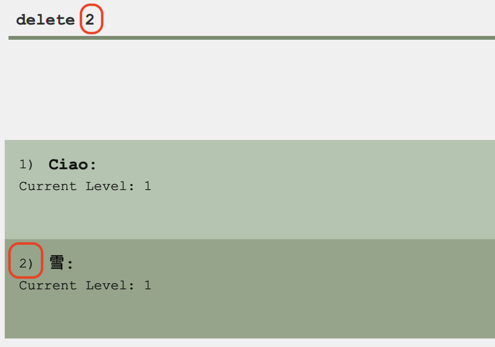
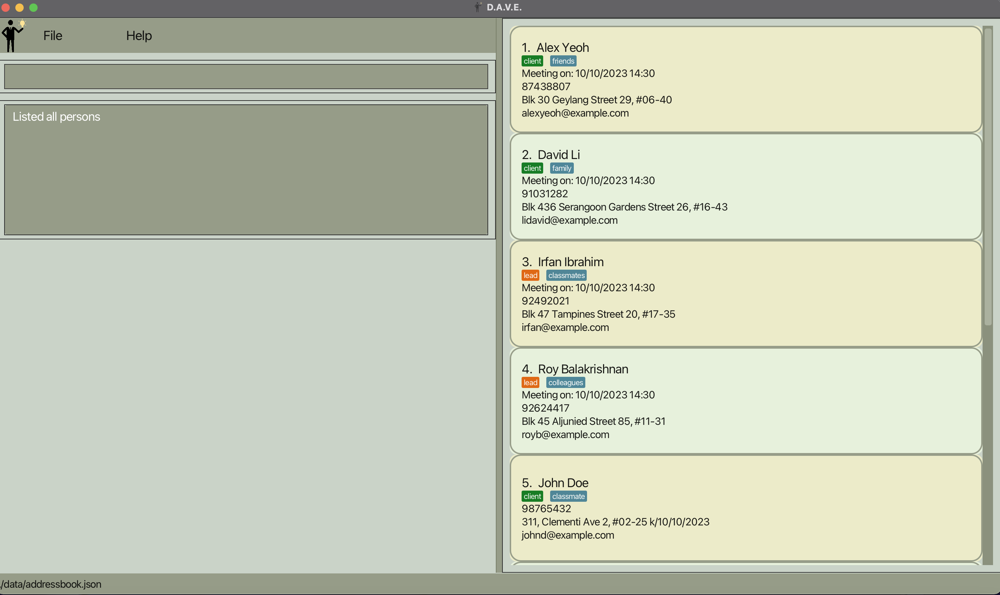
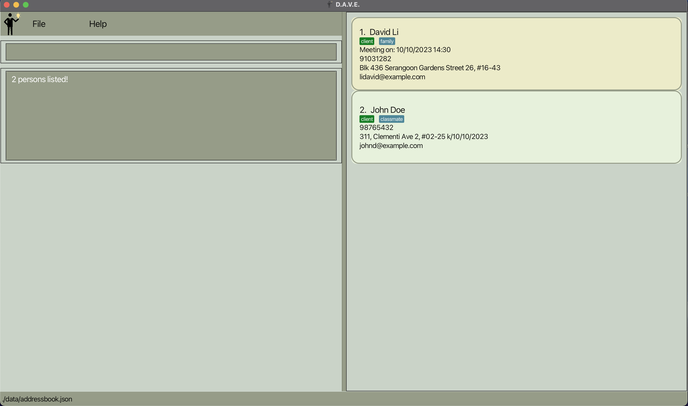
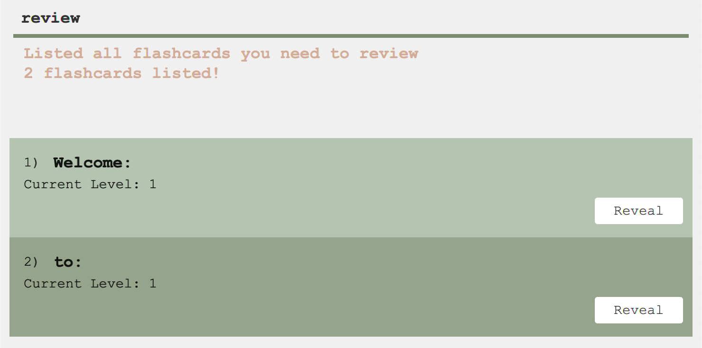
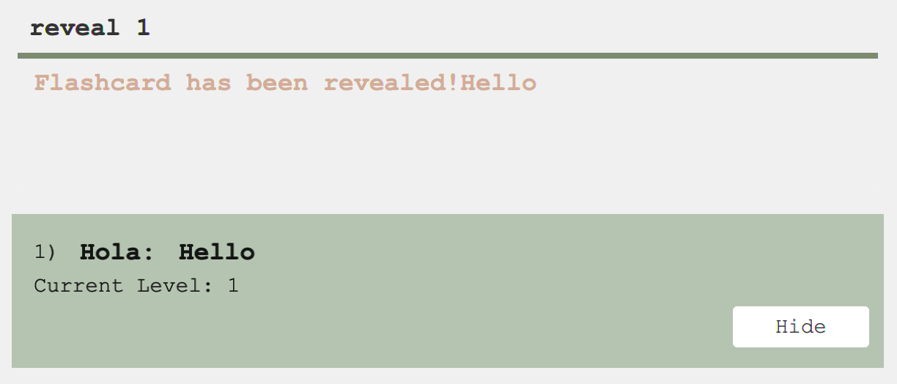
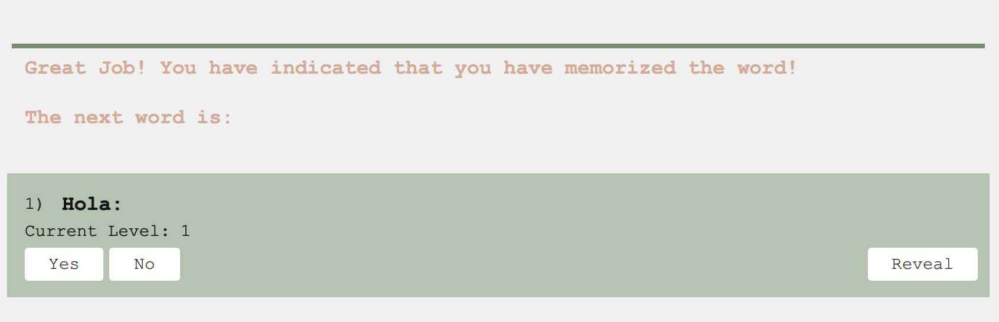
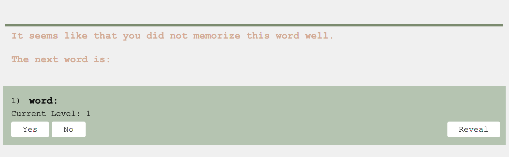

* Table of Contents
{:toc}

--------------------------------------------------------------------------------------------------------------------

## Introduction
Flashlingo is a versatile desktop application centered around learning words through flashcards. It is optimized for use via a **Command Line Interface** (CLI),
while also providing the advantages of a **Graphical User Interface** (GUI). Tailored with a focus on **beginner language
learners** with [to be discussed] proficiency in command line, Flashlingo specializes in expanding vocabulary. If you are not familiar with the command line interface (CLI), you can refer to the [**Glossary**](#glossary) section below,
and the [**Command Summary**](#command-summary) section for a quick overview of the commands.


The application leverages the scientifically-proven principle of the [**Forgetting Curve**](https://en.wikipedia.org/wiki/Forgetting_curve).
By incorporating the forgetting curve concept, Flashlingo schedules review sessions, ensuring words are revisited at
optimal intervals to enhance long-term memory retention. This method assists users in effectively retaining and expanding their vocabulary over time.

--------------------------------------------------------------------------------------------------------------------

## Application Features
Flashlingo predominantly consists of two main features: **Managing flash cards** and **Reviewing flash cards**
- **Managing flash cards**
  - Users are given the ability to add, delete and edit flash cards. And each flashcard is assigned with a `level`, which
  indicates the proficiency of the user with the word. The level of the flashcard will be updated after each review session.
* **Reviewing flash cards**
   - In each review session, words that require reviewing will be presented to users one by one. For each word, users can indicate whether
     - they have memorized the word
     <br>
     This will advance the word into the next `level`, meaning less frequent review for the word in the near future.
     - they have forgotten the word
     <br>
        This will decrease the `level` by 1, meaning more frequent review for the word in the near future.

<div markdown="block" class="alert alert-info">

**:information_source: Notes about the level:**<br>

* The higher the `Level` is, the higher the proficiency of the user with the word is. The maximum level is 5, and it will be displayed as `word mastered`.

* Words which are indicated as `word mastered` will not appear in review session.

</div>

--------------------------------------------------------------------------------------------------------------------

## Quick start

1. Ensure you have Java `11` or above installed in your Computer.

2. Download the latest `flashlingo.jar` from [here](https://github.com/AY2324S1-CS2103T-T11-4/tp/releases) (Not finished yet).

3. Copy the file to the folder you want to use as the _home folder_ for your Flashlingo.

4. Open a command terminal, `cd` into the folder you put the jar file in, and use the `java -jar flashlingo.jar` command to run the application.
   Below shows the steps to perform such a task
    1. Open up the terminal.
    * For mac users, press `Command + Space` to open Spotlight search, type `Terminal`, and press `Enter`.
      
    * For windows users, press `Windows + R` keys simultaneously, type `cmd` and press `Enter`.
    2. Navigate to the folder containing the jar file. In this example, it is in the Downloads folder. So the command is:
       <br>
       ```cd Downloads```
       <br>
       >Click [here](https://en.wikipedia.org/wiki/Cd_(command)) for more information on how to navigate to a folder in the terminal.
    3. Simply type in `java -jar flashlingo.jar` to get started!

       A GUI similar to the below should appear in a few seconds. Note how the app contains some sample data.<br>
       

### Using the application

1. Type the command in the command box and press Enter to execute it.
   

2. The image below shows the result of typing in a command. A log message will be displayed below the command box to give information about the outcome of the command.
   

3. Refer to the [Commands](#commands) below for details of each command.


--------------------------------------------------------------------------------------------------------------------

## Commands

<div markdown="block" class="alert alert-info">

**:information_source: Notes about the command format:**<br>

| Notation         | Description                                                   | Example Command                                                 | Example Usage               |
|------------------|---------------------------------------------------------------|-----------------------------------------------------------------|-----------------------------|
| `<PARAMETER>`    | Parameter to be supplied by the user                          | `delete <INDEX>`                                                | `delete 1`                  |
| `[<OPTIONAL>]`   | Indicates an optional parameter                               | `add w/<WORD> t/<TRANSLATION> [wl/WORD_LANG] [tl/TRANSLATION_LANG]` | `add w/Hello t/你好`          |
 | `<PARAMETER...>` | Commands that can take in multiple comma seperated parameters | `find <KEYWORD...>`                                             | `find hello`                |
| `...`            | Parameter that will not be used                               | `help ...`                                                      | `help 123` is the same as `help` |

</div>


| :warning: Commands Supported Only Outside Review Session                                                                             | :warning: Commands Supported Only Inside Review Session |
|--------------------------------------------------------------------------------------------------------------------------------------|---------------------------------------------------------|
| `add` <br> `delete` <br> `edit` <br> `find` <br> `start` <br> `list` <br> `load` <br> `language` <br> `review` <br> `stats`          | `yes` <br> `no` <br> `end`                              |
| *Error Message:* `Sorry, currently you are in a review session. Your command is not supported. Please end the review session first.` | *Error Message:* `You are not in a review session.`     |


### Adding a flash card: `add`

<div markdown="block" class="alert alert-info">

:information_source: Notes about adding words:
* In order to give users full customizability, there's no any restriction on input, as long as it is not empty.

</div>

Adds a word to the flash card with its translation.
* Creates a wild flash card.
* Works to add a word with its translation in their respective languages.
* The already saved translation can be overridden with a new translation in a different language.

[Command Format](#commands): `add w/<WORD> t/<TRANSLATION> [wl/<WORD_LANGUAGE>] [tl/<TRANSLATION_LANGUAGE>]`
> The default language for both word and translation are blank (`""`)

Examples:
* `add w/雪 t/snow` saves the translation of **雪** as **snow**
* `add w/雪 wl/Chinese t/snow tl/English` saves the translation of the **Chinese** word **雪** as an **English** word **snow**

| Words without language  |  |
|:-----------------------:|:------------------------------------------:|
| **Words with language** |     |

**Note**
* Flash cards are case-insensitive. The following commands are the same:
  * `add w/CIAO t/hello/bye`
  * `add w/ciao t/HELLO/BYE`
* Users can add two flash cards with the **same word and translation BUT in different language**<br>
  The following three commands will not cause duplicate error:
    * `add w/雪 t/snow`
    * `add w/雪 t/snow wl/Chinese tl/English`
    * `add w/雪 t/snow wl/Japanese tl/English`
* Users are allowed to add a flash card with the **empty word language or translation language**<br>
> Users do not need to specify the language if the language is blank (`""`)
* Users are **not allowed** to add a flash card with the **same word and translation**<br>
  The following command will cause duplicate error:
    * `add w/sorry t/sorry`
    * `add w/sorry t/SORRY`
* Users are **not allowed** to add a flash card with the **empty word or translation**<br>


### Deleting a flash card : `delete`

Deletes a words and its related information
* Deletes a flash card.

[Command Format](#commands): `delete <INDEX>`

Examples:
* `delete 2` deletes the word and its translation at index 2

Output:

|  Before delete   |  |
|:----------------:|:-----------------------------------:|
| **After delete** |   |

### Editing a flash card : `edit`

Edits the specified flash card at the given index.

[Command Format](#commands): `edit <INDEX> [w/<WORD>] [t/<TRANSLATION>] [wl/<WORD_LANGUAGE>] [tl/<TRANSLATION_LANGUAGE>]`

Examples:
* `edit 1 w/こんにちわ t/Hello` edits the translation at index 1

Output:

|  Before edit   |  |
|:--------------:|:---------------------------------:|
| **After edit** |   |

**Note**
* Users are not allowed to edit a flash card to an existing flash card
* `<INDEX>` is the index of each flash card in the `list`
* Users change at **LEAST** one certain parameter by using certain prefix
    * Word: `w/WORD`
    * Word Language: `wl/WORD_LANGUAGE`
    * Translation: `t/TRANSLATION`
    * Translation Language: `tl/TRANSLATION_LANGUAGE`
> The error message: <br>
> `This flash card already exists in Flashlingo`

### Listing all flash cards : `list`

Shows the list of flash cards with both the original word and the corresponding translation.
* Lists all the flash cards saved

[Command Format](#commands): `list ...`
> All the saved flash cards, regardless of the review date, are listed.

Output:

| Outside the review session |  |
|:-----------------------:|:------------------------------------------:|
| **During the review session** |  |


**Note:**
* `list` command cannot be used during a review session
   * To ensure retention, only the flash cards - with the words to be reviewed - can be seen during the review session.
   * As soon as the review session ends, all the flash cards can be listed once again
> The error message:<br>
> Sorry, currently you are in a review session. Your command is not supported.<br>
> Please end the review session first.

### Finding a flash card : `find`

Filters the flash card list by the given keywords. All the flash cards whose word or translation contains the keywords will be displayed.
* The search is case-insensitive. e.g `food` will match `Food`
* Users can search for specific substring. e.g `oo` will match `food`

[Command Format](#commands): `find <KEYWORDS>`

Examples:
* `find food` returns the flash card list and its translation that contains the keyword `food`
* `find oo` returns the flash card list and its translation that contains the substring `oo`

Output:

|  Before find   |  |
|:--------------:|:---------------------------------:|
| **After find** |   |

### Filtering list with specified language : `language`

Filter the list of flash cards by the specified language. All the flash cards whose word or translation is in the specified language will be displayed.
* The search is case-insensitive. e.g `french` will match `French`

[Command Format](#commands): `language <SPECIFIED_LANGUAGE>`

Examples:
* `language French` displays a list where each word or translation is from French language.

**Note:**
* Unlike the `find` command, the `language` command uses exact search. So it will not display the flash cards whose word or translation contains the specified language as a substring or keyword.
    * e.g. `language Chinese` will not display following flash cards:
        * `w/读书 t/read book wl/简体中文 tl/English`
        * `w/讀書 t/I wl/Traditional Chinses tl/English`
* `language` without any parameter will display all the flash cards with default language `""`.

### Getting list for revision : `review`

Displays the flash cards of all the words to be reviewed that day
* The review command will present flash cards selected by Flash Lingo based on your level, utilizing the Leitner system.
* If you wish to view all your saved flash cards without the [Leitner system's](https://en.wikipedia.org/wiki/Leitner_system#) selection criteria, please use the `list` command.

[Command Format](#commands): `review ...`

Output:


**Note:**
* The message `0 flash card(s) listed!` occurs when:
    * There are no flash cards scheduled for today's review.
    

###  Starts review session : `start`

Starts a new review session.

[Command Format](#commands): `start ...`

Output: `Review Session has been started.`

**Note**
* If there are no words to review, users will not be able to start review session. `You have no more words to review!`
  will be displayed.


### Ending the current review session : `end`

Ends the current review session and returns to the main menu.

[Command Format](#commands): `end ...`

Output: `Review Session has ended.`

### Revealing the other side of the flashcard: `reveal`

To show the translation of the flash card in

[Command Format](#commands): `reveal [<INDEX>]`

Output : `Flashcard has been revealed!`

Examples:

**Note**
* When <INDEX> is omitted, the default value is 1.
* Pressing `reveal` or `hide` button will have the same effect.

### Indicating user has memorized the word : `yes`

Marks the word as memorized and advances the word into the next level. If there are still remaining words to review,
they will be automatically shown in the section below. Otherwise, review session will be closed by default.

[Command Format](#commands): `yes ...`

Output: 

**Note**
* Pressing `yes` button will have the same effect.

###  Indicating user has forgotten the word : `no`

Marks the word as not grasped and leaves it in its current retention stage. If there are still remaining words to review,
they will be automatically shown in the section below. Otherwise, review session will be closed by default.

[Command Format](#commands): `no ...`

Output: 

if there's no word left in the review session.
**Note**
* Pressing `no` button will have the same effect.

### Show learning statistics : `stats`

To help track user progress and inspire continued learning, this command offers detailed statistics:
* Total Flash Cards: Displays the total count of flash cards you have saved.
* Remembered Words: Shows the number of terms you have successfully retained in this session.
* Success Rate: Presents a percentage representing your learning success for this session, motivating you to keep improving.

[Command Format](#commands): `stats ...`

Output:


**Note:**
* The success rate is calculated solely on the basis of the current session.

<div id="load">

### Loading list of words: `load`
Loads an Excel file of words into the app. The words will be added to the current list of flash cards and included in the
review session automatically.
</div>

[Command Format](#commands): `load <FILE_NAME>`

<div markdown="block" class="alert alert-info">

**:information_source: Notes about the file input:**<br>
* **File format:** The file must be an Excel Workbook with the `.xlsx` extension.
* **File location:** The file must be located in the **same folder** as the `flashlingo.jar` file.
* **File content:** The app would only read the **first sheet** of the workbook. The sheet must contain only the following
  **two** columns:
    1. First column - The original words
    2. Second column - The translation of the words
* **Resources:** A sample file can be found [here](SampleData.xlsx).
</div>

Output:
* You have successfully loaded file: `<FILE_NAME>`: Successful loading.
* File not found or accessible:
> ⚠️ Make sure the file is in the correct directory with read permission.
* File cannot be read due to invalid content or format:
>⚠️ Make sure the file contains only two columns with the valid words/translations.
* `FLASH_CARD` flash card already exists!:
>⚠️ Modify the duplicated word/translation in the file.

### Switching color theme : `switch`
Switches between light and dark appearance of UI dashboard.
* The theme will be saved and loaded when Flashlingo is restarted.
* Default color theme is the **light theme**.

[Command Format](#commands): `switch ...`

Output:

|  light theme   |  |
|:--------------:|:---------------------------------:|
| **dark theme** |   |

### Viewing help : `help`

Opens a browser with the help page (User Guide). Pressing the `Help` button and then clicking `Help F1` will achieve the same effect.

[Command Format](#commands): `help ...`

### Exiting the program : `exit`

Safely terminates the Flashlingo application and closes the graphical user interface (GUI).

[Command Format](#commands): `exit ...`

Example:
* Input `exit` to end your session and close the application


### Saving the data

Flashlingo data are saved in the hard disk automatically after any command that changes the data. There is no need to save manually.

### Editing the data file

Flashlingo data are saved automatically as a JSON file `[JAR file location]/data/flashlingo.json`. Advanced users are welcome to update data directly by editing that data file.

<div markdown="span" class="alert alert-warning">:exclamation: **Caution:**
If your changes to the data file makes its format invalid, Flashlingo will discard all data and start with an empty data file at the next run. Hence, it is recommended to take a backup of the file before editing it.
</div>

--------------------------------------------------------------------------------------------------------------------

## FAQ

**Q**: How do I transfer my data to another Computer?<br>
**A**: Install the app in the other computer and overwrite the empty data file it creates with the file that contains the data of your previous Flashlingo home folder.

**Q**: How can I import my data to the app?<br>
**A**: Save your words and translations in the format specified above in an Excel file. Move the file to the same folder with `flashlingo.jar`.
Then, use the `load` command to import the data.

**Q**: What may be the reasons why my data cannot be loaded into the app?<br>
**A**: 
* First, check your file name by opening the located folder. The file name should be directly displayed. Also, you can right-click the file to view the file name in its detailed info.
* If Flashlingo still cannot read the file, try inputting file name with and without the extension `.xlsx` in the `load` command. This may solve potential issues with file name loading within different systems.
* Secondly, ensure the content in your file is correctly formatted and valid. All rules can be found [here](#load).

**Q**: After I reviewed a flash card, I edited details of the card by the `edit` command. Will I see these changes immediately reflected in the review session?<br>
**A**:
* Unfortunately, no. The card is updated synchronously in the card list and the review session of Flashlingo. However, since the user has already reviewed the same card on the day, the card will not be included in the review session again.
* To see the edits made, User can use the `list` or `find` command to locate the specific card in the card list. The changes will also be reflected in the next review session for that flash card.

**Q**: If the displayed level of a flash card is "Word Mastered", what can I do if I want to review the card again?<br>
**A**:
* Currently, there's no way for user to manually change the level of a flash card. Flashlingo is designed to automatically remove words that learners are familiar with from the review session.
* However, if user must review the card, he/she can first use the `delete` command to delete the card and then use the `add` command to re-add the same card. The new card will be reset to level 1 and added in the review session.

--------------------------------------------------------------------------------------------------------------------

## Command summary

| Action                  | Format, Examples                                                                                                           | Supported Period       |
|-------------------------|----------------------------------------------------------------------------------------------------------------------------|------------------------|
| **Add**                 | `add w/<WORD> t/<TRANSLATION> [wl/<WORD_LANGUAGE>] [tl/<TRANSLATION_LANGUAGE>]` <br> e.g., `add w/regarder t/look`         | Outside review session |
| **Delete**              | `delete <Index>`<br> e.g., `delete 1`                                                                                      | Outside review session |
| **Edit**                | `edit <INDEX> [w/<WORD>] [t/<TRANSLATION>] [wl/<WORD_LANGUAGE>] [tl/<TRANSLATION_LANGUAGE>]`<br> e.g., `edit 1 w/bye t/再见` | Outside review session |
| **Find**                | `find KEYWORD`<br> e.g., `find bye`                                                                                        | Outside review session |
| **List**                | `list`                                                                                                                     | Outside review session |
| **Review**              | `review`                                                                                                                   | Outside review session |
| **Start**               | `start`                                                                                                                    | Outside review session |
| **End**                 | `end`                                                                                                                      | Inside review session  |
| **Reveal**              | `reveal <INDEX>`                                                                                                           | Both                   |
| **Yes**                 | `yes`                                                                                                                      | Inside review session  |
| **No**                  | `no`                                                                                                                       | Inside review session  |
| **Learning Statistics** | `stats`                                                                                                                    | Outside review session |
| **Language**            | `language SPECIFIED_LANGUAGE`<br> e.g., `language French`                                                                  | Outside review session |
| **Load**                | `load <FILE_NAME>`<br> e.g., `load SampleData.xlsx`                                                                        | Outside review session |
| **Switch**              | `switch`                                                                                                                   | Both                   |
| **Help**                | `help`                                                                                                                     | Outside review session |
| **Exit**                | `exit`                                                                                                                     | Both                   |


--------------------------------------------------------------------------------------------------------------------

## Glossary

| Term                                  | Definition                                                                                                                                                                                                                                                                                                                      | 
| ------------------------------------- |---------------------------------------------------------------------------------------------------------------------------------------------------------------------------------------------------------------------------------------------------------------------------------------------------------------------------------|
| **CLI**                               | A command line interface (CLI) is a text-based interface where you can input commands that interact with a computer's operating system. You can check the tutorial [**here**](https://tutorials.codebar.io/command-line/introduction/tutorial.html)                                                                             |
| **GUI**                               | A graphical user interface (GUI) is a digital interface in which a user interacts with graphical components such as icons, buttons, and menus.                                                                                                                                                                                  |
| **JSON** | JSON (JavaScript Object Notation) is a lightweight data format commonly used for representing structured data.                                                                                                                                                                                                                                               |
| **Level**                             | The level represents the proficiency with a specific flashcard. The higher the `Level` is, the higher the proficiency of the user with the word is.                                                                                                                                                                             |
| **Review Session**                    | A review session is a designated phase within the system where words requiring review are presented individually. Users can confirm their understanding or signal a need for further review.                                                                                                                                    |
| **Forgetting Curve**                  | The forgetting curve illustrates the decline in memory retention over time if information is not periodically reviewed or reinforced. It demonstrates a rapid loss of information shortly after learning, with the most significant decline in the initial hours or days. The rate of forgetting gradually decreases over time. |
