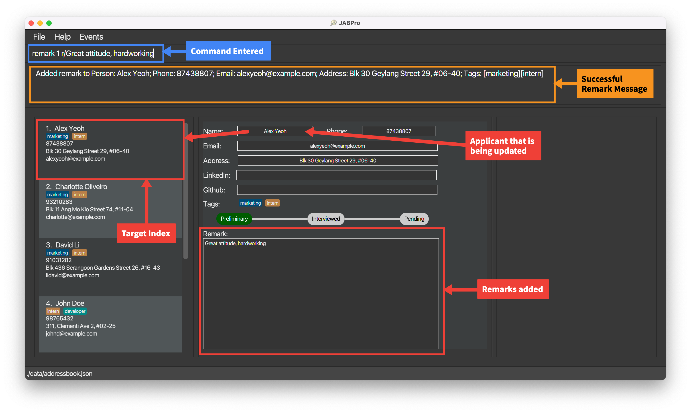
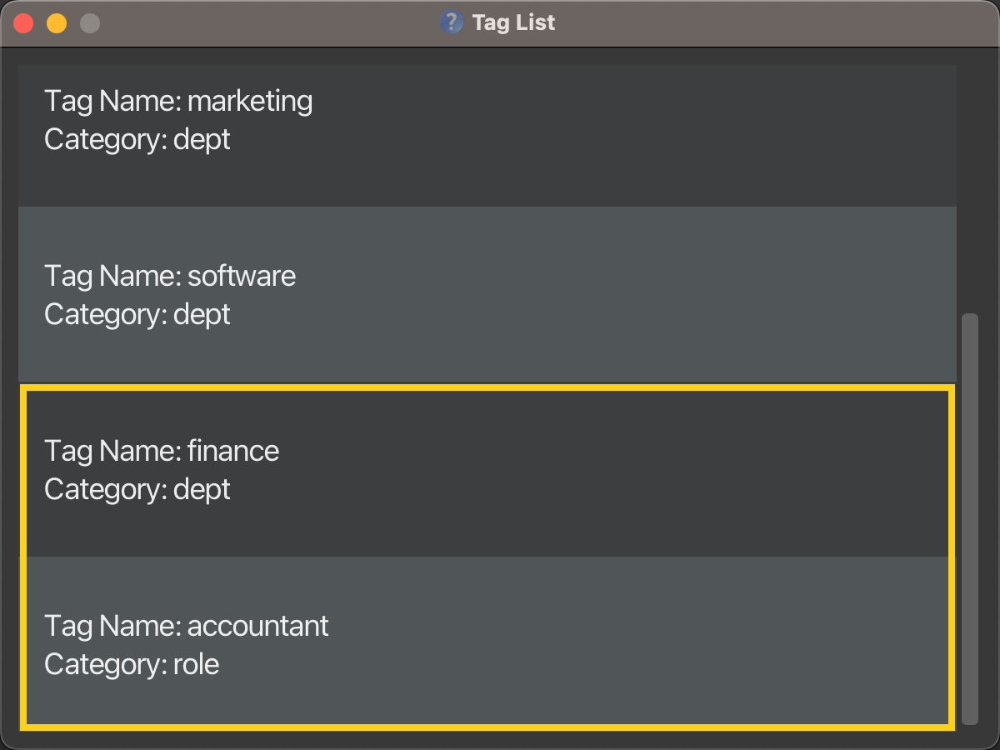

# JABPro User Guide

--------------------------------------------------------------------------------------------------------------------

## Table of Contents
* [Product Overview](#product-overview)
* [Key Definitions](#key-definitions)
* [Features Overview](#overview-of-main-features)
* [Quick Start Guide](#quick-start)
* [Features](#features)
  * [Command Failures](#command-failure) 
  * Managing Applicants
    * [Adding an applicant](#adding-an-applicant-add)
    * [Adding a remark to an applicant](#adding-a-remark-to-an-applicant-remark)
    * [Adding applicant's LinkedIn/GitHub](#adding-linkedingithub-username-for-a-user-addl-or-addg)
    * [Opening applicant's LinkedIn/GitHub](#opening-user-linkedin-or-github-account-linkedin-or-github)
    * [Setting an applicant's status](#setting-an-applicants-status-set)
    * [Viewing an applicant's details](#viewing-a-applicants-details-view)
    * [Editing an applicant's detail](#editing-a-applicant-edit)
    * [Deleting an applicant](#deleting-job-applicants-delete)
  * Tag Colouring and Categorisation
    * [Creating tags](#creating-tags-create)
    * [Listing all tags](#listing-all-tags-listt)
  * Searching through and Arranging Applicants
    * [Searching for applicants](#searching-job-applicants-by-category-search)
    * [Filtering applicants](#filter-job-applicants-by-statistics-filter)
    * [Listing all applicants](#listing-all-applicant-list)
  * Event Management and Scheduling
    * [Adding an event](#adding-an-event-event)
    * [Viewing all events](#viewing-events-schedule)
  * Others
    * [Viewing help](#viewing-help-help)
    * [Exporting all entries](#exporting-the-existing-data-to-csv-export)
    * [Clear all entries](#clearing-all-entries-clear)
    * [Exiting the program](#exiting-the-program-exit)
* [Summary Statistics](#summary-statistics)
* [FAQ](#faq)
* [Command Summary](#command-summary)
* [Prefix Summary](#prefix-summary)
* [Glossary](#glossary)

--------------------------------------------------------------------------------------------------------------------

## Product Overview

Are you tired of managing applicant applications through cumbersome spreadsheets? 

Upgrade your hiring process with **JABPro (JobApplicationsBook Pro)**, a CLI based desktop app that allows you to:

* easily manage applicant applications
* schedule interviews
* gain valuable insights on their interview performance

From interns to full-time roles, software to marketing, JABPro’s versatile interface allows you to keep track of all kinds of job applicants in various industries. 

**If you are a Hiring Manager, looking to improve your applications management workflow, JABPro is the tool for you!**

Access our self-curated user guide below to learn more on how you can integrate various JABPro’s functions into your workflow.

[Jump back to Table of Contents](#table-of-contents)

--------------------------------------------------------------------------------------------------------------------

## Key Definitions
You are a **beginner** user if ...

1. you are new to JABPro (used JABPro less than 5 times) *and*
2. you wish to fully rely on the JABPro interface.

You are an **advanced** user if ...
1. you have used JABPro multiple times now *and*
2. you use JABPro's search and summary statistics extensively for comparison *or*
3. you would like to challenge yourself to go beyond the JABPro user interface and manually edit files.

[Jump back to Table of Contents](#table-of-contents)

--------------------------------------------------------------------------------------------------------------------
## Overview of Main Features

While **JABPro** offers a whole range of features, we believe that the following features are likely to be the most useful to you:

**Viewing details of applicants:**
1. Viewing applicant's information: `view`

**Tag colouring and categorisation:**
1. Creating a tag with a specified category: `create`
2. Listing all tags: `listT`
3. Adding and editing an applicant's tags and tag scores: `edit`

**Event management and Scheduling:** 
1. Adding an event: `event`
2. Viewing events: `schedule`

**Comparing and filtering applicants:**
1. Filtering applicants by statistics: `filter`

These features address the complications that Hiring Managers face when managing applicants: 
1. Visual Noise and Clutter from using other applicant management software like Excel  

`Viewing details of applicants` and `Tag colouring and categorisation` address this by creating an organized and intuitive way to view applicants and their details. This is done through colour coding and minimalistic design.

2. Toggling between different software to manage applicants and schedule events   

`Event Management and Scheduling` address this by allowing you to schedule events and view them in the same software. This means that you do not have to toggle between different software to manage applicants and schedule events.

3. Having to manually calculate summary statistics and compare applicants
`Comparing and filtering applicants` address this by allowing you to filter applicants by statistics and compare them. This means that you do not have to manually calculate summary statistics and compare applicants.

--------------------------------------------------------------------------------------------------------------------
Go to the [Table of Contents](#table-of-contents) to navigate to the feature that you are interested in 

--------------------------------------------------------------------------------------------------------------------

## Quick Start

1. Ensure you have Java `11` or above installed in your Computer.

2. Download the latest `jabpro.jar` from [here](https://github.com/AY2324S1-CS2103T-W09-4/tp/releases).

3. Copy the file to the folder you want to use as the _home folder_ for your JabPro.

4. Open a command terminal, `cd` into the folder you put the jar file in, and use the `java -jar jabpro.jar` command to run the application.   
   A GUI similar to the below should appear in a few seconds. Note how the app contains some sample data.

      
   
<box type="warning" seamless>

Ensure your JABPro contains some sample data. If it starts off empty then there might be some issues with the launch which might result in 
some commands to not run properly. See below to learn how to troubleshoot this problem!

</box> 

<box type="tip" seamless>

**My app does not contain any sample data!**
Not to worry, here are some steps you can take to fix this:
1. On your command terminal, `cd` into the folder where you put the jar file in.
2. Run `cd Data` to navigate to the `Data` folder. This is the folder where JABPro stores the application data on your computer.
3. Run `ls` to view all the files stored in this folder.
4. You should be able to see a file titled `addressbook.json`. Run `rm addressbook.json` to delete this file.
5. Run `cd ..` to navigate back to the folder you were in before.
6. Run `java -jar jabpro.jar` to relaunch the application. You should be able to see a GUI similar to the one above.

</box>
 
5. If your UI looks **compressed and words are being cut off such as that seen below**, you should **resize** the window to a larger size by dragging the corners of the application window. The UI should now look like the example given above.
    
  
    

    **Here's what each part of the GUI signifies:**  

    

   | Colour                                                   | Component                   | Description                                                                                                                                      |
   | ---------------------------------------------------------|--------------------------------------------------------------------------------------------------------------------------------------------------|--------------------------------------------------------------------------------------------------------------------------------------------------|
   |   | Menu Bar                    | Provides buttons for exiting, opening Help window, and opening Events window.                                                                    |
   |  | Command Box                 | Allows you to enter a command.                                                                                                                   |
   |  | Result Display              | Displays the result of the command execution.                                                                                                    |
   |   | Applicant List Panel        | Displays a list of all applicants in JABPro.                                                                                                     |
   |    | Applicant Card              | Displays certain details of an applicant for quick view, such as name, address, phone, email, tags, LinkedIn/GitHub username.                    |
   |  | Applicant Information Panel | Displays a detailed view of an applicant, providing information of status and remarks, in addition to the basic information about the applicant. |
   |   | Summary Statistics Panel    | Displays summary statistics for a particular applicant pertaining to a specific tag.                                                             |

    In addition, there are windows such as:
   * Help Window [accessed by the `help` command, or through Menu Bar].
   * Events Window [accessed by the `schedule` command, or through Menu Bar].
   * TagList window [accessed through the `listT` command].

   Details for each have been provided with the respective commands.

6. Type the command in the command box and press Enter to execute it. 
   Some example commands you can try:

    * `add n/John Doe p/98765432 e/johnd@example.com a/John street, block 123, #01-01`: adds an applicant with the specified contact details.

    * `remark 1 r/Great attitude, hardworking`: edits the remark of the 1st applicant on the list to have a remark `Great attitude, hardworking`.
   
    * `view 1`: shows the complete details of the 1st applicant on the list.

    * `search n/John`: Searches for applicants whose names contain the keyword `John`

    * `delete 3`: Deletes the 3rd contact shown in the current list.

    * `set`: sets the applicant status to either of: (`Preliminary`, `Interviewed`, `Rejected`, `Offered`).
   
    * `export` : exports name, phone, email, address, tags, linkedin, github, remark, status to /data/export.csv

    * `add linkedin 1 alexyeoh`: Adds LinkedIn account to applicant's existing contact information.

    * `github Alex Yeoh`: Redirects the user to the GitHub account of the applicant (provided github has been added previously).

[Jump back to Table of Contents](#table-of-contents)

--------------------------------------------------------------------------------------------------------------------

## Features

<box type="info" seamless>

**Notes about the command format:** 

* Words in `UPPER_CASE` are the parameters to be supplied by the user. 
  e.g. in `add n/NAME`, `NAME` is a parameter which can be used as `add n/John Doe`.

* Items in square brackets are optional. 
  e.g. `n/NAME [t/TAG]` can be used as `n/John Doe t/friend` or as `n/John Doe`.

* When using parentheses ( ) with items separated by the slash symbol /, at least one item must be included.  
  e.g. in the command `search (n/KEYWORD [MORE KEYWORDS] / st/KEYWORD [MORE KEYWORDS] / t/KEYWORD [MORE KEYWORDS])`, it is necessary to specify at least one search category.

* Items with `…`​ after them can be used multiple times including zero times. 
   e.g. `t/TAGNAME…​` can be used as ` ` (i.e. 0 times), `t/swe t/intern` for `add` commands or `t/swe intern` for `search` and `delete` commands.

* Parameters can be in any order. 
   e.g. if the command specifies `n/NAME p/PHONE_NUMBER`, `p/PHONE_NUMBER n/NAME` is also acceptable.

* Extraneous parameters for commands that do not take in parameters (such as `help`, `listT`, `exit` and `clear`) will be ignored. 
   e.g. if the command specifies `help 123`, it will be interpreted as `help`.

* If you are using a PDF version of this document, be careful when copying and pasting commands that span multiple lines as space characters surrounding line-breaks may be omitted when copied over to the application.
  </box>

[Jump back to Table of Contents](#table-of-contents)

### Command Failure
<box type="warning" seamless>

**How to know if your command has failed?** 
1. You will see the command that you have entered being highlighted in red. 
2. The command will not be cleared from the command box. 
3. The error message will be shown in the result display panel. 
4. The UI below will not be updated if your command has failed.
</box>

**The example below shows a command failure for `view`:**

 

[Jump back to Table of Contents](#table-of-contents)

### 1. Managing Applicants

### Adding an applicant: `add`

Adds an applicant to JABPro.

Format: `add n/NAME p/PHONE_NUMBER e/EMAIL a/ADDRESS [t/[CATEGORY] TAGNAME]…​`

| Type      | Prefix                 | Constraints                                                                                                                 |
|-----------|------------------------|-----------------------------------------------------------------------------------------------------------------------------|
| Mandatory | `n/NAME`               | `NAME` must be alphanumeric (Letters and numbers, no symbols allowed such as `/`, `,` ...).                                 |
| Mandatory | `p/PHONE_NUMBER`       | `PHONE_NUMBER` must contain numbers only and should be at-least 3 digits long.                                              |
| Mandatory | `e/EMAIL`              | `EMAIL` must be the standard email address format (There must be an email-prefix followed by  `@` symbol and email domain). |
| Mandatory | `a/ADDRESS`            | `ADDRESS` can be any value, including special characters such as `#`, `,` ...                                               |
| Optional  | `t/[CATEGORY] TAGNAME` | `TAGNAME` must be alphanumeric with no spaces. Any details after the space will be ignored.                                 |

**Notes regarding additional constraint on `add` command:**
* The uniqueness of the applicant is determined by the name only. This means that you cannot have 2 applicants with the same name in the application book.
* All other fields other than name can be identical between different people in JABPro.
* Applicants added using the `add` command will be added to the end of the list.

**Notes on adding tags:**
* If you would like to tag a user with a tag that has not been categorised yet using the `create` command,
  you can specify the category that you would like it to be categorised to in the `add` command. e.g. `...t/role swe`
* If you are using a tag that has not been categorised yet, and you did not specify its category in the `add` command,
  the tag would still be saved, but it would be "uncategorized" by default.
* If you have multiple tags in different categories with the same name, you must specify the category when you want to
  add one of these tags to the applicant you are adding.

<box type="tip" seamless>

**Tip:**
* An applicant can have any number of tags (including 0)!
</box>

An example of the `add` command being successfully executed:
1. Enter the command `add n/Betsy Crowe t/friend e/betsycrowe@example.com a/Newgate Prison p/1234567 t/dept finance`
2. This is the result of the successful `add` command (Take note that command entered will not be shown in the result):
   
    
 

**Error Handling Table for `add` command:**

| Reason for Error                              | Error Message                                                                     | Remedy / Suggested course of action                                                                                                              |
|-----------------------------------------------|-----------------------------------------------------------------------------------|--------------------------------------------------------------------------------------------------------------------------------------------------|
| Missing add keyword: `add`                    | Unknown command | Follow the command format of `add n/NAME p/PHONE_NUMBER e/EMAIL a/ADDRESS [t/TAGNAME]…​` closely                                                 |
| Missing mandatory fields                      | Invalid command format!                                                           | Ensure that all mandatory fields are filled up.                                                                                                  | 
| Duplicate name                                | This person already exists in the address book                                                      | Ensure that the name of the applicant is unique. That is you cannot add the same name twice. Use some form of extra identification like a number |
| Invalid phone number                          | Phone numbers should only contain numbers, and it should be at least 3 digits long | Ensure that the phone number only contains number and should be at least 3 digits long                                                           |
| Invalid email                                 | Emails should be of the format local-part@domain and adhere to the following constraints:| Ensure that the prefix and domain of the email is correct following the constraints stated by the error                                          |                                                                                                                                                
| Invalid tag name                              | Tag names should only contain alphanumeric characters and should not be blank | Ensure that the tag name only contains alphanumeric characters and should not be blank                                                           |
| Multiple prefixes of the same type being used | Multiple values specified for the following single-valued field(s): `prefix/`      | Remove the duplicate prefix. The command should only have 1 of every prefix except for `t/`                                                       |

<box type="tip" seamless>

**Tip:** To know if it is an error, the command entered will light up in red. It remains in the command box.
1. The error message will be displayed in the result display box.
2. Follow the error handling table for the command  or use the suggested course of action in the result display to rectify the error.

</box>

[Jump back to Table of Contents](#table-of-contents)

### Adding a remark to an applicant: `remark`

Edits a remark of an existing applicant in JABPro.
Format: `remark INDEX r/REMARK`

| Type      | Prefix        | Constraints                                                                                                                                 |
|-----------|---------------|---------------------------------------------------------------------------------------------------------------------------------------------|
| Mandatory | `INDEX`       | `INDEX` must be an existing index in the displayed applicant list and it must not be greater than the total number of applicants in JABPro. |
| Optional  | `r/ [REMARK]` | `REMARK` can be any value, including special characters such as `#`, `,` ...                                                                |

**Notes regarding `remark` command:**
* The previous remark is not saved, and instead is replaced by the inputted remark. The command does not add to the existing remark.
* You can empty out a remark by inputting `r/` without any text after it or by omitting the `r/` prefix.
* You can get the remark previously inputted by using the `**REMARK**` keyword. It will be replaced with the previous remark. The keyword `**REMARK**` is case-sensitive. This means that `remark 1 r/**remark**` will just replace the remark with the word `**remark**`.
* You can use multiple prefix for `remark` but only the last prefix will be used. This means that `remark 1 r/remark r/remark2` will just replace the remark with `remark2`.

An example of the `remark` command being successfully executed:
1. Enter the command `remark 1 r/Great attitude, hardworking`
2. This is the result of the successful `remark` command (Take note that command entered will not be shown in the result):
   
3. 
 

An example of the `remark` command being successfully executed with the **REMARK** keyword:
1. Enter the command `remark 1 r/**REMARK** furthermore he is great at teamwork`
2. This is the result of the successful `remark` command (Take note that command entered will not be shown in the result):
   
    
 

**Error Handling Table for `remark` command:**

| Reason for Error                              | Error Message                         | Remedy / Suggested course of action                                                             |
|-----------------------------------------------|---------------------------------------|-------------------------------------------------------------------------------------------------|
| Missing remark keyword: `remark`              | Unknown command                       | Follow the command format of `remark INDEX r/[REMARK]` closely                                  |
| Missing Index                                 | Invalid command format!               | Ensure that the index is filled up.                                                             |
| Invalid Index                                 | The person index provided is invalid  | Ensure that the index is valid. That is it is a number that is on the displayed applicant list. |
 | Negative or 0 Index | Invalid command format! | Ensure that the index is a positive integer and is also a number that is on the displayed applicant list. |

<box type="tip" seamless>

**Tip:** To know if it is an error, the command entered will light up in red. It remains in the command box.
1. The error message will be displayed in the result display box.
2. Follow the error handling table for the command or use the suggested course of action in the result display to rectify the error.

</box>

Additional Examples:
*  `remark 1` Empties the remark of the 1st applicant. It is equivalent to `remark 1 r/`.
  
[Jump back to Table of Contents](#table-of-contents)

### Adding LinkedIn/GitHub username for a user: `addL` or `addG`

Adds the username for their social profile [LinkedIn/GitHub] to the existing contact details of applicants.

Format: `addL USERID u/USERNAME` or `addG USERID u/USERNAME`

| Type      | Parameter    | Constraints                                                                                                            |
|-----------|--------------|------------------------------------------------------------------------------------------------------------------------|
| Mandatory | `USERID`     | `USERID` must be a non-zero unsigned integer and it must not be greater than the total number of applicants in JABPro. |
| Mandatory | `u/USERNAME` | `USERNAME` must be a string value. Only the prefix (i.e. `u/`) is mandatory.                                           |

**Notes regarding `addL` and `addG` command:**

* Any set of characters entered after the prefix `u/` is taken to be the username, except if the prefix `u/` occurs multiple times.
* User may provide the username multiple times with the prefix `u/`, however, JABPro only considers the set of characters entered after the last occurring instance of `u/` as the username.
* User is expected to ensure that `USERNAME` is a valid username for the respective social profile. If it is not a valid username, user will be redirected to the error page of the corresponding social profile when `linkedin` or `github` command is invoked. JABPro does not perform checks for the validity of the username for the corresponding social profile.
* Invoking the `addL` or `addG` command for an applicant for whom a username has already been added, will simply overwrite the existing username with the new one.
* User may run the command `addL USERID u/` or `addG USERID u/`, i.e. providing no username, or simply providing blanks for the username. Such inputs are accepted by JABPro. However, it will prove to be erroneous when `linkedin` or `github` command is invoked.

**Example of successful execution of the `addL` command:**

1. Enter the command `addL 1 u/alexyeoh`
2. This is the result of the successful `addL` command [It is assumed an applicant exists in JABPro]:

`addG` command is invoked in the same way.

**Error Handling Table for `addL` and `addG` command:**

| Reason for Error                          | Error Message                         | Remedy / Suggested course of action                                                                       |
 |-------------------------------------------|---------------------------------------|-----------------------------------------------------------------------------------------------------------|
| Missing `addL` or `addG` keyword          | Unknown command                       | Follow the command format of `addL USERID u/USERNAME` or `addG USERID u/USERNAME` closely                 |
| Missing Index                             | Invalid command format!               | Ensure that the index is filled up.                                                                       |
| Invalid Index                             | The person index provided is invalid  | Ensure that the index is valid. That is it is a number that is on the displayed applicant list.           |
| Negative or 0 Index                       | Invalid command format! | Ensure that the index is a positive integer and is also a number that is on the displayed applicant list. |
| Missing username                          | Invalid command format! | Ensure that the username is filled up                                                                     |

[Jump back to Table of Contents](#table-of-contents)

### Opening user LinkedIn or GitHub account: `linkedin` or `github`

Redirects user to applicant's LinkedIn or GitHub account.

Format: `linkedin USERID` or `github USERID`

| Type      | Parameter | Constraints                                                                                                            |
|-----------|-----------|------------------------------------------------------------------------------------------------------------------------|
| Mandatory | `USERID`  | `USERID` must be a non-zero unsigned integer and it must not be greater than the total number of applicants in JABPro. |

**Notes regarding `LinkedIn` and `GitHub` commands:**

* User is expected to enter `USERID` for an applicant for whom username [that is not blank, or does not comprise of only spaces] has been added previously.
* User is redirected to the page of the social profile regardless of the validity of the username for that particular social profile.

**Example of successful execution of `github` command:**

1. Enter the command `github 1`
2. This is the result of the successful `github` command [It is assumed an applicant exists in JABPro, with Github username previously added]:

The GitHub window opens as follows, displaying the profile with the specified username, or error page in case profile with that username does not exist:

`linkedin` command is invoked in the same manner.

**Error Handling Table for `linkedin` and `github` commands:**

| Reason for Error                       | Error Message                                              | Remedy / Suggested course of action                                                                       |
 |----------------------------------------|------------------------------------------------------------|-----------------------------------------------------------------------------------------------------------|
| Missing `linkedin` or `github` keyword | Unknown command                                            | Follow the command format of `linkedin USERID` or `github USERID` closely                                 |
| Missing Index                          | Invalid command format!                                    | Ensure that the index is filled up.                                                                       |
| Invalid Index                          | The person index provided is invalid                       | Ensure that the index is valid. That is it is a number that is on the displayed applicant list.           |
| Negative or 0 Index                    | Invalid command format!                                    | Ensure that the index is a positive integer and is also a number that is on the displayed applicant list. |
| Missing account for provided Index     | No LinkedIn account has been added for this candidate. or No Github account has been added for this candidate. | Ensure that username has been previously added to the specified candidate                                 |

[Jump back to Table of Contents](#table-of-contents)

### Setting an applicant's status: `set`

Format: `set INDEX STATUS`

| Type      | Prefix   | Constraints                                                                                                                                |
|-----------|----------|--------------------------------------------------------------------------------------------------------------------------------------------|
| Mandatory | `INDEX`  | `INDEX` must be an existing index in the displayed applicant list and it must not be greater than the total number of applicant in JABPro. |
| Mandatory | `STATUS` | `STATUS` must be one of the following - "Preliminary", "Interviewed", "Rejected", "Accepted".                                              |

**Notes regarding `set` command:**
* The index used will be the same index as the one shown in the displayed applicant list.

Sets the applicant to a specific status ("Preliminary"/ "Interviewed"/ "Rejected"/ "Offered")

* Sets the applicant at the specified `INDEX` to a specific hiring status.
* The index refers to the index number shown in the displayed applicant list.
* The index **must be a positive integer** 1, 2, 3, …​
* The status must be a string of exactly "Preliminary", "Interviewed", "Rejected" or "Offered".

Examples:
* `list` followed by `set 2 Interviewed` sets the 2nd applicant in the address book to "Interviewed".

[Jump back to Table of Contents](#table-of-contents)

### Viewing a applicant's details: `view`

Creates a complete view for details of an applicant in the second main panel and summary statistics (if applicable) of an applicant in the third main panel.

Format: `view INDEX`

| Type      | Prefix  | Constraints                                                                                                                                |
|-----------|---------|--------------------------------------------------------------------------------------------------------------------------------------------|
| Mandatory | `INDEX` | `INDEX` must be an existing index in the displayed applicant list and it must not be greater than the total number of applicant in JABPro. |

**Notes regarding `view` command:**
* The index used will be the same index as the one shown in the displayed applicant list.
* Compatible with search and other features that changes the displayed applicant list. Index always follows the index shown in the displayed applicant list.
* Refer to the [Summary Statistics](#summary-statistics) section for more details on the summary statistics.

<box type="tip" seamless>

**Tip:** Other operations that affect user's data will trigger a refresh of the view.
These include `add`, `edit`, `set`, `remark`, `addL`, `addG`.
This means that the view will be updated to reflect the latest changes to the data for that particular applicant.

</box>

An example of the `view` command being successfully executed:
1. Enter the command `view 3`
2. This is the result of the successful `view` command (Take note that command entered will not be shown in the result):
   
   
 

An example of the `view` command being successfully executed for applicant with tags and score:
1. Enter the command `view 2` (**Applicant with tags and score**)
2. This is the result of the successful `view` command (Take note that command entered will not be shown in the result):
   
    
 

**Error Handling Table for `view` command:**

| Reason for Error                              | Error Message                                                                       | Remedy / Suggested course of action                                                             |
|-----------------------------------------------|-------------------------------------------------------------------------------------|--------------------------------------------------------------------------------------------------|
| Missing view keyword: `view`                  | Unknown command | Follow the command format of `view INDEX` closely                                                |
| Missing Index                                 | Invalid command format!                                                             | Ensure that the index is filled up.                                                              |
| Invalid Index                                 | The person index provided is invalid| Ensure that the index is valid. That is it is a number that is on the displayed applicant list.  |

<box type="tip" seamless>

**Tip:** To know if it is an error, the command entered will light up in red. It remains in the command box.
1. The error message will be displayed in the result display box.
2. Follow the error handling table for the command or use the suggested course of action in the result display to rectify the error.

</box>

[Jump back to Table of Contents](#table-of-contents)

### Editing a applicant: `edit`

Edits an existing applicant's detail in JABPro

Format: `edit INDEX [n/NAME] [p/PHONE] [e/EMAIL] [a/ADDRESS] [t/TAGNAME]…​ [sc/TAGNAME SCORE]`

| Type      | Prefix             | Constraints                                                                                                                 |
|-----------|--------------------|-----------------------------------------------------------------------------------------------------------------------------|
| Mandatory | `INDEX`            | `INDEX` must be a non-zero unsigned integer and must also not be greater than the total number of applicants in JABPro.     |
| Optional  | `n/NAME`           | `NAME` must be alphanumeric (Letters and numbers, no symbols allowed such as `/`, `,` ...).                                 |
| Optional  | `p/PHONE_NUMBER`   | `PHONE_NUMBER` must contain numbers only and should be at-least 3 digits long.                                              |
| Optional  | `e/EMAIL`          | `EMAIL` must be the standard email address format (There must be an email-prefix followed by  `@` symbol and email domain). |
| Optional  | `a/ADDRESS`        | `ADDRESS` can be any value, including special characters such as `#`, `,` ...                                               |
| Optional  | `t/TAGNAME`        | `TAGNAME` must be alphanumeric with no spaces. Any details after the space will be ignored.                                 |
| Optional  | `sc/TAGNAME SCORE` | `TAGNAME` a tag that is being created or already exist for that applicant. `SCORE` must be a non-negative integer.          |

**Notes regarding `edit` command:**
* At least one of the optional fields must be provided.
* Existing attributes will be updated to the input values.
* There is a way to edit tags and their categories at the same time. Look at the notes for editing tags with categories `t/[CATEGORY] TAGNAME` for more details.

**Notes on editing the tags of the specified applicant for `t/TAGNAME`**:
* When editing tags, the existing tags of the applicant will be removed i.e. adding of tags is not cumulative.
* You can remove all the applicant’s tags by typing `t/` without
  specifying any tags after it.
* There is no current way to keep the existing tags and add new tags to the applicant. You will have to re-tag the applicant with the existing tags and the new tags.

**Notes on editing the score of the specified applicant for `sc/TAGNAME SCORE`**:
* The `TAG` in `sc/TAG SCORE` must be a tag of the category `assessment`. You cannot use the `sc/TAG SCORE` field for tags that are not of the `assessment` category.
* The `sc/TAG SCORE` field can only be used after the `t/TAG` field is used if the tag has not been created  or the `TAG` already exist on the applicant.
* The `SCORE` in `sc/TAG SCORE` is non-negative, that is `SCORE` must be more than or equal to 0.
* To clear a tag's score, just re-tag it with the same tag name, but without using the `sc/TAG SCORE` field.

Notes on rules for `edit` command involving tags with categories for `t/[CATEGORY] TAGNAME`:
* Consequently, similar rules for `add` apply to the `edit` command involving tags:
    * If you would like to tag a user with a tag that has not been categorised yet using the `create` command,
      you can specify the category that you would like it to be categorised to in the `edit` command. e.g. `edit 1 t/role swe`
    * If you are using a tag that has not been categorised yet, and you did not specify its category in the `add` command,
      the tag would still be saved, but it would be "uncategorized" by default.
    * If you have multiple tags in different categories with the same name, you must specify the category when you want to
      tag the specified applicant with one of these tags.

<box type="tip" seamless>

1. Editing an applicant's details will trigger a refresh of the view. This means that the view will be updated to reflect the latest changes to the data for that particular applicant.
2. We strongly recommend that you categorise tags using `create` before using `edit` to tag applicants. This is to reduce the confusion of having two ways to tag applicants.

</box>

An example of the `edit` command being successfully executed:
1. Enter the command `edit 1 n/Alex Ho p/91234567` (**Edit name and phone number**)
2. This is the result of the successful `edit` command (Take note that command entered will not be shown in the result):
   
   
 

An example of the `edit` command being successfully executed with tags and score:
1. Ensure that you have created a tag `Interview` under the `assessment` category using the `create` command. That is, enter the command `create t/assessment Interview`
2. Enter the command `edit 1 t/Interview sc/Interview 80` (**Edit tag and score**)
3. This is the result of the successful `edit` command (Take note that command entered will not be shown in the result):
   
   
 

An example of the `edit` command being successfully executed to clear a tags and score:
1. Enter the command `edit 1 t/` (**Clear all tags**)
2. This is the result of the successful `edit` command (Take note that command entered will not be shown in the result):
   
   
 

**Error Handling Table for `edit` command:**

| Reason for Error                              | Error Message                                                                | Remedy / Suggested course of action                                                                                                                                 |
|-----------------------------------------------|------------------------------------------------------------------------------|---------------------------------------------------------------------------------------------------------------------------------------------------------------------|
| Missing edit keyword: `edit`                  | Unknown command                                                              | Follow the command format of `edit INDEX [n/NAME] [p/PHONE] [e/EMAIL] [a/ADDRESS] [t/TAGNAME]…​ [sc/TAGNAME SCORE]` closely                                         |
| Missing Index                                 | Invalid command format!                                                      | Ensure that the index is filled up.                                                                                                                                 |
| Invalid Index                                 | The person index provided is invalid                                         | Ensure that the index is valid. That is it is a number that is on the displayed applicant list.                                                                     |
| Missing at least one of the field | At least one field to edit must be provided.                                 | Ensure that at least one of the field is filled up and to be changed.                                                                                               |
| Duplicate name                                | This person already exists in the address book                               | Ensure that the name of the applicant is unique. That is you cannot add the same name twice. Use some form of extra identification like a number                    |
| Invalid phone number                          | Phone numbers should only contain numbers, and it should be at least 3 digits long | Ensure that the phone number only contains number and should be at least 3 digits long                                                                              |
| Invalid email                                 | Emails should be of the format local-part@domain and adhere to the following constraints: | Ensure that the prefix and domain of the email is correct following the constraints stated by the error                                                             |                                                                                                                                                
| Invalid tag name                              | Tag names should only contain alphanumeric characters and should not be blank | Ensure that the tag name only contains alphanumeric characters and should not be blank                                                                              |
| Multiple prefixes of the same type being used | Multiple values specified for the following single-valued field(s): `prefix/` | Remove the duplicate prefix. The command should only have 1 of every prefix except for `t/`                                                                          |
| Missing score for tag                         | Invalid score, score must be non-negative integer.                                                        | Ensure that the score is filled up and has a space from the `TAGNAME`.                                                                                              | 
| Invalid tag to attach score | Invalid score tag, tag must a tag of the category assessment and must exist on the applicant | Ensure that the tag is of the category assessment and exist on the applicant. If its the wrong category, use `create`, if it is not tagged to the person use `edit` |

<box type="tip" seamless>

**Tip:** To know if it is an error, the command entered will light up in red. It remains in the command box.
1. The error message will be displayed in the result display box.
2. Follow the error handling table for the command or use the suggested course of action in the result display to rectify the error.

</box>

[Jump back to Table of Contents](#table-of-contents)  

### Deleting job applicants: `delete`

Deletes the specified job applicants from the address book.

Format: `delete INDEX` or `delete (t/TAGNAME [MORE TAGS] st/STATUS [MORE STATUS])`

| Type      | Prefix  | Constraints                                                                                                             |
|-----------|---------|-------------------------------------------------------------------------------------------------------------------------|
| Mandatory | `INDEX` | `INDEX` must be a non-zero unsigned integer and must also not be greater than the total number of applicants in JABPro. |

| Type       | Prefix      | Constraints                                                                  |
|------------|-------------|------------------------------------------------------------------------------|
| Mandatory* | `t/TAGNAME` | `TAGNAME` must be alphanumeric and contains no spaces.                       |
| Mandatory* | `st/STATUS` | `STATUS` must either be `preliminary`, `interviewed`, `offered`, `rejected`. |

Note:
* `delete` by tags & status requires at least ONE search parameter i.e. `st/STATUS`, or `t/TAGNAME`.
* Each prefix can only be used at most once.
* User **cannot** delete by index and delete by tags & status in a single command. 
  E.g. `delete 1 t/hardworking` is **not** allowed.

Example:
1. `find Betsy` followed by `delete 1` deletes the 1st applicant in the results of the `find` command.
2. `delete st/interviewed rejected t/intern manager` will delete applicants whose:
    * status is either **interviewed** or **rejected**
    * AND has a tag `intern` or `manager`.

### 2. Tag Colouring and Categorisation

### Creating tags: `create`

Creates a tag and categorises it to the specified category.

Format: `create t/CATEGORY TAGNAME…​`

| Type      | Prefix               | Constraints                                                                                              |
|-----------|----------------------|----------------------------------------------------------------------------------------------------------|
| Mandatory | `t/CATEGORY TAGNAME` | `TAGNAME` must be alphanumeric (letters and numbers, no spaces and symbols allowed such as `/`, `,` ...) |

**Note:**
* JABPro offers 3 predefined tag categories namely `employment`, `role`, and `dept`. However, you can define up to 3 more tag categories of your own!
* The tags created using this command can be used to tag applicants using the `add` or `edit` command. Tagging
  applicant without previously categorising the tags using `create` would still work but the tags would be *uncategorized*.
* `create` only allows tags to be categorised at creation meaning tags that have already been created, cannot be categorised further.

  **Tip:**
* You can create multiple tags at once i.e. `create t/dept marketing t/role developer ...`
* Use this command for frequently used tags for better efficiency in tagging applicants.
* You can view all of your tags by keying in the `listT` command.
  </box>

  Failed to create tags? Here's some possible reasons why:
1. Missing mandatory field i.e. `create`
2. Did not specify category i.e. `create t/developer`
3. Invalid tag name (contained spaces) i.e. `create t/role software developer`
4. Tag already exists

   An example of the `create` command being successfully executed:
1. Enter the command `create t/dept marketing t/role developer`
2. This is what you should see upon successful execution of command.
   
    

3. View your newly created tags using the `listT` command.

   

[Jump back to Table of Contents](#table-of-contents)

### Listing all tags: `listT`

Shows a list of all tags in JABPro

Format: `listT`

* The `listT` command does not require any additional parameters or arguments.
* Tags listed by the `listT` command are unique and do not repeat.

**Example:**
* `listT` Shows a list of all tags.

[Jump back to Table of Contents](#table-of-contents)

### 3. Searching and Arranging Applicants

### Searching job applicants by category: `search`

Finds job applicants whose profiles match the specified categories' keywords. The search categories are: name, status, tag.

Format: `search (n/NAME [MORE NAME] / st/STATUS [MORE STATUS] / t/TAG [MORE TAGS)`

| Type       | Prefix      | Constraints                                                                  |
|------------|-------------|------------------------------------------------------------------------------|
| Mandatory* | `n/NAME`    | `NAME` must be alphanumeric.                                                 |
| Mandatory* | `st/STATUS` | `STATUS` must either be `preliminary`, `interviewed`, `offered`, `rejected`. |
| Mandatory* | `t/TAGNAME` | `TAGNAME` must be alphanumeric and contains no spaces.                       |

**Note**:
* `search` requires at least ONE search parameter i.e. `n/NAME`, `st/STATUS`, or `t/TAGNAME`.
* Each prefix can only be used at most once.
* Multiple search parameters for a specific category are divided by spaces (not commas!) i.e. `search st/preliminary interviewed`

<box type="tip" seamless>

**Tip**:

* You can combine multiple search categories in a single `search` command.
* Search parameters are case-insensitive.
  
</box>

Examples of successful command execution:
1. `search n/alex bernice`
   
   
  
   The above `search` command displayed all applicants whose name match ANY of the given keywords. This is because
   `search` does an `OR` search within a specific category.  
2. `search n/alex bernice st/interviewed t/intern`
   
   
  
   Notice how the above `search` command did not display "Alex" despite his profile matching
   the `name` and `tag` categories. This is because `search` does an `AND` search across multiple categories. 

<box type="tip" seamless>

**What does it mean to do an `OR` search within a single category and an `AND` search across multiple categories?**
 
 
It's best to explain this by breaking down an example `search` command!
 
`search n/alex bernice st/interviewed t/intern` will output applicants whose:
* names contain either Alex `OR` Bernice
* `AND` status is either interviewed
* `AND` has a tag `intern`

</box>

Failed to execute the `search` command? Here are some possible reasons why:
1. Missing search category i.e. `search`
2. Invalid name/status/tag parameters i.e. `search n/@alex st/accepted t/intern#`
3. Multiple prefixes of the same category used i.e. `search n/alex n/bernice`
4. Using commas as delimiters of different parameters instead of spaces i.e. `search n/alex, bernice`

[Jump back to Table of Contents](#table-of-contents)

### Filter job applicants by statistics: `filter`

Filters and display applicants in the current displayed applicant list using statistical metrics and values.

Format:`filter t/TAGNAME met/METRIC val/VALUE` or `filter t/TAGNAME met/METRIC`

| Type      | Prefix       | Constraints                                                                                                        |
|-----------|--------------|--------------------------------------------------------------------------------------------------------------------|
| Mandatory | `t/TAGNAME`  | `TAGNAME` must be a tag that is of the category `assessment`.                                                      |
| Mandatory | `met/METRIC` | `METRIC` must be either `score`, `percentile`, `mean`, `median`.                                                   |
| Optional  | `val/VALUE`  | Optional only for `mean` and `median`. Otherwise, `VALUE` must be a non-negative integer and is a mandatory field. |

**Notes regarding `filter` command:**
* Filter works only on the current list of job applicants displayed. It is essential that you enter `list` before using `filter` to ensure that you are filtering the correct list of job applicants.
* It is strongly recommended that you use `filter` after you have tagged most of the job applicants with a tag that has a score.
* Filters and displays job applicants whose **value** is **greater than or equal** to the specified value for the specified statistic metric.
* For `METRIC` that is `mean` or `median`, the `VALUE` is optional. Specifying a `VALUE` here will be ignored accordingly. `filter t/TAGNAME met/METRIC` is equivalent to `filter t/TAGNAME met/METRIC val/X` where `X` is any positive integer.
* Filter does not edit, update or in any way change the data of the job applicants. It only filters and displays the job applicants.
* Filter does not trigger view, that is your view panels represent the previous applicant you viewed before filtering.
* To get back the **original list with all the applicants**, simply type `list` again.

**Notes on the different metrics:**
Do look at the [Summary Statistics](#summary-statistics) section for more details on the summary statistics metrics.

<box type="tip" seamless>

You should use `filter` after you have tagged most of the job applicants with a tag that has a score.   
This is because some of the metrics such as `percentile`, `mean` and `median` require a certain number of scores to be considered meaningful.
Read more about this in the [Summary Statistics](#summary-statistics) section.

</box>

Set up for examples when you first start JABPro with default data:
1. `list`
2. `create t/assessment interview` to create a tag `interview` under the `assessment` category.
3. `edit 1 t/interview sc/interview 80`
4. `edit 2 t/interview sc/interview 90`
5. `edit 3 t/interview sc/interview 70`
6. The result of the above commands should look like this:

   
 

An example of the `filter` command being successfully executed:
1. Enter the command `list`
2. Enter the command `filter t/interview met/percentile val/80` (**Filter by percentile**)
3. This is the result of the successful `filter` command (Take note that command entered will not be shown in the result):

   
 

An example of the `filter` command being successfully executed with `median`:
1. Enter the command `list`
2. Enter the command `filter t/interview met/median` (**Filter by median**)
3. This is the result of the successful `filter` command (Take note that command entered will not be shown in the result):
   
   
 

**Error handling for `filter` command:**

| Reason for Error                                        | Error Message                                                                              | Remedy / Suggested course of action                                                                                                                                     |
|---------------------------------------------------------|--------------------------------------------------------------------------------------------|-------------------------------------------------------------------------------------------------------------------------------------------------------------------------|
| Missing filter keyword: `filter`                        | Unknown command!                                                                           | Follow the command format strictly of `filter t/TAGNAME met/METRIC val/VALUE` for score and percentile or `filter t/TAGNAME met/METRIC` for mean or median.             |
| Missing parameters                                      | Incomplete parameter inputs. t/TAG and met/SCORE are compulsory fields. | Enter the command again with the correct parameters.                                                                                                                    |
| Invalid tag as tag has wrong category or does not exist | Tag does not exist!                                                                        | Check that the tag is of the category `assessment` and that the tag exists using `listT`. Use the `create` command if it does not.                                      |
| Invalid metric                                          | Invalid metric provided. Needs to be one of: score, mean, median, percentile               | Check that the metric is one of the following: `score`, `mean`, `median`, `percentile` and that it is spelt correctly. Enter the command again with any of the 4 metric |
 | Invalid value                                           | Invalid value provided. Needs to be a non negative integer that is more than or equal to 0 | Check that the value is a non-negative integer that is more than or equal to 0. Enter the command again with the correct value.                                         |
 | Missing value                                           | val/VALUE is missing, it is compulsory.                                                    | Enter a value for `val/VALUE` since the metric requires it.                                                                                                             |
| Multiple prefixes of the same type being used           | Multiple values specified for the following single-valued field(s): `prefix/`              | Remove the duplicate prefix. The command should only have 1 of every prefix                                                                                             |

<box type="tip" seamless>

**Tip:** To know if it is an error, the command entered will light up in red. It remains in the command box.   
1. The error message will be displayed in the result display box.   
2. Follow the error handling table for the command  or use the suggested course of action in the result display to rectify the error.

</box>

**Significance of using `filter` with the metrics `score`, `percentile`, `mean` and `median`:**
In essence, this allows you to find job applicants whose performance rating is above a certain percentile, score or mean/median score for that tag.  
Ideally, this feature can then be used to find the best applicants easily and quickly without having to manually look through the list of applicants.  

[Jump back to Table of Contents](#table-of-contents)  

### Listing all applicant: `list`

Shows a list of all applicants in JABPro

Format: 
`list [so/ATTRIBUTE]`

| Type     | Parameter      | Constraints                       |
|----------|----------------|-----------------------------------|
| Optional | `so/ATTRIBUTE` | Must either be `name` or `email`. |

* Attribute is case-insensitive: `list so/NAME` and `list so/name` return the same result.
* The result will be sorted in **ascending** order.
* The sorting algorithm is case-sensitive, which means it will treat uppercase and
  lowercase letters as distinct. This may result in names being sorted as A B C a b c, rather than A a B b C c.

### 4. Event Management and Scheduling

### Adding an Event: `event`

Adds an event, associated with an applicant, to JABPro.

Format: `event USERID d/DESCRIPTION bt/BEGIN_TIME et/END_TIME`

| Type       | Parameter       | Constraints                                                                                                          |
|------------|-----------------|----------------------------------------------------------------------------------------------------------------------|
| Mandatory  | `USERID`        | `USERID` must be a non-zero unsigned integer and it must not be greater than the total number of applicant in JABPro |
| Mandatory  | `d/DESCRIPTION` | `DESCRIPTION` must be a string value. Only the prefix (i.e. `d/`) is mandatory.                                      |
| Mandatory  | `bt/BEGIN_TIME` | `BEGIN_TIME` must be a valid date-time, in the format `yyyy-MM-dd HH:mm`                                             |
| Mandatory  | `et/END_TIME`   | `END_TIME` must be a valid date-time, in the format `yyyy-MM-dd HH:mm`, and after the `BEGIN_TIME`                   |

**Notes regarding the `event` command:**

* JABPro allows the addition of multiple events associated with the same applicant, having the same description. It is up to the user to provided detailed descriptions to distinguish events from one another.
* Events added to JABPro can also be found in the `data/eventbook.json` file. Existing events are also read from the file when JABPro starts up.
* Events with empty `DESCRIPTION`s can also be added. However, the prefix `d/` must still be present.

**Example of successful execution of `event` command:**

1. Enter the command `event 1 d/Interview bt/2023-11-12 10:00 et/2023-11-12 12:00`
2. This is the result of the successful `event` command [It is assumed an applicant called Alex Yeoh exists in JABPro]:

The changes in UI take place in the `Events Window`. Please find more details in [Viewing Events](UserGuide.md#viewing-events-schedule).

**Error Handling Table for `event` command:**

| Reason for Error               | Error Message                         | Remedy / Suggested course of action                                                                       |
 |--------------------------------|---------------------------------------|-----------------------------------------------------------------------------------------------------------|
| Missing event keyword: `event` | Unknown command                       | Follow the command format of `event INDEX d/DESCRIPTION bt/START_TIME et/END_TIME` closely                |
| Missing Index                  | Invalid command format!               | Ensure that the index is filled up.                                                                       |
| Invalid Index                  | The person index provided is invalid  | Ensure that the index is valid. That is it is a number that is on the displayed applicant list.           |
| Negative or 0 Index            | Invalid command format! | Ensure that the index is a positive integer and is also a number that is on the displayed applicant list. |
| Missing description | Invalid command format! | Ensure that the description is filled up                                                                  |
| Missing start time | Invalid command format! | Ensure that the start time is filled up |
| Missing end time | Invalid command format! | Ensure that the end time is filled up |
| Start time/End time not in correct format | Date is not in correct format! | Ensure that the start time/end time is in yyyy-MM-dd format |
| Start time/End time not a valid date-time | Date entered is invalid! | Ensure that the start time/end time is a semantically valid date |
| End time before or same as start time | End time must be after start time! | Ensure that the end time is after the start time |

[Jump back to Table of Contents](#table-of-contents)

### Viewing events: `schedule`

Displays all events that have been added to JABPro.

Format: `schedule`

**Notes regarding `schedule` command:**

* `schedule` command will open the `Events` window regardless of whether there are events in JABPro or not.
* Any set of characters added after the `schedule` keyword will be ignored. E.g.: `schedule a1b2c3`

<box type="tip" seamless>

**Tip:** The `Events` window can also be accessed by clicking `Events > Events` in the menu bar, located at the top of the window.
        
</box>

**Example of successful execution of `schedule` command:**

1. Enter the command `schedule`
2. This is the result of the successful `schedule` command [It is assumed that an event was previously added using the command `event 1 d/Interview bt/2023-11-12 10:00 et/2023-11-12 12:00]:

The `Events` window opens up:

There is no possibility of a "failed" execution of the `schedule` command.

[Jump back to Table of Contents](#table-of-contents)

### 5. Others

### Viewing help: `help`

Opens the `Help window` that leads you to the User Guide for assistance on working with JABPro.

Format: `help`

<box type="tip" seamless>

**Tip:** The `Help window` can also be accessed by clicking `Help > Help F1` in the menu bar, located at the top of the window.

Additionally, pressing the `F1` key also opens the `Help Window`.

</box>

**Note regarding `help` command:**

* Any set of characters added after the `help` keyword will be ignored. E.g.: `help a1b2c3`

**Example of successful execution of the `help` command:**

1. Enter the command `help`
2. This is the result of the successful `help` command:

The `Help Window` opens up as follows:

[Jump back to Table of Contents](#table-of-contents)  

### Exporting the existing data to csv: `export`

Format: `export`

Exports the entries into a .csv file located in the current directory as (/data/export.csv)

**Notes regarding `csv` command:**
* Export only exports the following: Name, Phone, Email, Address, Tags, Linkedin, Github, Remark, Status.
  <box type="tip" seamless>
* JABPro must have write permissions, this means that if the .csv file is open,
    exporting again will not be possible.

Exports to the following location
* /data/export.csv

Examples:
* `export` exports the data to /data/export.csv

### Clearing all entries: `clear`

Clears all entries from JABPro - including applicants and events.

Format: `clear`

**Notes regarding the `clear` command:**

* Usage of the `clear` command empties all records, not only in the current running instance of JABPro, but from the `json` files as well where the data is written to/read from. Hence, a subsequent launch of JABPro will display an empty application.
* `clear` command can be invoked on an already empty instance of JABPro as well, without any errors being raised. There is no effect of running this command.

**Example of the successful execution of the `clear` command:**

[Jump back to Table of Contents](#table-of-contents)

### Exiting the program: `exit`

Exits the program.

Format: `exit`

[Jump back to Table of Contents](#table-of-contents)

--------------------------------------------------------------------------------------------------------------------

## Summary Statistics

Summary Statistics is a table generated by JABPro that displays the following information about an applicant:
It is generated for tags that are categorised under the `assessment` category.

| Statistic / Metric | Description                                   |
|--------------------|-----------------------------------------------|
| `score`            | The score of the applicant for the tag.       |
| `mean`             | The mean score of applicant with that tag.    |
| `median`           | The median score of applicant with that tag.  |
| `minimum`          | The minimum score of applicant with that tag. |
| `maximum`          | The maximum score of applicant with that tag. |
| `percentile`       | The percentile of the applicant for that tag. |

<box type="warning" seamless>

You should ensure that you have **sufficient candidates of more than 20** with a score for the tag you are interested in, before using the summary statistics to make comparisons.
</box> 

**Notes on why you should have sufficient applicants with a score for the tag you are interested in:**
1. This is due to the fact that these summary statistics rely on concepts such as mean, median and percentile, which are statistical concepts that require a sufficient sample size to be meaningful. 
2. For example, if you have only assigned 5 out of 100 applicants, the summary statistics will not be representative of the actual mean, median and percentile for that tag. 
3. In this case, you should assign more applicants with a score for that tag, before using the summary statistics to make comparisons. 
4. If you have assigned a sufficient number of applicants with a score for that tag, you can use the summary statistics to make comparisons. For example, you want to check if an applicant's score for a tag is more than or equal to half of all the applicant who have a score for that tag, you can use the median to make this comparison.
  * A **sufficient number** could be deemed as **any number that is more than 20**, but this is not a hard and fast rule. You should use your own discretion to determine if the number of applicant with a score for that tag is sufficient.

<box type="tip" seamless>

1. Use mostly `median` and `percentile` to make your judgement on the performance of an applicant.
2. `median` to find applicants who are the better performing half
3. `percentile` as where this applicant stands among all other applicants (treat it like a ranking system, the higher the percentile, the better the applicant is performing)

</box>

**Advanced users**
* Understand that `percentile` has limited functionality in some context. This is because if two applicants have the same score, they are `rank` the same. This means that the percentile of both applicants will be the same.
  * If all applicants have the same score, their percentile will all be 0.0. This is because they are all `rank` the same.
  * Additionally, when the spread of scores is small, the percentile will not be able to differentiate between applicants with similar scores.

**Formula used to calculate the summary statistics:**
**mean** is calculated by using the formula `sum of all scores with that tag / number of applicants with that tag`  
**median** is calculated by using the formula `middle score of all scores with that tag`  
**minimum** is calculated by using the formula `lowest score of all scores with that tag`  
**maximum** is calculated by using the formula `highest score of all scores with that tag`  
**percentile** is calculated by using the formula `number of applicants with a score strictly lower than the applicant / total number of applicants with that tag`  

### Saving the data

JABPro data are saved in the hard disk automatically after any command that changes the data. There is no need to save manually.

### Editing the data file

JABPro data are saved automatically as a JSON file `[JAR file location]/data/addressbook.json`. Advanced users are welcome to update data directly by editing that data file.

<box type="warning" seamless>

**Caution:**
If your changes to the data file makes its format invalid, JABPro will discard all data and start with an empty data file at the next run.  Hence, it is recommended to take a backup of the file before editing it.
</box>

[Jump back to Table of Contents](#table-of-contents)

--------------------------------------------------------------------------------------------------------------------

## FAQ

**Q**: What would happen if I used JABPro for the first time without the sample data? Would the app break?
**A**: Not necessarily, we've tested out the JABPro launch without any sample data and basic functionalities are working fine. However, 
we do not recommend this because there could be unexpected behaviours that we might have not accounted for. It is always advisable to follow
the [quickstart instructions](#quick-start) and launch JABPro with the sample data!

**Q**: How do I transfer my data to another Computer? 
**A**: Install the app in the other computer and overwrite the empty data file it creates with the file that contains the data of your previous JABPro home folder.

**Q**: What's the difference between *tip* and *note*? 
**A**: *Tip* is something useful to know and can be done beforehand, while *note* is something you have to be conscious about and take into account else it might lead to an error. 

[Jump back to Table of Contents](#table-of-contents)

--------------------------------------------------------------------------------------------------------------------

## Command Summary

| Action                   | Format, Examples                                                                                                                                                                                |
|--------------------------|-------------------------------------------------------------------------------------------------------------------------------------------------------------------------------------------------|
| **Add**                  | `add n/NAME p/PHONE_NUMBER e/EMAIL a/ADDRESS [t/[CATEGORY] TAG]…​`   e.g., `add n/James Ho p/22224444 e/jamesho@example.com a/123, Clementi Rd, 1234665 t/developer t/intern`                |
| **Remark**               | `remark r/REMARK`   e.g., `remark 1 r/Great attitude, hardworking`                                                                                                                           |
| **Add LinkedIn/Github**  | `addL INDEX u/USERNAME` or `addG INDEX u/USERNAME` e.g., `addL 1 u/alex-yeoh`, `addG 2 u/bernicesanders123`                                                                                     |
| **Open LinkedIn/Github** | `linkedin INDEX` or `github INDEX` e.g., `linkedin 1`, `github 2`                                                                                                                               |
| **Set**                  | `set INDEX STATUS`  e.g., `set 2 Interviewed`                                                                                                                                                |
| **View**                 | `view INDEX`   e.g., `view 1`                                                                                                                                                                |
| **Edit**                 | `edit INDEX [n/NAME] [p/PHONE_NUMBER] [e/EMAIL] [a/ADDRESS] [t/TAGNAME]​ [sc/TAGNAME SCORE]`  e.g.,`edit 2 n/James Lee e/jameslee@example.com t\MarketingInterview sc\MarketingInterview 50` |
| **Delete**               | `delete INDEX` or `delete (t/TAG [MORE TAGS] st/STATUS)`   e.g., `delete 3`, `delete t/intern st/rejected`                                                                                   |
| **Create**               | `create t/CATEGORY NAME…​`   e.g. `create t/dept software`                                                                                                                                   |
| **ListT**                | `listT`                                                                                                                                                                                         |
| **Search**               | `search (n/NAME [MORE NAME] / st/STATUS [MORE STATUS] / t/TAGS [MORE TAGS])`   e.g., `search n/alex`                                                                                         |
| **Filter**               | `filter t/TAGNAME met/METRIC val/VALUE`   e.g., `filter t/interview met/score val/80`                                                                                                        |
| **List**                 | `list so/ATTRIBUTE`   e.g. `list so/name`                                                                                                                                                    |
| **Event**                | `event INDEX d/DESCRIPTION bt/START_TIME et/END_TIME`                                                                                                                                           |
| **Schedule**             | `schedule`                                                                                                                                                                                      |
| **Help**                 | `help`                                                                                                                                                                                          |
| **Export**               | `export`                                                                                                                                                                                        |
| **Clear**                | `clear`                                                                                                                                                                                         |

## Prefix Summary

| Prefix | Description  | Commands                          | Constraint                                                                                                        |
|--------|--------------|-----------------------------------|-------------------------------------------------------------------------------------------------------------------|
| `n/`   | Name         | Add, Edit, Search                 | Must be alphanumeric (Letters and numbers, no symbols allowed such as /, , ...).                                  |
| `p/`   | Phone Number | Add, Edit                         | Must contain numbers only and should be at-least 3 digits long.                                                   |
| `e/`   | Email        | Add, Edit                         | Must be the standard email address format (There must be an email-prefix followed by  @ symbol and email domain). |
| `a/`   | Address      | Add, Edit                         | Can be any value, including special characters such as #, , ...                                                   |
| `t/`   | Tag          | Add, Edit, Search, Create, Delete | Must be alphanumeric with no spaces. Any details after the space will be ignored.                                 |
| `sc/`  | Score        | Edit                              | Must be a non-negative integer.                                                                                   |
| `st/`  | Status       | Search, Delete, Set               | Must either be `preliminary`, `interviewed`, `offered`, `rejected`.                                               |
| `r/`   | Remark       | Remark                            | Can be any value, including special characters such as #, , ...                                                   |
| `u/`   | Username     | Add Github/LinkedIn               | Must be a string value.                                                                                           |
| `met/` | Metric       | Filter                            | Must be either `score`, `percentile`, `mean`, `median`.                                                           |
| `val/` | Value        | Filter                            | Optional only for mean and median. Otherwise, must be a non-negative integer.                                     |
| `so/`  | Sort         | List                              | Must be either `name` or `email`.                                                                                 |
| `d/`   | Description  | Event                             | Must be a string value.                                                                                           |
| `bt/`  | Begin Time   | Event                             | Must be a valid date-time, in the format `yyyy-MM-dd HH:mm`.                                                      |
| `et/`  | End Time     | Event                             | Must be a valid date-time, in the format `yyyy-MM-dd HH:mm`.                                                      |

## Glossary

| Keyword   | Definition                                                            |
|-----------|-----------------------------------------------------------------------|
| Parameter | Details about the job applicant that will be included in the command. |
| Command   | Instructions that `JABPro` will execute.                              |
| JAR       | Compressed file of `JABPro` that is in the form of a Java ARchive.    |
