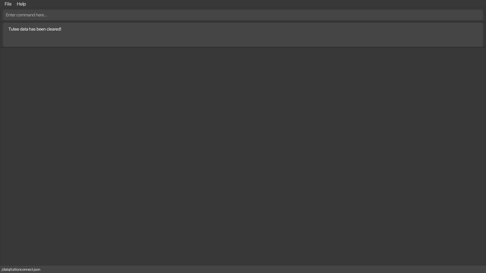
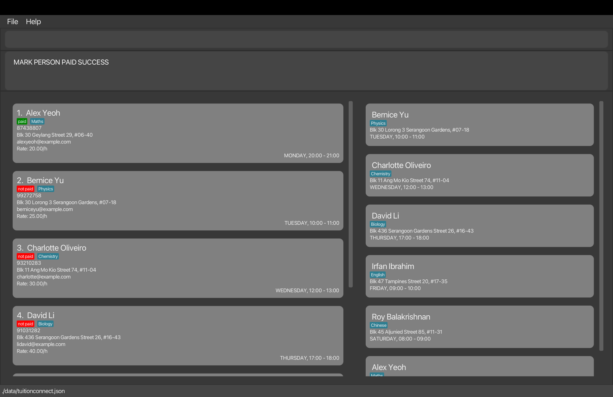
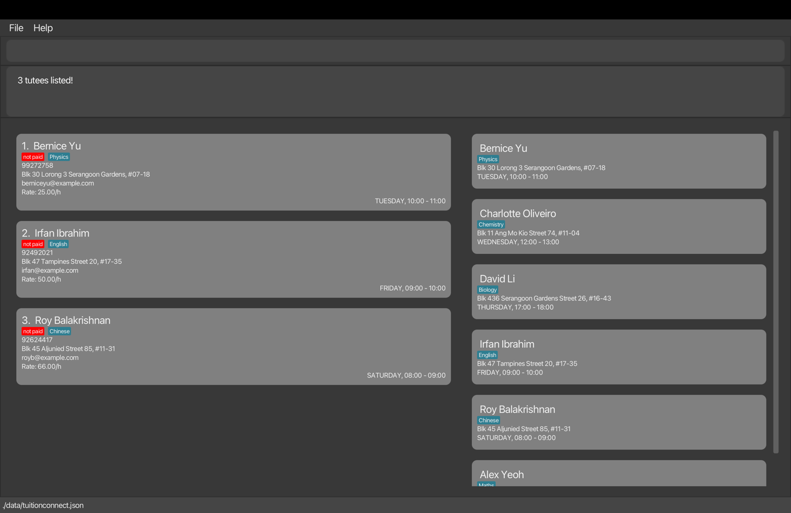
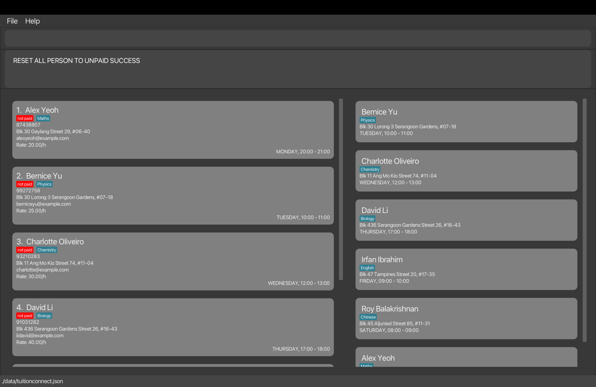
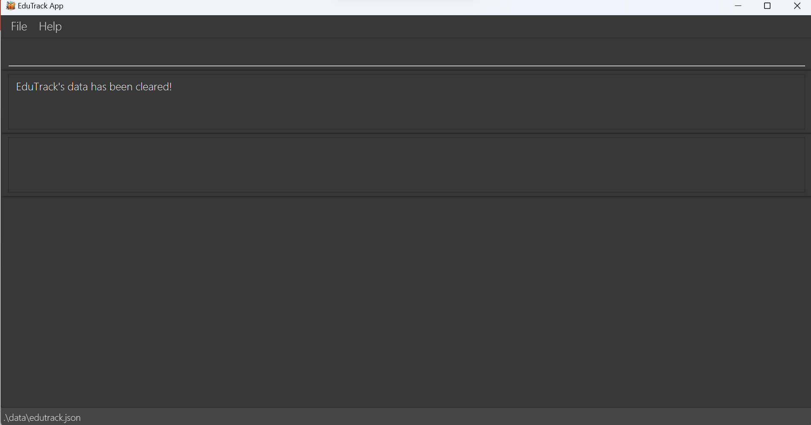

# Welcome to TuitionConnect's User Guide!
:rocket: Introducing **TuitionConnect**: Revolutionizing your Tutoring Business! :rocket:

Fed up with setting up numerous unorganized spreadsheets on Microsoft Excel or Google Sheets to handle the administrative side of you tutoring business?

Or feeling overwhelmed with the ugly-looking chaos of your Google Calendar as your number of teaching schedules increase?

Say goodbye to all this mess with the help of **TuitionConnect**: the ultimate desktop app designed to streamline the administrative and financial tasks of your tuition business!

This user guide will teach you how to install **TuitionConnect** from scratch, as well as providing information about the interesting features of **TuitionConnect**. 

## Table of Contents

<!-- TOC -->
* [Welcome to TuitionConnect's User Guide!](#welcome-to-tuitionconnects-user-guide)
  * [Table of Contents](#table-of-contents)
  * [Introduction](#introduction)
  * [Using this guide](#using-this-guide)
  * [Symbols and Syntax](#symbols-and-syntax)
  * [Layout](#layout)
  * [Quick start](#quick-start)
  * [Command Format](#command-format)
  * [Parameters Requirement](#parameters-requirement)
  * [Features](#features)
    * [Viewing help : `help`](#viewing-help--help)
    * [Adding a tutee : `add`](#adding-a-tutee--add)
    * [Listing tutees : `list`](#listing-tutees--list)
    * [Finding a tutee : `find`](#finding-a-tutee--find)
    * [Editing a tutee : `edit`](#editing-a-tutee--edit)
    * [Deleting a tutee: `delete`](#deleting-a-tutee-delete)
    * [Clearing all entries : `clear`](#clearing-all-entries--clear)
    * [Marking a tutee as paid : `paid`](#marking-a-tutee-as-paid--paid)
    * [Marking a tutee as unpaid : `unpaid`](#marking-a-tutee-as-unpaid--unpaid)
    * [Show all the unpaid tutees : `list unpaid`](#show-all-the-unpaid-tutees--list-unpaid)
    * [Mark all tutee as unpaid: `unpaidAll`](#mark-all-tutee-as-unpaid-unpaidall)
    * [Finding Free Time : `freeTime`](#finding-free-time--freetime)
    * [Undo previous command : `undo`](#undo-previous-command--undo)
    * [Redo previous undone command : `redo`](#redo-previous-undone-command--redo)
    * [Calculating Monthly Revenue: `rev`](#calculating-monthly-revenue-rev)
    * [Exiting the program : `exit`](#exiting-the-program--exit)
  * [FAQ](#faq)
  * [Known issues](#known-issues)
  * [Command summary](#command-summary)
  * [Glossary](#glossary)
    * [Alphanumeric](#alphanumeric)
    * [CLI](#cli)
    * [Command](#command)
    * [GUI](#gui)
    * [Index](#index)
    * [JAR file](#jar-file)
    * [Java](#java)
    * [JSON file](#json-file)
    * [Parameter](#parameter)
<!-- TOC -->

--------------------------------------------------------------------------------------------------------------------
## Introduction
TuitionConnect is a **desktop app** built for tutors and tutoring businesses to simplify the process of 
administration and finance management, optimized for use via a **Command Line Interface** (CLI) while 
still having the benefits of a Graphical User Interface (GUI). 

If you love to type, then **TuitionConnect** is the app for you! It helps you to track tutee-specific details, teaching-schedule management,
and other financial and administrative tasks faster than your old and conventional apps like Google Calendar or Microsoft Excel

Even if you are not a huge fan of typing, panic not! **TuitionConnect** was designed with you in mind! With this comprehensive User Guide,
paired up with simple and beginner-friendly features, anyone can learn how to use **TuitionConnect** in no time!

:sparkles: **Key Features:**
1. **Effortless Administration:** Manage your tutoring schedules, student details, and lesson plans in one central hub. No more endless scrolling through messy spreadsheets or confusing calendar views!
2. **Finance Made Easy**: Keep track of payments, and monitor your earnings effortlessly. 
3. **Calendar Sanity**: Prevent clashes in your schedules, and find slots where you are available!

:bulb: **Make the Switch Today!**
Transform your tutoring experience with **TuitionConnect!** Jump straight to the [Quick Start Section](#quick-start) and experience **TuitionConnect** now!

## Using this guide
If you're feeling a bit lost, worry not!
This user guide is to assist you seamlessly incorporate this application into your private tutoring business operations.

For first-time users, we understand how it feels to open up an application without proper instructions. Thus, we have
carefully crafted a [Quick Start](#quick-start) section in this guide to provide you with the knowledge it takes to 
start using TuitionConnect for your business.

The [Layout](#layout) will also help you understand the different components of TuitionConnect's GUI.

Eager to learn more about what our application can do? Head over to the [Command Format](#command-format) section to 
learn more about the general formats of the commands and getting yourself prepared before 
delving into the [Features](#features) section where you are in for the ride of your life! The Features section contains
the in-depth explanation for each command's format and use cases.

At last, we have also included a [Command Summary](#command-summary) section for when you become proficient at using
TuitionConnect to refer quickly to any commands that you may need!

Still unsure about the more technical terms used in this guide? Fret not, as we also provide a [glossary](#glossary)
to better understand all the technical jargons!

## Symbols and Syntax

Throughout this User Guide, there might 

| Symbol/Syntax                                   | Meaning                                                                                                                                         |
|-------------------------------------------------|-------------------------------------------------------------------------------------------------------------------------------------------------|
| :information_source: **Notes**                  | Information that you need to pay attention to.                                                                                                  |
| :bulb: **Tip**                                  | Information that you may find helpful.                                                                                                          |
| :exclamation: **Caution**                       | Information that you need to know before executing a [command](#command)                                                                        |
| `Highlighted text block`                        | [Commands](#command) or [parameters](#parameter) that you can enter into our application, or text that is directly displayed in our application |
| [Hyperlinked text in blue](#symbols-and-syntax) | When it is pressed, it should lead you to another section in the document or to an external link.                                               |

## Layout
The image below describes TuitionConnect's layout with some description for each component.

## Quick start

1. Ensure you have Java `11` or above installed in your Computer.

2. Download the latest `TuitionConnect.jar` from [here](https://github.com/AY2324S1-CS2103T-F10-4/tp/releases).

3. Copy the file to the folder you want to use as the _home folder_ for your TuitionConnect.

4. Open a command terminal, `cd` into the folder you put the jar file in, and use the `java -jar TuitionConnect.jar` command to run the application. 
   A GUI similar to the below should appear in a few seconds. The left list contains information about your tutees. The right list displays your teaching schedule for the next 7 days. Note how the app contains some sample data. 
   

5. Type the command in the command box and press Enter to execute it. e.g. typing **`help`** and pressing Enter will open the help window. 
   Some example commands you can try:

   * `list` : Lists all tutees.

   * `add n/John Doe p/98765432 e/johnny@example.com a/John street, block 123, #01-01 sb/Primary 4 Math d/wed b/1500 end/1600 pr/20.00` : Adds a tutee named `John Doe` to the list.

   * `delete 3` : Deletes the 3rd tutee shown in the current list.

6. Refer to the [Features](#features) below for details of each command.

## Command Format

* Words in `UPPER_CASE` are the parameters to be supplied by the user. 
  e.g. in `add n/NAME`, `NAME` is a parameter which can be used as `add n/John Doe`.

* Items in square brackets are optional. 
  e.g `list [DAY]` can be used as `list` or as `list Mon`.

* Parameters can be in any order. 
  e.g. if the command specifies `n/NAME sb/SUBJECT`, `sb/SUBJECT n/NAME ` is also valid.

* Extraneous parameters added after commands that do not take in parameters (such as `help`, `list`, `exit`, `undo`, `redo` and `clear`) will be ignored. 
  e.g. if the command typed is `undo 123`, it will be interpreted as `undo`.

## Parameters Requirement
Here are the [parameter](#glossary) requirements of commonly used parameters by [commands](#glossary) in the [**Features**](#features) section below.

| Parameter      | Description                                                 | Requirement / Remarks                                                                                                                                                                                                                                |
|----------------|-------------------------------------------------------------|------------------------------------------------------------------------------------------------------------------------------------------------------------------------------------------------------------------------------------------------------|
| **`NAME`**     | Name of tutee                                               | [Alphanumeric](#glossary) and may contain spaces                                                                                                                                                                                                     |
| **`DATE`**     | Date of the upcoming application task                       | In **dd-mm-yyyy** format                                                                                                                                                                                                                             |
| **`PHONE`**    | Contact number of tutee                                     | Any number at least 3 digits long                                                                                                                                                                                                                    |
| **`EMAIL`**    | Email address of tutee                                      | In **XXXXXXXX@emaildomain** format   Example: `johndoee@gmail.com`                                                                                                                                                                                |
| **`ADDRESS`**  | Address of the tutee                                        | [Alphanumeric](#glossary) and may contain spaces                                                                                                                                                                                                     |
| **`SUBJECT`**  | Subject of the tutee                                        | [Alphanumeric](#glossary) and may contain spaces                                                                                                                                                                                                     |
| **`DAY`**      | Day of weekly recurring lesson of the tutee                 | Full name of day or first three letters of the full name   **Non-case sensitive**   Example: `Mon`/`Monday`/`monday`                                                                                                                           |
| **`BEGIN`**    | Begin time of a tutee's weekly recurring lesson             | In **HHMM** format                                                                                                                                                                                                                                   |
| **`END`**      | End time of a tutee's weekly recurring lesson               | In **HHMM** format                                                                                                                                                                                                                                   |
| **`PAYRATE`**  | dollars per hour you make teaching this tutee               | Numbers only   Numbers must be **non-negative**                                                                                                                                                                                                   |
| **`INDEX`**    | The index number of the tutee shown in the tutee list panel | Used in [`delete`](#deleting-a-tutee-delete) [`edit`](#editing-a-tutee--edit) [`unpaid`](#marking-a-tutee-as-unpaid--unpaid) and [`paid`](#marking-a-tutee-as-paid--paid) commands   Must be a **positive number**   Example: (1,2,3,...)   |
| **`DURATION`** | The duration of a time slot in **minutes**                  | Used in [`freeTime`](#finding-free-time--freetime) Must be a **positive integer**   Example: (60,120,...)                                                                                                                                      |

 

## Features

### Viewing help : `help`

**Description**: Shows a message that helps redirects you to the user guide.

**Format**: `help`

**Sample Execution**: `help`

### Adding a tutee : `add`

**Description**: Adds a tutee into the list.

**Format**: `add n/NAME p/PHONE_NUMBER e/EMAIL a/ADDRESS sb/SUBJECT d/DAY b/BEGIN e/END pr/PAYRATE`

:exclamation: Things that can cause the `add` command to fail:
1. Inserting invalid inputs into the add command.
   - :bulb: Check the [Parameter Requirements](#parameters-requirement) for valid parameter inputs.
2. Adding a tutee that will result in duplicate tutees.
   - :information_source: Two tutees are considered duplicates if they have the same name and phone number
3. Adding a tutee that will result in clashing schedules.
   - :bulb: Use the [`freeTime` command](#finding-free-time--freetime) to list down timings when you are available and prevent schedule clashses.

**Examples**:
* `add n/John Doe p/98765432 e/johnny@example.com a/John street, block 123, #01-01 sb/Primary 4 Math d/wed b/1500 end/1600 pr/20.00`
* `add n/Betsy Crowe p/92939402 e/betsycrowe@example.com a/Newgate Prison sb/Secondary 3 Physics d/mon b/1900 end/1930 pr/35.00`

**Sample Execution**: `add n/Betsy Crowe p/92939402 e/betsycrowe@example.com a/Newgate Prison sb/Secondary 3 Physics d/mon b/1900 end/1930 pr/35.00`

### Listing tutees : `list`

**Description**: View the tutees that you are currently teaching.

**Format**: `list [DAY]`

* :information_source: The `DAY` parameter is optional.
  * Without stating a specified `DAY`, `list` will display all of your tutees
  * When `DAY` is specified, only tutees whose lessons matches the specified `DAY` will be displayed

* :exclamation: If the `DAY` parameter does not adhere to the specified format, the system will treat this as an invalid command
  - :bulb: Check the [Parameter Requirements](#parameters-requirement) for valid parameter inputs.

**Examples**:
* `list`
* `list monday`

**Sample Execution**:  `list monday`

### Finding a tutee : `find`

**Description** : Find tutees in the current list by specifying their names and/or subject.

**Format**: `find n/[NAME] sb/[SUBJECT]`

:information_source: Find requires at least one of the two fields to be able to find for tutees.

:information_source: Both n/ and sb/ prefixes take one word as input each.

:exclamation: Things that can cause `find` command to fail:
1. Inserting invalid inputs into the find command.
   - :bulb: Check the [Parameter Requirements](#parameters-requirement) for valid parameter inputs.
2. Inserting multiple word inputs for any of the two fields
   - :exclamation: As mentioned above, both prefixes can only take one word each as input.

**Examples**:
* `find n/Alex`
* `find sb/Maths`
* `find n/Alex sb/Maths`

**Sample Execution**: `find n/Alex sb/Maths`

### Editing a tutee : `edit`

**Description**: Edit a tutee in the current list.

**Format**: `edit INDEX n/NAME p/PHONE_NUMBER e/EMAIL a/ADDRESS s/SUBJECTS d/DAY b/BEGIN end/END pr/PAYRATE`

:exclamation: Things that can cause `edit` command to fail:
1. Inserting invalid inputs into the find command.
    - :bulb: Check the [Parameter Requirements](#parameters-requirement) for valid parameter inputs.
2. Editing a tutee that will result in duplicate tutees.
    - :information_source: Two tutees are considered duplicates if they have the same name and phone number
3. Editing a tutee that will result in clashing schedules.
    - :bulb: Use the [`freeTime` command](#finding-free-time--freetime) to list down timings when you are available and prevent schedule clashses.

**Examples**:
* `edit 1 p/91234567 d/Sun`
* `edit 2 n/Betsy Crower a/Betsy street, block 110, #03-02`

**Sample Execution**: 

### Deleting a tutee: `delete`

**Description**: Deletes the specific tutee from the list.

**Format**: `delete INDEX`

:exclamation: Things that can cause `delete` command to fail:
1. Inserting invalid index into the delete command.
    - :information_source: Index should not be smaller than 1 and larger than
             the number of tutees in the list.

**Examples**:
* `list` followed by `delete 2` deletes the 2nd person in the list.

**Sample Execution**:

### Clearing all entries : `clear`

**Description**: Want to start from scratch? Clears all entries from the tutee list.

**Format**: `clear`

**Examples**:
* `clear`

**Sample Execution**:  `clear`

### Marking a tutee as paid : `paid`

**Description**: Mark the specific tutee as paid in the list.

**Format**: `paid INDEX`

* **`INDEX`**: Numbers between 1 to the number of people inside the list.

Examples:
* `list` followed by `paid 1` marks the first person as paid in the list.

### Marking a tutee as unpaid : `unpaid`

**Description**: Mark the specific tutee as not paid in the list.

**Format**: `unpaid INDEX`

* **Index**: Numbers between 1 to the number of people inside the list.

Examples:
* `list` followed by `unpaid 2` marks the 2nd person as not paid in the list.

### Show all the unpaid tutees : `list unpaid`

**Description**: Shows all the unpaid tutees in your list.

Format: `list unpaid`

### Mark all tutee as unpaid: `unpaidAll`

**Description** : Mark all tutees in the current displayed list as not paid.

Format: `unpaidAll`

### Finding Free Time : `freeTime`

**Description**: Finds timeslots when you are free in your schedule.

**Format**: `freeTime d/DAY dur/DURATION b/BEGIN end/END`

:bulb: Tip on how to use this command: I want to know when I'm free on `DAY` between `BEGIN` and `END` for at least `DURATION` minutes long.

**Example:**
  - `freeTime d/Sat dur/120 b/0800 end/2200`
    - :information_source: the command above will find timeslots when the user is free on `Sat` between `0800` and `2200`, where each timeslot is at least `120` minutes long.

**Sample Execution**: `freeTime d/Sat dur/120 b/0800 end/2200`

### Undo previous command : `undo`

**Description**: Typed something wrong? Undo the most recent command that can modify the tutee data.

**Format**: `undo`

* :information_source: You can only undo `add`,`clear`,`delete`,`edit`,`redo`,`paid`,`unpaid` and `unpaidAll` commands.

**Examples**:
* `undo`

**Sample Execution**:  `clear` followed by `undo`
1. `clear` deletes all tutee in the tutee list

2. `undo` restores all cleared tutees

### Redo previous undone command : `redo`

**Description**: Changed your mind again? Redo the most recent command that was undone.

**Format**: `redo`

**Examples**:
* `redo`

### Calculating monthly revenue: `rev`

**Description**: Displays the total monthly revenue calculated from all tutees.

**Format**: `rev`

:bulb: `rev` command is time-sensitive (i.e. If the lesson occurrences varies between months, the value adjusts accordingly)

**Sample Execution:** `rev`

### Exiting the program : `exit`

Exits the program.

Format: `exit`

* The application window closes automatically after you type the command `exit`

--------------------------------------------------------------------------------------------------------------------

## FAQ

**Q**: How do I transfer my existing data to another machine? 
**A**: Overwrite the empty `tuitionconnect.json` file in the machine by deleting it and replacing it with the `tuitionconnect.json` that contains the data

--------------------------------------------------------------------------------------------------------------------

## Known issues

1. **When using multiple screens**, if you move the application to a secondary screen, and later switch to using only the primary screen, the GUI will open off-screen. The remedy is to delete the `preferences.json` file created by the application before running the application again.

--------------------------------------------------------------------------------------------------------------------

## Command summary

| Action          | Format, Examples                                                                                                                                                                                                                       |
|-----------------|----------------------------------------------------------------------------------------------------------------------------------------------------------------------------------------------------------------------------------------|
| **help**        | `help`                                                                                                                                                                                                                                 |
| **add**         | `add n/NAME p/PHONE_NUMBER e/EMAIL a/ADDRESS s/SUBJECT d/DAY b/BEGIN end/END pr/PAYRATE`   e.g., `add n/John Doe p/98765432 e/johnny@example.com a/John street, block 123, #01-01 sb/Primary 4 Math d/wed b/1500 end/1600 pr/20.00` |
| **delete**      | `delete INDEX`  e.g., `delete 3`                                                                                                                                                                                                    |
| **clear**       | `clear`                                                                                                                                                                                                                                |
| **edit**        | `edit INDEX n/NAME p/PHONE_NUMBER e/EMAIL a/ADDRESS s/SUBJECTS d/DAY b/BEGIN end/END pr/PAYRATE`  e.g.,`edit p/91234567 d/Sun`                                                                                                      |
| **list**        | `list`                                                                                                                                                                                                                                 |
| **find**        | `find n/[NAME] sb/[SUBJECT]`   e.g., `find n/Alex sb/Math`, `find n/Alex`, `find sb/Maths`                                                                                                                                          |
| **list by day** | `list DAY`   e.g., `list Monday`                                                                                                                                                                                                    |
| **paid**        | `paid INDEX`  e.g., `paid 1`                                                                                                                                                                                                        |
| **unpaid**      | `unpaid INDEX`  e.g., `unpaid 1`                                                                                                                                                                                                    |
| **list unpaid** | `list unpaid`                                                                                                                                                                                                                          |
| **unpaidAll**   | `unpaidAll`                                                                                                                                                                                                                            |
| **freeTime**    | `d/DAY dur/DURATION b/BEGIN end/END`                                                                                                                                                                                                   |
| **undo**        | `undo`                                                                                                                                                                                                                                 |
| **redo**        | `redo`                                                                                                                                                                                                                                 |
| **rev**         | `rev`                                                                                                                                                                                                                                  |
| **exit**        | `exit`                                                                                                                                                                                                                                 |

## Glossary

### Alphanumeric

Characters that are either a number or a letter.

### CLI

`CLI` is short for `Command Line Interface`, which is a text-based user interface where a program connects to the user.
Users interact with a system or application by the use of text commands, where the system will respond accordingly
depending on the command specified.

### Command

The specific instruction for the application to carry out.

### GUI

`GUI` is short for `Graphical User Interface`, which is a user interface that incorporates interactive visual 
components _(such as icons, etc)_. Users interact with a system or application by clicking on these components, where 
the system will respond accordingly to the user's actions by updating the user interface.

### Index

`Index` is the position of an item inside the list. If the `item` is at index 1, then we say that it is the first 
item on the list.

### JAR file

`JAR` is short for `Java ARchive`, which is a file format that is used to package the files to run TuitionConnect. 
Not only that, `JAR` files are also executables, meaning that it can be run by simply double-clicking the `JAR` file.

### Java
`Java` is the programming language used to develop TuitionConnect. 
A version of `Java` which is `Java 11` or higher is a requisite to run TuitionConnect on your devices.

### JSON file

`JSON` is short for JavaScript Object Notation, mainly utilized for storing data of users in TuitionConnect. 
These type of files are lightweight and text-based, making it suitable for both humans to read and write, 
as well as machines to parse and generate.

### Parameter

`Parameter`s are the inputs that a user can provide for a particular part of a command. As an example, for the field 
`n/NAME` of add command, `NAME` can be substituted with the input that you want to specify (such as n/John or n/Alice). 

[Back to top &#8593;](#welcome-to-tuitionconnects-user-guide)
