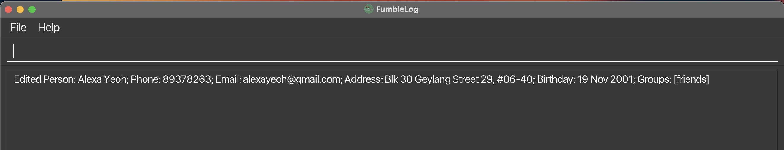
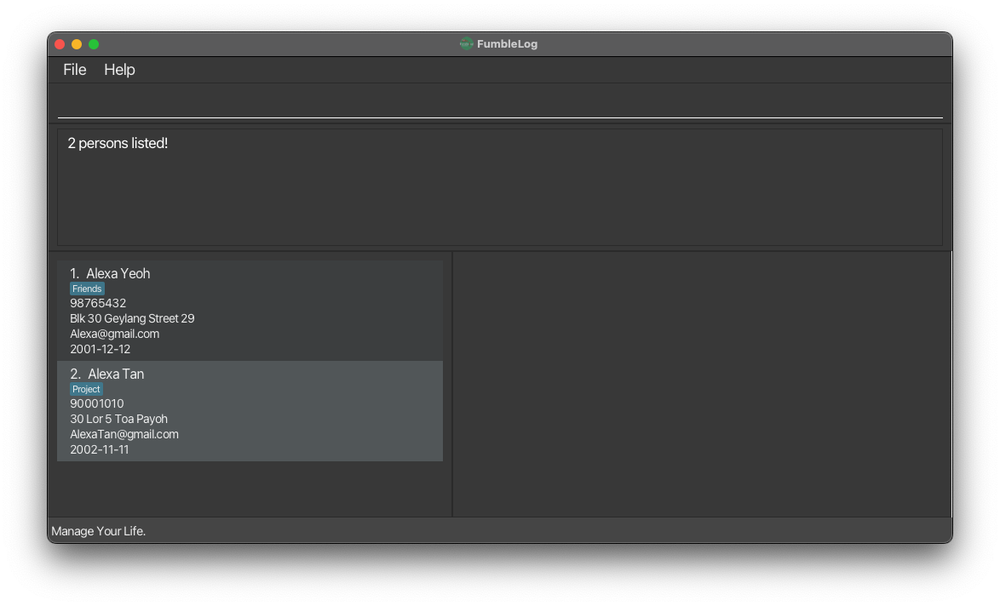

FumbleLog is a **productivity desktop application** built to for **NUS Computing students** to help you manage contacts and track events. 
It is designed to be an easy-to-use, one-stop platform for all your scheduling needs.

In this user guide, you will learn the basics of our application and how you can use it to manage your tasks and interpersonal relationships better.

# Table of Contents
* Table of Contents
{:toc}

--------------------------------------------------------------------------------------------------------------------

# Quick start

**1. Ensure you have the right environment.**
- Before you begin, make sure you have Java `11` or above installed in your computer. If not, you can download it from [here](https://www.oracle.com/sg/java/technologies/javase/jdk11-archive-downloads.html).

**2. Download our FumbleLog Application.**
- Visit the official FumbleLog release page on Github [here](https://github.com/AY2324S1-CS2103T-T12-2/tp/releases).
- Download the latest version of `fumblelog.jar` from the release page.

**3. Set up your home folder.**
- Choose a folder on your computer where you want to store you FumbleLog application, or create a new folder.
- Copy the `fumblelog.jar` file into the folder you have chosen or created.

**4. Launch the application.**
- Open a command terminal (Command Prompt or Terminal, depending on your operating system), use the `cd` command to navigate to the folder where you have placed the `fumblelog.jar` file.
- Run the application using the command: `java -jar fumblelog.jar`. You should now be able to see the FumbleLog user interface!
 
   Note how the app contains some sample data. 
   

**5. Try out some simple commands!**
- Type commands into the command box and press `Enter` to execute it. e.g. typing **`help`** and pressing `Enter` will open the help window. 
   Some example commands you can try:

   * `list_persons` : Lists all persons stored in FumbleLog.

   * `add_person n/John Doe` : Adds a person named `John Doe` to the FumbleLog persons list.

   * `delete 3` : Deletes the 3rd person shown in the current persons list.

   * `exit` : Exits FumbleLog application.

**6. Learn more advanced commands.**
- Refer to [Features](#features) below for more details of FumbleLog's commands.

[Scroll back to Table of Contents](#table-of-contents)

--------------------------------------------------------------------------------------------------------------------

# Features

**:information_source: Notes about the command format:** 

* Words in `UPPER_CASE` are the parameters to be supplied by the user. 
  e.g. in `add_person n/NAME`, `NAME` is a parameter which can be used as `add_person n/John Doe`.

* Items in square brackets are optional. 
  e.g `n/NAME [g/GROUP]` can be used as `n/John Doe g/friend` or as `n/John Doe`.

* Items with `…`​ after them can be used multiple times including zero times. 
  e.g. `[g/GROUP]…​` can be used as ` ` (i.e. 0 times), `g/friend`, `g/friend g/family` etc.

* Parameters can be in any order. 
  e.g. if the command specifies `n/NAME p/PHONE_NUMBER`, `p/PHONE_NUMBER n/NAME` is also acceptable.

* Extraneous parameters for commands that do not take in parameters (such as `help`, `list_all`, `exit` and `clear`) will be ignored. 
  e.g. if the command specifies `help 123`, it will be interpreted as `help`.

* If you are using a PDF version of this document, be careful when copying and pasting commands that span multiple lines as space characters surrounding line-breaks may be omitted when copied over to the application.

### Viewing help : `help`

Shows a message explaining how to access the user guide for help.

Format: `help`

[Scroll back to Table of Contents](#table-of-contents)

## Commands for Persons

### Adding a person: `add_person`

Adds a person to the FumbleLog.

Format: `add_person n/NAME [p/PHONE_NUMBER] [e/EMAIL] [a/ADDRESS] [b/BIRTHDAY] [r/REMARK] [g/GROUP]…​`

    :bulb: **Tip:**
    A person can have any number of groups (including 0)

Examples:
* `add_person n/John Doe p/98765432 e/johnd@example.com a/John street, block 123, #01-01 b/2023-09-30 g/friend g/partner`
* `add_person n/Betsy Crowe e/betsycrowe@example.com a/Newgate Prison p/1234567`
* `add_person n/Jonathan`

Acceptable values for each parameter:
* `n/NAME`: Name of the person (Compulsory)
* `[p/PHONE_NUMBER]`: A valid phone number
* `[e/EMAIL]`: A valid email address
* `[a/ADDRESS]`: Address of the person
* `[b/BIRTHDAY]`: A valid date in the format `yyyy-MM-dd`
* `[r/REMARK]`: A remark about the person
* `[g/GROUP]`: A group for the person to be categorised into

    :bulb: **Tip:**
    The parameters are optional, but at least the name must be provided.

Expected output when a command succeeds:
* Input: `add_person n/james p/999 e/example@gmail.com a/1 Computing Drive b/2001-09-20`
* Output: `New person added: james; Phone: 999; Email: example@gmail.com; Address: 1 Computing Drive; Birthday: Sep 20 2001  `

Expected output when the command fails
* `Invalid command format! add_person: Adds a person to the FumbleLog. Parameters: n/NAME [p/PHONE] [e/EMAIL] [a/ADDRESS] [b/BIRTHDAY] [g/GROUP]…​`

[Scroll back to Table of Contents](#table-of-contents)

### Editing a person : `edit_person`

Edits an existing person in the FumbleLog.

Format: `edit_person PERSON_INDEX [n/NAME] [p/PHONE] [e/EMAIL] [a/ADDRESS] [b/BIRTHDAY] [r/REMARK] [g/GROUP]…​`

* **At least one of the optional parameters must be provided.**
* Existing values will be updated to the input values.
* When editing groups, the existing groups of the person will be removed i.e adding of groups is not cumulative.
* You can remove all the person’s groups by typing `g/` without specifying any groups after it.
* When you edit a person's name, the person's name will be updated in all [events](#commands-for-events) that the person is assigned to.

Examples:
*  `edit_person 1 p/91234567 e/johndoe@example.com` Edits the phone number and email address of the 1st person to be `91234567` and `johndoe@example.com` respectively.
*  `edit_person 2 n/Betsy Crower g/` Edits the name of the 2nd person to be `Betsy Crower` and clears all existing groups. Any events that Betsy Crower is assigned to is also updated with this new name.
*  `edit_person 3 n/Betsy Crower b/2023-09-29` Edits the name of the 3rd person to be `Betsy Crower` and changes the birthday to 29th Sep 2023. Any events that Betsy Crower is assigned to is also updated with this new name.

Acceptable values for each parameter:
* `PERSON_INDEX`: A positive integer
* `[n/NAME]`: Name of the person
* `[p/PHONE]`: A valid phone number
* `[e/EMAIL]`: A valid email address
* `[a/ADDRESS]`: Address of the person
* `[b/BIRTHDAY]`: A valid date in the format `yyyy-MM-dd`
* `[r/REMARK]`: Remark about the person
* `[g/GROUP]`: Text for the tag of the person

Expected output when a command succeeds:
* Input: `edit_person 1 n/Alexa Yeoh`
* Output: `Edited Person: Alexa Yeoh; Phone: 87438807; Email: alexyeoh@example.com; Address: Blk 30 Geylang Street 29, #06-40; groups: [friends]`

Expected output when the command fails:
* `Invalid command format! edit_person: Edits the details of the person identified by the index number used in the displayed person list. Existing values will be overwritten by the input values. Parameters: INDEX (must be a positive integer) [n/NAME] [p/PHONE] [e/EMAIL] [a/ADDRESS] [b/BIRTHDAY] [g/GROUP]…​`

[Scroll back to Table of Contents](#table-of-contents)

### Deleting a person : `delete_person`

Deletes the specified person from FumbleLog.
When a person is deleted, any [events](#commands-for-events) that the person is assigned to will also be updated, i.e. the person will be unassigned from the event.

Format: `delete_person PERSON_INDEX`

* Deletes the person at the specified `PERSON_INDEX`.
* The index refers to the index number shown in the displayed person list.
* The index **must be a positive integer** 1, 2, 3, …​

Examples:
* `list_all` followed by `delete_person 2` deletes the 2nd person in the person list.
* `find_all Betsy` followed by `delete_person 1` deletes the 1st person in the results of the `find` command. i.e Any person named `Betsy` at index `1` will be deleted.

Acceptable values for each parameter:
* `PERSON_INDEX`: A positive integer

Expected output when a command succeeds:
* Input: `delete_person 1`
* Output: `Deleted Person: Roy Balakrishnan; Phone: 92624417; Email: royb@example.com; Address: Blk 45 Aljunied Street 85, #11-31; groups: [colleagues]`

Expected output when the command fails:
* `Invalid command format! delete_person: Deletes the person identified by the index number used in the displayed person list. Parameters: INDEX (must be a positive integer)Example: delete 1`

[Scroll back to Table of Contents](#table-of-contents)

### Locating persons by name or group: `find_person`

Find persons whose names or groups contain any of the given keywords.

Format: `find_person KEYWORD [MORE_KEYWORDS]`

* The search is case-insensitive. e.g `hans` will match `Hans`
* The order of the keywords does not matter. e.g. `Hans Bo` will match `Bo Hans`
* Only full words will be matched e.g. `Han` will not match `Hans`
* Persons matching at least one keyword will be returned (i.e. `OR` search).
  e.g. `Hans Bo` will return `Hans Gruber`, `Bo Yang`
* `find_person` searches the name of the `Person` and `Group` that they are assigned 
to and will display them accordingly.

Examples:
* `find_person John` returns `john` and `John Doe`
* `find_person friends` returns `Alex Yeoh` as he belongs to the `friends` group.
 

  

[Scroll back to Table of Contents](#table-of-contents)

### Listing all persons : `list_persons`

Displays all persons stored in FumbleLog.

Format: `list_persons`

Expected output when a command succeeds:
* Input: `list_persons`
* Output: `Listed all persons`
* You should see a list of all persons under the Persons column.

[Scroll back to Table of Contents](#table-of-contents)

## Commands for Events

### Adding an event : `add_event`

Add an event to the events list in FumbleLog.

Format: `add_event m/EVENT_NAME d/DATE [s/START_TIME] [e/END_TIME] [n/PERSON_NAME]... [g/GROUP]...`

- `START_TIME` and `END_TIME` are optional.
- `PERSON_NAME` is optional and multiple persons can be added at once, however only persons that exist can be added.
- `GROUP` is optional, however only groups that exist can be added.
- The given `DATE`, `START_TIME` and `END_TIME` cannot be a time in the past.
- The given `START_TIME` must be before the given `END_TIME`.
- If the meeting is added successfully, it will automatically be sorted by date and time with the earliest meeting at the top of the list.
- All dates are to be in the format `yyyy-MM-dd`. i.e. 2023-10-05 for 5th Oct 2023.
- All time are to be in the format `HHmm`. i.e. 1400 for 2pm.
- If the given `START_TIME` and `END_TIME` are not given, the default values are `0000` and `2359` respectively.

Example: 
* `add_event m/FumbleLog meeting d/2023-10-05 s/1500 e/1700 n/Ken g/CS2103T g/CS2101`
* `add_event m/FumbleLog presentation d/2023-10-30 g/Team2`

Acceptable values for each parameter:
* `m/EVENT_DETAILS`: Details of the event.
* `d/DATE`: A valid date in the format `yyyy-MM-dd`.
* `[s/START_TIME]`: A valid time in the format `HHmm`.
* `[e/END_TIME]`: A valid time in the format `HHmm`.
* `[n/PERSON_NAME]`: Name of the person to be assigned.
* `[g/GROUP]`: Name of the group to be assigned.

Expected output when the command succeeds:
* Input: `add_event m/FumbleLog meeting d/2023-10-05 s/1500 e/1700 n/Ken g/CS2103T g/CS2101`
* Output: `New event added: FumbleLog meeting; Date: 05 Oct 2023; Start Time: 15:00; End Time: 17:00; Persons involved: Ken; Groups involved: [CS2103T], [CS2101];`

Expected output when the command fails:
* `Invalid command format!
  add_event: Adds an event to the address book.
  Parameters: m/EVENT_NAME d/DATE [s/START_TIME] [e/END_TIME] [n/NAME]... [g/GROUP]...
  Example: add_event m/FumbleLog Meeting d/2020-10-30 s/1000 e/1200 n/Ken n/Yuheng g/Team2 `
* * `You cannot enter a time that is before the current time!` - When the given `DATE`, `START_TIME` and `END_TIME` is before the current time.
* `You cannot enter an end time that is before the start time!` - When the given `START_TIME` is after the given `END_TIME`.

[Scroll back to Table of Contents](#table-of-contents)

### Editing an event : `edit_event`

Edits an existing event in FumbleLog.

Format: `edit_event EVENT_INDEX [m/MEETING_DETAILS] [d/DATE] [s/START_TIME] [e/END_TIME] [n/PERSON_NAME]... [u/PERSON_NAME]... [g/GROUP]... [ug/GROUP]...`

* **At least one of the optional parameters required.**
* The input values will replace the existing values, except for `PERSON` AND `GROUP`.
* `PERSON` and `GROUP` edits are cumulative and will add to the current list of persons and groups.
  Use the unassign commands, i.e. `u/PERSON`, if you would like to unassign any person or group.
* If there are any changes to the meeting date and time, the meeting will be automatically sorted by date and time with the earliest meeting at the top of the list.
* All dates are to be in the format `yyyy-MM-dd`. i.e. 2023-10-05 for 5th Oct 2023
* All time are to be in the format `HHmm`. i.e. 1400 for 2pm.
* The given `DATE`, `START_TIME` and `END_TIME` cannot be a time in the past.

Examples:
* `edit_event 1 m/FumbleLog meeting d/2023-10-05 s/1500 e/1700`
* `edit_event 1 g/CS2103T g/CS2101`: Adds the groups CS2103T and CS2101 to the event.
* `edit_event 1 u/Ken`: Unassigns the person `Ken` from the event.

Acceptable values for each parameter:
* `EVENT_INDEX`: The index position of the event in the displayed event list.
* `[m/EVENT_DETAILS]`: Details of the event to be changed.
* `[d/DATE]`: A valid date in the format `yyyy-MM-dd`
* `[s/START_TIME]`: A valid time in the format `HHmm`
* `[e/END_TIME]`: A valid time in the format `HHmm`
* `[n/PERSON_NAME]`: Name of the person(s) to be assigned.
* `[u/PERSON_NAME]`: Name of the person(s) to be unassigned.
* `[g/GROUP]`: Name of the group(s) to be assigned.
* `[ug/GROUP]`: Name of the group(s) to be unassigned.

Expected output when the command succeeds:
* Input: `edit_event 1 m/tP week 3 meeting d/2023-10-05 s/1500 e/1700`
* Output: `Edited event: tP week 3 meeting; Date: 05 Oct 2023; Start Time: 15:00; End Time: 17:00; `

Expected output when the command fails:
* `Invalid command format!
  edit_event: Edits the details of the event identified by the index number used in the displayed event list.
  Existing values will be overwritten by the input values, except for the list of assigned persons and the list of assigned groups
  Parameters: INDEX (must be a positive integer) [m/EVENT_DETAILS] [d/DATE] [s/START_TIME] [e/END_TIME] [n/NAME]... [u/NAME]... [g/GROUP]... [ug/GROUP]...
  Example: edit_event 1 m/FumbleLog Meeting d/2023-10-13 n/Ken g/Team2 `
* `You cannot enter a time that is before the current time!` - When the given `DATE`, `START_TIME` and `END_TIME` is before the current time.
* `You cannot enter an end time that is before the start time!` - When the given `START_TIME` is after the given `END_TIME`.

[Scroll back to Table of Contents](#table-of-contents)

### Deleting an event : `delete_event`

Deletes a specified event from the FumbleLog.

Format: `delete_event EVENT_INDEX`

* Deletes the meeting at the specified `EVENT_INDEX`.

Examples:
* `delete_event 1`: Deletes the 1st event in the event list.

Acceptable values for each parameter:
* `EVENT_INDEX`: The index position of the event in the displayed event list.

Expected output when the command succeeds:
* Input: `delete_event 1`
* Output: `Deleted Event: tP week 3 meeting; Date: 05 Oct 2023; Start Time: 15:00; End Time: 17:00; Groups involved: [Team1];`

Expected output when the command fails:
* `Invalid command format!
  delete_event: Deletes the event identified by the index number used in the displayed event list.
  Parameters: INDEX (must be a positive integer)
  Example: delete_event 1`

[Scroll back to Table of Contents](#table-of-contents)

### Locating events by name, group or person: `find_event`

Find events whose names or groups contain any of the given keywords.

Format: `find_event KEYWORD [MORE_KEYWORDS]`

* The search is case-insensitive. e.g `meeting` will match `Meeting`
* Only full words will be matched e.g. `Han` will not match `Hans`
* Events matching at least one keyword will be returned (i.e. `OR` search).
  e.g. `Meetings TP` will return `Meetings`, `TP deadline`
* `find_event` searches the name of the `Event`, `Group` and `Person` that they are assigned
  to and will display them accordingly.

Examples:
* `find_event meeting` returns `meeting` and `CS2103T meeting`
* `find_event friends` returns `meeting` if it contains the `friends` group.
   

[Scroll back to Table of Contents](#table-of-contents)

### Listing all events: `list_events`

Displays all events stored in FumbleLog

Format: `list_events`

Expected output when a command succeeds:
* Input: `list_events`
* Output: `Listed all events`
* You should see a list of all events under the Events column.

[Scroll back to Table of Contents](#table-of-contents)

## General commands

### Show all upcoming events and birthdays : `remind`

Shows all events and birthdays that are happening in the next specified number of days.

Format: `remind [NUMBER_OF_DAYS]` 

* Shows all events and birthdays happening in the next `[NUMBER_OF_DAYS]` days.
* If `[NUMBER_OF_DAYS]` is not specified, the default value is 7 days.
* `[NUMBER_OF_DAYS]` **must be a positive integer** 1,2,3, ...

Examples:
* `remind` shows all events and birthdays happening in the next 7 days.
* `remind 3` shows all events and birthdays happening in the next 3 days.

Expected output when the command succeeds:
* Input: `remind`
* Output: `Showing all birthdays and events happening in the next 7 days: `

Expected output when the command fails:
* `Invalid command format!
  remind: Reminds the user of the upcoming birthdays and events in the next n number of days. If no index is given, the default number of days is 7.
  Parameters: INDEX (must be a positive integer)`
  Example: `remind 1`

[Scroll back to Table of Contents](#table-of-contents)

### Finding persons and events: `find_all`

Find persons and events whose names or groups contain any of the given keywords.

Format: `find_all KEYWORD [MORE_KEYWORDS]`

* The search is case-insensitive. e.g `hans` will match `Hans`
* The order of the keywords does not matter. e.g. `Hans Bo` will match `Bo Hans`
* Only full words will be matched e.g. `Han` will not match `Hans`
* Persons and events matching at least one keyword will be returned (i.e. `OR` search).
  e.g. `Hans Bo` will return `Hans Gruber`, `Bo Yang`

Examples:
* `find_all John` returns `john` and `John Doe` in the persons list and `John's birthday` in the events list.
* `find_all friends` returns `Alex Yeoh` as he belongs to the `friends` group in the persons list 
and `CS2103T meeting` as it contains the `friends` group in the events list.

[Scroll back to Table of Contents](#table-of-contents)

### Listing all persons and events: `list_all`

Displays all persons and events stored in FumbleLog

Format: `list_all`

Expected output when a command succeeds:
* Input: `list_all`
* Output: `Listed all persons and events`
* You should see a list of all persons and events under the persons and events column.

[Scroll back to Table of Contents](#table-of-contents)

### Clearing all entries : `clear`

Clears all contacts and events from the FumbleLog. Be very sure before using this command as it cannot be undone. 

Format: `clear`

### Exiting the program : `exit`

Exits the program.

Format: `exit`

[Scroll back to Table of Contents](#table-of-contents)

# How we manage your data

### Saving the data

FumbleLog data are saved in the hard disk automatically after any command that changes the data. There is no need to save manually.

### Editing the data file

FumbleLog data are saved automatically as a JSON file `[JAR file location]/data/addressbook.json`. Advanced users are welcome to update data directly by editing that data file.

:exclamation: **Caution:**
If your changes to the data file makes its format invalid, FumbleLog will discard all data and start with an empty data file at the next run. Hence, it is recommended to take a backup of the file before editing it.

### Archiving data files `[coming in v2.0]`

_Details coming soon ..._

[Scroll back to Table of Contents](#table-of-contents)

--------------------------------------------------------------------------------------------------------------------

# FAQ

**Q**: How do I transfer my data to another Computer? 
**A**: Install the app in the other computer and overwrite the empty data file it creates with the file that contains the data of your previous FumbleLog home folder.

[Scroll back to Table of Contents](#table-of-contents)

--------------------------------------------------------------------------------------------------------------------

# Known issues

1. **When using multiple screens**, if you move the application to a secondary screen, and later switch to using only the primary screen, the GUI will open off-screen. The remedy is to delete the `preferences.json` file created by the application before running the application again.

[Scroll back to Table of Contents](#table-of-contents)

--------------------------------------------------------------------------------------------------------------------

# Command summary

### Commands for Persons

| Action            | Format, Examples                                                                                                                                                                                             |
|-------------------|--------------------------------------------------------------------------------------------------------------------------------------------------------------------------------------------------------------|
| **Add Person**    | `add n/NAME [p/PHONE_NUMBER] [e/EMAIL] [a/ADDRESS] [b/BIRTHDAY] [r/REMARK] [g/GROUP]…​`   e.g., `add_person n/James Ho p/22224444 e/jamesho@example.com a/123, Clementi Rd, 1234665 g/friend g/colleague` |
| **Edit Person**   | `edit_person PERSON_INDEX [n/NAME] [p/PHONE_NUMBER] [e/EMAIL] [a/ADDRESS] [r/REMARK] [g/GROUP]…​`  e.g.,`edit_person 2 n/James Lee e/jameslee@example.com`                                                |
| **Delete Person** | `delete_person PERSON_INDEX`  e.g., `delete_person 3`                                                                                                                                                     |
| **Find Person**   | `find_person KEYWORD [MORE_KEYWORDS]`  e.g., `find_person James Jake`                                                                                                                                     |
| **List Persons**  | `list_persons`                                                                                                                                                                                               |

### Commands for Events

| Action           | Format, Examples                                                                                                                                                                                                                                    |
|------------------|-----------------------------------------------------------------------------------------------------------------------------------------------------------------------------------------------------------------------------------------------------|
| **Add Event**    | `add_event m/EVENT_NAME d/DATE [s/START_TIME] [e/END_TIME] [n/PERSON_NAME]... [g/GROUP]...`  e.g., `add_event m/FumbleLog meeting d/2023-10-05 s/1500 e/1700 n/Ken g/CS2103T g/CS2101`                                                           |
| **Edit Event**   | `edit_event EVENT_INDEX [m/MEETING_DETAILS] [d/DATE] [s/START_TIME] [e/END_TIME] [n/PERSON_NAME]... [u/PERSON_NAME]... [g/GROUP]... [ug/GROUP]...`  e.g., `edit_event 1 m/tP week 3 meeting d/2023-10-05 s/1500 e/1700 n/Ken g/CS2103T g/CS2101` |
| **Delete Event** | `delete_event EVENT_INDEX`  e.g., `delete_event 1`                                                                                                                                                                                               |
| **Find Event**   | `find_event KEYWORD [MORE_KEYWORDS]`  e.g., `find_event meeting`                                                                                                                                                                                 |
| **List Events**  | `list_events`                                                                                                                                                                                                                                       |

### General commands

| Action       | Format, Examples                                             |
|--------------|--------------------------------------------------------------|
| **Remind**   | `remind [NUM_OF_DAYS]`   e.g.,`remind` or `remind 4`      |
| **List All** | `list_all`                                                   |
| **Find All** | `find_all KEYWORD [MORE_KEYWORDS]`  e.g., `find_all John` |
| **Clear**    | `clear`                                                      |
| **Exit**     | `exit`                                                       |
| **Help**     | `help`                                                       |

[Scroll back to Table of Contents](#table-of-contents)
