# LinkTree User Guide

LinkTree is a **desktop app optimized for developers engaged in startups** who require organized and streamlined 
methods for contact management. With LinkTree, swiftly connect with the right stakeholder, ensuring smooth 
project execution and superior collaboration.

This user guide is designed to help our users to understand and make the most of out of LinkTree. This guide is to 
provide clear and comprehensive instructions, to assist our users in understanding the core features and functions of
LinkTree application. It is your **companion** for unlocking the full potential of LinkTree to effectively manage your
teams.

**Value Proposition**:
LinkTree is the top contact solution for software professionals. Using our unique tag-based system and tree structure,
you can access contacts by roles and responsibilities instantly.

## Table of Contents
* [Introduction](#introduction)
  * [Target User Profile](#target-user-profile)
  * [How to use this Guide?](#how-to-use-this-guide)
* [Getting Started](#getting-started)
  * [Installation](#installation)
  * [Initial Setup](#initial-setup)
  * [Understanding the GUI](#understanding-the-gui)
  * [Tutorial on using our Commands](#tutorial-on-using-our-commands)
* [Features](#features)
  * [Date & Time Command](#date--time-command)
  * [Managing developers](#managing-developers)
    * [Add developer](#add-developer)
    * [Remove developer](#remove-developer)
    * [Edit developer](#edit-developer)
    * [Find developer](#find-developer)
    * [List developers](#list-developers)
  * [Managing teams](#managing-teams)
    * [Create teams](#create-teams)
    * [Add developer to team](#add-developers-to-team)
    * [Delete teams](#delete-team)
    * [Remove developer from team](#remove-developer)
    * [Edit team name](#edit-team-name)
    * [Edit team leader](#edit-team-leader)
    * [Find team](#find-team)
    * [List teams](#list-teams)
  * [Display tree](#display-tree)
  * [Help](#help)
  * [Reset the project](#reset-the-project)
  * [Exit the application](#exit-the-application)
* [Troubleshooting](#troubleshooting)
* [FAQs](#faqs)
* [Support](#support)
* [Known issues](#known-issues)
* [Command Summary](#command-summary)
* [Future Enhancement](#future-enhancement)

<page-nav-print />

--------------------------------------------------------------------------------------------------------------------

## Introduction

### Target User Profile
- Project managers and Developers who are engaged in startups.
- Collaborates frequently with multiple teams or departments.
- Requires quick access to contact details of other team members based on their roles and responsibilities.
- Prefers an organized and streamlined method for contact management.
- Tech-savvy and open to adopting new tools for enhancing productivity.

### How to use this Guide?

**Navigating the Document**: This guide is divided into sections to help you quickly find the information you need. You
can use the table of contents to jump from one section to another section. Additionally, headings and subheadings are
used for easy navigation.

* Click [here](#table-of-contents) to go back to contents.
* Click [here](#features) to view all detailed features of our app.
* Already know how to use this guide and can't wait to start? [Get started](#getting-started)! 
* Want an overview of all the commands? Click [here](#command-summary)! 
* Any further questions that are unresolved? Check out our [FAQ](#faq)! 
* You may also contact us at [service@linktree.com](mailto:service@linktree.com) for further doubts!

**Formatting and Icons**: Throughout the guide, we use bold text and colors to emphasize key points and important terms.
Icons are used to draw your attention to noteworthy tips and additional information. 
Here are some symbols you might encounter in our guide, and their respective meanings:

[//]: # (Table inspired by NUSCoursemates https://ay2324s1-cs2103t-t17-4.github.io/tp/UserGuide.html)

| Symbol               | Meaning                                                                     |
|----------------------|-----------------------------------------------------------------------------|
| :information_source: | Note. Provides additional information.                                      |
| :bulb:               | Tip. Information that might better your experience.                         |
| :exclamation:        | Warning. Cautionary statement to prevent you from undesirable consequences. |

**:information_source: Note:** 
* These symbols (:information_source: :bulb: :exclamation:) will be encapsulated in a box as such.

 

--------------------------------------------------------------------------------------------------------------------

## Getting Started

### Installation

1. Ensure you have Java `11` or above installed on your Computer. 
Check out our [FAQ](#faq) if you are not sure how to download Java `11`.
2. LinkTree is compatible with all major operating systems, including Windows, macOS and Linux.
3. Download the latest `linktree.jar` from [here](https://github.com/AY2324S1-CS2103T-W11-4/tp/releases).

### Initial Setup

1. Open a command terminal, navigate to the folder where you have stored the downloaded jar file. Type the command
`java -jar linktree.jar` to run the application. A GUI similar to the one below should appear in a few seconds, containing some sample data:
   

2. Typing a command into the command box and hitting `Enter` will execute it. For example, try typing `help` into the command box and hit Enter.
It will open a new help window, that shows all the commands in linktree.

3. Refer to the [features](#features) section for details of each command.

### Understanding the GUI

 

* Linktree's GUI is simple and easy to understand!
1. **Command Box**: You'll have to type the commands in this box.
2. **Result Display**: Based on the inputs given, your result will be displayed in this box.
3. **Help Button**: Type `help` into the command box, and you will see a help window pop up, giving you the link to 
this UserGuide. The Result Display will also show a summary of commands.
4. **File Button**: Click the `File` button and then you will see a `exit` button to close the application.
5. **Developers Panel**: Lists all the existing developers (or a filtered list of developers after the `find` command, 
check out [find developer command](#find-developer) for more details).
6. **Teams Panel**: Lists all the teams (or a filtered list of developers after the `findteam` command,
check out [find team command](#find-team) for more details).

### Tutorial on using our Commands

| Commands                                    | Description                                                                                                                              |
|---------------------------------------------|------------------------------------------------------------------------------------------------------------------------------------------|
| `add`, `delete`, `find`, etc.               | The main command keyword.                                                                                                                |
| `n/` `tn/` `tl`                     | n/ - Prefix for developer names tn/ - Prefix for team names.   tl/ -Prefix for team leader name.                                 |
| `p/` `e/`  `a/`  `r/`  `t/` | p/ - Prefix for phone number  e/ - Prefix for email a/ - Prefix for address r/ - Prefix for remark t/ - Prefix for tags. |                                                                  |
| `[DeveloperName]`, `[Phone]`, etc.          | Arguments that follow the command.                                                                                                       |
| `(optional)`                                | Optional elements like Remark and Tags can be omitted.                                                                                   |                   |

Example - `add n/[Developer Name] p/[Phone Number] e/[Email] a/[Address] (OPTIONAL r/[Remark] t/Tags)`

Click [here](#table-of-contents) to go back to contents.

 

--------------------------------------------------------------------------------------------------------------------

## Features

Remember to check out how to use this guide [here](#how-to-use-this-guide).

 

### Date & Time Command

##### What this command does:
* The "Hi" command displays a welcome message along with the current date and time.

#### Command format: `Hi`

##### Features:

- You can use this command to check the date and time! Type in `hi` and hit enter!
- You can now see "Welcome to Linktree, Current date and time: MM-DD-YYYY HH:MM:SS" displayed on the UI.

##### Example usage:

When you enter the command (Hi):

  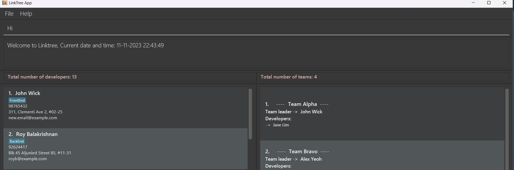

**:information_source: Note:** 
- Please ensure that the first letter of the command is uppercase. For instance, use `Hi` instead of `hi` or `HI`.
- The command does not take any additional arguments or keywords.
 

--------------------------------------------------------------------------------------------------------------------
**The following commands are for managing developers.** 
### Add command
##### What this command does:
* This command allows you to add a new developer to the addressbook.

##### Command format: 
* `add n/[Developer Name] p/[Phone Number] e/[Email] a/[Address] (OPTIONAL r/[Remark] t/Tags)`
  
##### Example usage:
* `add n/John p/89789678 e/John@gmail.com a/Singapore t/friend`
  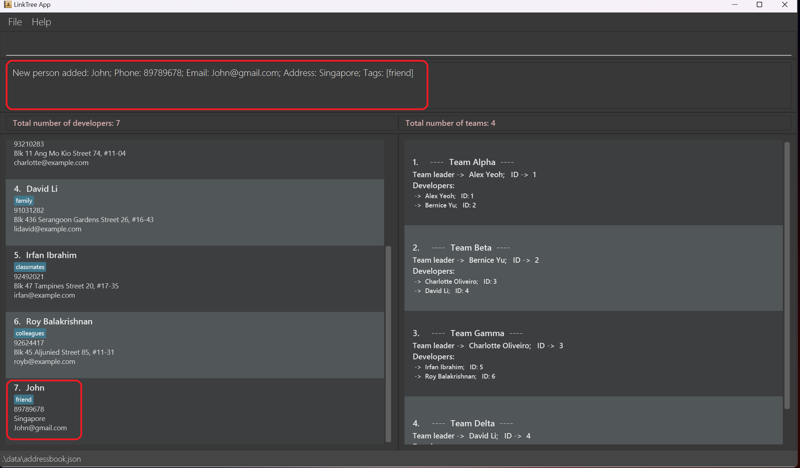
 
  
### Remove developer

##### What this command does:
* Performs deletion of existing developers from the addressbook.
##### Command format:
* `delete [index number]`

##### Example usage:
- For example, to delete the developer John from the list. First find the index number of John.
- In this example, the index of developer John is 7. So type, `delete 7`.
  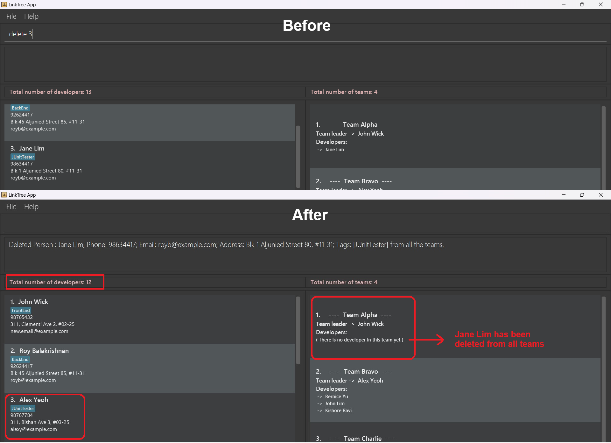

**:information_source: Note:** 
* You cannot delete a developer who is **team leader** for any of the teams. Inorder to delete that developer, we 
recommend you to change the team leader using `editTeamLeader` command. And then you can remove that developer from the 
team.
 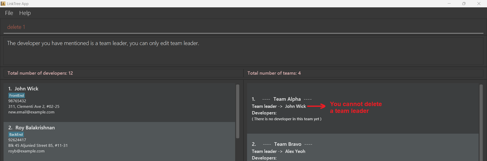

**:exclamation: Warning:** 
* Deleting a developer who is not a team leader will remove that developer from all the teams and also from list
of developers.

 

### Edit developer
#### What this command does:
* Edits personal information of an existing developer.
  - Command: `edit INDEX(must be a positive integer) [n/NAME] [p/PHONE] [e/EMAIL] [a/ADDRESS] [r/REMARK] [t/TAG]...`
  - Example: `edit 1 n/John Wick e/new.email@example.com`
  - Result: The person of index `1` now has a new name `John Wick` and a new
  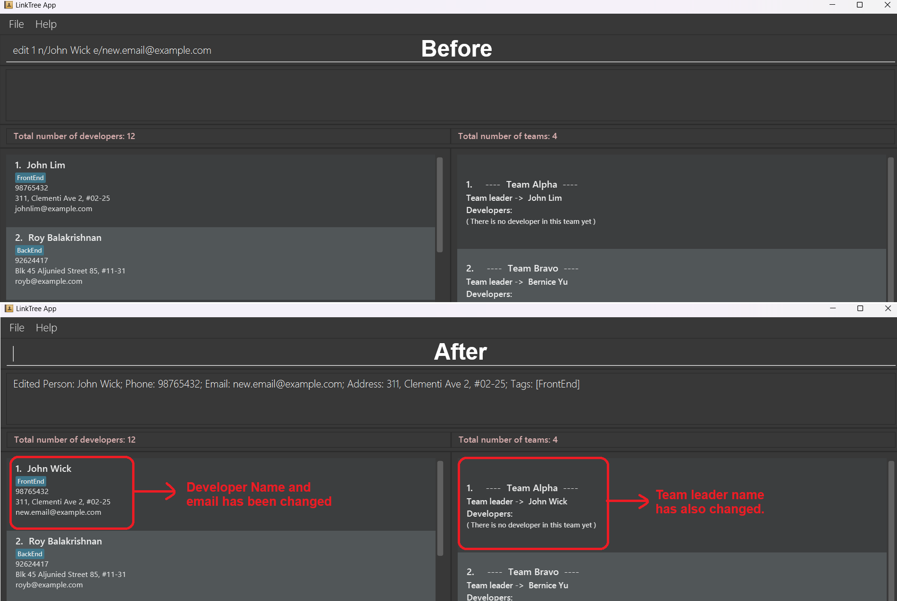
  email address `new.email@example.com`.

**:information_source: Note:** 
* You **do not need to provide** the arguments that you do not want to edit. In the
  given example above, I only want to edit this person's name and email address and nothing else,
  so I only provided this person's index `1`, new name `n/John Wick`
  and new email address `e/new.email@example.com`.

 

### Find developer
#### What this command does:
* Finds developers whose names satisfy the following parameter:
  * Any name, provided you can remember at least the first/last name.
  * Only full words will be matched e.g. Han will not match Hans
  * Multiple developer names can also be given as paramaters. The program will display the developers that have those names.

##### Format: `find [KEYWORD]`
 - Persons matching at least one keyword will be returned (i.e. OR search). e.g. Hans Bo will return Hans Gruber, Bo Yang>

##### Examples:

 - find John returns john and John Doe
 - find alex david returns Alex Yeoh, David Li
   

**:information_source: Note:** 
- The find command is designed to show only a list of developers. If you wish to view the team list again, you should use the `listt` command. 
- To display the complete list of developers, use the `list` command. If you need to list both at the same time, you can use the `list` command twice or the `listt` command twice to revert to the default state.
- The search is case-insensitive. e.g hans will match Hans
- The order of the keywords does not matter. e.g. Hans Bo will match Bo Hans

 

### List developers
#### What this command does:
* Displays the list of all the developers in this project.

**:information_source: Note:** 
* Any additional words provided after the command will be ignored.
  (e.g. entering `list help delete 1 HAHAHA-1234` is equivalent to entering `list`)

#### Command format:
* `list`
#### Example usage:
* `list` (and an example result is shown below)
  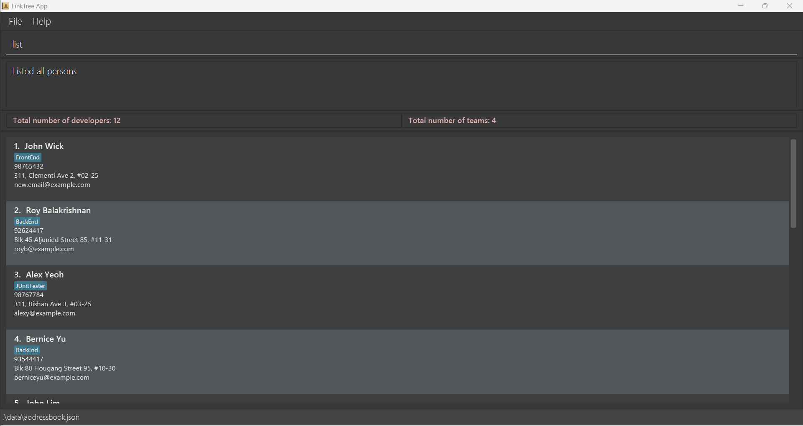

**:bulb: Tips:**  
**To return to the home page again**:  
Use the same command `list`. You will return to the home page.

**Example usage**:  
When you are at the main window, type `list` to show the developer list
and type `list` again when you want to go back to the main window.

 

--------------------------------------------------------------------------------------------------------------------
#### The following commands are for managing teams

### Create teams
#### What this command does:
* Takes a team name and a team leader name. Creates a new team with these paramaters if the given team leader is already an existing developer in the project.

#### Command format:
* `newteam tn/[TeamName] tl/[TeamLeader]`
#### Example usage:
* `newteam tn/Team Delta tl/David Li`
  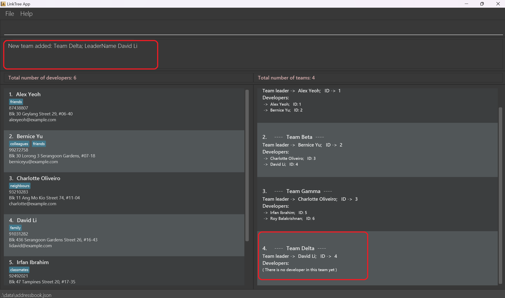

 

### Add developers to team
#### What this command does:
* Helps to add existing developers in the addressbook to a team.
#### Command format:
* `dev2team tn/[TeamName] n/[Developer Name]`
#### Example usage:
* `dev2team tn/Team Delta n/Irfan Ibrahim`
  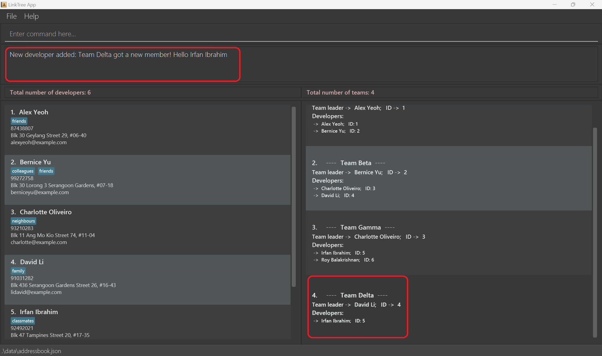

**:information_source: Note:** 
* The specified developer and team must already exist in the project!

 

### Delete team
#### What this command does:
* Deletes existing teams from the teambook.
#### Command format:
* `deleteteam tn/[TeamName]`
#### Example usage:
* Example: If you want to delete **Team Alpha** from the list of teams.
* You need to type `deleteteam tn/Team Alpha`, then the **Team Alpha** will be deleted from the list of teams.
  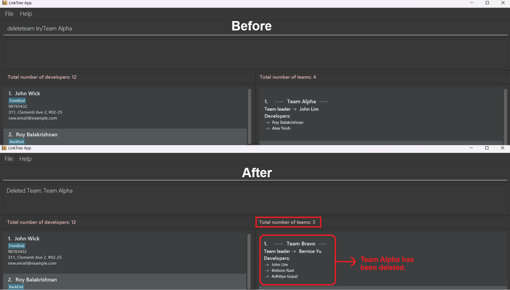

 

### Remove developer from team
#### What this command does:
* Performs deletion of existing developer from the given team.
#### Command format:
* `deletedev tn/[TeamName] n/[DeveloperName]`
#### Example usage:
* Example: If you want to delete developer **John Lim** from **Team Bravo**.
* You need to type `deletedev tn/Team Bravo n/John Lim`, then the developer 
**John Lim** will be removed from **Team Alpha**.
  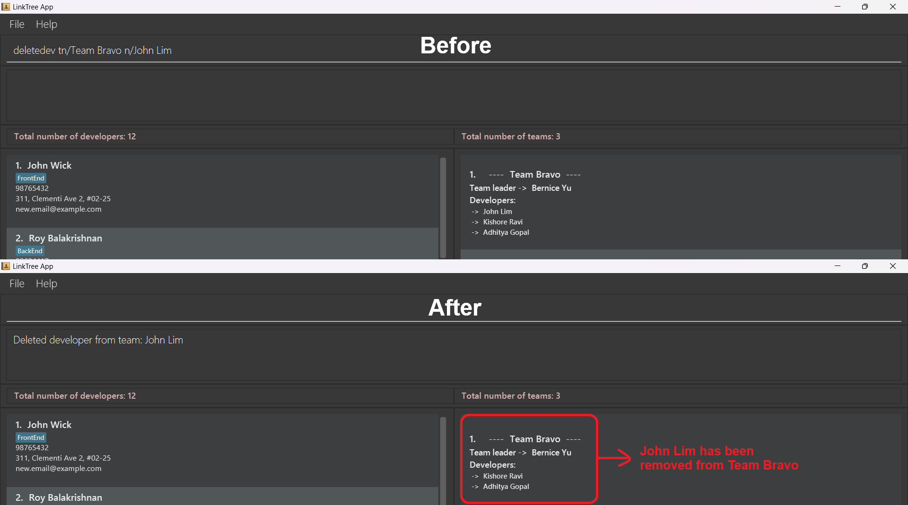

**:information_source: Note:** 
* You cannot delete a developer who is **team leader**. Inorder, delete that developer you need to change the
  team leader using `editTeamLeader` command. Only then you can remove that developer from the team.

 

### Edit team name
#### What this command does: 
* Takes a team name and a new name for the team. Changes team name if it doesn't already exist in the teambook.
#### Command format:
* `editTeamName [tn/TEAMNAME(original team name)] [tn/TEAMNAME(new team name)]`
#### Example usage:
  * Example: `editTeamName tn/Alpha Team tn/Beta Team`
  - Result: Now, the team with original team name `Alpha Team` changed its team name to `Beta Team`.
    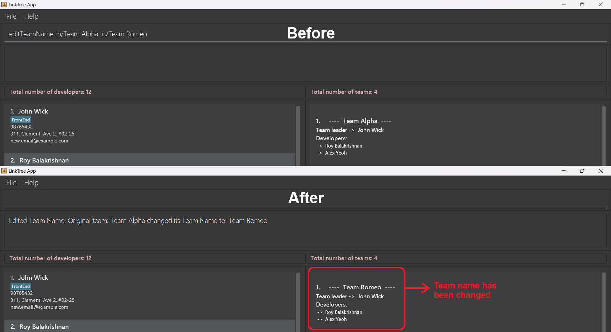

**:information_source: Note:** 
* Remember to check that the new team name that you specify isn't already taken by another team in the teambook.

 

### Edit team leader
#### What this command does:
* Edits the team leader of a team.
#### Command format: `editTeamLeader [tn/TEAMNAME] [tl/TEAMLEADER]`
#### Example usage: `editTeamLeader tn/Alpha Team tl/Bob`
  - Result: Now, the team with team name `Alpha Team` changed its team leader to be `Bob`.
  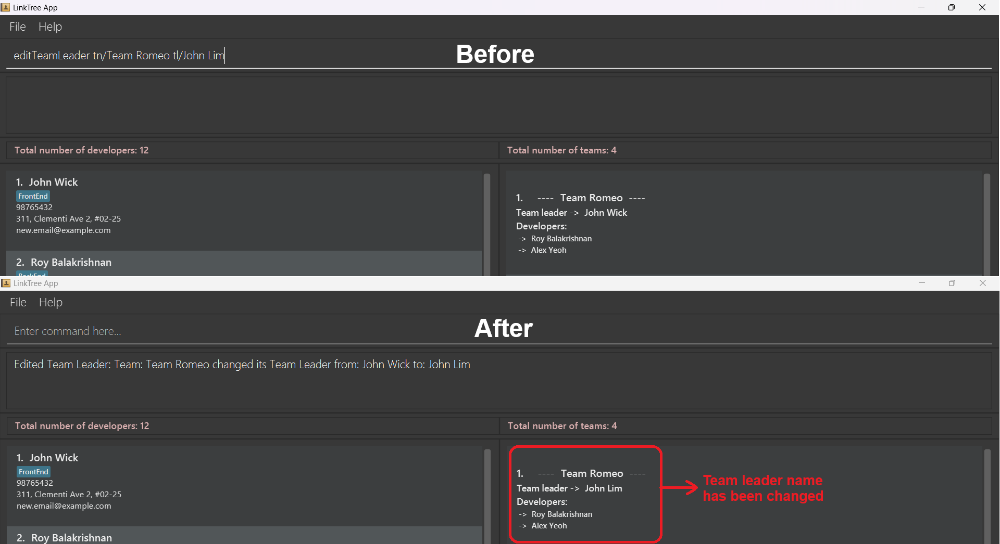

**:information_source: Note:** 
* Remember to check that the new leader specified is a person that already exists in the addressbook.

 

## Find Team
### What this command does:
- Finds teams whose names contain any of the given keywords.

##### Format: `findteam KEYWORD`

##### Examples:
- `findteam Alpha` returns "Team Alpha" and "Alpha Squad."
- `findteam Bravo Charlie` returns "Bravo Team," "Charlie Crew," and "Delta Bravo Charlie Team."

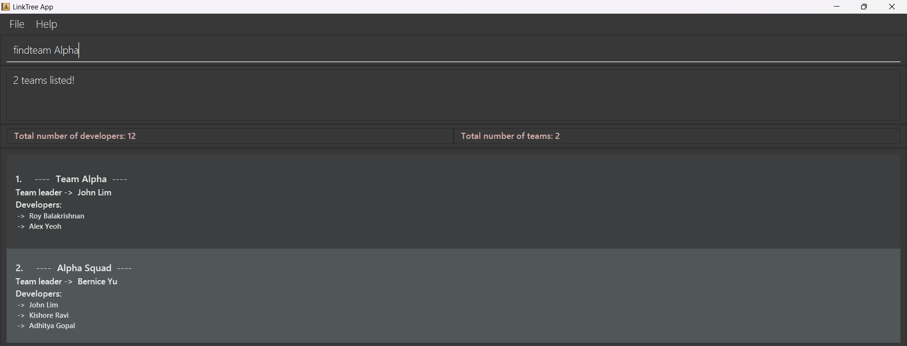

**:information_source: Tip:** 
* The order of the keywords does not matter. e.g., "Alpha Bravo" will match "Bravo Alpha Team."
* Only the team name is searched.
* Only full words will be matched. e.g., "Alph" will not match "Alpha Team."
* Teams matching at least one keyword will be returned (i.e., OR search). e.g., "Alpha Bravo" will return "Team Alpha," "Bravo Team."

**:information_source: Note:** 
* The findteam command is designed to show only a list of teams. If you wish to view the developer list again, you should use the `list` command. To display the complete list of teams, use the `listt` command. If you need to list both at the same time, you can use the `list` command twice or the `listt` command twice to revert to the default state.
*  The search is case-insensitive. e.g., "team" will match "Team Alpha."

### List teams
#### What this command does:
* Displays the list of all the teams in this project.

**:information_source: Note:** 
* Any additional words provided after the command will be ignored.
  (e.g. entering `listt help delete 1 HAHAHA-1234` is equivalent to entering `listt`)

#### Command format:
* `listt`
#### Example usage:
* `listt` (and an example result is shown below)
  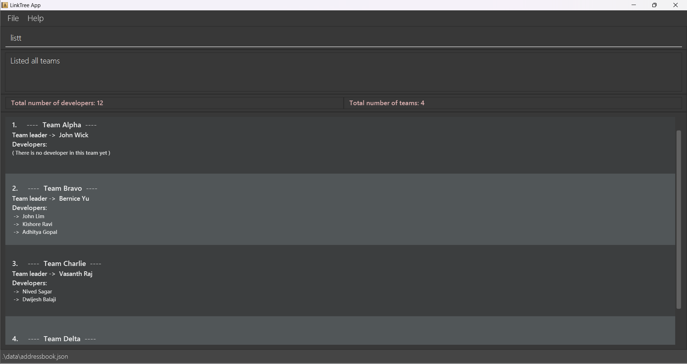

**:bulb: Tips:**  
**To return to the home page again**:  
Use the same command `listt`. You will return to the home page.

**Example usage**:  
When you are at the main window, type `listt` to show the team list
and type `listt` again when you want to go back to the main window.

### Display tree
#### What this command does:
* Provides a tree visualisation of all the teams and members in the project.

**:information_source: Note:** 
* Any additional words provided after the command will be ignored.
  (e.g. entering `tree list delete 1 HAHAHA-1234` is equivalent to entering `tree`)
* The project name **cannot be edited** because our application is designed to hold
    the contact information of all the developers in **one** software engineering project,
    the naming of this project is not important since there is only one project, and
    we do not need names to differentiate between different projects.
* The content in the tree **will not be updated in real time** because that requires
    too much computer resources. Instead, the tree is **updated every time you show it**.
    So, when you have some changes to the data, you should **hide the tree first if it is
    shown**, and call command `tree` again to show the tree. Then your changes will be
    reflected in the new tree. With that being said, if you enter command `tree` to
    show LinkTree and make some changes to the data, your changes will not be reflected
    in the current tree. You should hide the tree first and then call `tree` again to
    obtain a new tree which will reflect the changes you made.
* Team names and team leaders' names may not be shown fully if they are too long.
    You can refer back to the team list for their full names.

### Command format: 
* `tree`
#### Example usage: 
* `tree` (and an example result is shown below)

**:bulb: Tips:**  
**To hide the tree**:  
Use the same command `tree`. You will return to the home page.

**Example usage**:  
When you are at the main window, type `tree` to show the tree graph
and type `tree` again when you want to hide the tree and go back to the main window.

 

### Help
#### What this command does:
* Opens up a window which shows the link to this User Guide, which also comes with a button allowing copying the link;
* Display a summary of all commands of LinkTree, specifying the parameters needed.

**:information_source: Note:** 
* Any additional words provided after the command will be ignored.
  (e.g. entering `help list delete 1 HAHAHA-1234` is equivalent to entering `help`)

#### Command format:
* `help`
* Or simply press F1

#### Example usage:
* `help` (and an example result is shown below)
  
  

 

### Reset the project
#### What this command does:
* This command will erase **ALL THE DATA**. All the details of developers and teams will be cleared from storage.
This command can be used when you want to restart the project.

#### Command format:
* `clear`

#### Example usage:
* `clear` (and you will see an empty list of developers and teams)
  

**:exclamation: Warning:** 
* Using the clear command might result in unintended loss of data! Use it only when you intend to remove all of your data!

 

### Exit the application
#### What this command does:
* You can use this command to close the application.

#### Command format:
* `exit`

#### Example usage:
* `exit` (the application will close automatically)
--------------------------------------------------------------------------------------------------------------------

## Troubleshooting
- Details coming soon...

Click [here](#table-of-contents) to go back to contents.

--------------------------------------------------------------------------------------------------------------------

## FAQ
#### Q: How can I launch Linktree if clicking on the JAR file does not work?
**A:** Below is the CLI way to launch Linktree when encountering issues with the JAR file.
1. Open the Command Prompt.
2. Navigate to the directory where the JAR file is located using the following command:
3. Type the command below and press Enter: `cd [JAR file location]` followed by `java -jar linktree.jar`
4. Linktree should now launch.
- If this doesn’t work, check our GitHub to make sure you have the latest version of Tran$act downloaded.

#### Q: How can I transfer my Linktree data to another computer?
**A:** To transfer your Linktree data, install the jar file on the new computer and replace the empty data files(addressbook.json & teambook.json) with the two from your previous Linktree home directory (tp/data).

#### Q: What are the steps to install Java 11?
**A:**  To install Java 11, please refer to the [detailed download instructions available here](https://www.oracle.com/sg/java/technologies/javase/jdk11-archive-downloads.html).

#### Q: Is Linktree compatible with Mac and Linux operating systems?
**A:**  Linktree is compatible with a wide range of operating systems,
including Windows, Mac and Linux, and it runs on systems that support Java 11, so you can use it on your favorite platform.

#### Q: What should I do if a command isn't working?
**A:** Below are the 5 potential ways to solve your issue:
1. **Review the Command Syntax**:
  - Start by carefully reviewing the command you're trying to use. Ensure that you've entered it correctly, including all required components like command names, options, and arguments.

2. **Check for Typos**:
  - Typos are a common cause of command failures. Double-check the spelling of all command elements, including file paths and option names.

3. **Verify Input Requirements**:
  - Commands often require specific inputs, such as file paths, URLs, or values. Ensure that you've provided all the necessary inputs in the correct format.

4. **Refer to the user guide**:
  - Look for the section that explains the command's usage and syntax. It provide examples and detailed explanations.

5. **Ask for Help**:                                                                                                                                                                                                                                                                          
  - If you've exhausted all other options and the command still isn't working, don't hesitate to seek help.
Reach out to your us in email or Github for assistance.
Describe the problem in detail, including the command you're using, the error messages received, and any relevant context.

#### Q: Why does Linktree not show all developers/teams in the database?
**A:** If not all customers or properties are appearing, it's likely due to certain commands like find, or findteam. 
1. *If you wish to view the developer list, you should use the list command.*
2. *To display the complete list of teams, use the listt command.*
3. *If you need to list both at the same time, you can use the list command twice or the listt command twice to revert to the default state.*

#### Q: Is there a way to share my Linktree phonebook with others by exporting it to a different format such as a csv file?
**A:** Linktree does not currently support sharing your phonebook with others or exporting it to an external format.
Its main function is personal communication management for supervisors.

#### Q: I'm confused about some terms in the guide. Where can I find explanations?
**A:** You can check out the explanation of some of the complicated terms in our glossary

#### Q: I deleted my data file by mistake. Can I recover my lost data?
**A:** If you've accidentally deleted your data file, check your computer's trash or recycle bin.
Unfortunately, if it's not there, recovering lost data is not possible.

#### Q: How do I uninstall Linktree?
**A:** To uninstall Linktree, simply delete the folder that contains `linktree.jar` 
- no installation on the hard drive means no complex uninstallation process.

#### Q: Do I need to be online to use Linktree?
**A:** Linktree doesn't require an internet connection for regular use, but you will need to be online to download the application initially.

Click [here](#table-of-contents) to go back to contents.

--------------------------------------------------------------------------------------------------------------------

## Support
- Details coming soon...

Click [here](#table-of-contents) to go back to contents.

--------------------------------------------------------------------------------------------------------------------

## Known issues

1. **When using multiple screens**, if you move the application to a secondary screen, and later switch to using only the primary screen, the GUI will open off-screen. The remedy is to delete the `preferences.json` file created by the application before running it again.

Click [here](#table-of-contents) to go back to contents.

--------------------------------------------------------------------------------------------------------------------

## Command summary

| Command            | Format and Example                                                                                                                                                         |
|--------------------|----------------------------------------------------------------------------------------------------------------------------------------------------------------------------|
| `Hi`               | Format: `Hi` Example: `Hi`                                                                                                                                             |
| `add`              | Format: `add n/[Developer Name] p/[Phone] e/[Email] a/[Address] (OPTIONAL r/[Remark] t/[Tags])` Example: `add n/John p/89789678 e/John@gmail.com a/Singapore t/friend` |
| `delete`           | Format: `delete [index number]`  Example: `delete 7`                                                                                                                   |
| `edit`             | Format: `edit INDEX [n/NAME] [p/PHONE] [e/EMAIL] [a/ADDRESS] [r/REMARK] [t/TAG]...` Example: `edit 1 n/John Wick e/new.email@example.com`                              |
| `find`             | Format: `find [KEYWORD]` Example: `find John`                                                                                                                          |
| `list`             | Format: `list` Example: `list`                                                                                                                                         |
| `newteam`          | Format: `newteam tn/[TeamName] tl/[TeamLeader]`  Example: `newteam tn/Team Delta tl/David Li`                                                                          |
| `dev2team`         | Format: `dev2team tn/[TeamName] n/[Developer Name]` Example: `dev2team tn/Team Delta n/Irfan Ibrahim`                                                                  |
| `deleteteam`       | Format: `deleteteam tn/[TeamName]` Example: `deleteteam tn/Team Alpha`                                                                                                 |
| `deletedev`        | Format: `deletedev tn/[TeamName] n/[Developer Name]` Example: `deletedev tn/Team Alpha n/Roy Balakrishnan`                                                             |
| `editTeamName`     | Format: `editTeamName tn/[Original Team Name] tn/[New Team Name]` Example: `editTeamName tn/Alpha Team tn/Beta Team`                                                   |
| `editTeamLeader`   | Format: `editTeamLeader tn/[TeamName] tl/[TeamLeader]` Example: `editTeamLeader tn/Alpha Team tl/Bob`                                                                  |
| `findteam`         | Format: `findteam [KEYWORD]`  Example: `findteam Alpha`                                                                                                                |
| `listt`            | Format: `listt` Example: `listt`                                                                                                                                       |
| `tree`             | Format: `tree` Example: `tree`                                                                                                                                         |
| `help` or Press F1 | Format: `help` Example: `help`                                                                                                                                         |
| `clear`            | Format: `clear` Example: `clear`                                                                                                                                       |
| `exit`             | Format: `exit` Example: `exit`                                                                                                                                         |

Click [here](#table-of-contents) to go back to contents.

--------------------------------------------------------------------------------------------------------------------

## Future Enhancement

Click [here](#table-of-contents) to go back to contents.

--------------------------------------------------------------------------------------------------------------------
