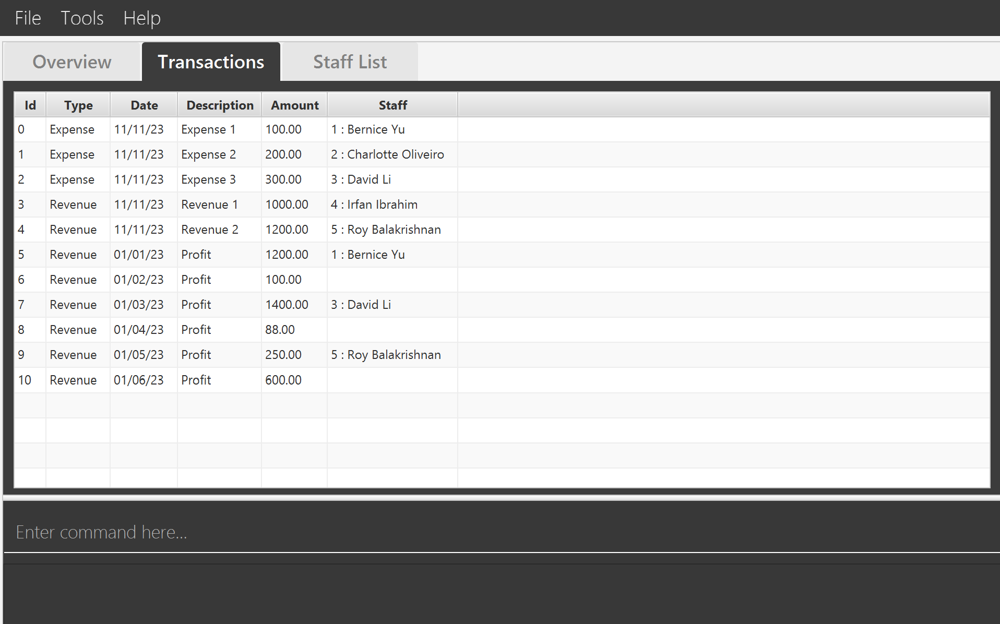
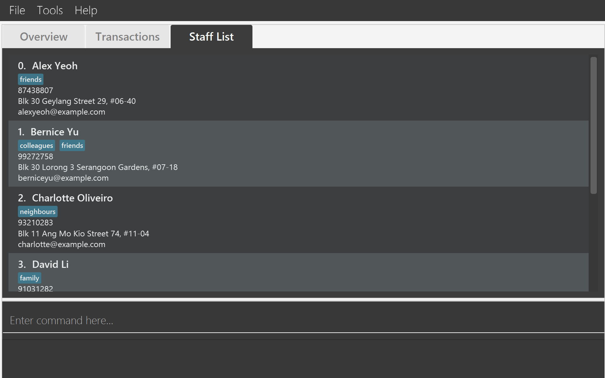

Welcome to **Tran$act**, your solution for effortless transaction recording and management.
Tran$act is a desktop application designed to cater to the needs of startup or small scale
retailers looking for a cheap and efficient way to record daily transactions.

Here's an overview of our main features:

- **Transaction Management** : Add, Edit and Delete Revenue and Expenses
- **Comprehensive Dashboard**: An instant snapshot of your monthly financial situation
- **Data Integration**: Export list of transactions in CSV format
- **Staff List**: Add people to your staff list and link them to transactions

In addition, Tran$act's **Command Line Interface (CLI)** functionality will allow you to unlock
greater efficiency as you type faster, while still having the benefits of a **Graphical User Interface (GUI)**.

This user guide will walk you through how to get started with our app and dive into our features
to help you streamline your accounting.



## Quick start

1. Ensure you have `Java 11` or above installed in your Computer. You can find the link to downloading
   it [here](https://www.oracle.com/java/technologies/javase/jdk11-archive-downloads.html).

2. Download the latest `transact.jar` from [here](https://github.com/AY2324S1-CS2103T-W13-3/tp/releases).

3. Copy the file to the folder you want to use as the _home folder_ for Tran$act.

4. Double click `transact.jar` to start the app. The GUI below should appear in a few seconds.

> **❗ If the above does not work, try this method:**
>
> Open a command terminal, `cd` into the folder you put the jar file in, type `java -jar transact.jar` and press Enter
> to run the application. 
> If you're on a Mac, then this command terminal should just be `Terminal` while if you're on windows, this command
> terminal should be `cmd`.

5. The app contains some sample data. Type `view s` to switch to the _staff list_.

> Alternatively, you can click on the Staff List/Transaction tab at the top of the window to switch to the
> staff/transaction
> view respectively.

6. Let's add a new staff member:
   type `addstaff n/Isaac p/92345678 e/isaac@gmail.com a/Blk 456, Pasir Ris St 32 t/marketing` and press Enter.

   This creates a new staff member called `Isaac` with the phone number `92345678`, email `isaac@gmail.com`,
   address `Blk 456, Pasir Ris St 32`, and adds an optional tag with the name `marketing`.

7. Let's add a new transaction: type `add ty/E d/Flyer printing amt/100 on/23/10/23 s/7` and press Enter.

   This creates a new transaction with type `E` for expense, description `Flyer printing`, amount `100`,
   date `23/10/2023` and staff with ID of `7`, which in this case is `Isaac` from the previous step since that's what
   the app automatically assigned them.

   Notice that the app automatically switches to the _transaction list_, and your newly added transaction appears at the
   bottom of the list.

8. Congratulations, you have successfully added a staff member and a transaction!

9. Once you have familarized yourself with Tran$act and want to begin inputting your own data, feel free to
   type `clearstaff` and press Enter followed by `cleartransaction` and press Enter to clear the transaction book and
   staff list.

10. Now, you can begin using Tran$act for to record your own data.

11. Refer to the [Usage Section](#usage) below for the full details of each command. Enjoy transacting with Tran$act!

---

## Navigating the GUI

Tran$act's GUI is simple and gives you access to all of its features with just one click.

This should be what you see when you open Tran$act for the first time:

The menu bar contains three tabs:

1. **File** — Contains actions like exporting data and exiting the program.
   1. Export
      1. Staff List — Exports the staff list into a JSON file. Opens a window of your computer's File System. Once you have chosen the folder where you want the JSON file of your staff list to be exported to, press Enter and it will appear there as `addressBook.json`.
      2. Transaction List — Exports the transaction list into a CSV file. Opens a window of your computer's File system. Once you have chosen the folder where you want the CSV file of your transaction list to be exported to, press Enter and it will appear there as `transactions.csv`.
   2. Exit — Exits the program.
2. **Tools** — Contains actions for clearing the transaction list and staff list.
   1. Clear Staff — Clears all existing staff in the staff list. Performs the same function as the `clearstaff` command.
   2. Clear Transactions — Clears all existing transactions. Performs the same function as the `cleartransaction` command.
3. **Help** — Contains more information about Tran$act.
   1. View User Guide — Opens your browser to show the user guide. Performs the same function as the `help` command. Can also be accessed by pressing F1 on the keyboard.

Under the menu bar contains three tabs:

1. **Overview** — This tab shows you a monthly summary of your finances based on the transactions you have entered. Although it's empty right now, when you have added a few transactions it will begin to show graphs.
2. **Transactions** — This tab shows you the transactions you have entered in a row-by-row format
   
3. **Staff List** — This tab shows you the persons or parties you have entered in a list format.
   

> ❗ **Staff List Indexing** will not be in order after editing the list
>
> The indexing serves as a way to link transactions to the respective staff

The input field below this with the grey text `Enter command here...` is the command box, where you can enter your commands.
Below the command box is the output window. This is where messages Tran$act has will be provided to you, from success messages to command input errors. You can clear it with `clear`.

## Features

Tran$act offers a range of features designed to make transaction recording and management a seamless process. These
features are tailored to the needs of accountants and finance professionals in small businesses, allowing for efficient
data entry and financial reporting. Here's an overview of the key features:

**1. Adding Transactions**

Tran$act allows you to add transactions with ease. Specify the transaction type, description, amount, date, and
optionally, the associated person. The system validates your input data and records the transaction in the database.

**2. Removing Transactions**

Remove transactions from your records with ease. Simply select the transaction you wish to delete, and the system will
confirm the removal before removing it from the database.

**3. Viewing All Transactions**

View a comprehensive list of all recorded transactions for reference. This list provides an overview of all financial
activities in one place.

**4. Editing Transactions**

Need to make corrections or updates to transaction records? Tran$act allows you to edit transaction details, ensuring
your records are accurate.

**5. Filtering Transactions**

Need to find transactions meeting a specific criteria, and order them? Tran$act allows you to filter transactions by
date, amount and person.

**6. Sorting Transactions**

Tran$act provides support for sorting your transactions by either date or amount. They can be sorted in either ascending
or descending order.

**7. Adding Staff**

Tran$act allows users to add staff to the staff list so you can link transactions to that staff. Each staff entry can
store a person's name, phone number, email address and any tags they are associated with.

**8. Editing Staff**

Tran$act allows users to edit existing staff in the staff list in case any of their details have changed.

**9. Deleting Staff**

Anybody leave the business? Tran$act supports functionality to remove staff who may have left the company or are no
longer associated with it, reducing bloat.

**10. Dashboard Display**

Upon opening the app, you'll be greeted with a clear and concise dashboard. The dashboard displays essential financial information, including total monthly revenue and expenses, as well as a net profit graph for available months.

**11. Exporting Transactions in Comma-Separated Values (CSV) Format**

For those who need to share data with stakeholders, Tran$act allows you to export your transaction data in a CSV file.

**12. Exporting Staff List in JSON Format**

For those who need to view their staff list in another format, Tran$act allows you to export your staff list in a JSON
file.

---

## Usage

| Parameter      | Description                                                     |
|----------------|-----------------------------------------------------------------|
| [ ]            | Optional field                                                  |
| \<DESCRIPTION> | Any string                                                      |
| \<NAME>        | Any string                                                      |
| \<PHONE>       | Number with at least 3 digits (trailing zeroes are allowed)     |
| \<EMAIL>       | Any string                                                      |
| \<ADDRESS>     | Any string                                                      |
| \<TAG>         | A single word with only alphabets and/or digits, with no spaces |
| \<KEYWORD>     | A single word with no spaces                                    |
| \<TYPE>        | R (for Revenue), or E (for Expense)                             |
| \<AMOUNT>      | Any number                                                      |
| \<DATE>        | In dd/MM/yy format                                              |
| \<ID>          | ID of a transaction, an integer                                 |
| \<STAFF ID>    | ID of staff, an integer                                         |
| \<SORT TYPE>   | asc (ascending) or desc (descending)                            |
| ...            | Multiple entries allowed, separated by a space                  |

> ❗ Extraneous parameters for commands that do not take in parameters (such as help, list, exit, clearstaff,
> cleartransaction, and clear) will be ignored. For example, if the command `help 123` is entered, it will be interpreted
> as `help`.

### Adding transaction : `add`

Adds a new transaction.

Format: `add ty/<TYPE> d/<DESCRIPTION> a/<AMOUNT> on/<DATE> [s/<STAFF ID>]`

Success
output: `New transaction added: <ID>; TransactionType: <TYPE>; Description: <DESCRIPTION>; Amount: <AMOUNT>; Date: <DATE>; [StaffId: <STAFF ID>]`

Examples:

- `add ty/R d/Sold 1 Mug amt/10 on/10/10/23 s/1`
- `add ty/E d/Paid Manufacturer amt/100 on/10/11/23`

### Removing transaction: `del`

Removes the transaction with the given ID.

Format: `del <ID>`

Success
output: `Deleted transaction: <ID>; TransactionType: <TYPE>; Description: <DESCRIPTION>; Amount: <AMOUNT>; Date: <DATE>; [StaffId: <STAFF ID>]`

Example: `del 1`

### Edit transaction: `edit`

Edits details of the transaction with the given ID.

Format: `edit <ID> [ty/<TYPE>] [d/<DESCRIPTION>] [amt/<AMOUNT>] [on/<DATE>] [s/<STAFF_ID>]`

Success
output: `Edited transaction: <ID>; TransactionType: <TYPE>; Description: <DESCRIPTION>; Amount: <AMOUNT>; Date: <DATE>; [StaffId: <STAFF ID>]`

**Note:** At least one field to edit must be provided in the command.

Examples:

- `edit 1 ty/Income amt/5000`
- `edit 2 d/NewDescription on/03/10/23`

### Sorting transactions : `sort`

Sorts transactions based on the given parameters and order.

Format: `sort [date/<SORT TYPE>] [amt/<SORT TYPE>]`

- At least one parameter must be present
- If both parameters are present, the order matters
    - Transactions will be sorted by the first parameter; if there are ties, the second parameter is used to tiebreak

Success output: `Transactions sorted by: <date/amount> <SORT TYPE>`

Examples:

- `sort date/asc`
- `sort amt/desc date/asc`

### Clear sort rules : `clearsort`

Removes all sort rules.

Format: `clearsort`

Success output: `Transaction sort has been cleared`

### Filtering transactions : `filter`

Filters transactions based on the given parameters.

Format: `filter [ty/<TYPE>] [has/<KEYWORDS...>] [after/<DATE>] [before/<DATE>] [more/<AMOUNT>] [less/<AMOUNT>] [by/<STAFF ID>]`

- At least one parameter must be present
- If multiple parameters are present, only transactions matching all parameters will be shown
- The order of parameters does not matter
- `ty` will match transactions of the given type
    - `R` will match revenue
    - `E` will match expense
- `has` will match descriptions containing the keyword(s)
    - The search is case-insensitive. e.g `hans` will match `Hans`
    - The order of the keywords does not matter. e.g. `Hans Bo` will match `Bo Hans`
    - Only the description is searched.
    - Only full words will be matched e.g. `Han` will not match `Hans`
- `after` will match dates _on or after_ the given date
- `before` will match dates _on or before_ the given date
- `more` will match amounts _greater than or equal to_ the given amount
- `less` will match amounts _less than or equal to_ the given amount
- `by` will match transactions with the given staff ID

Success output: `<Number of transactions> transactions listed`

Examples:

- `filter more/100 less/200`
- `filter ty/R before/10/10/23 by/1`

> **❗ `filter` will not affect values displayed on the dashboard overview**
>
> The overview page takes all transactions into account regardless of filter rules. 

### Clear filter rules : `clearfilter`

Removes all filter rules.

Format: `clearfilter`

Success output: `Transaction filter has been cleared`

### Change Tab: `view`

Changes current tab to the one in the parameter.

Format: `view <TAB>`
where `TAB` is:

- `s` or `staff` for `Staff List` tab
- `t` or `transaction` for `Transactions` tab
- `o` or `overview` for `Overview` tab

Success output:

- `Listed all <Tab Name>` for `transaction` and `staff`
- `Showed transaction overview` for `overview`

### Adding staff : `addstaff`

Adds a new staff member.

Format: `addstaff n/<NAME> p/<PHONE> e/<EMAIL> a/<ADDRESS> [t/<TAG>...]`

Success output: `New person added: <NAME>; Phone: <PHONE>; Email: <EMAIL>; Address: <ADDRESS>; [Tags: <TAG>...]`

Example: `addstaff n/John Doe p/91234567 e/johndoe@gmail.com a/Blk 123, Pasir Ris St 32 t/manager`

### Removing staff: `delstaff`

Removes the staff with the given ID.

Format: `delstaff <STAFF ID>`

Success output: `Deleted person: <NAME>; Phone: <PHONE>; Email: <EMAIL>; Address: <ADDRESS>; [Tags: <TAG>...]`

Example: `delstaff 1`

### Edit Staff: `editstaff`

Edits details of the staff with the given ID.

Format: `editstaff <ID> [n/<NAME>] [p/<PHONE>] [e/<EMAIL>] [a/<ADDRESS>] [t/<TAG>]...`

Success output: `Edited person: <NAME>; Phone: <PHONE>; Email: <EMAIL>; Address: <ADDRESS>; [Tags: <TAG>...]`

**Note:** At least one field to edit must be provided in the command. The ID must be a non-negative integer.

Examples:

- `editstaff 1 p/91234567 e/johndoe@example.com`
- `editstaff 2 n/NewName t/Manager`

### Locating staff by name: `find`

Finds staff whose names contain any of the given keywords.

Format: `find KEYWORD [KEYWORDS...]`

- The search is case-insensitive. e.g `hans` will match `Hans`
- The order of the keywords does not matter. e.g. `Hans Bo` will match `Bo Hans`
- Only the name is searched.
- Only full words will be matched e.g. `Han` will not match `Hans`
- Persons matching at least one keyword will be returned (i.e. `OR` search).
  e.g. `Hans Bo` will return `Hans Gruber`, `Bo Yang`

Success output: `<Number of persons> persons listed`

Examples:

- `find John` returns `john` and `John Doe`
- `find alex david` returns `Alex Yeoh`, `David Li`

### Clearing the output : `clear`

Clears the Result Box.

Format: `clear`

Success output: clear all the information contained in the result box at bottom.

### Clearing staff: `clearstaff`

Removes all entries in the staff list.

Format: `clearstaff`

Success output: `Staff list has been cleared!`

### Clearing transactions: `cleartransaction`

Removes all entries in the transaction list.

Format: `cleartransaction`

Success output: `Transaction list has been cleared`

### Help: `help`

Opens your browser to show the user guide.

Format: `help`

### Exiting the program : `exit`

Exits the program.

Format: `exit`

### Saving the data

Tran$act's data is saved in the hard disk automatically after any command that changes the data. There is no need to save manually.
## FAQ

1. How do I check my Java Version?
    - Open a Terminal/ Command Prompt and type java --version. If you do not have Java installed, you can check the
      instructions [here](https://nus-cs2103-ay2223s2.github.io/website/admin/programmingLanguages.html)
2. How do I download and install Java?
    - You can visit [this website](https://www.oracle.com/java/technologies/javase/jdk11-archive-downloads.html) and
      download the appropriate Java installer there. For new users, we recommend downloading the respective installer
      for your operating system and running that to install Java 11.
2. Can I do further analysis with the transaction data?
    - The purpose of Tran$act is to keep accounting and analysis simple to improve efficiency. Nonetheless, you can
      export the data as a CSV file and use the data in third party apps such as excel and do further analysis if
      needed.
3. How can I launch Tran$act if clicking on the JAR file does not work?
    - Open a command terminal, `cd` into the folder you put the jar file in, type `java -jar transact.jar` and press
      Enter to run the application.
    - If this doesn't work, check our GitHub to make sure you have the latest version of Tran$act downloaded.
4. Can I import my own data into Tran$act?
    - Tran$act currently does not support file importing. However, if have data in Tran$act on another computer, you can
      manually copy the `\data` folder to to this computer and place it in the same folder as Tran$act and your data
      will be transferred over.
5. The Tran$act window is too small. Can I change its size?
    - Yes, you can change Tran$act's window size by hovering your cursor over the border's of Tran$act's window. You'll
      see your cursor change and you'll be able to click and drag the border freely.

---

## Command summary

| Action                  | Format, Examples                                                                                                        |
|-------------------------|-------------------------------------------------------------------------------------------------------------------------|
| **Add transaction**     | `add ty/<TYPE> d/<DESCRIPTION> a/<AMOUNT> on/<DATE> [s/<STAFF ID>]`                                                     |
| **Remove transaction**  | `del <ID>`                                                                                                              |
| **Edit transaction**    | `edit <ID> [ty/<TYPE>] [d/<DESCRIPTION>] [amt/<AMOUNT>] [on/<DATE>] [s/<STAFF_ID>]`                                     |
| **Sort transactions**   | `sort [date/<SORT TYPE>] [amount/<SORT TYPE>]`                                                                          |
| **Clear sort rules**    | `clearsort`                                                                                                             |
| **Filter transactions** | `filter [ty/<TYPE>] [has/<KEYWORDS...>] [after/<DATE>] [before/<DATE>] [more/<AMOUNT>] [less/<AMOUNT>] [by/<STAFF ID>]` |
| **Clear filter rules**  | `clearfilter`                                                                                                           |
| **View Tab**            | `view <TAB>`                                                                                                            |
| **Add staff**           | `addstaff n/<NAME> p/<PHONE> e/<EMAIL> a/<ADDRESS> [t/<TAG>...]`                                                        |
| **Remove staff**        | `delstaff <STAFF ID>`                                                                                                   |
| **Edit staff**          | `editstaff <ID> [n/<NAME>] [p/<PHONE>] [e/<EMAIL>] [a/<ADDRESS>] [t/<TAG>]...`                                          |
| **Find staff**          | `find <KEYWORD> [KEYWORDS...]`                                                                                          |
| **Clear staff**         | `clearstaff`                                                                                                            |
| **Clear transaction**   | `cleartransaction`                                                                                                      |
| **Clear output**        | `clear`                                                                                                                 |
| **Exit**                | `exit`                                                                                                                  |

## Glossary

| Term                     | Definition                                                                                                                                                           |
|--------------------------|----------------------------------------------------------------------------------------------------------------------------------------------------------------------|
| Command                  | An input into the text box to carry out actions                                                                                                                      |
| Command-Line Interface   | A means of interacting with a computer program by inputting lines of text called commands.                                                                           |
| CSV File                 | A Comma Separated Values (CSV) file is a plain text file that stores data by delimiting data entries with commas.  Can be imported into applications like Excel. |
| Dashboard                | A way of displaying various types of visual data in one place. In Tran$act's case, this data includes monthly revenue, expenses and profits.                         |
| Desktop Application      | An application that runs stand-alone in a desktop or laptop computer.                                                                                                |
| Graphical User Interface | A means of interacting with a computer program through the use of graphical icons.                                                                                   |
| Java 11                  | The 11th version of the programming language **Java** that Tran$act uses and is built on.                                                                            |
| JSON File                | A JavaScript Object Notation (JSON) file that stores data in human-readable text.                                                                                    |
| Operating System         | System software that manages computer software and hardware resources. The most common ones are: Windows, MacOS and Linux.                                           |

## Future work

- Exported files that are created (e.g. transactions.csv) will be able to be renamed before being exported to the
  selected directory.
- Functionality to import data from CSV and JSON files.
