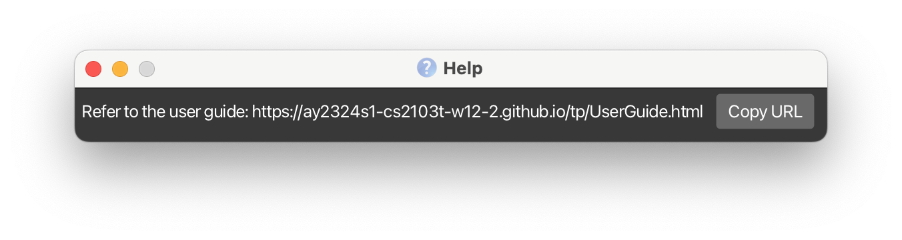
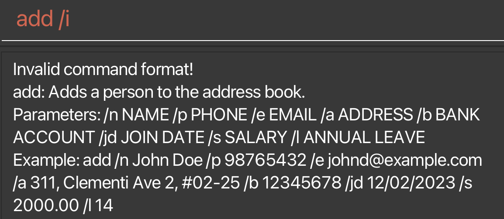
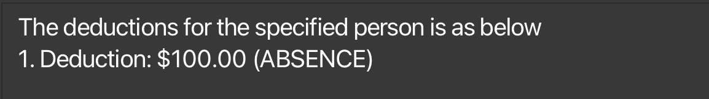
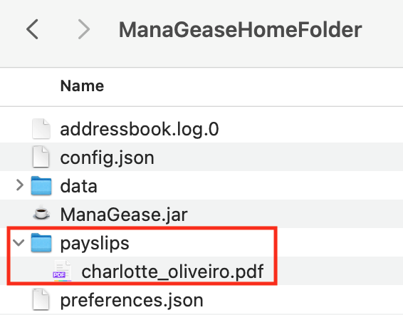
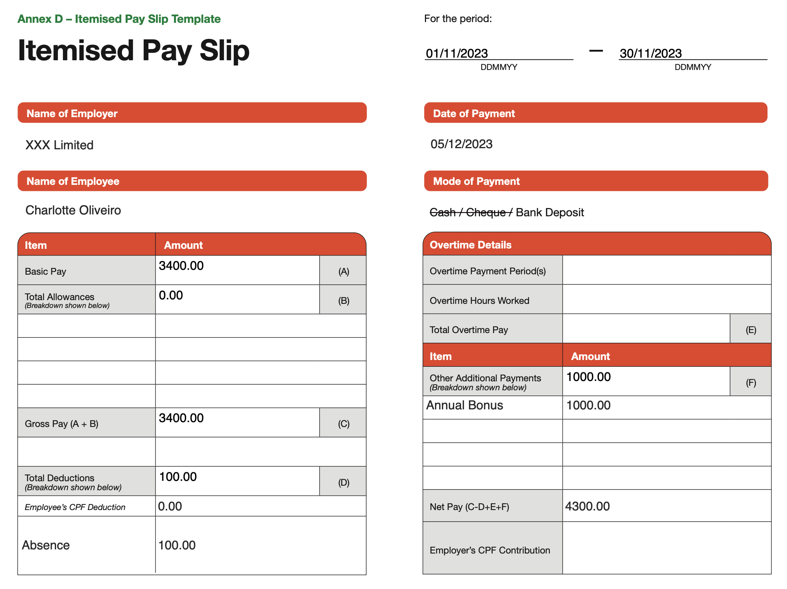

ManaGease is a **desktop app for managing full time staff in any workplace, optimized for use via a Command Line Interface** (CLI) while still having the benefits of a Graphical User Interface (GUI). If you can type fast, ManaGease can get your contact management tasks done faster than traditional apps.

--------------------------------------------------------------------------------------------------------------------

## Quick Start

1. Ensure you have Java `11` or above installed in your Computer. 
2. Download the latest `ManaGease.jar` from [here](https://github.com/AY2324S1-CS2103T-W12-2/tp/releases)
3. Copy the file to the folder you want to use as the _home folder_ for your ManaGease. 
4. Open a command terminal, `cd` into the folder you put the jar file in(i.e. `cd DIRECTORY_PATH`), and enter the `java -jar ManaGease.jar` command to run the application.<br>
   A GUI similar to the below should appear in a few seconds. Note how the app contains some sample data.<br>
   
5. Type the command in the command box and press Enter to execute it. e.g. typing **`help`** and pressing Enter will open the help window.<br>
   Some example commands you can try:

   * `list` : Lists all contacts.

   * `add /n Jane Smith /e jane@email.com /p 12345678 /a 123 Main St /b 123456789 /jd 2023-09-12 /s 1000 /al 10`: Adds an employee named `John Doe` to ManaGease

   * `delete 3` : Deletes the 3rd employee shown in the current list.
   
   * `read 3 /b` : Reads the bank account of the 3rd employee shown in the current list.
   
   * `edit 2 /n Betsy Crower` : Edits the name of the 2nd employee to be `Betsy Crower`.

   * `clear` : Deletes all employees.

   * `exit` : Exits the app.

Refer to the [Features](#features) below for details of each command.

--------------------------------------------------------------------------------------------------------------------

## Features

* For a quick glance at all the commands and features, please refer to the [Command Summary](#command-summary).

<div markdown="block" class="alert alert-info">

**:information_source: Notes about the command format:**<br>

* Words in `UPPER_CASE` are the parameters to be supplied by the user.<br>
  e.g. in `edit INDEX /n NAME`, `INDEX` and `NAME` are parameters which can be used as `edit 3 /n John Doe`.

* Items in square brackets are optional.<br>
  e.g `/n NAME [/t TAG]` can be used as `/n John Doe /t friend` or as `/n John Doe`.

* Items with `…`​ after them can be used multiple times including zero times.<br>
  e.g. `[/t TAG]…​` can be used as ` ` (i.e. 0 times), `/t friend`, `/t friend /t family` etc.

* Parameters can be in any order.<br>
  e.g. if the command specifies `/n NAME /p PHONE_NUMBER`, `/p PHONE_NUMBER /n NAME` is also acceptable.

* Extraneous parameters for commands that do not take in parameters (such as `help`, `list`, `exit` and `clear`) will be ignored.<br>
  e.g. if the command specifies `help 123`, it will be interpreted as `help`.

* If you are using a PDF version of this document, be careful when copying and pasting commands that span multiple lines as space characters surrounding line-breaks may be omitted when copied over to the application.
</div>

### Parameter formats
* All parameters provided must be in the correct format.<br>

  | Prefix | Parameter      | Format                                                                                                                                                                                                                                                                                                                                                                                                                                                                                                                                                                 | Example                     |
      |--------|----------------|------------------------------------------------------------------------------------------------------------------------------------------------------------------------------------------------------------------------------------------------------------------------------------------------------------------------------------------------------------------------------------------------------------------------------------------------------------------------------------------------------------------------------------------------------------------------|-----------------------------|
  | `/n`   | `NAME`         | non-empty and non-blank alphanumeric string                                                                                                                                                                                                                                                                                                                                                                                                                                                                                                                            | `/n jibtaf`                 |
  | `/p`   | `PHONE`        | string containing at least 3 integers                                                                                                                                                                                                                                                                                                                                                                                                                                                                                                                                  | `/p 98988989`               |
  | `/e`   | `EMAIL`        | local-part@domain<br/>1. The local-part should only contain alphanumeric characters and `+`, `_`, `.`, `-`. It may not start or end with any special characters.<br/>2. This is followed by a '@' and then a domain name. The domain name is made up of domain labels separated by periods.<br/>The domain name must:<br/>    - end with a domain label at least 2 characters long<br/>    - have each domain label start and end with alphanumeric characters<br/>    - have each domain label consist of alphanumeric characters, separated only by hyphens, if any. | `/e john_doe@u.nus.edu`     |
  | `/a`   | `ADDRESS`      | non-empty and non-blank alphanumeric string                                                                                                                                                                                                                                                                                                                                                                                                                                                                                                                            | `/a PGPR, Singapore 118420` |
  | `/b`   | `BANK_ACCOUNT` | string containing 5 to 17 integers, inclusive                                                                                                                                                                                                                                                                                                                                                                                                                                                                                                                          | `/b 1029384756`             |
  | `/jd`  | `JOIN_DATE`    | date in the form of DD/MM/YYYY                                                                                                                                                                                                                                                                                                                                                                                                                                                                                                                                         | `/jd 20/04/2018`            |
  | `/s`   | `SALARY`       | numeric digits in 2 decimal places, without any sign for currencies                                                                                                                                                                                                                                                                                                                                                                                                                                                                                                    | `/s 2000.00`                |
  | `/v`   | `VALUE`        | numeric digits in 2 decimal places, without any sign for currencies                                                                                                                                                                                                                                                                                                                                                                                                                                                                                                    | `/v 150.00`                 |
  | `/l`   | `ANNUAL_LEAVE` | numeric digits                                                                                                                                                                                                                                                                                                                                                                                                                                                                                                                                                         | `/l 25`                     |

----------------------------------------------------------------------------------------------------------------------------

### Viewing help : `help`
**What it does:**

Shows a message explaining how to access the help page.

**Command Format:**

`help`

Output:

* A new window will pop up with the link to the help page.
  


### Adding a person: `add`

**What it does**

This feature allows users to add a new employee to the ManaGease app, creating a profile with essential details.

**Command format:**
```
add /n NAME /e EMAIL /p PHONE /a ADDRESS /b BANK_ACCOUNT /jd JOIN_DATE /s SALARY /l ANNUAL_LEAVE
```

<div markdown="span" class="alert alert-primary">:bulb: **Tip:**
A person must have all parameters shown in the command format.
</div>

Example:
* `add /n Jane Smith /e jane@email.com /p 12345678 /a 123 Main St /b 123456789
  /jd 12/09/2023 /s 1000.00 /l 10`

Output:
* ManaGease should display a confirmation message indicating that the employee has been successfully added to the database. (e.g. `Employee "Jane Smith" successfully added!`)
* The employee's profile should be updated with the provided information.
  

* If prefix used is not defined, an error message will appear and say `Prefix not found, please use any of the following prefixes: /n, /e, /p, /a, /b, /jd, /s, /l`





### Editing a person : `edit`

**What it does**

Edits an existing person in the address book.

**Command Format:**

`edit INDEX [/n NAME] [/e EMAIL] [/p PHONE] [/a ADDRESS] [/b BANK_ACCOUNT] [/jd JOIN_DATE] [/s SALARY] [/l ANNUAL_LEAVE] `

* Edits the person at the specified `INDEX`.
* The `INDEX` refers to the index number shown in the displayed person list.
* The `INDEX` **must be a positive integer**, and **must be within the range of the list**.
* At least one of the optional fields must be provided.
* Existing values will be updated to the input values.

Examples:
*  `edit 1 /p 91234567 /e johndoe@example.com` Edits the phone number and email address of the 1st person to be `91234567` and `johndoe@example.com` respectively.
*  `edit 2 /n Betsy Crower ` Edits the name of the 2nd person to be `Betsy Crower` and clears all existing tags.

Output:
* ManaGease should display the information of the updated employee. 
  
* The employee's profile should be updated with the provided information.


### Deleting a person : `delete`

**What it does**

This feature allows users to delete an employee based on index or name.

**Command Format**

`delete INDEX` or `delete /n NAME`


* Deletes the person at the specified `INDEX` or with the name `NAME`.
* The `INDEX` refers to the index number shown in the displayed person list.
* The `INDEX` **must be a positive integer**, and **must be within the range of the list**.
* The `NAME` must be in the correct [format](#parameter-formats).

Examples:
* `list` followed by `delete 2` deletes the 2nd employee in the employee directory.
* `find Betsy` followed by `delete 1` deletes the 1st employee in the results of the `find` command.

Output:
* If there are multiple employees with the same name, we just list down the employees for them to view, return “Here is the list of the matching employees:”

  
* Otherwise, ManaGease should display a confirmation message indicating that the employee information has been successfully deleted.
* The employee's list should be updated by removing the employee.


### Reading a person's information : `read`

**What it does**

This feature allows users to view specific information about an employee.

**Command Format**

`read INDEX PREFIX`

* Reads the person's information specified by the `PREFIX` at the specified `INDEX`.
* The `INDEX` refers to the index number shown in the displayed person list.
* The `INDEX` **must be a positive integer**, and **must be within the range of the list**.

Examples:
* `read 3 /e` reads the email of the third person in the most recently displayed list.

Output:

* ManaGease should display the information of the employee specified by the `INDEX` and `PREFIX`, if the input is valid.
  

* If the index is not within the numbers in the list, the app should display `The employee index provided is invalid`.
  
* If the command is incorrect, the app should display the following message.
  
* If the `PREFIX` provided is not valid, the app should display `The field to read provided is invalid`. Please refer to the [parameter formats](#parameter-formats) for a list of all supported fields.


### Adding leave to am employee : `addleave`

**What it does**

This feature allows users to add leave to an employee.

**Command Format**

`addleave INDEX /on DATE` or `addleave INDEX /from STARTDATE /to ENDDATE`

* Adds leave to the employee specified by the `INDEX`, can be a single day of leave or multiple days of leave.
* The `INDEX` refers to the index number shown in the displayed person list.
* The `INDEX` **must be a positive integer**, and **must be within the range of the list**.

Examples:
* `addleave 3 /on 01/01/2024` adds leave to the third person in the most recently displayed list.

Output:

* If the index is not within the numbers in the list, the app should display `The employee index provided is invalid`.

* If the command is incorrect, the app should display `Please use the following format to read information : read INDEX INFORMATION`.

* If the `DATE` provided is not in the correct format, the app should display `Please provide a valid information prefix to read`.

* If the `DATE` has already been added to the employee, the app should display `There isn’t any information on this employee’s specified PREFIX`.


### View employee who is on leave: `viewleave`

**What it does**

This feature allows users to view employee who is on leave on a specific date.

**Command Format**

`viewleave /on DATE`

* Views employee who is on leave on a specific DATE, must be a single date.
  
* The Date must be in dd/MM/yyyy format.

Examples:
* `viewleave /on 01/01/2024` view employee who is on leave on 01/01/2024.

Output:

* If the command is incorrect, the app should display an error message indicating the command format is invalid followed by the command usage message.

* If the `DATE` provided is not in the correct format, the app should display an error message indicating the date format is invalid and provide guidance on the correct date format.

* If the command executes successfully, the app should display the employee who is on leave on the specific date.

### View the calendar of upcoming month: `nm`

**What it does**

This feature allows users to view the calendar of the upcoming month on the app.

**Command Format**

`nm`

### View the calendar of previous month: `pm`

**What it does**

This feature allows users to view the calendar of the previous month on the app.

**Command Format**

`pm`

### View the calendar of current month: `cm`

**What it does**

This feature allows users to view the calendar of the current month on the app.

**Command Format**

`cm`

### Adding a deduction to the payroll of an employee: `deduct`

**What it does**

This feature allows users to add a deduction to the payroll of an employee.

**Command Format**

`deduct INDEX /v VALUE /r REASON` or `deduct /n NAME /v VALUE /r REASON`

* Adds a deduction with given `VALUE` and `REASON` to the employee specified by the `INDEX` or `NAME`.
* The `INDEX` refers to the index number shown in the displayed person list.
* The `INDEX` **must be a positive integer**, and **must be within the range of the list**.
* The `VALUE` must be a **positive number**, and **must be in the [format](#parameter-formats) of 2 decimal places**.
* The `REASON` must be a **non-empty and non-blank string**. It must take one of the three values: `absence`, `cpf` or `no pay`, which stands for `Absence from work`, `Employee CPF deduction` and `No pay leave` respectively.
* The `REASON` is **case-insensitive**.
* The `NAME` must be in the correct [format](#parameter-formats).

Examples:
* `deduct 3 /v 100.00 /r absence` adds a deduction of $100.00 for being absent from work to the third employee in the most recently displayed list.
* `deduct /n John Doe /v 100.00 /r cpf` adds a deduction of $100.00 for employee CPF deduction to the employee named John Doe.

Output:

* ManaGease should display the deduction information of the employee specified, including the newly added deduction, if the input is valid.
  
* If the index is not within the numbers in the list, the app should display `The employee index provided is invalid`.
* If the command is incorrect, the app should display the following message.

* If the `VALUE` provided is not in the correct format, the app should display the following message.

* If the `REASON` provided is not valid, the app should display the following message.


### Adding a benefit to the payroll of an employee : `benefit`

**What it does**

This feature allows users to add a benefit to the payroll of an employee.

**Command Format**

`benefit INDEX /v VALUE /r REASON` or `benefit /n NAME /v VALUE /r REASON`

* Adds a benefit with given `VALUE` and `REASON` to the employee specified by the `INDEX` or `NAME`.
* The `INDEX` refers to the index number shown in the displayed person list.
* The `INDEX` **must be a positive integer**, and **must be within the range of the list**.
* The `VALUE` must be a **positive number**, and **must be in the [format](#parameter-formats) of 2 decimal places**.
* The `REASON` must be a **non-empty and non-blank string**. It must take one of the two values: `bonus` or `transport`, which stands for `Annual bonus` and `Transport allowance` respectively.
* The `REASON` is **case-insensitive**.
* The `NAME` must be in the correct [format](#parameter-formats).

Examples:
* `benefit 3 /v 1000.00 /r bonus` adds a benefit of $1000.00 for annual bonus to the third employee in the most recently displayed list.
* `benefit /n John Doe /v 200.00 /r transport` adds a benefit of $200.00 for transport allowance to the employee named John Doe.

Output:

* ManaGease should display the benefit information of the employee specified, including the newly added benefit, if the input is valid.
  
* If the index is not within the numbers in the list, the app should display `The employee index provided is invalid`.
* If the command is incorrect, the app should display the following message.
  
* If the `VALUE` provided is not in the correct format, the app should display the following message.
  
* If the `REASON` provided is not valid, the app should display the following message.
  


### Calculating payroll of an employee : `payroll`

**What it does**

This feature allows users to calculate the payroll of an employee.

**Command Format**

`payroll INDEX` or `payroll /n NAME`

* Calculates the payroll of the employee specified by the `INDEX` or `NAME`.
* The index refers to the index number shown in the displayed person list.
* The index **must be a positive integer**.

Examples:

* `payroll 3` calculates the payroll of the third employee in the most recently displayed list.
* `payroll /n John Doe` calculates the payroll of the employee named John Doe.

Output:
* ManaGease should display the payroll of the employee specified by the `INDEX` or `NAME`, if the input is valid.
* If the index is not within the numbers in the list, the app should display `Please enter a valid index number`.
* If the command is incorrect, the app should display `Please use the following format to read information : read INDEX INFORMATION`.


### Generating payslips for an employee : `payslip`

**What it does**

This feature allows users to generate payslips for an employee.

**Command Format**

`payslip INDEX [/t DD/MM/YYYY]` or `payslip /n NAME [/t DD/MM/YYYY]`

* Generates a payslip for the employee specified by the `INDEX` or `NAME`.
* If the optional `/t DD/MM/YYYY` is provided, the payslip will be generated for the month specified by the date.
* The `INDEX` refers to the index number shown in the displayed person list.
* The `INDEX` **must be a positive integer**, and **must be within the range of the list**.
* The `NAME` must be in the correct [format](#parameter-formats).
* The optional date must be in the correct [format](#parameter-formats).

Examples:

* `payslip 3` generates a payslip for the third employee in the most recently displayed list.
* `payslip /n John Doe` generates a payslip for the employee named John Doe.
* `payslip 3 /t 01/01/2024` generates a payslip for the third employee in the most recently displayed list for the month of January 2024.

Output:

* ManaGease should display a success message saying that the payslip has been generated successfully, if the input is valid.
  
* A payslip report in PDF format will be generated in the `payslips` folder in the ManaGease home directory.
  
  
* If the index is not within the numbers in the list, the app should display `The employee index provided is invalid`.
* If the command is incorrect, the app should display the following message.
  
* If the date provided is not in the correct format, the app should display the following message.
  


### Listing all persons : `list`

**What it does**

Shows a list of all employees in the workplace.

**Command format:**

`list`

Output:

* ManaGease should display a list of all employees in the workplace.
  

### Clearing all entries : `clear`

**What it does**

Clears all entries from the address book.

**Command format:**

`clear`

### Locating employees by name: `find`

**What it does**

Finds employees whose names contain any of the given keywords.

**Command Format**

`find KEYWORD [MORE_KEYWORDS]`

* The search is case-insensitive. e.g `alex` will match `Alex`
* The order of the keywords does not matter. e.g. `Yeoh Alex` will match `Alex Yeoh`
* Only the name is searched.
* Only full words will be matched e.g. `Ale` will not match `Alex`
* Persons matching at least one keyword will be returned (i.e. `OR` search).
  e.g. `Hans Bo` will return `Hans Gruber`, `Bo Yang`

Example:
* `find alex david` returns `Alex Yeoh`, `David Li`<br>
  


### Exiting the program : `exit` 

**What it does**

Exits the program.

**Command format:**

`exit`

### Saving the data

AddressBook data are saved in the hard disk automatically after any command that changes the data. There is no need to save manually.

### Editing the data file

ManaGease data are saved automatically as a JSON file `[JAR file location]/data/managease.json`. Advanced users are welcome to update data directly by editing that data file.

<div markdown="span" class="alert alert-warning">:exclamation: **Caution:**
If your changes to the data file makes its format invalid, Managease will discard all data and start with an empty data file at the next run. Hence, it is recommended to take a backup of the file before editing it.
</div>

### Archiving data files `[coming in v2.0]`

_Details coming soon ..._

--------------------------------------------------------------------------------------------------------------------

## FAQ

**Q**: How do I transfer my data to another Computer?<br>
**A**: Install the app in the other computer and overwrite the empty data file it creates with the file that contains the data of your previous ManaGease home folder.

--------------------------------------------------------------------------------------------------------------------

## Known issues

1. **When using multiple screens**, if you move the application to a secondary screen, and later switch to using only the primary screen, the GUI will open off-screen. The remedy is to delete the `preferences.json` file created by the application before running the application again.

--------------------------------------------------------------------------------------------------------------------

## Command summary

| Action      | Format, Examples                                                                                                                                                                                                               |
|-------------|--------------------------------------------------------------------------------------------------------------------------------------------------------------------------------------------------------------------------------|
| **Add**     | `add /n NAME /e EMAIL /p PHONE /a ADDRESS /b BANK_ACCOUNT /jd JOIN_DATE /s SALARY /l ANNUAL_LEAVE`     <br> e.g., `add /n Jane Smith /e jane@email.com /p 12345678 /a 123 Main St /b 123456789/jd 12/09/2023 /s 1000.00 /l 10` |
| **Clear**   | `clear`                                                                                                                                                                                                                        |
| **Delete**  | `delete INDEX`<br> e.g., `delete 3`                                                                                                                                                                                            |
| **Edit**    | `edit INDEX [/n NAME] [/e EMAIL] [/p PHONE] [/a ADDRESS] [/b BANK_ACCOUNT] [/jd JOIN_DATE] [/s SALARY] [/l ANNUAL_LEAVE]`<br> e.g.,`edit 2 n/James Lee e/jameslee@example.com`                                                 |
| **Read**    | `read INDEX PREFIX`<br> e.g., `read 3 /n`                                                                                                                                                                                      |
| **List**    | `list`                                                                                                                                                                                                                         |
| **Find**    | `find KEYWORD [MORE_KEYWORDS]`<br> e.g., `find alex`                                                                                                                                                                           |
| **Deduct**  | `deduct INDEX /v VALUE /r REASON` or `deduct /n NAME /v VALUE /r REASON`<br> e.g., `deduct 3 /v 200.00 /r cpf`                                                                                                                 |
| **Benefit** | `benefit INDEX /v VALUE /r REASON` or `benefit /n NAME /v VALUE /r REASON`<br> e.g., `benefit 3 /v 1000.00 /r bonus`                                                                                                           |
| **Payroll** | `payroll INDEX` or `payroll /n NAME`<br> e.g., `payroll 3`                                                                                                                                                                     |
| **Payslip** | `payslip INDEX [/t DD/MM/YYYY]` or `payslip /n NAME [/t DD/MM/YYYY]`<br> e.g., `payslip 3`                                                                                                                                     |
| **Help**    | `help`                                                                                                                                                                                                                         |
