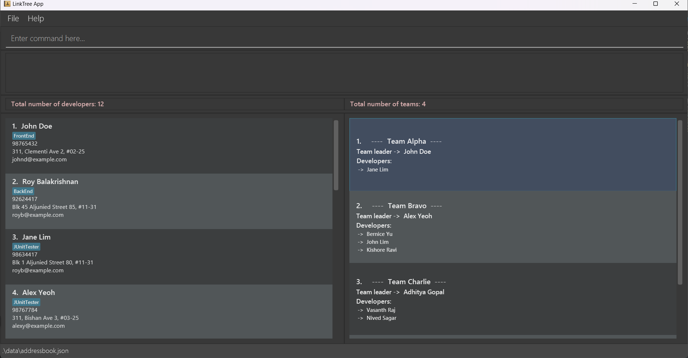

Flashlingo is a **desktop app for learning words by flashcard, optimized for use via a Command Line Interface** (CLI) while still having the benefits of a Graphical User Interface (GUI). Flashlingo can help you to schedule your language learning plan.

* Table of Contents
{:toc}

--------------------------------------------------------------------------------------------------------------------

## Quick start

1. Ensure you have Java `11` or above installed in your Computer.

1. Download the latest `flashlingo.jar` from [here](https://github.com/AY2324S1-CS2103T-T11-4/tp/releases) (Not finished yet).

1. Copy the file to the folder you want to use as the _home folder_ for your AddressBook.

1. Open a command terminal, `cd` into the folder you put the jar file in, and use the `java -jar flashlingo.jar` command to run the application. 
   A GUI similar to the below should appear in a few seconds. Note how the app contains some sample data. 
   

1. Type the command in the command box and press Enter to execute it.
   Some example commands you can try:

   * `help` : Shows the User Guide.

   * `list` : Shows the list of cards.

   * `add w/WORD t/TRANSLATION` :Adds a word to the flashcard with its translation.

   * `del index` : Deletes a words and its related information at the given index.
   
   * `edit index w/WORD t/TRANSALTION` : Edits the word and its translation at the given index.
   
   * `find KEYWORD` : Finds words whose original word or translation contains the given keyword.
   
   * `start` : Shows flashcard, starts today’s flashcard session.

   * `flip` : Shows the other side of the flash card.

   * `yes` :  Indicates user has memorized the word.

   * `no` :  Indicates user has forgotten the word.

   * `stop` :  Stops the current flashcard session.

   * `exit` : Terminates the program.

   * `save` : Changes save location.

   * `load` : Loads the previously stored data

2. Refer to the [Features](#features) below for details of each command.

--------------------------------------------------------------------------------------------------------------------

## Features

**:information_source: Notes about the command format:** 

* Words in `UPPER_CASE` are the parameters to be supplied by the user. 
  e.g. in `add w/WORD t/TRANSLATION`, `WORD` and `TRANSLATION` are a parameter which can be used as `add w/regarder t/look`.

* Extraneous parameters for commands that do not take in parameters (such as `help`, `list`and `exit`) will be ignored. 
  e.g. if the command specifies `help 123`, it will be interpreted as `help`.

* If you are using a PDF version of this document, be careful when copying and pasting commands that span multiple lines as space characters surrounding line-breaks may be omitted when copied over to the application.

### Viewing help : `help`

Opens a browser with the help page (User Guide).

Format: `help`

### Listing all cards : `list`

Shows the list of cards with both the original word and the corresponding translation.

Format: `list`

Format: `list`

Output:
* `There are no words in the list! Add your flashcards now!`
* `Here are the words:`
  `1. ORIGINAL_WORD - TRANSLATION`
  `2. ORIGINAL_WORD - TRANSLATION`
  `3. ORIGINAL_WORD - TRANSLATION`
  `...`

### Adding a word card: `add`

Adds a word to the flashcard with its translation.
* Creates a wild card.
* Works to add a word with its translation in the expected language.
* The already saved translation can be overridden with a new translation in a different language.

Format: `add w/WORD t/TRANSLATION`

Examples:
* `add w/regarder t/look` saves the translation of regarder as look
* `add w/entschuldigung t/sorry` saves the translation of entschuldigung as sorry

### Deleting a word card : `delete`

Deletes a words and its related information
* Deletes a flashcard.

<<<<<<< HEAD
Format: `deletle index`

Examples:
* `delete 1` deletes the word and its translation at index 1

### Editing a word card : `edit`

Edits the word and its translation at the given index.
* Edits a wild card.

Format: `edit index w/WORD t/TRANSLATION`

Examples:
* `edit 1 w/Bye t/再见` edits the word and its translation at index 1

### Finding a word card : `find`

Finds words whose original word or translation contains the given keyword.
* Finds a flashcard.
* The search is insensitive. e.g `look` will match `Look`

Format: `find KEYWORD`

Examples:
* `find look` returns the flashcard list  and its translation that contains the keyword `look`

###  Showing flashcard, starts today’s flashcard session : `start`

Shows the words the user is going to study.

Format: `start`

Output:

### Showsing the other side of the flash card : `flip`

Shows the meaning of the word.

Format: `flip`/`f`

Output :

### Indicating user has memorized the word : `yes`

Marks the word as memorized and pushes the word into the next retention stage.

Format: `yes`

###  Indicating user has forgotten the word : `no`

Marks the word as not grasped and leaves it in its current retention stage.

Format: `no`

### Stopping the current flashcard session : `stop`

Stops the current flashcard session and returns to the main menu.

Format: `stop`

Output: `Congratulations! You have completed FINISHED_WORDS out of TOTAL_WORDS words!`

### Exiting the program : `exit`

Closes the GUI and terminates the Java program

Format: `exit`

### Changing save location : `save`

FlashLingo data is stored automatically to hard disk after every change, there is no need to manually save.

This function is to change the file path where the cards will be stored as a .txt file.

Format: `save <FILEPATH> `

* Changes the default save location to the FILEPATH.
* ⚠️ Please specify a directory that exists, or a file that ends with .txt

Examples:
* `save C:/Users/Directory` will save to C:/Users/Directory/FlashLingo.txt
* `save C:/Users/Directory/FileName.txt` will save to C:/Users/Directory/FileName.txt

Output:
* `Success`: File has been successfully saved to <FILEPATH>
* `Failure`: File has not been saved to <FILEPATH>. Please confirm that the path is correct

### Loading the previously stored data : `load`

Loads the data stored by the save function into the program’s list

Format: `load <FILEPATH> `

* Loads the data specified from the .txt file.
* ⚠️ Please specify a .txt file that was created by the save function. Do NOT load any other txt files.

Examples:
* `load C:/Users/Directory/FileName.txt` will load the data from FileName.txt

Output:
* `Success`: File has been successfully loaded from <FILEPATH>
* `Failure`: File has not been loaded from <FILEPATH>. Please confirm that the path is correct, and that it is a file generated by FlashLingo.

### Saving the data

Flashlingo data are saved in the hard disk automatically after any command that changes the data. There is no need to save manually.

### Editing the data file

Flashlingo data are saved automatically as a JSON file `[JAR file location]/data/flashlingo.json`. Advanced users are welcome to update data directly by editing that data file.

:exclamation: **Caution:**
If your changes to the data file makes its format invalid, AddressBook will discard all data and start with an empty data file at the next run. Hence, it is recommended to take a backup of the file before editing it.

### Archiving data files `[coming in v2.0]`

_Details coming soon ..._

--------------------------------------------------------------------------------------------------------------------

## FAQ

**Q**: How do I transfer my data to another Computer? 
**A**: Install the app in the other computer and overwrite the empty data file it creates with the file that contains the data of your previous Flashlingo home folder.
... (to be completed)

--------------------------------------------------------------------------------------------------------------------

## Known issues

1. ... (to be completed)

--------------------------------------------------------------------------------------------------------------------

## Command summary

Action | Format, Examples
--------|------------------
**Help** | `help`
**List** | `list`
**Add** | `add w/WORD t/TRANSLATION`   e.g., `add w/regarder t/look`
**Delete** | `del w/WORD`  e.g., `del w/look`
**Start** | `start`
**Flip** | `flip`/`f`
**Yes** | `yes`
**No** | `no`
**Stop** | `stop`
**Exit** | `exit`
**Save** | `save <FILEPATH>`  e.g., `save C:/Users/Directory`
**Load** | `load <FILEPATH>`  e.g., `load C:/Users/Directory/FileName.txt`

