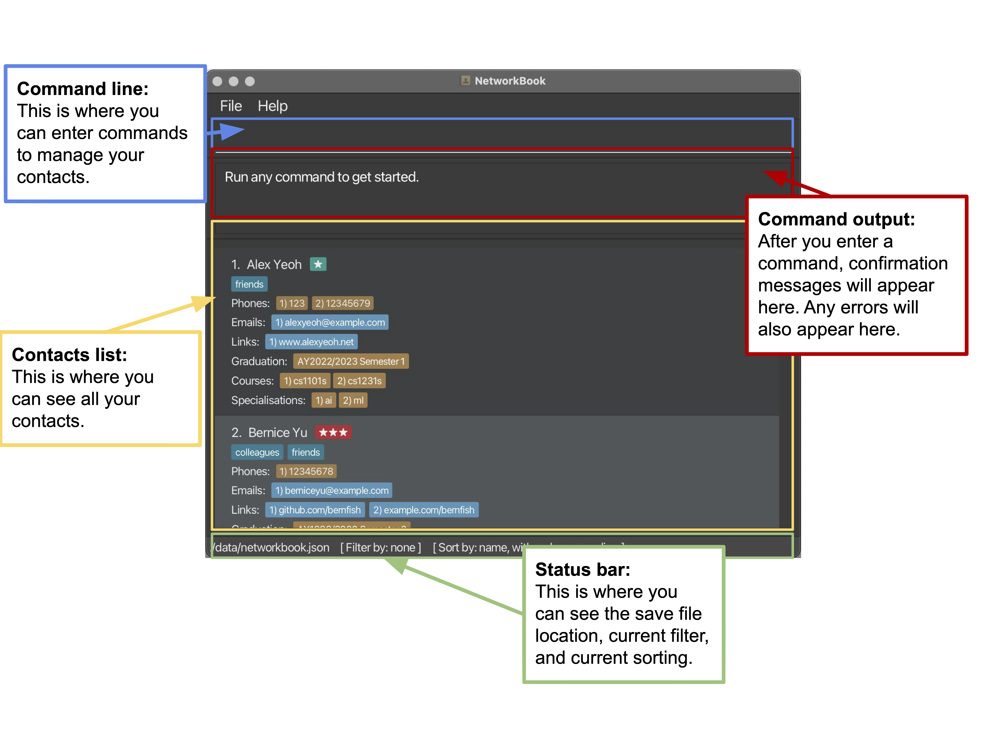
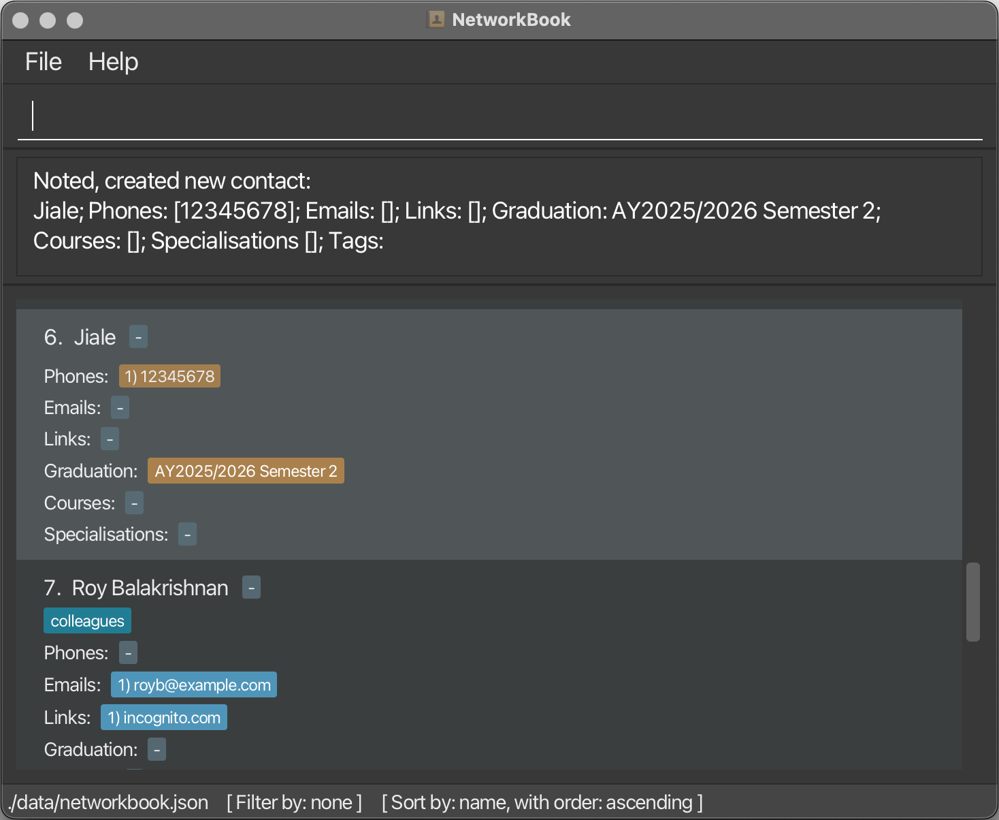
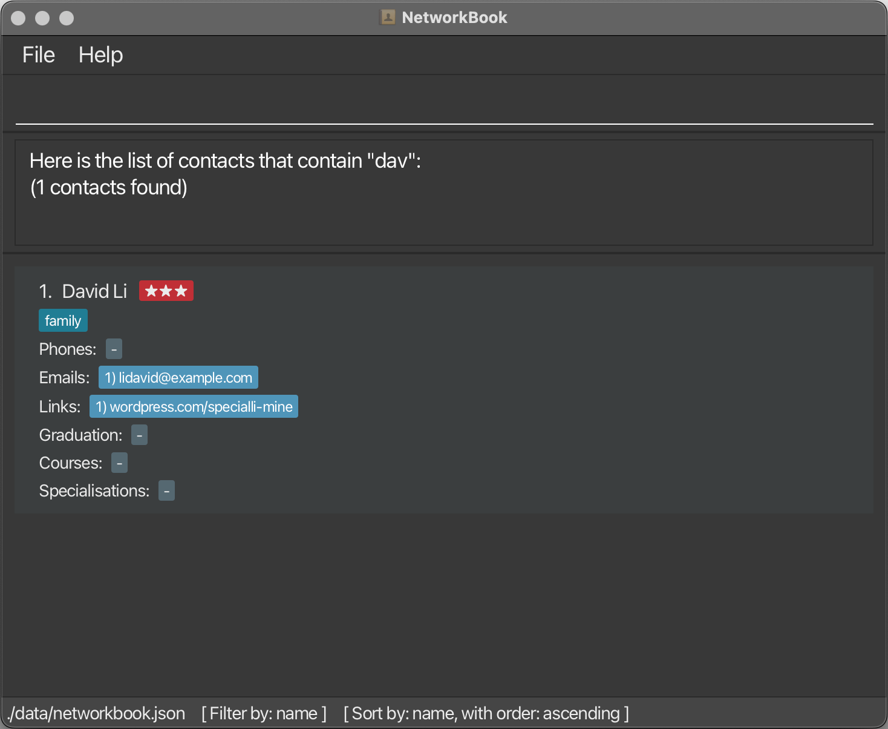
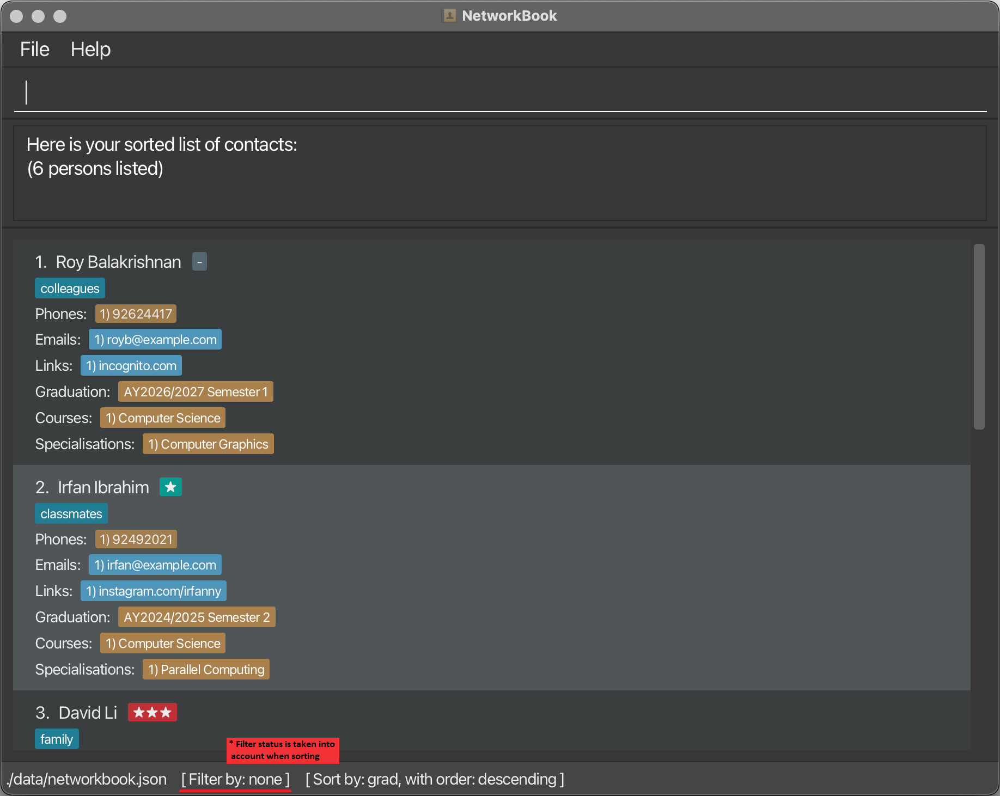
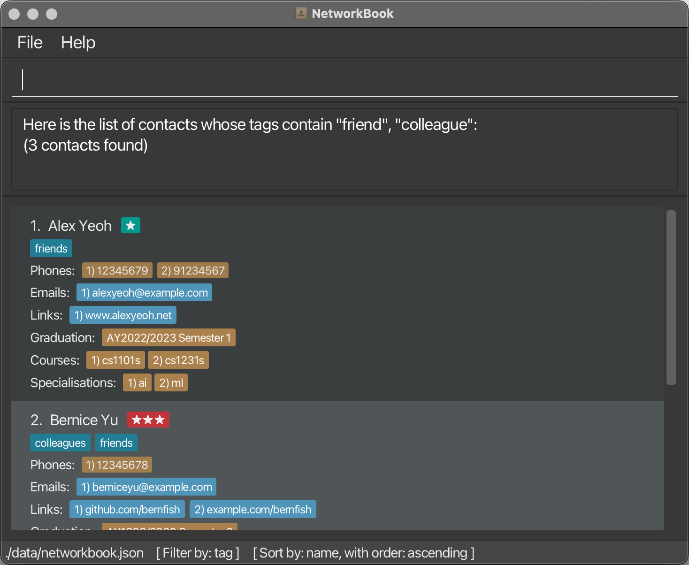
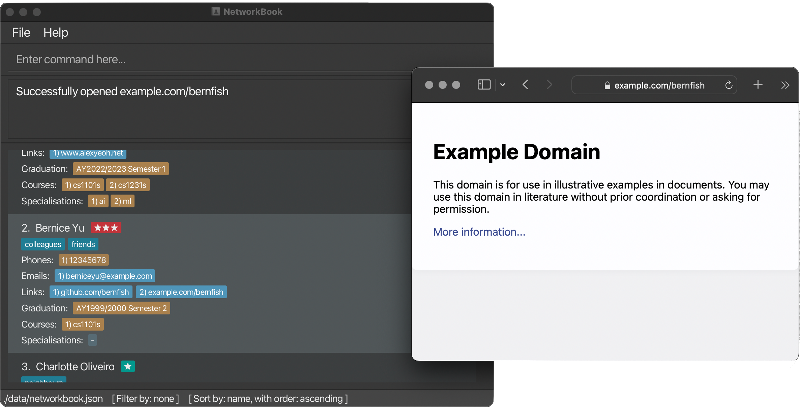
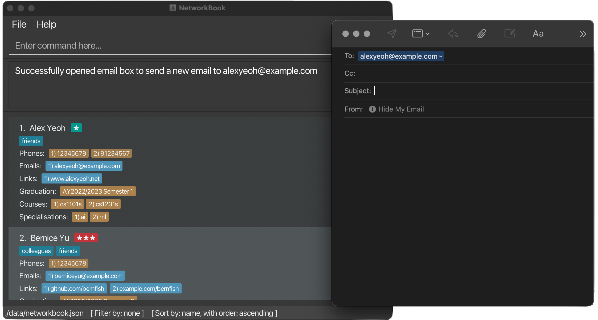

<!-- @@author awhb -->

## Product Overview

**Land the dream internship or job opportunity you've always wanted by networking more effectively using _NetworkBook!_**

NetworkBook is a desktop contact book application built for NUS Computing students and professionals to manage information about the people they network with more efficiently than ever before.

Here's an overview of how NetworkBook can help you manage your network of contacts better than existing alternatives:

* You can search for and sort contacts by multiple networking-relevant fields (e.g. priority, courses taken/taking, specialization(s) taken/intending to take, graduation year)
* You can access this application offline, with a static online page that contains user manual and download link
* You can record only the information you find relevant on our application (e.g. you can assign one contact only their email and specialisation, and another contact nothing but their course)

On top of these advantages, we believe that contact management must be efficient. Therefore, NetworkBook is optimised for use via a Command Line Interface while still having the benefits of a Graphical User Interface. If you type fast, NetworkBook can get your contact managing done faster than existing alternatives performing a similar role.

If you are new here, visit our [getting started guide](#getting-started) to start getting connected on NetworkBook!

<!-- @@author -->

## Table of Contents

* TOC
{:toc}

<!-- @@author Eola-Z -->

## About This User Guide

This user guide provides in-depth documentation on the various commands that are available in NetworkBook.
If you are familiar with the software, this user guide gives an overview on how to use specific commands.

Additionally, if you are a new user, this user guide provides a quick start guide to aid you with installing the application and getting started.

### What's new in NetworkBook 1.3

NetworkBook 1.3 includes several new features and improvements for ease of use.

* Filter command for more control with finding contacts
* Edit command to edit contacts' details
* Error messages are now more specific to give useful information
* NetworkBook is able to connect with other apps and open links and emails
* Keyboard shortcuts added for easy access to common commands
* Undo/redo command to fix mistakes
* Refinement of user interface to be more clean and usable

<!-- @@author -->
<!-- @@author xenosf -->

## Getting Started

1. Make sure you have Java 11 installed on your computer.
    * You can check that it is installed by running the command `java --version` in the command prompt/terminal.
1. Download the latest version of NetworkBook (`networkbook.jar`) from the top of the [NetworkBook GitHub releases page](https://github.com/AY2324S1-CS2103T-T08-2/tp/releases).
1. Create a new folder on your computer (e.g. on your computer desktop). You can name this folder however you want.
1. Move the `networkbook.jar` file into the folder you just created.
1. Open NetworkBook:
    * If you are using Windows:
        1. Double-click the `networkbook.jar` file to open it.
    * If you are using MacOS:
        1. Open Terminal.app.
        1. Navigate to the folder you have created using the `cd` command:
            1. Type `cd`, then space, into the Terminal window.
            1. Drag the folder icon from Finder into the Terminal window.
            1. Press enter.
        1. Type in `java -jar networkbook.jar`, then press enter to open the app.
    * If you are using Linux:
        1. Open your terminal emulator app.
        1. Navigate to the folder you have created using `cd`.
        1. Type in `java -jar networkbook.jar`, then press enter to open the app.
1. You should now see the NetworkBook window on your screen. This is what NetworkBook looks like:
    
1. You can now start using NetworkBook!
    * Learn more about the commands in the [features](#features) section.

<!-- @@author -->

## Features

<!-- @@author Singa-Pirate -->

:information_source: **Fields of a contact**

In NetworkBook, details of a contact are categorised into different **fields**. Each field has a corresponding **prefix** in the command format. 

Some fields are **single-valued fields**, meaning that each contact has **only 1 value** for each of these fields.

| Single-valued fields | Prefix    | Format                                                       |
| -------------------- | --------- | ------------------------------------------------------------ |
| name                 | /name     | Any non-empty value                                          |
| priority level       | /priority | Either `high`, `medium` or `low`, or the initial alphabet    |
| graduation semester  | /grad     | `AYxxxx-Sy` `xxxx` is the 4-digit representation of the 2 calendar years, in the academic year e.g. `2223` for Academic Year 20`22`/20`23`  Academic year must be between AY1970/1971 to AY2069/2070 (inclusive)  `y` is either `1` for Semester 1, or `2` for Semester 2 |

Other fields are **multi-valued fields**. Each contact has a **list** of different values for each of these fields.

| Multi-valued fields | Prefix  | Format                                                       |
| ------------------- | ------- | ------------------------------------------------------------ |
| phone numbers       | /phone  | Valid phone number containing numbers and optional country code (1-3 numbers with `+` in front) if applicable At least 3 digits long (excluding country code) |
| email addresses     | /email  | Valid email with `@` (at sign) and `.` (period) present after `@` |
| social links        | /link   | Valid URL link                                               |
| courses             | /course | `course name [/start date] [/end date]`  `/start` and `/end` indicate when the contact started and finished taking the course respectively  A course can have no dates, a start date, or a start and end date |
| specialisations     | /spec   | Any non-empty value                                          |
| tags                | /tag    | Any non-empty value                                          |

In NetworkBook, you can manage contact information by changing the fields assigned to them. Following are the commands you can use to manage fields of a contact:

| Command                                                          | How does it manage the fields                                  |
|------------------------------------------------------------------|----------------------------------------------------------------|
| [create](#create-new-contact-create-name-name-optional-fields)   | optionally initialise certain fields when creating new contact |
| [add](#add-details-to-contact-add-index-fields)                  | add more details to a field of a contact                       |
| [edit](#edit-contact-detail-edit-index-field-options)            | update some details about a field of a contact                 |
| [delete](#delete-some-details-delete-index-field-prefix-options) | delete some details from a field of a contact                  |

<!-- @@author -->

### <u>Category 1 - Add contact information</u>

#### Create new contact: `create /name [name] [optional fields]`

You can use the `create` command to create a new contact. When creating a contact, you must provide the name field, and it's optional to provide other fields which will be added to the new contact.

Format: `create /name [name] [optional field prefix] [optional field value] ...`

Parameters:

* `[name]`  is the name of the contact you wish to add.
* `[optional fields]` are the non-mandatory fields you can associate with the contact at the point of creation. The fields can also be added using the add command.

:information_source: To view a comprehensive list of fields and their prefixes, go to the start of the [Features section](#features).

When creating a contact, if there is already another contact with the same name, you would be informed that another contact with the same name already exists (not case sensitive)

Example usage:

* `create /name Jiale /phone 12345678 /grad AY2526-S2`
    
* `create /name Jiale`

[Table of Contents](#table-of-contents)

#### Add details to contact: `add [index] [fields]`

You can use the `add` command to add a contact detail to an existing contact. No new contact will be created.

Format: `add [index] [field prefix] [field value] ...`

Parameters:

* `[index]` is the index of the contact in the list.
* `[field prefix]` specifies the corresponding field to add.
* `[field value]` is the value to add to the field specified by the preceding prefix.

:information_source: To view a comprehensive list of fields and their prefixes, go to the start of the [Features section](#features).

Example usage:

* `add 1 /phone 91234567`
    
* `add 2 /grad AY2223-S1`
* `add 3 /link https://nknguyenhc.github.io /email nknguyentdn@gmail.com `
* `add 1 /priority high /tag data analyst /course CS1101S /spec Robotics & AI`  

[Table of Contents](#table-of-contents)

### <u>Category 2 - Edit contact details</u>

#### Edit contact detail: `edit [index] [field] [options]`

You can use the `edit` command to edit contact details of existing contacts in your book.

Format:

* Edit **single-valued** field: `edit [index of contact] [field prefix] [field value]`
* Edit an entry of a **multi-valued** field: `edit [index of contact] [field prefix] [field value] /index [index of entry]`

Parameters:

* `[index of contact]` is the index of the contact in the list.
* `[field prefix]` specifies the field of information to edit.
* `[field value]` is the new value to replace the original value with.
* `[index of entry]` for a multi-valued field is the index of the element in the list representing that field.

For **single-valued** fields, the `/index` prefix should not be used.

For **multi-valued** fields, the `/index` prefix is optional and at most 1 index can be specified at a time.

:information_source: **Note:**
If index of a multi-valued field is not specified, it will **default to 1**.

:information_source: To view a comprehensive list of fields and their prefixes, go to the start of the [Features section](#features).

Example usage:

* `edit 3 /priority low`
    
* `edit 2 /phone 10938472 /index 1`
* `edit 3 /email nkn@gmail.com`

[Table of Contents](#table-of-contents)

#### Delete a contact: `delete [index]`

You can remove a contact from your NetworkBook using the `delete` command, so that your book only contains contact details of those relevant.

Format: `delete [index]`

Parameters:

* `[index]` is the index of the contact in the list

Example usage:

* `delete 6`
    
* `delete 1`

[Table of Contents](#table-of-contents)

#### Delete some details: `delete [index] [field prefix] [options]`

You can also use the `delete` command to remove some information about a contact that you previously recorded.

Format:

* Delete **single-valued** field: `delete [index of contact] [field prefix]`
* Delete an entry of a **multi-valued** field: `delete [index of contact] [field prefix] /index [index of entry]`

Parameters:

* `[index of contact]` is the index of the contact in the list.
* `[field prefix]` specifies the field of information to delete.
* `[index of entry]` for a multi-valued field is the index of the element in the list representing that field.

For **single-valued** fields, the `/index` prefix should not be used.

For **multi-valued** fields, the `/index` prefix is optional and at most 1 index can be specified at a time.

:information_source: **Note:**
If index of a multi-valued field is not specified, it will **default to 1**.

:information_source: To view a comprehensive list of fields and their prefixes, go to the start of the [Features section](#features).

Example usage:

* `delete 1 /link /index 2`
* `delete 5 /spec`
* `delete 10 /priority`

[Table of Contents](#table-of-contents)

<!-- @@author xenosf -->

#### Delete all contacts: `clear`

You can remove all contacts from your NetworkBook using the `clear` command.

:warning: **Warning:**
This command deletes **all** of your contacts. Only do this if you are sure.

:bulb: **Tip:**
You can undo a clear command using [`undo`](#undo-last-change-to-networkbook-undo).

Format: `clear`

Parameters: N/A

Example usage:

* `clear`

[Table of Contents](#table-of-contents)

### <u>Category 3 - Find/view contacts</u>

#### List all contacts: `list`

You can use the `list` command to list all of your contacts. This resets any filtering previously applied to the list.

Format: `list`

Parameters: N/A

Example usage:

* `list`

[Table of Contents](#table-of-contents)

<!-- @@author -->
<!-- @@author nknguyenhc -->

#### Find a contact: `find [name]`

You can use the `find` command to search for contacts by their name if you wish to quickly reference a particular contact's details.

Format: `find [name]`

Parameters:

* `[name]` is a term found in the names of the contacts you wish to find.

Example usage:

* `find Dav`
    
* `find Kai Jie`

[Table of Contents](#table-of-contents)

<!-- @@author -->
<!-- @@author xenosf -->

#### Sort contacts list: `sort /by [field name] /order [asc/desc]`

You can use the `sort` command to sort your list of contacts. If the list is currently filtered (using [`find`](#find-a-contact-find-name) or [`filter`](#filter-contacts-list-filter-by-field-with-term)), the filtered list will be sorted.

:information_source: **Note:**
When you first open NetworkBook, the list starts off sorted by **name** in **ascending** order.

Format: `sort /by [field] /order [order]`

Parameters:

* `[field]` is the information to sort by.

    List of options:

    * `name` - Sort alphabetically by contact name
    * `grad` - Sort chronologically by graduation year
    * `priority` - Sort by priority

* `[order]` (optional) is the order to sort in. If not specified, defaults to ascending.

    List of options:

    * `asc`/`ascending` - Sort in ascending order
    * `desc`/`descending` - Sort in descending order

:information_source: **Note:**
If sorting by an optional field (e.g. graduation), all contacts without that field will be placed at the bottom of the sorted list regardless of sorting order.

Example usage:

* `sort /by grad /order desc`
    
* `sort /by name /order ascending`
* `sort /by name`

[Table of Contents](#table-of-contents)

<!-- @@author -->
<!-- @@author Eola-Z -->

#### Filter contacts list: `filter /by [field] /with [term]`

You can use the `filter` command to filter your list of conatacts,
temporarily hiding contacts that don't contain certain keywords
for easy viewing. If the list is currently sorted (using [`sort`](#sort-contacts-list-sort-by-field-name-order-ascdesc)), the filtered list will be sorted.

:bulb: **Tip:**
You can undo a filter command using [`undo`](#undo-last-change-to-networkbook-undo). You can reset filtering at any time using [`list`](#list-all-contacts-list).

Format: `filter /by [field] /with [term] /taken true/false`

Parameters:

* `[field]` is the information to filter by.

    List of options:

    * `course` - Filter to contacts whose courses contain one one of the terms
    * `tag` - Filter to contacts whose tags contain one of the terms
    * `spec` - Filter to contacts whose specialisations contain one of the terms
    * `grad` - Filter to contacts who graduated in a specific year

* `[term]` is the terms that will be filtered against. All contacts
in the filtered contact list must have part of the `[term]` in the `[field]`
specified above.
* `[taken]` (optional). Only for filtering by `course`, this parameter additionally filters
  out contacts who have finished the course.

    List of options:

    * `true` - Remove contacts that have finished taking the course.
    * `false` - (default). Include contacts who have finished taking the course.

Example usage:

* `filter /by tag /with friend colleague`
    
* `filter /by course /with computer /taken true`
* `filter /by course /with robotics`
* `filter /by spec /with Industry AI`
* `filter /by grad /with 2022 2023 2024 2025`

[Table of Contents](#table-of-contents)

<!-- @@author -->
<!-- @@author awhb -->

### <u>Category 4 - Undo/redo</u>

#### Undo last change to NetworkBook: `undo`

You can use the `undo` command to undo the last change to the list of contacts stored in NetworkBook and/or the list of contacts displayed by NetworkBook. This command can only undo changes made in your current session on NetworkBook.

Format: `undo`

Parameters: N/A

Example usage:

* `undo`

[Table of Contents](#table-of-contents)

#### Redo last undone change: `redo`

You can use the `redo` command to redo the last change to the list of contacts stored in NetworkBook and/or the list of contacts displayed by NetworkBook. This command only works if you have previously used `undo` commands in NetworkBook that can be reversed.

Format: `redo`

Parameters: N/A

Example usage:

* `redo`

[Table of Contents](#table-of-contents)

<!-- @@author -->
<!-- @@author nknguyenhc -->

### <u>Category 5 - Open other apps</u>

#### Open a contact's link: `open [index] /index [link index]`

You can use the `open` command to open a contact's link. This opens the webpage in your default web browser.

Format: `open [index] /index [link index]`

Parameters:

* `[index]` is the index of the contact in the list.
* `[link index]` is the index of the link within the contact's link list.

:information_source: **Note:**
It is optional to provide the link index. If not specified, it will **default to 1**.

Example usage:

* `open 3 /index 2`
    
    **Note:** The web browser used will be your computer's default web browser.
* `open 1`

[Table of Contents](#table-of-contents)

#### Send email to a contact's email address: `email [index] /index [email index]`

You can use the `email` command to open the default mailbox application to compose an email to the contact's email at `email index`.

Format: `email [index] /index [email index]`

Parameters:

* `[index]` is the index of the contact in the list.
* `[email index]` is the index of the email address within the contact's email list.

:information_source: **Note:**
It is optional to provide the email index. If not specified, it will **default to 1**.

Example usage:

* `email 1`
    
    **Note:** The email app used will be your computer's default email app.
* `email 1 /index 2`

[Table of Contents](#table-of-contents)

<!-- @@author -->
<!-- @@author Singa-Pirate -->

### <u>Category 6 - Keyboard shortcuts</u>

#### Auto-fill command preamble: `ctrl-F/N/G/U/R`

When typing in the command box, if the command box is empty, you can use the following keyboard shortcuts to auto-fill the first word of some commands:

* `ctrl-F`: auto-fill with `find`
* `ctrl-N`: auto-fill with `create`
* `ctrl-G`: auto-fill with `edit`
* `ctrl-U`: auto-fill with `undo`
* `ctrl-R`: auto-fill with `redo`

[Table of Contents](#table-of-contents)

#### Navigate command history: `Up/Down arrow keys`

When typing in the command box, you can use the arrow keys to fill the command box with a previously executed command.

* `Up arrow key`: navigate back to the previous command in the history, if any.
* `Down arrow key`: navigate forth to the next command in the history, if any.

[Table of Contents](#table-of-contents)

#### Undo/redo last change: `ctrl-Z/Y`

When not typing in the command box, you can use the following shortcuts to quickly execute an `undo` or `redo` command.

* `ctrl-Z`: undo last change to NetworkBook (equivalent to [`undo` command](#undo-last-change-to-networkbook-undo))
* `ctrl-Y`: redo last change undone (equivalent to [`redo` command](#redo-last-undone-change-redo))

Note that this only works when the command box is not active. If you are typing in the command box, these shortcuts will be used to undo or redo changes made to the command text.

[Table of Contents](#table-of-contents)

#### Other useful shortcuts: `ctrl-S/W`

* `ctrl-S`: manually save to data file (equivalent to [`save` command](#manually-save-to-data-file-save))
* `ctrl-W`: exit NetworkBook (equivalent to [`exit` command](#exit-networkbook-exit))

[Table of Contents](#table-of-contents)

<!-- @@author -->
<!-- @@author xenosf -->

### <u>Category 7 - Mouse interaction</u>

While NetworkBook is optimised for use with keyboards and text commands, it also has buttons you can click to do certain tasks if you prefer. These buttons function the same as the equivalent commands, so you can use your preferred method.

#### Filter (equivalent to [`filter` command](#filter-contacts-list-filter-by-field-with-term))

You can click on a contact's tag, course, graduation, or specialisation to view all contacts with the same tag/course/graduation/specialisation.

#### Open link (equivalent to [`open` command](#open-a-contacts-link-open-index-index-link-index))

You can click on a contact's link to open the link in your web browser.

#### Email contact (equivalent to [`email` command](#send-email-to-a-contacts-email-address-email-index-index-email-index))

You can click on a contact's email address to email them.

[Table of Contents](#table-of-contents)

### <u>Category 8 - Miscellaneous</u>

#### View help window: `help`

You can use the `help` command to open a help window containing a link to this user guide. You can press the "Copy URL" button to copy the link, and paste it into your web browser to view this user guide web page.

Format: `help`

Parameters: N/A

Example usage:

* `help`
    

[Table of Contents](#table-of-contents)

#### Manually save to data file: `save`

You can use the `save` command to manually save your contacts to the data file.

:bulb: **Tip:**
**You do not need to manually save in most cases** -- NetworkBook automatically saves your data, as long as it has permission to write to the data file.
You may need to manually save if NetworkBook's permission to write to the data file is compromised.

Format: `save`

Parameters: N/A

Example usage:

* `save`

#### Exit NetworkBook: `exit`

You can use the `exit` command to close the NetworkBook app.

Format: `exit`

Parameters: N/A

Example usage:

* `exit`

[Table of Contents](#table-of-contents)

<!-- @@author -->

## Command summary

| Command                                                      | Prefixes                                                     | Format and examples                                          | What it does                                                 |
| ------------------------------------------------------------ | ------------------------------------------------------------ | ------------------------------------------------------------ | ------------------------------------------------------------ |
| [**create**](#create-new-contact-create-name-name-optional-fields) | `/name`  `[/phone]`  `[/email] ` `[/link]`  `[/course]`  `[/spec]`  `[/grad]`  `[/priority]`  `[/tag]` | `create /name [name] [optional fields]`    e.g., `create /name Oreki`   `create /name Ness /phone +6598765432 /grad AY2526-S2` | Creates a new contact in NetworkBook.   If optional fields are provided, their values will be added to the contact. |
| [**add**](#add-details-to-contact-add-index-fields)          | `[/phone]`  `[/email]`  `[/link]`  `[/course]`  `[/spec]`  `[/grad]`  `[/priority]`  `[/tag]` | `add [index] [field prefix] [field value] ...`    e.g., `add 2 /email test@eg.com`  `add 1 /link https://nknguyenhc.github.io/`  `add 1 /priority high /grad AY2223-S1` | Adds information to a contact.                               |
| [**edit**](#edit-contact-detail-edit-index-field-options)    | Single-valued fields:  `[/name]`  `[/grad]`  `[/priority]`  Multi-valued fields:  `[/phone]`  `[/email]` `[/link]`  `[/course]`  `[/spec]`  `[/tag]` | Single-valued fields:  `edit [index of contact] [field prefix] [field value]`   e.g., `edit 1 /name Nguyen`   `edit 1 /grad AY2627-S1`   Multi-valued fields:  `edit [index of contact] [field prefix] [field value]` (default to index 1)   e.g., `edit 1 /email aaa@gmail.com`  `edit 1 /course CS2109S /index 1` | Edits information about a contact.                           |
| [**clear**](#delete-all-contacts-clear)                      | N/A                                                          | `clear`                                                      | Deletes all contacts from NetworkBook.                       |
| [**delete**](#delete-a-contact-delete-index)                 | N/A                                                          | `delete [index]`   e.g., `delete 1`                  | Deletes a contact from NetworkBook.                          |
| [**delete**](#delete-some-details-delete-index-field-prefix-options) | Single-valued fields:  `[/grad]`  `[/priority]`  Multi-valued fields:  `[/phone]`  ` [/email]`  `[/link]`  `[/course]`  `[/spec]`  `[/tag]` | Single-valued fields:  `delete [index of contact] [field prefix]`   e.g. `delete 1 /priority`  Multi-valued fields:  `delete [index of contact] [field prefix]` (default to index 1)  `delete [index of contact] [field prefix] /index [index of entry]`    e.g. `delete 2 /spec`   `delete 3 /email /index 2` | Deletes some details of a contact.                           |
| [**list**](#list-all-contacts-list)                          | N/A                                                          | `list`                                                       | Lists all saved contacts.                                    |
| [**find**](#find-a-contact-find-name)                        | N/A                                                          | `find [name]`    e.g., `find Ness`                   | Searches for contacts by name.                               |
| [**sort**](#sort-contacts-list-sort-by-field-name-order-ascdesc) | `/by`   `[/order]`                                       | `sort /by [field] /order [order]`   e.g., `sort /by priority /order desc` | Sorts contacts by a field.                                   |
| [**filter**](#filter-contacts-list-filter-by-field-with-term) | `/by`   `/with`   `[/taken]`                         | `filter /by [field] /with [term]`    e.g. `filter /by course /with abc`   `filter /by tag /with banker`    For course:   `filter /by course /with [term] [/taken true/false]`   e.g. `filter /by course /with abg /taken false` | Filters contacts by a field.                                 |
| [**undo**](#undo-last-change-to-networkbook-undo)            | N/A                                                          | `undo`                                                       | Undoes the last change to the NetworkBook's full list of contacts and/or list of displayed contacts. |
| [**redo**](#redo-last-undone-change-redo)                    | N/A                                                          | `redo`                                                       | Redoes the last change to the NetworkBook's full list of contacts and/or list of displayed contacts. |
| [**open**](#open-a-contacts-link-open-index-index-link-index) | `[/index]`                                                   | `open [index]` (default to index 1)  `open [index] /index [link index]`   e.g., `open 1`   e.g., `open 1 /index 2` | Opens a contact's link in the default browser.               |
| [**email**](#send-email-to-a-contacts-email-address-email-index-index-email-index) | `[/index]`                                                   | `email [index]` (default to index 1)  `email [index] /index [email index]`   e.g., `email 1`   e.g., `email 1 /index 2` | Opens default mailbox to compose a new email to a contact's email address. |
| [**help**](#view-help-window-help)                           | N/A                                                          | `help`                                                       | Opens a window containing a link to this user guide.         |
| [**save**](#manually-save-to-data-file-save)                 | N/A                                                          | `save`                                                       | Manually saves contacts to data file.                        |
| [**exit**](#exit-networkbook-exit)                           | N/A                                                          | `exit`                                                       | Exits NetworkBook.                                           |

[Table of Contents](#table-of-contents)

<!-- @@author Singa-Pirate -->

## FAQ

### Launching NetworkBook

**Q:** How can I launch NetworkBook if the clicking on the JAR file does not work on my Windows computer?  
**A:** If you are familiar with the command prompt, you can follow the steps below:

1. Open command prompt on your computer
1. Navigate to the directory where the JAR file is located using `cd [JAR file location]`
1. Type `java -jar networkbook.jar` and press enter
1. NetworkBook should launch

If you have any further issues, please raise an issue on our [GitHub page](https://github.com/AY2324S1-CS2103T-T08-2/tp). We will attend to you as soon as we can.

### Checking Java version

**Q:** How can I check my Java version?  
**A:** Open command prompt (Windows) or terminal (MacOS or Linux) on your computer, and type `java -version`. If you do not have Java installed, you can download it [here](https://www.oracle.com/java/technologies/downloads/#java11).

### Loading data from another device

**Q:** How can I load my contacts stored in NetworkBook used in another device?  
**A:** Locate the data file stored at `[JAR file location]/data/networkbook.json`. Copy over the data file to the corresponding location on your current device. After that, launch NetworkBook to check whether your contact details have been loaded properly.

[Table of Contents](#table-of-contents)

<!-- @@author -->
