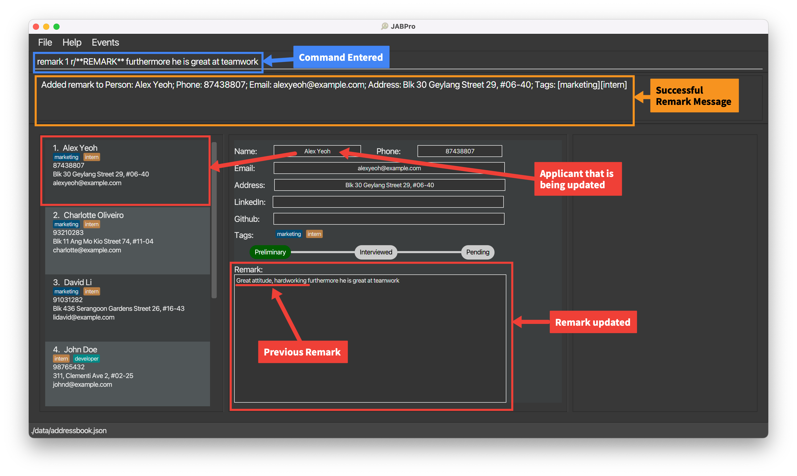

# JABPro User Guide

<!-- * Table of Contents -->
<page-nav-print />

## Table of Contents
* [Product Overview](#product-overview)
* [Key Definitions](#key-definitions)
* [User Types](#user-types)
* [Quick Start Guide](#quick-start-guide)
* [Features Overview](#features-overview)
* [Features](#features)
  * Managing Applicants
    * [Adding an applicant](#adding-an-applicant-add)
    * [Editing a candidate's detail](#editing-a-candidates-detail-edit)
    * [Deleting a candidate](#deleting-a-candidate-delete)
    * [Creating a remark for a candidate](#creating-a-remark-for-a-candidate-remark)
    * [Setting an applicant's status](#setting-an-applicants-status-set)
    * [Adding a candidate's LinkedIn/Github account](#adding-a-candidates-linkedingithub-account-addg-or-addl)
    * [Viewing a candidate's details](#viewing-a-candidates-details-view)
    * [Opening a candidate's LinkedIn/Github account](#opening-a-candidates-linkedingithub-account-linkedin-or-github)

  * Tag Colouring and Categorisation
  * Searching through and Arranging Applicants
  * Event Management and Scheduling
* [FAQ](#faq)
* [Known issues](#known-issues)
* [Command Summary](#command-summary)

## Product Overview

Are you tired of managing candidate applications through cumbersome spreadsheets? Upgrade your hiring process with JABPro (JobApplicationsBook Pro), a CLI based desktop app that allows you to easily manage candidate applications, schedule interviews, and gain valuable insights on their interview performance. From interns to full-time roles, software to marketing, JABPro’s versatile interface allows you to keep track of all kinds of job applicants in various industries. Access our self-curated user guide below to learn more on how you can integrate various JABPro’s functions into your workflow.

--------------------------------------------------------------------------------------------------------------------

## Key Definitions
You are a **beginner** user if ...

1. you are new to JABPro (used JABPro less than 5 times) *and*
2. you wish to fully rely on the JABPro interface.

You are an **advanced** user if ...
1. you have used JABPro multiple times now *and*
2. you use JABPro's search and summary statistics extensively for comparison *or*
3. you would like to challenge yourself to go beyond the JABPro user interface and manually edit files.

--------------------------------------------------------------------------------------------------------------------
## Overview of Main Features

While **JABPro** offers a whole range of features, we believe that the following features are likely to be the most useful to you:

**View summary statistics of applicants and their details:**
1. **Viewing applicant's information**: `view`

**Tag colouring and categorisation:**
1. **Creating a tag**: `create`
2. **Listing all tags**: `listT`
3. **Editing an applicant's tags and  tag scores**: `edit`

**For event management and scheduling:** 
1. **Adding an event**: `event`
2. **Viewing events**: `schedule`

**For comparing applicants:**
1. **Filtering applicants by statistics:** `filter`

These features address the complications that Hiring Managers face when managing applicants: 
1. Visual Noise and Clutter from using other applicant management software like Excel (View and Tag features address this)
2. Toggling between different software to manage applicants and schedule events (Event and Schedule features address this)
3. Having to manually compare applicants and calculate summary statistics (Filter feature addresses this)

--------------------------------------------------------------------------------------------------------------------
Go to the [Table of Contents](#table-of-contents) to navigate to the feature that you are interested in 

--------------------------------------------------------------------------------------------------------------------

## Quick Start

1. Ensure you have Java `11` or above installed in your Computer.

2. Download the latest `jabpro.jar` from [here](https://github.com/AY2324S1-CS2103T-W09-4/tp/releases).

3. Copy the file to the folder you want to use as the _home folder_ for your JabPro.

4. Open a command terminal, `cd` into the folder you put the jar file in, and use the `java -jar jabpro.jar` command to run the application.   
   A GUI similar to the below should appear in a few seconds. Note how the app contains some sample data.   
     
 
5. If your UI looks **compressed and words are being cut off such as that seen below**, you should **resize** the window to a larger size by dragging the corners of the application window. The UI should now look like the example given above.   
    

5. Type the command in the command box and press Enter to execute it. 
   Some example commands you can try:

    * `add n/John Doe p/98765432 e/johnd@example.com a/John street, block 123, #01-01`: adds an applicant with the specified contact details

    * `remark 1 r/Great attitude, hardworking`: edits the remark of the 1st person on the list to have a remark `Great attitude, hardworking`
    * `view 1`: shows the complete details of the 1st person on the list.

    * `search n/John`: Searches for applicants whose names contain the keyword `John`

    * `delete 3` : Deletes the 3rd contact shown in the current list.

    * `set` : sets the applicant status to either of: (Preliminary, Interviewed, Rejected, Offered)

    * `add linkedin 1 alexyeoh`: Adds LinkedIn account to candidate's existing contact information

    * `github Alex Yeoh`: Redirects the user to the Github account of the candidate [provided github has been added previously]

--------------------------------------------------------------------------------------------------------------------

## Features

<box type="info" seamless>

**Notes about the command format:** 

* Words in `UPPER_CASE` are the parameters to be supplied by the user. 
  e.g. in `add n/NAME`, `NAME` is a parameter which can be used as `add n/John Doe`.

* Items in square brackets are optional. 
  e.g `n/NAME [t/TAG]` can be used as `n/John Doe t/friend` or as `n/John Doe`.

* When using parentheses ( ) with items separated by the slash symbol /, at least one item must be included.  
  e.g in the command `search (n/KEYWORD [MORE KEYWORDS] / st/KEYWORD [MORE KEYWORDS] / t/KEYWORD [MORE KEYWORDS])`, it is necessary to specify at least one search category.

* Items with `…`​ after them can be used multiple times including zero times. 
  e.g. `t/TAGNAME…​` can be used as ` ` (i.e. 0 times), `t/swe t/intern` for `add` commands or `t/swe intern` for `search` and `delete` commands.

* Parameters can be in any order. 
  e.g. if the command specifies `n/NAME p/PHONE_NUMBER`, `p/PHONE_NUMBER n/NAME` is also acceptable.

* Extraneous parameters for commands that do not take in parameters (such as `help`, `listT`, `exit` and `clear`) will be ignored. 
  e.g. if the command specifies `help 123`, it will be interpreted as `help`.

* If you are using a PDF version of this document, be careful when copying and pasting commands that span multiple lines as space characters surrounding line-breaks may be omitted when copied over to the application.
  </box>

### Viewing help : `help`

Shows a message explaining how to access the help page.

Format: `help`

### Creating tags: `create`

Creates a tag and categorises it to the specified category.
You can customize these categories as per your needs and tags will be 
color coded by the different categories. 

The only restriction is that you can only define up to 6 different categories (including the *assessment* category for score-related tags. Hence if you have
defined a tag category *assessment* for score-related tags, you will only be able to define 5 other categories).

Format: `create t/CATEGORY TAGNAME…​`

* CATEGORY is a MANDATORY field. 

<box type="tip" seamless>

**Tip:** 
* You can create multiple tags at once!
* Use this command for frequently used tags for better efficiency in tagging candidates!
</box>

**Note:**
* The tags created using this command can be used to tag candidates using the `add` or `edit` command. Tagging
candidates without previously categorising the tags would still work but the tags would be *uncategorised*.
* `create` only allows tags to be categorised at creation meaning tags that have already been created, cannot be categorised further.
This feature will be supported in future iterations of JABPro through the `edit tags` command.

Examples:
* `create t/role developer`
* `create t/dept software t/dept marketing`

An example of the `create` command in action:

### Adding an applicant: `add`

Adds a person to JABPro.

Format: `add n/NAME p/PHONE_NUMBER e/EMAIL a/ADDRESS [t/[CATEGORY] TAGNAME]…​`

Type | Prefix                  | Constraints                                                                                                                                               
----------|-------------------------|----------------------------------------------------------------------------------------------------------------------------------------------------------------
Mandatory  | `n/NAME`                |  `NAME` must be alphanumeric (Letters and numbers, no symbols allowed such as `/`, `,` ...)
Mandatory| `p/PHONE_NUMBER`        | `PHONE_NUMBER` must contain numbers only and should be at-least 3 digits long
Mandatory| `e/EMAIL`               | `EMAIL` must be the standard email address format (There must be an email-prefix followed by  `@` symbol and email domain)                                                                  
Mandatory| `a/ADDRESS`             | `ADDRESS` can be any value, including special characters such as `#`, `,` ...
 Optional|  `t/[CATEGORY] TAGNAME` | `TAGNAME` must be alphanumeric with no spaces. Any details after the space will be ignored. 

**Notes regarding additional constraint on `add` command:**
* The uniqueness of the person is determined by the name only. This means that you cannot have 2 persons with the same name in the application book.
* All other fields other than name can be identical between different people in JABPro.
* Persons added using the `add` command will be added to the end of the list.

**Notes on adding tags:**
* If you would like to tag a user with a tag that has not been categorised yet using the `create` command,
you can specify the category that you would like it to be categorised to in the `add` command. e.g. `...t/role swe`
* If you are using a tag that has not been categorised yet and you did not specify its category in the `add` command,
the tag would still be saved but it would be "uncategorised" by default.
* If you have multiple tags in different categories with the same name, you must specify the category when you want to 
add one of these tags to the candidate you are adding.

<box type="tip" seamless>

**Tip:**
* A person can have any number of tags (including 0)!
</box>

 
An example of the `add` command being successfully executed:
1. Enter the command `add n/Betsy Crowe t/friend e/betsycrowe@example.com a/Newgate Prison p/1234567 t/dept finance`
2. This is the result of the successful `add` command (Take note that command entered will not be shown in the result):
   
  

An example of the `add` command failing to execute due to missing mandatory fields:
1. Enter the command `add n/Betsy Crowe t/friend` (**Missing mandatory fields**)
2. This is the result of the failed `add` command:
   
 

An example of trying to add a person with the same name as an existing person:
1. Enter the command `add n/Betsy Crowe t/friend e/betsycrowe@example.com a/Newgate Prison p/1234567 t/dept finance` (**Same name as existing applicant**)
2. This is the result of the failed `add` command:
   

### Adding a remark to a applicant: `remark`

Edits a remark of an existing applicant in JABPro.
Format: `remark INDEX r/REMARK`

Type | Prefix      | Constraints                                                                                                                                               
----------|-------------|----------------------------------------------------------------------------------------------------------------------------------------------------------------
Mandatory  | `INDEX`     |  `INDEX` must be an existing index in the displayed applicant list
Optional | `r/ REMARK` | `REMARK` can be any value, including special characters such as `#`, `,` ... 

**Notes regarding `remark` command:**
* The previous remark is not saved, and instead is replaced by the inputted remark. The command does not add to the existing remark.
* You can empty out a remark by inputting `r/` without any text after it or by omitting the `r/` prefix.
* You can get the remark previously inputted by using the **REMARK** keyword. It will be replaced with the previous remark. The keyword **REMARK** is case-sensitive. This means that `remark 1 r/**remark**` will just replace the remark with the word `**remark**`.

An example of the `remark` command being successfully executed:
1. Enter the command `remark 1 r/Great attitude, hardworking`
2. This is the result of the successful `remark` command (Take note that command entered will not be shown in the result):
   
 

An example of the `remark` command being successfully executed with the **REMARK** keyword:
1. Enter the command `remark 1 r/**REMARK** furthermore he is great at teamwork`
2. This is the result of the successful `remark` command (Take note that command entered will not be shown in the result):
   
 

An example of the `remark` command failing to execute due to wrong index:
1. Enter the command `remark 10 r/Great attitude, hardworking` (**Index does not exist on applicant list panel**)
2. This is the result of the failed `remark` command:
   
 

Additional Examples:
*  `remark 1` Empties the remark of the 1st person. It is equivalent to `remark 1 r/`.

### Viewing a person's details: `view`

Creates a complete view for details of an applicant in the second main panel and summary statistics (if applicable) of a candidate in the third main panel. 

Format: `view INDEX`

Type | Prefix      | Constraints                                                                                                                                               
----------|-------------|----------------------------------------------------------------------------------------------------------------------------------------------------------------
Mandatory  | `INDEX`     |  `INDEX` must be an existing index in the displayed applicant list

**Notes regarding `view` command:**
* The index used will be the same index as the one shown in the displayed applicant list.
* Compatible with search and other features that changes the displayed applicant list. Index always follows the index shown in the displayed applicant list.
* Refer to the [Summary Statistics](#summary-statistics) section for more details on the summary statistics.

<box type="tip" seamless>

**Tip:** Other operations that affect user's data will trigger a refresh of the view. 
These include `add`, `edit`, `set`, `remark`, `addL`, `addG`.
This means that the view will be updated to reflect the latest changes to the data for that particular applicant.

</box>

An example of the `view` command being successfully executed:
1. Enter the command `view 3`
2. This is the result of the successful `view` command (Take note that command entered will not be shown in the result):
   
 

An example of the `view` command being successfully executed for person with tags and score:
1. Enter the command `view 2` (**Person with tags and score**)
2. This is the result of the successful `view` command (Take note that command entered will not be shown in the result):
   
 

An example of the `view` command failing to execute due to wrong index:
1. Enter the command `view 0` (**Index does not exist on applicant list panel**)
2. This is the result of the failed `view` command:
   
 

### Adding Github/LinkedIn username for a user: `addG` or `addL`

Adds the username for their social profile [LinkedIn/Github] to the existing contact details of users.

Format: `addL INDEX u/USERNAME` or `addG INDEX u/USERNAME`

* User is expected to enter a valid username for the specified social profile, and an account must exist
* The username gets added as an attribute to the existing details of a candidate

Examples:
* `addG 2 u/MadLamprey`
* `addL 4 u/aditya-misra`

### Opening user LinkedIn or GitHub account: `linkedin` or `github`

Redirect user to candidate's LinkedIn or Github account.

Format: `linkedin INDEX` or `github INDEX`

* Browser window opens, showing the profile
* If the user has not provided a valid username for the corresponding social profile, an appropriate message is displayed on the interface of the social profile (JABPro does not perform error handling for this case).

Examples:
* `linkedin 1`
* `github 2`

### Listing all persons : `list`

Shows a list of all persons in JABPro

Format: 
`list` or
`list so/ATTRIBUTE`

* `so/ATTRIBUTE` is completely **optional**, on default will NOT be sorted.
* The attributes that are supported are `name` and `email`.
* Attribute is case-insensitive: `list so/NAME` and `list so/name` return the same result.
* The result will be sorted in **ascending** order.
* The sorting algorithm is case-sensitive, which means it will treat uppercase and 
lowercase letters as distinct. This may result in names being sorted as A B C a b c, rather than A a B b C c.

Examples:
* `list` Shows a list of all persons.
* `list so/name` Shows a list of all persons, sorted by name in ascending order.

### Listing all tags: `listT`

Shows a list of all tags in JABPro

Format: `listT`

* The `listT` command does not require any additional parameters or arguments.
* Tags listed by the `listT` command are unique and do not repeat.

**Example:**
* `listT` Shows a list of all tags.

### Editing a person : `edit`

Edits an existing applicant's detail in JABPro

Format: `edit INDEX [n/NAME] [p/PHONE] [e/EMAIL] [a/ADDRESS] [t/TAGNAME]…​ [sc/TAGNAME SCORE]`

Type | Prefix                | Constraints                                                                                                                                               
----------|-----------------------|----------------------------------------------------------------------------------------------------------------------------------------------------------------
Mandatory  | `INDEX`               |  `INDEX` must be an existing index in the displayed applicant list
Optional | `n/NAME`              |  `NAME` must be alphanumeric (Letters and numbers, no symbols allowed such as `/`, `,` ...)
Optional| `p/PHONE_NUMBER`      | `PHONE_NUMBER` must contain numbers only and should be at-least 3 digits long
Optional| `e/EMAIL`             | `EMAIL` must be the standard email address format (There must be an email-prefix followed by  `@` symbol and email domain)
Optional| `a/ADDRESS`           | `ADDRESS` can be any value, including special characters such as `#`, `,` ...
Optional| `t/TAGNAME`           | `TAGNAME` must be alphanumeric with no spaces. Any details after the space will be ignored.
Optional| `sc/TAGNAME SCORE`  . | `TAGNAME` a tag that is being created or already exist for that applicant. `SCORE` must be a non-negative integer.

**Notes regarding `edit` command:**
* At least one of the optional fields must be provided.
* Existing attributes will be updated to the input values.
* There is a way to edit tags and their categories at the same time. Look at the notes for editing tags with categories `t/[CATEGORY] TAGNAME` for more details.

**Notes on editing the tags of the specified person for `t/TAGNAME`**:
* When editing tags, the existing tags of the person will be removed i.e adding of tags is not cumulative.
* You can remove all the person’s tags by typing `t/` without
  specifying any tags after it.
* There is no current way to keep the existing tags and add new tags to the person. You will have to re-tag the person with the existing tags and the new tags.

**Notes on editing the score of the specified person for `sc/TAGNAME SCORE`**:
* The `TAG` in `sc/TAG SCORE` must be a tag of the category `assessment`. You cannot use the `sc/TAG SCORE` field for tags that are not of the `assessment` category.
* The `sc/TAG SCORE` field can only be used after the `t/TAG` field is used if the tag has not been created  or the `TAG` already exist on the applicant
* The `SCORE` in `sc/TAG SCORE` is non-negative, that is `SCORE` must be more than or equal to 0 
* To clear a tag's score, just re-tag it with the same tag name, but without using the `sc/TAG SCORE` field

Notes on rules for `edit` command involving tags with categories for `t/[CATEGORY] TAGNAME`:
* Consequently, similar rules for `add` apply to the `edit` command involving tags:
  * If you would like to tag a user with a tag that has not been categorised yet using the `create` command, 
    you can specify the category that you would like it to be categorised to in the `edit` command. e.g. `edit 1 t/role swe`
  * If you are using a tag that has not been categorised yet and you did not specify its category in the `add` command,
    the tag would still be saved but it would be "uncategorised" by default.
  * If you have multiple tags in different categories with the same name, you must specify the category when you want to
    tag the specified candidate with one of these tags.

<box type="tip" seamless>

1. Editing an applicant's details will trigger a refresh of the view. This means that the view will be updated to reflect the latest changes to the data for that particular applicant.
2. We strongly recommend that you categorise tags using `create` before using `edit` to tag candidates. This is to reduce the confusion of having two ways to tag applicants.
</box>

An example of the `edit` command being successfully executed:
1. Enter the command `edit 1 n/Alex Ho p/91234567` (**Edit name and phone number**)
2. This is the result of the successful `edit` command (Take note that command entered will not be shown in the result):
   
 

An example of the `edit` command being successfully executed with tags and score:
1. Ensure that you have created a tag `Interview` under the `assessment` category using the `create` command. That is, enter the command `create t/assessment Interview`
2. Enter the command `edit 1 t/Interview sc/Interview 80` (**Edit tag and score**) 
3. This is the result of the successful `edit` command (Take note that command entered will not be shown in the result):
   
 

An example of the `edit` command being successfully executed to clear a tags and score:
1. Enter the command `edit 1 t/` (**Clear all tags**)
2. This is the result of the successful `edit` command (Take note that command entered will not be shown in the result):
   
 

An example of the `edit` command being wrongly executed due to trying to attach a score to a tag that is not of the `assessment` category:
1. Enter the command `edit 1 t/TechLead sc/TechLead 80` (**Tag `TechLead` is not of the assessment category**)
2. This is the result of the failed `edit` command:
   
 

### Filter job applicants by statistics: `filter`

Filters and display applicants in the current displayed applicant list using statistical metrics and values.

Format:`filter t/TAGNAME met/METRIC val/VALUE` or `filter t/TAGNAME met/METRIC`

Type | Prefix                | Constraints                                                                                                                                               
----------|-----------------------|----------------------------------------------------------------------------------------------------------------------------------------------------------------
Mandatory  | `t/TAGNAME`           |  `TAGNAME` must be a tag that is of the category `assessment`
Mandatory| `met/METRIC`          | `METRIC` must be either `score`, `percentile`, `mean`, `median`
Optional| `val/VALUE`           | Optional only for `mean` and `median`. Otherwise, VALUE` must be a non-negative integer and is a mandatory field.

**Notes regarding `filter` command:**
* Filter works only on the current list of job applicants displayed. It is essential that you enter `list` before using `filter` to ensure that you are filtering the correct list of job applicants.
* It is strongly recommended that you use `filter` after you have tagged most of the job applicants with a tag that has a score.
* Filters and displays job applicants whose **value** is **greater than or equal** to the specified value for the specified statistic metric.
* For `METRIC` that is `mean` or `median`, the `VALUE` is optional. Specifying a `VALUE` here will be ignored accordingly. `filter t/TAGNAME met/METRIC` is equivalent to `filter t/TAGNAME met/METRIC val/X` where `X` is any positive integer.
* Filter does not edit, update or in any way change the data of the job applicants. It only filters and displays the job applicants.
* Filter does not trigger view, that is your view panels represent the previous candidate you viewed before filtering.
* To get back the **original list with all the applicants**, simply type `list` again.

**Notes on the different metrics:**
Do look at the [Summary Statistics](#summary-statistics) section for more details on the summary statistics metrics.

<box type="tip" seamless>

You should use `filter` after you have tagged most of the job applicants with a tag that has a score.   
This is because some of the metrics such as `percentile`, `mean` and `median` require a certain number of scores to be considered meaningful.
Read more about this in the [Summary Statistics](#summary-statistics) section.

</box>

Set up for examples when you first start JABPro with default data:
1. `list` 
2. `create t/assessment interview` to create a tag `interview` under the `assessment` category.
3. `edit 1 t/interview sc/interview 80` 
4. `edit 2 t/interview sc/interview 90` 
5. `edit 3 t/interview sc/interview 70`
6. The result of the above commands should look like this:
   
 

An example of the `filter` command being successfully executed:
1. Enter the command `list`
2. Enter the command `filter t/interview met/percentile val/80` (**Filter by percentile**)
3. This is the result of the successful `filter` command (Take note that command entered will not be shown in the result):
   
 

An example of the `filter` command being successfully executed with `median`: 
1. Enter the command `list`
2. Enter the command `filter t/interview met/median` (**Filter by median**)
3. This is the result of the successful `filter` command (Take note that command entered will not be shown in the result):
   
 

An example of the `filter` command being incorrectly executed due to non-existent tag:
1. Enter the command `list`
2. Enter the command `filter t/techlead met/percentile val/80` (**Tag `techlead` does not exist**)
3. This is the result of the failed `filter` command:
   
  

An example of the `filter` command being incorrectly executed due to an invalid value for `val/VALUE`:
1. Enter the command `list`
2. Enter the command `filter t/interview met/percentile val/-1` (**Negative value for percentile**)
3. This is the result of the failed `filter` command:
   
 

**Significance of using `filter` with the metrics `score`, `percentile`, `mean` and `median`:**
In essence, this allows you to find job applicants whose performance rating is above a certain percentile, score or mean/median score for that tag.  
Ideally, this feature can then be used to find the best candidates easily and quickly without having to manually look through the list of candidates.

### Searching job applicants by category: `search`

Finds job applicants whose profiles match the specified categories' keywords. The search categories are: name, status, tag.

Format: `search (n/NAME... / st/STATUS... / t/TAGNAME...)`

#### Searching job applicants by name

Finds job applicants whose names contain the given keywords.

Format: `search n/NAME...`

* Keywords are case-insensitive: `search n/Josh` and `search n/josh` return the same result.
* Keyword has to be a string that does not contain any non-alpha numeric characters.
* The order of the keywords does not matter. e.g. `Josh Peck` will match `Peck Josh`.
* Only full words will be matched e.g. `Jo` will not match `Josh`.
* Applicants matching at least one keyword will be returned (i.e. `OR` search)
  e.g. `Josh Peck` will return `Josh Gad`, `Josh Job`.

Examples:
* `search n/John` returns `john` and `John Doe`
* `search n/alex david` returns `Alex Yeoh`, `David Li` 

#### Searching job applicants by status

Finds job applicants whose status match any of the given keywords.

Format: `search st/STATUS...`

* Keywords can only be from the following list: `Preliminary`, `Interviewed`, `Rejected`, `Offered`
  e.g. `search st/interviewing` will give an error.
* Keywords are case-insensitive: `search st/interviewed` and `search st/INTERVIEWED` return the same result.

Example:
* `search st/interviewed`

#### Searching job applicants by tag

Finds job applicants whose tag(s) match any of the given tag keywords

Format: `search t/TAGNAME...`

* Keywords are case-insensitive: `search t/hardworking` and `search t/HARDWORKING` return the same result.

Example:
* `search t/hardworking`

#### Notes for advanced users:
* You can combine the search categories (e.g. `search n/Alex st/offered t/software engineer`) in a single search command.
* Each search category can be used at most once in a single search command
  e.g. `search n/Alex n/Adam st/rejected` is not allowed.

Example:
* `search n/Alex Bernice st/interviewed rejected t/intern` will output applicants whose:
    * names contain either Alex `or` Bernice
    * `and` status is either interviewed `or` rejected.
    * `and` has a tag `intern`

### Deleting job applicants : `delete`

Deletes the specified job applicants from the address book.

Format: `delete INDEX` or `delete (t/TAGNAME... st/STATUS...)`

Note:
* User **cannot** delete by index and delete by tags & status in a single command. 
  E.g. `delete 1 t/hardworking` is not allowed. 

#### Deleting job applicants by index

Deletes job applicants at the specified index.

Format `delete INDEX`

* The index refers to the index number shown in the displayed person list.
* The index **must be a positive integer** 1, 2, 3, …​

Example: 
* `list` followed by `delete 2` deletes the 2nd person in the address book.
* `find Betsy` followed by `delete 1` deletes the 1st person in the results of the `find` command.

#### Deleting job applicants by tag

Deletes job applicants whose tag(s) match any of the given tag keywords

* Keywords are case-insensitive: `delete t/hardworking` and `delete t/HARDWORKING` return the same result.

Example:
* `delete t/hardworking`

#### Deleting job applicants by status

Deletes job applicants whose status match any of the given keywords.

Format: `delete st/STATUS...`

* Keywords can only be from the following list: `Preliminary`, `Interviewed`, `Rejected`, `Offered`
  E.g. `delete st/interviewing` will give an error.
* Keywords are case-insensitive: `delete st/interviewed` and `delete st/INTERVIEWED` return the same result.

Example:
* `delete st/interviewed`

#### Notes for advanced users:
* You can combine the status and tags prefixes (e.g. `delete st/offered t/hardworking`) in a single delete command.
* Each delete category can be used at most once in a single search command. 
  E.g. `delete st/interviewed st/rejected` is not allowed.

Example:
* `delete st/interviewed rejected t/intern manager` will delete applicants whose:
    * status is either **interviewed** or **rejected**
    * AND has a tag `intern` or `manager`

### Setting an applicant's status : `set`

Format: `set INDEX STATUS`

Sets the applicant to a specific status ("Preliminary"/ "Interviewed"/ "Rejected"/ "Offered")

* Sets the person at the specified `INDEX` to a specific hiring status.
* The index refers to the index number shown in the displayed person list.
* The index **must be a positive integer** 1, 2, 3, …​
* The status must be a string of exactly "Preliminary", "Interviewed", "Rejected" or "Offered".

Examples:
* `list` followed by `set 2 Interviewed` sets the 2nd person in the address book to "Interviewed".
* `find Betsy` followed by `set 1 Interviewed` sets the status of 1st person in the results of the `find` command.

### Adding an Event: `event`

Adds an event to JABPro.

Format: `event INDEX d/DESCRIPTION bt/BEGIN_TIME et/END_TIME`

* `BEGIN_TIME` and `END_TIME` must be in the format `yyyy-MM-dd HH:mm`
* Event gets added to the current list of events, and also gets written to the `eventbook.json` file

Example:
* `event 1 d/Interview bt/2023-10-27 18:00 et/2023-10-27 21:00` adds an event to the list, and stores the name of the person the event is associated with, the description, start time and end time, in a JSON file.

### Viewing events: `schedule`

Displays all events that have been added to JABPro.

Format: `schedule`

* Opens the `Events` window, which can also be accessed by clicking on `Events > Event` in the menu bar

Example:
* First, entering `event 1 d/Interview bt/2023-10-27 18:00 et/2023-10-27 21:00` adds the event, and entering `schedule` displays this event in a separate window, titled `Events`

### Clearing all entries : `clear`

Clears all entries from the address book.

Format: `clear`

### Exporting all entries : `export`

Exports the entries into a .csv file located in the current directory as (/data/export.csv)

* Note: Export currently does not support Events.

* Usage Note: JABPro must have write permissions, this means that if the .csv file is open,
exporting again will not be possible.

Format: `export`

### Exiting the program : `exit`

Exits the program.

Format: `exit`

## Summary Statistics

Summary Statistics is a table generated by JABPro that displays the following information about an applicant:
It is generated for tags that are categorised under the `assessment` category.

 Statistic / Metric                | Description                                                                                                                                              
--------------------------|----------------------------------------------------------------------------------------------------------------------------------------------------------------
`score`                   | The score of the candidate for the tag
`mean`                    | The mean score of candidates with that tag
`median`                  | The median score of candidates with that tag
`minimum`                 | The minimum score of candidates with that tag
`maximum`                 | The maximum score of candidates with that tag
`percentile`              | The percentile of the candidate for that tag

<box type="warning" seamless>
You should ensure that you have **sufficient candidates of more than 20** with a score for the tag you are interested in, before using the summary statistics to make comparisons.  
</box> 

**Notes on why you should have sufficient candidates with a score for the tag you are interested in:**
1. This is due to the fact that these summary statistics rely on concepts such as mean, median and percentile, which are statistical concepts that require a sufficient sample size to be meaningful. 
2. For example, if you have only assigned 5 out of 100 candidates, the summary statistics will not be representative of the actual mean, median and percentile for that tag. 
3. In this case, you should assign more candidates with a score for that tag, before using the summary statistics to make comparisons. 
5. If you have assigned a sufficient number of candidates with a score for that tag, you can use the summary statistics to make comparisons. For example, you want to check if a candidate's score for a tag is more than or equal to half of all the candidates who have a score for that tag, you can use the median to make this comparison.
  * A **sufficient number** could be deemed as **any number that is more than 20**, but this is not a hard and fast rule. You should use your own discretion to determine if the number of candidates with a score for that tag is sufficient.

<box type="tip" seamless>

1. Use mostly `median` and `percentile` to make your judgement on the performance of a candidate.
2. `median` to find candidates who are the better performing half
3. `percentile` as where this candidate stands among all other candidates (treat it like a ranking system, the higher the percentile, the better the candidate is performing)

</box>

**Advanced users**
* Understand that `percentile` has limited functionality in some context. This is because if two applicants have the same score, they are `rank` the same. This means that the percentile of both applicants will be the same.
  * If all applicants have the same score, their percentile will all be 0.0. This is because they are all `rank` the same.
  * Additionally, when the spread of scores is small, the percentile will not be able to differentiate between applicants with similar scores.

**Formula used to calculate the summary statistics:**
**mean** is calculated by using the formula `sum of all scores with that tag/ number of candidates with that tag`
**median** is calculated by using the formula `middle score of all scores with that tag`
**minimum** is calculated by using the formula `lowest score of all scores with that tag`
**maximum** is calculated by using the formula `highest score of all scores with that tag`
**percentile** is calculated by using the formula `number of candidates with a score strictly lower than the candidate/ total number of candidates with that tag`

### Saving the data

JABPro data are saved in the hard disk automatically after any command that changes the data. There is no need to save manually.

### Editing the data file

JABPro data are saved automatically as a JSON file `[JAR file location]/data/addressbook.json`. Advanced users are welcome to update data directly by editing that data file.

<box type="warning" seamless>

**Caution:**
If your changes to the data file makes its format invalid, JABPro will discard all data and start with an empty data file at the next run.  Hence, it is recommended to take a backup of the file before editing it.
</box>

_Details coming soon ..._

--------------------------------------------------------------------------------------------------------------------

## Planned Enhancements

### Deleting tags : `delete tag`

While certainly useful, JABPro currently does not have feature to delete existing tags. However, this feature will be implemented
in future iterations.

<box type="tip" seamless>

**Tip:**
* If you are an advanced user, you are welcome to delete your tags manually by editing the json file! 
</box>

### Editing tags : `edit tag`

JABPro currently does not support editing tags i.e. editing tag name or category. This feature will be implemented in future iterations.

**Tip:**
* If you are an advanced user, you are welcome to edit your tags manually by editing the json file!
  </box>

### Exporting events : `export`

JABPro currently does not support exporting Events. This feature will be implemented in future iterations.

--------------------------------------------------------------------------------------------------------------------

## FAQ

**Q**: How do I transfer my data to another Computer? 
**A**: Install the app in the other computer and overwrite the empty data file it creates with the file that contains the data of your previous JABPro home folder.

**Q**: What's the difference between *tip* and *note*? 
**A**: *Tip* is something useful to know and can be done beforehand, while *note* is something you have to be concious about and take into account. 

--------------------------------------------------------------------------------------------------------------------

## Command Summary

 Action                   | Format, Examples                                                                                                                                               
--------------------------|----------------------------------------------------------------------------------------------------------------------------------------------------------------
 **Create**               | `create t/CATEGORY NAME…​`   e.g. `create t/dept software`
 **Add**                  | `add n/NAME p/PHONE_NUMBER e/EMAIL a/ADDRESS [t/[CATEGORY] TAG]…​`   e.g., `add n/James Ho p/22224444 e/jamesho@example.com a/123, Clementi Rd, 1234665 t/developer t/intern` 
 **Remark**               | `remark r/REMARK`   e.g., `remark 1 r/Great attitude, hardworking`                                                                                          
 **View**                 | `view INDEX`   e.g., `view 1`                                                                                                                               
 **Add Github/LinkedIn**  | `addL INDEX u/USERNAME` or `addG INDEX u/USERNAME` e.g., `addL 1 u/alex-yeoh`, `addG 2 u/bernicesanders123`                                                    
 **Open Github/LinkedIn** | `linkedin INDEX` or `github INDEX` e.g., `linkedin 1`, `github 2`                                                                                              
 **Clear**                | `clear`                                                                                                                                                        
 **Delete**               | `delete INDEX` or `delete (t/TAG [MORE TAGS] st/STATUS)`   e.g., `delete 3`, `delete t/intern st/rejected`                                                                                                                           
 **Set**                  | `set INDEX STATUS`  e.g., `set 2 Interviewed`                                                                                                               
 **Edit**                 | `edit INDEX [n/NAME] [p/PHONE_NUMBER] [e/EMAIL] [a/ADDRESS] [t/TAGNAME]​ [sc/TAGNAME SCORE]`  e.g.,`edit 2 n/James Lee e/jameslee@example.com t\MarketingInterview sc\MarketingInterview 50`                                   
 **Search**               | `search (n/NAME [MORE NAME] / st/STATUS [MORE STATUS] / t/TAGS [MORE TAGS])`   e.g., `search n/alex` 
 **Filter**               | `filter t/TAGNAME met/METRIC val/VALUE`   e.g., `filter t/interview met/score val/80`
 **List**                 | `list so/ATTRIBUTE`   e.g. `list so/name`
 **ListT**                | `listT`
 **Export**               | `export`                                                                                                                                                       
 **Help**                 | `help`
 **Event**                | `event INDEX d/DESCRIPTION bt/START_TIME et/END_TIME`
 **Schedule**             | `schedule`

## Prefix Summary
Prefix                    | Name         | Commands                                                                                                                                            
--------------------------|--------------| --------------------------
`n/`                      | name         | Add, Edit, Search
`p/`                      | phone number | Add, Edit
`e/`                      | email        | Add, Edit
`a/`                      | address      | Add, Edit
`t/`                      | tag          | Add, Edit, Search, Create, Delete
`st/`                     | status       | Search, Delete, Set
`r/`                      | remark       | Remark
`u/`                      | username     | Add Github/LinkedIn
`met/`                    | metric       | Filter
`val/`                    | value        | Filter
`so/`                     | sort         | List
`d/`                      | description  | Event
`bt/`                     | begin time   | Event
`et/`                     | end time     | Event

