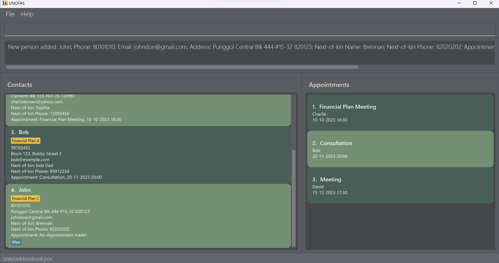
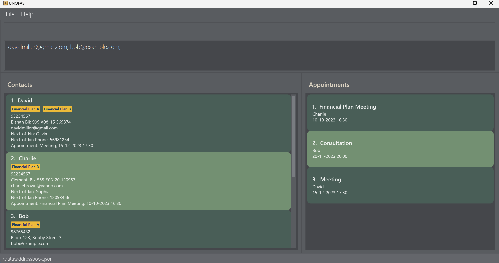
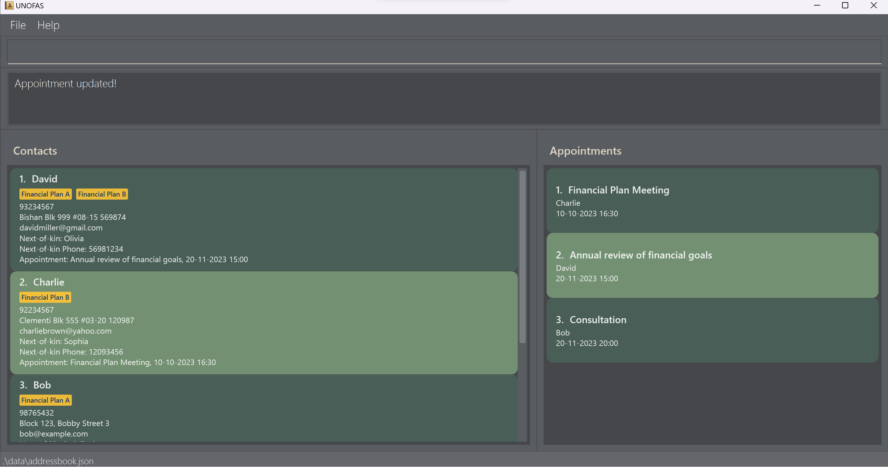
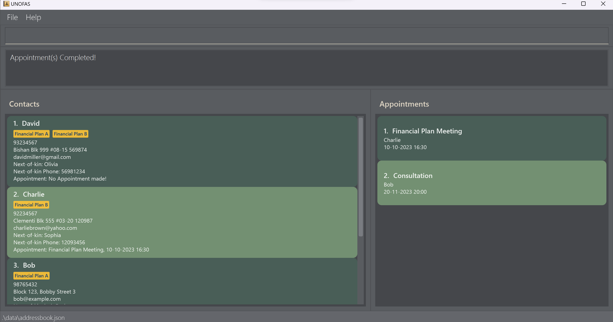
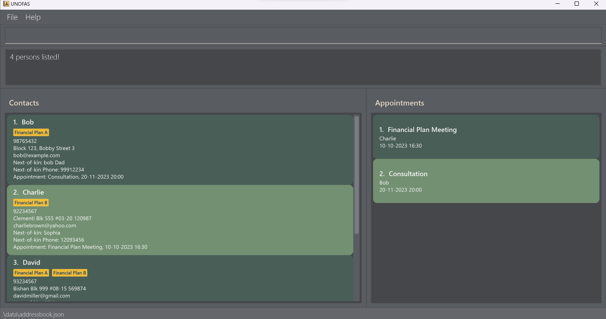

## Welcome to UNOFAS!
Welcome to the User Guide for UNOFAS, your comprehensive solution for efficient and organized client contact management. Ever found yourself spending countless hours sorting and managing your clients' contacts? We understand the importance of managing your school commitments alongside maintaining strong relationships with your clients as dedicated student financial advisors. UNOFAS has been designed to streamline administrative hassles, providing you with the tools you need to manage clients' contacts efficiently.

## What is UNOFAS?
UNOFAS (UNO: One FAS: Financial Advisors app) is a **desktop app for Financial Advisors to manage clients contacts and schedule appointments,
optimized for use via a Command Line Interface** (CLI) while still having the benefits of a
Graphical User Interface (GUI). For fast typists, UNOFAS can help you manage and retrieve client's information
better than traditional GUI apps.

## Purpose of this guide
This guide provides you with comprehensive instructions on utilizing UNOFAS. It also serves as a mode of referral to
help learn the various commands required to effectively learn and be able to integrate the application to your daily
use as financial advisors. 

To help you make the most of this resource, we would recommend that you take some time to read through the entire guide.
You can then utilize the Table of Contents provided below and click on the relevant links to easily navigate through 
the guide and access the information you might need or want to take another look at. We hope that this guide serves you well
to help make managing your clients a more pleasant experience.

## Legend
:information_source: Important information to take note of.  
:bulb: Useful tips for improving usability of the application.  
:exclamation: Mistakes to be wary of.

## Table of Contents
* [Quick Start](#quick-start)
* [UI Components](#ui-components)
  * [General UI Information](#general-ui-information)
  * [Contact Card](#contact-card)
  * [Appointment Card](#appointment-card)
* [Features](#features)
  * [Help](#viewing-help--help)
  * [Add](#adding-a-client-contact--add)
  * [List](#listing-all-client-contacts--list)
  * [Edit](#editing-a-client-contact--edit)
  * [Find](#locating-clients-by-name-financial-plan-andor-tag--find)
  * [Gather](#gathering-emails-of-matching-clients--gather)
  * [Schedule](#scheduling-an-appointment--schedule)
  * [Complete](#completing-an-appointment--complete)
  * [Delete](#deleting-a-client--delete)
  * [Clear](#clearing-all-entries--clear)
  * [Sort](#sorting-of-data--sort)
  * [Exit](#exiting-the-program--exit)
* [Saving the data](#saving-the-data)
* [Editing the data file](#editing-the-data-file)
* [FAQ](#faq)
* [Known Issues](#known-issues)
* [Command Summary](#command-summary)

--------------------------------------------------------------------------------------------------------------------

## Quick Start

1. Ensure you have Java `11` or above installed in your Computer.
   For further information, you may refer to these guides on [how to check java version](https://www.java.com/en/download/help/version_manual.html)
   and [how to install Java](https://docs.oracle.com/en/java/javase/11/install/overview-jdk-installation.html#GUID-8677A77F-231A-40F7-98B9-1FD0B48C346A) if needed.

2. Download the latest `unofas.jar` from [here](https://github.com/AY2324S1-CS2103T-F12-1/tp/releases).

3. Copy the file to the folder you want to use as the _home folder_ for your UNOFAS.

4. Open a command terminal, `cd`(change directory) into the folder you put the jar file in. For example, if the file is in
   your `Documents` folder, go to the terminal and type in `cd ~/Documents`. 
   Once you are in the selected folder, enter the `java -jar unofas.jar` command into the terminal
   to run the application. 
   A GUI similar to the below should appear in a few seconds. Note how the app contains some sample data. 
   

5. Type the command in the command box and press the Enter key to execute it. e.g. typing **`help`** and pressing Enter will
   open the help window. 
   Some example commands you can try:

   * `list` : Lists all your client-contacts.

   * `add n/John Doe p/98765432 e/johnd@example.com a/John street, block 123, #01-01 nk/David nkp/91234567` : Adds a contact named `John Doe`
   to the Contact Book.

   * `delete 3` : Deletes the 3rd contact shown in the contact list.

   * `clear` : Deletes all client contacts.

   * `exit` : Exits the application.

6. Refer to the [Features](#features) below for details of each command.

--------------------------------------------------------------------------------------------------------------------
## UI Components

### General UI information

| Component            | Purpose                                                |
|----------------------|--------------------------------------------------------|
| **Navigation Bar**   | Allows you to exit UNOFAS or view help                 |
| **Command Line**     | Location to enter commands                             |
| **Result Line**      | Displays the result after a command is entered         |
| **Contact List**     | Displays client contacts                               |
| **Appointment List** | Displays appointments                                  |
| **Contact Card**     | Displays detailed information about a client           |
| **Appointment Card** | Displays detailed information about an appointment     |
| **Save Location**    | Displays the location where your UNOFAS data is stored |

### Contact Card

* Shows the client's name, phone number, financial plan(s) (if any), address, email address, next-of-kin name, next-of-kin phone number, appointment (if any) and tag(s) (if any).

### Appointment Card

* Shows the appointment name, client allocated to the appointment and the appointment date and time.
* The appointment cards displayed will only include appointments of clients displayed in the contact list. 

--------------------------------------------------------------------------------------------------------------------

# Features

**:information_source: Notes about the command format:** 

* Words in `UPPER_CASE` are the parameters to be supplied by users. 
  e.g. in `add n/NAME`, `NAME` is a parameter which can be used as `add n/John Doe`.

* Items in square brackets are optional. 
  e.g. `n/NAME [t/TAG]` can be used as `n/John Doe t/friend` or as `n/John Doe`.

* Unless explicitly allowed, blank inputs or inputting any number of spaces as an argument for a field is invalid.

* Items with `…`​ after them can be used multiple times including zero times. 
  e.g. `[t/TAG]…​` can be used as ` ` (i.e. 0 times), `t/friend`, `t/friend t/family` etc.

* Parameters can be in any order. 
  e.g. if the command specifies `n/NAME p/PHONE_NUMBER`, `p/PHONE_NUMBER n/NAME` is also acceptable.

* Any input parameters that do not adhere to the accepted values will result in the command
  **failing and not executing**.

* Extraneous parameters for commands that do not take in parameters (such as `help`, `list`, `exit` and `clear`) will
  be ignored. 
  e.g. if the command specifies `help 123`, it will be interpreted as `help`.

* If you are using a PDF version of this document, be careful when copying and pasting commands that span multiple
  lines as space characters surrounding line-breaks may be omitted when copied over to the application.

--------------------------------------------------------------------------------------------------------------------
# Argument Summary

Below is a table summarising common arguments used in `add`, `edit`, `find`, `schedule` etc. Refer to the table below
to view the arguments' prefix, and their acceptable values. Unless specified, having only space characters i.e. an empty
value, is not an acceptable value and will result in a warning.

| Prefix | Argument              | Acceptable Values                                                                                                          |
|--------|-----------------------|----------------------------------------------------------------------------------------------------------------------------|
| -      | INDEX                 | Number (1 to current size of the contact book)                                                                             |
| `n/`   | NAME                  | Alphabets, numbers, and space characters only                                                                              |
| `p/`   | PHONE_NUMBER          | Numbers only and at least 3 digits long                                                                                    |
| `e/`   | EMAIL                 | Alphabets, numbers, and symbols only in a valid email format                                                               |
| `a/`   | ADDRESS               | Any value is possible.                                                                                                     |
| `nk/`  | NEXT_KIN              | Alphabets, numbers, and space characters only                                                                              |
| `nkp/` | NEXT_KIN_PHONE        | Numbers only and at least 3 digits long                                                                                    |
| `fp/`  | FINANCIAL_PLAN        | Alphabets, numbers, and space characters only. Empty value is accepted when using [Edit](#editing-a-client-contact--edit). |
| `t/`   | TAG                   | Alphabets and numbers only. Empty value is accepted when using [Edit](#editing-a-client-contact--edit).                    |
| `ap/`  | APPOINTMENT_NAME      | Alphabets, numbers, and space characters only                                                                              |
| `d/`   | APPOINTMENT_DATE      | Format: dd-MM-yyyy (e.g., 31-12-2023)                                                                                      |
| `d/`   | APPOINTMENT_DATE_TIME | Format: dd-MM-yyyy HH:mm (e.g., 31-12-2023 14:30)                                                                          |
| -      | KEYWORD               | `name` or `appointment`                                                                                                    |

:information_source:
**Do note** If the ADDRESS includes any recognized prefixes (leading space + prefix), users should be careful. 
For instance, if you input `a/Blk 285 n/Clementi` for the ADDRESS argument, it will trigger the identification of the prefix `n/` in the input and result in an error message

-----------------------
### Viewing help : `help`

Displays a message explaining how to access the help page, as well as a list of available keywords.

Format: `help`

---------------------------
### Adding a client-contact : `add`

Adds a client's contact (name, phone number, email, home address, next-of-kin name, next-of-kin phone
number) into contact book.

Format: `add n/NAME p/PHONE_NUMBER e/EMAIL a/ADDRESS nk/NEXT_KIN nkp/NEXT_KIN_PHONE [fp/FINANCIAL_PLAN]… [t/TAG]…​`

* Adding a new client-contact with the exact same name (case-sensitive) as a client currently in the contact book counts as a
    duplicate and will cause the command to fail. Duplicate information in other fields does not count as a duplicate
    client.
* To prevent accidentally adding duplicates, you can use [Find](#locating-clients-by-name-financial-plan-andor-tag--find)
    to check if you have already added the client.
* After performing an add, the contact list will be reset to display all client contacts.

Acceptable Values: Refer to [Argument Summary](#argument-summary).

:bulb: **Tip:**
A client-contact can have any number of Financial Plans (including 0).
A client-contact can have any number of tags (including 0).

Examples:
* `add n/John p/80101010 e/johndoe@gmail.com a/Punggol Central Blk 444 #15-32 820123 nk/Brennan nkp/82020202 t/80yo fp/Financial Plan C`

Successful Output: `New person added: John;
Phone: 80101010;
Email: johndoe@gmail.com;
Address: Punggol Central Blk 444 #15-32 820123;
Next-of-kin Name: Brennan;
Next-of-kin Phone: 82020202;
Appointment: No Appointment made!;
Financial Plans: [Financial Plan C];
Tags: [80yo]`

:information_source:
**Do note** that it is possible to add a client's contact with multiple tags by duplicating the `t/` prefix. The same can be done for financial plans with the `fp/` prefix.

------------------
### Listing all client-contacts : `list`

Displays a list of all the clients and their contact details that are currently stored in the contact book. 

Format: `list`

Successful Output: `Listed all persons`

--------------------------------
### Editing a client-contact : `edit`

Edit clients contact fields using an index followed by the updated details.

Format: `edit INDEX [n/NAME] [p/PHONE_NUMBER] [e/EMAIL] [a/ADDRESS] [nk/NEXT_KIN] [nkp/NEXT_KIN_PHONE] [fp/FINANCIAL_PLAN]…​ [t/TAG]…​`

* Edits the client-contact at the specified `INDEX`. The index refers to the index number shown in the displayed contact list. The index **must be a positive integer** 1, 2, 3, …​
* AT LEAST ONE of the optional fields must be provided.
* Existing values will be updated to the input values.
* Editing the name of a client to be the exact same name as another client currently in the contact book
(case-sensitive) counts as a duplicate and will cause the command to fail. Duplicate information in other ways does
not count as a duplicate contact.
* When editing financial plans or tags, the existing financial plans or tags of the client will be removed i.e. adding
of tags is not cumulative.
* You can remove all the client's tags by typing `t/` without specifying any tags after it.
* You can remove all the client's financial plans by typing `fp/` without
  specifying any financial plans after it.
* A client's appointment cannot be edited in this manner. Refer to [Schedule](#scheduling-an-appointment--schedule).
* After performing an edit, the contact list will be reset to display all contacts.

Acceptable Values: Refer to [Argument Summary](#argument-summary).

Examples:
*  `edit 4 n/john doe a/23 woodlands ave 123` Edits the name and address of the 1st client to be `john doe` and `woodlands ave 123` respectively.

Successful Output:
`Edited Person: john doe;
Phone: 80101010;
Email: johndoe@gmail.com;
Address: 23 woodlands ave 123;
Next-of-kin Name: Brennan;
Next-of-kin Phone: 82020202;
Appointment: No Appointment made!;
Financial Plans: ;
Tags:`

:information_source:
**Do note** that it is possible to edit a client's contact with multiple tags by duplicating the `t/` prefix. The same can be done with for financial plans with the `fp/` prefix.
However, multiple empty values for tags and financial plans are not accepted. For example, `t/ t/` and `fp/ fp/` is not accepted.

---------------
### Locating clients by name, financial plan, and/or tag : `find`

Finds client-contact(s) whose names, tags or financial plans contain any of the specified keywords.

Format: `find [n/NAME]…​ [fp/FINANCIAL_PLAN]…​ [t/TAG]…​`

* At least one of the optional fields must be provided.
* This command will ignore other prefixes. Using them anyway can cause undefined behaviour.
* The search is case-insensitive. e.g `hans` will match `Hans`.
* For names, only full words will be matched e.g. `Han` will not match `Hans`.
* Calling this command on a sorted list will retain the sorted quality of the list.
* For financial plans and tags, any substring will be matched e.g. `Senior` will match `SuperSenior`.
* Contacts matching at least one keyword will be returned (i.e. `OR` search).
  e.g. `n/Hans n/Bo` will return `Hans Gruber`, `Bo Yang`.
* Upon successful execution of the command, only the relevant contact details will be reflected in the **Contact list**. The relevant appointment details will also be updated in the **Appointment list**.

Acceptable Values: Refer to [Argument Summary](#argument-summary).

Examples:
* `find n/john n/charlie` returns `Charlie`, `john doe` 

  

### Gathering emails of matching clients : `gather`

Gathers all the emails of clients with a desired financial plan or tag.

Format: `gather fp/FINANCIAL PLAN` or `gather t/TAG`

* Generates a list of emails separated by semicolons, making it convenient for copying and pasting into the recipient input of an email application. 
  This function currently known to be compatible with gmail and outlook but might not work for all email services.
* Either **Financial Plan or Tag** can be searched at once, but **not both**.
* The search is case-insensitive e.g. `financial` will match `FINANCIAL` or `Financial`.
* A client's email will be gathered if the prompt matches a substring of their financial plan or tag.

Acceptable Values: Refer to [Argument Summary](#argument-summary).

Examples:
* `gather t/Elderly`
* `gather fp/Financial Plan A`

Successful Output:
`davidmiller@gmail.com; bob@example.com;`

------------
### Deleting a client : `delete`

Deletes the client-contact from the contact book by their index.

Format: `delete INDEX`

* Deletes the contact at the specified `INDEX`.
* The index refers to the index number shown in the displayed contact list.

Acceptable Values: Refer to [Argument Summary](#argument-summary).

Examples:
* `list` followed by `delete 1` deletes the 1st contact in the contact book.

Successful Output:
`Deleted Person: David;
Phone: 93234567;
Email: davidmiller@gmail.com;
Address: Bishan Blk 999 #08-15 569874;
Next-of-kin Name: Olivia;
Next-of-kin Phone: 56981234;
Appointment: Meeting, 15-12-2023 17:30;
Financial Plans: [Financial Plan A][Financial Plan B];
Tags: `

----------
### Scheduling an Appointment : `schedule`

Schedules an appointment for a client using an index followed by the appointment details.

Format: `schedule INDEX ap/APPOINTMENT_NAME d/APPOINTMENT_DATE_TIME`

- Schedules appointment with the client contact at the specified `INDEX`. The index refers to the index number shown in the displayed contact list.
- **Both appointment name and date-time** must be provided.
- Upon successful execution of the command, the scheduled appointment details will be updated in the **Contact list**. The appointment details will also be updated in the **Appointment list**. 
The contact list displayed will be reset to display all clients in the Contact Book.

:information_source:
If there is an existing appointment with the client when the command is executed, you can replace it with a new appointment by **clicking confirm** or **pressing the enter key** when the prompt is given.

  

Acceptable Values: Refer to [Argument Summary](#argument-summary).

Example:
- `schedule 1 ap/Annual review of financial goals d/20-11-2023 15:00`

Successful Output: \
For overridden appointment: `Appointment updated!`\
For new appointment: `New appointment added: David; Phone: 93234567; Email: davidmiller@gmail.com; Address: Bishan Blk 999 #08-15 569874; Next-of-kin Name: Olivia; Next-of-kin Phone: 56981234; Appointment: Annual review of financial goals, 20-11-2023 15:00; Financial Plans: [Financial Plan A][Financial Plan B]; Tags:` 

:information_source:
Upon triggering the overriding prompt, until confirmation or cancellation of command on the prompt, usage of the application
is temporarily halted (including trying to exit the program). 

----------

### Completing an Appointment : `complete`

Completes an appointment either with the contact at the specified `INDEX` or complete all appointments with matching `APPOINTMENT_DATE`.

Format: `complete [INDEX] [d/APPOINTMENT_DATE]`

- Either an **index or appointment date** must be provided for command to execute, but **not both**.
- If you input an `INDEX`, the command will complete appointment with the client at the specified index.
- The index refers to the index number shown in the displayed contact list.
- If you input an `APPOINTMENT_DATE`, the command will complete all appointments in contact book that have a date
matching the one input by user, **and is regardless of the currently displayed contact list**. This allows you to clear all your appointments finished throughout the
entire day quickly.
- After performing the complete, the contact list displayed will be reset to display all contacts in the contact book.

:information_source:
Note that an appointment's date is considered to be a match with user's input `APPOINTMENT_DATE` if the **year, month and day are the same**. Time of the appointment does not matter in this command.

Acceptable Values: Refer to [Argument Summary](#argument-summary).

Examples:
- `complete 1`
- `complete d/01-05-2023`

Successful Output: `Appointment(s) Completed!`

----------
### Clearing all entries : `clear`

Clears all client contacts from the contact book. UNOFAS will ask for confirmation first to ensure it is not a mistake. Click
the clear button to confirm. O

Format: `clear`

* If your computer runs windows, you may use the arrow keys to navigate between the clear and cancel buttons and the enter key to confirm your selection.

Example:
* `clear`

:information_source:
Upon entering the `clear` command, until confirmation or cancellation of command on the prompt, usage of the application
is temporarily halted (including trying to exit the program). 

----------------------------
### Sorting of data : `sort`

Sorts all the client contacts with predefined sorting functionalities. After sorting the list, the ordering of the contacts
will be changed. As a result, performing any operations that require indexing (such as delete, add or edit), will reference the new ordering that is currently displayed on the screen.

**Here are the current predefined sorting functions that have been implemented**

* `name` : sorts list by lexicographical ordering of client name (case-insensitive).
* `appointment`: sorts list by appointment timing in order of the earliest appointment first. If no appointment is found, the remaining clients without an appointment will be displayed in an arbitrary order, based on the reordering of the previous sorting functions applied.

Format: `sort KEYWORD`

* Calling this command after a `Find` command will preserve the results filtered by the `Find` command.

Acceptable Values: Refer to [Argument Summary](#argument-summary).

Example: `sort name` performs sorting by lexicographical ordering

Successful Output: `4 persons listed!`

------------
### Exiting the program : `exit`

Exits the program.

Format: `exit`

------------
### Saving the data

UNOFAS data are saved in a `.json` file in the data folder found in the same folder the application is in. Data is written each time a command that alters the data in the list is executed.
There is no need to save manually.

------------
### Editing the data file

UNOFAS data are saved automatically as a JSON file `[JAR file location]/data/addressbook.json`. Advanced users are welcome to update data directly by editing that data file.

 :exclamation: **Caution:**
If your changes to the data file makes its format invalid, UNOFAS will discard all data and start with an empty data file at the next run. 
Certain edits to the file may also cause unexpected behaviours. Please only edit the file if you are confident that it is correct, and it is recommended to take a backup of the file before editing it.

--------------------------------------------------------------------------------------------------------------------

## FAQ

**Q**: How do I transfer my data to another Computer? 
**A**: Install the app in the other computer and overwrite the empty data file it creates with the file that contains the data of your previous UNOFAS home folder.

--------------------------------------------------------------------------------------------------------------------

## Known issues

1. **When using multiple screens**, if you move the application to a secondary screen, and later switch to using only the primary screen, the GUI will open off-screen. The remedy is to delete the `preferences.json` file created by the application before running the application again.
2. **When sorting the list**, we have chosen to not implement returning sorted list to original ordering due to the lack of necessity. However, due to feedback, we intend to implement this in the next release to enable users to return list to original order should they wish to.
3. **It is possible to add appointments with dates** before the current date and time.
4. **On macOS Systems**, you have to use the cursor to manually click the confirm or cancel buttons for the overriding and clear prompts. In contrast, Windows users can choose to hit enter to confirm execution of command.
5. **No current method to de-conflict clashing appointments**. Users should be advised to check the appointment sidebar to ensure appointments do not clash with each other. The appointment sidebar may display appointments with the same date and time in a different order after adding a new appointment and subsequently reopening the app.
6. **The appointment sidebar** may display appointments with the same date and time in a different order after adding a new appointment and subsequently reopening the app. This will be concurrently resolved when fixing issue 5.
7. **Checking for duplicate clients** is done by checking their full name, case-sensitive. The future plan is to do this by checking of phone number as it is less likely 2 people share the same phone number than compared to name.

--------------------------------------------------------------------------------------------------------------------

## Command summary

| Action       | Format, Examples                                                                                                                                                                                                                    |
|--------------|-------------------------------------------------------------------------------------------------------------------------------------------------------------------------------------------------------------------------------------|
| **Add**      | `add n/NAME p/PHONE_NUMBER e/EMAIL a/ADDRESS nk/NEXT_KIN nkp/NEXT_KIN_PHONE [fp/FINANCIAL_PLAN]…​ [t/TAG]…​`   e.g., `add n/John p/80101010 e/johndoe@gmail.com a/Punggol Central Blk 444 #15-32 820123 nk/Brennan nkp/82020202` |
| **Clear**    | `clear`                                                                                                                                                                                                                             |
| **Delete**   | `delete INDEX`  e.g., `delete 3`                                                                                                                                                                                                 |
| **Edit**     | `edit INDEX [n/NAME] [p/PHONE_NUMBER] [e/EMAIL] [a/ADDRESS] [nk/NEXT_KIN] [nkp/NEXT_KIN_PHONE] [fp/FINANCIAL_PLAN]…​ [t/TAG]…​`  e.g.,`edit 1 n/john doe a/23 woodlands ave 123`                                                 |
| **Find**     | `find [n/NAME]…​ [fp/FINANCIAL_PLAN]…​ [t/TAG]…​`  e.g., `find n/James n/Jake`                                                                                                                                                   |
| **Gather**   | `gather [fp/FINANCIAL PLAN]` or `gather [t/TAG]`   e.g., `gather fp/Basic Insurance Plan`                                                                                                                                        |
| **Schedule** | `schedule INDEX ap/APPOINTMENT_NAME d/APPOINTMENT_DATE_TIME`  e.g. `schedule 1 ap/Annual review of financial goals d/20-11-2023 15:00`                                                                                           |
| **Complete** | `complete [INDEX] [d/APPOINTMENT_DATE]`   e.g `complete 1`   e.g `complete d/01-05-2023`                                                                                                                                      |                                                                                                                                                                         |
| **List**     | `list`                                                                                                                                                                                                                              |
| **Help**     | `help`                                                                                                                                                                                                                              |
| **Sort**     | `sort KEYWORD`   e.g., `sort appointment`                                                                                                                                                                                        |

