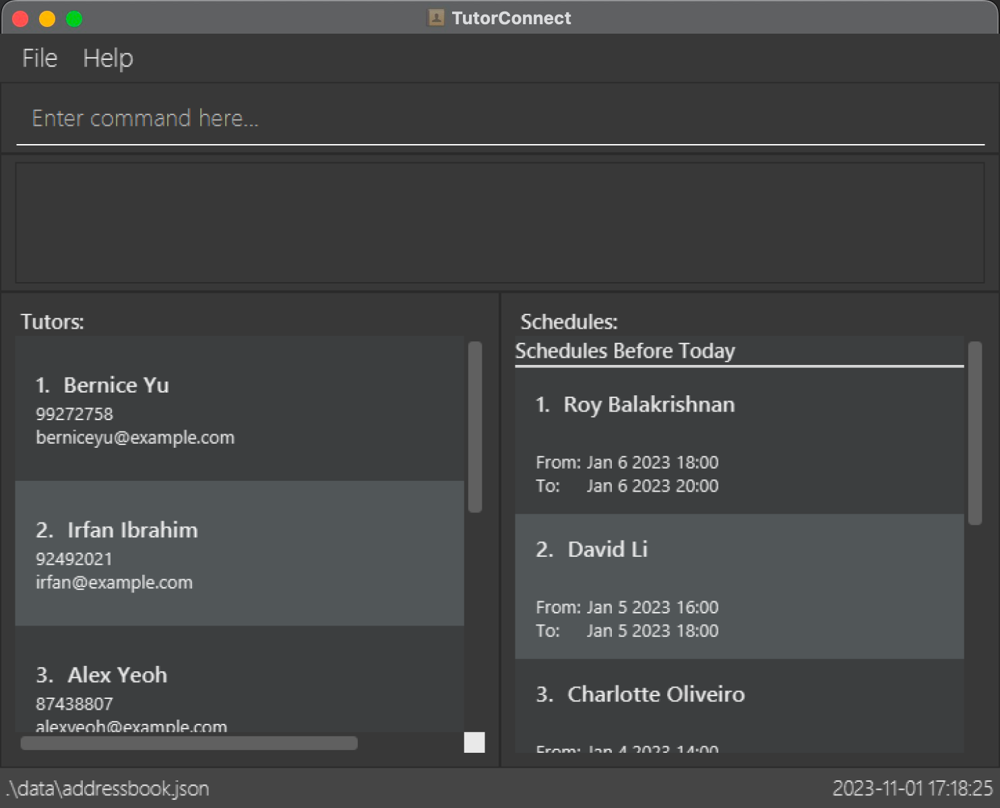
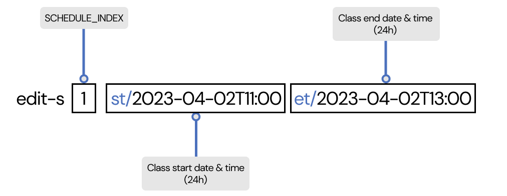
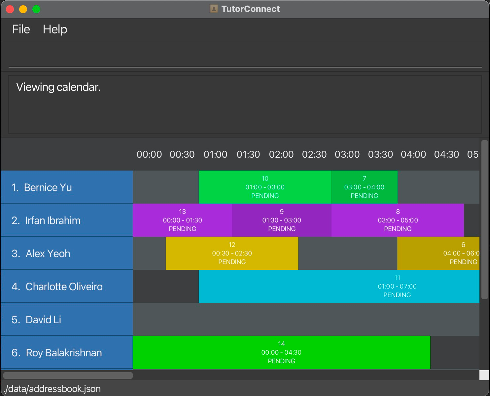

## Welcome to TutorConnect

TutorConnect is an address book made for **tuition centre coordinators** to easily track and schedule tuition classes.

Say goodbye to scheduling conflicts and the complicated process of allocating classes to your tutors!

Here’s an overview of what you can do with TutorConnect:
* Store and edit information about your tutors
* Create and plan your tutor availability and schedule
* View upcoming schedules

Sounds good, right? On top of these functionalities, we believe in bringing you the most efficient scheduling tool. 
TutorConnect is **optimised for users who can type fast** and utilise the [Command Line Interface (CLI)](#glossary) to complete tasks using the keyboard faster than using the mouse.

--------------------------------------------------------------------------------------------------------------------
## Table of Contents
* Table of Contents
{::options toc_levels="1..4"}
{:toc}
--------------------------------------------------------------------------------------------------------------------

## Usage of the User Guide

This User Guide is designed to be used alongside TutorConnect, for you to make the most of the app and get the most
enjoyable experience tracking and scheduling tuition classes.

A warm welcome to TutorConnect! Before we dive into the details, let's get you started with a quick overview of how 
to navigate and use this User Guide successfully.

For **Beginner Users**, we're thrilled to have you onboard! Get started with a [Tutorial](#tutorconnect-tutorial-for-new-users) here.

For **Experienced Users**, thank you for choosing TutorConnect! You may refer to the [Command Summary](#command-summary) here.

### Navigating the User Guide
TutorConnect's User Guide is made with you mind. It is designed to be user-friendly and easy to navigate. Here are a 
few tips for smooth navigation:
* Hyperlinks: Throughout this guide, you'll find [hyperlinks](#usage-of-the-user-guide) that can take you to related sections or external 
  resources. Click on these links to access additional information or jump to different parts of the guide.
* Back to Top Button: At the end of each section, you'll find a [Back To Top](#table-of-contents) button, to return 
  you to the Table of Contents.

### Common Notation
Throughout this User Guide, you will also find some common notations, to provide you with extra information you may 
need. Look out for these coloured boxes!

**:bulb: Tip** 

`Tips` are used to provide helpful advice, suggestions, or best practices to enhance your experience by making a task easier or more efficient.

**:warning: Warning** 

`Warnings` are used to alert you about potential issues, errors, or risks associated with a task or action. They are essential for preventing mistakes and ensuring safety.

**:information_source: Information** 

`Information` sections provide additional background knowledge or context to help you understand a topic better.

[Back To Top](#table-of-contents)

--------------------------------------------------------------------------------------------------------------------

## Quick Start

Welcome to TutorConnect! We are excited to get you started with a more efficient scheduling method.

1. Ensure you have Java `11` installed in your Computer. To verify, perform the following steps:
    1. Open a terminal. Refer to the following guides on how:
        1. [MacOS](https://support.apple.com/en-sg/guide/terminal/apd5265185d-f365-44cb-8b09-71a064a42125/mac#:~:text=Terminal%20for%20me-,Open%20Terminal,%2C%20then%20double%2Dclick%20Terminal)
        2. [Windows](https://www.howtogeek.com/235101/10-ways-to-open-the-command-prompt-in-windows-10/#:~:text=anywhere%20you%20like.-,Open%20Command%20Prompt%20from%20the%20Run%20Box,open%20an%20administrator%20Command%20Prompt)
    2. Type `java -version` and press Enter.
    3. If it says a version other than 11 or `command not found`, please install Java 11 by following this [guide](https://www.java.com/en/download/help/download_options.html).

2. Download the latest jar file (tutorconnect.jar) from our [Github Releases](https://github.com/AY2324S1-CS2103T-T17-3/tp/releases).

3. Move the jar file into a new folder called “TutorConnect”.

4. Double-click the jar file to launch the application.

   

   **:information_source: Mac Users** 

   If you are a Mac user, you may encounter a warning that says
   the jar file cannot be opened because it is from an unidentified developer. To continue:

    1. Right-click on the jar file and select `Open With > JavaLauncher (default)`
    2. Press Open when prompted

   

### Navigating the Interface

TutorConnect comes equipped with a [GUI](#glossary) interface that provides visual feedback to you.
Below is a quick overview of the various components of our interface.

| Component      | Description                                                                                | 
|----------------|--------------------------------------------------------------------------------------------|
| Command Box    | You will enter your [commands](#glossary) along with its [parameters](#glossary) here.     | 
| Result Display | Displays the results of your commands. Any error messages will also be displayed here. | 
| Tutor Details  | Contains information related to the tutor like name, phone number etc.                     |

[Back To Top](#table-of-contents)

--------------------------------------------------------------------------------------------------------------------

## TutorConnect Tutorial (for new users)

Hello and welcome to TutorConnect! We're delighted you've chosen our platform to manage your tuition center's tutors and schedules. 

Before we begin, please ensure that you have viewed the following sections of the guide:
* [Quick Start](#quick-start) to help you get TutorConnect up and running.
* [Navigating the Interface](#navigating-the-interface) to get you familiarised on how to navigate TutorConnect.

This tutorial aims to guide you through the essential features and functionalities of TutorConnect that you will use 
on a day-to-day basis. You will be adding your first tutor and corresponding schedule!

Click on any of these below to jump to the respective sections of the guide!
* [Start](#start)
* [Adding your first tutor](#adding-your-first-tutor)
* [Planning your schedules](#planning-your-schedules)
* [Viewing your scheudles](#viewing-your-tutorsschedules)

### Start

When you first launch TutorConnect, you will be greeted with an empty screen with no tutors. It's time to start adding your tutors to TutorConnect.

### Adding Your First Tutor

To add your first tutor, you can use the [**add-t**](#adding-a-tutor-add-t) command.

Let's say you have a tutor named **John Doe**, he has provided you with his phone number: **9123 4567** and his email address: **johndoe@example.com**.

To add John Doe into TutorConnect:
1. Simply type into the Command Box: `add-t n/John Doe p/91234567 e/johnd@example.com`
2. Hit enter.
3. Voila! John Doe is now in TutorConnect

### Planning Your Schedules

Now that your tutors are in TutorConnect, it's time to start scheduling classes for them!

To assign schedules to your tutor, you can use the [**add-s**](#adding-a-schedule-add-s) command.

Let's assign a schedule for **John Doe** on **1 October 2023** from **9AM to 11AM**.

To assign John Doe that schedule:
1. Get the **TUTOR_INDEX** of the tutor you wish to assign a schedule to
   
2. Simply type into the Command Box: `add-s 1 st/2023-10-01T09:00 et/2023-10-01T11:00`
3. Hit enter.
4. Tada! John Doe now has a schedule on **1 October 2023** from **9AM to 11AM**. 

### Viewing Your Tutors/Schedules

Now that you have schedules in TutorConnect, you can view them using the [**list-s**](#list-all-schedules-list-s) command.

1. Simply type into the Command Box: `list-s`
2. Hit enter.
3. Amazing! You can view all your schedules in TutorConnect.

Similarly, you can use the [**list-t**](#listing-all-tutors-list-t) command to go back to viewing all your tutors instead.

Congratulations! You have successfully added your first tutor and schedule to TutorConnect. We hope that this tutorial has helped guide you through the basic features of TutorConnect. Please refer to the [**Features Section**](#features) to see what else TutorConnect can do. Alternatively visit the [**FAQ**](#faq) to view the frequently asked questions.

[Back To Top](#table-of-contents)

--------------------------------------------------------------------------------------------------------------------

## Features
From pairing classes with tutors to managing your tuition centre schedules, TutorConnect provides you with a 
fuss-free solution for all your scheduling needs. This section shows you how to use TutorConnect to its full 
potential. Let's get started!

### Tutor Related Features

Tutors are the core of your tuition centre management. This section will show you all the features related to 
tracking tutor information within your tuition centre.

#### Adding a tutor: `add-t`

Adds a tutor to TutorConnect.

##### :beginner: First time users
{:.no_toc}

**Scenario**

A new tutor named John Doe has just joined your tuition centre. His phone number is 987654321 and his email address is johnd@example.com.

Let’s add him into TutorConnect.

**Follow these steps**

Type in `add-t n/John Doe p/98765432 e/johnd@example.com` and press enter.

**What you can expect to see**

Amazing! Tutor John Doe has now been added to the bottom of the displayed list.

##### :hammer: Experienced users
{:.no_toc}

**Command format**

**Errors**

Here is a list of the error messages you may encounter, when the command is entered incorrectly:
* `Invalid command format!`: One or more of the tags n/, p/, e/ is missing.
* `Names should only contain alphanumeric characters and spaces, and it should not be blank`: Tutor name input was 
  either invalid or blank.
* `Phone numbers should only contain numbers, and it should be at least 3 digits long`: Tutor phone number input was 
  either invalid or blank.
* `Emails should be of the format local-part@domain and adhere to the following constraints`: Tutor email input was 
  either invalid or blank.

Refer to [input information](#input-examples) for details about valid inputs.

[Back To Top](#table-of-contents)

#### Editing a tutor: `edit-t`

Edits an existing tutor in the addressbook.

**Format**: `edit-t TUTOR_INDEX n/NAME p/PHONE NUMBER e/EMAIL`

**Examples**:
* `edit-t 1 n/John Doe`
* `edit-t 2 n/John Doe e/johndoe@email.com`

**Acceptable values for each parameter**:
* `TUTOR_INDEX`: Only number input accepted, starting from 1 to the last tutor index shown in the list of
  tutors.
* `NAME`: Only contain alphanumeric characters and spaces, and should not be blank
* `PHONE NUMBER`: Only contain numbers, and should be at least 3 digits long
* `EMAIL`: Of the format local-part@domain

**Expected output**:
* `Edited Tutor: John Doe; Phone: 99272758; Email: johndoe@email.com`

**Error messages**:
* `Invalid command format!`: Invalid or missing TUTOR_INDEX.
* `Names should only contain alphanumeric characters and spaces, and it should not be blank`: Tutor name input was
  either invalid or blank.
* `Phone numbers should only contain numbers, and it should be at least 3 digits long`: Tutor phone number input was
  either invalid or blank.
* `Emails should be of the format local-part@domain and adhere to the following constraints:`: Tutor email input was
  either invalid or blank.
* `Multiple values specified for the following single-valued field(s): n/`: More than 1 `n/` was given in the command
* `Multiple values specified for the following single-valued field(s): p/`: More than 1 `p/` was given in the command
* `Multiple values specified for the following single-valued field(s): e/`: More than 1 `e/` was given in the command
* `This tutor already exists in the address book.`: There is a tutor with the same name in the address book.
* `At least one field to edit must be provided.`: There is no `n/`, `p/` or `e/` tag provided to edit a field.

#### Listing all tutors: `list-t`

Displays a list of all tutors in the address book in a table format.

**Format**: `list-t`

**Example**:
* `list-t`

**Expected Output**:
* `Listed all tutors`

    

    **:information_source: Information** 
    
    * list-t command does not take in any parameters.
    * Any extraneous parameters after `list-t` will be ignored.
      e.g. if the command specifies `list-t 123`, it will be interpreted as `list-t`.
    * No error messages as anything typed behind is ignored.
    
    

#### Locating tutors by name: `find-t`

Find tutors whose names contain any of the given keywords.

**Format**: `find-t KEYWORD [MORE_KEYWORDS]`

**Examples**:
* `find-t John` returns `John Smith` and `John Doe`
* `find-t Alex David Li` returns `Alex David Li`

**Acceptable values for each parameter**:
* `KEYWORD`: Any input accepted

    

    **:information_source: Search behaviour** 

    * Search is case-insensitive. e.g. `hans` will match `Hans`
    * The order of the keywords does not matter. e.g. `Hans Bo` will match `Bo Hans`
    * Only the tutor name is searched.
    * Only full words will be matched. e.g. `Han` will not match `Hans`
    * Tutors matching at least one keyword will be returned (i.e. OR search). e.g. `Hans Bo` will return `Hans Gruber`, `Bo Yang`

    

**Expected output**:
* `2 tutors listed!`
* `0 tutors listed!`

**Error messages**:
* `Invalid command format!`: No search keyword provided.

#### Deleting a tutor: `delete-t`

Deletes a tutor in the address book based on their index number in the table.

**Format**: `delete-t TUTOR_INDEX`

**Examples**:
* `delete-t 5` deletes the tutor that is indexed as 5 in the address book.
* `list` followed by `delete-t 2` deletes the 2nd person in the address book.

**Acceptable values for each parameter**:
* `TUTOR_INDEX`: Only accepts numerical value

**Expected output**:
* `Tutor has been deleted: Alex Yeoh; Phone: 87438807;
  Email: alexyeoh@example.com`

**Error messages**:
* `Invalid command format!`: No tutor index provided or parameter given is not a numerical value.
* `Tutor index provided is out of range`: Given tutor index is out of range.

[Back To Top](#table-of-contents)

### Schedule Related Features
As busy tuition centre coordinators, creating conflict-free schedules is no easy feat. Don't worry! TutorConnect has 
you covered with our extensive list of features, all about creating and managing scheduling issues.

#### Adding a schedule: `add-s`

Adds a schedule to a specified tutor.

**Format**: `add-s TUTOR_INDEX st/START_TIME et/END_TIME`

**Examples**:
* `add-s 1 st/2023-09-15T09:00 et/2023-09-15T11:00`
* `add-s 2 st/2023-09-16T17:00 et/2023-09-16T19:00`

**Acceptable values for each parameter**:
* `TUTOR_INDEX`: Only number input accepted, starting from 1 to the last tutor index shown in the list of tutors.
* `START_TIME`: Only datetime in `yyyy-MM-ddTHH:mm` format is accepted
* `END_TIME`: Only datetime in `yyyy-MM-ddTHH:mm` format is accepted

    

  **:information_source: Information** 

    * `yyyy` represents the **year** (e.g., 2023).
    * `MM` represents the **month** with a leading zero (e.g., 09 for September, 10 for October).
    * `dd` represents the **day** of the month with a leading zero (e.g., 03, 15).
    * `T` is a **separator** indicating the start of the time portion.
    * `HH` represents the **hour** in **24-hour format** with a leading zero (e.g., 09 for 9 AM, 21 for 9 PM).
    * `mm` represents the **minutes** with a leading zero (e.g., 05).

    

**Expected output**:
* `New schedule John Doe; Start Time Sep 15 2023 09:00; End Time: Sep 15  2023 11:00 has been added.`

**Error messages**:
* `Invalid command format!`: Invalid TUTOR_INDEX or some of the tags `st/`, `et/` is missing.
* `EndTime should only contain a valid date and time in the format "yyyy-MM-ddTHH:mm", and it should not be blank`: 
  The start time entered is not in the correct datetime format.
* `StartTime should only contain a valid date and time in the format "yyyy-MM-ddTHH:mm", and it should not be blank`: The end time entered is not in the correct datetime format.
* `Multiple values specified for the following single-valued field(s): st/`: More than 1 st/ was given in the command
* `Multiple values specified for the following single-valued field(s): et/`: More than 1 et/ was given in the command
* `This schedule already exists in the address book`: There is a schedule for the same tutor with the same start and end time in the address book.
* `This tutor has a clashing schedule in the address book`: There is a schedule for the same tutor with overlapping times in the address book.

#### Editing a schedule: `edit-s`

Edits an existing schedule in TutorConnect.

##### :beginner: First time users
{:.no_toc}

**Scenario**

One day, tutor Alex Yeoh requested to change a class timing, so that it starts at 1pm instead.

The edit schedule function is here for that!

**Follow these steps**

1. Type in `list-s` to find the schedule to update.
2. Let's say the schedule to be updated is in position 1.
3. Type in `edit-s 1 st/2023-09-15T13:00` and press enter.

**What you can expect to see**

Tada! The schedule has now been updated to 1pm.

##### :hammer: Experienced users
{:.no_toc}

**Command format**

**Errors**

Here is a list of the error messages you may encounter, when the command is entered incorrectly:
* `Invalid command format!`: Invalid or missing SCHEDULE_INDEX.
* `EndTime should only contain a valid date and time in the format "yyyy-MM-ddTHH:mm", and it should not be blank`:
  The end time entered is not in the correct datetime format.
* `StartTime should only contain a valid date and time in the format "yyyy-MM-ddTHH:mm", and it should not be
  blank`: The start time entered is not in the correct datetime format.
* `Multiple values specified for the following single-valued field(s): st/`: More than 1 `st/` was given in the command
* `Multiple values specified for the following single-valued field(s): et/`: More than 1 `et/` was given in the command
* `This schedule already exists in the address book`: There is a schedule for the same tutor with the same start and end time in the address book.
* `This tutor has a clashing schedule in the address book`: There is a schedule for the same tutor with overlapping times in the address book.
* `At least one field to edit must be provided.`: There is no `st/` or `et/` tag provided to edit a field.

You can also refer to [input information](#input-examples) for details about valid inputs.

[Back To Top](#table-of-contents)

#### List all schedules: `list-s`

Displays a list of all schedules in the address book in a table format. List can be filtered by tutors whose names contain any of the given keywords.

**Format:** `list-s` or `list-s KEYWORD [MORE_KEYWORDS]`

**Example:**
* `list-s` shows all recorded schedules in the address book.
* `list-s John` returns schedules by `John Smith` and `John Doe`.
* `list-s Alice Pauline` returns schedules by `Alice Pauline`.

**Expected output:**
* Displays a table of schedules with columns for List number, Tutor Name, Start Time, and End Time

* If name of the tutor is added as an optional keyword search, the list will be filtered accordingly to show the schedules based on the tutor's name.

#### Marking a schedule: `mark`

Adds the status of a schedule in the address book based on their index number in the table of schedules listed.

**Format:** `mark SCHEDULE_INDEX m/SCHEDULE_STATUS`

**:information_source: Schedule status** 

* There are only two types of Schedule status: MISSED or COMPLETED.
* To set the status of the specified schedule to MISSED, input `m/0` as 0 indicates the MISSED status.
* To set the status of the specified schedule to COMPLETED, input `m/1` as 1 indicates the COMPLETED status.

* Any inputs other than 0 or 1 will result in an invalid status message displayed.

**Example:**
* `mark 5 m/0` adds the MISSED status to the schedule indexed at 5 in the schedule list.
* `mark 5 m/1` adds the COMPLETED status to the schedule indexed at 5 in the schedule list.
* `list-s` followed by `mark 1 m/0` adds the MISSED status to the schedule indexed at 1 in the schedule list.
* `list-s` followed by `mark 1 m/1` adds the COMPLETED status to the schedule indexed at 1 in the schedule list.
**Acceptable values for each parameter:**

* `SCHEDULE_STATUS`: Only numerical inputs of 0 to indicate MISSED and 1 to indicate COMPLETED status of the 
* `SCHEDULE_INDEX`: Only numerical input that ranges from 1 to the last schedule shown in the list of schedules.

specified schedule.
**Expected Output:**
* `Marked Schedule as Completed: John Doe; Start Time: Sep 15 2023 09:00; End Time: Sep 15 2023 11:00`

**Error Messages:**
* `Marked Schedule as Missed: Betsy Crowe; Start Time: Sep 16 2023 17:00; End Time: Sep 15 2023 19:00`
* `Invalid command format!`: Invalid or missing SCHEDULE_INDEX OR SCHEDULE_STATUS or both.
* `Index number given is out of range`: The schedule index provided is invalid.
* `Status has to be either MISSED (m/0) or COMPLETED (m/1)`: The schedule status provided is invalid.

#### Unmarking a schedule: `unmark`

Removes the status of a schedule in the address book based on their index number in the table of schedules listed.

**Format:** `unmark SCHEDULE_INDEX`

**Example:**
* `unmark 5` removes the status of the schedule indexed at 5 in the schedule list.
* `list-s` followed by `unmark 2` removes the status of the schedule indexed at 2 in the schedule list.

**Acceptable values for each parameter:**
* `SCHEDULE_INDEX`: Only numerical input that ranges from 1 to the last schedule shown in the list of schedules.

**Expected output:**
* `Unmarked Schedule: Alex Yeoh; Start Time: Sep 15 2023 09:00; End Time: Sep 15 2023 11:00`

**Error messages:**
* `Index number given is out of range`: The schedule index provided is invalid
* `Invalid command format!`: Invalid or missing SCHEDULE_INDEX.

#### Deleting a schedule: `delete-s`

Deletes a schedule in the address book based on their index number in the table of schedules listed.

**Format:** `delete-s SCHEDULE_INDEX`

**Example:**
* `delete-s 5` deletes the schedule that is indexed as 5 in the schedule list.
* `list-s` followed by `delete-s 2` deletes the 2nd schedule in the schedule list.

**Acceptable values for each parameter:**
* `SCHEDULE_INDEX`: Only numerical input that ranges from 1 to the last schedule shown in the list of schedules.

**Expected output:**
* `Schedule has been deleted: Tutor: John Doe; Start date: Sep 15, 2023 09:00; End date: Sep 15, 2023 11:00;`

**Error messages:**
* `Index number given is out of range`: Given index is out of range.
* `Invalid value in parameter SCHEDULE_INDEX`: Parameter given is not a numerical value.
* `Missing parameter SCHEDULE_INDEX`: A numerical value is not provided when calling the command `delete-s`.

#### View calendar: `show`

Display schedules on a specified day as a calendar view.

**Format:** `show DATE`

**Acceptable values**:
* `DATE`: Only dates in `yyyy-MM-dd` format is accepted

**Example:**
* `show 2023-01-06` shows all schedules on 6 Jan 2023.
* `show 2023-09-25` shows all schedules on 25 September 2023.

**Expected output:**
* Viewing calendar.

**Error messages**:
* `Invalid command format!`: Invalid or missing DATE.

**:warning: Calendar Limitations** 
* Currently, the calendar does not support displaying of schedules that extend over multiple days.
* Schedules with very short duration may not be displayed correctly (the schedule's index, status and time will not be visible).
* Adding or modifying schedules will hide the calendar view. Use `show DATE` to view calendar again. 

[Back To Top](#table-of-contents)

### System Feature

Beyond just providing you with powerful features related to tutors and schedule tracking, TutorConnect offers some 
additional system features to take your experience with us to the next level!

#### Changing theme: `theme`

Changes the theme of TutorConnect.

##### :beginner: First time users
{:.no_toc}

**Scenario**

Want a change of scenery? TutorConnect supports 3 colour palettes for you to choose from! No more looking at a
boring interface. Let's say you want to switch to `blue` theme.

**Follow these steps**

Type in `theme blue`.

**What you can expect to see**

Wow! A whole new colour scheme.

##### :hammer: Experienced users
{:.no_toc}

**Command format**

**Errors**

Here is a list of the error messages you may encounter, when the command is entered incorrectly:
* `Invalid command format!`: New theme field was left blank and not specified.
* `Theme provided does not exist`: New theme field was not `dark`, `light` or `blue`r `et/` tag provided to edit a field.

You can also refer to [input information](#input-examples) for details about valid inputs.

[Back To Top](#table-of-contents)

#### Clearing all data: `clear`

Clears all data in TutorConnect.

More details coming soon...

**:warning: Warning** 

This action is irreversible! Do not enter the command unless you are very sure.

#### Help: `help`

More details coming soon...

**:bulb: Tip** 

The help window can also be accessed by the button above the command box!

[Back To Top](#table-of-contents)

--------------------------------------------------------------------------------------------------------------------

## Frequently Asked Questions
Have some burning questions you want answered? Check out this FAQ section to find out if others have had the same 
question!

**Q**: How do I transfer my data to another Computer? 
**A**: Install the app in the other computer and overwrite the empty data file it creates with the file that contains the data of your previous AddressBook home folder.

**Q**: What if I make a mistake when typing a command? 
**A**: Don't worry! If you make a mistake while typing a command, TutorConnect will provide an error message to guide you. Simply correct the command and try again.

**Q**: Can I view schedules in a different time zone? 
**A**: Currently, TutorConnect displays schedules in your local time zone. If you need to coordinate with tutors in different time zones, you may consider using a world clock or time zone converter alongside the application.

**Q**: Is there a way to export my data from TutorConnect? 
**A**: Currently, TutorConnect doesn't have an export feature. However, you can manually copy the `data.json` file from the "TutorConnect" folder for backup or transfer purposes.

**Q**: How do I report a bug or suggest a feature? 
**A**: We value your feedback! Please visit our [Github repository](https://github.com/AY2324S1-CS2103T-T17-3/tp) and open an issue to report a bug or make a feature request.

**Q**: I'm encountering an issue not covered here. What should I do? 
**A**: Feel free to reach out to our support team at [support@tutorconnect.com](mailto:support@tutorconnect.com). We'll do our best to assist you.

[Back To Top](#table-of-contents)

--------------------------------------------------------------------------------------------------------------------

## Known issues

TutorConnect is always looking to improve. Currently, there are a few known issues within the app that our 
development team is working round the clock to solve. Don't worry, every version of TutorConnect released for you to 
use is sure to solve your scheduling needs.

1. **When using multiple screens**, if you move the application to a secondary screen, and later switch to using only the primary screen, the GUI will open off-screen. The remedy is to delete the `preferences.json` file created by the application before running the application again.

[Back To Top](#table-of-contents)

--------------------------------------------------------------------------------------------------------------------

## Glossary

### Definitions
Here are some descriptions of the words you might come across in the User Guide:

| Term                       | Definition                                                                                                                                                                                                                                                 |
|----------------------------|------------------------------------------------------------------------------------------------------------------------------------------------------------------------------------------------------------------------------------------------------------|
| Parameter                  | Parameters are like fields in a form you are required to fill up. They include details you provide to execute a command.   For example, in the command `add-t n/NAME p/PHONE NUMBER e/EMAIL`, `n/NAME`, `p/PHONE NUMBER`, and `e/EMAIL` are parameters. |
| Command                    | A command is an instruction given to the application to perform a specific action. For example, `list-t` is a command to list all tutors in the address book.                                                                                              |
| GUI                        | GUI is a user interface that allows users to interact with the application using graphical elements like text fields, buttons, and menus.                                                                                                                  |
| CLI  | CLI is a text-based user interface that allows users to interact with the application by typing commands.                                                                                                                                                  |

### Input Examples

| Input Fields        | ✅                         | ❌                |
|---------------------|---------------------------|------------------|
| `n/NAME`            | John Doe                  | John@Doe         |
|                     | John Doe123               |                  |
| `p/PHONE NUMBER`    | 98765432                  | abc              |
|                     | 987                       | 98               |
| `e/EMAIL`           | johnd@example.com         | johnd            |
|                     | jo@example123-example.com | johnd@p          |
| `p/PHONE NUMBER`    | 98765432                  | abc              |
|                     | 987                       | 98               |
| `st/START_TIME`/    | 2023-09-15T09:00          | 2023-09-15 09:00 |
| `et/END_TIME`       | 2023-09-15T11:00          | 2023-09-15T09    |
| `m/SCHEDULE_STATUS` | 0                         | 3                |
| `m/SCHEDULE_STATUS` | 1                         | abc              |
| `TUTOR_INDEX`/      | 1                         | 0                |
| `SCHEDULE_INDEX`    |                           | abc              |
| `NEW_THEME`         | dark                      | white            |
|                     | light                     | brown            |
|                     | blue                      | black            |

### Input Information
Here are some inputs you might come across in the User Guide:

| Parameter           | Description                                       | Limitations                                                                                  |
|---------------------|---------------------------------------------------|----------------------------------------------------------------------------------------------|
| `n/NAME`            | Refers to the name of the tutor.                  | Only contain alphanumeric characters and spaces, and  should  not be blank.          |
| `p/PHONE NUMBER`    | Refers to the phone number of the tutor.          | Only contain numbers, and should be at least 3  digits long.                             |
| `e/EMAIL`           | Refers to the email address of the tutor.         | Of the format local-part@domain1.                                                 |
| `st/START_TIME`     | Refers to the start time of the schedule.         | Only datetime in `yyyy-MM-ddTHH:mm`2 format is accepted.                          |
| `et/END_TIME`       | Refers to the end time of the schedule.           | Only datetime in `yyyy-MM-ddTHH:mm` format is accepted.                                      |
| `m/SCHEDULE_STATUS` | Refers to the status of schedule in the list.     | Only numerical inputs of 0 for MISSED status and 1 for COMPLETED status is accepted          |
| `TUTOR_INDEX`       | Refers to the position of tutor in the list.      | Only numerical input that ranges from 1 to the last tutor shown in the list of tutors.       |
| `SCHEDULE_INDEX`    | Refers to the position of schedule in the list.   | Only numerical input that ranges from 1 to the last schedule shown in the list of schedules. |
| `NEW_THEME`         | Refers to the name of the new theme to switch to. | Only `dark`, `light` and `blue` themes are supported.                                        |

**1 Email Format**

1. The local-part should only contain alphanumeric characters and these special characters, excluding the parentheses, (+_.-). The local-part may not start or end with any special characters.
2. This is followed by a '@' and then a domain name. The domain name is made up of domain labels separated by periods.

The domain name must:
* end with a domain label at least 2 characters long
* have each domain label start and end with alphanumeric characters
* have each domain label consist of alphanumeric characters, separated only by hyphens, if any.

**2 `yyyy-MM-ddTHH:mm`**
* `yyyy` represents the **year** (e.g., 2023).
* `MM` represents the **month** with a leading zero (e.g., 09 for September, 10 for October).
* `dd` represents the **day** of the month with a leading zero (e.g., 03, 15).
* `T` is a **separator** indicating the start of the time portion.
* `HH` represents the **hour** in **24-hour format** with a leading zero (e.g., 09 for 9 AM, 21 for 9 PM).
* `mm` represents the **minutes** with a leading zero (e.g., 05).

[Back To Top](#table-of-contents)

--------------------------------------------------------------------------------------------------------------------

## Command summary

| Action              | Format, Examples                                                                                             |
|---------------------|--------------------------------------------------------------------------------------------------------------|
| **Add Tutor**       | `add-t n/NAME p/PHONE NUMBER e/EMAIL`   e.g., `add-t n/John Doe p/98765432 e/johnd@example.com`           |
| **Edit Tutor**      | `edit-t TUTOR_INDEX n/NAME p/PHONE_NUMBER e/EMAIL`  e.g.,`edit-t 2 n/James Lee e/jameslee@example.com`    |
| **List Tutor**      | `list-t`                                                                                                     |
| **Delete Tutor**    | `delete-t TUTOR_INDEX`  e.g., `delete-t 3`                                                                |
| **Find Tutor**      | `find-t KEYWORD [MORE_KEYWORDS]`  e.g., `find-t James Jake`                                               |
| **Add Schedule**    | `add-s TUTOR_INDEX st/START_TIME et/END_TIME`   e.g., `add-s ti/1 st/2023-09-15T09:00 e/2023-09-15T11:00` |
| **Edit Schedule**   | `edit-s SCHEDULE_INDEX [st/START_TIME] [etEND_TIME]`   e.g., `edit-s 1 st/2023-09-15T13:00`               |
| **List Schedule**   | `list-s`, `list-s KEYWORD [MORE_KEYWORDS]`   e.g., `list-s Alice Pauline`                                 |
| **Mark Schedule**   | `mark SCHEDULE_INDEX m/SCHEDULE_STATUS`  e.g., `mark 3 m/0`                                               |
| **Unmark Schedule** | `unmark SCHEDULE_INDEX`  e.g., `unmark 3`                                                                 |
| **Delete Schedule** | `delete-s SCHEDULE_INDEX`  e.g., `delete-s 3`                                                             |
| **Change Theme**    | `theme NEW_THEME`   e.g., `theme dark`                                                                    |
| **Clear**           | `clear`                                                                                                      |

[Back To Top](#table-of-contents)
