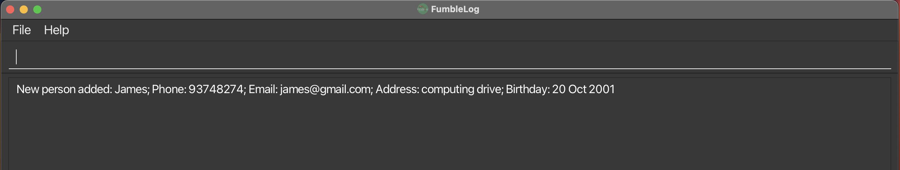
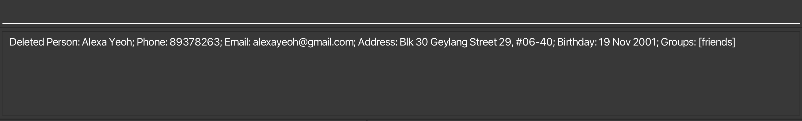
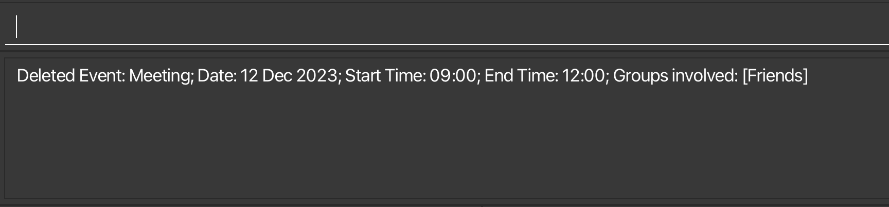
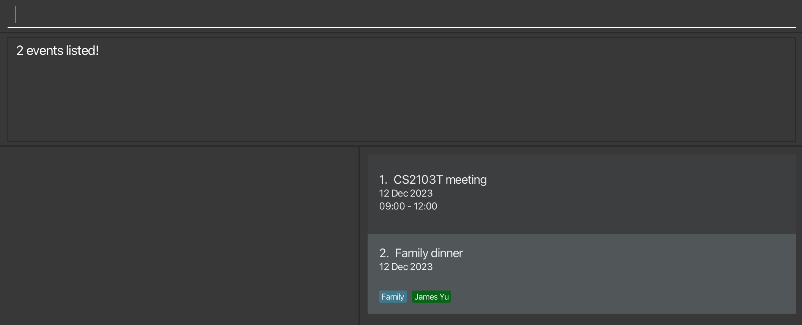
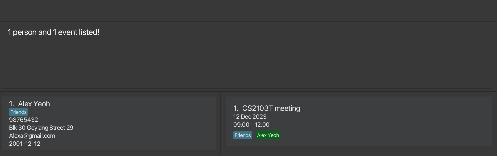

FumbleLog is a **productivity desktop application** built to for **NUS Computing students** to help you manage contacts and track events. 
It is designed to be an easy-to-use, one-stop platform for all your scheduling needs.

In this user guide, you will learn the basics of our application and how you can use it to manage your tasks and interpersonal relationships.

# Table of Contents
* Table of Contents
{:toc}

--------------------------------------------------------------------------------------------------------------------
# Who is this guide for?
Our guide is made for FumbleLog users of all experiences! Refer to the table below to find out which section of the guide is most relevant to you.

|  **If you are...**  |                                                                                     **You should...**                                                                                      |
|:-------------------:|:------------------------------------------------------------------------------------------------------------------------------------------------------------------------------------------:|
|  New to FumbleLog   |            Read the [Quick Start](#quick-start) section to get started. After setting up, you can go through a step-by-step [Tutorial](#fumblelog-tutorial) of our application.            |
| An experienced user | Skip to the [Commands Summary](#command-summary) section for a quick overview of all the commands, or have a look at our [Features](#features) for a detailed look at each of our features |

# Quick start

**1. Ensure you have the right environment.**
- Before you begin, make sure you have `Java 11` or above installed in your computer. 
  - To check if you have java installed or your installed java version:
    - Open a command terminal (Command Prompt or Terminal, depending on your operating system) and use the command: `java --version`. 
    - You should see the java version if you have java installed.
  - If you do not have java installed, you can download it from [here](https://www.oracle.com/sg/java/technologies/javase/jdk11-archive-downloads.html).

**2. Download our FumbleLog Application.**
- Visit the official FumbleLog release page [here](https://github.com/AY2324S1-CS2103T-T12-2/tp/releases).
- Download the latest version of `fumblelog.jar` from the release page.

**3. Set up your home folder.**
- Choose a folder on your computer where you want to store you FumbleLog application, or create a new folder.
- Copy the `fumblelog.jar` file into the folder you have chosen or created.

**4. Launch the application.**
- In your command terminal, use the `cd` command to navigate to the folder where you have placed the `fumblelog.jar` file.
- Run the application using the command: `java -jar fumblelog.jar`. You should now be able to see the FumbleLog user interface!
   - The application contains sample data for you to play around with.
   - Some blocks may appear red, indicating expired events, so do not be alarmed.

**5. Try out some simple commands!**
- Type commands into the command box and press `Enter` to execute it. e.g. typing **`help`** and pressing `Enter` will open the help window. 
   Some example commands you can try:

   * `list_persons` : Lists all persons stored in FumbleLog.
   * `add_person n/John Doe` : Adds a person named `John Doe` to the FumbleLog persons list.
   * `delete_person 3` : Deletes the 3rd person shown in the current persons list.
   * `exit` : Exits FumbleLog application.

**6. Learn more about FumbleLog**
- Refer to [Orientation to the Graphical User Interface](#orientation-to-the-graphical-user-interface-gui) below for an orientation on FumbleLog.
- Refer to [FumbleLog Tutorial](#fumblelog-tutorial) for a more extensive guide on how to use FumbleLog.
- If you think you're ready to learn more advanced commands, refer to [Features](#features) below for more details on FumbleLog's commands.

[Scroll back to Table of Contents](#table-of-contents)

--------------------------------------------------------------------------------------------------------------------
# Orientation to the Graphical User-Interface (GUI)

Refer to the table below for details on each GUI component

| **GUI Component** | **Description**                                                                                                                                          |
|:------------------|:---------------------------------------------------------------------------------------------------------------------------------------------------------|
| Menu Bar          | Contains the `File` dropdown menu which allows you to exit the application and the `Help` dropdown menu which allows you to access the user guide        |
| Command box       | Type your commands here and press `Enter` to execute them.                                                                                               |
| Response box      | The response to your commands will be shown here. If your command is invalid, the correct command format will be shown instead.                          |
| Contact list      | Displays the list of persons in FumbleLog. You can scroll through the list of persons using the scroll bar on the right of the list.                     |
| Event list        | Displays the list of events in FumbleLog. You can scroll through the list of events using the scroll bar on the right of the list.                       |
| Index             | Displays the index of the person or event in their respective lists. This index is used in certain commands. i.e. editing persons or events.             |

<i class="fa fa-warning-circle"></i> **Note about red coloured events:** 
An expired event will appear red in the event list. This is to highlight to you that the event has passed.

This is illustrated as follows:

[Scroll back to Table of Contents](#table-of-contents)

--------------------------------------------------------------------------------------------------------------------

# FumbleLog Tutorial
This tutorial is designed for new users looking to get started using FumbleLog. In this tutorial, you will find step-by-step instructions on how to use commands in FumbleLog to help you manage
your contacts and events.

1. First launch FumbleLog. You may refer to the [Quick Start](#quick-start) guide if you have forgotten how to.
2. Lets first try **adding a person**, `Mary Lee`, to your contact list. Enter the command: `add_person n/Mary Lee p/91234567 e/mary@gmail.com a/Mary Street #01-01 b/2001-12-12 g/Family`. You should see FumbleLog successfully adding the contact to the contact list:

3. Now, lets try **editing the name and email** of your contact. Let's use the index of `Mary Lee` shown in the list (in this case 1), and edit her information: `edit_person 1 n/John Doe e/John@gmail.com`. FumbleLog should reflect the changes to your contact immediately:

4. Try adding a few more contacts and assign them to the same `Family` group using the `g/` parameter. Your contact list should look something like this:

5. Now, lets say `John`'s birthday is in a few weeks. We can **add this event** to FumbleLog using this command: `add_event m/John birthday d/2023-12-12`.

6. If everyone in the `Family` group is attending `John`'s birthday, you can easily assign every contact in the group to the event. In this case, simply **edit the event** by assigning the `Family` group, as such: `edit_event 1 g/Family`. Now you should see everyone in the `Family` group is assigned to `John`'s birthday.

7. Finally, once the event is over, you can **delete the event** by using the index of the event (in this case 1): `delete_event 1`.
8. **Well done! 👍** You have mastered the basics of FumbleLog! You can now visit the [Features](#features) section to learn advanced commands!

[Scroll back to Table of Contents](#table-of-contents)

--------------------------------------------------------------------------------------------------------------------

# Features

**:information_source: Notes about the command format:** 

* Words in `UPPER_CASE` are parameters to be supplied with the command. 
  e.g. in `add_person n/NAME`, `NAME` is a parameter which can be used as `add_person n/John Doe`.

* Items in square brackets are optional. 
  e.g `n/NAME [g/GROUP]` can be used as `n/John Doe g/family` or as `n/John Doe`.

* Items with `…`​ after them can be used multiple times (or not at all). 
  e.g. `n/NAME [g/GROUP]…​` can be used as `n/John Doe` (i.e. 0 times), `n/John Doe g/friend`, `n/John Doe g/friend g/family` etc.

* Parameters can be in any order. 
  e.g. if the command specifies `n/NAME p/PHONE_NUMBER`, `p/PHONE_NUMBER n/NAME` is also acceptable.

* Invalid prefixes, such as `t/` will be regarded as a part of the input, for example `n/John Doe t/friend`, the name 
  will be parsed as `John Doe t/friend` instead of `John Doe`.

* Extraneous parameters for commands that do not take in parameters (such as `help`, `list_all`, `exit` and `clear`) will be ignored. 
  e.g. if the command specifies `help 123`, it will be interpreted as `help`.

* If any of the commands provided are invalid/do not follow the necessary format, an error message will be displayed.

* If you are using a PDF version of this document, be careful when copying and pasting commands that span multiple lines as space characters surrounding line-breaks may be omitted when copied over to the application.

### Viewing help : `help`

Shows a pop-up window with a link to the user guide for help.

- No response in the response box should be expected after clicking the help button.

Format: `help`

[Scroll back to Table of Contents](#table-of-contents)

## Commands for Persons

### Adding a person: `add_person`

FumbleLog allows you to add personalised contacts to your contact list. 

Format: `add_person n/NAME [p/PHONE_NUMBER] [e/EMAIL] [a/ADDRESS] [b/BIRTHDAY] [r/REMARK] [g/GROUP]…​`

**Acceptable values for each parameter:**

| Parameter      | Format                                                                                                | Example                          |
|----------------|-------------------------------------------------------------------------------------------------------|----------------------------------|
| `NAME`         | Use `a-z`, `A-Z`, `0-9` and whitespaces only. A person's name cannot contain **only** numbers.        | `John Doe`                       |
| `PHONE_NUMBER` | Use `0-9` only and should be at least 3 digits long and maximum of 17 digits **without** whitespaces. | `p/98765432`                     |
| `EMAIL`        | Be in format `local-part@domain`. Refer to the [FAQ](#faq) section for more details.                  | `johndoe@gmail.com`              |
| `ADDRESS`      | Use any characters including whitespaces.                                                             | `John Street, block 123, #01-01` |
| `BIRTHDAY`     | Should be in format `yyyy-MM-dd` and should not be later than current date.                           | `2001-12-30 `                    |
| `REMARK`       | Use any characters including whitespaces.                                                             | `Owes me $2.`                    |
| `GROUP`        | Use `a-z`, `A-Z`, `0-9` only and **must not** contain any whitespaces.                                | `CS2103T`                        |

**Below are some examples on how to use the `add_person` command:**

- `add_person n/Jonathan`: Adds a person with name `Jonathan`.
- `add_person n/Betsy Crowe e/betsycrowe@example.com a/Computing Drive p/12345678`: Adds a person with name `Betsy Crowe`, with email `betsycrowe@example.com`, with address `Computing Drive` and phone `12345678`.
- `add_person n/John Doe p/98765432 b/2023-09-30 g/friend g/partner`: Adds a person with name `John Doe`, with phone `98765432`, with birthday `2023-09-30` and with groups `friend` and `partner`.

**:information_source: Notes on the `add_person` command:**

* You must include the person's name when adding a contact, but the other fields are optional.
* A person can be assigned to 0 or more groups.
* Persons with the exact same name as another person cannot be added.
* When a person with an assigned group and that group has been assigned to an [event](#commands-for-events), that person will be displayed with the respective event.

**Expected output when the command succeeds:**
* Input: `add_person n/James p/93748274 e/james@gmail.com a/computing drive b/2001-10-20`

[Scroll back to Table of Contents](#table-of-contents)

### Editing a person : `edit_person`

FumbleLog allows you to edit your contact list so that it is always up to date.

Format: `edit_person PERSON_INDEX [n/NAME] [p/PHONE] [e/EMAIL] [a/ADDRESS] [b/BIRTHDAY] [r/REMARK] [g/GROUP]…​ [ug/GROUP]…​`

**Acceptable values for each parameter:**

| Parameter     | Format                                                                                                           | Example                          |
|---------------|------------------------------------------------------------------------------------------------------------------|----------------------------------|
| `PERSON_INDEX`| An index in the current displayed contacts list in FumbleLog                                                     | `1`                              |
| `NAME`        | Use `a-z`, `A-Z`, `0-9` and whitespaces only. A person's name cannot be empty and must contain **only** numbers. | `John Doe`                       |
| `PHONE_NUMBER`| Use `0-9` only and should be at least 3 digits long and maximum of 17 digits **without** whitespaces.                                   | `p/98765432`                     |
| `EMAIL`       | Be in format `local-part@domain`. Refer to the [FAQ](#faq) section for more details.                             | `johndoe@gmail.com`              |
| `ADDRESS`     | Use any characters including whitespaces.                                                                        | `John Street, block 123, #01-01` |
| `BIRTHDAY`    | Have format `yyyy-MM-dd` and should not be later than current date.                                              | `2001-12-30 `                    |
| `REMARK`      | Use any characters including whitespaces.                                                                        | `Owes me $2.`                    |
| `GROUP`       | Use `a-z`, `A-Z`, `0-9` only and must not contain any whitespaces.                                               | `CS2103T`                        |

**Below are some examples on how to use the `edit_person` command:**

*  `edit_person 1 p/91234567 e/johndoe@example.com`: Edits the phone number and email address of the 1st person to be `91234567` and `johndoe@example.com` respectively.
*  `edit_person 2 n/Betsy Crower g/CS2103T`: Edits the name of the 2nd person to be `Betsy Crower` and assigns this person to the group `CS2103T`. Any events that Betsy Crower is assigned to is also updated with this new name.
*  `edit_person 3 n/Betsy Crower b/2023-09-29`: Edits the name of the 3rd person to be `Betsy Crower` and changes the birthday to 29th Sep 2023. Any events that Betsy Crower is assigned to is also updated with this new name.

**:information_source: Notes on the `edit_person`command:** 
* At least one of the parameters must be provided.
* Existing values will be updated to the input values for all values except for `GROUP`
  * Parameters `p/`, `e/`, `a/` and `b/` can be empty strings. Doing so will clear the current values for the respective fields. i.e. `edit_person 1 a/` will remove the current `ADDRESS`.
  * Parameter `g/` is used to **assign a person** to a group. If the person is already assigned to the group, the group will not be added again.
  * Parameter `ug/` is used to **unassign a person** from a group. Once unassigned, the person's name will not be displayed in events that the group is assigned to.
* When you edit a person's name, the person's name will be updated in all [events](#commands-for-events) that the person is assigned to. Same for groups if the person's group is assigned to events.
* There will not be an error shown in the case that you edit a person's values to be the same as it currently is. i.e. if the first person's name on the person list is Alex, `edit_person 1 n/Alex` is a valid command and will not show an error message.

**:exclamation: Disclaimer: Editing a person with a filtered contacts list might cause the person to disappear. Do not worry, your data is not deleted.** 

- Lets say you used the command `find_person Alex`, to show all the persons with `Alex` in their name.  See: [find_person](#locating-persons-by-name-or-group-findperson)
- The person list is filtered to show all the persons with `Alex` in their name.
- You then edit the person `Alex`'s name to `Bob`.
- `Alex` will disappear from the person list, because your previous search term `Alex` no longer matches the new name of the person, `Bob`.
- To see `Bob` in the person list again, you can use the [`list_persons`](#listing-all-persons--listpersons) command to bring back the whole list of persons.
- In contrast with the above scenario, using an [`add_person`](#adding-a-person-addperson) command will automatically bring back the whole list of persons, to show you that your new person has been added to FumbleLog.

**Expected output when the command succeeds:**
* Input: `edit_person 1 n/Alexa Yeoh` changes the name of the 1st person to be `Alexa Yeoh`, leaving the rest of the fields unchanged.

[Scroll back to Table of Contents](#table-of-contents)

### Deleting a person : `delete_person`

FumbleLog allows you to organize your contact list by deleting contacts that are no longer relevant.

Format: `delete_person PERSON_INDEX`

**Acceptable values for each parameter:**

| Parameter      | Format                                             | Example |
|----------------|----------------------------------------------------|---------|
| `PERSON_INDEX` | An index in the currently displayed contacts list. | `1`     |

**Below are some examples on how to use `delete_person` command:**

* `list_all` followed by `delete_person 2`: Deletes the 2nd person in the person list.
* `find_all Betsy` followed by `delete_person 1`: Deletes the 1st person in the filtered list as a result of the `find` command. i.e Any person named `Betsy` at index `1` will be deleted.

**:information_source: Notes on `delete_person` command:** 
* The index refers to the index number shown in the displayed person list.
* When a person is deleted, any [events](#commands-for-events) that the person is assigned to will also be updated, i.e. the person will be unassigned from the event.

**Expected output when the command succeeds:**

Input: `delete_person 1` deletes the first person on the list.

[Scroll back to Table of Contents](#table-of-contents)

### Locating persons by name or group: `find_person`

If you would like to quickly search for a contact, FumbleLog allows you to search for contacts by name or group.

Format: `find_person KEYWORD [MORE_KEYWORDS]`

**Acceptable values for each parameter:**

| Parameter                    | Format                                                                     | Example              |
|------------------------------|----------------------------------------------------------------------------|----------------------|
| `KEYWORD`  or `MORE_KEYWORDS` | Use any characters including whitespace. Must not only contain whitespaces | `Alice` or `friends` |

**Below are some examples on how to use `find_person` command:**

* `find_person John`: Displays `john` and `John Doe`
* `find_person friends`: Displays `Alex Yeoh` as he belongs to the `friends` group.

**:information_source: Notes on `find_person` command:** 
* Only **full words** will be matched e.g. `Han` will not match `Hans`
* The search is **case-insensitive**. e.g `hans` will match `Hans`
* The order of the keywords does not matter. e.g. `Hans Bo` will match `Bo Hans`
* Persons matching at least one keyword will be returned.
  e.g. `find_person Hans Bo` will return `Hans Gruber` and `Bo Yang`.

**:exclamation: Disclaimer when using the `find_person` command:** 

* FumbleLog will return an **empty person list** when there are no keyword matches. **Your data will not be deleted.**

**Expected output when the command succeeds:**

Input: `find_person Alexa` displays all contacts with the name `Alexa` in the contact list.

[Scroll back to Table of Contents](#table-of-contents)

### Listing all persons : `list_persons`

FumbleLog restores any filtered contacts list using `list_persons`.

Format: `list_persons`

**Below are some examples on how to use `list_persons` command:** 
* `list_persons`: Lists all your entire contacts list in FumbleLog.

**:information_source: Notes on `list_persons` command:** 
* Any text after `list_persons` command will be ignored and the command will be executed as normal.

[Scroll back to Table of Contents](#table-of-contents)

## Commands for Events

### Adding an event : `add_event`

Apart from allowing you to add contacts, FumbleLog allows you to keep track of your daily commitments by
allowing you to add events. You can also choose to assign existing contacts or groups to each event.

Format: `add_event m/EVENT_NAME d/DATE [s/START_TIME] [e/END_TIME] [n/PERSON_NAME]... [g/GROUP]...`

**Acceptable values for each parameter:**

| Parameter                   | Format                                                                                    | Example           |
|-----------------------------|-------------------------------------------------------------------------------------------|-------------------|
| `EVENT_NAME`                | Use `a-z`, `A-Z`, `0-9` and whitespaces only.                                             | `CS2103T meeting` |
| `DATE`                      | Have format `yyyy-MM-dd` and should not be earlier than current date.                     | `2023-12-01`      |
| `START_TIME` and `END_TIME` | Have format `HHmm`. `START_TIME` should be earlier than `END_TIME`.                       | `1400`            |
| `PERSON_NAME`               | Multiple persons can be assigned to an event but only existing persons name can be added. | `John Doe`        |
| `GROUP`                     | Multiple groups can be assigned to an event but only existing groups can be added.        | `CS2103T`         |

**Below are some examples on how to use `add_event` command:**

* `add_event m/FumbleLog presentation d/2023-10-30`: Adds an event with name `FumbleLog presentation` and with date `2023-10-30`.
* `add_event m/FumbleLog meeting d/2023-10-30 g/Team2`: Adds an event with name `FumbleLog meeting`, with date `2023-10-30`, and assigns contact in group `Team2` to the event.
* `add_event m/CS2101 OP2 d/2023-10-05 s/1500 e/1700 n/Ken g/CS2103T g/CS2101`: Adds an event with name `CS2101 OP2`, with date `2023-10-05`, with start time `1500`, with end time `1700`, assigns contact with name `Ken` and groups `CS2103T`, `CS2101` to the event.

**:information_source: Notes on `add_event` command:** 
- `START_TIME` and `END_TIME` are optional.
- `PERSON_NAME` and `GROUP` is optional. 
-  Multiple persons and groups can be added at once, however only existing groups and persons can be added.
- The provided values for `DATE`, `START_TIME` and `END_TIME` must represent future date and time; past values are not allowed.
- The given `START_TIME` must be before the given `END_TIME`.
- If the meeting is added successfully, it will automatically be sorted by date and time with the earliest meeting at the top of the list.
- If the given `START_TIME` and `END_TIME` are not given, the default values are `0000` and `2359` respectively.
- Note that if a person appears under multiple groups, e.g `Alvin` is in groups `classmates` and `friends`, the name `Alvin` will appear under both groups when displayed in the events list. This is an intended behavior for you to see everyone in the groups that are assigned to the event. 
This is illustrated as follows:
  

**This should be the expected output when the command succeeds:**
Input: `add_event m/FumbleLog meeting d/2023-10-05 s/1500 e/1700 n/Ken g/CS2103T g/CS2101`

[Scroll back to Table of Contents](#table-of-contents)

### Editing an event : `edit_event`

If the details of an event has changed or if you have made a mistake when adding an event, FumbleLog allows you to easily edit your event details with the latest updated information. You can use this command
to assign more contacts or groups to the event using the `n/` or `g/` parameter respectively, or unassign contacts or groups using `u/` or `ug/` respectively.

Format: `edit_event EVENT_INDEX [m/EVENT_NAME] [d/DATE] [s/START_TIME] [e/END_TIME] [n/PERSON_NAME]... [u/PERSON_NAME]... [g/GROUP]... [ug/GROUP]...`

**Acceptable values for each parameter:**

| Parameter                   | Format                                                                                    | Example           |
|-----------------------------|-------------------------------------------------------------------------------------------|-------------------|
| `EVENT_INDEX`               | An index in the currently displayed events list.                                          | `1`               |
| `EVENT_NAME`                | Use `a-z`, `A-Z`, `0-9` and whitespaces only.                                             | `CS2103T meeting` |
| `DATE`                      | Have format `yyyy-MM-dd` and should not be earlier than current date.                     | `2023-12-01`      |
| `START_TIME` and `END_TIME` | Have format `HHmm`. `START_TIME` should be earlier than `END_TIME`.                       | `1400`            |
| `PERSON_NAME`               | Multiple persons can be assigned to an event but only existing persons name can be added. | `John Doe`        |
| `GROUP`                     | Multiple groups can be assigned to an event but only existing groups can be added.        | `CS2103T`         |

**Below are some examples on how to use `edit_event` command:**

* `edit_event 1 m/FumbleLog meeting`: Edits the name of event at index 1 to `FumbleLog meeting`.
* `edit_event 1 s/1500 e/1700`: Edits the start and end time to `1500` and `1700` respectively. If the event initially does not have a start and end time, the respective times will be added to the event.
* `edit_event 1 g/CS2103T ug/CS2101`: Assigns group `CS2103T` to the event and unassigns group `CS2101`.
* `edit_event 1 u/Ken`: Unassigns the person `Ken` from the event.

**:information_source: Notes on `edit_event` command:** 
* At least one of the optional parameters required.
* Existing values will be updated to the input values, except for `PERSON` AND `GROUP`.
* Only parameters `s/` and `e/` can be empty strings. Doing so will remove the current values. i.e. `edit_event 1 s/` will remove the current `START_TIME`.
* `PERSON` and `GROUP` edits are cumulative and will add to the current list of persons and groups.
* The given `DATE`, `START_TIME` and `END_TIME` cannot be a time in the past.
* Note that if a person appears under multiple groups, e.g `Alvin` is in groups `classmates` and `friends`, the name `Alvin` will appear under both groups when displayed in the events list. This is an intended behavior for you to see everyone in the groups that are assigned to the event. 
This is illustrated as follows:

**:exclamation: Disclaimer: Editing a person with a filtered contacts list might cause the person to disappear. Do not worry, your data is not deleted.** 

- Let say you have an event named `TP meeting` stored in FumbleLog and you used `find_event meeting`. See: [find_event](#locating-events-by-name-group-or-person-findevent)
- The event list will be filtered to show all the persons with `meeting` in their name.
- You then edit `TP meeting` event's name to `TP sprint`.
- `TP meeting` disappears from the person list, because your previous search term `meeting` no longer matches the new event name, `TP sprint`.
- To see `TP sprint` in the event list again, you can use the [list_events](#listing-all-events-listevents) command to bring back the whole list of events.
- In contrast with the above scenario, using an [add_event](#adding-an-event--addevent) command will automatically bring back the whole list of events, to show you that your new event has been added to FumbleLog.

**This should be the expected output when the command succeeds:**
Input: `edit_event 1 m/tP week 3 meeting d/2023-10-05 s/1500 e/1700`

[Scroll back to Table of Contents](#table-of-contents)

### Deleting an event : `delete_event`

FumbleLog helps you to organise your event list better by allowing you to delete events that are in the past or no longer relevant.

Format: `delete_event EVENT_INDEX`

**Acceptable values for each parameter:**

| Parameter     | Format                                           | Example                          |
|---------------|--------------------------------------------------|----------------------------------|
| `EVENT_INDEX` | An index in the currently displayed events list. | `1`                              |

**Below are some examples on how to use `delete_event` command:**
* `delete_event 1`: Deletes the 1st event in the event list.
* `find_all meeting` followed by `delete_event 1`: Deletes the 1st event in the results of the `find` command.

**:information_source: Notes on `delete_event` command:** 
- The index refers to the index number shown in the displayed person list.

**This should be the expected output when the command succeeds:**
* Input: `delete_event 1`

[Scroll back to Table of Contents](#table-of-contents)

### Locating events by name, group or person: `find_event`

FumbleLog also allows you to quickly search for events whose name or groups contain any of the given keywords.

Format: `find_event KEYWORD [MORE_KEYWORDS]`

**Acceptable values for each parameter:**

| Parameter                    | Format                                                                     | Example             |
|------------------------------|----------------------------------------------------------------------------|---------------------|
| `KEYWORD`  or `MORE_KEYWORDS` | Use any characters including whitespace. Must not only contain whitespaces | `Alice` or `Friends` |

**Below are some examples on how to use `find_event` command:**
* `find_event meeting`: Returns `meeting` and `CS2103T meeting`
* `find_event friends` returns `meeting` if it contains the `friends` group.

**:information_source: Notes on `find_event` command:** 

* `find_event` searches the name of the `Event`, `Group` and `Person` that they are assigned
  to and will display them accordingly.
* Only full words will be matched e.g. `meeting` will not match `meetings`
* FumbleLog will display an empty event list when there are no keyword matches.
* The keywords are **not** case-sensitive. e.g `meeting` will match `Meeting`
* Events matching at least one keyword will be returned (i.e. `OR` search).
  e.g. `Meetings TP` will return `Meetings`, `TP deadline`

**This should be the expected output when the command succeeds:** 
Input: `find_event meeting family`

[Scroll back to Table of Contents](#table-of-contents)

### Listing all events: `list_events`

After using FumbleLog `find_event` or `find_all` command which filters the event list, you can use `list_events` to display the full event list again.

Format: `list_events`

**Below is an example on how to use `list_persons` command:**
* `list_persons`: Lists all your saved contacts in FumbleLog.

**:information_source: Notes on `list_events` command:** 
- Events are sorted by date and time, with the earliest event at the top of the list.
- Any text after the `list_events` command will be ignored and the command will be executed as normal.

[Scroll back to Table of Contents](#table-of-contents)

## General commands

### Show all upcoming events and birthdays : `remind`

If you would like to have a quick overview of your upcoming commitments, you can use the `remind` command and FumbleLog will display all upcoming 
events and birthdays.

Format: `remind [NUM_OF_DAYS]` 

**Acceptable values for each parameter:**

| Parameter     | Format                                               | Example                          |
|---------------|------------------------------------------------------|----------------------------------|
| `NUM_OF_DAYS` | A positive integer with maximum value of 999999999.  | `1`                              |

**Below are some examples on how to use `remind` command:**
* `remind`: Shows all events and birthdays happening in the next 7 days.
* `remind 3`: Shows all events and birthdays happening in the next 3 days.

**:information_source: Notes on `remind` command:** 
* `NUM_OF_DAYS` is optional. It specifies the number of days you would like to look ahead for events and birthdays.
* If `NUM_OF_DAYS` is not specified, the default value is 7 days.

**Expected output when the command succeeds:** 
Input: `remind`

[Scroll back to Table of Contents](#table-of-contents)

### Finding persons and events: `find_all`

If you would like to search for your contacts and events at the same time, you can use the `find_all` command to find all
persons and events whose names or groups contain any of the given keywords.

Format: `find_all KEYWORD [MORE_KEYWORDS]`

**Acceptable values for each parameter:**

| Parameter                    | Format                                                                     | Example             |
|------------------------------|----------------------------------------------------------------------------|---------------------|
| `KEYWORD`  or `MORE_KEYWORDS` | Use any characters including whitespace. Must not only contain whitespaces | `Alice` or `Friends` |

**Below are some examples on how to use `find_event` command:**
* `find_all John`: Returns `john` and `John Doe` in the persons list and `John's birthday` in the events list.
* `find_all friends`: Returns `Alex Yeoh` as he belongs to the `friends` group in the persons list,
  and `CS2103T meeting` as it contains the `friends` group in the events list.

**:information_source: Notes on `find_all` command:** 
* Only full words will be matched e.g. `Han` will not match `Hans`
* FumbleLog will return an empty person/event list when there are no keyword matches.
* The search is **not** case-sensitive. e.g `hans` will match `Hans`
* The order of the keywords does not matter. e.g. `Hans Bo` will match `Bo Hans`
* Persons and events matching at least one keyword will be returned (i.e. `OR` search).
  e.g. `Hans Bo` will return `Hans Gruber`, `Bo Yang`

**Expected output when the command succeeds:** 
Input: `find_all friends`

[Scroll back to Table of Contents](#table-of-contents)

### Listing all persons and events: `list_all`

If you would like to list all your contacts and events, you can use the `list_all` command to display the full list of contacts and events.

Format: `list_all`

**Below is an example on how to use `list_all` command:**
* `list_all`: Lists all your contacts and events in FumbleLog.

**:information_source: Notes on `list_all` command:** 
- Events are sorted by date and time, with the earliest event at the top of the list.
- Any text after the `list_all` command will be ignored and the command will be executed as normal.

[Scroll back to Table of Contents](#table-of-contents)

### Clearing all entries : `clear`

Clears all contacts and events from the FumbleLog.

Format: `clear`

**Below is an example on how to use `clear` command:**
* `clear`: Clears all your contacts and events data in FumbleLog.

**:information_source: Notes on `clear` command:** 
- Events are sorted by date and time, with the earliest event at the top of the list.
- Any text after the `clear` command will be ignored and the command will be executed as normal.

:exclamation: **Warning: This command is irreversible and data cannot be recovered once cleared! Be very sure you would like to erase all of your data before executing this command!**. 

### Exiting the program : `exit`

Exits the program.

Format: `exit`

[Scroll back to Table of Contents](#table-of-contents)

--------------------------------------------------------------------------------------------------------------------

# How we manage your data

### Saving the data

FumbleLog data are saved in the hard disk automatically after any command that changes the data. There is no need to save manually.

### Editing the data file

FumbleLog data are saved automatically as a JSON file `[JAR file location]/data/addressbook.json`. Advanced users are welcome to update data directly by editing that data file.

:exclamation: **Caution:**
If your changes to the data file makes its format invalid, FumbleLog will discard all data and start with an empty data file at the next run. Hence, it is recommended to take a backup of the file before editing it.

### Archiving data files `[coming in v2.0]`

_Details coming soon ..._

[Scroll back to Table of Contents](#table-of-contents)

--------------------------------------------------------------------------------------------------------------------

# FAQ

**Q**: How do I transfer my data to another Computer? 
**A**: 
  Step 1: Install the app in the other computer
  Step 2: Go to your previous computer and obtain your old data file. You can find it at `[JAR file location]/data/addressbook.json`. 
  Step 3: Copy the file from step 2 and move it to the data folder in your new computer, by replacing the new empty data file.
  Your data is now all restored!
**Q**: What are the constraints for email addresses? 
**A**: Emails should be of the format `local-part@domain` and adhere to the following constraints:
  1. The local-part should only contain alphanumeric characters and these special characters (like '+' and '_'). 
The local-part may not start or end with any special characters.
  2. This is followed by a '@' and then a domain name. The domain name is made up of domain labels separated by periods. 
The domain name must:
     + end with a domain label at least 2 characters long
     + have each domain label start and end with alphanumeric characters
     + have each domain label consist of alphanumeric characters, separated only by hyphens, if any.

[Scroll back to Table of Contents](#table-of-contents)

--------------------------------------------------------------------------------------------------------------------

# Known issues

1. **When using multiple screens**, if you move the application to a secondary screen, and later switch to using only the primary screen, the GUI will open off-screen. The remedy is to delete the `preferences.json` file created by the application before running the application again.

[Scroll back to Table of Contents](#table-of-contents)

--------------------------------------------------------------------------------------------------------------------

# Command summary

### Commands for Persons

| Action            | Format, Examples                                                                                                                                                                                                    |
|-------------------|---------------------------------------------------------------------------------------------------------------------------------------------------------------------------------------------------------------------|
| **Add Person**    | `add_person n/NAME [p/PHONE_NUMBER] [e/EMAIL] [a/ADDRESS] [b/BIRTHDAY] [r/REMARK] [g/GROUP]…​`   e.g., `add_person n/James Ho p/22224444 e/jamesho@example.com a/123, Clementi Rd, 1234665 g/friend g/colleague` |
| **Edit Person**   | `edit_person PERSON_INDEX [n/NAME] [p/PHONE_NUMBER] [e/EMAIL] [a/ADDRESS] [r/REMARK] [g/GROUP]…​`  e.g.,`edit_person 2 n/James Lee e/jameslee@example.com`                                                       |
| **Delete Person** | `delete_person PERSON_INDEX`  e.g., `delete_person 3`                                                                                                                                                            |
| **Find Person**   | `find_person KEYWORD [MORE_KEYWORDS]`  e.g., `find_person James Jake`                                                                                                                                            |
| **List Persons**  | `list_persons`                                                                                                                                                                                                      |

### Commands for Events

| Action           | Format, Examples                                                                                                                                                                                                                           |
|------------------|--------------------------------------------------------------------------------------------------------------------------------------------------------------------------------------------------------------------------------------------|
| **Add Event**    | `add_event m/EVENT_NAME d/DATE [s/START_TIME] [e/END_TIME] [n/PERSON_NAME]…​ [g/GROUP]…​`  e.g., `add_event m/FumbleLog meeting d/2023-10-05 s/1500 e/1700 n/Ken g/CS2103T g/CS2101`                                                    |
| **Edit Event**   | `edit_event EVENT_INDEX [m/EVENT_NAME] [d/DATE] [s/START_TIME] [e/END_TIME] [n/PERSON_NAME]…​ [u/PERSON_NAME]…​ [g/GROUP]…​ [ug/GROUP]…​`  e.g., `edit_event 1 m/tP week 3 meeting d/2023-10-05 s/1500 e/1700 n/Ken g/CS2103T g/CS2101` |
| **Delete Event** | `delete_event EVENT_INDEX`  e.g., `delete_event 1`                                                                                                                                                                                      |
| **Find Event**   | `find_event KEYWORD [MORE_KEYWORDS]`  e.g., `find_event meeting`                                                                                                                                                                        |
| **List Events**  | `list_events`                                                                                                                                                                                                                              |

### General commands

| Action       | Format, Examples                                             |
|--------------|--------------------------------------------------------------|
| **Remind**   | `remind [NUM_OF_DAYS]`   e.g.,`remind` or `remind 4`      |
| **List All** | `list_all`                                                   |
| **Find All** | `find_all KEYWORD [MORE_KEYWORDS]`  e.g., `find_all John` |
| **Clear**    | `clear`                                                      |
| **Exit**     | `exit`                                                       |
| **Help**     | `help`                                                       |

[Scroll back to Table of Contents](#table-of-contents)
