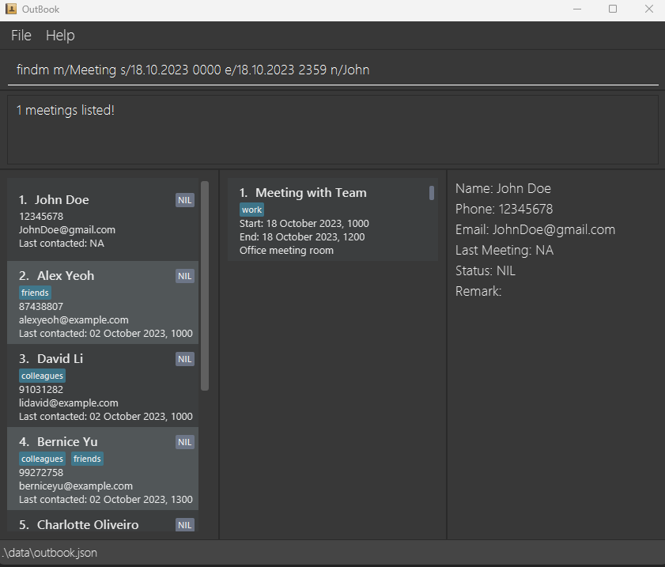

# OutBook

## About OutBook
OutBook is a desktop app that allows freelance insurance agents to manage their numerous contacts and meeting schedule. It is optimised for Command Line Interface (CLI) and aims to significantly reduce the time needed for organizational tasks.

This guide aims to help you explore its features and learn how to use them.

## Key Features
To help you simplify and streamline the process of organizing your contacts and meeting schedule, our application provides these easy-to-use and efficient features:
1. **Client Information Management**: Easily store, access and modify client details such as contact number, email and last contacted time. Add status, custom tags and remarks to organize your clients according to your preference.
2. **Meeting Schedule and Information Management**: Keep track of where and when your meetings are, and who you are meeting, to ensure you never miss an important appointment.

Managing clients and a busy schedule have never been easier. With OutBook, all you need is a keyboard and a few seconds to type in short commands!

# Table of Contents

- [Quick Start](#quick-start)
- [Navigating OutBook](#navigating-outbook)
- [Features](#features)
  - [Contact Commands](#contact-commands)
    - [Adding a contact: `addc`](#adding-a-contact--addc)
    - [Listing all persons: `listc`](#listing-all-persons--listc)
    - [Deleting a person: `deletec`](#deleting-a-person--deletec)
    - [Editing a contact: `editc`](#editing-a-contact--editc)
    - [Viewing detailed contact information: `viewc`](#viewing-detailed-contact-information--viewc)
    - [Finding persons using contact fields: `findc`](#search-for-persons-using-contact-fields--findc)
  - [Meeting Commands](#meeting-commands)
    - [Adding a meeting: `addm`](#adding-a-meeting--addm)
    - [Listing all meetings: `listm`](#listing-all-meetings--listm)
    - [Deleting a meeting: `deletem`](#deleting-a-meeting--deletem)
    - [Editing a meeting: `editm`](#editing-a-meeting--editm)
    - [Viewing detailed meeting information: `viewm`](#viewing-detailed-meeting-information--viewm)
    - [Finding meetings using meeting fields: `findm`](#search-for-meetings-using-meeting-fields--findm)
    - [Adding contact to meeting: `addmc`](#add-contact-to-meeting--addmc)
    - [Removing contact from meeting: `rmmc`](#remove-contact-from-meeting--rmmc)
    - [Marking a meeting as complete : `mark`](#marking-a-meeting-as-complete--mark)
  - [Miscellaneous Commands](#miscellaneous-commands)
    - [Clearing all entries: `clear`](#clearing-all-entries--clear)
    - [Exiting the program: `exit`](#exiting-the-program--exit)
  - [Saving the data](#saving-the-data)
    - [Editing the data file](#editing-the-data-file)
- [Command Summary](#command-summary)
- [FAQ](#faq)
- [Known issues](#known-issues)

---

# Quick start

1. Ensure you have Java `11` or above installed in your Computer.

2. Download the latest `OutBook.jar` from [here](https://github.com/AY2324S1-CS2103T-F12-4/tp/releases).

3. Copy the file to the folder you want to use as the _home folder_ for OutBook.

4. Open a command terminal, `cd` into the folder you put the jar file in, and use the `java -jar OutBook.jar` command to run the application. 
   A GUI similar to the below should appear in a few seconds. Note how the app contains some sample data. 
   
      
5. Type a command in the command box and press Enter to execute it. e.g. typing **`help`** and pressing Enter will open the help window. 
   Some example commands you can try:

   - `listc` : Lists all contacts.

   - `addc n/John Doe p/98765432 e/johnd@example.com lc/10.10.2023 1000` : Adds a contact named `John Doe` to OutBook.

   - `deletec 3` : Deletes the 3rd contact shown in the contact list.

   - `deletem 1` : Deletes the 1st meeting shown in the meeting list.

   - `clear` : Deletes all contacts and meetings.

   - `exit` : Exits the app.

6. Refer to the [Features](#features) below for details of each command. 

Return to the [Table of Contents](#table-of-contents)

---

# Navigating OutBook

| Name          | Function                                                                                                                                                                                                                                              |
|---------------|-------------------------------------------------------------------------------------------------------------------------------------------------------------------------------------------------------------------------------------------------------|
| Command Box   | Enter your commands here                                                                                                                                                                                                                              |
| Status Box    | Displays the results after a command is executed                                                                                                                                                                                                      |
| Contacts List | Displays contact details                                                                                                                                                                                                                              |
| Meetings List | Displays meetings that are scheduled                                                                                                                                                                                                                  |
| Details List  | Displays all the fields of a contact and/or meeting in full detail, completed with labels. Use [viewc](#viewing-detailed-contact-information--viewc)/[viewm](#viewing-detailed-meeting-information--viewm) to specify the contact/meeting to display. |

Return to the [Table of Contents](#table-of-contents)

---

# Features

**:information_source: Notes about the command format:** 

- Words in `UPPER_CASE` are the parameters to be supplied by you. 
  e.g. in `addc n/NAME`, `NAME` is a parameter which can be used as `addc n/John Doe`.

- Items in square brackets are optional. 
  e.g `n/NAME [t/TAG]` can be used as `n/John Doe t/friend` or as `n/John Doe`.

- Items with `…`​ after them can be used multiple times including zero times. 
  e.g. `[t/TAG]…​` can be used as ` ` (i.e. 0 times), `t/friend`, `t/friend t/family` etc.

- You can place parameters in any order. 
  e.g. if the command specifies `n/NAME p/PHONE_NUMBER`, `p/PHONE_NUMBER n/NAME` is also acceptable.

- Any extraneous parameters you place for commands that do not take in parameters (such as `help`, `listc`, `exit` and `clear`) will be ignored. 
  e.g. if you type `help 123`, it will be interpreted as `help`.

- If you are using a PDF version of this document, be careful when copying and pasting commands that span multiple lines as space characters surrounding line-breaks may be omitted when copied over to the application.

### Viewing help : `help`

Shows you a message explaining how to access the help page.

Format: `help`

## Contact Commands

### Adding a contact: `addc`

Adds a contact to OutBook.

Format: `addc n/NAME p/PHONE_NUMBER e/EMAIL lc/LAST_CONTACTED_TIME [s/STATUS] [r/REMARK] [t/TAG]…​`

- `NAME`, `PHONE_NUMBER`, `EMAIL` and `LAST_CONTACTED_TIME` are compulsory fields. `STATUS`, `REMARK` and `TAG` are optional.
- `PHONE_NUMBER` must contain only numbers, and be at least 3 digits long.
- `EMAIL` must be of the format local-part@domain and adhere to the following constraints:
  1. The local-part should only contain alphanumeric characters and the following special characters `+ _ . -`.
  2. The local-part may not start or end with any special characters.
  3. The domain name is made up of domain labels separated by periods.
     The domain name must:
     - end with a domain label at least 2 characters long
     - have each domain label start and end with alphanumeric characters
     - have each domain label consist of alphanumeric characters, separated only by hyphen

- `LAST_CONTACTED_TIME` must contain both date and time and adhere to the `DD.MM.YYYY HHMM` format.
  -  eg. 1st October 2023, 10:00am will be written as `01.10.2023 1000`.
- STATUS, if included, must be one of `NIL, Prospective, Active, Inactive, Claimant, Renewal` or blank.
- This command may change the contact that is currently displayed via the `viewc` command, as detailed in the description for `viewc`.

:bulb: **Tip:**
You can put any number of tags (including 0) on a contact.

- `addc n/John Doe p/98765432 e/johnd@example.com lc/01.10.2023 1000`
- `addc n/Betsy Crowe t/friend e/betsycrowe@example.com p/1234567 lc/01.01.2023 0100 t/Professor`

  

### Listing all persons : `listc`

Shows an unfiltered list of all contacts in OutBook. Contacts are sorted by `LAST_CONTACTED_TIME` by default.

Format: `listc`

* This command may change the contact that is currently displayed via the `viewc` command, as detailed in the description for `viewc`.

### Deleting a person : `deletec`

Deletes a contact from OutBook.

Format: `deletec INDEX`

- Deletes the contact at the specified `INDEX`.
- The index refers to the index number shown in the displayed person list.
- The index **must be a positive integer** 1, 2, 3, …​
- This command clears the contact that is currently displayed via the `viewc` command.

Examples:
- `listc` followed by `delete 2` deletes the 2nd person in the results of the `listc` command.
- `findc Betsy` followed by `delete 1` deletes the 1st person in the results of the `findc` command.

### Editing a contact : `editc`

Edits an existing contact in OutBook.

Format: `editc INDEX [n/NAME] [p/PHONE_NUMBER] [e/EMAIL] [lc/LAST_CONTACTED_TIME] [s/STATUS] [r/REMARK] [t/TAG]…​`

- Edits the contact at the specified `INDEX`. The index refers to the index number shown in the displayed person list. The index **must be a positive integer** 1, 2, 3, …​
- All fields are optional, but at least one must be provided.
- Existing values will be updated to the input values.
- When editing tags, the existing tags of the person will be removed i.e adding of tags is not cumulative.
- You can remove all the person’s tags by typing `t/` without specifying any tags after it.
- This command may change the contact that is currently displayed via the `viewc` command, as detailed in the description for `viewc`.

Examples:
- `editc 1 p/91234567 e/johndoe@example.com` Edits the phone number and email address of the 1st person to be `91234567` and `johndoe@example.com` respectively.
- `editc 2 n/Betsy Crower t/` Edits the name of the 2nd person to be `Betsy Crower` and clears all existing tags.

### Viewing detailed contact information : `viewc`

Views detailed information of a contact in OutBook.

Format: `viewc INDEX`

- Views detailed information of the contact at the specified `INDEX`.
- The index refers to the index number shown in the displayed person list.
- The index **must be a positive integer** 1, 2, 3, …​
- Displays contact Name, Phone, Email, Last Contacted Time, Status, Remarks and Tags.
- As this command displays by `Index`, the displayed contact may change when the specified `INDEX` refers to a different person due to a change in list order through `addc`, `editc` and `listc`. This is intentional.
- The displayed contact is cleared when the `deletec` and `findc` commands are used.

Examples:
- `viewc 2` Displays detailed information related to the 2nd contact on the list.

### Finding persons using contact fields: `findc`
Find persons whose contact details match the keywords specified for at least 1 of these fields: `NAME`, `PHONE_NUMBER`, `EMAIL`, `STATUS`, `TAG`.

Format: `findc [n/KEYWORDS] [p/KEYWORDS] [e/KEYWORDS] [lc/DATETIME] [s/KEYWORDS] [t/KEYWORDS]`

* The search is case-insensitive. e.g `shop` will match `SHOP`.
* The order of the keywords does not matter. e.g. `Shop Meet` will match `Meet Shop`.
* For `NAME`, `STATUS` and `TAG`, only full words will be matched e.g. `Meet` will not match `Meeting`.
* For `EMAIL`, any characters (alphanumeric, special characters) will be matched e.g. `_` will match `m_e@gmail.com`.
* For `PHONE_NUMBER`, the entire length of the input digits will be matched e.g. `913` will match `90091300` but not `90103000`.
* For `LAST_CONTACTED_TIME`, the input must adhere to the `DD.MM.YYYY HHMM` format.
  - e.g. 9th October 2023, 10.30am will be written as `09.10.2023 1030`.
* If only one field is provided, all Persons matching at least one keyword will be returned (i.e. `OR` search).
  - e.g. `John Doe` will return `John Lee`, `James Doe`.
* If multiple fields are provided, only Persons matching at least one keyword in each field will be returned (i.e. `AND` search).
  - e.g. `n/John Doe s/active` will return `Name: John Lee, Status: Active` but not `Name: James Doe, Status: Claimant`.
* This command clears the contact that is currently displayed via the `viewc` command.

Examples:
- `findc n/alice` returns `Alice` and `alice tan`
- `findc p/51` returns `95163890` and `40351`
- `findc e/_@GMAIL` returns `alice_@gmail.com`
- `findc p/9 s/inactive claimant t/friend` returns persons with a `9` in their phone number, whose status is either `inactive` or `claimant`, and has a `friend` tag
  

## Meeting Commands

### Adding a meeting: `addm`

Adds a meeting to OutBook.
Meetings are sorted by start time given.
Meetings are allowed to overlap and multiple meetings can be occuring at the same time.

Format: `addm m/TITLE a/LOCATION s/START e/END [t/TAG]…​`

* `TITLE`, `LOCATION`, `START` and `END` are compulsory fields. `TAG` is optional.
* `START` and `END` must contain both date and time and adhere to the `DD.MM.YYYY HHMM` format.
  -  eg. 1st October 2023, 10:00am will be written as `01.10.2023 1000`.
* This command may change the Meeting that is currently displayed via the `viewm` command, as detailed in the description for `viewm`.

Examples:
- `addm m/Lunch a/Cafeteria s/20.09.2023 1200 e/20.09.2023 1300`
- `addm m/CS2103T meeting a/Zoom call url s/20.09.2023 1000 e/20.09.2023 1200`

### Listing all meetings : `listm`

Shows an unfiltered list of all meetings in OutBook. Meetings are sorted by `START` by default.

Format: `listm`

* This command may change the Meeting that is currently displayed via the `viewm` command, as detailed in the description for `viewm`.

### Deleting a meeting : `deletem`

Deletes a meeting from OutBook.

Format: `deletem INDEX`

- Deletes the meeting at the specified `INDEX`.
- The index refers to the index number shown in the displayed meeting list.
- The index **must be a positive integer** 1, 2, 3, …​
- This command clears the Meeting that is currently displayed via the `viewm` command.

Examples:
- `listm` followed by `deletem 2` deletes the 2nd meeting in the results of the `listm` command.
- `findm m/Project` followed by `deletem 1` deletes the 1st meeting in the results of the `findm` command.

### Editing a meeting : `editm`

Edits an existing meeting in OutBook.

Format: `editm INDEX [m/TITLE] [a/LOCATION] [s/START] [e/END] [t/TAG]…​`

- Edits the meeting at the specified `INDEX`. The index refers to the index number shown in the displayed meeting list. The index **must be a positive integer** 1, 2, 3, …​
- At least one of the optional fields must be provided.
- Existing values will be updated to the input values.
- When editing tags, the existing tags of the meeting will be removed i.e adding of tags is not cumulative.
- You can remove all the meeting’s tags by typing `t/` without specifying any tags after it.
- This command may change the Meeting that is currently displayed via the `viewm` command, as detailed in the description for `viewm`.

Examples:
- `editm 1 a/Hawker Centre s/15.09.2023 1500` Edits the location and start of the 1st meeting to be `Hawker Centre` and `15.09.2023 1500` respectively.
- `editm 2 m/Zoom meeting t/` Edits the title of the 2nd meeting to be `Zoom meeting` and clears all existing tags.

### Viewing detailed meeting information : `viewm`

Views detailed information of a meeting in OutBook.

Format: `viewm INDEX`

- Views detailed information of the meeting at the specified `INDEX`.
- The index refers to the index number shown in the displayed meeting list.
- The index **must be a positive integer** 1, 2, 3, …​
- Displays meeting Title, Location, Start/End, Attendees and Tags.
- As this command displays by `Index`, the displayed meeting may change when the specified `INDEX` refers to a different meeting due to a change in list order through `addm`, `editm` and `listm`. This is intentional.
- The displayed meeting is cleared when the `deletem` and `findm` commands are used.

Examples:
- `viewm 2` Displays detailed information related to the 2nd meeting on the list, including current attendees.

### Finding meetings using meeting fields: `findm`

Find meetings with details matching the keywords you specified for at least 1 of these fields: `TITLE`, `LOCATION`, `ATTENDEE_NAME`, `TAG`; and falls within the `START` and `END` time you give.

Format: `findm [m/KEYWORDS] [a/KEYWORDS] [t/KEYWORDS] [n/ATTENDEE_NAME] [s/START e/END]`

- The search is case-insensitive. e.g `shop` will match `SHOP`.
- The order of the keywords does not matter. e.g. `Shop Meet` will match `Meet Shop`.
- `TITLE`, `LOCATION`, `TAG` and `ATTENDEE_NAME` are searched, within the time frame given by `START` and `END`.
- Only full words will be matched e.g. `Meet` will not match `Meeting`.
- If only one field is provided, all Meetings matching at least one keyword will be returned (i.e. `OR` search).
  e.g. `m/Shop Meet` will return `Meeting: Shop at mall`, `Meeting: Meet client`.
- If multiple fields are provided, only Meetings matching at least one keyword in each field will be returned (i.e. `AND` search).
    e.g. `m/Shop Meet a/Mall` will return `Meeting: Shop at mall, Location: Mall` but not `Meeting: Meet client, Location: Park`.
- This command clears the Meeting that is currently displayed via the `viewm` command.

Examples:
- `findm m/project` returns `project` and `Project work`.
- `findm m/zoom meeting` returns `Zoom session`, `Zoom meeting`, `Meeting advisor`.
- `findm s/09.09.2023 0000 e/09.10.2023 0000` returns all meetings between 09.09.2023 0000 and 09.10.2023 0000.
- `findm m/Meeting s/18.10.2023 0000 e/18.10.2023 2359 n/John` returns `Meeting with friends`, as it starts after 18.10.2023 0000 and ends before 18.10.2023 2359, and is attended by John.

### Add contact to meeting: `addmc`

Adds a contact to a meeting as an attendee.

Format: `addmc MEETING_INDEX CONTACT_INDEX`

- Adds the contact you specified with `CONTACT_INDEX` to a meeting specified with `MEETING_INDEX`.
- `MEETING_INDEX` refers to the index number shown in the displayed meeting list.
- `CONTACT_INDEX` refers to the index number shown in the displayed contact list.
- The indexes **must be positive integers** 1, 2, 3, …​
- Both `MEETING_INDEX` & `CONTACT_INDEX` must refer to the index of an existing meeting and contact respectively.
- Contact name will be listed in the detailed description of meetings when `viewm` is used.

Examples:
- `addmc 3 1` adds the 1st contact as an attendee to the 3rd meeting in OutBook.

### Remove contact from meeting: `rmmc`

Removes a contact from a meeting.

Format: `rmmc MEETING_INDEX ATTENDEE_INDEX`

- Removes a contact at the specified `ATTENDEE_INDEX` to the meeting at the specified `MEETING_INDEX`.
- `MEETING_INDEX` refers to the index number shown in the displayed meeting list.
- `ATTENDEE_INDEX` refers to the index number of the attendee as shown in `viewm`.
- The indexes **must be positive integers** 1, 2, 3, …​
- Both `MEETING_INDEX` & `ATTENDEE_INDEX` must refer to the index of an existing meeting or attendee.

Examples:
- `rmmc 3 2` removes the 2nd attendee from the 3rd meeting in OutBook.

### Marking a meeting as complete : `mark`

Marks a meeting in OutBook as complete. All attendees of the meeting will have their LC (last contacted) field updated to the end time of the meeting.

Format: `mark INDEX`

- Marks the meeting at the specified `INDEX` as complete.
- The index refers to the index number shown in the displayed meeting list.
- The index **must be a positive integer** 1, 2, 3, …​

Examples:
- `listm` followed by `mark 2` marks the 2nd meeting in the results of the `listm` command.

## Miscellaneous Commands

### Clearing all entries : `clear`

Clears all entries from the displayed list in OutBook.

Format: `clear`

### Exiting the program : `exit`

Exits the program.

Format: `exit`

## Saving the data

OutBook data are saved in the hard disk automatically after any command that changes the data. There is no need to save manually.

### Editing the data file

OutBook data are saved automatically as a JSON file `[JAR file location]/data/outbook.json`. If you are an experienced user, you are welcome to update data directly by editing that data file.

:exclamation: **Caution:**
If your changes to the data file makes its format invalid, OutBook will discard all data and start with an empty data file at the next run. Hence, it is recommended to take a backup of the file before editing it.

Return to the [Table of Contents](#table-of-contents)

---

## Command summary

| Action                          | Format, Examples                                                                                                                                                                         |
|---------------------------------|------------------------------------------------------------------------------------------------------------------------------------------------------------------------------------------|
| **Add contact**                 | `addc n/NAME p/PHONE_NUMBER e/EMAIL [lc/LAST_CONTACTED_TIME] [r/REMARK] [t/TAG]…​`   e.g., `addc n/James Ho p/22224444 e/jamesho@example.com lc/09.09.2023 0000 t/friend t/colleague` |
| **Add contact to meeting**      | `addmc MEETING_INDEX CONTACT_INDEX`   e.g., `addmc 2 1`                                                                                                                               |
| **Add meeting**                 | `addm m/TITLE a/LOCATION s/START e/END [t/TAG]…​`   e.g., `addm m/Lunch a/Cafeteria s/20.09.2023 1200 e/20.09.2023 1300`                                                              |
| **Clear**                       | `clear`                                                                                                                                                                                  |
| **Delete contact**              | `deletec INDEX`   e.g., `deletec 3`                                                                                                                                                   |
| **Delete meeting**              | `deletem INDEX`   e.g., `deletem 3`                                                                                                                                                   |
| **Edit contact**                | `editc INDEX [n/NAME] [p/PHONE_NUMBER] [e/EMAIL] [lc/LAST_CONTACTED_TIME] [r/REMARK] [t/TAG]…​`  e.g.,`editc 2 n/James Lee e/jameslee@example.com`                                    |
| **Edit meeting**                | `editm INDEX [m/TITLE] [a/LOCATION] [s/START] [e/END] [t/TAG]…​`  e.g.,`editm 1 a/Hawker Centre s/15.09.2023 1500`                                                                    |
| **Find contact**                | `findc [n/KEYWORDS] [p/KEYWORDS] [e/KEYWORDS] [lc/LAST_CONTACTED_TIME] [s/KEYWORDS] [t/KEYWORDS]`   e.g., `findc n/James Jake s/active claimant`                                      |
| **Find meeting**                | `findm [m/KEYWORDS] [a/KEYWORDS] [t/KEYWORDS] [n/ATTENDEE_NAME] [s/START e/END]`   e.g., `findm m/Zoom Meet s/09.09.2023 0000 e/09.10.2023 0000`                                      |
| **Help**                        | `help`                                                                                                                                                                                   |
| **List contacts**               | `listc`                                                                                                                                                                                  |
| **List meetings**               | `listm`                                                                                                                                                                                  |
| **Remove contact from meeting** | `rmmc MEETING_INDEX ATTENDEE_INDEX`   e.g., `rmmc 2 2`                                                                                                                                |
| **View contact details**        | `viewc INDEX`   e.g., `viewc 4`                                                                                                                                                       |
| **View meeting details**        | `viewm INDEX`   e.g., `viewm 4`                                                                                                                                                       |
| **Exit**                        | `exit`                                                                                                                                                                                   |

Return to the [Table of Contents](#table-of-contents)

---

## FAQ

**Q**: How do I transfer my data to another Computer? 
**A**: Follow these steps:
1. Install the app in the other computer. An empty data file will be created in the same folder that the app is in. 
2. Overwrite this empty data file with the file that contains the data of your previous OutBook home folder.
3. Your transferred data should now be visible upon launching OutBook.

Return to the [Table of Contents](#table-of-contents)

---

## Known issues

1. **When using multiple screens**, if you move the application to a secondary screen, and later switch to using only the primary screen, the GUI will open off-screen. The remedy is to delete the `preferences.json` file created by the application before running the application again.

Return to the [Table of Contents](#table-of-contents)

---
