# Welcome to JobFindr!

_Find Your Success with JobFindr_

## Table of Contents

1. [Introduction](#introduction)
    * [First Time at JobFindr](#first-time-at-jobfindr)
    * [Experience at JobFindr](#experienced-at-jobfindr)
2. [Quick Start](#quick-start)
3. [Quick Tutorial](#quick-tutorial)
4. [Key Information](#key-information)
    * [User Interface](#user-interface)
    * [Structure of a job application](#structure-of-a-job-application)
    * [Valid Statuses](#valid-statuses)
    * [Valid Job Types](#valid-job-types)
    * [Structure of an Interview](#structure-of-an-interview)
    * [Valid Interview Types](#valid-interview-types)
    * [Command Format](#command-format)
5. [Features](#features)
    * [Command Summary](#command-summary)
    * [System Features](#general-features)
        * [Asking for Help: `help`](#asking-for-help-help)
        * [Exiting the Programme: `exit`](#exiting-the-programme-exit)
    * [Job Application Features](#job-application-features)
        * [Listing all Applications: `list`](#listing-all-applications--list)
        * [Adding an Application: `add`](#adding-an-application--add)
        * [Deleting an Application: `delete`](#deleting-an-application--delete)
        * [Editing an Application: `edit`](#editing-an-application--edit)
        * [Clearing All Applications: `clear`](#clearing-all-applications-clear)
        * [Finding an Application: `find`](#finding-an-application--find)
        * [Sorting the Applications: `sort`](#sorting-all-applications--sort)
    * [Interview Features](#interview-features)
        * [Adding an Interview: `interview add`](#adding-an-interview-interview-add)
        * [Deleting an Interview: `interview delete`](#deleting-an-interview-interview-delete)
        * [Editing an Interview: `interview edit`](#editing-an-interview-interview-edit)
6. [FAQ](#faq)
7. [Glossary](#glossary)

--------------------------------------------------------------------------------------------------------------------

## **Introduction**

JobFindr is a **Desktop-based Job Application Management App** for NUS Fresh Graduates to record, track and organise
their job applications.

JobFindr aims to simplify your job application management by targeting the following benefits:

1. _Flexibility_ in **adding**, **deleting** and **editing** job applications and interviews
2. _Efficiency_ in **finding** the specific application with minimal keywords
3. _Organisation_ in **sorting** the list of applications to not miss out on key opportunities

JobFindr combines the rapid efficiency of Command Line Interface (CLI) with the visual clarity of
[Graphical User Interface (GUI)](#user-interface), offering job application management that is suited for your specific
needs and preferences.

### First Time at JobFindr?

_Welcome onboard JobFindr! Let us be part of your job search journey!_

1. To get started with JobFindr, refer to the [Quick Start](#quick-start) below.
2. After setting up JobFindr on your computer, you can get started with a [Quick Tutorial](#quick-tutorial) to get
   familiar with the
   features.
3. You may also explore JobFindr at your own pace, you can refer to the [Feature](#features) section for all the
   available features on JobFindr.

### Experienced at JobFindr

_Good to see you back here! How we can help you?_

1. Facing problem with specific command?
    * You may refer to the detailed instruction for each command in the [Features](#features) section or access the
      hyperlink from our [Table of Contents](#table-of-contents).
2. Forgot the commands available on JobFindr?
    * Please kindly refer to the [Command Summary](#command-summary) for a quick reminder of what you can do on
      JobFindr.
3. Any other issues faced when using JobFindr?
    * You may refer to the [FAQ](#faq) Section for solutions to common issues faced by our users.

[&uarr; Back to Table of Contents](#table-of-contents)

--------------------------------------------------------------------------------------------------------------------

## **Quick Start**

1. Ensure you have Java `11` or above installed in your Computer.
    1. To check if you have installed the correct Java version
       over [here](#1-how-do-i-make-sure-i-have-installed-the-correct-java-version)
    2. Follow the instruction
       over [here](https://docs.oracle.com/en/java/javase/11/install/overview-jdk-installation.html#GUID-8677A77F-231A-40F7-98B9-1FD0B48C346A)
       to install Java `11`
2. Download the latest `JobFindr.jar` from [here](https://github.com/AY2324S1-CS2103T-W12-3/tp/releases).
    
   
    
3. Copy the file to the folder you want to use as the **home folder** for your AddressBook.
4. [Open a command terminal](#2-how-do-i-open-up-terminal-on-my-computer), `cd` into the folder you put the jar file in,
   and enter the command `java -jar JobFindr.jar` to run the application.
5. A GUI similar to the below should appear in a few seconds. Note that the app contains some sample data.  
   
6. Get started on JobFindr with our guided [Quick Tutorial](#quick-tutorial) to learn the basics of using JobFindr in a
   few minutes.
7. Refer to [Key Information](#key-information) below for details of each command.

[&uarr; Back to Table of Contents](#table-of-contents)

--------------------------------------------------------------------------------------------------------------------

## **Quick Tutorial**

Let us help you begin your job search journey with JobFindr. Here is a quick tutorial to help you understand the basic
features to get started on JobFindr.

1. [Add your first job application on JobFindr](#1-add-your-first-job-application-on-jobfindr)
2. [Edit a field in the newly added application](#2-edit-a-field-in-the-newly-added-application)
3. [Delete the application](#3-delete-the-application)

### 1. Add your first job application on JobFindr

Leverage on the power of flexibility by adding applications with minimal mandatory fields. Now let us try to add an
application onto JobFindr.

**Step 1**: Find the [Command Box](#user-interface) on JobFindr and type in `add c/Google r/Software Engineer` before
pressing **Enter**. 

* Learn more about the structure of a job application [here](#structure-of-a-job-application).
  

**:information_source: Notes:** 
* * Learn more about the structure of a job application [here](#structure-of-a-job-application).

**Step 2**: You should see a new entry added to the Job List Panel just like this:  

* You may need to scroll down the list to view the new entry by using the scroll bar.
  

_[Optional]_ Good job! You have added your first application onto JobFindr! Now, you may try out adding other
applications with different field inputs. Try entering or copy-paste the following into the Command Box:

1. `add c/Apple r/iOS Engineer d/Jan 02 2024 2359`
2. `add c/Facebook r/Product Manager d/Jan 04 2023 1200 s/Pending`
3. `add c/Microsoft r/Project Manager d/Dec 31 2023 1400 i/Technology s/Pending t/FULL_TIME`

### 2. Edit a field in the newly added application

Now you have learnt how to add applications onto JobFindr, what if you want to edit/update a specific field in the newly
added application? Let's try using the edit feature.

**Step 1**: Locate the [index](#command-format) of the application you want to edit. Let's edit our newly added
application to `Google` for now.  

* You may want to enter the [`list`](#listing-all-applications--list) command to list all available applications.
  

**Step 2**: Type `edit 8 r/Java Programmer` into the Command Box and press **Enter**. You should see an update to the
application's role. 

_[Optional]_ Great! You have now edited the role of your application. Try editing other fields as well:

1. `edit 8 s/PENDING`
2. `edit 8 d/Dec 02 2023 2359`

### 3. Delete the application

What if the application is no longer relevant to you now? Can we delete the application from our app? Yes, definitely
let's do exactly that now.

**Step 1**: Locate the [index](#command-format) of the application you want to edit. Let's edit our newly added
application to `Google` for now.  
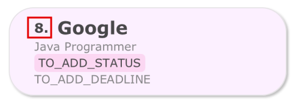

* You may want to enter the [`list`](#listing-all-applications--list) command to list all available applications.

**Step 2**: Type `delete 8` into the Command Box and press **Enter**. You should notice that the application will be
removed from the list of applications. 
 

Congrats! You have now master the basics of JobFindr! You may head right below to learn more
about [JobFindr in details](#key-information)
or go on to learn about [the other commands](#features) you can utilise in JobFindr.

[&uarr; Back to Table of Contents](#table-of-contents)

--------------------------------------------------------------------------------------------------------------------

## **Key Information**

### User Interface

We designed our Graphical User Interface(GUI) with both **functionality** and **visual appeal** in mind. To provide a
seamless experience for you at JobFindr.

Below are the components of our GUI:

| Index | Component            | Description                                                            |
|-------|----------------------|------------------------------------------------------------------------|
| 1     | Menu Bar             | Contains system based features like `exit` and `help`                  |
| 2     | Job Card             | Displays the specific job application                                  |
| 3     | Job List Panel       | Displays the list of applications you have added to JobFindr           |
| 4     | Result Display       | Displays success or error messages of the most recent command          |
| 5     | Command Box          | Key in your commands here                                              |
| 6     | Job Details Panel    | Displays detail of the application you have selected                   |
| 7     | Interview Card       | Displays the specific interview                                        |
| 8     | Interview List Panel | Displays the list of interviews you have added to that job application |

### Structure of a Job Application

| Field    | Prefix | Remarks                                                        | Optional? | Sort Order    |
|----------|--------|----------------------------------------------------------------|-----------|---------------|
| Company  | `c/`   | No restrictions                                                | No        | Alphabetical  |
| Role     | `r/`   | Must only contain alphanumeric characters and spaces           | No        | Alphabetical  |
| Status   | `s/`   | Possible values in "[Valid statuses](#valid-statuses)"         | Yes       | Alphabetical  |
| Industry | `i/`   | Must start with an alphanumeric character                      | Yes       | Alphabetical  |
| Deadline | `d/`   | Must be in the format MMM dd yyyy HHmm (e.g. Dec 01 2030 1200) | Yes       | Chronological |
| Job Type | `t/`   | Possible values in "[Valid job types](#valid-job-types)"       | Yes       | Alphabetical  |

* Applications with the same company _AND_ role are considered duplicate jobs.
  JobFindr does not allow the creation of duplicate jobs.

* Deadline refers to the application submission deadline.

### Valid Statuses

The following are valid statuses:

| Status          | Remarks                                                                   |
|-----------------|---------------------------------------------------------------------------|
| `TO_ADD_STATUS` | The default status if not specified                                       |
| `PENDING`       | An application that you have applied for but have yet to receive a result |
| `APPROVED`      | An application that you have received a job offer for                     |
| `REJECTED`      | An application that you have been rejected for                            |

### Valid Job Types

The following are valid job types:

| Job Type          | Remarks                               |
|-------------------|---------------------------------------|
| `TO_ADD_JOB_TYPE` | The default job type if not specified |
| `FULL_TIME`       | A full time job                       |
| `PART_TIME`       | A part time job                       |
| `INTERNSHIP`      | An internship                         |
| `TEMPORARY`       | A temporary job                       |
| `CONTRACT`        | A contract job                        |
| `FREELANCE`       | A freelance job                       |
| `VOLUNTEER`       | A volunteered job                     |

### Structure of an Interview

| Field    | Prefix | Remarks                                                                                                             | Optional? |
|----------|--------|---------------------------------------------------------------------------------------------------------------------|-----------|
| Type     | `t/`   | Possible values in "[Valid Interview Types](#valid-interview-types)"                                                | No        |
| DateTime | `d/`   | Must be in the format MMM dd yyyy HHmm (e.g. Dec 31 2030 1200) and cannot be earlier than the current date and time | No        |
| Address  | `a/`   | Must start with an alphanumeric character                                                                           | No        |

* Interviews in the **same application** with the same type _AND_ datetime _AND_ address are considered duplicate
  interviews.
  JobFindr does not allow the creation of duplicate interviews.

* DateTime of interview can be after Deadline of application.

* Multiple interviews with the same DateTime can be added if they are not duplicate interviews.

### Valid Interview Types

The following are valid interview types:

| Interview Type | Remarks                 |
|----------------|-------------------------|
| `BEHAVIOURAL`  | A behavioural interview |
| `TECHNICAL`    | A technical interview   |
| `CASE`         | A case interview        |
| `GROUP`        | A group interview       |
| `PHONE`        | A phone interview       |
| `VIDEO`        | A video interview       |
| `ONLINE`       | An online interview     |
| `ONSITE`       | An onsite interview     |
| `OTHER`        | Other interviews        |

### Command Format

* If you are using a PDF version of this document, be careful when copying and pasting commands that span multiple lines
  as space characters surrounding line-breaks may be omitted when copied over to the application.

* Words in upper case are the parameters to be supplied by the user. 
    * e.g. in `add c/COMPANY`, `COMPANY` is a parameter which can be used as `add c/Google`.

* Items in square brackets are optional. 
    * e.g. `c/COMPANY [s/STATUS]` can be used as `c/Google s/Pending` or as `c/Google`.

* Parameters can be in any order. 
    * e.g. if the command specifies `c/COMPANY r/ROLE`, `r/ROLE c/COMPANY` is also acceptable.
    * When `INDEX` is required, it has to be the first parameter.

* Extraneous parameters for commands that do not take in parameters (such as `help`, `exit` and `clear`) will be
  ignored. 
    * e.g. if the command specifies `help 123`, it will be interpreted as `help`.

* A _white space_ must be included directly before each [prefix](#prefix).

* The same prefix cannot be used multiple times in the same command.
    * e.g. `add r/Cleaner c/Google c/Microsoft` is an invalid input.

* `INDEX` and `JOB_INDEX` refers to the index number of the chosen application in the displayed application list and
  must be a _positive
  integer_ 1, 2, 3, …

* `INTERVIEW_INDEX` refers to the index number of the chosen interview of an application and must be a _positive
  integer_ 1, 2, 3, …

[&uarr; Back to Table of Contents](#table-of-contents)

--------------------------------------------------------------------------------------------------------------------

## **Features**

### Command Summary

| Action               | Format                                                                                   |
|----------------------|------------------------------------------------------------------------------------------|
| **Add**              | `add c/COMPANY r/ROLE [s/STATUS] [d/DEADLINE] [i/INDUSTRY] [t/JOB_TYPE]`                 |
| **Edit**             | `edit INDEX [c/COMPANY] [r/ROLE] [s/STATUS] [d/DEADLINE] [i/INDUSTRY] [t/JOB_TYPE]`      |
| **Delete**           | `delete INDEX`                                                                           |
| **List**             | `list`                                                                                   |
| **Find**             | `find [KEYWORDS] [c/COMPANY] [r/ROLE] [s/STATUS] [d/DEADLINE] [i/INDUSTRY] [t/JOB_TYPE]` |
| **Sort**             | `sort PREFIX`                                                                            |
| **Interview add**    | `interview add INDEX t/TYPE d/DATETIME a/ADDRESS`                                        |
| **Interview delete** | `interview delete INTERVIEWINDEX from/JOBINDEX`                                          |
| **Interview edit**   | `interview edit INTERVIEWINDEX from/JOBINDEX`                                            |
| **Help**             | `help`                                                                                   |
| **Clear**            | `clear`                                                                                  |
| **Exit**             | `exit`                                                                                   |

--------------------------------------------------------------------------------------------------------------------

### **General Features**

### Asking for help: `help`

_Shows a list of commands and how they can be used._

This command opens up a separate window, displaying all the available commands on JobFindr and their formats.

**Format:** `help`

***Successful Example:***

[&uarr; Back to Table of Contents](#table-of-contents)

--------------------------------------------------------------------------------------------------------------------

### Exiting the programme: `exit`

_Exits the program._

**Format:** `exit`

**:information_source: Notes:**  
* Job applications will be saved automatically, no further action is required!

[&uarr; Back to Table of Contents](#table-of-contents)

--------------------------------------------------------------------------------------------------------------------

### **Job Application Features**

### Listing all Applications : `list`

_Shows a list of all job applications in alphabetical order of the company name._

**Format:** `list`

**Successful Example:**  
**Step 1:** Type `list` in the Command Box and press **Enter**. 
 

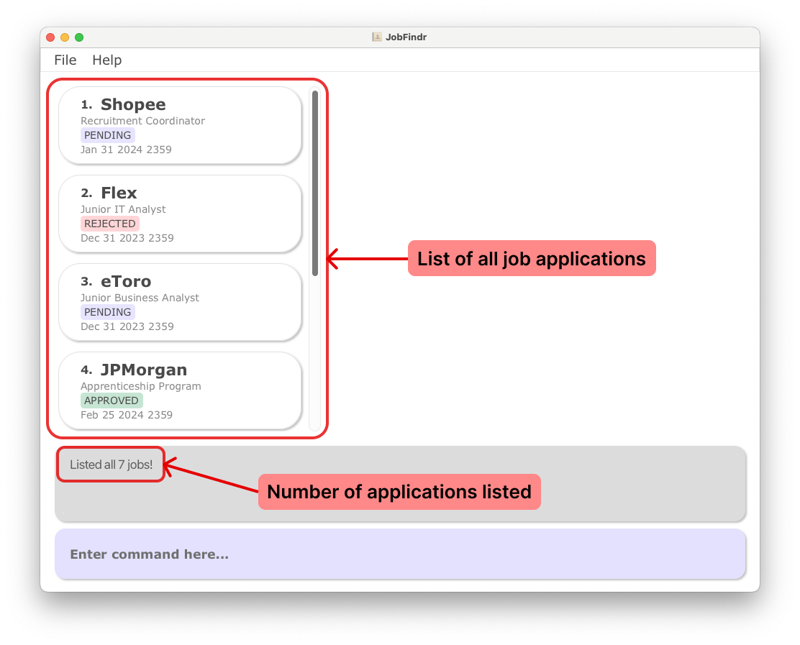

**:bulb: Useful Tips:** 
* You may navigate through the Job List Panel using the Up/Down arrow keys or use the Scroll Bar. 

[&uarr; Back to Table of Contents](#table-of-contents)

--------------------------------------------------------------------------------------------------------------------

### Adding an Application : `add`

_Adds a job application to the list._

**Format:** `add c/COMPANY r/ROLE [s/STATUS] [d/DEADLINE] [i/INDUSTRY] [t/JOB_TYPE]`

**:bulb: Useful Tips:** 
* Only Company and Role are compulsory fields to enter an application.
* Order of the fields can be changed.

***Successful Example:***

**Step 1:** Enter a basic job application into the Command Box `add c/Google r/Software Engineer` and press **Enter**.

* This command adds a job application for the company **Google** with the role **Software Engineer**.
* Optional fields like deadline, status, industry, and job type are not provided, so they will use their default values.

**Step 2:** You will see a new [Job Card](#user-interface) added to the Job List Panel. Click on it and will see its Job
Details Panel appear on the right side of the window. 

***Common Errors:***

* Missing required fields: `add r/Data Analyst`
    * This command is invalid because it doesn't provide the `c/COMPANY` field, which is compulsory.
    * Try adding a company with company field included eg. `add c/Facebook r/Data Analyst`

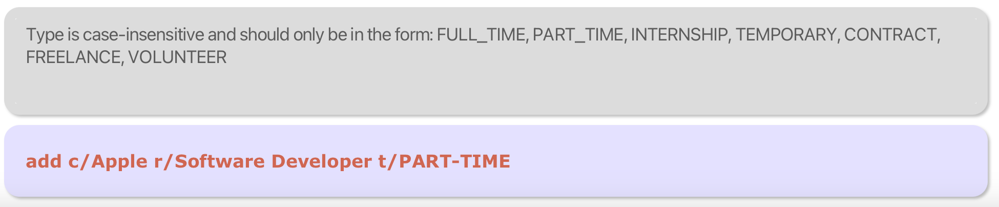

* Invalid Job Type: `add c/Apple r/Software Developer t/Part-Time`
    * This command is invalid because `t/t/PART-TIME` is not a valid job type due to the **dash** `-`. It should
      be an **underscore** `_` instead enter `t/PART_TIME`.

--------------------------------------------------------------------------------------------------------------------

### Deleting an Application : `delete`

_Deletes the specified application from the list using the specified `INDEX`._

**Format:** `delete INDEX`

**:bulb: Useful Tips:** 
* Try using ths list command to display all job applications before deleting an application.

**Successful Examples:**

**Step 1:** Enter the [list command](#listing-all-applications--list) to list all the available job applications.

**Step 2:** Locate the index of the job application you want to delete.  Let's try typing `delete 2` and
press **Enter**.

* This command deletes the job application at the 2nd index in the list.
* This is provided that this job application indeed exists.
  

**Step 3:** Now you will see the 2nd application removed from the list of jobs.

***Common Errors:***

* Invalid job index: `delete 10` when there is no job application at index 10.
    * This command is invalid because 10 is not a valid job index. Use list command to find the job application and its
      index on its Job Card.

[&uarr; Back to Table of Contents](#table-of-contents)

--------------------------------------------------------------------------------------------------------------------

### Editing an Application : `edit`

_Edits the application to the company at the specified `INDEX`_

**Format:** `edit INDEX [c/COMPANY] [r/ROLE] [s/STATUS] [d/DEADLINE] [i/INDUSTRY] [t/JOB_TYPE]`

**:exclamation: Warning:** 
* A valid index must be provided.
* At least one of the fields must be provided.

***Successful Examples:***

***Editing One Field***

**Step 1:** Now you realised you have seen the job listing wrongly and wish to change the role of the job complication
to `Google`. Type `edit 8 r/Test Engineer` and press **Enter**.

* This command edits the role of the `Google` application to `Test Engineer`

**Step 2:** You will see the newly updated Job Card for the role field at `Google`. 
 

***Editing Multiple Fields***

**Step 1:** Trying editing multiple fields for a job application with one command.
Type `edit 2 c/Amazon r/Product Manager d/Dec 15 2023 1000 s/APPROVED` and press **Enter**.

* This command edits the company, role, deadline, and status of the second job application.
* Make sure there is a job application at index 2.

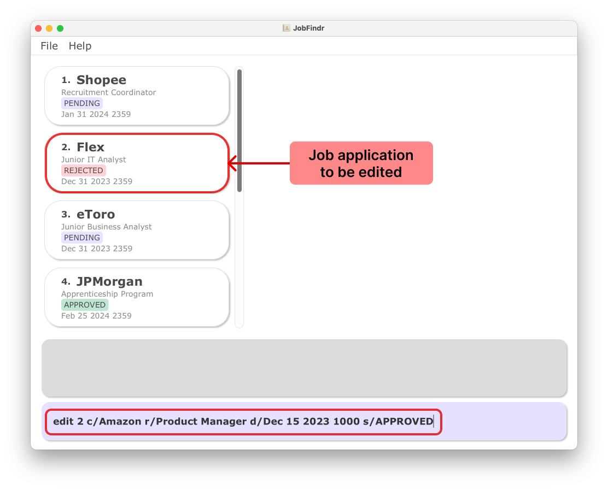

**Step 2:** You will see the 2nd Job Card in the list being updated. 

***Common Errors:***

* Missing index: `edit c/Google r/Software Engineer`
    * This command is invalid because it doesn't specify the index of the job application to edit.

* Invalid field: `edit 3 q/Designer`
    * This command is invalid because `q/Designer` is not a valid field. It should be `r/Designer`.

* Invalid Job Type: `edit 4 t/PART-TIME`
    * This command is invalid because `t/t/PART-TIME` is not a valid job type due to the **dash** `-`. It should
      be an **underscore** `_` instead enter `t/PART_TIME`.

[&uarr; Back to Table of Contents](#table-of-contents)

--------------------------------------------------------------------------------------------------------------------

### Clearing all Applications: `clear`

_Clears all job applications from JobFindr._

**Format:** `clear`

**:exclamation: Warning:** 
* This command is **irreversible**! Be aware of using this command.

[&uarr; Back to Table of Contents](#table-of-contents)

--------------------------------------------------------------------------------------------------------------------

### Finding an Application : `find`

_Finds all applications whose fields match the keywords provided._

**Format:** `find [KEYWORDS] [c/COMPANY] [r/ROLE] [s/STATUS] [d/DEADLINE] [i/INDUSTRY] [t/JOB_TYPE]`

**:exclamation: Warning:** 
* **At least one** of the parameters above must be provided. Multiple parameters can be included in one command.
* An application will be listed only if it contains **ALL** the keywords provided.

**:information_source: Notes about Command Format:** 
* **No Prefix** - If `KEYWORDS` are provided without [prefix](#prefix), the command will find all applications that contains the `KEYWORDS` in **any field**.
* **Prefix Given** - If a [prefix](#prefix) is given, the search will only find applications containing the given keywords in the specified
  field.

**:information_source: Notes about KEYWORDS Parameter:** 
* Keywords are **case-insensitive**.
* Multiple words can be provided for one `KEYWORDS` parameter.
    * e.g. `find r/Software Engineer` is a valid command.
* Applications with partially matching keywords **will not be listed**.
    * e.g. searching for the keyword `Goo` will not list applications containing `Google`.
* Characters not separated by white space are considered _ONE_ word.
    * e.g. searching for the keyword `ADD` will not list applications containing `TO_ADD_DEADLINE`.

***Successful Examples:***

***Find by Specific Field:***

**Step 1:** Let's try finding job application with the `company` field.
Type `find c/Tiktok` and press **Enter**.

* This command searches for all job applications with `Tiktok` in the company name. 

**Step 2:** All matching job applications will be displayed in the Job List Panel.

* Click the Job Card to display its details in the Job Details Panel. 

***Find by Multiple Conditions:***

**Step 1:** Let's try finding job application with by applying multiple conditions in the find command.
Type `find Project c/Deloitte` and press **Enter**.

* This command searches for all job applications with `Project` in **any field** and the words `Deloitte` its **company
  field**. 

**Step 2:** All matching job applications will be displayed in the Job List Panel.

* Click the Job Card to display its details in the Job Details Panel. 

***Common Errors:***

* Missing keywords: `find`
    * This command is invalid because it doesn't specify any keywords to search for. Please provide **at least one
      keyword** after `find`.

[&uarr; Back to Table of Contents](#table-of-contents)

--------------------------------------------------------------------------------------------------------------------

### Sorting all applications : `sort`

_Sorts the list based on the prefix provided._

**Format:** `sort PREFIX`

**:exclamation: Warning:** 
* A single valid `PREFIX` must be provided. Refer to "[Structure of a job application](#structure-of-a-job-application)"
  for the list of valid prefixes.

**:information_source: Notes:** 
* The sort order **cannot be reversed**.
    * e.g. when sorting by `company`, companies cannot be listed from Z-A.
* For optional fields, applications with empty fields will be listed first.

***Successful Examples:***

***Sort by Company:***

**Step 1:** Let's start by sorting the job application by `company` name. Type `sort c/` and press **Enter**.

* This command sorts all job applications in ascending alphabetical order of company name. 

**Step 2:** A sorted list of job applications by `company` will be displayed in the Job List Panel.  

***Sort by Deadline:***

**Step 1:** Let's try another prefix and sort the job application by `deadline`. Type `sort d/` and press **Enter**.

* This command sorts all job applications in chronological order of deadline, starting from applications with the
  **earliest deadline**. 

**Step 2:** A sorted list of job applications by `deadline` will be displayed in the Job List Panel.  

***Common Errors:***

* Multiple prefixes: `sort r/ c/`
    * This command is invalid because only one prefix is accepted.

* Input following prefix: `sort r/Software`
    * This command is invalid because there should be nothing following the `prefix` provided. Enter the `sort` command
      without any keyword after the `prefix`.

[&uarr; Back to Table of Contents](#table-of-contents)

--------------------------------------------------------------------------------------------------------------------

### **Interview Features**

### Adding an Interview: `interview add`

_Adds an interview to a specified job application._

**Format:** `interview add INDEX t/TYPE d/DATETIME a/ADDRESS`

**:exclamation: Warning:** 
* All fields (Index, Type, DateTime, Address) are compulsory.

**Successful Examples:**

**Step 1:** Let us add an interview to the first job application in our list of job application. Start by listing all
the available jobs on JobFindr. Type `list` and press **Enter**.

**Step 2:** Identify the first job application in the list by looking at the [Job List Panel](#user-interface). Click on
the first job's Job Card to display its Job Details Panel.

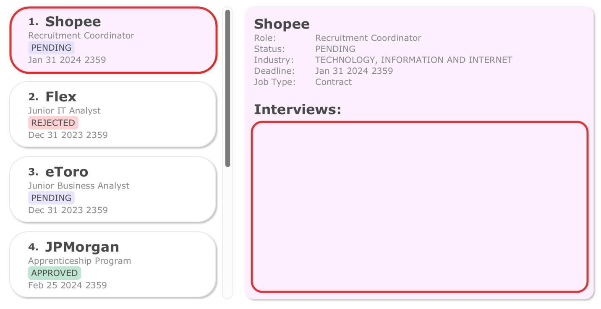

**Step 3:** Type `interview add 1 t/Technical d/Nov 19 2023 1200 a/Home` and press **Enter**.

* This command adds a **technical interview** on **Nov 19 2023 1200** that will be done at **Home** to the first
  application in the list.

**Step 4:** You will see a new interview being added to the Interview List of the first job application, in this case it
is for **Shopee**.

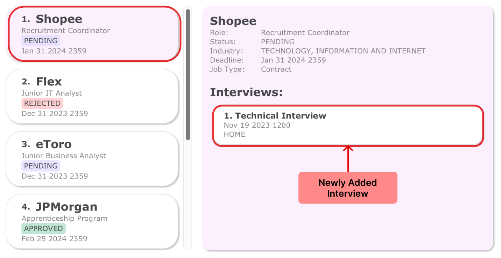
 

**Common Errors:**

* Missing Compulsory Fields: `interview add 1 t/Behavioural a/Office`.
    * This command is invalid as there is missing `d/DATETIME`. All the fields are compulsory and cannot be left out.
      Include all fields for the command to be valid.
    * eg. `interview add 1 t/Behavioural a/Office d/Dec 01 2023 1000`

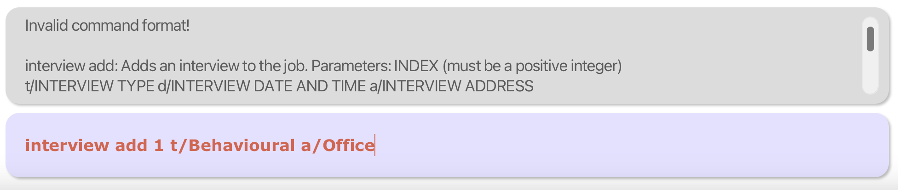

* Invalid/Missing input for any field: `interview add 1 t/NOT SURE a/Office d/Dec 01 2023 1000`
    * If any fields have invalid/missing input, Result Display will show the possible valid inputs for that field.
    * So instead of putting `NOT SURE` for the interview `type`, we can put `OTHER` instead.

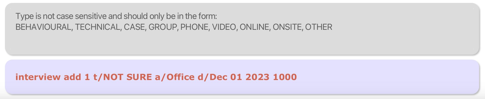

* Invalid/Missing index: `interview add t/OTHER a/Office d/Dec 01 2023 1000`
    * Without a valid index, JobFindr will not be able to identify the application you wish to add the interview to.
    * Provide a valid index for the job application. eg. `interview add 1 t/OTHER a/Office d/Dec 01 2023 1000`

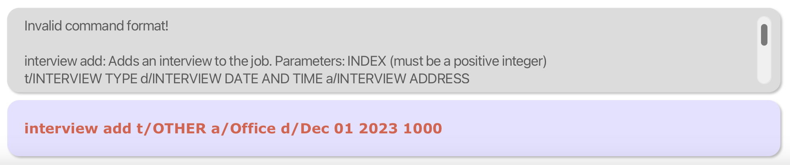

[&uarr; Back to Table of Contents](#table-of-contents)

--------------------------------------------------------------------------------------------------------------------

### Deleting an Interview: `interview delete`

_Deletes the interview at the `INTERVIEW_INDEX` from the job application at `JOB_INDEX`_

**Format:** `interview delete INTERVIEW_INDEX from/JOB_INDEX`

**:exclamation: Warning:** 
* Both indexes for job application and interview must be provided and valid.

**Successful Examples:**

**Step 1:** Identify the interview and its job application that you want to delete. Try using `list` or `find` command
to find the specific job application. Click on the job's Job Card to display its interview.

* Let's try to delete `Behavioral Interview` from `Shopee`.

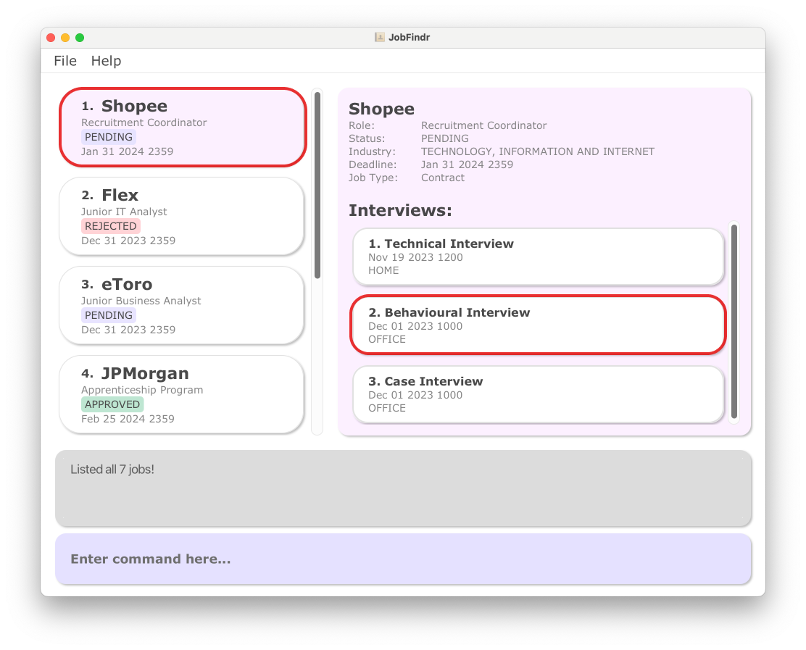

**Step 2:** So we have identified that the interview we want to delete is the **2nd interview** in the **1st job
application**.
Let's type `interview delete 2 from/ 1` and press **Enter**.

**Step 3:** We will now see that the `Behavioral Interview` from `Shopee` has been removed.

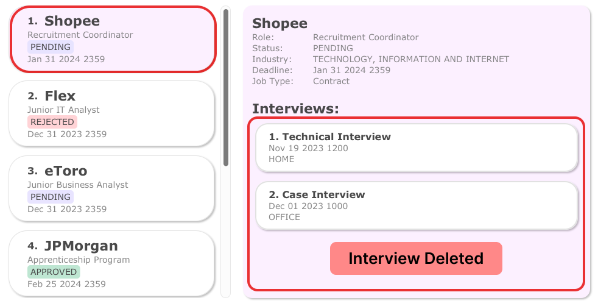

**Common Errors:**

* Invalid/Missing index: `interview delete 5 from/1`
    * This is invalid if there is no interview at index 5 for the 1st job application.
    * Click on the Job Card of the 1st application to check the correct index for interview.

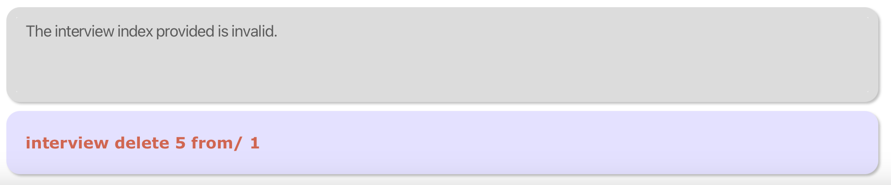

[&uarr; Back to Table of Contents](#table-of-contents)

--------------------------------------------------------------------------------------------------------------------

### Editing an Interview: `interview edit`

_Edits the interview at the `INTERVIEW_INDEX` from the job application at `JOB_INDEX`_

**Format:** `interview edit INTERVIEW_INDEX from/JOB_INDEX [t/TYPE] [d/DATETIME] [a/ADDRESS]`

**:information_source: Notes:** 
* At least one of the optional fields must be provided.

**Successful Examples:**

**Step 1:** Identify the interview and its job application that you want to edit. Try using `list` or `find` command
to find the specific job application. Click on the job's Job Card to display its interview.

* Let's edit the `Case Interview` from `Shopee`.

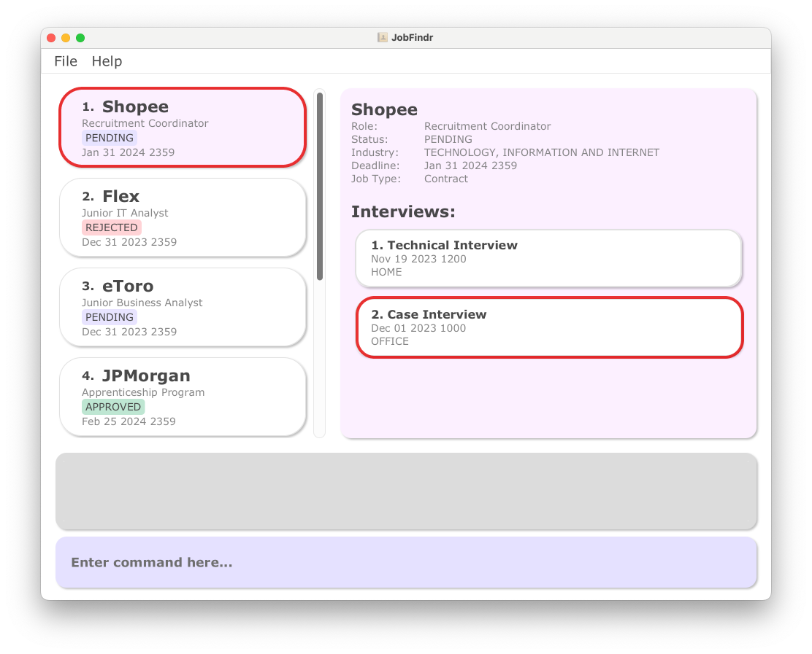

**Step 2:** Looking at the Interview List Panel, we can see that the interview we want to delete is the
**2nd interview** in the **1st job application**.
Let's type `interview edit 2 from/ 1 d/Jan 20 2024 1200` and press **Enter**.

* This command will edit the date of the interview to `Jan 20 2024 1200`

**Step 3:** Look at the Interview Card for the `Case Interview` from `Shopee`, the `date` will be edited.

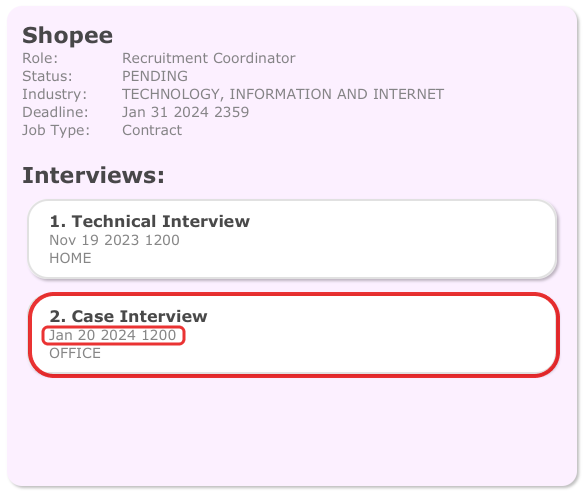

**Common Errors:**

* Invalid/Missing index: `interview edit 5 from/1 t/Technical`
    * This is invalid if there is no interview at index 5 for the 1st job application.
    * Click on the Job Card of the 1st application to check the correct index for interview.

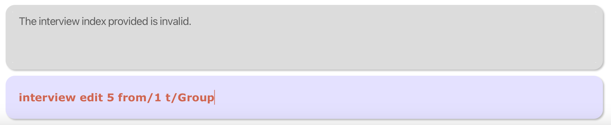

* Invalid/Missing input for any field: `interview edit 2 from/1 d/Dec 31 2023`
    * If any fields have invalid/missing input, Result Display will show the possible valid inputs for that field.
    * As `Dec 31 2023` is not a valid `DATETIME` format, please specify the time as well. Eg. `Dec 31 2023 2359`

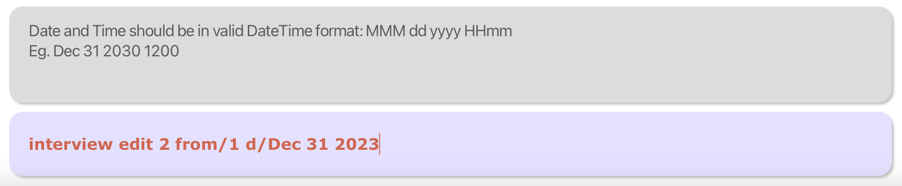

[&uarr; Back to Table of Contents](#table-of-contents)

--------------------------------------------------------------------------------------------------------------------

## **FAQ**

### 1. How do I make sure I have installed the correct Java version?

- [Open up terminal](#2-how-do-i-open-up-terminal-on-my-computer) on your computer.
- Type `java -version` in your terminal and press **Enter**. You will see the following if you have installed Java 11
  correctly: 
  
- If you do not have Java 11 installed, please refer
  to [this guide](https://docs.oracle.com/en/java/javase/11/install/overview-jdk-installation.html#GUID-8677A77F-231A-40F7-98B9-1FD0B48C346A)
  to download it to your computer.

### 2. How do I open up terminal on my computer?

On **Mac**:

1. Open up **Spotlight Search** by clicking the button in your menu bar. Or simply use the keyboard
   shortcut `Command + Space`.
2. Type **“Terminal”**
3. You should see the Terminal application at the top of your results. **Double-click** it or **press Enter** to
   open up
   Terminal.

On **Windows**:

1. Open your computer's **Start** menu by clicking the Windows Start
   icon 
   in the bottom-left corner of your desktop or press the Win
   key 
   on your keyboard.
2. Type **"Command Prompt"** or **"Powershell"**
3. You should see the correct application at the top of your results. **Double-click** it or **press Enter** to
   open up Command Prompt or Powershell.

### 3. How do I transfer my data to another Computer?

- Install the app in the other computer and overwrite the empty data file it creates with the file that contains
  the data of your previous AddressBook home folder.

[&uarr; Back to Table of Contents](#table-of-contents)

--------------------------------------------------------------------------------------------------------------------

## **Glossary**

#### Prefix

* An affix that placed before the field to indicate the type of field
* Examples: c/ r/ s/ from/

[&uarr; Back to Table of Contents](#table-of-contents)
