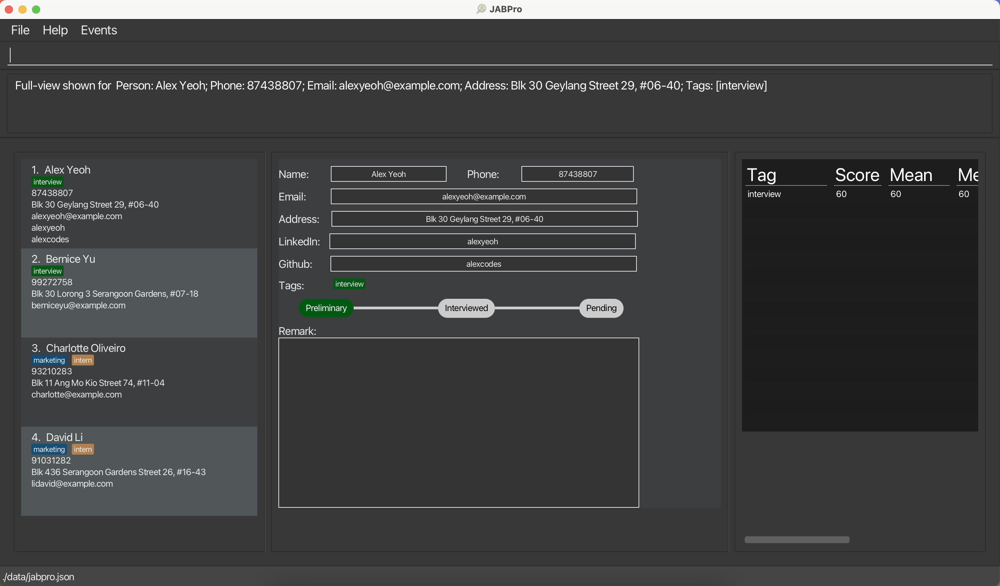

**Tran$act** is a simple and easy to use transaction recorder and tracker built in Java.

---

## Quick start

1. Ensure you have Java `11` or above installed in your Computer.

1. Download the latest `transact.jar` from [here].

1. Copy the file to the folder you want to use as the _home folder_ for your tran$act.

1. Open a command terminal, `cd` into the folder you put the jar file in, and use the `java -jar transact.jar` command to run the application. 
   A GUI similar to the below should appear in a few seconds. Note how the app contains some sample data. 
   

1. Refer to the [Features](#features) below for details of each command.

---

## Features

**:information_source: Notes about the command format:**

- ?: Optional Field
- <description>: Any string
- <type>: [Revenue (R), Expense (E)]
- <amount>: Any number
- <date>: In dd/mm/yy format
- <staff>: Name of staff

### Adding transaction : `add`

Format: `add <type> <description> a/<amount> <date> <?staff>`

Examples:

- `add R Sold 1 Mug a/10 10/10/23 John`
- `add E “Paid Manufacturer” 100 10/11/23`

Success/Fail Output:

- Added revenue (Toast)
- Added expenditure (Toast)
- Error: <Error Message> (Toast)

### Removing transaction: `del`

Format: `del <id>`

Example:`del 1`

Success/Fail Output:

- Removed transaction (Toast)
- Error: <Error Message> (Toast)

### Viewing transactions : `view t`

Switches UI to transaction tabs, which shows the full list of transactions

Format: `view t` or `view transaction`

### Adding staff : `addstaf`

Format: `addstaff n/<name> p/<phone no> e/<email> a/<address> [t/<tag>]`

Success/Fail Output:

- Added staff (Toast)
- Error: <Error Message> (Toast)

### Removing staff: `delstaff`

Format: `delstaff <staff id>`

Example: `delstaff 1`

Success/Fail Output:

- Removed staff (Toast)
- Error: <Error Message> (Toast)

### Viewing staff : `view s`

Switches UI to staff tabs, which shows the full list of staff

Format: `view s` or `view staff`

### Exiting the program : `exit`

Exits the program.

Format: `exit`

### Saving the data

transact data are saved in the hard disk automatically after any command that changes the data. There is no need to save manually.

---

## Navigating the GUI

Tran$act's GUI is simple and gives you access to all of its features with just one click.

This should be what you see when you open Transact for the first time:

The upper menu bar contains two tabs:
1. File — This tab contains actions like saving data and loading data.
2. Help — This tab contains more information about Tran$act like, for example, this User Guide.

The lower menu bar contains three tabs:
1. Overview — This tab shows you a monthly summary of your finances based on thr transactions you have entered. Although it's empty right now, when you have added a few transactions it will begin to show graphs.
2. Transactions — This tab shows you the transactions you have entered in a row-by-row format.
3. Addressbook — This tab shows you the persons or parties you have entered in a list format.

The input field below this with the grey text `Enter command here...` is where you can enter your commands.

---

## FAQ

---

## Known issues

---

## Command summary

| Action                 | Format, Examples                                                 |
| ---------------------- | ---------------------------------------------------------------- |
| **Add transaction**    | `add <type> <description> a/<amount> <date> <?staff>`            |
| **Remove transaction** | `del <id>`                                                       |
| **View transaction**   | `view t` or `view transaction`                                   |
| **Add staff**          | `addstaff n/<name> p/<phone no> e/<email> a/<address> [t/<tag>]` |
| **Remove staff**       | `delstaff <staff id>`                                            |
| **View staff**         | `view s` or `view staff`                                         |

## Glossary

| Term        | Definition                                             |
| ----------- | ------------------------------------------------------ |
| Transaction | An exchange of money (e.g. Income / Expense)           |
| Transactor  | Person associated with the transaction                 |
| Income      | Money received (e.g. Product Sale)                     |
| Expense     | Costs incurred (e.g. Staff salary, cost of production) |
| Command     | An input into the text box to carry out actions        |
