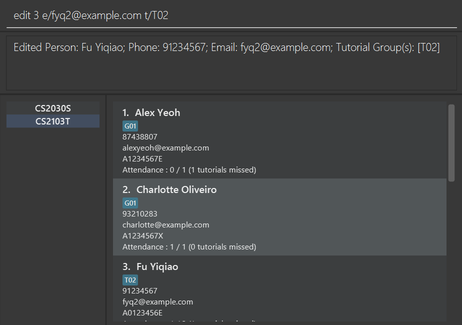
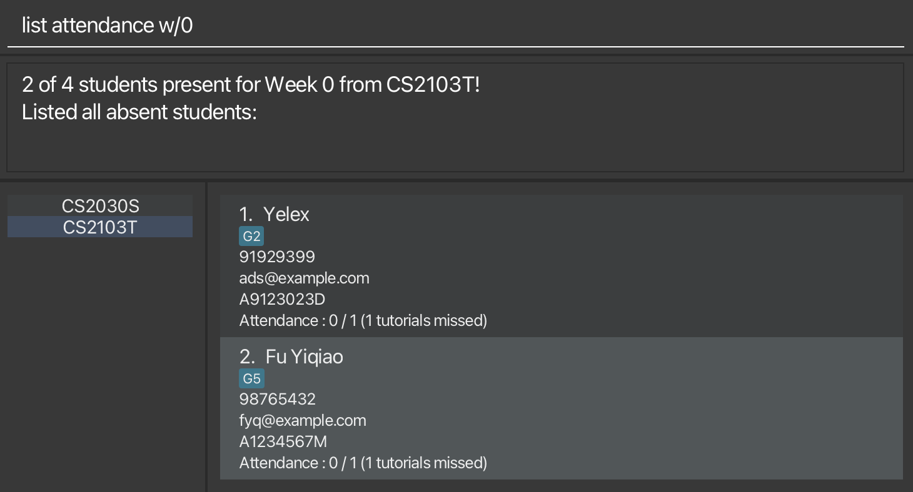

TAvigator is a **desktop app** targeted towards Teaching Assistants **for managing contacts, optimized for use via a 
Command Line Interface** (CLI) while still having the benefits of a Graphical User Interface (GUI). If you can type 
fast, TAvigator can get your contact management tasks done faster than traditional GUI apps. We offer a one-stop
solution to manage your student details, including attendance records and assignment details.

### Table of Contents

- [Quick start](#Quick-start)
- [Features](#features)
- [FAQ](#faq)
- [Known issues](#known-issues)
- [Command summary](#command-summary)

--------------------------------------------------------------------------------------------------------------------

## Quick start

1. Ensure you have Java `11` or above installed in your Computer.

2. Download the latest `tavigator.jar` from [here](https://github.com/AY2324S1-CS2103T-T09-4/tp/releases).

3. Copy the file to the folder you want to use as the _home folder_ for your TAvigator.

4. Open a command terminal, `cd` into the folder you put the jar file in, and use the `java -jar tavigator.jar` command to run the application. 
   A GUI similar to the below should appear in a few seconds. Note how the app contains some sample data. 
   

5. Type the command in the command box and press Enter to execute it. e.g. typing **`help`** and pressing Enter will open the help window. 
   Some example commands you can try:

   * `list students` : Lists all contacts.

   * `add n/Fu Yiqiao p/91234567 e/fyq@gmail.com id/A1234567E t/G10` : Adds a contact named `Fu Yiqiao` to TAvigator.

   * `delete 3` : Deletes the 3rd contact shown in the current list.

   * `clear` : Deletes all contacts.

   * `exit` : Exits the app.

6. Refer to the [Features](#features) below for details of each command.

--------------------------------------------------------------------------------------------------------------------

## Features

**:information_source: Notes about the command format:** 

* Words in `UPPER_CASE` are the parameters to be supplied by the user. 
  e.g. in `add n/NAME`, `NAME` is a parameter which can be used as `add n/John Doe`.

* Items in square brackets are optional. 
  e.g `n/NAME [t/TAG]` can be used as `n/John Doe t/friend` or as `n/John Doe`.

* Items with `|` indicate that the command accepts either parameters. 
  e.g `mark /name STUDENTNAME | /id STUDENTID` takes in `STUDENTNAME` or `STUDENTID` as its first argument.

* Items with `…​` after them can be used multiple times including zero times. 
  e.g. `[t/TAG]…​` can be used as many times as desired (i.e. 0 times), `t/friend`, `t/friend t/family` etc.

* Parameters can be in any order. 
  e.g. if the command specifies `n/NAME p/PHONE_NUMBER`, `p/PHONE_NUMBER n/NAME` is also acceptable.

* Extraneous parameters for commands that do not take in parameters (such as `help`, `list`, `exit` and `clear`) will be ignored. 
  e.g. if the command specifies `help 123`, it will be interpreted as `help`.

* If you are using a PDF version of this document, be careful when copying and pasting commands that span multiple lines as space characters surrounding line-breaks may be omitted when copied over to the application.

### Viewing help : `help`

Shows a message explaning how to access the help page.

Format: `help`

### Creating an addressbook: `course create`

Creates a new addressbook.

Format: `course create coursetg/COURSECODE`

* Creates a new addressbook with course code `COURSECODE`
* `COURSECODE` should be a string made up of alphabetical characters and numbers, with no special characters.
* `COURSECODE` must be specified.
* `COURSECODE` address book must not exist.

Example:
* `course create coursetg/CS2103T` creates a new addressbook with course code CS2103T.

### Deleting an addressbook: `course delete`

Delete an addressbook.

Format: `course create coursetg/COURSECODE`

* Deletes the addressbook with course code `COURSECODE`
* `COURSECODE` should be a string made up of alphabetical characters and numbers, with no special characters.
* `COURSECODE` must be specified.
* `COURSECODE` address book must exist.

Example:
* `course delete coursetg/CS2103T` deletes the addressbook with course code CS2103T.

### Switching an addressbook: `course switch`

Switches the active addressbook.

Format: `course switch coursetg/COURSECODE`

* Switches to the addressbook with course code `COURSECODE`
* `COURSECODE` should be a string made up of alphabetical characters and numbers, with no special characters.
* `COURSECODE` must be specified.
* `COURSECODE` address book must exist.

Example:
* `course switch coursetg/CS2103T` switches to the addressbook with course code CS2103T.

### Editing an addressbook: `course edit`

Edits the active addressbook.

Format: `course edit coursetg/COURSECODE`

* Changes the course code of active addressbook to `COURSECODE`
* `COURSECODE` should be a string made up of alphabetical characters and numbers, with no special characters.
* `COURSECODE` must be specified.
* `COURSECODE` address book must not exist.

Example:
* `course edit coursetg/CS2103T` changes the active addressbook's course code to CS2103T.

### Adding a new contact: `add`

Creates a new contact with the specified name and course code.

Format: `add n/STUDENT_NAME p/PHONE_NUMBER e/EMAIL id/STUDENT_ID [t/COURSE_CODE TUTORIAL_GROUP]…`

* `STUDENT_NAME` should be a string made up of alphabetical characters, with no numbers or special characters.
* `PHONE_NUMBER` should be a string made up of numbers
* `STUDENT_ID` should be a string made up of alphanumeric characters, with no special characters or space.

Examples:
* `add n/Fu Yiqiao p/91234567 e/fyq@gmail.com id/A1234567E`
* `add n/Fu Yiqiao p/91234567 e/fyq@gmail.com id/A1234567E t/G2`

### Editing a contact : `edit`

Edits the contact details.

Format: `edit INDEX [n/STUDENT_NAME] [p/PHONE] [e/EMAIL] [id/STUDENT_ID] [t/COURSE_CODE TUTORIAL_GROUP]...`

* Edits the person at the specified INDEX. The index refers to the index number shown in the displayed person list. The index must be a positive integer 1, 2, 3, …
* At least one of the optional fields must be provided.
* Existing values will be updated to the input values.
* When editing tags, the existing tags of the person will be removed i.e adding of tags is not cumulative.
* You can remove all the person’s tags by typing t/ without specifying any tags after it.

Examples:
*  `edit 1 n/Tan Liyan` Edits the name of the first person to be Tan Liyan.
*  `edit 2 p/92345678 t/` Edits the phone number of the second person and removes all tags.

### Marking attendance of student: `mark`

Format: `mark n/STUDENT_NAME[, STUDENT_NAME]… | id/STUDENT_ID[, STUDENT_ID]… a/ATTENDANCE w/WEEKNUMBER
[r/REASON_OF_ABSENCE]`

* Marks the attendance of one or more student corresponding to the `STUDENT_NAME` or `STUDENT_ID`.
* To mark attendance for multiple students, provide a comma-separated list of `STUDENT_NAME` or `STUDENT_ID`.
* If a student is present, `REASON_OF_ABSENCE` is not required.
* If a student is absent, `REASON_OF_ABSENCE` is mandatory.
* `STUDENT_NAME` should be a string made up of alphabetical characters, with no numbers or special characters.
* `STUDENT_ID` should be a string made up of alphanumeric characters, with no special characters or space.
* `ATTENDANCE` should only be 0 or 1, where 0 indicates student is absent and 1 indicates student is present.

Examples:
* `mark n/Zong Jin, Fu Yiqiao a/1 w/1` Marks students named, Zong Jin and Fu Yiqiao, as present for the tutorial in Week 1.
* `mark n/Zong Jin a/0 w/1 r/not feeling well` Marks student named, Zong Jin, as absent for the tutorial in Week 1 as he is not feeling well.
* `mark id/A0123456E, A0123457E a/1 w/1` Marks students with student IDs, A0123456E and A0123457E, as present for the tutorial in Week 1.
* `mark id/A0123456E a/0 w/1 r/no valid reason` Marks student with student ID, A0123456E, as absent for the tutorial in Week 1 with no valid reason.

### Viewing summary of attendance : `list attendance`

Shows a summary of attendance records including list of absentees.

Format: `list attendance w/WEEKNUMBER [tg/TUTORIALGROUPID]`
*  Shows a list of absentees and summary of the attendance records of all students or students corresponding to the specified tutorial group for the specified week number.
* `TUTORIALGROUPID` is optional.

Examples:
*  `list attendance w/1` Shows a summary of attendance records of all students for Week 1.
*  `list attendance w/3 tg/G01` Shows a summary of attendance records of the students in the tutorial group G01 for Week 3.

### Searching for student's contact via keyword : `find`

Finds a student's or multiple students' contact either via their name or student ID.

Format: `find n/STUDENT_NAME [STUDENT_NAME]… | id/STUDENT_ID [STUDENT_ID]…`

* `STUDENT_NAME` should be a string made up of alphabetical characters, with no numbers or special characters.
* `STUDENT_ID` should be a string made up of alphabetical characters and numbers, with no special characters or space.

Examples:
*  `find n/Anthony Yiqiao` Finds all contacts with the name "Anthony" and "Yiqiao".
*  `find id/A0123456H` Finds all contacts with the student ID "A0123456H".

### Listing students : `list students`

Shows a list of students.

Format: `list students`
*  Shows a list of all students.

### Deleting a person : `delete`

Deletes the specified person from TAvigator.

Format: `delete INDEX`

* Deletes the person at the specified `INDEX`.
* The index refers to the index number shown in the displayed person list.
* The index **must be a positive integer** 1, 2, 3, …​

Examples:
* `list students` followed by `delete 2` deletes the 2nd person in TAvigator.
* `find Betsy` followed by `delete 1` deletes the 1st person in the results of the `find` command.

### Deleting all students : `delete all`

Deletes all students from current address book or the specified tutorial group in the current address book.

Format: `delete all [tg/TUTORIALGROUPID]`

* Deletes all students or the students from the specified tutorial group.
* `TUTORIALGROUPID` is optional.

Examples:
* `delete all` deletes all students from the current address book.
* `delete all tg/G02` deletes all students from tutorial group G02.

### Merging two students : `merge`

Merges two students in the current address book. 

Format: `merge [PRIMARY_INDEX] [SECONDARY_INDEX]`

* Information of the primary student is retained.
* If any information fields of the primary student are empty, they are filled with information of the secondary student.
* The merged student contains tags of both students.

Examples:
* `merge 1 2` merges the information of the first two displayed students.

### Clearing all entries : `clear`

Clears all entries from the TAvigator.

Format: `clear`

### Exiting the program : `exit`

Exits the program.

Format: `exit`

### Saving the data

TAvigator data are saved in the hard disk automatically after any command that changes the data. There is no need to save manually.

### Editing the data file

TAvigator data are saved automatically as a JSON file `[JAR file location]/data/tavigator.json`. Advanced users are welcome to update data directly by editing that data file.

:exclamation: **Caution:**
If your changes to the data file makes its format invalid, TAvigator will discard all data and start with an empty data file at the next run. Hence, it is recommended to take a backup of the file before editing it.

### Archiving data files `[coming in v2.0]`

_Details coming soon ..._

--------------------------------------------------------------------------------------------------------------------

## FAQ

**Q**: How do I transfer my data to another Computer? 
**A**: Install the app in the other computer and overwrite the empty data file it creates with the file that contains the data of your previous TAvigator home folder.

--------------------------------------------------------------------------------------------------------------------

## Known issues

1. **When using multiple screens**, if you move the application to a secondary screen, and later switch to using only the primary screen, the GUI will open off-screen. The remedy is to delete the `preferences.json` file created by the application before running the application again.

--------------------------------------------------------------------------------------------------------------------

## Command summary

| Action     | Format, Examples                                                                                                                                                            |
|------------|-----------------------------------------------------------------------------------------------------------------------------------------------------------------------------|
| **Add**    | `add n/STUDENT_NAME p/PHONE_NUMBER e/EMAIL id/STUDENT_ID [t/COURSE_CODE TUTORIAL_GROUP]…`   e.g., `add n/Fu Yiqiao p/91234567 e/fyq@gmail.com id/A1234567E t/CS2103T G2` |
| **Clear**  | `clear`                                                                                                                                                                     |
| **Delete** | `delete all [tg/TUTORIALGROUPID]` `delete INDEX`   e.g., `delete all tg/G10` `delete 3`                                                                                  |
| **Edit**   | `edit INDEX [n/NAME] [p/PHONE] [e/EMAIL] [id/STUDENT_ID] [t/COURSECODE TUTORIALGROUPID]...`  e.g., `edit 1 n/Tan Liyan` `edit 2 p/92345678 t/`                           |
| **Exit**   | `exit`                                                                                                                                                                      |
| **Course** | `course [create/delete/switch/clear] `coursetg/COURSECODE`                                                                                                      |
| **Find**   | `find n/STUDENT_NAME [STUDENT_NAME]… \                                                                                                                                      | id/STUDENT_ID [STUDENT_ID]…`  e.g., `find n/Anthony Yiqiao`                                                                                                          |
| **List**   | `list attendance w/WEEKNUMBER [tg/TUTORIALGROUPID]` `list students`                                                                                                         |                                                           |
| **Help**   | `help`                                                                                                                                                                      |
| **Mark**   | `mark n/STUDENT_NAME[, STUDENT_NAME]… \                                                                                                                                     | id/STUDENT_ID[, STUDENT_ID]… a/ATTENDANCE w/WEEKNUMBER [r/REASON_OF_ABSENCE]`  e.g., `mark id/A0123456E, A0123457E a/1 w/1` `mark id/A0123456E, A0123457E a/1 w/1` |
| **merge**  | `merge [PRIMARY_INDEX] [SECONDARY_INDEX]`                                                                                                                                   |
