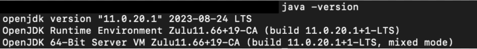
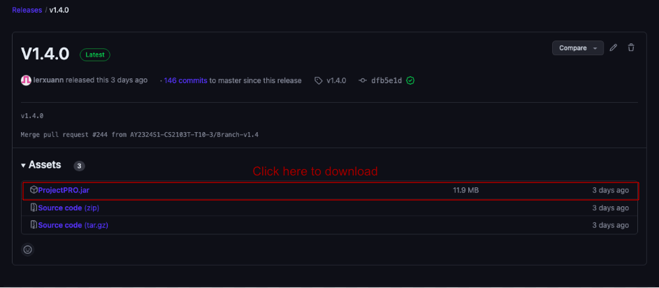

# Welcome to ProjectPRO's User Guide

## Introductions

Achieve simplicity while optimizing efficiency.

ProjectPRO is a desktop application designed to help university students organize their projects. Here is how ProjectPRO can streamline your project management process.

- Categorize your contacts into various project groups.
- Track key information from your projects.
- Find free time for your group meetings.

ProjectPRO is optimized for use via a Command Line Interface (CLI) while preserving the advantages of maintaining an attractive user interface. ProjectPRO utilizes simple and easy-to-remember commands to execute different tasks, enhancing our user's experience. For instance, adding a contact is executed with a simple `add` command, as listed in our Features Section. Unlock more time in your day, store your information the smart way.

**New here?** View our instructions for first-time users [here](#first-time-user).

**Used ProjectPRO before?** Click [here](#experienced-user) to recall what features we have!

## Table of Contents

1. [Introductions](#introductions)
2. [Table of Contents](#table-of-contents)
3. [Using Our Guide](#using-our-guide)
4. [Quick Start](#quick-start)
5. [Glossary](#glossary)
6. [Features](#features)
7. [Commands to Manage Contacts](#commands-to-manage-contacts)
- [Adding a Contact `add`](#adding-a-contact-add)
- [Deleting a Contact `delete`](#deleting-a-contact-delete)
- [Finding a Contact `find`](#finding-a-contact-find)
- [Listing all Contacts `list`](#listing-contacts-list)
8. [Commands to Manage Groups](#commands-to-manage-groups)
- [Adding a Group `new`](#adding-a-group-new)
- [Deleting a Group `delete`](#deleting-a-group-delete)
- [Adding remarks to a Group `remark`](#adding-remarks-to-a-group-remark)
- [Finding a Group `find`](#finding-a-group-find)
- [Listing a Group `list`](#listing-a-group-listgroup)
- [Grouping a Contact `group`](#grouping-a-contact-group)
- [Ungrouping a Contact `ungroup`](#ungrouping-a-contact-ungroup)
9. [Commands to Manage Time](#commands-to-manage-time)
- [Adding Time to a Contact `addtime`](#adding-time-to-a-contact-addtime)
- [Removing Time from a Contact `deletetime`](#removing-time-from-a-contact-deletetime)
- [Listing Time from a Contact `listtime`](#listing-time-from-a-contact-listtime)
- [Add Meeting to Group `addmeeting`](#add-meeting-to-a-group-addmeeting)
- [Remove Meeting Time from a Group `deletetime`](#remove-meeting-time-from-a-group-deletetime)
- [Listing Meeting Time from a Group `listtime`](#listing-meeting-time-from-a-group-listtime)
- [Finding Free Time of a Group `findfreetime`](#finding-free-time-of-a-group-findfreetime)
10. [General Commands](#general-commands)
- [Viewing Help `help`](#viewing-help--help)
- [Clearing All Data `clear`](#clearing-all-data--clear)
- [Exit ProjectPRO `exit`](#exit-projectpro--exit)

## Using Our Guide

This guide explains how you can use ProjectPRO to add contacts and manage your groups of contacts effectively by using our commands.

#### First Time User

We are happy to have you on board as a first-time user of ProjectPRO! To get started, visit our [Quick Start](#quick-start) to set up ProjectPRO. Once it's done, you can dive into the Features section to explore the full range of commands and learn more about what ProjectPRO has to offer. Refer to **Image 1** to get acquainted with our user interface.

#### Experienced User

Welcome back to ProjectPRO. Simply head over to our Features section to gain insights into our commands. If you are looking for a quick reference, click [here](#table-of-contents) for our table of contents.

## Quick Start

1. Ensure you have Java 11 or above installed on your computer.
   - Simply go to your terminal and type `java -version`. 

2. Download the latest ProjectPRO.jar from [here](https://github.com/AY2324S1-CS2103T-T10-3/tp/releases).
   - 

3. Move the JAR file to a folder where you want to store your project details. For example, create a folder named ProjectPRO and place it on your desktop.
   - For Mac Users:
     - 
   - For Windows Users:

4. Launch ProjectPRO.
   - For Mac users:
     1. Open a command terminal
     2. type `cd Desktop` , followed by `cd ProjectPro`
     3. type `java -jar ProjectPRO.jar` to run the application.
   - For Windows users: Double-click the ProjectPRO.jar file to launch the application.

5. Start using ProjectPRO!

## Glossary

**Definitions**

Written below are the definitions of the terminology used throughout the User Guide:

| Term      | Definition                                                                                 |
|-----------|--------------------------------------------------------------------------------------------|
| Parameter | Parameter indicates the type of information required for a particular command.             |
| Command   | A special word used together with parameters to execute a particular action. E.g., `find`. |
| GUI       | Graphical User Interface, the visual display of ProjectPRO.                                |

**Parameter Information**

Written below are some commonly used parameters, what they represent, and examples:

| Parameter | Description                      | Constraints                                                                                                                                             | Valid Examples                           | Invalid Examples                                |
|-----------|----------------------------------|---------------------------------------------------------------------------------------------------------------------------------------------------------|------------------------------------------|-------------------------------------------------|
| `n/`      | Contact name of the student      | Alphanumeric characters (a to z, A to Z, 0 to 9)                                                                                                        | John Doe, David Li 2                     | Kishen s/o Kasinathan, ナルト, அசிங்கமான           |
| `p/`      | Phone number of the student      | Positive integer with 3 or more digits                                                                                                                  | 999, 98765432, 18003569377               | 1-800-356-9377, 0, -1, 98431234.5               |
| `e/`      | Email of the student             | Email prefix: Alphanumeric characters (a to z, A to Z, 0 to 9), @, Email Domain                                                                         | example@gmail.com, example@moe.edu.sg    | example@!.com, example@moed.edu.s               |
| `g/`      | Name of the group                | Alphanumeric characters (a to z, A to Z, 0 to 9)                                                                                                        | CS2103T, Group 3                         | Group 3!, 1                                     |
| `r/`      | Group remark                     | N/A                                                                                                                                                     | Zoom link: CS2101.zoom, 123!@#$#@        | N/A                                             |
| `t/`      | Time interval of student / group | timings are written with the first 3 letters of the day and time in 24 hour format, with a `-` between the timings. Start time cannot be after end time | mon 1300 - mon 1400, sat 1000 - sun 1300 | monday 1300 - tuesday 1200, wed 1300 - wed 1000 |

**Notes about command format**

Written below are some extra information regarding our command formats:

| Notes                       | Explanation                                      | Examples                                                                                                                                              |
|-----------------------------|--------------------------------------------------|-------------------------------------------------------------------------------------------------------------------------------------------------------|
| Words in `UPPER_CASE`       | These are values written by you                  | `new g/GROUP_NAME` can be written as new `g/CS2103T`                                                                                                  |
| Items in `SQUARE_BRACKETS`  | These are optional values that can be left empty | `add n/NAME p/PHONE e/EMAIL [g/GROUP_NAME]` can be used as `add n/John p/999 e/example@gmail.com` and `add n/John p/999 e/example@gmail.com g/CS2103` |
| Items with `...` after them | These are values that can be used multiple times | `addtime n/NAME t/time...` can be used as `addtime n/John t/mon 1200 - mon 1300 t/tue 1400 - tue 1500`                                                |

## Features

## Commands to Manage Contacts

### Adding a contact `add`
You can create a contact in your contact list.

**Format:** `add n/NAME p/PHONE e/EMAIL [g/GROUP_NAME]`

**Acceptable values:**
- `NAME` must be alphanumeric, cannot be blank and must not exist in the contact list.
- `PHONE` must be a positive integer with at least 3 digits and must not exist in the contact list.
- `EMAIL` must be alphanumeric with a @ domain, end with a domain label at least 2 characters long and must not exist in the contact list.
- `GROUP_NAME` must be alphanumeric. This is an optional parameter.

**Example(s):**
- `add n/John Doe p/98765432 e/johnd@example.com g/CS2103T`
  This creates a contact in the contact list, named John Doe, who is in group CS2103T.
- `add n/John Doe p/98765432 e/johnd@example.com`
  This creates a contact in the contact list, named John Doe, who is not in any group.

**Potential error(s):**
- Incorrect format (e.g., no prefix, duplicate prefixes).

- The contact you are trying to add already exists in your contact list: `This person already exists in your contact list`.

### Deleting a contact `delete`
You can delete a contact from your contact list.

**Format:** `delete n/NAME`

**Acceptable values:**
- `NAME` must be alphanumeric and cannot be blank.

**Example(s):**
- `delete n/Nicholas Lee`
  This deletes Nicholas Lee from the address book.

**Potential error(s):**
- Invalid format (e.g., no prefix, duplicate prefixes).

- The contact you are trying to delete does not exist in your contact list: `No person with such name found. Please provide the person's full name as in the existing contact list`.

### Finding a contact `find`
You can find all the contacts from your contact list with the matching keywords.

**Format:** `find n/KEYWORDS_IN_NAME`

**Acceptable values:**
- `KEYWORDS_IN_NAME` must be alphanumeric and cannot be blank, and it is not case sensitive.

**Example(s):**
- `find n/alice alex john`
  This returns all the contacts with names of Alice, Alex, and John.

**Potential error(s):**
- Invalid format (e.g., no prefix, duplicate prefixes).

### Listing contacts `list`
You can list all the contacts in your contact list.

**Format:** `list`

**Acceptable values:**
No additional parameters.

**Example(s):**
- `List`
  This lists all the contacts in the group.

**Potential error(s):**
- Extra inputs detected.

## Commands to Manage Groups

### Adding a group `new`
You can create a group in your contact list.

**Format:** `new g/GROUP_NAME`

**Acceptable values:**
- `GROUP_NAME` must be alphanumeric and cannot be blank.
- `GROUP_NAME` must not be an existing group in your contact list.

**Example(s):**
- `new g/CS2103T tp` This creates a new group named "CS2103T tp".

**Potential error(s):**
- Invalid command format (e.g., no prefix, duplicate prefixes).

- The group you are trying to add already exists in your contact list: `This group already exists in the contact list`.

### Deleting a group `delete`
You can delete a group in your contact list.

**Format:** `delete g/GROUP_NAME`

**Acceptable values:**
- `GROUP_NAME` must be alphanumeric and cannot be blank.
- `GROUP_NAME` must be an existing group in your contact list.

**Example(s):**
- `delete g/CS1203T`
  This deletes the group "CS2103T" from your contact list, given "CS2103T" is an existing group in your contact list.

**Potential error(s):**
- Incorrect format (e.g., no prefix, duplicate prefixes).

- The group you are trying to delete does not exist in your contact list: `No group with such name found. Please provide the group's full name as in the existing contact list`.

### Adding remarks to a group `remark`
You can add remarks to a group in your contact list.

**Format:** `remark g/GROUP_NAME r/REMARK`

**Acceptable values:**
- `GROUP_NAME` must be alphanumeric and cannot be blank.
- `GROUP_NAME` must be an existing group in the contact list.
- `REMARK` must be alphanumeric.

**Example(s):**
- `remark g/CS2103T r/quiz tomorrow`
  This adds the remark "quiz tomorrow" to the existing "CS2103T" group in your contact list.

**Potential errors(s):**
- Incorrect format (e.g. no prefix, duplicate prefixes).
- The group you entered does not exist in your contact list: `No group with such name found. Please provide the group's full name as in the existing contact list`.

### Finding a group `find`
You can find a group in your contact list. This allows you to view the group's members and remarks.

**Format:** `find g/GROUP_NAME`

**Acceptable values:**
- `GROUP_NAME` must be alphanumeric and cannot be blank.
- `GROUP_NAME` must be an existing group in the contact list.

**Example(s):**
- `find g/CS2103T`
  This returns the members and remarks of the existing "CS2103T" group in your contact list.

**Potential error(s):**
- Incorrect format (e.g. no prefix, duplicate prefixes).

- The group you are trying to find does not exist in your contact list: `No group with such name found. Please provide the group's full name as in the existing contact list`.

### Listing a group `listgroup`
You can list all the groups in your contact list.

**Format:** `listgroup`

**Acceptable values:**
No additional parameters.

**Example(s):**
- `listgroup`
  This lists all the groups in your contact list.

**Potential error(s):**
- Extra inputs detected.

### Grouping a Contact `group`
You can add an existing contact to an existing group.

**Format:** `group n/NAME g/GROUP_NAME`

**Acceptable values:**
- `NAME` must be alphanumeric and cannot be blank.
- `NAME` must be an existing contact in your contact list.
- `GROUP_NAME` must be alphanumeric and cannot be blank.
- `GROUP_NAME` must be an existing group in your contact list.
- `NAME` must not be a member of `GROUP_NAME`.

**Example(s):**
- `group n/Alex Yeoh g/CS2103T`
  This adds your contact "Alex Yeoh" into the group "CS2103T".

**Potential error(s):**
- Incorrect format (e.g., no prefix, duplicate prefixes).

- The contact you are trying to add is already a member of the group: `NAME is already in this group: GROUP_NAME`.

### Ungrouping a Contact `ungroup`
You can remove a contact from a group.

**Format:** `ungroup n/NAME g/GROUP_NAME`

**Acceptable values:**
- `NAME` must be alphanumeric and cannot be blank.
- `NAME` must be an existing contact in your contact list.
- `GROUP_NAME` must be alphanumeric and cannot be blank.
- `GROUP_NAME` must be an existing group in your contact list.
- `NAME` must be a member of `GROUP_NAME`.

**Example(s):**
- `ungroup n/Alex Yeoh g/CS2103T`
  This removes your contact "Alex Yeoh" from the group "CS2103T".

**Potential error(s):**
- Incorrect format (e.g., no prefix, duplicate prefixes).

- The contact you are trying to remove is not a member of the group: `Bernice Yu is not in this group: CS2103T`.

## Commands to Manage Time

### Adding Time to a Contact `addtime`
You can add time slots when your contacts are available.

**Format:** `addtime n/NAME t/FREE_TIME`
- Provide the full name of the contact using the `n/` prefix.
- Provide the time slot of the contact using the `t/` prefix.
- Time slot is with respect to the weekly schedule.

**Acceptable values:**
- `NAME` must be alphanumeric and cannot be blank.
- `FREE_TIME` must be a time slot within a weekly schedule.
- `FREE_TIME` must not be a time slot already added to the contact.

**Example(s):**
- `addtime n/Alex Yeoh  t/mon 1400 - mon 1600`
This adds a time slot when Alex Yeoh is available to your contact list.

Insert Image
Free time added to: Alex Yeoh

**Potential error(s):**
- Contact does not exist in the contact list.
- The time slot you are trying to add is not valid.

### Removing Time from a Contact `deletetime`
You can remove available time slots of your contacts.

**Format:** `deletetime n/NAME t/FREE_TIME`
- Provide the full name of the contact using the `n/` prefix.
- Provide the time slot of the contact using the `t/` prefix.
- Time slot is with respect to the weekly schedule.

**Acceptable values:**
- `NAME` must be alphanumeric and cannot be blank.
- `FREE_TIME` must be a time slot within a weekly schedule.
- `FREE_TIME` must be a time slot already added to the contact.

**Example(s):**
- `deletetime n/Alex Yeoh  t/mon 1400 - mon 1600`
  This removes a time slot when Alex Yeoh is available from your contact list.

Insert Image
  Deleted Time From: Alex Yeoh

**Potential error(s):**
- Contact does not exist in the contact list.
- Time slot does not exist for the contact.
- Invalid time slot format.

### Listing Time from a Contact `listtime`
You list all available time slots of your contacts.

**Format:** `listtime n/NAME`
- Provide the full name of the contact using the `n/` prefix.

**Acceptable values:**
- `NAME` must be alphanumeric and cannot be blank.

**Example(s):**
- `listtime n/Alex Yeoh`
  This lists all time slots when Alex Yeoh is available from your contact list.

Insert Image
  Listed times of Contact: Alex Yeoh
  MON 1400 - MON 1600

**Potential error(s):**
- Contact does not exist in the contact list.

### Add Meeting to a Group `addmeeting`
You can add a meeting time slot for your group.

**Format:** `addmeeting g/GROUP_NAME t/MEETING_TIME`
- Provide the full name of the group using the `g/` prefix.
- Provide the time slot of the meeting using the `t/` prefix.
- Time slot is with respect to the weekly schedule.

**Acceptable values:**
- `GROUP_NAME` must be alphanumeric and cannot be blank.
- `MEETING_TIME` must be a time slot within a weekly schedule.
- `MEETING_TIME` must not be a time slot already added to the group.

**Example(s):**
- `addmeeting g/CS2100  t/mon 1400 - mon 1600`
  This adds a meeting for your group CS2100.

  Insert Image
  Free time added to: CS2100

**Potential error(s):**
- Group does not exist in the contact list.
- Invalid time slot format.

### Remove Meeting Time from a Group `deletetime`
You can remove meeting times from your groups.

**Format:** `deletetime g/GROUP_NAME t/MEETING_TIME`
- Provide the full name of the group using the `g/` prefix.
- Provide the time slot of the meeting using the `t/` prefix.
- Time slot is with respect to the weekly schedule.

**Acceptable values:**
- `GROUP_NAME` must be alphanumeric and cannot be blank.
- `MEETING_TIME` must be a time slot within a weekly schedule.
- `MEETING_TIME` must be a time slot already added to the group.

**Example(s):**
- `deletetime g/CS2100  t/mon 1400 - mon 1600`
  This removes a time slot when Alex Yeoh is available from your contact list.

Insert Image
  Deleted Time From: Alex Yeoh

**Potential error(s):**
- Group does not exist in the contact list.
- Group does not contain meeting time.
- Invalid time slot format.

### Listing Meeting Time from a Group `listtime`
You list meeting time for your groups.

**Format:** `listtime g/GROUP_NAME`
- Provide the full name of the group using the `g/` prefix.

**Acceptable values:**
- `GROUP_NAME` must be alphanumeric and cannot be blank.

**Example(s):**
- `listtime g/CS2100`
  This lists all meeting times of the CS2100 group.

Insert Image
  Listed Time From: CS2100

**Potential error(s):**
- Group does not exist in the contact list.

### Finding Free Time of a Group `findfreetime`
You can find a meeting time slot for your group where everyone is available.

**Format:** `findfreetime g/GROUP_NAME d/DURATION`
- Provide the full name of the group using the `g/` prefix.
- Provide the duration of the meeting using the `d/` prefix.

**Acceptable values:**
- `GROUP_NAME` must be alphanumeric and cannot be blank.
- `DURATION` must be an integer representing the meeting duration in minutes.

**Example(s):**
- `findfreetime g/CS2100 d/60`
  This finds a common meeting time of 60 minutes for your CS2100 group.

Insert Image

**Potential error(s):**
- Group does not exist in the contact list.
- Contacts in the group did not add their available time slots.

## General Commands

### Viewing Help: `help`
You can view the link to our UserGuide.

**Format:** `help`

**Acceptable values:**
- No additional parameters.

**Example(s):**
- `help`

**Potential error(s):**
- Extra inputs detected.

### Clearing All Data: `clear`
Clears all entries from the contact list.

**Format:** `clear`

**Acceptable values:**
- No additional parameters.

**Example(s):**
- `clear`

**Potential error(s):**
- Extra inputs detected.

### Exit ProjectPRO: `exit`
You can exit ProjectPRO.

**Format:** `exit`

**Acceptable values:**
- No additional parameters.

**Example(s):**
- `exit`

**Potential error(s):**
- Extra inputs detected.
