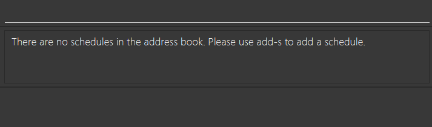

## Welcome to Tutor Connect

Tutor Connect is an address book made for **tuition centre managers** to easily track and schedule.

Here’s an overview of what you can do with Tutor Connect:
* Store and edit information about your tutors
* Create and plan your tutor availability and schedule
* View upcoming schedules

On top of these functionalities, we believe that tuition centre management must be efficient. Therefore, Tutor Connect is **optimised for users who can type fast** and utilise the Command Line Interface (CLI) to complete tasks using the keyboard faster than using the mouse.

* Table of Contents
  {:toc}

--------------------------------------------------------------------------------------------------------------------

## Common Notation

**:bulb: Tip** 

`Tips` are used to provide helpful advice, suggestions, or best practices to enhance your experience by making a task easier or more efficient.

**:warning: Warning** 

`Warnings` are used to alert you about potential issues, errors, or risks associated with a task or action. They are essential for preventing mistakes and ensuring safety.

**:information_source: Information** 

`Information` sections provide additional background knowledge or context to help you understand a topic better.

--------------------------------------------------------------------------------------------------------------------

## Quick Start

1. Ensure you have Java `11` installed in your Computer. To verify, perform the following steps:
    1. Open a terminal. Refer to the following guides on how:
        1. [MacOS](https://support.apple.com/en-sg/guide/terminal/apd5265185d-f365-44cb-8b09-71a064a42125/mac#:~:text=Terminal%20for%20me-,Open%20Terminal,%2C%20then%20double%2Dclick%20Terminal)
        2. [Windows](https://www.howtogeek.com/235101/10-ways-to-open-the-command-prompt-in-windows-10/#:~:text=anywhere%20you%20like.-,Open%20Command%20Prompt%20from%20the%20Run%20Box,open%20an%20administrator%20Command%20Prompt)
    2. Type `java -version` and press Enter.
    3. If it says a version other than 11 or `command not found`, please install Java 11 by following this [guide](https://www.java.com/en/download/help/download_options.html).

2. Download the latest jar file (tutorconnect.jar) from our [Github Releases](https://github.com/AY2324S1-CS2103T-T17-3/tp/releases).

3. Move the jar file into a new folder called “Tutor Connect”.

4. Double-click the jar file to launch the application.

    

   **:information_source: Mac Users** 

   If you are a Mac user, you may encounter a warning that says
   the jar file cannot be opened because it is from an unidentified developer. To continue:

    1. Right-click on the jar file and select `Open With > JavaLauncher (default)`
    2. Press Open when prompted

   

5. Refer to the [Features](#features) below for details of each command.

--------------------------------------------------------------------------------------------------------------------

## Features

**:information_source: Command Format:** 

* Words in `UPPER_CASE` are the parameters to be supplied by the user. 
  e.g. in `add n/NAME`, `NAME` is a parameter which can be used as `add n/John Doe`.
* Items in square brackets are optional. 
  e.g `n/NAME [t/TAG]` can be used as `n/John Doe t/friend` or as `n/John Doe`.
* Items with `…`​ after them can be used multiple times including zero times. 
  e.g. `[t/TAG]…​` can be used as ` ` (i.e. 0 times), `t/friend`, `t/friend t/family` etc.
* Parameters can be in any order. 
  e.g. if the command specifies `n/NAME p/PHONE_NUMBER`, `p/PHONE_NUMBER n/NAME` is also acceptable.
* Extraneous parameters for commands that do not take in parameters (such as `help`, `list`, `exit` and `clear`)
  will be ignored. 
  e.g. if the command specifies `help 123`, it will be interpreted as `help`.
* If you are using a PDF version of this document, be careful when copying and pasting commands that span multiple  
  lines as space characters surrounding line-breaks may be omitted when copied over to the application.

### Adding a tutor: `add-t`

Adds a tutor to the address book.

Format: `add-t n/NAME p/PHONE NUMBER e/EMAIL`

Example:
* `add-t n/John Doe p/98765432 e/johnd@example.com`
* `add-t n/Betsy Crowe p/91234567 e/betsycrowe@example.com`

Acceptable values for each parameter:
* `NAME`: Only string input accepted
* `PHONE`: NUMBER Only numerical input
* `EMAIL`: Only valid email addresses

Expected output:
* `New tutor John Doe 98765432 johnd@example.com has been added.`

Error messages:
* `Missing parameter: n/`: The tag n/ is missing or tutor’s name is missing.
* `Missing parameter: p/`: The tag p/ is missing or tutor’s phone number is missing.
* `Missing parameter: e/`: The tag e/ is missing or tutor’s email is missing.
* `Wrong input: n/`: The name entered is not a valid string.
* `Wrong input: p/`: The phone number entered does not consist of numbers only.
* `Wrong input: e/`: The email entered is invalid.

### Listing all tutors: `list-t`

Displays a list of all tutors in the address book in a table format.

**Format**: `list-t`

**Example**:
* `list-t`

**Acceptable values for each parameter**:
* No acceptable values as list-t has no parameters

**Expected Output**:
* Displays a table of tutors with columns for Name, Phone Number, and Email like 
  the [image](#listing-all-tutors--list-t) above
* If there are no tutors in the address book, displays a message telling the user
  to add a tutor with add-t: `There are no tutors in the address book. Please use /add-t to add a tutor.`

**Error messages**:
* No error messages as this command ignores extra parameters.

### Deleting a tutor: `delete-t`

Deletes a tutor in the address book based on their index number in the table.

**Format**: `delete-t TUTOR_INDEX`

**Examples**:
* `delete-t 5` deletes the tutor that is indexed as 5 in the address book.
* `list` followed by `delete-t 2` deletes the 2nd person in the address book.

**Acceptable values for each parameter**:
* `TUTOR_INDEX`: Only accepts numerical value

**Expected output**:
* `Tutor has been deleted: Alex Yeoh; Phone: 87438807; 
  Email: alexyeoh@example.com; Address: Blk 30 Geylang Street 29, #06-40`

**Error messages**:
* `Index number given is out of range`: Given index is out of range.
* `Invalid parameter given`: Parameter given is not a numerical value.

### Adding a schedule: `add-s`

Adds a schedule to a specified tutor.

**Format**: `add-s ti/TUTOR_INDEX s/START_TIME e/END_TIME`

**Examples**:
* `add-s ti/1 s/2023-09-15T09:00:00 e/2023-09-15T11:00:00`
* `add-s ti/2 s/2023-09-16T17:00:00 e/2023-09-16T19:00:00`

**Acceptable values for each parameter**:
* `TUTOR_INDEX`: Only number input accepted, starting from 1 to the last tutor index shown in the list of tutors.
* `START_TIME`: Only datetime in `yyyy-MM-ddTHH:mm:ss` format is accepted
* `END_TIME`: Only datetime in `yyyy-MM-ddTHH:mm:ss` format is accepted

    

  **:information_source: Information** 

    * `yyyy` represents the **year** (e.g., 2023).
    * `MM` represents the **month** with a leading zero (e.g., 09 for September, 10 for October).
    * `dd` represents the **day** of the month with a leading zero (e.g., 03, 15).
    * `T` is a **separator** indicating the start of the time portion.
    * `HH` represents the **hour** in **24-hour format** with a leading zero (e.g., 09 for 9 AM, 21 for 9 PM).
    * `mm` represents the **minutes** with a leading zero (e.g., 05).
    * `ss` represents the **seconds** with a leading zero (e.g., 05).

    

**Expected output**:
* `New schedule John Doe starting from Sep 15 2023 09:00 to Sep 15  2023 11:00 has been added.`

**Error messages**:
* `Missing parameter: ti/`: The tag ti/ is missing or tutor’s index is missing.
* `Missing parameter: s/`: The tag s/ is missing or schedule’s start time is missing.
* `Missing parameter: e/`: The tag e/ is missing or the schedule’s end time is missing.
* `Wrong input: ti/`: The tutor index entered is not a valid number.
* `Index number given is out of range`: Given index is out of range.
* `Wrong input: s/`: The start time entered is not in datetime format.
* `Wrong input: e/`: The end time entered is not in datetime format..

### List all schedules: `list-s`

Displays a list of all schedules in the address book in a table format.

**Format:** `list-s`

**Example:**
* `list-s` shows all recorded schedules in the address book.

**Expected output:**
* Displays a table of schedules with columns for List number, Tutor Name, Start Time, and End Time
* If there are no schedules in the address book, displays a message telling the user to add a tutor with `add-s`.

**:warning: Warning** 

Note that any additional parameters introduced after `list-s` will be ignored.

### Deleting a schedule: `delete-s`

Deletes a schedule in the address book based on their index number in the table of schedules listed.

**Format:** `delete-s SCHEDULE_INDEX`

**Example:**
* `delele-s 5` deletes the schedule that is indexed as 5 in the schedule list.
* `list` followed by `delete-s 2` deletes the 2nd schedule in the schedule list.

**Acceptable values for each parameter:**
* `SCHEDULE_INDEX`: NUMBER Only numerical input that ranges from 1 to the last schedule shown in the list of schedules

**Expected output:**
* `Schedule has been deleted: Tutor: John Doe; Start date: Sep 15, 2023 09:00; End date: Sep 15, 2023 11:00;`

**Error messages:**
* `Index number given is out of range`: Given index is out of range.
* `Invalid value in parameter SCHEDULE_INDEX`: Parameter given is not a numerical value.
* `Missing parameter SCHEDULE_INDEX`: A numerical value is not provided when calling the command `delete-s`.

_More details coming soon ..._

--------------------------------------------------------------------------------------------------------------------

## FAQ

**Q**: How do I transfer my data to another Computer? 
**A**: Install the app in the other computer and overwrite the empty data file it creates with the file that contains the data of your previous AddressBook home folder.

--------------------------------------------------------------------------------------------------------------------

## Known issues

1. **When using multiple screens**, if you move the application to a secondary screen, and later switch to using only the primary screen, the GUI will open off-screen. The remedy is to delete the `preferences.json` file created by the application before running the application again.

--------------------------------------------------------------------------------------------------------------------

## Command summary
| Action              | Format, Examples                                                                                                            |
|---------------------|-----------------------------------------------------------------------------------------------------------------------------|
| **Add Tutor**       | `add-t n/NAME p/PHONE NUMBER e/EMAIL`   e.g., `add-t n/John Doe p/98765432 e/johnd@example.com`                          |
| **List Tutor**      | `list-t`                                                                                                                    |
| **Delete Tutor**    | `delete-t TUTOR_INDEX`  e.g., `delete-t 3`                                                                               |
| **Add Schedule**    | `add-s ti/TUTOR_INDEX s/START_TIME e/END_TIME`   e.g., `add-s ti/1 s/2023-09-15T09:00:00 e/2023-09-15T11:00:00`          |
| **List Schedule**   | `list-s`                                                                                                                    |
| **Delete Schedule** | `delete-s INDEX_NO`  e.g., `delete-s 3`                                                                                  |
| **Clear**           | `clear`                                                                                                                     |
| **Edit**            | `edit INDEX [n/NAME] [p/PHONE_NUMBER] [e/EMAIL] [a/ADDRESS] [t/TAG]…​`  e.g.,`edit 2 n/James Lee e/jameslee@example.com` |
| **Find**            | `find KEYWORD [MORE_KEYWORDS]`  e.g., `find James Jake`                                                                  |
