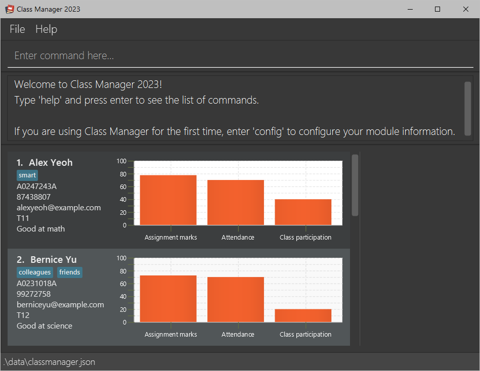

# Class Manager 2023 User Guide

Class Manager 2023 (CM 23) is a **desktop app for managing your students' contacts in the class,
optimized for use via a Command Line Interface** (CLI) while still having the benefits of a
Graphical User Interface (GUI). If you can type fast, CM 23 can get your contact
management tasks done faster than traditional GUI apps.

<!-- * Table of Contents -->
<page-nav-print />

--------------------------------------------------------------------------------------------------------------------

## Quick start

1. Ensure you have Java `11` or above installed in your Computer.

2. Download the latest `class-manager-2023.jar` from [here](https://github.com/AY2324S1-CS2103T-T11-1/tp/releases).

3. Copy the file to the folder you want to use as the _home folder_ for your ClassManager.

4. Open a command terminal, `cd` into the folder you put the jar file in, and use the `java -jar class-manager-2023.jar` command to run the application.
   Note the app contains some sample data. 

5. Type the command in the command box and press Enter to execute it. e.g. typing **`help`** and pressing Enter will open the help window. 
   Some example commands you can try:

   * `list` : Lists all student details.

   * `add n/John Doe p/98765432 e/johnd@example.com s/A0245234A c/T11` : Adds a student named `John Doe` to the Class Manager.

   * `delete s/A0245234A` : Deletes the student with student number A0245234A, which is added in the previous step.

   * `exit` : Exits the app.

6. To begin using Class Manager, configure Class Manager with your module information using the `config` command. For example:
   * `config #t/10 #a/1` configures Class Manager to have 10 tutorials and 1 assignment.

7. That's it! You can now explore Class Manager! Refer to the [Commands](#commands) below for details of each command.  
   You can also refer to the [Command Summary](#command-summary-in-alphabetical-order).

--------------------------------------------------------------------------------------------------------------------

## GUI Overview

  

The **GUI** is split up into 4 main sections.

1. **Command Box** - (_Located at the top with the text "Enter command here..."_) This is where you can type in commands to execute.
2. **Result Display** - (_Located below command box_) This is where the results of the commands and any errors will be displayed.
3. **Student List** - (_Located on the bottom left_) This is where the list of students will be displayed.
4. **Student Details** - (_Located on the bottom right_) This is where the details of the selected student will be displayed.

--------------------------------------------------------------------------------------------------------------------

## Features

<box type="info" seamless>

**Notes about the command format:** 

* Words in `UPPER_CASE` are the parameters to be supplied by the user. 
  e.g. in `add n/NAME`, `NAME` is a parameter which can be used as `add n/John Doe`.

* Items in square brackets are optional. 
  e.g. `n/NAME [t/TAG]` can be used as `n/John Doe t/friend` or as `n/John Doe`.

* Items with `…`​ after them can be used multiple times including zero times. 
  e.g. `[t/TAG]…​` can be used as ` ` (i.e. 0 times), `t/friend`, `t/friend t/family` etc.

* Parameters can be in any order. 
  e.g. if the command specifies `n/NAME c/CLASS_NUMBER`, `c/CLASS_NUMBER n/NAME` is also acceptable.

* Extraneous parameters for commands that **do not** take in parameters (such as `help`, `list`, `exit` and `clear`) will be ignored. 
  e.g. if the command specifies `help 123`, it will be interpreted as `help`.

* Extraneous parameters for commands that **do** take in parameters will be considered as invalid.  
  e.g. if the command specifies `delete 123 s/A0249112A` or `delete s/A0249112A c/t11`, it will be considered as invalid.  
  Please **<u>refrain</u>** from using prefixes as input under another prefix.

* If you are using a PDF version of this document, be careful when copying and pasting commands that span multiple lines as space characters surrounding line-breaks may be omitted when copied over to the application.
</box>

### Class Number

* Class Number refers to the tutorial class number of a particular course. 
* Class Number is not case-sensitive, and it must begin with 1 to 3 alphabet letters, followed by 1 to 5 digits, and end with an optional single alphabetical character. Class Number must not be blank.
* Here are some valid examples of Class Number:
    - `G11`
    - `T11A`
    - `SG10`
    - `ABC12345D`

### Student Number

* Student Number refers to the unique matriculation number of a NUS student. In Class Manager, it must begin with the letter 'A' or 'a', followed by 1 or more digits, and end with a single alphabetical character. Student Number must not be blank as well.
* Class Manager uses the Student Number to uniquely identify each student in most commands. The Student Number is not case-sensitive. e.g. Student Number `A123V` and `A123v` refers to the same student.

### Command navigation

* Class Manager allows you to navigate to previously entered commands using the arrow keys. Navigate to earlier commands using the **up arrow** key, and later commands using the **down arrow** key.

--------------------------------------------------------------------------------------------------------------------

## Commands

### Configuring Class Manager : `config`

<box type="warning" seamless>

**Caution:**
Configuring Class Manager resets the class details (grades, attendance and class participation details) of all students, as well as the past states of Class Manager. This **cannot** be undone using the `undo` command. It is recommended to configure Class Manager before adding students.
</box>

Before you begin using Class Manager, it is recommended that you configure the number of tutorials and assignments that your module has. This can be done using the `config` command, and allows Class Manager to automatically generate the correct number of class details fields for each student.   
Class Manager can be configured _at any time_, but do take note of the warning above regarding **loss** of student data and past Class Manager states. If you configure Class Manager after adding students, each student will have the correct number of tutorials and assignments. However, their class details data will be **reset** and there will be no previous states of Class Manager you can return to via the `undo` command.

Format: `config #t/TUTORIAL_COUNT #a/ASSIGNMENT_COUNT`

* `TUTORIAL_COUNT` and `ASSIGNMENT_COUNT` must be a positive integer between 1 and 40 inclusive.
* Inputting the same `TUTORIAL_COUNT` or `ASSIGNMENT_COUNT` as the previous configuration will also **reset** the class details of all students.

Examples:
* `config #t/13 #a/1`
* `config #a/4 #t/39`

---

### Viewing help : `help`

Opens the help window that shows a summary of all commands and its parameters, with a `Copy URL` button that provides access to this help page.

Format: `help`

---

### Adding a student : `add`

Adds a student to Class Manager.

Format: `add n/NAME p/PHONE e/EMAIL s/STUDENT_NUMBER c/CLASS_NUMBER [t/TAG]…​`

* **ALL** the fields must be provided.
* The `NAME` field is case-sensitive.
* `STUDENT_NUMBER` needs to be unique, and must not be blank.
* The class details of a student will be automatically populated to be 0 for all fields during the creation of a student.
* Comment for a student can only be added after the student is instantiated.

<box type="tip" seamless>

**Tip:** A student can have any number of tags (including 0)
</box>

Examples:
* `add n/John Doe p/98765432 e/johnd@example.com s/A0245234A c/T11 t/friends t/owesMoney`
* `add n/John Doe p/98765432 e/johnd@example.com s/A0245234A c/T11`

---
### Listing all student details : `list`

Shows a list of all students in Class Manager.

Format: `list`

---

### Editing a student : `edit`

Edits an existing student in Class Manager.

Format: `edit STUDENT_NUMBER [n/NAME] [p/PHONE_NUMBER] [e/EMAIL] [s/NEW_STUDENT_NUMBER] [c/CLASS_NUMBER]`

<box type="warning" seamless>

**Caution:**
The student number entered __without__ the `s/` prefix will be the **old** student number.
</box>

* Edits the student with the student number `STUDENT_NUMBER`.
* The `STUDENT_NUMBER` must be valid and exist.
* At least one of the optional fields must be provided.
* Existing values will be updated to the input values.
* The `NEW_STUDENT_NUMBER` must be valid and unique (does not exist in Class Manager).

Examples:
*  `edit A0245234A p/91234567 e/johndoe@example.com` Edits the phone number and email address of the student with `STUDENT_NUMBER` A0245234A to be `91234567` and `johndoe@example.com` respectively.
*  `edit A0223344A n/Betsy Crower` Edits the name of the student with `STUDENT_NUMBER` A0223344A to be `Betsy Crower`.

---

### Tagging a student : `tag`

Tags the existing student in Class Manager.

Format: `tag s/STUDENT_NUMBER [/add] [/delete] t/[TAG]…​`

* Tags the student with the specified `STUDENT_NUMBER`.
* When editing tags without `/add` or `/delete`, the existing tags of the student will be overwritten.
* You can remove all the student’s tags by typing `t/` without specifying any tags after it.

Examples:
* `tag s/A1234567N t/smart t/shy t/funny` replace all tags of the specified student with smart, shy and funny.
* `tag s/A1234567N /add t/Java` adds the Java tag to specified student.
* `tag s/A1234567N /delete t/shy` removes the shy tag from the specified student.
* `tag s/A1234567N t/` clear all tags from the specified student.

---

### Adding comment to a student : `comment`

Adds a comment to an existing student in Class Manager.

Format: `comment s/STUDENT_NUMBER cm/COMMENT`

* The `STUDENT_NUMBER` must be valid and exist.
* The `COMMENT` must be a valid string.
  * Take note that the `COMMENT` string must not include any prefix. 
  * e.g. `comment s/A0249112A cm/This student is very hardworking. t/Hardworking` is not allowed.
  * This means comment such as "This student is very hardworking. t/Hardworking" is not allowed.
* Comment can only be performed after the student is created.
* Edit commands will not impact the comment tagged to the student.
* Comment can be deleted by using an empty string as the comment.

Examples:
* `comment s/A0249112A cm/This student is very hardworking.`
* `comment s/A0249112A cm/This student is very hardworking and smart.`
* `comment s/A0249112A cm/` (_This deletes the comment_)

---

### Lookup students : `lookup`

Search and display students satisfying all given fields (Only one keyword needs to match per field).

Format: `lookup [c/CLASS_NUMBER] [n/NAME] [p/PHONE_NUMBER] [e/EMAIL] [s/STUDENT_NUMBER] [t/TAG]`

<box type="warning" seamless>

**Caution:**
_At least one_ of the optional fields must be provided. `lookup` alone is not allowed.  
This command will not check for field validation. e.g. `lookup c/class 11` is allowed even though `class 11` is not a valid class number.
</box>

* The command is **case-insensitive**. e.g. `hans` will match `Hans`
* Only **full words** will be matched e.g. `Han` will not match `Hans`
* The order of the fields does **not** matter. e.g. `lookup n/li c/T11` will return the same result as `lookup c/T11 n/li`
* Field with nothing will be ignored. e.g. `lookup n/ c/T11` will return the same result as `lookup c/T11`.
* This command can take multiple words per field. e.g. `lookup c/T11 T12` will return all students in `T11` or `T12`.
  * Complicated lookup can be done by combining multiple fields. e.g. `lookup n/alex david c/t11 t12` 
  will return all students with name `alex` or `david` **and** is in class `t11` or `t12`.

Examples:

* `lookup n/alex david` returns `Alex Yeoh`, `David Li` 
   
* `lookup c/t11` returns all students in class number T11 
   

---

### Marking tutorial attendance for a student as present : `present`

Marking tutorial attendance for an existing student as present in Class Manager.

Format: `present s/STUDENT_NUMBER tut/TUTORIAL_INDEX`

* The `STUDENT_NUMBER` must be valid and exist.
* The `TUTORIAL_INDEX` must be a valid positive integer, within the configured tutorial count given in the [**<u>`config`</u>**](#configuring-class-manager-config) command.

Examples:
* `present s/A0245234A tut/1`

---

### Marking tutorial attendance for all students displayed as present : `present-all`

Marking tutorial attendance for all students in the current list displayed as present in Class Manager.

Format: `present-all tut/TUTORIAL_INDEX`

* The `TUTORIAL_INDEX` must be a valid positive integer, within the configured tutorial count given in the [**<u>`config`</u>**](#configuring-class-manager-config) command.

Examples:
* `present-all tut/1`

---

### Marking tutorial attendance for a student as absent : `absent`

Marking tutorial attendance for an existing student as absent in Class Manager.

Format: `absent s/STUDENT_NUMBER tut/TUTORIAL_INDEX`

* The `STUDENT_NUMBER` must be valid and exist.
* The `TUTORIAL_INDEX` must be a valid positive integer, within the configured tutorial count given in the [**<u>`config`</u>**](#configuring-class-manager-config) command.

Examples:
* `absent s/A0245234A tut/1`

---

### Marking tutorial attendance for all students displayed as absent : `absent-all`

Marking tutorial attendance for all students in the current list displayed as absent in the class manager.

Format: `absent-all tut/TUTORIAL_INDEX`

* The `TUTORIAL_INDEX` must be a valid positive integer, within the configured tutorial count given in the [**<u>`config`</u>**](#configuring-class-manager-config) command.

Examples:
* `absent-all tut/1`

---

### Setting assignment grade for a student : `grade`

Setting an assignment grade for an existing student in Class Manager.

Format: `grade s/STUDENT_NUMBER a/ASSIGNMENT_INDEX g/GRADE`

* The `STUDENT_NUMBER` must be valid and exist.
* The `ASSIGNMENT_INDEX` must be a valid positive integer, within the configured assignment count given in the [**<u>`config`</u>**](#configuring-class-manager-config) command.
* The `GRADE` must be a valid integer between 0 and 100.

Examples:
* `grade s/A0249112A a/1 g/100`

---

### Record class participation for a student : `class-part`

Recording the class participation level for an existing student in Class Manager.

Format: `class-part s/STUDENT_NUMBER tut/TUTORIAL_INDEX part/PARTICIPATION_LEVEL`

* The `STUDENT_NUMBER` must be valid and exist.
* The `TUTORIAL_INDEX` must be a valid positive integer, within the configured tutorial count given in the [**<u>`config`</u>**](#configuring-class-manager-config) command.
* The `PARTICIPATION_LEVEL` must be either `true` or `false`.
  * The `true` value indicates that the student has participated in the tutorial, while the `false` value indicates that the student has not participated in the tutorial.
* The `PARTICIPATION_LEVEL` is case-insensitive.
* _**Coming soon**_, the `PARTICIPATION_LEVEL` will be replaced with various levels of participation.
  * The proposed levels includes: `none`, `sufficient`, `good`, `excellent`.

Examples:
* `class-part s/A0249112A tut/1 part/true`

---

### View a student's class details : `view`

View the class details of a student that will be displayed on the right side of the application.

Format: `view s/STUDENT_NUMBER`

* The STUDENT_NUMBER must be valid.
* The STUDENT_NUMBER must belong to a student in Class Manager.

Example:

* `view s/A0245234A`

---

### Selecting students randomly : `random`

Select a specific number of students from all students displayed in Class Manager.

Format: `random NUMBER_OF_STUDENTS`

* The `NUMBER_OF_STUDENTS` must be a valid positive integer, smaller than or equal to the number of current students displayed in the class manager.

Example:

* `random 2`

### Deleting a student : `delete`

Deletes the specific student.

Format: `delete s/STUDENT_NUMBER`

* The `STUDENT_NUMBER` must be valid and exist.

Example:
* `delete s/A0249112A`

--- 

### Undoing the previous command : `undo`

Undo the previous command that changes Class Manager. Undo only works with commands that changes Class Manager, and does not work with commands such as `load` and `config`. Undo can be used multiple times to undo multiple commands, or until Class Manager reaches its initial state. 

Format: `undo`

Here is the list of commands that can be undone/redone:
* `add`
* `class-part`
* `clear`
* `comment`
* `delete`
* `edit`
* `grade`
* `present`
* `absent`
* `present-all`
* `absent-all`
* `tag`
* `view`

Displayed result if undo is successful: `Undo success!`

Displayed result if there are no more commands to undo: `No more commands to undo!`

--- 

### Redoing an undone command : `redo`

Redo a previously undone command that changes Class Manager. Redo only works with commands that can be undone. Redo can be used multiple times to redo multiple commands, or until Class Manager reaches its most recent state.

Format: `redo`

Here is the list of commands that can be redone after they are undone (same list as undo):
* `add`
* `class-part`
* `clear`
* `comment`
* `delete`
* `edit`
* `grade`
* `present`
* `absent`
* `present-all`
* `absent-all`
* `tag`
* `view`

Displayed result if redo is successful: `Redo success!`

Displayed result if there are no more commands to redo: `No more commands to redo!`

---

### Viewing command history : `history`

Shows a list of all previously entered inputs in the result display box, with the most recent inputs at the top of the list.

Format: `history`

---

### Clearing all entries : `clear`

Clears all entries from the class manager.

Format: `clear`

---

### Exiting the application : `exit`

Exits the application.

Format: `exit`

---

### Saving the data

Class Manager 2023 data is saved in the hard disk automatically after any command that changes the data. There is no need to save manually.

---

### Editing the data file

Class Manager 2023 data is saved automatically as a JSON file `[JAR file location]/data/classmanager.json`. Advanced users are welcome to update data directly by editing that data file. You can refer to a valid sample of the JSON file in the image below.

   

<box type="warning" seamless>

**Caution:**
If your changes to the data file make its format invalid, Class Manager 2023 will discard all data and start with an empty data file at the next run.  Hence, it is recommended to take a backup of the file before editing it.
</box>

---
### Loading the data file : `load`

Load student information from an existing JSON file. Copy the JSON file to be loaded into the data folder. The data in the JSON file will be loaded into the app. The file also becomes the new default save file.

Format: `load f/FILE_NAME`
* File name does not need to include .json extension.
* File name is case-insensitive

Example:
* `load f/sample` loads the sample.json file in the data folder.

   

---

### Toggling color themes : `theme`

Toggles between light and dark color themes.

Format: `theme`
##### Dark theme
   

##### Light theme

---

--------------------------------------------------------------------------------------------------------------------

## FAQ

**Q**: How do I transfer my data to another Computer? 
**A**: Install the app in the other computer and overwrite the empty data file it creates with the file that contains the data of your previous Class Manager 2023 home folder.

--------------------------------------------------------------------------------------------------------------------

## Known issues

1. **When using multiple screens**, if you move the application to a secondary screen, and later switch to using only the primary screen, the GUI will open off-screen. The remedy is to delete the `preferences.json` file created by the application before running the application again.

--------------------------------------------------------------------------------------------------------------------

## Command summary (in alphabetical order)

### Useful commands
| Action                                                           | Format, Examples                                                            |
|------------------------------------------------------------------|-----------------------------------------------------------------------------|
| [**Configure Class Manager**](#configuring-class-manager-config) | `config #t/TUTORIAL_COUNT #a/ASSIGNMENT_COUNT`  e.g. `config #t/10 #a/3` |
| [**Open help window**](#viewing-help-help)                       | `help`                                                                      |

### Core commands without parameters
| Action                                                       | Format, Examples |
|--------------------------------------------------------------|------------------|
| [**Clear student list**](#clearing-all-entries-clear)        | `clear`          |
| [**Exit Class Manager**](#exiting-the-application-exit)      | `exit`           |
| [**View command history**](#viewing-command-history-history) | `history`        |
| [**List all students**](#listing-all-student-details-list)   | `list`           |
| [**Toggle theme**](#toggling-color-themes-theme)             | `theme`          |

### Core commands with parameters
| Action                                                                                            | Format, Examples                                                                                                                                                    |
|---------------------------------------------------------------------------------------------------|---------------------------------------------------------------------------------------------------------------------------------------------------------------------|
| [**Add**](#adding-a-student-add)                                                                  | `add n/NAME p/PHONE_NUMBER e/EMAIL c/CLASS_NUMBER s/STUDENT_NUMBER [t/TAG]…​`   e.g `add n/James Ho p/22224444 e/jamesho@example.com s/A0245234A c/T11 t/friend` |
| [**Comment**](#adding-comment-to-a-student-comment)                                               | `comment s/STUDENT_NUMBER cm/COMMENT`   e.g. `comment s/A0249112A cm/This student is very hardworking.`                                                          |
| [**Delete**](#deleting-a-student-delete)                                                          | `delete s/STUDENT_NUMBER`  e.g. `delete s/A0249112A`                                                                                                             |
| [**Edit**](#editing-a-student-edit)                                                               | `edit STUDENT_NUMBER [n/NAME] [p/PHONE_NUMBER] [e/EMAIL] [s/NEW_STUDENT_NUMBER] [c/CLASS_NUMBER]`  e.g.`edit A0245234A n/John Bob p/98761234 e/johnd@exp.com`    |
| [**Lookup**](#lookup-students-lookup)                                                             | `lookup [c/CLASS_NUMBER] [n/NAME] [p/PHONE_NUMBER] [e/EMAIL] [s/STUDENT_NUMBER] [t/TAG]`   e.g. `lookup c/T11`                                                   |
| [**Load**](#loading-the-data-file-load)                                                           | `load f/FILE_NAME`  e.g. `load f/sample`                                                                                                                         |
| [**Present**](#marking-tutorial-attendance-for-a-student-as-present-present)                      | `present s/STUDENT_NUMBER tut/TUTORIAL_INDEX`   e.g. `present s/A0245234A tut/1`                                                                                 |
| [**Absent**](#marking-tutorial-attendance-for-a-student-as-absent-absent)                         | `absent s/STUDENT_NUMBER tut/TUTORIAL_INDEX`   e.g. `absent s/A0245234A tut/1`                                                                                   |
| [**Present All**](#marking-tutorial-attendance-for-all-students-displayed-as-present-present-all) | `present-all tut/TUTORIAL_INDEX`   e.g. `present-all tut/1`                                                                                                      |
| [**Absent All**](#marking-tutorial-attendance-for-all-students-displayed-as-absent-absent-all)    | `absent-all tut/TUTORIAL_INDEX`   e.g. `absent-all tut/1`                                                                                                        |
| [**Random**](#selecting-students-randomly-random)                                                 | `random NUMBER_OF_STUDENTS`   e.g. `random 2`                                                                                                                    |
| [**Record Class Participation**](#record-class-participation-for-a-student-class-part)            | `class-part s/STUDENT_NUMBER tut/TUTORIAL_INDEX part/PARTICIPATION_LEVEL`   e.g. `class-part s/A0245234A tut/1 part/true`                                        |
| [**Set Assignment Grade**](#setting-assignment-grade-for-a-student-grade)                         | `grade s/STUDENT_NUMBER a/ASSIGNMENT_INDEX g/GRADE`   e.g. `grade s/A0245234A a/1 g/100`                                                                         |
| [**Tag**](#tagging-a-student-tag)                                                                 | `tag s/STUDENT_NUMBER [/add] [/delete] t/[TAG]…​`   e.g. `tag s/A0123456N t/smart t/shy`                                                                         |
| [**View**](#view-a-student-s-class-details-view)                                                  | `view s/STUDENT_NUMBER`   e.g. `view s/A0245234A`                                                                                                                |

--------------------------------------------------------------------------------------------------------------------

## Glossary

* **cd**: Change directory command in terminal/command line. cd takes the name of the folder you want to navigate to as an argument. The full command is cd `your-directory`.
* **Student Number**: Matriculation number of NUS student. In Class Manager, it must begin with the capital 'A', followed by 1 or more digits, and end with a single alphabetical character. Student Number must not be blank as well.
* **Email**: Any valid electronic mail address, such as NUS email address (eXXXXXXX@u.nus.edu).
* **CLI**: Command Line Interface.
* **GUI**: Graphical User Interface.
* **JSON**: JavaScript Object Notation, a lightweight data-interchange format.
* **JAR**: Java Archive, a package file format typically used to aggregate many Java class files and associated metadata and resources (text, images, etc.) into one file to distribute application software or libraries on the Java platform.
* **Class details**: The grades, attendance and class participation details of a student in Class Manager.
