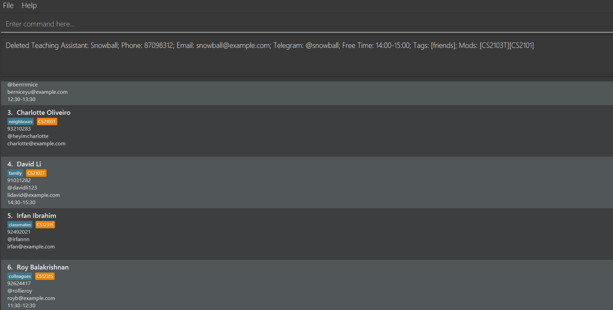

Teaching Assistant Manager (TAManager) is a desktop application for managing teaching assistants, optimized for use via a Command Line Interface (CLI) while still having the benefits of a Graphical User Interface (GUI). If you can type fast, TAM can help you manage your teaching assistant tasks more efficiently than traditional GUI apps.

* Table of Contents
{:toc}

---

## Quick Start

1. Ensure you have Java `11` or above installed on your computer.

2. Download the latest `TAManager.jar` from [here](https://github.com/AY2324S1-CS2103T-T10-1/tp/releases).

3. Copy the file to the folder you want to use as the home folder for your Teaching Assistant Manager.

4. Open a command terminal, `cd` into the folder where you placed the jar file, and use the `java -jar TAManager.jar` command to run the application.
   A GUI similar to the one below should appear in a few seconds. Note how the app contains some sample data.
   

5. Type the command in the command box and press Enter to execute it. For example, typing `help` and pressing Enter will open the help window.
   Here are some example commands you can try:

   - `list`: Lists all teaching assistants.
   - `add n/Snowball p/98765432 e/snowball@example.com tele/@snowball from/10:00 to/12:00 t/fulltime m/CS1231S h/10`: Adds a teaching assistant named Snowball to the list.
   - `delete 3`: Deletes the 3rd teaching assistant shown in the current list.
   - `clear`: Deletes all teaching assistants.
   - `exit`: Exits the app.

6. Refer to the [Features](#features) section below for details on each command.

--------------------------------------------------------------------------------------------------------------------

## Features

<div markdown="block" class="alert alert-info">

**:information_source: Notes about the command format:**<br>

* Words in `UPPER_CASE` are the parameters to be supplied by the user.<br>
  e.g. in `add n/NAME`, `NAME` is a parameter which can be used as `add n/John Doe`.

* Items in square brackets are optional.<br>
  e.g `n/NAME [t/TAG]` can be used as `n/John Doe t/friend` or as `n/John Doe`.

* Items with `…`​ after them can be used multiple times including zero times.<br>
  e.g. `[t/TAG]…​` can be used as ` ` (i.e. 0 times), `t/friend`, `t/friend t/family` etc.

* Parameters can be in any order.<br>
  e.g. if the command specifies `n/NAME p/PHONE_NUMBER`, `p/PHONE_NUMBER n/NAME` is also acceptable.

* Extraneous parameters for commands that do not take in parameters (such as `help`, `list`, `exit` and `clear`) will be ignored.<br>
  e.g. if the command specifies `help 123`, it will be interpreted as `help`.

* If you are using a PDF version of this document, be careful when copying and pasting commands that span multiple lines as space characters surrounding line-breaks may be omitted when copied over to the application.
</div>

### Viewing help : `help`

Shows a message explaning how to access the help page.


Format: `help`


### Adding a Teaching Assistant: `add`

Adds a new teaching assistant to the address book.


Format: `add n/NAME p/PHONE e/EMAIL tele/TELEGRAM [from/FROM to/TO] [t/TAG]... [m/MOD]... h/HOUR`

- `NAME` should be a string.
- `PHONE` should be an 8-digit integer.
- `EMAIL` should contain "@".
- `COURSE_OF_STUDY` should be a string.
- `YEAR` should be an integer.
- `FROM` should be a time in "HH:SS" format
- `TO` should be a time in "HH:SS" format
- `TAG` should be a alphanumeric string without spaces.
- `MODULE_CODE` should start with 2-3 alphabets, followed by 4 numbers, and optionally end with an alphabet.
- `HOUR` should be an integer

Examples:
- `add n/Snowball p/98765432 e/snowball@example.com tele/@snowball from/10:00 to/12:00 t/fulltime m/CS1231S h/10`

When the command succeeds:

```
New teaching assistant added: Snowball; Phone: 98765432; Email: snowball@example.com; Telegram: @snowball;
Free Time: 10:00-12:00; Tags: [fulltime]; Mods: [CS1231S]; Work Hour: 10
```

When the command fails:

- Incorrect format (e.g., missing information): `Invalid command format!`
- Duplicate input (the TA is already in the address book): `This TA has been registered.`
- Invalid invalid module code: `Mod codes should have 2-3 alphabets, followed by 4 digits,
and optionally ending with an alphabet.`
- Invalid free time: `TA's free time should have a start and end time in HH:mm format`
- Invalid work hour: `Hour should only be positive integers and should be less than 9999`

### Removing a Teaching Assistant: `delete`

Removes the specified teaching assistant from the address book.



Format: `delete INDEX`

- Deletes the teaching assistant at the specified `INDEX`.
- The index refers to the index number shown in the displayed TA list.
- The index must be a positive integer (1, 2, 3, ...).

Examples:

- `list` followed by `delete 2` deletes the 2nd teaching assistant in the address book.
- `find Betsy` followed by `delete 1` deletes the 1st teaching assistant in the results of the `find` command.

When the command succeeds:

```
Deleted Teaching Assistant: Snowball; Phone: 98765432; Email: snowball@example.com; Telegram: @snowball; Free Time: 10:00-12:00; Tags: [fulltime]; Mods: [CS1231S]; Work Hour: 10
```

When the command fails:

- Incorrect format (missing index or index is not a positive integer): `Invalid command format!`
- Index does not correspond to a TA: For example, there are only 5 TAs but the user tried to delete a TA at index 6
  
  `The person index provided is invalid`

### Viewing Teaching Assistants: `list`

Displays a list of all teaching assistants in the address book.

Format: `list`

Example: `list`

When the command succeeds:

```
Here is a list of TAs:

Snowball; Phone: 87098312; Email: snowball@example.com; Course of study: Computer Science; Year of Study: 2;

Snowflake; Phone: 83124113; Email: snowflake@example.com; Course of study: Computer Science; Year of Study: 2;

Snowman; Phone: 83172153; Email: snowman@example.com; Course of study: Computer Science; Year of Study: 2;
```

### Clearing all entries : `clear`

Clears all entries from the address book.

Format: `clear`

### Exiting the program : `exit`

Exits the program.

Format: `exit`

### Saving the data

AddressBook data are saved in the hard disk automatically after any command that changes the data. There is no need to save manually.

### Editing the data file

AddressBook data are saved automatically as a JSON file `[JAR file location]/data/addressbook.json`. Advanced users are welcome to update data directly by editing that data file.

<div markdown="span" class="alert alert-warning">:exclamation: **Caution:**
If your changes to the data file makes its format invalid, AddressBook will discard all data and start with an empty data file at the next run. Hence, it is recommended to take a backup of the file before editing it.
</div>

--------------------------------------------------------------------------------------------------------------------

## FAQ

**Q**: How do I transfer my data to another Computer?<br>
**A**: Install the app in the other computer and overwrite the empty data file it creates with the file that contains the data of your previous TAManager home folder.

--------------------------------------------------------------------------------------------------------------------

## Known issues

1. **When using multiple screens**, if you move the application to a secondary screen, and later switch to using only the primary screen, the GUI will open off-screen. The remedy is to delete the `preferences.json` file created by the application before running the application again.

--------------------------------------------------------------------------------------------------------------------

## Command summary

Action | Format, Examples
--------|------------------
**Add** | `add n/NAME p/PHONE e/EMAIL tele/TELEGRAM [from/FROM to/TO] [t/TAG]... [m/MOD]... h/HOUR` <br> e.g., `add n/Snowball p/98765432 e/snowball@example.com tele/@snowball from/10:00 to/12:00 t/fulltime m/CS1231S h/10`
**Clear** | `clear`
**Delete** | `delete INDEX`<br> e.g., `delete 3`
**List** | `list`
**Help** | `help`
