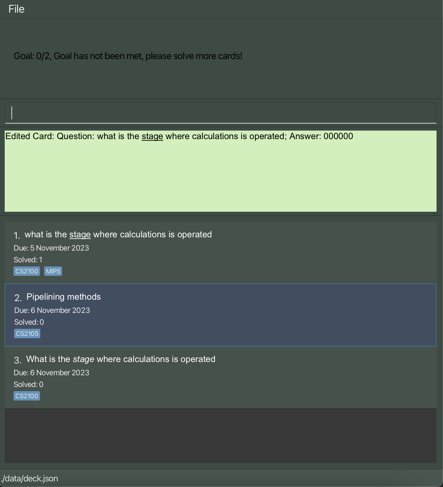

# Welcome to lesSON

***Revolutionise your studying experience with lesSON!***

lesSON is a **desktop application** aimed to help NUS Computer Science undergraduates make flashcards to aid with
their memory work for school content.<br>
Here are some benefits of adopting lesSON in your studying experience:
- Create and Edit flashcards about key concepts taught in your courses
- Take advantage of inbuilt **Spaced Repetition** to improve memory retention
- Tag your flashcards based on their courses or topics to stay organised
- Customise your flashcards using our markdown feature

--------------------------------------------------------------------------------------------------------------------

# Table of Contents
1. [Installation](#installation)
2. [Quick start](#quick-start)
3. [Glossary](#glossary)
4. [User Interface Overview](#user-interface-overview)
5. [Tutorial](#tutorial)
6. [Feature list](#feature-list)
   - [Adding a FlashCard](#adding-a-flashcard-add)
   - [Deleting a Flashcard](#deleting-a-flashcard--delete)
   - [View All Flashcards](#view-all-flashcards--list)
   - [Editing a Specific Flashcard](#editing-a-specific-flashcard--edit)
   - [Practise Flashcards](#practise-flashcards-practise)
   - [Hints for Flashcards](#hints-for-flashcards-hint)
   - [Solve Flashcards](#solving-flashcards-solve)
   - [Setting Difficulty for Flashcards](#setting-difficulty-of-flashcards-set)
   - [Randomly Practise Flashcards](#randomly-practise-flashcards--random)
   - [Clear all Flashcards](#clear-all-flashcards-clear)
   - [Setting goals](#setting-goals-goal)
   - [Getting help](#getting-help-help)
7. [Additional Features](#additional-features)
   - [Markdown Syntax](#markdown-syntax)
   - [Importing and Exporting Decks](#importing-and-exporting-decks)
8. [FAQ](#frequently-asked-questions)

--------------------------------------------------------------------------------------------------------------------

# Installation

1. Make sure that you have [Java 11 or above](https://www.java.com/en/download/) installed on your computer.
2. Download the latest jar file from [here](https://github.com/AY2324S1-CS2103T-W17-4/tp/releases/tag/v1.3(trial)).
3. Move the jar file installed to a working folder you would store all of your flashcards
4. Launch lesson by doing the following:
   1. In the terminal or command prompt, use the `cd` command to navigate to the working folder.
   [Not sure how to use cd?](https://www.ibm.com/docs/en/aix/7.2?topic=directories-changing-another-directory-cd-command)
   2. Run lesSON using `java -jar lesSON.jar`

--------------------------------------------------------------------------------------------------------------------

# Quick Start

1. To understand the terms we use in this guide better, check out [our glossary](#glossary).
2. Better understand the GUI using [this guide](#user-interface-overview).
3. For new users, we recommend reading [this tutorial](#tutorial).
4. For advanced users, view all feature details in the [feature list](#feature-list).

--------------------------------------------------------------------------------------------------------------------

# Glossary

`Deck` - A scrollable list of flashcards on the GUI.

`Flashcard`- A card created by the user containing its index, question, answer (not shown) and due date.

`Index` - The relative position of a flashcard within the deck.


--------------------------------------------------------------------------------------------------------------------

# User Interface Overview

Here is a quick overview of the user interface to get you oriented with where things are.


* Command Line Box - lesSON is optimised for typing commands. Type your commands in the command box
to create and change flashcards!
* Result Box - after inputting a command, the result will show up here. Any errors produced will also appear here, for
instance in the event of a wrongfully formatted command.
* Deck List - shows the list of flashcards

--------------------------------------------------------------------------------------------------------------------

# Tutorial

This tutorial explains how to add, edit, tag, and practise your flashcards. Feel free to follow along with lesSON open!
For advanced users, feel free to look at the [feature list](#feature-list) instead.

1. Firstly, let's add a card. type: <br>`add q/what does + mean in boolean algebra? a/it means OR.`
2. Next, let's capitalise our previous input! Assuming the card is at index `1`, input: <br>`edit 1 q/What does + mean in boolean
algebra? a/It means OR.`
3. Next, let's tag it under the module CS1231S by inputting: <br>`edit 1 t/CS1231S`
4. Feel free to add a few more cards by following steps 1 to 3!
5. Next, to practise the first card, do: <br> `practise`
6. Try to recall the answer, and when you are ready to reveal the answer, do: <br> `solve`
7. How hard was the answer to recall? set the difficulty by doing one of these: <br>
`set d/easy`
`set d/medium`
`set d/hard`

8. The card will automatically be reinserted into deck. This is based on how difficult you found the card. Due to our
spaced repetition system, as you practise, the more difficult cards will surface more at the top.
9. Note that the `practise`, `solve`, and `set` commands support indexes, but it is recommended to use them without
indexes, as in this tutorial, to always operate on the most difficult card.

--------------------------------------------------------------------------------------------------------------------

# Feature list

### Adding a Flashcard `add`

Adds a flashcard to the deck for the user.

**Format:**

`add q/question a/answer [t/TAG] [h/HINT]`

**Examples:**

_A flashcard with only a question and answer field._

`add q/What are the three ways to implement binary systems? a/1s Complement, 2s Complement, and Sign and Magnitude`

_A flashcard with a question, answer and tag field._

`add q/How do you convert from binary to 1s Complement? a/By inverting all the bits, i.e. 0 to 1 and vice versa t/CS2100 t/Number Systems`

_A flashcard with a question, answer, tag and hint field._
`add q/What are the 5 stages of MIPS? a/Fetch, Decode, Execute, Memory, Write Back t/CS2100 h/5 stages: IF, ID, EX, MEM, WB`

#### To Note:
1. No empty input or input with only whitespace after `q/`, `a/`, `t/` and `h/`.
2. `t/` and `h/` is optional and not necessary.
3. Inputs are case-sensitive (cards with the same input but different case will be recognised as different cards).
4. Prefixes (such as `q/`, `a/`, `t/`, `h/`) are not allow in the input fields.
5. Tagging is not supported in v1.2 and earlier.
6. Hint is not supported before v1.3.

#### Expected outputs:

1. Given a correct input, a success message will be shown containing the user's input.
   1. `“New Card added: Question: (question); Answer: (answer)“`
2. Given an incorrect input, an error message will be shown, detailing how the error can be fixed.
   1. ```
      Answers should only contain alphanumeric characters, some special characters and spaces, and it should not be blank
      ```
   2. ```
       Invalid command format!
       add: Adds a card to the deck. Parameters: q/QUESTION a/ANSWER
      ```
#### Usage
1. User Input: `add q/opcode for R format instructions a/000000 t/CS2100 t/MIPS`

2. Successful Output


### Deleting a Flashcard : `delete`
Deletes a flashcard in the deck

**Format:**

`delete INDEX`

**Examples:**

_Deleting the card in th deck with an index of 2._

`delete 2`

#### To Note:
1. Index must be positive integer.
2. Index cannot exceed size of the deck.

#### Expected outputs:
1. Given a correct input, a success message will be shown containing the details of the deleted flashcard.
   1. `Deleted Card: Question: <provided question>; Answer: <provided answer>`
2. Given an incorrect input, an error message will be shown, detailing how the error can be fixed.
   1. `The card index provided is invalid`
   2. ```
      Invalid command format!
      delete: Deletes the deck identified by the index number used in the displayed card list.
      Parameters: INDEX (must be a positive integer)
      Example: delete 1
      ```

#### Usage:
1. User Input: `delete 1`

2. Successful Output


### View All Flashcards : `list`
Shows a list of all flashcards in the deck. A keyword may be specified to filter out the list.

Format: `list (q/t)/(prefix question starts with/ tag)`

Note : Listing questions for markdown syntax should include their relevant markdown notation
Examples:
```
1. list
   (list shows the full list of flashcards)

2. list q/what
   (list shows all flashcards with questions starting with 'What')

3. list t/CS2100
   (list shows all flashcards with the CS2100 Tag)

4. list t/CS2100 t/MIPS
   (list shows all flashcards with both MIPS and CS2100 Tag)

5. list q/what t/CS2100
   (list shows all flashcards with questions starting with 'What' and has the CS2100 Tag)
```

#### To note:
1. No Empty Input after q/ and t/.
2. q/ and t/ is optional.
3. Inputs are case-sensitive (cards/tags with the same input but different case will be recognised as different cards/tags)

#### Expected output:
```
1. list
   "All cards listed" message will be returned to the user via the CLI
```

#### Usage


### Editing a Specific Flashcard : `edit`
Edits an existing Flashcard in the deck.

Format: `edit INDEX (q/a/t/h)/(question/answer/tag/hint)`

Examples:
```
1. edit 1 q/What is the colour of the sun?
   (changes the question at index 1 to “What is the colour of the sun?”)

2. edit 1 a/Red
   (changes the answer at index 1 to “Red”)

3. edit 1 t/Weather t/Geogaphy
   (changes the tag at index 1 to “Weather” and "Geography")

4. edit 1 h/Apple
   (changes the hint at index 1 to “Apple")
```

#### To Note:
1. No empty input or input with only whitespace after `q/`, `a/` 
2. Empty input after `t/` and `h/` will remove existing tags or hint respectively.
3. Inputs are case-sensitive (cards with the same input but different case will be recognised as different cards).
4. Prefixes (such as `q/`, `a/`, `t/`, `h/`) are not allow in the input fields.
5. Tagging is not supported in v1.2 and earlier.
6. Hint is not supported before v1.3.

#### Expected output:
```
“Successfully edited flashcard” message will be returned to the user via the CLI
“The card index provided is invalid"
```
#### Usage:
1. User Input
   

2. Successful Output
   


### Practise Flashcards: `practise`
Practise a single Flashcard in the deck

Format: `practise INDEX`

#### Acceptable values for each parameters:
1. Index must be positive integer
2. Index cannot exceed size of the deck

#### Examples:
```
practise 1
(showcases the question at index 1)
```
#### Expected outputs:
```
practise 1
"Practising question 1 : <provided question>"

practise 10
"The card index provided is invalid"
```

#### Usage:
1. User Input
   

2. Successful Output
   

### Hints for Flashcards: `hint`
See the hint for a question at the given index

Format: `hint INDEX`

#### Examples:
```
hint 1
```
#### Expected outputs:
```
hint 1
"Hint for Question 1: 5 stages: IF, ID, EX, MEM, WB "

hint 2
"Hint for Question 2: No hint was provided."

hint 10
"The card index provided is invalid"
```

#### Acceptable values for each parameters:
1. Index must be positive integer
2. Index cannot exceed size of the deck


### Solving Flashcards: `solve`
Solves the question at the given index

Format: `solve INDEX`

#### Acceptable values for each parameters:
1. Index must be positive integer
2. Index cannot exceed size of the deck

#### Examples:
```
solve 1
```
#### Expected outputs:
```
solve 1
"Solved Question 1: What pipline protocols are covered
Answer:2"

solve 10
"The card index provided is invalid"
```

#### Usage:
1. User Input
   

2. Successful Output
   


### Setting Difficulty of Flashcards: `set`
Setting the difficulty of a flashcard

This difficulty refers to how difficult you found the flashcard.
This flashcard will be rescheduled based on the difficulty, as indicated by their due date.
More difficult cards will appear more often in the practice rotation.
This also takes into account past practices, so the more a card is practised,
the less it will appear in the practice rotation.

Format: set INDEX DIFFICULTY

#### Acceptable values for each parameters:
1. Index must be positive integer
2. Index cannot exceed size of the deck
3. Difficulty must be either ‘easy’, ‘medium’, ‘hard’

#### Example:
```
set 1
```

#### Expected outputs:
```
set 1 d/easy
"Set Difficulty for Question 1 (Diffculty Level: easy)

set 10 d/easy
"The card index provided is invalid"
```

#### Usage:
1. User Input
   

2. Successful Output
   

### Randomly Practise Flashcards: `random`
Practise a single Flashcard in the deck. This command chooses a random flashcard,
as opposed to `practise` command which chooses the first (highest priority) flashcard.
Use `r` index with `solve` and `set` for this random card.

Format: `random`

#### Acceptable values for each parameters:
* There are no parameters.

#### Examples:
```
random
(showcases a random question)
```
#### Expected outputs:
```
random
"Practising question 1 : <provided question>"
```
Note: since the output is random, the above can be any question.


### Clear all flashcards: `clear`
Clears all flashcards found in the Deck. Deck is reset back to empty.

Format: clear

#### Example:
```
clear
```

#### Expected outputs:
```
clear
"Deck has been cleared!"
```
### Setting goals: `goal`
Set a goal for the current studying session.
Initially, the goal is set to 0, and out of the number of cards due that day

ie. If you have 5 cards due that day, it will be set to 0/5 initially

Format: goal NUMBER

#### Example:
```
goal 5
```

### Important Note:
Do not stack MarkDown Syntax

Example:
`` edit 1 q/ *** ``

This may lead to unexpected behavior of text in the display view.

>>>>>>> master
### Getting help: `help`
Seek more details from a link provided leading to the User Guide.
Users can also access this function by clicking on the **File** button located at the top
left of the application, and then navigating to the **Help** tab.

Format: help

#### Example:
```
help
```

#### Expected outputs:
```
help
(A window with the URL leading to the User Guide will pop out.
Users can copy the URL by simply clicking on the 'Copy URL' button.)
```
--------------------------------------------------------------------------------------------------------------------
# Additional Features

## MarkDown Syntax

For user who wish to incorporate styling in lesSON, there are 3 font styles currently supported:
1. Bold
2. Italic
3. Underline

### Bold
To bold a line of text, wrap text with `**`

#### Example:
```
edit 1 q/How many bits can a **Half Adder** add up
```
#### Expected Result:


### Italic
To italicise a line of text, wrap text with `*`

#### Example:
```
edit 1 q/How many bits can a *Half Adder* add up
```
#### Expected Result:


### Underline
To underline a line of text, insert `<u>` at the beginning of the text,
and end with `</u>` at the end of the underlined text.

#### Example:
```
edit 1 q/How many bits can a <u>Half Adder</u> add up
```
#### Expected Result:


### Important Note:
Do not stack MarkDown Syntaxes

Example:
`` edit 1 q/ *** ``


This may lead to unexpected behavior of text in the display view. In the case when unexpected MarkDown format is observed, edit the flashcard again with the without the MarkDown syntax/ with appropriate syntaxes.


# Importing and Exporting Decks

<div markdown="block" class="alert alert-info">

**:information_source: Notes about Export and Import**<br>

The import and export functions are meant to be used before and after revision respectively <br>

They are not to be confused as commands input by user, but rather as a method to transfer and import data easily <br>

</div>

Users can share their own Decks with others or download their Decks to their own.
Both import and export features reside in the **File** menu.

## Export
Users can share their own Deck by clicking on the `Export` button. Their own Deck
will be displayed as a JSON file which can be easily copied either through the `Copy Data`
button provided or other means.

## Import
Users can enjoy the Decks of others by clicking on the `Import` button. A text field
is displayed for users to paste in the JSON file containing the decks of others. The
app will close upon clicking the `Import Data` button. Users will have to rerun the app
to see their new decks.

--------------------------------------------------------------------------------------------------------------------

# Frequently Asked Questions

### I can't run lesSON! What should I do?
Please check that you have correctly installed lesSON by following the instructions [here](#installation). For further
queries, feel free to contact us!
