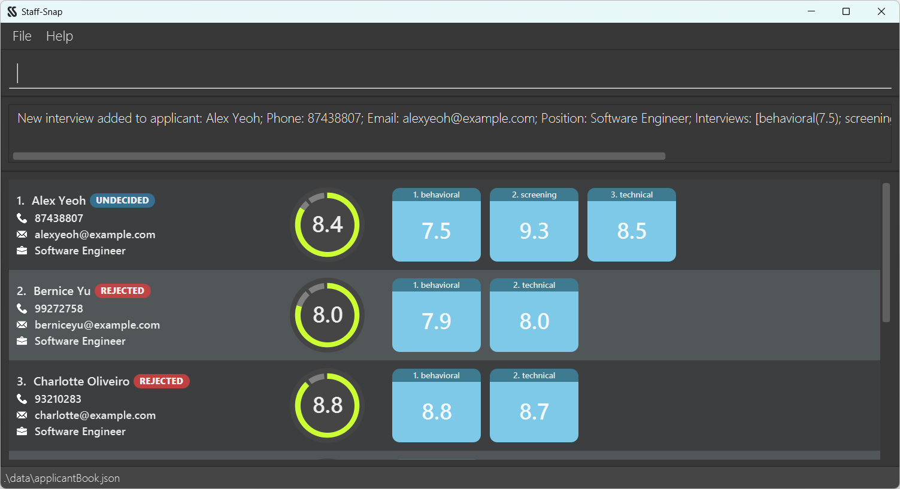

# Staff-Snap User Guide

--- {.double}

## Table of Contents

* [Introduction](#introduction)
* [Minimum System Requirements](#minimum-system-requirements)
* [Quick Start](#quick-start)
* [Using this Guide](#using-this-guide)
  * [Understanding the Symbols](#understanding-the-symbols)
  * [Understanding the Notations](#understanding-the-notations)
  * [Understanding the Main Window GUI](#understanding-the-main-window-gui)
  * [Understanding the Applicant Card GUI](#understanding-the-applicant-card-gui)
* [Features](#features)
  * [Applicant Management Features](#applicant-management-features)
    * [Command Parameters](#command-parameters-1)
    * [Adding a new applicant: `add`](#add)
    * [Editing an applicant: `edit`](#edit)
    * [Deleting an applicant: `delete`](#delete)
    * [Listing all applicants: `list`](#list)
    * [Editing an applicant status: `status`](#status)
  * [Interview Management Features](#interview-management-features)
    * [Command Parameters](#command-parameters-2)
    * [Adding an interview to an applicant: `addi`](#addi)
    * [Editing an interview of an applicant: `editi`](#editi)
    * [Deleting an interview from an applicant: `deletei`](#deletei)
  * [Applicant Processing Features](#applicant-processing-features)
    * [Command Parameters](#command-parameters-3)
    * [Finding an applicant by name: `find`](#find)
    * [Sorting applicants by descriptors: `sort`](#sort)
    * [Filtering applicants by fields: `filter`](#filter)
    * [Importing from csv: `import`](#import)
  * [Miscellaneous Features](#miscellaneous-features)
    * [Viewing help: `help`](#help)
    * [Clearing all applicant entries: `clear`](#clear)
    * [Exiting the program: `exit`](#exit)
    * [Saving the data](#saving-the-data)
    * [Editing the data file](#editing-the-data-file)
* [Command Summary](#command-summary)
  * [Commands for Applicant Management Features](#commands-for-applicant-management-features)
  * [Commands for Interview Management Features](#commands-for-interview-management-features)
  * [Commands for Applicant Processing Features](#commands-for-applicant-processing-features)
  * [Commands for Miscellaneous Features](#commands-for-miscellaneous-features)
* [FAQ](#faq)
* [Glossary](#glossary)

 

---
 

## Introduction

Welcome to the **Staff-Snap** User Guide!

**Staff-Snap** is a desktop app for Hiring Managers like you to manage the hiring and tracking of applicants, optimised for use via a [Command Line Interface (CLI)](#glossary). Used by Hiring Managers in companies around the globe, it is effective, easy-to-use and reliable, making the hiring process a much more enjoyable experience.

The purpose of this guide is to get you familiar with the features of **Staff-Snap**. These features range from the simple task of adding an applicant to being able to sort your applicants by their overall score. Every single feature is explained in this guide.

To begin using this guide, ensure you meet the [Minimum System Requirements](#minimum-system-requirements) to run **Staff-Stap**. Once this is done, go to the [Quick Start](#quick-start) section to get the application up and running. Once you have done so, feel free to go through the [Features](#features) section to find out about the features **Staff-Snap** offers. We recommend going through it in the order of this guide but any order works as well! You may check out our [Table of Contents](#table-of-contents) to jump to any section of your choice.

 

---
 

## Minimum System Requirements
1. A computer running on Windows, macOS, or Linux.
2. Ensure you have [Java](#glossary) 11 or above installed in your computer. If you do not have Java 11, follow [this](https://docs.oracle.com/en/java/javase/11/install/overview-jdk-installation.html#GUID-8677A77F-231A-40F7-98B9-1FD0B48C346A) installation guide.

 

---
 

## Quick Start

1. Download the latest `staffsnap.jar` from [here](https://github.com/AY2324S1-CS2103T-W08-1/tp/releases/tag/v1.4).
2. Copy the [JAR](#glossary) file to an empty folder that you would like to use as the [home folder](#glossary) for Staff-Snap.
3. Open the [command terminal](#glossary).
4. Navigate into your home folder with the `cd` command (e.g. `cd C:\Users\John\Desktop\MyHomeFolder`).
5. Enter the `java -jar staffsnap.jar` command to run the application.
6. You should see the [GUI](#glossary) displayed as shown below. Note how the application contains some sample data. 

7. Type the [command](#glossary) in the command box and press <kbd>Enter</kbd> to execute it. e.g. typing `help` and pressing <kbd>Enter</kbd> will open this User Guide in your browser window. Some example commands that you can try: 
   * `add n/John Doe hp/81238123 p/Boss e/john@mail.com` : Adds an applicant named John Doe to the list. 
   * `list` : Lists all applicants.
   * `delete 1` : Deletes the 1st applicant shown in the current list.
   * `clear` : Clears all applicants from the list.
   * `exit` : Exits the application.
8. Refer to the [Features](#features) section below for details of each command. 

<box type="tip" header="**For macOS users**" seamless>

If you are unfamiliar with the command terminal, you can right-click the `staffsnap.jar` file and select **Open With > JavaLauncher.app** to launch the application. If you are shown the warning below, click **Open** to continue launching Staff-Snap. 

</box>

---
 

## Using this Guide

---
 

This section introduces the symbols and notations used throughout this guide. The application's GUI [components](#glossary) are also explained here. We recommend that you read this section closely before using this guide.

 

### Understanding the Symbols

 

| 
Symbol
           | 
Meaning
                                                     |
|-------------------------------------------------|-------------------------------------------------------------------------------------------|
| <box type="info" header="**Note**"></box>       | This is a reminder of essential information that is required for proper Staff-Snap usage. |
| <box type="tip" header="**Tip**"></box>         | This is a small friendly advice to make your Staff-Snap experience more enjoyable.        |
| <box type="warning" header="**Caution**"></box> | This is a warning that cautions the user against common errors.                           |

 

---
 

### Understanding the Notations

| Notation                                                                                                                     | Explanation                                                                                               | Example                                                                                                                                            |
|------------------------------------------------------------------------------------------------------------------------------|-----------------------------------------------------------------------------------------------------------|----------------------------------------------------------------------------------------------------------------------------------------------------|
| Words in `UPPER_CASE`                                                                                                        | These are the parameters to be supplied by the user.                                                      | The command format `addi INDEX t/TYPE r/RATING` can be used in the form `addi 1 t/behavioural r/9.8` with the necessary details as the parameters. |
| Items in square brackets                                                                                                     | These are optional parameters for the users to supply.                                                    | The command `find KEYWORD [MORE_KEYWORDS]` can be used in the form `find Johnny Lee` as well as `find Johnny`                                      |
| Parameters can be in any order                                                                                               | Parameters for all commands are valid regardless of the order they are supplied in.                       | Both the commands `add n/Lee Soo Man hp/98891131…` and `add hp/98891131 n/Lee Soo Man…` are valid and will be accepted.                            |
| Extraneous parameters for commands that do not take in parameters such as `help`, `list`, `clear`, `exit` will be ignored.   | If any parameters are given for commands that do not require them, the given parameters will be ignored.  |

 

---
 

### Understanding the Main Window GUI

 

 

| 
GUI Component
 | 
Purpose
                                    |
|----------------------------------------------|--------------------------------------------------------------------------|
| Command Area                                 | This is where users type in commands for the application.                |
| Response Area                                | This is where Staff-Snap displays messages in response to user commands. |
| Applicant Area                               | This is where the applicant list is displayed.                           |

 

---
 

### Understanding the Applicant Card GUI

 

 

| 
GUI Component
 | Purpose                                                                                                                                |
|----------------------------------------------|----------------------------------------------------------------------------------------------------------------------------------------|
| Applicant details                            | This is where details about the applicant are displayed. These include their name, phone number, email, and position applied.          |
| Applicant status                             | This is where the status of the applicant is displayed. The status is categorised into Offered, Rejected, or Undecided.                |
| Applicant score                              | This is where the overall score of the applicant is displayed. This represents the _average_ rating of all the applicant's interviews. |
| Interview rating                             | This is where the rating for each interview is displayed.                                                                              |

---
 

## Features

---
 

This section introduces the full-suite of features in Staff-Snap. The features are grouped according to the following categories:
1. [Applicant Management Features](#applicant-management-features)
2. [Interview Management Features](#interview-management-features)
3. [Applicant Processing Features](#applicant-processing-features)
4. [Miscellaneous Features](#miscellaneous-features)

 

### Applicant Management Features

 

#### Command Parameters

| Parameter  | Description​                                                                                                                                                                                                                                                                                                                                                                                                                                                                                                                                                                                                                                                                                                                                                       | Examples​                                                        |
|------------|--------------------------------------------------------------------------------------------------------------------------------------------------------------------------------------------------------------------------------------------------------------------------------------------------------------------------------------------------------------------------------------------------------------------------------------------------------------------------------------------------------------------------------------------------------------------------------------------------------------------------------------------------------------------------------------------------------------------------------------------------------------------|------------------------------------------------------------------|
| `NAME`     | The applicant's name.    It can only contain alphanumeric characters and space, should be at least 1 character long, and should not exceed 25 characters.                                                                                                                                                                                                                                                                                                                                                                                                                                                                                                                                                                                                  | <ul><li>`James Lee`</li><li>`Rosemary Lee Curtis`</li></ul>      |
| `PHONE`    | The applicant's phone number.     It can only contain numbers, should be at least 3 digits long, and should not exceed 30 digits.                                                                                                                                                                                                                                                                                                                                                                                                                                                                                                                                                                                                                          | <ul><li>`91234726`</li><li>`1234567890123`</li></ul>             |
| `EMAIL`    | The applicant's email.     It should be of the format **local-part@domain**.    The **local-part** should only contain alphanumeric characters and these special characters, excluding the parentheses, (+_.-). The **local-part** may not start or end with any special characters.    This is followed by a **'@'** and then a **domain name**. The **domain name** is made up of domain labels separated by periods. The domain name must end with a domain label at least 2 characters long, have each domain label start and end with alphanumeric characters, and have each domain label consist of alphanumeric characters, separated only by hyphens, if any.    The entire email address should not exceed 30 characters. | <ul><li>`james@gmail.com`</li><li>`e9867626@u.nus.edu`</li></ul> |
| `POSITION` | The position applied for by the applicant.     It can take any value, should not be blank and should not exceed 30 characters.                                                                                                                                                                                                                                                                                                                                                                                                                                                                                                                                                                                                                             | <ul><li>`Software Engineer`</li><li>`AI Architect 2`</li></ul>   |
| `STATUS`   | The status of the applicant.     It can only be `o` or `offered` for _OFFERED_, `r` or `rejected` for _REJECTED_, or `u` or `undecided` for _UNDECIDED_.     The default status for an applicant is _UNDECIDED_.                                                                                                                                                                                                                                                                                                                                                                                                                                                                                                                                   | <ul><li>`o`</li><li>`u`</li><li>`rejected`</li></ul>             |
| `INDEX`    | The index of the applicant in the displayed list.     It must be a positive integer and not more than the total number of applicants.                                                                                                                                                                                                                                                                                                                                                                                                                                                                                                                                                                                                                      | <ul><li>`2`</li></ul>                                            |

 

---
 

#### Adding a new applicant: `add`

Adds a new applicant to the list. All newly added applicants have no interviews and have a default status of _UNDECIDED_.

Format: `add n/NAME hp/PHONE e/EMAIL p/POSITION`

<box type="warning" header="**Caution**">
    Duplicate applicants are not allowed. Two applicants are considered duplicates if they have the same phone number or the same email.
</box>

<box type="info" header="**Note**">
    As <code>NAME</code> can only contain alphanumeric characters and spaces, names containing non-alphanumeric characters such as hyphens <code>-</code> or slashes <code>/</code> are not allowed in this version of the app.
</box>

Valid examples:
* `add n/John Doe hp/91234567 e/johndoe@gmail.com p/Software Engineer` adds a new applicant with name *John Doe*, phone number *91234567*, email *johndoe@<area>gmail.com*, and position *Software Engineer*.

* `add n/Charlene Loh p/Staff Engineer e/cloh@gmail.com hp/91827271` adds a new applicant with name *Charlene Loh*, phone number *91827271*, email *cloh@<area>gmail.com*, and position *Staff Engineer*, as shown in the GUI below.
  

Invalid examples:
* `add n/John Doe hp/91234567` is not allowed as all fields are required to add an applicant to the list.

 

---
 

#### Editing an applicant: `edit`

Edits the details of an applicant in the list.

Format: `edit INDEX [n/NAME] [hp/PHONE] [e/EMAIL] [p/POSITION]`
* Edits the applicant at the specified `INDEX`. The index refers to the index number shown in the displayed applicant list.
* At least one of the optional fields must be provided.
* Existing values will be updated by the input values.
* `INDEX` must be a positive integer (e.g. `1`, `2`, `3`, ...).

Valid examples:
* `edit 1 n/Vijay Sankar Kumar` edits the name of the 1st applicant in the list.
* `edit 2 hp/80081234 e/newEmail@hotmail.com` edits the phone number and email of the 2nd applicant in the list.

Invalid examples:
* `edit n/Vijay Sankar Kumar` is not allowed as `INDEX` is a required parameter and must be specified.

* `edit 1` is not allowed as at least one of the optional fields `[n/NAME]`,  `[hp/PHONE]`, `[e/EMAIL]`, or `[p/POSITION]` must be provided.

* `edit -20 hp/12341234` is not allowed as `INDEX` must be a positive integer.

 

---
 

#### Deleting an applicant: `delete`

Deletes an applicant from the list.

Format: `delete INDEX`
* Deletes the applicant at the specified `INDEX`. The index refers to the index number shown in the displayed applicant list.
* `INDEX` must be a positive integer (e.g. `1`, `2`, `3`, ...).

Valid examples:
* `list` followed by `delete 2` deletes the 2nd person in the applicant list.
* `sort d/name` followed by `delete 3` deletes the 3rd person in the sorted applicant list.

Invalid examples:
* `delete` is not allowed as `INDEX` is a required parameter and must be specified.
* `delete -3` is not allowed as `INDEX` must be a positive integer.

 

---
 

#### Listing all applicants: `list`

Displays the full list of all applicants.

Format: `list`

 

---
 

#### Editing an applicant status: `status`

Edits the status of an applicant.

Format: `status INDEX s/STATUS`
* Edits the status of the applicant at the specified `INDEX`. The index refers to the index number shown in the displayed applicant list.
* `INDEX` must be a positive integer (e.g. `1`, `2`, `3`, ...).

Valid examples:
* `status 3 s/o` updates the status of the 3rd person in the displayed applicant list to _OFFERED_.
* `status 1 s/rejected` updates the status of the 1st person in the displayed applicant list to _REJECTED_.

Invalid examples:
* `status 3 s/interviewing` is not allowed as `STATUS` must be either `o` or `offered` or `r` or `rejected` or `u` or `undecided`.

* `status 3` is not allowed as `STATUS` is a required parameter and must be specified.

* `status -3 s/o` is not allowed as `INDEX` must be a positive integer.

 

---
 

### Interview Management Features

 

#### Command Parameters 

| Parameter         | Description​                                                                                                                                                          | Examples​                                          |
|-------------------|-----------------------------------------------------------------------------------------------------------------------------------------------------------------------|----------------------------------------------------|
| `TYPE`            | The interview type.    It should not be empty and should not exceed 14 characters.                                                                            | <ul><li>`technical`</li><li>`behavioral`</li></ul> |
| `RATING`          | The interview rating.     It should be a number between 0.0 and 10.0 inclusive, to 1 decimal place.                                                           | <ul><li>`9.6`</li><li>`0.0`</li></ul>              |
| `INTERVIEW_INDEX` | The index of the applicant's interview in the applicant card.     It must be a positive integer and not more than the applicant's total number of interviews. | <ul><li>`1`</li><li>`2`</li></ul>                  |
| `INDEX`           | The index of the applicant in the displayed list.     It must be a positive integer and not more than the total number of applicants.                         | <ul><li>`2`</li></ul>                              |

 

---
 

#### Adding an interview to an applicant: `addi`

Adds a new interview to an applicant. In the case of duplicate names, the system will automatically increment the last 
number in the user input until it hits a unique input, or add 1 if there is no number. However, if the input is too
large, or there are too many duplicates, the system might throw a message asking you to handle it manually without 
handling it for you.

Note: The name change is permanant so removing previous interviews will not change back the name. That is if both
`technical1` and `technical2` exist, deleting `technical1` will not change `technical2` back to `technical1`.

Duplicate handling: 
* Entering `technical12`, then `technical12` again will result in the 2nd entry being converted to 
`technical13`.
* Entering `technical`, `technical1`, then `technical` again will result in the 2nd `technical` entry being 
converted to `technical2`.
* Entering `technical`, then `technical` again will result in the 2nd entry being converted to `technical1`.

Format: `addi INDEX t/TYPE [r/RATING]`
* Adds an interview to the applicant at the specified `INDEX`. The index refers to the index number shown in the displayed applicant list.
* A maximum of 5 interviews can be added to each applicant.
* `INDEX` must be a positive integer (e.g. `1`, `2`, `3`, ...).

<box type="tip" header="**Tip**">
    Rating will be rounded to the nearest 1 decimal place if more than 1 decimal place is provided.
</box>

Valid examples:
* `addi 3 t/screening` adds a Screening interview without rating to the 3rd person in the displayed applicant list.
* `addi 1 t/technical r/8.5` adds a _technical_ interview with rating 8.5 to the 1st person in the displayed applicant list, as shown in the GUI below.

Invalid examples:
* `addi 1` is not allowed as `TYPE` is a required parameter and must be specified.
* `addi -1 t/screening` is not allowed as `INDEX` must be a positive integer.

 

---
 

#### Editing an interview of an applicant: `editi`

Edits an interview of an applicant.

Format: `editi INDEX i/INTERVIEW_INDEX [t/TYPE] [r/RATING]`
* Edits the applicant at the specified `INDEX`. The index refers to the index number shown in the displayed applicant list.
* `INTERVIEW_INDEX` refers to the index of the interview to be edited of the applicant.
* At least one of the optional fields must be provided.
* Existing values will be updated by the input values.
* `INDEX` and `INTERVIEW_INDEX` must be a positive integer (e.g. `1`, `2`, `3`, ...).

<box type="warning" header="**Caution**">
    There is <b>NO</b> duplicate handling for the name of the interview in <code>editi</code> and attempting to do so will give an error message.
</box>

Valid examples:
* `editi 1 i/1 t/technical r/7.8` edits the 1st interview of the 1st person in the displayed applicant list to a _technical_ interview with rating 7.8.
* `editi 3 i/2 t/screening` edits the 2nd interview of the 3rd person in the displayed applicant list to a _screening_ interview.
* `editi 2 i/1 r/8.9` edits the 1st interview rating of the 2nd person in the displayed applicant list to 8.9.

Invalid examples:
* `editi 1` is not allowed as an `INTERVIEW_INDEX` is a required parameter and must be specified.
* `editi 1 i/1` is not allowed as at least one of the optional fields `[t/TYPE]` or `[r/RATING]` must be provided.
* `editi -1 i/2 t/Assessment` is not allowed as `INDEX` must be a positive integer.

 

---
 

#### Deleting an interview from an applicant: `deletei`

Deletes an interview from an applicant.

Format: `deletei INDEX i/INTERVIEW_INDEX`
* Deletes from the applicant at the specified `INDEX`. The index refers to the index number shown in the displayed applicant list.
* `INDEX` and `INTERVIEW_INDEX` must be a positive integer (e.g. `1`, `2`, `3`, ...).

Valid examples:
* `deletei 1 i/2` deletes the 2nd interview of the 1st person in the displayed applicant list.

Invalid example:
* `deletei 1 i/20` is not allowed as the index of the interview is invalid. Since the maximum number of interviews for each applicant is 5, an interview index larger than 5 is not allowed.
* `deletei -1 i/3` is not allowed as `INDEX` must be a positive integer.

 

---
 

### Applicant Processing Features

 

#### Command Parameters

| Parameter    | Description​                                                                                                                           | Examples​                                                |
|--------------|----------------------------------------------------------------------------------------------------------------------------------------|----------------------------------------------------------|
| `DESCRIPTOR` | The applicant descriptor to sort by.    It should be either `name` or `phone` or `email` or `position` or `score` or `status`. | <ul><li>`name`</li><li>`score`</li></ul>                 |
| `KEYWORD`    | The keyword to find in an applicant's name.     It should be alphanumerical.                                                   | <ul><li>`Lee`</li><li>`Zhang Jordan`</li></ul>           |
| `SCORE`      | The applicant's overall score.     It should be a number between 0.0 and 10.0 inclusive, to 1 decimal place.                   | <ul><li>`0.0`</li><li>`8.3`</li></ul>                    |
| `FILENAME`   | The file name of the csv file to import.     It should end with the `.csv` suffix and should not be blank.                     | <ul><li>`demo.csv`</li><li>`applicantBook.csv`</li></ul> |

 

---
 

#### Finding an applicant by name: `find`

Find applicants whose name contains a particular keyword.

Format: `find KEYWORD [MORE_KEYWORDS]`

* The total length of the keywords, including spaces, should not be more than 55 characters long.
* The search is case-insensitive, e.g. `JOHN` will return `john`.
* The order of the keywords does not matter, e.g. `Alice Tan` will match `Tan Alice`.
* Only the applicant name is searched.
* Any applicant whose name contains the sequence of characters given as the keyword will be given as a result, 
e.g. `Ed` will match both `Edward` and `Ed`.
* Applicants matching at least one keyword will be returned (i.e. OR search), 
e.g. `Ben Bobby` will return `Ben Yang` and `Bobby Chin`.

<box type="info" header="**Note**">
    <code>find</code> works on the entire applicant list and will display any applicant whose name matches at least one keyword, even if they were filtered out using <code>filter</code>.
</box>

Valid examples:
* `find IVAN` finds any applicant whose name contains “ivan”.
* `find IVAN CHEW` finds any applicant whose name contains “ivan” or contains “chew”.

Invalid examples:
* `find name!!!` is not allowed as the `KEYWORD [MORE_KEYWORDS]` must be alphanumeric.

 

---
 

#### Sorting applicants by descriptors: `sort`

Sorts the applicant list based on the descriptor provided.

Format: `sort d/DESCRIPTOR [dsc/]`
* `DESCRIPTOR` must be either `name` or `phone` or `email` or `position` or `score` or `status`.
* `dsc/` flag indicates to sort the applicant list in descending order.

Example:
* `sort d/name` sorts the applicant list by name in alphabetical order.
* `sort d/phone` sorts the applicant list by phone numbers in ascending order.
* `sort d/email` sorts the applicant list by email in alphabetical order.
* `sort d/position dsc/` sorts the applicant list by positions in descending alphabetical order.
* `sort d/score dsc/` sorts the applicant list by score in descending order.
* `sort d/status` sorts the applicant list by status in the order _UNDECIDED_, _OFFERED_, _REJECTED_.

 

---
 

#### Filtering applicants by fields: `filter`

Filters the applicant list based on fields given by the user.

Format: `filter [n/NAME] [e/EMAIL] [p/POSITION] [hp/PHONE] [s/STATUS] [lts/SCORE] [gts/SCORE]`
* All fields are optional, however at least one of the optional fields must be provided.
* Any combination of multiple different fields is allowed.
* Only one of each field can be provided.
* Only applicants matching **ALL** fields will be returned. (i.e. AND search).
* For `[n/NAME]` field, only applicants whose name contains the full substring will be returned, e.g. `n/Ivan Chew` will **NOT** return `Ivan Lee`.
* `[n/NAME]` `[e/EMAIL]` `[p/POSITION]` fields are case-insensitive, e.g. `n/JOHN` will return `john`.
* If provided, the fields `NAME`, `PHONE`, `EMAIL`, and `POSITION` must satisfy the [parameter constraints](#command-parameters-1) previously described.
* `[s/STATUS]` takes in a value of either `u` or `o` or `r`.
* `[lts/SCORE]` `[gts/SCORE]` fields do **NOT** include equality in filters, e.g. `gts/7` will return all applicants whose score is strictly greater than `7`.

<box type="warning" header="**Caution**">
    Score will be rounded to the nearest 1 decimal place if more than 1 decimal place is provided.
</box>

Example:
* `filter n/Ivan` filters the applicant list to applicants whose name contains `ivan`.
* `filter n/Ivan p/Testing Engineer s/u` filters applicant list to applicants whose name contains `ivan` applying for the role of `testing engineer` and has a status of `Undecided`.
* `filter gts/7` filters applicant list to applicants whose score is strictly greater than 7.

 

---
 

#### Importing from CSV: `import`

Imports applicants from a [CSV](#glossary) file.

Format: `import f/FILENAME`
* The CSV file must be placed in the [home folder](#glossary) of Staff-Snap.
* The CSV file must have the following headers: `name`, `phone`, `email`, `position` in that order, as shown below. 
  

* The fields of the columns must satisfy the [parameter constraints](#command-parameters-1) for `NAME`, `PHONE`, `EMAIL`, and `POSITION` respectively.
* The CSV file must not contain [duplicate applicants](#duplicate-applicants).
* The CSV file must not contain applicants that are already in Staff-Snap.
* A sample CSV file can be found [here](demo.csv).

Example:
* `import f/applicants.csv` will import the applicants from the `applicants.csv` file, as shown in the GUI below.

 

---
 

### Miscellaneous Features

 

#### Viewing help: `help`

Opens up the user guide in the browser. Also displays a list of basic commands the user can use.

Format: `help`

 

---
 

#### Clearing all applicant entries: `clear`

After typing `clear`, system asks the user to confirm clearing. If user types `yes` and clicks enter, all the current data stored in the system is then cleared. Else, typing in anything else then pressing enter will cancel the clear process. 

Format: `clear`

 

---
 

#### Exiting the program: `exit`

Exits the program.

Format: `exit`

 

---
 

#### Saving the data

Automatically saves the data to a local storage whenever there is a change to the applicant list. There is no need to save manually.

 

---
 

#### Editing the data file

<box type="warning" header="**Caution**">
    Please make a backup copy before you attempt to edit the data file. If the format of the edited data file is invalid, 
Staff-Snap will override the existing data file with an empty data file in the next run.
</box>

Staff-Snap applicant data are saved automatically as a [JSON](#glossary) file `[JAR file location]/data/applicantBook.json`. Advanced users are welcome to update data directly by editing that data file.

  

---

## Command Summary

 

### Commands for Applicant Management Features

| 
Action
 | Format                                                                                                                        |
|--------------------------------------|-------------------------------------------------------------------------------------------------------------------------------|
| Adding a new applicant               | `add n/NAME hp/PHONE e/EMAIL p/POSITION`   e.g. `add n/Clarence Lee hp/81920192 e/clarence@gmail.com p/Software Engineer` |
| Editing an applicant                 | `edit INDEX [n/NAME] [hp/PHONE] [e/EMAIL] [p/POSITION]`   e.g. `edit 3 hp/82910293 e/lulule@gmail.com`                    |
| Deleting an applicant                | `delete INDEX`   e.g. `delete 3`                                                                                          |
| Listing all applicants               | `list`                                                                                                                        |
| Editing an applicant status          | `status INDEX s/STATUS`   e.g. `status 3 s/u`                                                                             |

 

### Commands for Interview Management Features

| 
Action
     | Format                                                                             |
|------------------------------------------|------------------------------------------------------------------------------------|
| Adding an interview to an applicant      | `addi INDEX t/TYPE [r/RATING]`   e.g. `addi 2 t/technical`                     |
| Editing an interview of an applicant     | `editi INDEX i/INTERVIEW_INDEX [t/TYPE] [r/RATING]`   e.g. `editi 3 i/2 r/8.2` |
| Deleting an interview from an applicant  | `deletei INDEX i/INTERVIEW_INDEX`   e.g. `deletei 3 i/1`                       |

 

### Commands for Applicant Processing Features

| 
Action
 | Format                                                                                                                   |
|--------------------------------------|--------------------------------------------------------------------------------------------------------------------------|
| Finding an applicant by name         | `find KEYWORD [MORE_KEYWORDS]`   e.g. `find jo tan`                                                                  |
| Sorting applicants by descriptors    | `sort d/DESCRIPTOR [dsc/]`   e.g. `sort d/name dsc/`                                                                 |
| Filtering applicants by fields       | `filter [n/NAME] [e/EMAIL] [p/POSITION] [hp/PHONE] [s/STATUS] [lts/SCORE] [gts/SCORE]`   e.g. `filter n/lee lts/7.8` |
| Importing from CSV                   | `import f/FILENAME`   e.g. `import f/demo.csv`                                                                       |

 

### Commands for Miscellaneous Features

| 
Action
 | Format                  |
|--------------------------------------|-------------------------|
| Viewing help                         | `help`                  |
| Clearing all applicant entries       | `clear`                 |
| Exiting the program                  | `exit`                  |

 

---
 

## FAQ

**Q**: How do I transfer my data to another computer?  
**A**: Install Staff-Snap on the other computer and replace the data file `[JAR file location]/data/applicantBook.json` in the other computer with the data file from your current computer. 

**Q**: How do I transfer my spreadsheet data to Staff-Snap?  
**A**: Export your spreadsheet data as a [CSV](#glossary) file, then use the [`import`](#import) command to import your CSV file into Staff-Snap. Ensure that your CSV file has the correct format and headers.

**Q**: Is my data secure?  
**A**: Yes, your data is stored locally in your computer and is not accessible by anyone else.

**Q**: Will I lose my data when I exit the app?  
**A**: No you will not. The data is stored on your computer and can still be displayed after exiting the app.

**Q**: Do I need internet connection to use Staff-Snap?  
**A**: You will need internet connection to open the web version of our user guide after clicking `help` or typing the
`help` command. Otherwise, no internet connection is required to perform the other features.

**Q**: Why is the first applicant from my CSV file not being imported?  
**A**: You might have omitted the header row. Ensure that the CSV file has the following headers: `name`, `phone`, `email`, `position`, in that order.

**Q**: Why is it that an applicant can only have one position?  
**A**: For the current iteration, we only allow the applicant to apply for one position. We plan to allow users to 
apply for multiple positions in future iterations.

**Q**: Do I have to pay to use Staff-Snap?  
**A**: No, Staff-Snap is completely free to use.

**Q**: Can I contact somebody for support?  
**A**: Yes, if you require support from our team while using Staff-Snap, feel free to drop us an email at [support@staffsnap.com](support@staffsnap.com).

 

---
 

## Glossary

| Term                               | Definition                                                                                                                                     |
|------------------------------------|------------------------------------------------------------------------------------------------------------------------------------------------|
| Alphanumeric	                      | Text that is consisting of or using both letters and numerals.                                                                                 |
| Command	                           | A Command is an instruction given by the user to perform a certain action.                                                                     |
| Command Line Interface (CLI)	      | The CLI is a text-based interface that allows users to type in commands to interact with the application.                                      |
| Component	                         | A component is a part of the user interface.                                                                                                   |
| Comma-Separated Values (CSV)	      | A CSV file is a text file format that uses commas to separate values. This allows data to be saved in a tabular format.                        |
| Graphical User Interface (GUI)	    | The GUI is the visual display of the application which users can interact with.                                                                |
| Home folder	                       | The main folder where you want to store all Staff-Snap related files.                                                                          |
| Index	                             | The position of a certain applicant in a list. The first applicant on a list in Staff-Snap will always have the index 1.                       |
| Java Archive File (JAR)	           | The file format of Staff-Snap.                                                                                                                 |
| Java	                              | Java is a general-purpose, class-based, object-oriented programming language designed for having lesser implementation dependencies.           |
| JavaScript Object Notation (JSON)	 | A data interchange file format used by Staff-Snap to store its applicant data.                                                                 |
| Parameter	                         | Parameters are the details needed to perform a specific command. (e.g. When adding an applicant, a parameter can be the name of the applicant) |
| Small Medium Enterprise (SME)	     | A SME is roughly defined as a small business that has more than 30 employees but less than 250 employees.                                      |
| User Interface (UI)	               | A User Interface is the visual display of the application where users can interact with the application.                                       |
