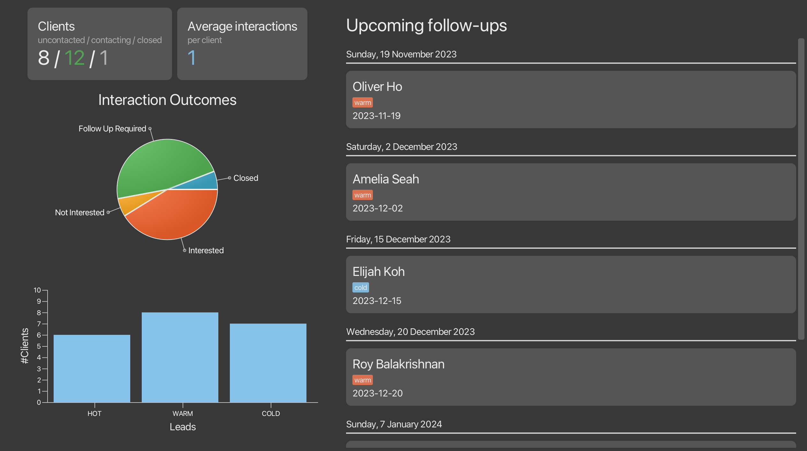
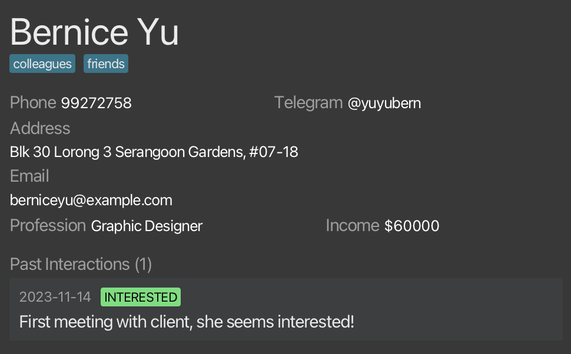

# Welcome to Connectify!


Connectify is a **desktop app for managing clients, optimized for use via a Command Line Interface** (CLI). Connectify helps salespersons manage their clients information records and data, boosting their efficiency in building customer relationships! If you can type fast, Connectify can get your client management tasks done faster than traditional GUI apps.

In this user guide, you will find instructions on how to install Connectify and use its many features to manage your clients.

Choose a topic from the table of contents to find out how to manage your clients using Connectify!

<div style="page-break-after: always;"></div>

# Table of Contents
* Table of Contents
{:toc}

--------------------------------------------------------------------------------------------------------------------
<div style="page-break-after: always;"></div>

# Quick start

1. Ensure that you have Java 11 installed on your Computer.

2. Download the latest `connectify.jar` from our [releases](https://github.com/AY2324S1-CS2103T-F11-4/tp/releases/).

3. Copy the file over to the folder you would want to use as the home folder for Connectify. An option is to create a folder named `Connectify` in your`Desktop` and place the file there.

4. Open the command terminal.

   a. For Windows, you can open `Command Prompt` from your list of installed applications.

   b. For macOS and other operating systems, open the `Terminal` app.

5. Change the directory of the terminal by using the `cd` command.

   a. For example, if you saved your file at `C:\Users\John\Desktop\Connectify\connectify.jar`, run the command `cd C:\Users\John\Desktop\Connectify` in your terminal.

6. Run `java -jar connectify.jar` to start the application.

    <div style="page-break-after: always;"></div>

7. A window similar to the one below should appear in a few seconds, containing sample data.

   <figure>
       
       <figcaption align="center">
           <em>The GUI you see on start-up may be slightly different due to differences in data.</em>
       </figcaption>
   </figure>
   <br>

8. Type the [command](#if-youre-new-what-are-commands) in the command box and press `Enter` to execute it.

   Some examples you can try:

   - `list`: Lists all client profiles.

   - `create n/John Doe p/98765432 e/johnd@example.com a/John street, block 123, #01-01`: Creates a client named `John Doe` in the client list.

   - `delete 3`: Deletes the 3rd contact currently shown in the displayed client list.

   - `exit`: Exits the app.

9. Refer to [Features](#features) below for more commands and details for each command.

[↑ Back to Table of Contents](#table-of-contents)

--------------------------------------------------------------------------------------------------------------------
<div style="page-break-after: always;"></div>

# **If you're new**: what are commands?

Commands are the string of text you type into the command box. They usually start with a command word.

- e.g. `create n/John Doe p/98765432 e/johnd@example.com a/John street, block 123, #01-01` is a command. ***create*** is the command word.

Sometimes these commands require additional information. When creating our client, we need to specify the name, phone number, etc. These fields are called **parameters**.

**Parameters** are additional information to be supplied by the user.

- e.g. In `n/NAME`, `NAME` is a parameter which can be used as `n/John Doe`.

For most commands, **parameters** are prefixed by **flags**. They are indicators to differentiate various parts of the command. They consist of a letter, followed by a `/`.

- e.g. In `n/NAME`, `n/` is the flag for the `NAME` parameter.

[↑ Back to Table of Contents](#table-of-contents)

--------------------------------------------------------------------------------------------------------------------
<div style="page-break-after: always;"></div>

# Graphical User Interface Components

<figure>
   <p align="center">
      
   </p>
   <figcaption align="center">
       <em>Connectify's Graphical User Interface (GUI): The Dashboard</em>
   </figcaption>
</figure>
<figure>
   <p align="center">
      
   </p>
   <figcaption align="center">
       <em>Connectify's Graphical User Interface (GUI): The Client List</em>
   </figcaption>
</figure>
<br>

<div style="page-break-after: always;"></div>

Let's first discuss the top half of the interface.

<figure>
   
   <figcaption align="center">
       <em>The navigation bar, command box, and output window.</em>
   </figcaption>
</figure>

1. **Navigation Bar**
   - **File:** a dropdown menu containing the exit button, which quits the application.
   - **Help:** a dropdown menu containing the help button, which provides the link to this user guide.

2. **Command Box:** a box where you can type [commands](#if-youre-new-what-are-commands). When it is empty, it prompts you with `Enter Command Here...`.

3. **Output Window:** a box where the results of your [commands](#if-youre-new-what-are-commands) will be displayed. Any errors that arise will also be shown here.

    <figure id="dashboard-information">
       
       <figcaption align="center">
           <em>Connectify's Analytics (left) and Upcoming Follow-ups (right)</em>
       </figcaption>
    </figure>

4. **Connectify's Analytics:** insightful statistics that are automatically calculated for you. This includes:
   - Number of uncontacted / contacted / closed clients
   - Average interactions among all clients
   - Breakdown of the different interaction outcomes
   - Number of hot / warm / cold [leads](#common-use-case-marking-a-clients-lead)

5. **Upcoming Follow-ups:** upcoming meetings for each client. Follow-up dates are determined automatically by the latest interaction date and the lead of the client. See [how Connectify calculates follow-up dates.](#follow-up-calculation)

    <div style="page-break-after: always;"></div>

    <figure>
       
       <figcaption align="center">
           <em>Connectify's List of Clients</em>
       </figcaption>
    </figure>

6. **Client List:** a scrollable list of clients that you have. You can see the details of each client, including:
   - **Index:** the number and order of each client in your client list. The numbering can change using the [***find*** command](#finding-a-client-by-name-find).
   - **Name:** the name of the client, specified after the index number.
   - **Lead:** the lead of the client, represented by either a red, orange, or light blue box.
   - **Tags:** a row of dark green boxes, representing additional information of each client.
   - **Phone Number:** the client's phone number.
   - **Email:** the client's email address.

   <div style="page-break-after: always;"></div>
   <br>
   <figure>
       
       <figcaption align="center">
           <em>Detailed View of Bernice Yu's Profile</em>
       </figcaption>
    </figure>

7. **Detailed View:** a detailed view of each client's profile, showing additional information, including:
   - **Telegram Handle:** the client's telegram handle, starting with the letter `@`.
   - **Address:** the home address of the client.
   - **Profession:** the client's profession/job.
   - **Income:** the client's income.
   - **Past Interactions:** the list of past interactions or meetings with the clients, along with its date, interaction outcome (interested), and meeting notes.

   <a id="status-bar"></a>
   <br>
   <figure>
       
       <figcaption align="center">
           <em>The Status Bar (at the bottom of the application window)</em>
       </figcaption>
    </figure>

8. **Status Bar:** the location of where Connectify is storing your data in your computer.

[↑ Back to Table of Contents](#table-of-contents)

--------------------------------------------------------------------------------------------------------------------
<div style="page-break-after: always;"></div>

# Features

<div markdown="block" class="alert alert-info">

**:information_source: Notes about commands**<br>

- Commands, flags and parameters are case-sensitive, unless otherwise specified.

- Items in square brackets are optional.

  e.g. `n/NAME [tg/TELEGRAM]` can be used as `n/John Doe tg/@johndoe` or as `n/John Doe`.

- Items with `...` after them can be repeated any number of times, including zero.

  e.g. `[t/TAG]...` can be used as <code> </code> (0 times), `t/friend`, or `t/friend t/neighbour`, while
  `n/NAME` has to be used exactly once.

- Parameters can be entered in any order.

  e.g. If the command specifies its parameters as `n/NAME p/PHONE`, `p/PHONE n/NAME` is also acceptable.

- Extraneous parameters for commands that do not take in parameters will be ignored.

  e.g. The ***list*** command does not take in any parameters. If the command `list 123` is entered, it will be interpreted as `list`.

</div>

<div style="page-break-after: always;"></div>

## Viewing help: ***help***

Shows a message explaining how to access the user guide.

<figure>
   <p align="center">
       
   </p>
    <figcaption align="center">
        <em>Pop-up message that appears after running help.</em>
    </figcaption>
</figure>

[↑ Back to Table of Contents](#table-of-contents)

--------------------------------------------------------------------------------------------------------------------

## Adding

### Adding a client profile: ***create***

Your job as a salesperson starts with adding a client profile to Connectify. This is a one-time process for each client that has been made simple for you.
Use the ***create*** command to add a client profile.

**Format**
```text
create n/NAME p/PHONE e/EMAIL a/ADDRESS [t/TAG]... [tg/TELEGRAM]
[pf/PROFESSION] [i/INCOME] [d/DETAILS]
```

<div markdown="block" class="alert alert-info">

**:information_source: Unique profiles**<br>

Connectify checks for the uniqueness of a profile by its `NAME`. It doesn't allow you to create two profiles with the same name. If you happen to have two clients with the exact same name, we suggest differentiating them by adding some notes in brackets!

e.g. `John Doe (Company A)` vs `John Doe (Company B)`

</div>

**Example**
```text
create n/Bernice Yu p/99272758 e/berniceyu@example.com 
a/Blk 30 Lorong 3 Serangoon Gardens, #07-18 t/colleagues 
t/friends tg/@yuyubern pf/Graphic Designer i/60000
```

<figure>
    
    <figcaption align="center">
        <em>Result of executing the above create command: Bernice Yu's profile is at index 7. Indices may be different.</em>
    </figcaption>
</figure>
<br>

You should directly see the client profile added to the list of clients in the application window. After adding a client profile, you can now perform various operations on the client profile as specified in the next few sections!

[↑ Back to Table of Contents](#table-of-contents)
<div style="page-break-after: always;"></div>

### Adding a client interaction: ***interaction***

After contacting your client, you may want to log your interactions with them. Use the ***interaction*** command when you want to record an interaction you had with a client.

**Format**
```text
interaction INDEX o/OUTCOME [DETAILS]
```

<div markdown="block" class="alert alert-info">

**:information_source: Notes about the interaction command**<br>

- `INDEX` refers to the index of the client profile in the displayed list of clients.

- At least one of the `OUTCOME` or `DETAILS` parameters must be provided.

- `OUTCOME` must be one of the following: `INTERESTED`, `NOT_INTERESTED`, `CLOSED`, `UNKNOWN`.

- `OUTCOME` is not case sensitive. `interested` is also a valid outcome.

</div>

**Example**
```
interaction 7 o/INTERESTED First meeting with client, she seems interested!
```

<figure>
   <p align="center">
       
   </p>
    <figcaption align="center">
        <em>There are initially no past interactions for Bernice Yu's profile.</em>
    </figcaption>
</figure>

<figure>
   <p align="center">
       
   </p>
    <figcaption align="center">
        <em>Result of adding an interaction for Bernice Yu's profile.</em>
    </figcaption>
</figure>
<br>

You should directly see the interaction added to the client profile in the application window.

[↑ Back to Table of Contents](#table-of-contents)

--------------------------------------------------------------------------------------------------------------------
<div style="page-break-after: always;"></div>

## Viewing

Sometimes, you may want to view the details of a client profile or the interactions you have had with a client to quickly catch up before contacting them.

This section contains multiple commands that allow you to view various details of your clients that are collated in a single view for your convenience.

### Viewing the list of clients: ***list***

From the dashboard, you may wish to see a comprehensive list of your clients. Use the ***list*** command to view all clients.

**Format**
```text
list
```

<figure>
   <p align="center">
       
   </p>
    <figcaption align="center">
        <em>The client list view. Data shown may vary.</em>
    </figcaption>
</figure>
<br>

You should then see the list of clients in the application window.

[↑ Back to Table of Contents](#table-of-contents)
<div style="page-break-after: always;"></div>

### Viewing the full details of a client: ***view***

Catching up on the details of a client before contacting them is important. Most of the time, remembering the details of previous interactions with a client is difficult as the data is scattered everywhere.

Connectify gives you the powerful ***view*** command to view the full details of a client profile in a single view.

**Format**
```text
view INDEX
```

<div markdown="block" class="alert alert-info">

**:information_source: Notes about the view command**<br>

`INDEX` refers to the index of the client profile in the displayed list of clients.

</div>

**Example**
```text
view 4
```

<figure>
   <p align="center">
       
   </p>
    <figcaption align="center">
        <em>The client list view. Note that David's profile is at index 4.</em>
    </figcaption>
</figure>
<br>

<figure>
   <p align="center">
       
   </p>
    <figcaption align="center">
        <em>Result of executing the above view command: David's profile details are shown.</em>
    </figcaption>
</figure>
<br>

[↑ Back to Table of Contents](#table-of-contents)

### Finding a client by name: ***find***

Managing a large client list can be difficult. Sometimes their index on the list can be hard to remember and this could affect your experience keying in certain commands. Don't worry though, we have a solution for you! The ***find*** command allows you to search for a client by name, and you can use this client's index (usually 1) in other commands.

**Format**
```text
find NAME
```

<div markdown="block" class="alert alert-info">

**:information_source: Notes about the find command**<br>

You need to type either the **first**, **middle** or **last** name of the client. You cannot type a partially spelt name!

</div>

**Example**
```text
find David
```

<figure>
   <p align="center">
       
   </p>
    <figcaption align="center">
        <em>The client list view. Data shown may vary.</em>
    </figcaption>
</figure>
<br>

<figure>
   <p align="center">
       
   </p>
    <figcaption align="center">
        <em>Result of executing the above find command: David's profile is found at index 1. Indices may be different.</em>
    </figcaption>
</figure>
<br>

[↑ Back to Table of Contents](#table-of-contents)
<div style="page-break-after: always;"></div>

### Viewing the dashboard: ***dashboard***

To keep track of comprehensive statistics about your performance, Connectify provides you with the ***dashboard*** command.
Use the ***dashboard*** command to view summarised information on your client interactions and your important follow-ups.

**Format**
````text
dashboard
````

You should see the following dashboard view in the application window.

<figure>
   
   <figcaption align="center">
       <em>The dashboard view. Data shown may vary.</em>
   </figcaption>
</figure>
<br>

See [what each section of the dashboard means.](#dashboard-information)

[↑ Back to Table of Contents](#table-of-contents)

--------------------------------------------------------------------------------------------------------------------
<div style="page-break-after: always;"></div>

## Editing

### Editing a client profile: ***edit***

Over time, you may need to update the details of a client profile to reflect the most current information. Use the command ***edit*** to edit the specified client profile in your client list.

**Format**
```text
edit INDEX [n/NAME] [p/PHONE] [e/EMAIL] [a/ADDRESS] [t/TAG]... [l/LEAD] 
[tg/TELEGRAM] [pf/PROFESSION] [i/INCOME] [d/DETAILS]
```

<div markdown="block" class="alert alert-info">

**:information_source: Notes about the edit command**<br>

- `INDEX` refers to the index of the client profile in the displayed list of clients.

- At least one of the optional parameters must be provided.

</div>

Example
1. `edit 1 l/HOT`
2. `edit 2 e/berniceyu@gmail.com p/123456789`
3. `edit 3 t/buddies t/relatives`

<figure>
   <p align="center">
       
   </p>
    <figcaption align="center">
        <em>Initial state of 4 contacts.</em>
    </figcaption>
</figure>

<figure>
   <p align="center">
       
   </p>
    <figcaption align="center">
        <em>Result of running commands (1) to (3).</em>
    </figcaption>
</figure>
<br>

<div style="page-break-after: always;"></div>

#### Clearing all tags of a client

You can use the ***edit*** command to clear all tags of a client by supplying an empty tag parameter! For example, if you wish to clear the tags of a client at index 4, use `edit 4 t/`.

#### Editing a single field

We understand the ***edit*** command can be a little tedious to use if you only want to edit a single field of a client profile. Hence, we have provided a shortcut for you to edit a single field of a client profile. This command is special because its command word is the same as the field you want to edit. 

**Format**
```text
FIELD INDEX NEW_VALUE
```

**Example**

- `name 1 John Doe`

  Changes the name of the client at index 1 to `John Doe`.

<div markdown="block" class="alert alert-info">

**:information_source: Notes about this shortcut**<br>

- `INDEX` refers to the index of the client profile in the displayed list of clients.

- All valid `FIELD` parameters: ***name***, ***phone***, ***email***, ***address***, ***lead***, ***telegram***, ***profession***, ***income***, ***details***.

- This does not work for the client's tags.

</div>

#### Common use case: marking a client as a hot, warm, or cold lead

As salespeople, we need to gauge the potential of each client, which represents how likely they are to become a buying customer. We use hot leads to represent a customer with high potential, and cold leads to represent customers with low potential.

You can use the ***lead*** command to mark a client as a **hot**, **warm** or **cold** lead. For example, if you wish to mark the client at index 4 as a cold lead, enter `lead 4 cold`. This changes [the follow-up period of the client.](#follow-up-calculation)

[↑ Back to Table of Contents](#table-of-contents)

--------------------------------------------------------------------------------------------------------------------

## Deleting

### Deleting a client profile: ***delete***

Keep the list of clients in Connectify clean by deleting client profiles that are no longer relevant.

Deleting a client profile is easy with the ***delete*** command.

**Format**
```text
delete INDEX
```

**Example**
```
delete 1
```

[↑ Back to Table of Contents](#table-of-contents)

--------------------------------------------------------------------------------------------------------------------

## Exiting the program: ***exit***

Quits the Connectify application.

**Format**
```text
exit
```

[↑ Back to Table of Contents](#table-of-contents)

--------------------------------------------------------------------------------------------------------------------
<div style="page-break-after: always;"></div>

# Miscellaneous Notes

## Follow-up Calculation

The follow-up date is calculated by the day of last interaction plus a follow-up period, determined by lead type as shown:

| Lead Type | Follow-Up Time |
|-----------|----------------|
| HOT       | 1 week         |
| WARM      | 4 weeks        |
| COLD      | 8 weeks        |
| UNKNOWN   | 4 weeks        |


For example, if your last interaction with John is on `1 Jan 2021` and he is a `HOT` lead, the follow-up date will be 1 week after `1 Jan 2021`, which is `8 Jan 2021`.

## Parameter constraints

Some parameters have constraints on the inputs they accept. Although our app notifies you of such issues when they arise, this section lists some common constraints worth noting.

### Phone numbers
Phone numbers can only 3-15 contain digits. An optional `+` sign is allowed in front.

### Tags

The tag parameter `t/TAG` only allows alphanumeric inputs with no spaces. For example, `t/familyfriend` is allowed, but `t/family friend` or `t/family-friend` is not allowed.

### Incomes

Incomes consist only of numerical inputs. Connectify does not yet support:
* Decimal values `600.50`
* Currencies `10000 USD`
* Other non-numeric input e.g. `10,000`

## Command history
You can use the **up arrow key <kbd>&uarr;</kbd>** to view your past commands and press <kbd>Enter</kbd> to execute them again.

This is especially useful if you find yourself having to re-enter a command that was not accepted due to an error. For example, your parameters may not have conformed to the constraints above. 

[↑ Back to Table of Contents](#table-of-contents)

--------------------------------------------------------------------------------------------------------------------
<div style="page-break-after: always;"></div>

# Glossary
* **Lead**: Refers to the potential of a client to become a buying customer
* **Client**: Refers to a person whom the user is conducting his/her business with
* **Interaction**: A business meeting with the **Client** to discuss sales
* **Follow-Ups**: Synonymous to Future **Interactions**
* **UTC**: [Coordinated Universal Time](https://en.wikipedia.org/wiki/Coordinated_Universal_Time)
* **Mainstream OS**: Windows, Linux, Unix, macOS

[↑ Back to Table of Contents](#table-of-contents)

--------------------------------------------------------------------------------------------------------------------
<div style="page-break-after: always;"></div>

# FAQ

**Q**: How do I save my progress?
<br>
**A**: Your progress is saved after every command automatically. So if you close the app and open it again, your data will still be there!

**Q**: How do I transfer my data to another computer?
<br>
**A**:
<br>
1. Find your data folder - it should be in the same directory as your `connectify.jar` file.

    If your Connectify jar file is at `C:\Users\John\Desktop\Connectify\connectify.jar`, the data folder will be at `C:\Users\John\Desktop\Connectify\data`.

    <div markdown="block" class="alert alert-warning">
   
    **:bulb: If you're having trouble finding the data folder, you can refer to the [status bar](#status-bar).**
   
    </div>


2. [Download Connectify](#quick-start) on the other computer.

3. Paste the data folder in the same directory as your `connectify.jar` file in your other computer.

[↑ Back to Table of Contents](#table-of-contents)

--------------------------------------------------------------------------------------------------------------------
<div style="page-break-after: always;"></div>

# Command summary

| Action                       | Format                                                                                                            | Example                                                                                                                                                              |
|------------------------------|-------------------------------------------------------------------------------------------------------------------|----------------------------------------------------------------------------------------------------------------------------------------------------------------------|
| Help                         | `help`                                                                                                            | `help`                                                                                                                                                               |
| Add Client                   | `create n/NAME p/PHONE e/EMAIL a/ADDRESS [t/TAG] [tg/TELEGRAM] [pf/PROFESSION] [i/INCOME] [d/DETAILS]`            | `create n/Bernice Yu p/99272758 e/berniceyu@example.com a/Blk 30 Lorong 3 Serangoon Gardens, #07-18 t/colleagues t/friends tg/@yuyubern pf/Graphic Designer i/60000` |
| Add Interaction              | `interaction INDEX o/OUTCOME [DETAILS]`                                                                           | `interaction 1 o/INTERESTED d/Client is interested in our products`                                                                                                  |
| View Dashboard               | `dashboard`                                                                                                       | `dashboard`                                                                                                                                                          |                                                                                                                                                        |
| View Client List             | `list`                                                                                                            | `list`                                                                                                                                                               |
| Find Client                  | `find NAME`                                                                                                       | `find Chemmy`                                                                                                                                                        |
| View Client Details          | `view INDEX`                                                                                                      | `view 1`                                                                                                                                                             |
| Edit Client                  | `edit INDEX [n/NAME] [e/EMAIL] [a/ADDRESS] [t/TAG] [l/LEAD] [tg/TELEGRAM] [pf/PROFESSION] [i/INCOME] [d/DETAILS]` | `edit 2 e/berniceyu@gmail.com p/123456789`                                                                                                                           |
| Edit Single Field (Shortcut) | `FIELD INDEX NEW_VALUE`                                                                                           | `name 1 John Doe`                                                                                                                                                    |
| Delete Client                | `delete INDEX`                                                                                                    | `delete 1`                                                                                                                                                           |
| Exit                         | `exit`                                                                                                            | `exit`                                                                                                                                                               |

[↑ Back to Table of Contents](#table-of-contents)
