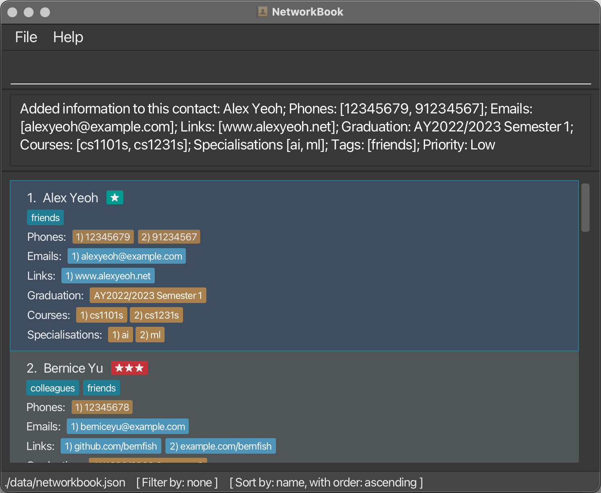
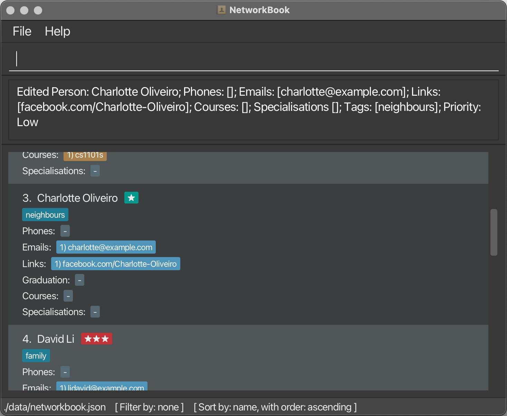
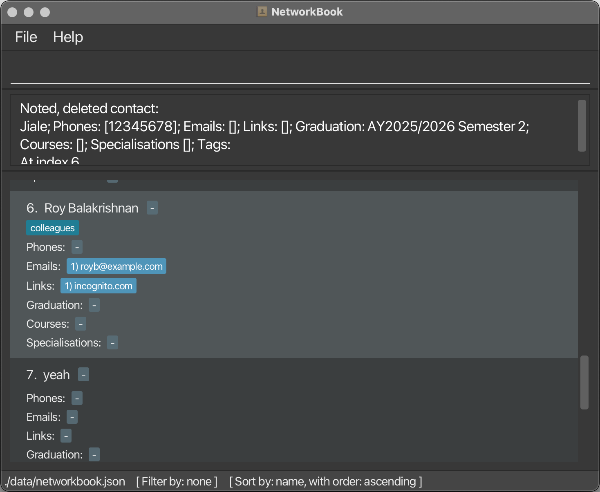

## Product Overview

**Land the dream internship or job opportunity you've always wanted by networking more effectively using our application!**

NetworkBook is a desktop contact book application built for NUS Computing students and professionals to manage information about the people they network with more efficiently than ever before.

Here's an overview of how NetworkBook can help you manage your network of contacts better than existing alternatives:
- You can search for and sort contacts by multiple networking-relevant fields (e.g. priority, courses taken/taking, specialization(s) taken/intending to take, graduation year)
- You can access this application offline, with a static online page that contains user manual and download link
- You can record only the information you find relevant on our application (e.g. you can assign one contact only their email and specialisation, and another contact nothing but their course)

On top of these advantages, we believe that contact management must be efficient. Therefore, NetworkBook is optimised for use via a Command Line Interface (CLI) while still having the benefits of a Graphical User Interface (GUI). If you type fast, NetworkBook can get your contact managing done faster than existing alternatives performing a similar role.

If you are new here, visit our [getting started guide](#getting-started) to start getting connected on NetworkBook!

## Table of Contents
{:toc}

## About This User Guide

This user guide provides in-depth documentation on the various commands that are available in NetworkBook.
If you are familiar with the software, this user guide gives an overview on how to use specific commands.

Additionally, if you are a new user, this user guide provides a quick start guide to aid you with installing the application and getting started.

### What's new in NetworkBook 1.3

NetworkBook 1.3 includes several new features and improvements for ease of use.
* Filter command for more control with finding contacts
* Error messages are now more specific to give useful information
* NetworkBook is able to connect with and open other apps
* Keyboard shortcuts added for easy access to common commands
* Undo/redo command to fix mistakes
* Refinement of GUI to make it more aesthetically pleasing

## Getting Started

1. Make sure you have Java 11 installed on your computer.
    * You can check that it is installed by running the command `java --version` in the command prompt/terminal.
1. Download the latest version of NetworkBook (`networkbook.jar`) from the top of the [NetworkBook GitHub releases page](https://github.com/AY2324S1-CS2103T-T08-2/tp/releases).
1. Create a new folder on your computer (e.g. on your computer desktop). You can name this folder however you want.
1. Move the `networkbook.jar` file into the folder you just created.
1. Open NetworkBook:
    * If you are using Windows:
        1. Double-click the `networkbook.jar` file to open it.
    * If you are using MacOS:
        1. Open Terminal.app.
        1. Navigate to the folder you have created using the `cd` command:
            1. Type `cd`, then space, into the Terminal window.
            1. Drag the folder icon from Finder into the Terminal window.
            1. Press enter.
        1. Type in `java -jar networkbook.jar`, then press enter to open the app.
    * If you are using Linux:
        1. Open your terminal emulator app.
        1. Navigate to the folder you have created using `cd`.
        1. Type in `java -jar networkbook.jar`, then press enter to open the app.
1. You should now see the NetworkBook window on your screen. This is what NetworkBook looks like:
    
1. You can now start using NetworkBook!
    * Learn more about the commands in the [features](#features) section.

## Features

### <u>Category 1 - Add contact information</u>

#### Create new contact: `create /name [name] [/optional fields]`

You can use the create command to create a new contact. When creating a contact, you must provide the name field, and it's optional to provide other fields which will be added to the new contact.

Format: `create /name [name] /phone [phone] /email [email] /link [link] /grad [semester of graduation] /course [course] /spec [specialisation] /priority [high/medium/low] /tag [tag]`

Parameters:
* `[name]`  is the name of the contact you wish to add.
* `[optional fields]` are the non-mandatory fields you can associate with the contact at the point of creation. The fields can also be added using the add command.

When adding a contact, if there is already another contact with the same name, you would be informed that another contact with the same name already exists (not case sensitive)

Example usage:
* `create /name Jiale`
* `create /name Jiale /phone 12345678 /grad AY2526-S2`

[Table of Contents](#table-of-contents)

#### Add details to contact: `add [index] /phone`

You can add a contact detail to an existing contact. No new contact will be created.

Format: 
* Add phone: `add [index] /phone [phone]`
* Add email: `add [index] /email [email]`
* Add link: `add [index] /link [link]`
* Add graduation time: `add [index] /grad [semester of graduation]`
* Add course: `add [index] /course [course]`
* Add specialisation: `add [index] /spec [specialisation]`
* Assign priority: `add [index] /priority [priority level]`
* Add tag: `add [index] /tag [tag name]`

Parameters:
* `[index]` is the index of the contact in the list.
* `[phone]` is a valid phone number (should be all numeric characters).
* `[email]` is a valid email (`@` (at sign) must be present, 
and `.` (period) must be present after `@` (at sign)).
* `[link]` is a valid URL linking to a contact’s social media page.
* `[grad]` is a valid graduation date, in the format `AYxxxx-Sy`.
    * `xxxx` is the 4-digit representation of the 2 calendar years, in the academic year e.g. `2223` for Academic Year 20`22`/20`23`. Academic year must be between AY1970/1971 to AY2069/2070 (inclusive).
    * `y` is either `1` for Semester 1, or `2` for Semester 2.
* `[course]` is a course that the contact is taking/has taken.
* `[spec]` is the specialisation that contact is taking/has taken.
* `[priority level]` either **high**, **medium** or **low**, or the initial alphabet to represent the respective priority level.
* `[tag name]` is the name of the tag to associate the contact with

Example usage:
* `add 1 /phone 91234567`
* `add 3 /email nknguyentdn@gmail.com`
* `add 1 /link https://nknguyenhc.github.io/`
* `add 3 /grad AY2223-S1`
* `add 2 /course CS1101S`
* `add 3 /spec Robotics & AI`
* `add 1 /priority high`
* `add 1 /tag data analyst`

[Table of Contents](#table-of-contents)

### <u>Category 2 - Edit contact details</u>

#### Edit contact detail : `edit [index] [options]`

You can edit contact details of existing contacts in your book.

Format:
* Edit name: `edit [index of contact] /name [name]`
* Edit phone: `edit [index of contact] /phone [phone] /index [index of phone]`
* Edit email: `edit [index of contact] /email [email] /index [index of email]`
* Edit link: `edit [index of contact] /link [link] /index [index of link]`
* Edit graduation: `edit [index of contact] /grad [semester of graduation]`
* Edit course: `edit [index of contact] /course [course] /index [index of course]`
* Edit specialisation: `edit [index of contact] /spec [specialisation] /index [index of specialisation]`
* Edit priority: `edit [index of contact] /priority [priority level]`
* Edit tag: `edit [index of contact] /tag [tag name]`

Parameters:
* `[index of contact]` is the index of the contact in the list.
* `[phone]` is a valid phone number (should be all numeric characters).
* `[index of phone]` is the index of the phone number in the phone list of the contact.
* `[email]` is a valid email (`@` (at sign) must be present, 
and `.` (period) must be present after `@` (at sign)).
* `[index of email]` is the index of the email in the email list of the contact.
* `[link]` is a valid URL linking to a contact’s social media page.
* `[index of link]` is the index of the link in the link list of the contact.
* `[grad]` is a valid graduation date, in the format `AYxxxx-Sy`.
    * `xxxx` is the 4-digit representation of the 2 calendar years, in the academic year e.g. `2223` for Academic Year 20`22`/20`23`. Academic year must be between AY1970/1971 to AY2069/2070 (inclusive).
    * `y` is either `1` for Semester 1, or `2` for Semester 2.
* `[course]` is a course that the contact is taking/has taken.
* `[index of course]` is the index of the course in the course list of the contact.
* `[spec]` is the specialisation that contact is taking/has taken.
* `[index of specialisation]` is the index of the specialisation in the specialisation list of the contact.
* `[priority level]` either **high**, **medium** or **low**, or the initial alphabet to represent the respective priority level.
* `[tag name]` is the name of the tag to associate the contact with.
* `[index of tag]` is the index of the tag in the tag list of the contact.

Example usage:
* `edit 1 /name nkn`
* `edit 2 /phone 10938472 /index 1`
* `edit 3 /email nkn@gmail.com /index 3`
* `edit 1 /link https://nknguyenhc.github.io/ /index 1`
* `edit 3 /grad AY2324-S1`
* `edit 2 /course CS2101 /index 2`
* `edit 1 /spec algorithms /index 3`
* `edit 3 /priority high`
* `edit 1 /tag working in Meta /index 2`

[Table of Contents](#table-of-contents)

#### Delete a contact: `delete` 

You can remove a contact from your NetworkBook using the `delete` command, 

so that your book only contains contact details of those relevant.

Format: `delete [index]`

Parameters:

* `[index]` is the index of the contact in the list

Example usage:

* `delete 1`
* `delete 16`

[Table of Contents](#table-of-contents)

### <u>Category 3 - Find contacts</u>

#### Find a contact: `find [name]`

You can use the `find` command to search for contacts by their name if you wish to quickly reference a particular contact’s details.

Format: `find [name]`

Parameters:
* `[name]` is a term found in the names of the contacts you wish to find.

Example usage:
* `find Jack`
* `find Kai Jie`

[Table of Contents](#table-of-contents)

#### Sort contacts list: `sort /by /order`

You can use the `sort` command to sort your list of contacts.

Format: `sort /by [field] /order [order]`

Parameters

* `[field]` is the information to sort by.

    List of options:
    * `name` - Sort alphabetically by contact name
    * `grad` - Sort chronologically by graduation year
    * `priority` - Sort by priority
    * `none` - Return to default sorting

* `[order]` (optional) is the order to sort in. If not specified, defaults to ascending.

    List of options:
    * `asc`/`ascending` - Sort in ascending order
    * `desc`/`descending` - Sort in descending order

Example usage:

* `sort /by grad /order asc`
* `sort /by name /order descending`
* `sort /by name`

[Table of Contents](#table-of-contents)

## Command summary

| Category | Format, Examples                                                                                                                                                                                                                                                                                                                                                                                                                                                                                                                                                                                                                                                                                                                                                                                       |
|----------|--------------------------------------------------------------------------------------------------------------------------------------------------------------------------------------------------------------------------------------------------------------------------------------------------------------------------------------------------------------------------------------------------------------------------------------------------------------------------------------------------------------------------------------------------------------------------------------------------------------------------------------------------------------------------------------------------------------------------------------------------------------------------------------------------------|
| **Add**  | `create /name [name] [/phone /email /link /grad /course /spec /priority /tag]`   e.g., `create /name Oreki /phone +6598765432 /grad AY2526-S2`  `add [index] /phone [phone]`   e.g., `add 1 /phone +6591234567`  `add [index] /email [email]`   e.g., `add 2 /email test@example.com`  `add [index] /link [link] [note]` e.g., `add 1 /link https://nknguyenhc.github.io/ website`  `add [index] /course [course of study] /date [start date] [end date]` e.g., `add 1 /course Computer Science /date 01-08-2022 07-12-2022`  `add [index] /spec [specialisation]` e.g., `add 1 /spec Robotics & AI`  `add [index] /priority [priority level]` e.g., `add 1 /priority high`  `add [index] /tag [tag name]` e.g., `add 1 /tag friend` |                                                                                                                                                                                                                                                                                                                                                                                                                                                                                                                                                                                                                                                                    |                                                                                                                                                                                                                                                                                                                                                                                                                                                                                                                                                                                                                                                                                                                                                     |  
| **Edit** | `update [index] /[parameter name] [new parameter value]`  e.g.,`update 1 /name nkn`  `delete [index]` e.g., `delete 1`                                                                                                                                                                                                                                                                                                                                                                                                                                                                                                                                                                                                                                                                     |                                                                                                                                                                                                                                                                                                                                                                                                                                                                                            |
| **Find** | `find [name]`   e.g., `find Ness`  `sort /by [field] /order [order]` e.g., `sort /by name /order asc`                                                                                                                                                                                                                                                                                                                                                                                                                                                                                                                                                                                                                                                                                      |                                                                                                                                                                                                                                                                                                                                                                                                                                                                                                                                                       |  
