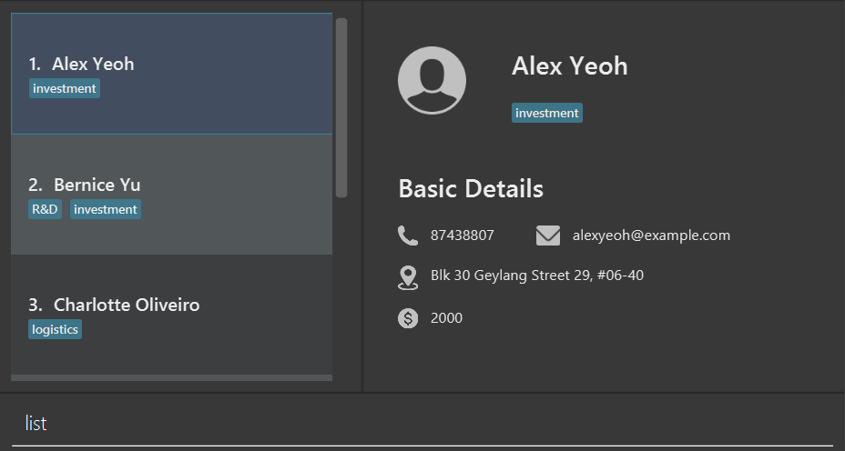
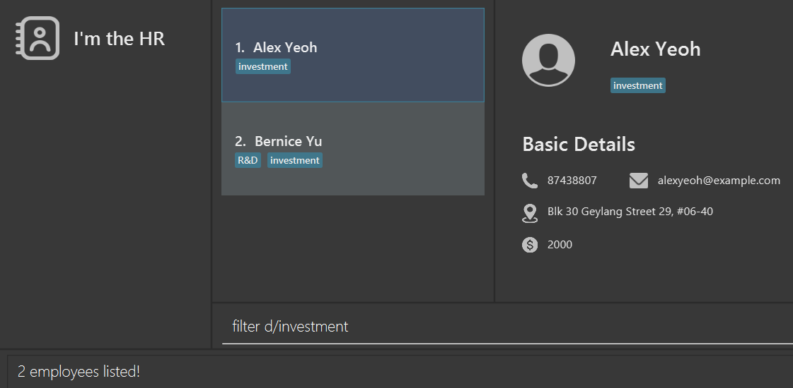

ManageHR is your all-in-one solution for seamless Human Resources management. Say goodbye to paperwork, spreadsheets, and administrative headaches. Our cutting-edge software empowers HR professionals to focus on what truly matters – your people.

Table of Contents
- Quick Start
- Features
- FAQ
- Known Issues
- Command summary

--------------------------------------------------------------------------------------------------------------------

## Quick start

1. Ensure you have Java `11` or above installed in your Computer.

2. Download the latest `ManageHR.jar` from [here](https://github.com/AY2324S1-CS2103-T16-1/tp/releases).

3. Copy the file to the folder you want to use as the _home folder_ for your app.

4. Open a command terminal, `cd` into the folder you put the jar file in, and use the `java -jar ManageHR.jar` command to run the application. 
   A GUI similar to the below should appear in a few seconds. Note how the app contains some sample data. 
   

5. Type the command in the command box and press Enter to execute it. e.g. typing **`help`** and pressing Enter will open the help window. 
   Some example commands you can try:

   * `list` : Lists all employees.

   * `add n/John doe p/91234567 e/example@example.com a/1 Lower Kent Ridge Road s/4000 l/12 r/manager d/SoC HR` : Quickly add an employee:

   * `delete 3` : Deletes the 3rd employee shown in the current list.

   * `clear` : Deletes all employees.

   * `exit` : Exits the app.

6. Refer to the [Features](#features) below for details of each command.

**:memo: Sample data provided** 

A reference for the sample data provided by default is available [here](SampleInputs.md).

--------------------------------------------------------------------------------------------------------------------

## Features

**:information_source: Notes about the command format:** 

* Words in `UPPER_CASE` are the parameters to be supplied by the user. 
  e.g. in `add n/NAME`, `NAME` is a parameter which can be used as `add n/John Doe`.

* Items in square brackets are optional. 
  e.g. `n/NAME [d/Department]` can be used as `n/John Doe d/Investment` or as `n/John Doe`.

* Items with `…`​ after them can be used multiple times including zero times. 
  e.g. `[d/DEPARTMENTS]…​` can be used as ` ` (i.e. 0 times), `d/Investment`, `d/Sales d/Logistic` etc.

* Parameters can be in any order. 
  e.g. if the command specifies `n/NAME p/PHONE_NUMBER`, `p/PHONE_NUMBER n/NAME` is also acceptable.

* Extraneous parameters for commands that do not take in parameters (such as `help`, `list`, `exit` and `clear`) will be ignored. 
  e.g. if the command specifies `help 123`, it will be interpreted as `help`.

* If you are using a PDF version of this document, be careful when copying and pasting commands that span multiple lines as space characters surrounding line-breaks may be omitted when copied over to the application.

## Feature 1: Manager-Subordinate Relationships

### Overview

Our application includes a powerful manager-subordinate feature that enables users to define and manage hierarchical
relationships within their organization. This feature is designed to streamline the management of employees between
supervisors and subordinates.

### Constraints

1. Only employees with `manager` role can be in charge of other employees.
2. Each employee must either be `manager` and `subordinate` but not both.
3. Both employees that are either `manager` or `subordinate` can have multiple `manager` in charge of them.
4. An employee could have no designated "manager" responsible for overseeing them.
5. A `manager` employee could not edit their `role` and `name` attribute when he or she is in charge of any subordinates.

### Usage Instructions

To set up manager-subordinate relationships, follow these steps:

#### Enrolling a New Employee with Manager-Subordinate Relationships

When enrolling a new employee in ManageHR, you can also establish manager-subordinate relationships. Follow these steps:
1. Include `r/ROLE` into `add` command, where `ROLE` could either be `manager` or `subordinate`. This is a compulsory field where each employee must either be `manager` or `subordinate`.
2. Include `m/MANAGER NAME…` into `add` command. This is an optional field. Note that you can have multiple managers in charge of this employee or none at all.
3.  `m/MANAGER NAME…` represents the managers who are currently in charge of the said employee.

#### Editing an Existing Employee with Manager-Subordinate Relationships
When editing an existing employee in ManageHR, you can also establish or modify manager-subordinate relationships. Follow these steps:
1. Include `r/ROLE` into `edit` command to change the current `role` of the employee.

    - The employee can only change his or her `role` from `manager` to `subordinate` only if he or she has no employees under his or her supervision.
    - The name of the employee can only be edited if he or she is a `manager` with no employees under his or her supervision.
2. Include `m/MANAGER NAME…` into the `edit` command. This will place the employee to be under that `manager`.
    - The `MANAGER NAME` stated must correspond with an existing employee with the same name and is also a `manager`.

#### Deleting an Existing Employee with Manager-Subordinate Relationships
When deleting an existing employee from ManageHR, you will need to account for the manager-subordinate relationships. Follow these steps:
1. The employee to be deleted must not be in charge of any employees.
    - If the employee to be deleted has employees under him, all the employees under said employee must be reassigned.

## Feature 2: Department-Employee Relationships

### Overview

Our application also includes a department-employee feature that enables users to group employees within
organization. This feature is designed to help users keep track of large clustering of employees.

### Constraints

1. A department can be empty, or contain single/multiple employees
2. An employee can be assigned to multiple departments
3. If an employee is in a department, a department will contain the employee
4. When an employee is removed from the system, all departments containing the employees will remove the employee from
   the system
5. When a department is removed from the system, all employees that were in that department will have that department
   property removed from them

### Usage Instructions

To use this function relationships, follow these steps:

#### Creating a department

Use the `department` command to add a department into the system. The department name must not already exist

#### Adding/Removing a employee from a department

Use the `add` or `edit` command with the department tag `d/` to include/remove an employee from a department

### Deleting a department

Use the `department` command to remove a department from the system. The department name must exist in the system

### Viewing help : `help`

Shows the help window for a specific command. Help window shows the syntactic use of the command, as well as an example of how the command is to be used.

If no command is provided, a general help pane is displayed, with a link to the user guide.

Format: `help <command>`

Example:
- `help`
- `help add`

Acceptable values for each parameter:

| Parameters | Accepted input                                           |
|------------|----------------------------------------------------------|
| command    | A command word present in ManageHR. Alternatively empty. |

Expected outputs:

| Outcome                               | Output                                                                                                                                                                           |
|---------------------------------------|----------------------------------------------------------------------------------------------------------------------------------------------------------------------------------|
| Command Success, no specified command | A window is displayed, with `Refer to the user guide: https://ay2324s1-cs2103-t16-1.github.io/tp/UserGuide.html` A copy button is available to copy this URL into the clipboard. |
| Command Success, specified command    | A window is displayed, with  `<command name>: Usage, Syntax to use, Example: Example of command.`. A copy button is also available to copy the example usage.                    |
| Command Failure                       | Command input error. Please check your command input.                                                                                                                            |

### Adding an employee: `add`

Adds an employee to ManageHR’s entries.

Format: `add n/NAME p/PHONE_NUMBER e/EMAIL a/ADDRESS s/SALARY l/LEAVE r/ROLE [d/DEPARTMENT]… [m/MANAGER NAME]…`
- Adds an employee with the above fields.
- Name, Phone Number, Email, Address, Salary, Leave and Role fields must be provided.
- Department and Manager fields are optional, and can contain more than one.

Examples:
* `add n/Johnny p/91242712 e/johnnysins@gmail.com a/Johnny street, block 69, #05-05 s/5300 l/14 r/subordinate d/ R&D m/ Alex Yeoh`
* `add n/Elon p/12345678 e/elonma@gmail.com a/Elon street, block 140, #20-01 s/2100 l/21 r/manager d/R&D`

Acceptable values for each parameter:

| Parameters     | Accepted input                                         |
|----------------|--------------------------------------------------------|
| `NAME`         | Alphabets and Numbers                                  |
| `PHONE_NUMBER` | At least 3 digits                                      |                                                  |
| `EMAIL`        | Email with the pattern x@x where ‘x’ are alphanumerics |
| `ADDRESS`      | Alphanumerics and ascii characters i.e. #, -           |
| `SALARY`       | Numerals                                               |
| `LEAVE`        | Numerals                                               |
| `ROLE`         | `manager` or `subordinate` (Case-insensitive)          |
| `DEPARTMENT`   | Optional. Alphabets and ascii characters i.e. &, -     |
| `MANAGER_NAME` | Optional. Name of an existing manager in ManageHR.     |

Expected outputs:

| Outcome | Output                                                                                                                            |
| --- |-----------------------------------------------------------------------------------------------------------------------------------|
| **Success** | Employee added! Johnny \| 12345678 \| johnnysins@gmail.com \| Johnny Street, block 69, #05-05 \| 5300 \| 14 \| subordinate \| R&D |
| **Fail** | Please check the parameter inputs                                                                                                 |

Constraints:
* [Manager-subordinate relationship](#enrolling-a-new-employee-with-manager-subordinate-relationships)

### Listing all employees : `list`

Description: Lists all employees currently stored

Format: `list`

| Outcome     | Output                                                                                                                |
|-------------|-----------------------------------------------------------------------------------------------------------------------|
| **Success** | Lists all employees and displays a message "Listed all employees" along with a table of employee data as shown below. |

### Editing an employee : `edit`

Edits an existing employee in the address book.

Format: `edit INDEX [n/NAME] [p/PHONE] [e/EMAIL] [a/ADDRESS] [s/SALARY] [l/LEAVE] [r/ROLE] [m/MANAGER NAME]… [d/DEPARTMENT]…​`

* Edits the employee at the specified `INDEX`. The index refers to the index number shown in the displayed employee list.
* At least one of the optional fields must be provided.
* Existing values will be updated to the input values.

Examples:
*  `edit 1 p/91234567 e/johnsimmons@gmail.com` Edits the phone number and email address of the 1st employee to be `91234567` and `johnsimmons@gmail.com` respectively.

Constraints:
* [Manager-subordinate relationship](#editing-an-existing-employee-with-manager-subordinate-relationships)

### Locating employee by name: `find`

Finds people whose names contain any of the given keywords.

Format: `find KEYWORD [MORE_KEYWORDS]`

* The search is case-insensitive. e.g. `hans` will match `Hans`
* The order of the keywords does not matter. e.g. `Hans Bo` will match `Bo Hans`
* Only the name is searched.
* Only full words will be matched e.g. `Han` will not match `Hans`
* Employees matching at least one keyword will be returned (i.e. `OR` search).
  e.g. `Hans Bo` will return `Hans Gruber`, `Bo Yang`

Examples:
* `find John` returns `john` and `John Doe`
* `find alex david` returns `Alex Yeoh`, `David Li` 
  

### Filtering employees: `filter`

Filters employees by prefix parameters.

Format: `filter [n/NAME] [p/PHONE_NUMBER] [e/EMAIL] [a/ADDRESS] [s/SALARY] [l/LEAVE] [r/ROLE] [m/MANAGER_NAME] [d/DEPARTMENT]`

* The filter is case-sensitive. e.g. `R&D` will not match `r&d`
* At least one of the optional fields must be provided.
* Able to filter by multiple prefixes

Examples:
* `filter d/investment` returns employees with the `investment` department
* `filter s/4000` returns employees with salary equal to or less than 4000
* `filter l/14 r/manager` returns employees with 14 days of leave and the manager role

| Parameters     | Accepted input                                         | Remarks                                                                              |
|----------------|--------------------------------------------------------|--------------------------------------------------------------------------------------|
| `NAME`         | Alphabets and Numbers                                  | Full name is needed (case-sensitive)                                                 |
| `PHONE_NUMBER` | At least 3 digits                                      | Exact phone number is needed                                                         |
| `EMAIL`        | Email with the pattern x@x where ‘x’ are alphanumerics | Exact email is needed (case-sensitive)                                               |
| `ADDRESS`      | Alphanumerics and ascii characters i.e. #, -           | Exact address is needed (case-sensitive)                                             |
| `SALARY`       | Numerals                                               | Returns employees with salary __less than or equal__ to the given `SALARY` parameter |
| `LEAVE`        | Numerals                                               | Returns employees with leave __equal__ to the given `LEAVE` parameter                |
| `ROLE`         | `manager` or `subordinate` (case-insensitive)          | Returns employees with either the `manager` role or the `subordinate` role           |
| `MANAGER_NAME` | Alphabets and Numbers                                  | Returns subordinates of given `MANAGER_NAME` parameter                               |
| `DEPARTMENT`   | Alphabets and ascii characters i.e. &, -               | Returns employees with the given `DEPARTMENT` parameter                              |

Expected outputs:

| Outcome     | Output                  |
|-------------|-------------------------|
| **Success** | X employees listed!     |
| **Fail**    | Invalid command format! |

### Deleting an employee : `delete`

Deletes the specified employee from the address book.

Format: `delete INDEX`

* Deletes the employee at the specified `INDEX`.
* The index refers to the index number shown in the displayed employee list.
* The index **must be a positive integer** 1, 2, 3, …​

Examples:
* `list` followed by `delete 2` deletes the 2nd employee in the address book.
* `find Betsy` followed by `delete 1` deletes the 1st employee in the results of the `find` command.

| Outcome                          | Output                                                    |
|----------------------------------|-----------------------------------------------------------|
| **Success**                      | Deleted Employee: \<Employee name>; \<Additional Details> |
| **Failure, incomplete command**  | Invalid command format!                                   |
| **Failure, invalid index**       | The employee index provided is invalid.                   |

Constraints:
* [Manager-subordinate relationship](#deleting-an-existing-employee-with-manager-subordinate-relationships)

### Adding/Deleting a department : `department`

Creates/Delete a specified department to/from the address book.

Format: `department [t/TYPE] [n/NAME]`

* Creates a department of name `NAME` iff `TYPE` is "add" and the department name do not exist currently.
* Deletes the department of name `NAME` iff `TYPE` is "delete" and the department exist currently.
* Name is case-sensitive, and will only match the exact department name
* List of departments and its employees related to it can be found in the side navigation bar
* Add/Remove an employee into/from a department using the add or edit command

Examples:
* `department t/add n/trial` adds a department of name trial into the app
* `department t/delete n/trial` deletes the department name of trial from the app

Succeed:
* You’ll see a reply "New department added: <Department Name>" if type is add
* You'll see a reply "Department deleted: <Department Name" if type is delete

Fail:
* If the department to be added already exist, a warning will be displayed.
  “This department already exist in ManageHR.”
* If the department to be deleted does not exist, a warning will be displayed.
  “This department does not exist in ManageHR.”

Constraints:
* [Department-Employee relationship](#creating-a-department)

### Exiting the program : `exit`

Exits the application.

Format: `exit`

### Saving the data

ManageHR data are saved in the hard disk automatically after any command that changes the data. There is no need to save manually.

### Editing the data file

ManageHR data are saved automatically as a JSON file `[JAR file location]/data/managehr.json`. Advanced users are welcome to update data directly by editing that data file.

:exclamation: **Caution:**
If your changes to the data file makes its format invalid, ManageHR will discard all data and start with an empty data file at the next run. Hence, it is recommended to take a backup of the file before editing it.

--------------------------------------------------------------------------------------------------------------------

## FAQ

**Q:** How do I transfer my data to another Computer?

**A:** To transfer your data to another computer, follow these steps:

1. Install the app on the other computer if you haven't already.

2. Locate the empty data file that the app creates on the new computer.

3. Replace the empty data file with the file containing the data from your previous ManageHR home folder.

Now, your data should be successfully transferred to the new computer.

--------------------------------------------------------------------------------------------------------------------

## Known issues

1. **When using multiple screens**, if you move the application to a secondary screen, and later switch to using only the primary screen, the GUI will open off-screen. The remedy is to delete the `preferences.json` file created by the application before running the application again.

--------------------------------------------------------------------------------------------------------------------

## Command summary

| Action         | Format, Examples                                                                                                                                                                                                                                |
|----------------|-------------------------------------------------------------------------------------------------------------------------------------------------------------------------------------------------------------------------------------------------|
| **Add**        | `add n/NAME p/PHONE_NUMBER e/EMAIL a/ADDRESS s/SALARY l/LEAVE r/ROLE [d/DEPARTMENT]… [m/MANAGER NAME]…`   e.g., `add n/Johnny p/91242712 e/johnnysins@gmail.com a/Johnny street, block 69, #05-05 s/5300 l/14 r/subordinate d/ R&D m/ Alex Yeoh` |
| **Clear**      | `clear`                                                                                                                                                                                                                                         |
| **Delete**     | `delete INDEX`  e.g., `delete 4`                                                                                                                                                                                                             |
| **Department** | `department t/(add/delete) n/DEPARTMENT_NAME`   e.g., `department t/add n/Engineering`                                                                                                                                                       |
| **Edit**       | `edit INDEX [n/NAME] [p/PHONE] [e/EMAIL] [a/ADDRESS] [s/SALARY] [l/LEAVE] [r/ROLE] [m/MANAGER NAME]… [d/DEPARTMENT]…`  e.g.,`edit 1 p/91234567 e/johnsimmons@gmail.com`                                                                      |
| **Exit**       | `exit`                                                                                                                                                                                                                                          |
| **Filter**     | `filter [n/NAME] [e/EMAIL] [a/ADDRESS] [s/SALARY] [l/LEAVE] [r/ROLE] [m/MANAGERNAME] [d/DEPARTMENT]`   e.g., `filter d/R&D s/10000`                                                                                                          |
| **Find**       | `find KEYWORD [MORE_KEYWORDS]`  e.g., `find alex david`                                                                                                                                                                                      |
| **Help**       | `help` or `help [command]`   e.g., `help add`                                                                                                                                                                                                |
| **List**       | `list`                                                                                                                                                                                                                                          |

