## Introduction
***Taking care of your finances has never been easier!***

Welcome to Spend N Split (SNS), an application meant for managing transactions from your contacts list. Built for university students who reside on campus, it utilises your fast typing skills to help you maintain financial accountability between yourself and your peers. All you need to do, is to record your transactions in Spend N Split. Filtering, sorting, as well as the calculations of balances owed will be automatically handled by Spend N Split.

Spend N Split is perfect for **you** if you are
1. A university student staying on campus.
2. A fast typist.
3. Comfortable using a keyboard to make full use of the application.

In this user guide, we'll provide you with everything you need to quickly become proficient in using SNS's essential features.

--------------------------------------------------------------------------------------------------------------------

<div style="page-break-after: always;"></div>

## Table of Contents

1. [Introduction](#introduction)
2. [Table of Contents](#table-of-contents)
3. [How to use the User guide](#how-to-use-the-user-guide)
4. [Labels](#labels)
5. [Key Terms](#key-terms)
6. [Quick Start](#quick-start)
7. [Navigating the App](#navigating-the-app)
8. [Parameters](#parameters)
9. [Features](#features)
    - [Add a contact](#add-your-friends-as-contacts-using-addperson)
    - [Edit a contact](#edit-your-contacts-with-editperson)
    - [Delete a contact](#delete-a-contact-using-deleteperson)
    - [List your contacts](#find-your-contacts-using-listperson)
    - [Sort your contacts](#order-your-contacts-by-their-outstanding-balance-using-sortperson)
    - [Add a transaction](#create-a-new-transaction-with-addtransaction)
    - [Edit a transaction](#update-your-transactions-with-edittransaction)
    - [Delete a transaction](#delete-a-transaction-with-deletetransaction)
    - [Duplicate a transaction](#duplicate-transactions-with-duplicatetransaction)
    - [List your transactions](#list-your-transactions-with-listtransaction)
    - [Settle your balances](#settle-your-balances-withsettleperson)
    - [Create command shortcuts](#create-command-shortcuts-using-setshorthand)
    - [Get help](#use-help-to-find-our-user-guide)
    - [Clear your data](#reset-your-data-using-clear)
    - [Exit SNS](#leaving-spend-n-split-use-exit)
11. [Data](#data)
12. [Features Summary](#features-summary)
13. [Acknowledgements](#acknowledgements)
14. [Glossary](#glossary)


--------------------------------------------------------------------------------------------------------------------

<div style="page-break-after: always;"></div>

## How to use the User Guide

1. If Spend N Split is not yet installed, kindly navigate to the [Quick Start](#quick-start) section, which includes steps for installation as well as sample commands for you to try.

2. Downloaded Spend N Split, but not yet familiar with app and want a refresher? We highly recommend heading to the [Navigating the App](#navigating-the-app) section.

3. Looking to learn about our features? Well, head to the [Features](#features) section to see what Spend N Split can do for you!

4. Already an experienced user? Check out our [Features Summary](#features-summary) for a quick recap on how to use Spend N Split!

--------------------------------------------------------------------------------------------------------------------
## Labels

In our user guide, you may find coloured boxes that contain highlighted pieces of text.

<div markdown="block" class="alert alert-info">
:bulb: Blue boxes offer helpful tips to enhance your experience.
</div>

<div markdown="block" class="alert alert-primary">
:warning: Yellow boxes provide warnings that you should take note of.
</div>

<div markdown="span" class="alert alert-danger">
:heavy_exclamation_mark: Red boxes signify dangers that require your attention.
</div>

--------------------------------------------------------------------------------------------------------------------

<div style="page-break-after: always;"></div>

## Key Terms

<!-- The Spend N Split application links transactions and people. As such, it is important that you familiarise yourself with the structure of each person and each transaction in our application. -->

In the Spend N Split application, transactions and people play a crucial role. It's important to familiarise yourself with the structure of both individuals and transactions within our application.

### Person

<!-- A person is someone that you track your balance against. Before creating a transaction involving a specific person, that person has to exist in the application. If not, that person has to be added to the application before the transaction is created. -->

A person represents an individual whom you track your financial balances against. To create a transaction involving a specific person, that person's contact must already have been added into the application. If not, you'll need to add them before recording the transaction.

A person has the following attributes:
- Name (Compulsory)
- Balance (Calculated by the application)
- Tag(s) (Optional)
- Phone number (Optional)
- Telegram handle (Optional)
- Email Address (Optional)
- Address (Optional)

Each person is identified by their names. Names are case-insensitive and the application does not support duplicate names. This means that you cannot add two or more people with the same name.

<div markdown="block" class="alert alert-info">
:bulb: If a positive balance is displayed on a person, it means that they owe you money. Conversely, if the balance displayed is
negative, you owe that person money instead.
</div>

<div style="page-break-after: always;"></div>

### Transaction

Transactions represent events involving the exchange of money.

A transaction has the following attributes:
- Description (Compulsory)
- Payee (Compulsory)
- Payer (Compulsory)
- Amount (Compulsory)
- Timestamp (Optional. If this is not provided, the application will use the current time on your computer)
- Portion(s)

<div markdown="block" class="alert alert-primary">
:warning: There are 2 special names when adding transactions - "Self" and "Others". "Self" refers to you (the user of this application) and "Others" refers to people that have not been added to the application.
</div>

After a transaction, each payer in the list of portions owes the payee a fraction of the amount, based on their weights in the list of portions.

--------------------------------------------------------------------------------------------------------------------

<div style="page-break-after: always;"></div>

## Quick Start

1. Ensure you have Java `11` or above installed in your computer.

    To check the version of Java installed on your computer, click [here](https://www.java.com/en/download/help/version_manual.html) if you are using a Windows or Mac computer, and click [here](https://phoenixnap.com/kb/check-java-version-linux)
   if your computer is running Linux.


2. Download the latest `spendnsplit.jar` from [here](https://github.com/AY2324S1-CS2103T-W17-3/tp/releases/tag/v1.4).

3. Copy the file to the folder you want to use as the _home folder_ for your Spend N Split.

4. Open a command terminal, navigate into the folder you've saved the jar file in using the `cd` command. Then, type`java -jar spendnsplit.jar`
   into the command terminal to run the application.
   
   If you are unfamiliar with how to use the `cd` command on your command terminal, check out [this guide](https://tutorials.codebar.io/command-line/introduction/tutorial.html) to get started.
   
   <br>
   An interface similar to the one shown below should appear in a few seconds. Notice that the application contains some sample data.<br>
   

<div style="page-break-after: always;"></div>

5. Type the command in the Command Input Field and press Enter to execute it. e.g. typing **`help`** and pressing Enter will
   open the help window.<br>
   Some example commands you can try:

    * `listPerson` : Lists all persons.

    * `listTransaction` : Lists all transactions.

    * `exit` : Exits the application.

6. Learn more about navigating the application in the [Navigating the App](#navigating-the-app) section below.
7. Learn more about the commands in the [Features](#features) section below.

--------------------------------------------------------------------------------------------------------------------

<div style="page-break-after: always;"></div>

## Navigating the App

Spend N Split has an intuitive Graphical User Interface (GUI) that allows you to navigate the application easily.

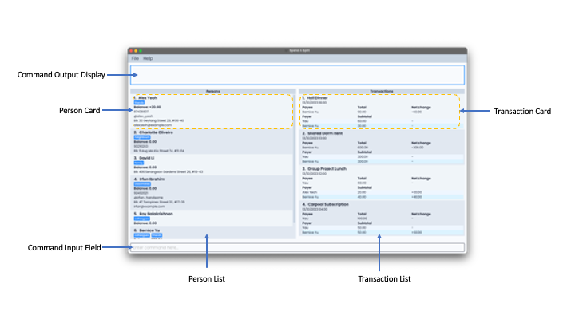

| Component                  | Description                                                                                                                |
|----------------------------|----------------------------------------------------------------------------------------------------------------------------|
| **Command Input Field**    | Type commands here and press `Enter` to execute them.                                                                      |
| **Command Output Display** | Displays the result after executing commands.                                                                                 |
| **Transaction List**       | Shows the list of transactions stored in the app.                                       |
| **Transaction Card**       | Shows the details of a transaction. <br/> Details include the description, date, payee, as well as the breakdown of costs. |
| **Person List**            | Shows the list of persons stored in the app.                                    |
| **Person Card**            | Shows the details of a person. <br/> Details include name, balance, phone number, etc.                                     |

--------------------------------------------------------------------------------------------------------------------

<div style="page-break-after: always;"></div>

## Parameters

Some of the commands will require you to include parameters, which have specific formats and constraints applied on them. Before heading to the [Features](#features) section, we recommend taking a look at the type of parameters required by commands.
<br>

<div markdown="span" class="alert alert-danger">
:heavy_exclamation_mark: All inputs to parameters should not contain the "=" sign.
</div>
The following parameters are used for commands:

| Parameter     | Prefix | Format                                                                                                                                                                                                         | Example |
|---------------| --- |----------------------------------------------------------------------------------------------------------------------------------------------------------------------------------------------------------------| --- |
| Index         | - | No prefix required. Positive whole numbers only.                                                                                                                                                                                         | `1`, `2`, `3` |
| Keyword       | - | Should not contain the "=" sign as mentioned above. No other restrictions apply.                                                                                                                                      | `Bob`, `Lunch` |
| Name          | n | Alphanumeric, can contain multiple words.                                                                                                                                                                       | `Bob`, `Alex Yeoh` |
| Phone number  | p | Numeric, minimum length of 3 digits.                                                                                                                                                                            | `99999999`, `88888888` |
| Telegram handle | tg | Starts with @, followed by a minimum of 5 alphanumeric characters or underscores.                                                                                                                               | `@nus_cs2103` , `@spend_n_split` |
| Email address | e | Valid email format only.                                                                                                                                                                                        | `damithch@comp.nus.edu.sg`, `dcsdcr@nus.edu.sg` |
| Address       | a |  Should not contain the "=" sign as mentioned above. No other restrictions apply.                                                                                                                                                                                                             | `Kent Ridge Hall`, `RC4` |
| Tag           | t | Single-word, alphanumeric.                                                                                                                                                                                      | `friend`, `colleague` |
| Description   | d |  Should not contain the "=" sign as mentioned above. No other restrictions apply.                                                                                                                                                                                                             | `Lunch`, `Dinner @ UTown` |
| Amount/ Cost  | c | Positive rational numbers either in decimal or fraction format. Spaces are allowed.                                                                                                                             | `12`, `.5`, `0.5/3`, `1.25 / 1.56`, `12 000 000` |
| Timestamp     | ts | Dates should be formatted as DD/MM/YYYY, and time as HH:MM. You have the option to include only the date or time, or both. When providing both, ensure that the date precedes the time, with a space in between. | `12:12`, `31/12/2020`, `28/02/2021 00:00` |
| Weight        | w | Positive rational numbers either in decimal or fraction format. Spaces are allowed.                                                                                                                             | `12`, `.5`, `0.5/3`, `1.25 / 1.56`, `12 000 000` |
| Original command | o | An original command keyword listed in this user guide.                                                                                                                                                          | `setShorthand`, `addTransaction` |
| Shorthand     | s | Single-word, English alphabet characters only.                                                                                                                                                                  | `s`, `aT` |

Spend N Split checks the validity of Telegram handles and email addresses according to the formats defined in the table above. It will reject all Telegram handles and email addresses that do not follow the format.

--------------------------------------------------------------------------------------------------------------------

<div style="page-break-after: always;"></div>

## Features

<div markdown="block" class="alert alert-primary">

:warning: Notes about the command format:<br>

- Words in `UPPER_CASE` are the parameters to be supplied by the user.<br>
  E.g. In `addPerson n=NAME`, `NAME` is a parameter to be provided by the user. <br>Example usage: `addPerson n=John Doe`.

- Parameters in square brackets are optional.<br>
  E.g. For `n=NAME [t=TAG]`: <br> Example usage `n=John Doe t=friend` or `n=John Doe`.

- Items followed by `…` are optional and can be listed multiple times.<br>
  E.g. For `[t=TAG]…​`: <br> Example usage: " " (0 tags), or `t=friend` (1 tag) or `t=friend t=family` (2 tags).

- Throughout this guide, if it is mentioned that the order of the parameters is flexible, it means that you can arrange the parameters in any order you prefer. <br>
  E.g. For `n=NAME p=PHONE` <br> Example usage: `n=Bob p=91722828` or `p=91722828 n=Bob` are both accepted and will be treated as equivalent inputs by the application.

- Unnecessary parameters provided for commands (such as `help`, `clear`, `exit`) that do not accept them will be disregarded. <br> E.g. for the command `help` which does not accept any parameters, entering the command `help 123` will be interpreted by the application as `help`.

- If you are using a PDF version of this document, be careful when copying and pasting commands. Space characters such as " " may result in errors. It is recommended that commands are manually copied and typed into the application.

</div>

<div style="page-break-after: always;"></div>

### Person-related features

#### Add your friends as contacts using `addPerson`

Want to start tracking your expenses with someone new? Start by creating a new contact with the command `addPerson`. 

Format: `addPerson n=NAME [p=PHONE] [tg=TELEGRAM_HANDLE] [e=EMAIL] [a=ADDRESS] [t=TAG]…​`

Need help with the formatting of commands? [Click here](#features)

Example: `addPerson n=Betsy Crowe p=90903211 tg=@betsy_crowe e=betsycrowe@gmail.com a=London Block 55 t=friend`

You have now added **Betsy Crowe**, along with her phone number, Telegram, email and address! You have also tagged her as a friend using `t=friend`.


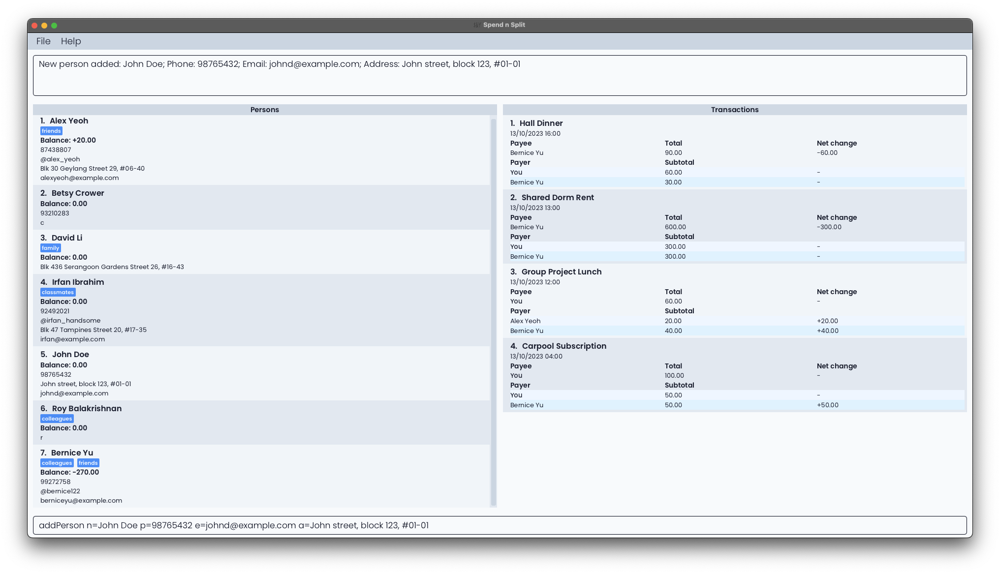

#### Edit your contacts with `editPerson`

Already have your friend's contact in the app, but need to update their contact information? Do so easily with the `editPerson` command.

Format: `editPerson INDEX [n=NAME] [p=PHONE] [tg=TELEGRAM_HANDLE] [e=EMAIL] [a=ADDRESS] [t=TAG]…​`

Need help with the formatting of commands? [Click here](#features)

<!-- would be nice to include how to "lookup" the index of the person. e.g. search for the person, then index = number on their card -->

* Replace `INDEX` with the index number of the contact you want to edit. You can find the index number in the Person List.
* You can edit one or more of the contact's details, such as name, phone number, Telegram handle, email, address, or tags.
* Existing values will be updated to the input values.
* When you edit tags, the existing tags will be replaced with the new ones you specify.

After the command has been executed, every person in the application will be displayed in the Person List.

Examples:

* `editPerson 1 p=90904139 e=aliceyu123@gmail.com`
    * This command changes the phone number and email address of the first contact to be 90904139 and aliceyu123@gmail.com, respectively.
* `editPerson 2 n=Betsy Crower t=`
    * This command changes the name of the second contact to Betsy Crower and clear all existing tags.

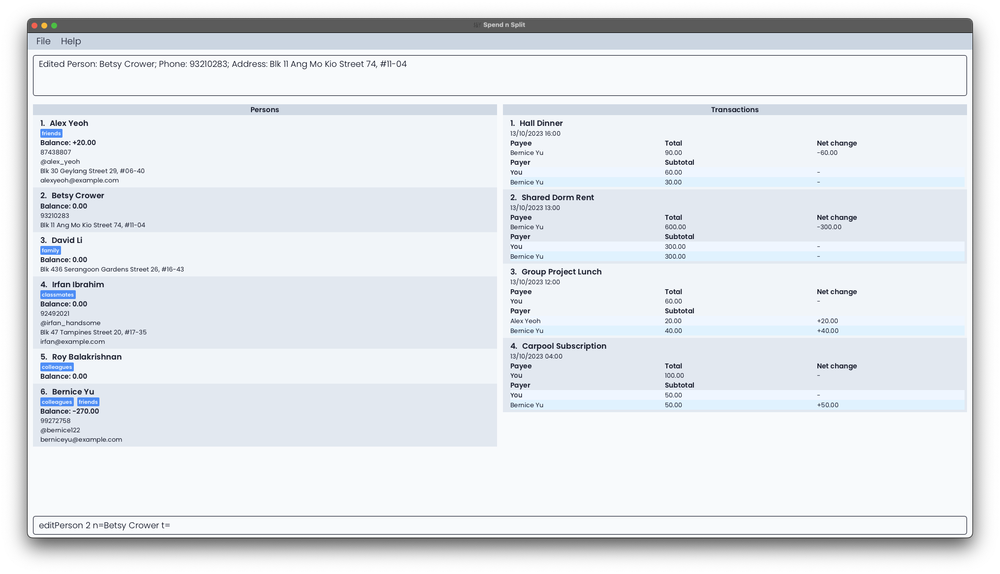

#### Delete a contact using `deletePerson`

Need to remove a contact from your list? Whether you want to declutter your contacts or remove someone for any other reason, `deletePerson` handles the task.

Format: `deletePerson INDEX`

Need help with the formatting of commands? [Click here](#features)

* Replace `INDEX` with the index number of the contact you want to edit. You can find the index number in the Person List.

Example: `deletePerson 1` 

This command deletes the first contact from the Person List. All your existing expenses involving that person will be updated accordingly in the Transaction List.

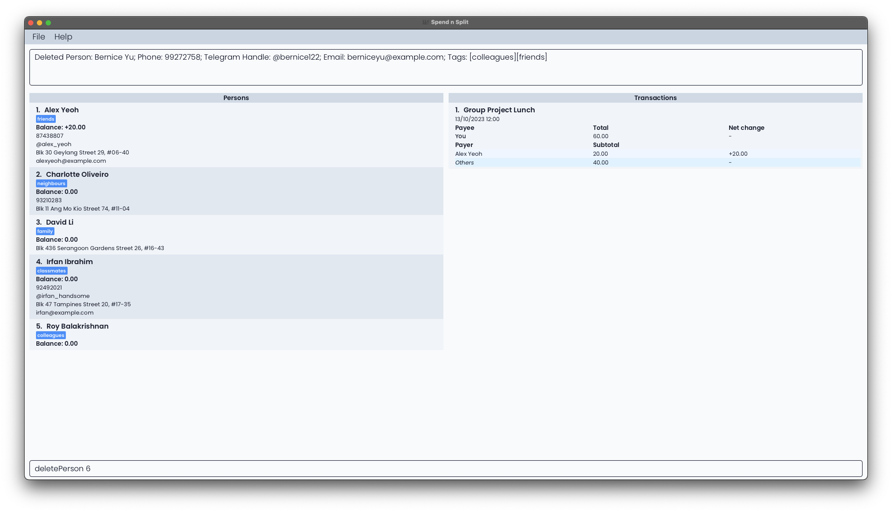

#### Find your contacts using `listPerson`

If you want to find specific contacts in your list, you can use the `listPerson` command. It helps you search for and list persons whose names contain certain keywords.

Format: `listPerson [KEYWORD]...`

Need help with the formatting of commands? [Click here](#features)

* You can enter one or more keywords separated by spaces to search for specific contacts. If no keywords are entered, all contacts will be displayed.
* The search is case-insensitive.
* It is considered a match if any of the words in the person's name is exactly the same as any of the given keywords. For instance, a person named `Han Junior` will not be displayed when you execute `listPerson Hans Hanzala` where the two given keywords are `Hans` and `Hanzala` 

Examples:

* `listPerson`
    * This command displays all of your contacts in the application.
* `listPerson alex david`
    * This command display all of your contacts with names that match at least one keyword, such as `Alex Yeoh` and `David Li`.

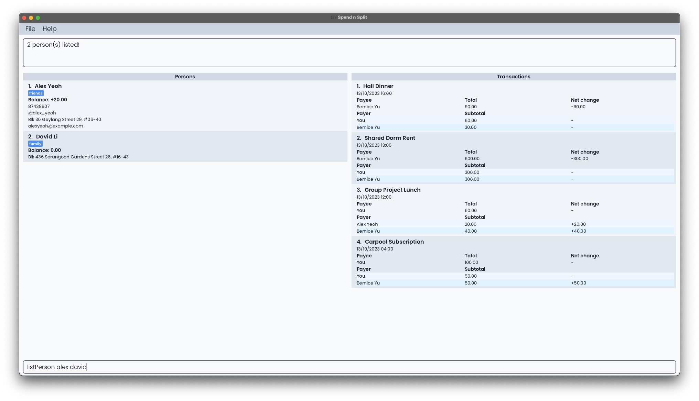

#### Order your contacts by their outstanding balance using `sortPerson`

You can sort your list of contacts in the application based on their outstanding balances, making it easy to identify who owes the most or the least amount of money. 

If someone has a negative balance, it means that you owe them money!

Format: `sortPerson ORDER`

Specify `ORDER` to indicate the sorting order:
  * Use `-` for ascending order (largest negative balance at the top).
  * Use `+` for descending order (largest positive balance at the top).

Examples:
* `sortPerson -`
    * This command will rearrange the Person List in ascending order of balances.
* `sortPerson +`
    * This command will rearrange the Person List in descending order of balances.

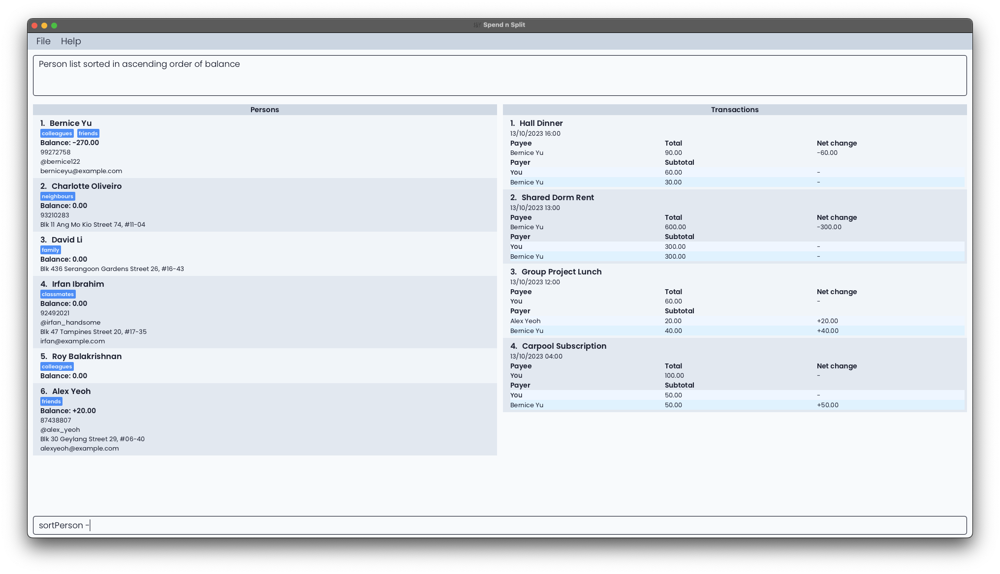
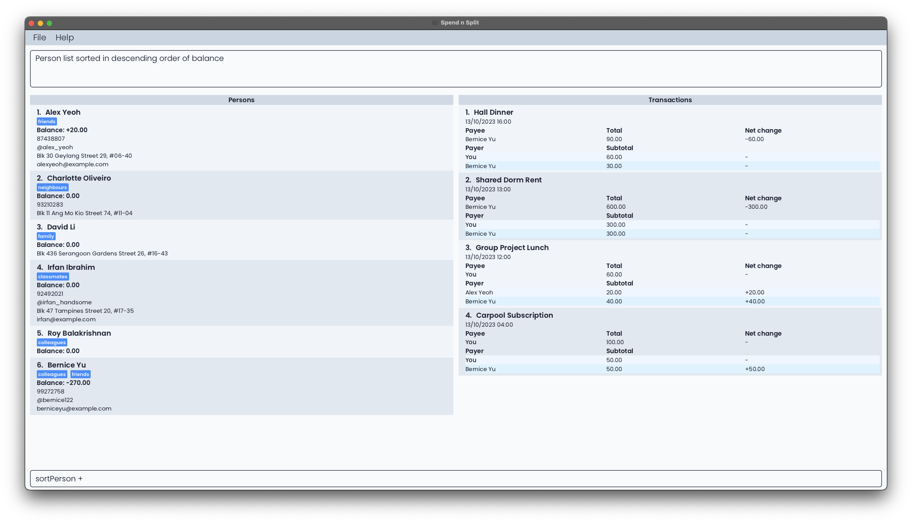

<div style="page-break-after: always;"></div>

### Transaction-related features

#### Create a new transaction with `addTransaction`

To easily keep track of a new transaction, simply use the addTransaction command.

Format: `addTransaction d=DETAILS n=NAME c=COST [ts=TIME] [n=NAME w=WEIGHT]...`

Need help with the formatting of commands? [Click here](#features)

- The first name refers to the payee (that is the person whom everyone else now owes money).
- If the timestamp is not provided, the default time is the current time on your computer.
- If only the date is given, the default time is set as `00:00`.
- If you want to reference yourself, use `n=Self`.
- The cost for each person is calculated as follows:
    - `Individual Cost = Total Cost * (Individual Weight / Total Weight)`

Examples:
* `addTransaction d=Rent n=David Li c=600 ts=10/10/2020 12:00 n=Self w=1 n=David Li w=1 n=Alex Yeoh w=1`
    * A transaction for rent that cost $600 is added. David Li paid for this transaction at 12pm on 10 October 2020. You (`Self`) and Alex Yeoh both owe David Li $200 (1/3 of $600) each.
* `addTransaction d=Dinner n=Self c=100 n=David Li w=2 n=Bernice Yu w=2 n=Alex Yeoh w=1`
    * A transaction for dinner that cost $100 is added. You (`Self`) paid for this transaction. David Li and Bernice Yu both owe you (`Self`) $40 (2/5 of $100) each, while Alex Yeoh owes you (`Self`) $20 (1/5 of $100).

Sample execution:

```
$ addTransaction d=Rent n=David Li c=600 ts=10/10/2020 12:00 
  n=Self w=1 n=David Li w=1 n=Alex Yeoh w=1
```

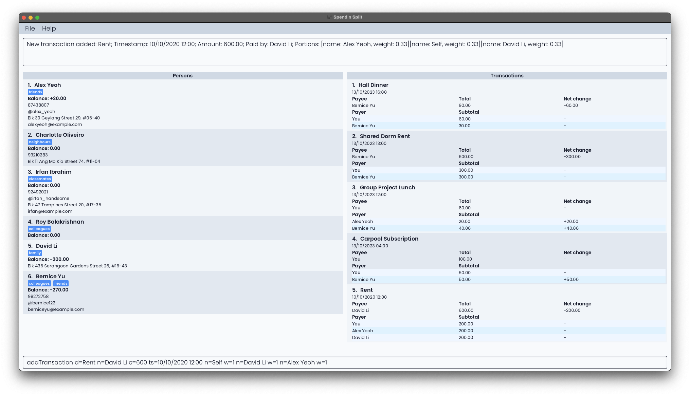

#### Update your transactions with `editTransaction`

Made a mistake and want to edit a transaction? Use the `editTransaction` command.

Transaction details that can be edited:

* Description
* Cost
* Payee
* Timestamp

Format: `editTransaction INDEX [d=DESCRIPTION] [c=COST] [n=PAYEE] [ts=TIME]`

Need help with the formatting of commands? [Click here](#features)


- The index refers to the index number shown in the displayed transaction list for the transaction you want to edit.
- At least one of the optional fields must be provided.
- If the timestamp is provided as a parameter but only the date is given, by default the time will be set to 00:00.

Examples:

* `editTransaction 1 c=100 ts=14/10/2023 17:00`
  * Edits the 1st transaction in the displayed list to have a cost of $100 and a timestamp of 14 October 2023, 5pm.

Sample Execution:

```
editTransaction 1 c=100 ts=14/10/2023 17:00
```

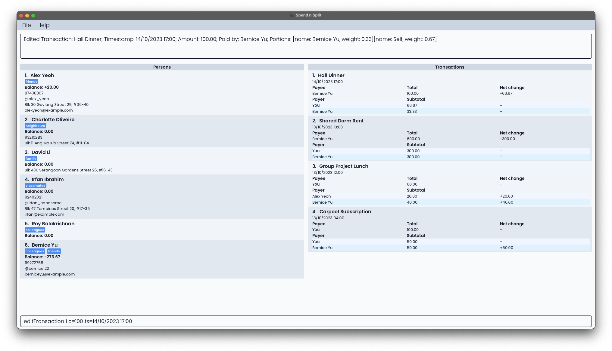

#### Delete a transaction with `deleteTransaction`

If you've added a transaction by mistake or no longer want to keep track of a transaction, you can remove it with `deleteTransaction`.

Format: `deleteTransaction INDEX`

Need help with the formatting of commands? [Click here](#features)

- The index refers to the index number shown in the displayed transaction list for the transaction you want to delete.

Examples:

* `deleteTransaction 1`
    * Deletes the 1st transaction in the displayed list.

Sample Execution:

```
$ deleteTransaction 1
```

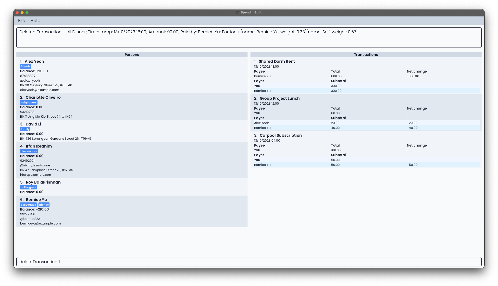

#### Duplicate transactions with `duplicateTransaction`

Have a recurring transaction involving the same group of people? Use the `duplicateTransaction` command.

Format: `duplicateTransaction INDEX`

Need help with the formatting of commands? [Click here](#features)

- The index refers to the index number shown in the displayed transaction list for the transaction you want to duplicate.
- The timestamp of the new transaction will be the current time on your computer. Otherwise, the rest of the transaction details will be the same as that of the original transaction.

Examples:

* `duplicateTransaction 1`
  * Creates a new transaction that is identical to the 1st transaction in the displayed list, except for the timestamp of the new transaction being the time at which this command was executed.

#### List your transactions with `listTransaction`

If you want to find specific transactions, you can use the `listTransaction` command.

Format: `listTransaction [KEYWORD]...`

Need help with the formatting of commands? [Click here](#features)

- You can enter one or more keywords separated by spaces to search for specific transactions by description. If no keywords are entered, all transactions will be listed.
- The search is case-insensitive, meaning that `lunch` will match `Lunch`.
- Keep in mind that only the entire keyword will be matched. For instance, a transaction with description `fast` will not be displayed when you execute `listTransaction breakfast`.
- It is a match if any of the words in a name is exactly the same as any of the keywords.
- If a transaction's description matches at least one keyword, they will be displayed.

Examples:

* `listTransaction`
    * Shows all transactions.
* `listTransaction Lunch Dinner`
    * Shows all transactions with descriptions include either the keyword "Lunch", "Dinner", or both.

#### Settle your balances with`settlePerson`

Just settled your balance with a person? Use the `settlePerson` command to record it.

Format: `settlePerson INDEX`

Need help with the formatting of commands? [Click here](#features)

- The index refers to the index number shown in the displayed person list for the person with whom you want to settle your balance.

Example:

*  `settlePerson 1`
    *  Now, a new transaction is added so that your outstanding balance with the person at index 1 is 0.

<div style="page-break-after: always;"></div>

### Other features

#### Create command shortcuts using `setShorthand`

Do you find yourself typing too much on long commands? Make things faster with `setShorthand`. Replace your most used commands with shorter aliases to make life easy and save time.

Format: `setShorthand o=ORIGINAL_COMMAND s=SHORTHAND`

Need help with the formatting of commands? [Click here](#features)

Example:

* `setShorthand o=addTransaction s=at`

Now, you can just type `at` to use the `addTransaction` command to save time!

For example, you can now type `at d=Lunch n=Self c=1 n=Bob w=1` in place of `addTransaction d=Lunch n=Self c=1 n=Bob w=1`.

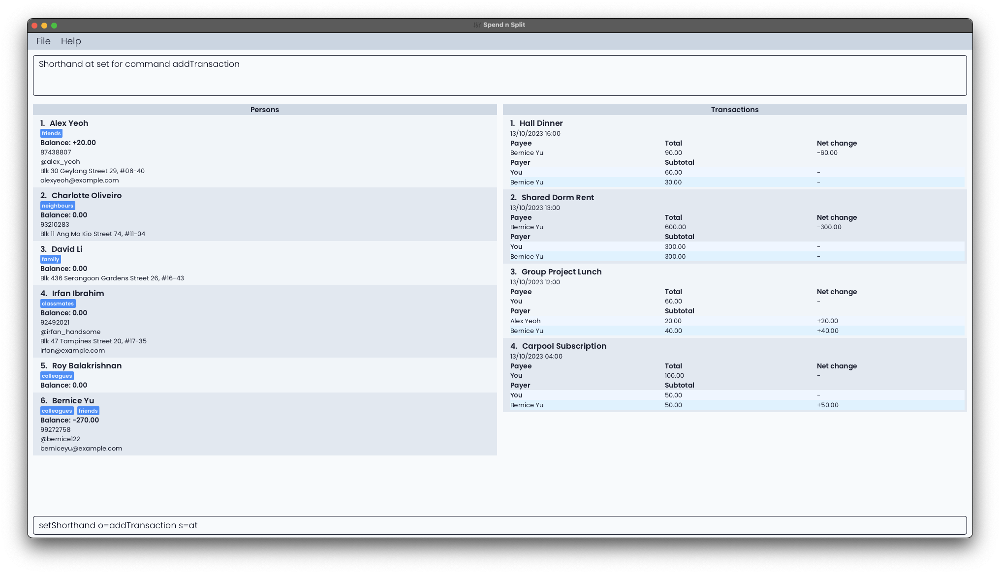

#### Use `help` to find our User Guide

Stuck with any of our features? Use the `help` command to link you to our extensive user guide to find any information you need about Spend N Split.

Format: `help`

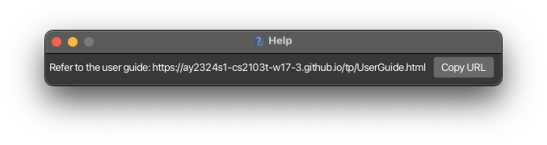

#### Reset your data using `clear`

Clears all entries from the application.

Format: `clear`

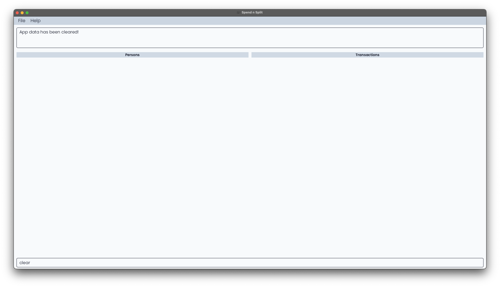

#### Leaving Spend N Split? Use `exit`

After managing your contacts and transactions, type `exit` to close Spend N Split.

Format: `exit`

#### Navigating the app using only the keyboard
You can use the following shortcuts to navigate our application:
- Selecting Result Display: [<kbd>ALT</kbd> (Windows/Linux) / <kbd>OPTION</kbd> (Mac)] + <kbd>UP ARROW KEY</kbd>
- Selecting Persons List: [<kbd>ALT</kbd> (Windows/Linux) / <kbd>OPTION</kbd> (Mac)] + <kbd>LEFT ARROW KEY</kbd>
- Selecting Transactions List: [<kbd>ALT</kbd> (Windows/Linux) / <kbd>OPTION</kbd> (Mac)] + <kbd>RIGHT ARROW KEY</kbd>
- Selecting Command Box: [<kbd>ALT</kbd> (Windows/Linux) / <kbd>OPTION</kbd> (Mac)] + <kbd>DOWN ARROW KEY</kbd>

For our result display, persons list and transaction list, once selected, you can use the <kbd>UP ARROW KEY</kbd> or <kbd>DOWN ARROW KEY</kbd> for scrolling.

--------------------------------------------------------------------------------------------------------------------

## Data

### Saving your data

Spend N Split automatically saves your data every time you run a command that affects it. This means your changes are always up to date in the application's data file. With Spend N Split, there's no need to save manually.

### Editing the data file

Feel free to check out your data within Spend N Split's file directory at `/data/spendnsplitbook.json`. The JSON file contains your data in a user-friendly format for you to edit.

<br>
<div markdown="span" class="alert alert-danger">
:heavy_exclamation_mark: However, be warned that the application may wipe your data or behave unexpectedly if the data is not edited correctly.
</div>

--------------------------------------------------------------------------------------------------------------------

<div style="page-break-after: always;"></div>

## Features Summary

Want to view all feautres in detail and learn about the format syntax? Check out our [Features](#features)!

[Need help understanding the parameters?](#parameters)


| Feature                | Format                                                                                     |
|------------------------|--------------------------------------------------------------------------------------------|
| [Add a contact](#add-your-friends-as-contacts-using-addperson)            | `addPerson n=NAME [p=PHONE] [tg=TELEGRAM_HANDLE] [e=EMAIL] [a=ADDRESS] [t=TAG]…​`          |
| [Edit a contact](#edit-your-contacts-with-editperson)           | `editPerson INDEX [n=NAME] [p=PHONE] [tg=TELEGRAM_HANDLE] [e=EMAIL] [a=ADDRESS] [t=TAG]…​` |
| [Delete a contact](#delete-a-contact-using-deleteperson)         | `deletePerson INDEX`                                                                       |
| [List your contacts](#find-your-contacts-using-listperson)           | `listPerson [KEYWORD]...`                                                                  |
| [Sort your contacts](#order-your-contacts-by-their-outstanding-balance-using-sortperson)           | `sortPerson ORDER`                                                                         |
| [Add a transaction](#create-a-new-transaction-with-addtransaction)       | `addTransaction d=DETAILS n=NAME c=COST [ts=TIME] [n=NAME w=WEIGHT]...`                    |
| [Edit a transaction](#update-your-transactions-with-edittransaction)    | `editTransaction INDEX [d=DESCRIPTION] [c=COST] [n=PAYEE] [ts=TIME]`                                                                  |
| [Delete a transaction](#delete-a-transaction-with-deletetransaction)    | `deleteTransaction INDEX`                                                                  |
| [Duplicate a transaction](#duplicate-transactions-with-duplicatetransaction) | `duplicateTransaction INDEX`                                                               |
| [List your transactions](#list-your-transactions-with-listtransaction)      | `listTransaction [KEYWORD]...`                                                 |
| [Settle your balances](#settle-your-balances-withsettleperson)        | `settlePerson INDEX`                                                             |
| [Create command shortcuts](#create-command-shortcuts-using-setshorthand)         | `setShorthand o=ORIGINAL_COMMAND s=SHORTHAND`                                              |
| [Get help](#use-help-to-find-our-user-guide)                 | `help`                                                                                     |
| [Clear your data](#reset-your-data-using-clear)                | `clear`                                                                                    |
| [Exit SNS](#leaving-spend-n-split-use-exit)                 | `exit`                                                                                     |


--------------------------------------------------------------------------------------------------------------------

## Acknowledgements

We would like to acknowledge the following third-party libraries, frameworks and sources for their use in Spend N Split:

**Development**

* **[Jackson](https://github.com/FasterXML/jackson)**: The Java JSON library for parsing and creating JSON for Spend N Split.

* **[JUnit 5](https://junit.org/junit5/)**: The Java testing framework of Spend N Split.

* **[Apache Common Numbers](https://github.com/apache/commons-numbers/tree/master)**: The Java numbers library that enhance Spend N Split's precision.

**Gradle**

* **[Checkstyle](https://docs.gradle.org/current/userguide/checkstyle_plugin.html)**: The Gradle plugin that ensures consistent and appropriate code style.

* **[Shadow](https://github.com/johnrengelman/shadow)**: The Gradle plugin for creating fat JARs for Spend N Split.

* **[Jacoco](https://github.com/palantir/gradle-jacoco-coverage)**: The Gradle plugin for generating code coverage reports.

**User Interface**

* **[JavaFX](https://openjfx.io/)**: The GUI framework of Spend N Split.

* **[Poppins Font](https://fonts.google.com/specimen/Poppins)**: The primary font used in Spend N Split.

* **[Tailwind CSS Colors](https://tailwindcss.com/docs/customizing-colors)**: The colour palette that inspired the Spend N Split colour scheme.

**Others**

* **[Address Book 3](https://se-education.org/addressbook-level3/)**: The project Spend N Split is based on.

* **[Jekyll](https://github.com/jekyll/jekyll)**: The static site generator that converts Spend N Split markdown documentation into web pages.

--------------------------------------------------------------------------------------------------------------------

<div style="page-break-after: always;"></div>

## Glossary
#### Address
The particulars of the place where a person lives.
#### Alphanumeric
Consisting of only letters (a-z, A-Z) or numbers or both.
#### Amount
The total value of the transaction.
#### Balance
The amount of money that you owe a person or the amount of money that they owe you. A positive balance under a person
means that they owe you money, whereas a negative balance means that you owe them money.
#### Card
A rectangular area in our application that either describes the full details of a transaction or person.
#### Command
To use and control the application, commands are necessary. To utilise a feature, a command has to be typed into the Command Input Field and executed.
#### Cost
The total value of the transaction.
#### Description
A written account of a transaction, used to provide context and details about the transaction.
#### Email address
A unique identifier for an email account. It identifies an email box to which messages and emails are delivered.
#### Field
An area where text can be input.
#### Flag
Flags are used to modify the operation of a command.
#### GUI
GUI stands for Graphical User Interface. A Graphical User Interface uses icons and mouse inputs from users to allow them to interact with the application.
#### Index
A number representing the position of an item in a list.
#### Integer
A number that is a not a fraction. E.g. whole numbers such as -10, 0, 1, 5.
#### Keyword
An important word that is used by the application to process various commands.
#### Name
A word or set of words that are used to address or refer to a person.
#### Negative
A numerical value that is less than 0.
#### Parameter
An additional input that provides further details on a command that a user is executing.
#### Payee
Refers to the person that paid for the transaction.
#### Payer
Refers to a person that owes the payee money for the transaction.
#### People
Used to refer to multiple persons. Can be used interchangeably with "persons".
#### Person
An individual that can be associated with various information in our application, such as contact information and balances.
#### Phone number
A sequence of digits that is dialled on a telephone to contact a person.
#### Portion
A subset of a transaction. A transaction is split into multiple portions.
#### Positive
A numerical value that is greater than 0.
#### Settle
Refers to the act of two people exchanging money, such that their respective balances with each other equal zero after the transaction.
#### Shorthand
A shortened version of a command.
#### Tag
A label that can be applied to a person to provide additional details about them.
#### Telegram handle
A unique identifier for a Telegram account. E.g. @ryanlim123
#### Timestamp
Refers to the time the transaction occurred. Timestamps in our application are displayed in the `DD/MM/YYYY HH:MM` format. `DD` refers to Day, `MM` refers to Month,
`YYYY` refers to Year, `HH` refers to the 24-hour notation for Hour, and `MM` refers to Minute.
#### Transaction
An interaction of buying or selling something where the exchange of money occurs.
#### Weight
A numerical value assigned to each person that is involved in a transaction. It is used to calculate the amount of money that
a person should pay for their share of the transaction.

--------------------------------------------------------------------------------------------------------------------
