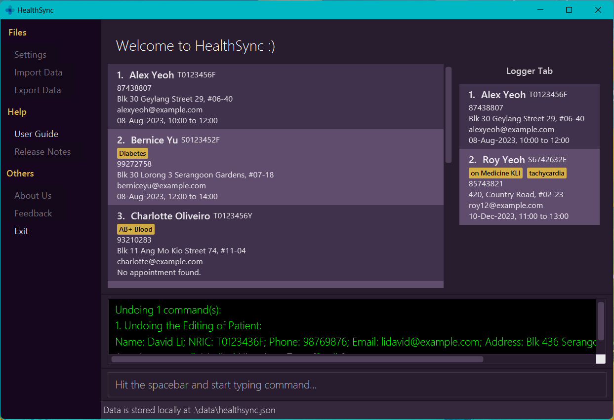

# HealthSync

HealthSync is a **powerful desktop application designed specifically for clinic assistants in small private clinics.**
It offers a unique combination of a Command Line Interface (CLI) and a Graphical User Interface (GUI) to efficiently
manage and organize patient details. If you're a fast typist, HealthSync can streamline your workflow and help you
handle patient information more effectively than traditional GUI apps.

* If you are interested in using HealthSync, head over to the [_Quick Start_ section of the **User Guide**](UserGuide.html#quick-start).
* If you are interested about developing HealthSync, the [**Developer Guide**](DeveloperGuide.html) is a good place to start.

**Acknowledgements**

* Libraries used: [JavaFX](https://openjfx.io/), [Jackson](https://github.com/FasterXML/jackson), [JUnit5](https://github.com/junit-team/junit5)
