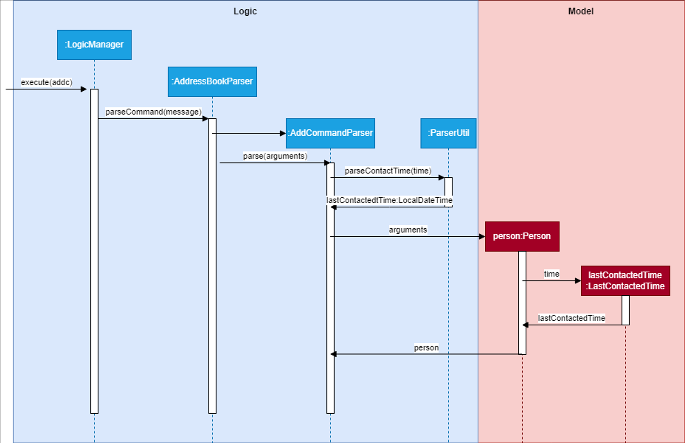
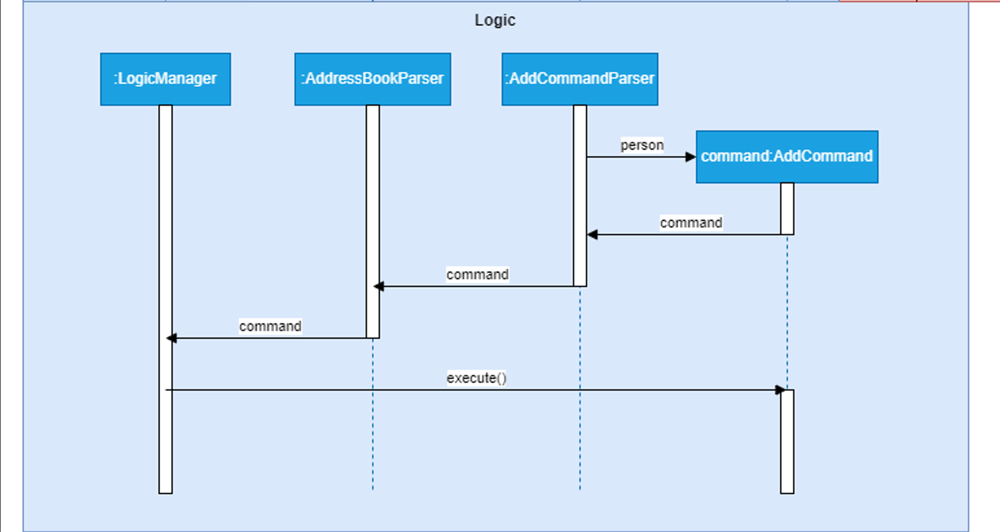

### Project: OutBook

OutBook is a desktop application designed for freelance insurance agents, enabling them to effectively organize and oversee their extensive contacts and meeting schedules. Users can link their contacts to their meetings, to keep track of the people attending these meetings.

My contributions to the project are listed below.

- **Code contributed**: [RepoSense link](https://nus-cs2103-ay2324s1.github.io/tp-dashboard/?search=juzzztinsoong&breakdown=true)

- **New Features**:

  - Added `LastContactedTime` field to Person (Pull Request [#90](https://github.com/AY2324S1-CS2103T-F12-4/tp/pull/90))
    - What it does: Allows a user to add a Person's last contacted time when creating or editing a contact. This allows the user to keep track of uncontacted clients.
    - Justification: This allows for the completion of meetings to automatically update a Person's LastContactedTime field to the time of the meeting.
    - Highlights: Implementation of this feature required extensive modification to the Model and Storage components, with many predicate classes having to be added to increase coupling and reduce cohesion within the app.

  - Implemented Delete Meetings Command: `deletem` (Pull Request [#58](https://github.com/AY2324S1-CS2103T-F12-4/tp/pull/58))
    - Justification: There may be various reasons for a user to delete a meeting, such as cancellation.

- **Project management**:

  - Forking workflow
    - Contributed issues
    - Review and merge pull requests
  - Reviewing documentation

- **Enhancements to existing features**:

  - Added utility method `TitleContainsKeywordsPredicate`. (Pull Request [#58](https://github.com/AY2324S1-CS2103T-F12-4/tp/pull/58))
    - What it does: Enables filtering of meetings by matching keywords to the meetings' title.
    - Justification: Lays the groundwork for the `findm` find meeting command, where users can use fields such as title, time, location, tags or attendees to search for a specific meeting.
  - Configured storage to use a different file to store user data. (Pull Request [#156](https://github.com/AY2324S1-CS2103T-F12-4/tp/pull/156))

- **Documentation**:

  - User Guide
    - Added documentation for `deletem`.
    - Updated documentation for the following features: `addc`, `editc` and `addm`.
    - Modifed large parts of documentation to ensure coherence and consistency with codebase.
  - Developer Guide
    - Added implementation notes and diagram for `LastContactedTime` field
    - Non-functional Requirements
    - Glossary

## Contributions to the Developer Guide (Extracts):
- Added documentation for implementation of `LastContactedTime` object:

### Keeping track of last meeting with contact

Keeping track of the user's last meeting with their contact is facilitated by the addition of a `LastContactedTime` object to `Person`.
Thus, each instance of `Person` will contain an immutable `LastContactedTime` object that stores the user's last meeting with that contact.
The following steps shows how `LastContactedTime` is implemented and utilized in the application.

Step 1. The user inputs the `addc` command into the `CommandBox` input field, with the added field `l/[LAST_CONTACTED_TIME]`.

The following diagram summarizes steps 2 to 6:

Step 2. Entering a correct command with the `Enter` key then calls `execute` on `LogicManager`.

Step 3. `LogicManager` then calls `AddressBookParser#parseCommand(commandText)` on the `commandText` String, which recognizes that it is an `addc` command.

Step 4. `AddressBookParser` then calls `AddCommandParser#parse()` on the command arguments.

Step 5. `AddCommandParser` then calls `ParserUtil#parseContactTime()` which parses the last contacted time and returns a `LocalDateTime` object called `lastContactedTime`.

Step 6. The `lastContactedTime` object is then passed to the `Person` constructor, which creates a new `Person` that calls the `LastContactedTime` constructor with it.

The following diagram summarizes steps 7 and 8:

Step 7. The completed `Person` is passed to an `AddCommand` constructor which return a new `AddCommand` that can be executed.

Step 8. `LogicManager` then executes the `AddCommand` on the application model.

Step 9. Further execution is carried out, which like before adds the `Person` object to the list of `Person`s in the `Model`, and updates the `Storage` with this new `Person`.

#### Design Consideration: Updating last meeting with contact

Solution:
This is facilitated by the addition of the `MarkDoneCommand`. When a meeting is marked as done, the attendees of the meeting will be updated with their LastContactedTime field updated to the end time of the meeting.

---

- Added documentation for Non-Functional Requirements:

### Non-Functional Requirements

**Performance**

1.  Should be able to respond to user input within 2 seconds under normal operating conditions.
2.  Should be able to handle a database of up to 1000 contacts and 500 meetings without a significant performance degradation.

**Reliability**

1.  Data integrity should be ensured under any usage conditions through automatic data backup.

**Usability**

1.  A user with above average typing speed for regular English text (i.e. not code, not system admin commands) should be able to accomplish most of the tasks faster using commands than using the mouse.
2.  Application GUI should be intuitive wherever possible, to reduce training for new users.

**Documentation**

1.  User documentation should include a comprehensive user manual.
2.  Developer documentation should cover the architecture, code structure, and guidelines for future development.

**Compatibility**

1.  Should work on any _mainstream OS_ as long as it has Java `11` or above installed.

---

- Added documentation for Glossary:

### Glossary

- **User Interface (UI)**: The point of interaction between a user and a software application, with both graphical and non-graphical elements.
- **Application Programming Interface (API)**: A set of rules and tools allowing different software applications to communicate and exchange information.
- **Command Line Interface (CLI)**: A text-based interface for interacting with a computer program or operating system, where users enter commands.
- **Graphical User Interface (GUI)**: A visual interface using graphical elements like windows, icons, and buttons for user interaction with a software application.
- **Mainstream OS**: Windows, Linux, Unix, OS-X
- **Private contact detail**: A contact detail that is not meant to be shared with others

## Contributions to the User Guide (Extracts):
- Added documentation for `deletem`:

### Deleting a meeting : `deletem`

Deletes a meeting from OutBook.

Format: `deletem INDEX`

- Deletes the meeting at the specified `INDEX`.
- The `INDEX` refers to the index number shown in the displayed meeting list.
- The `INDEX` **must be a positive integer** such as 1, 2, 3, …​
- This command clears the meeting that is currently displayed via the `viewm` command.

Examples:
- `listm` followed by `deletem 2` deletes the 2nd meeting in the results of the `listm` command.
- `findm m/Project` followed by `deletem 1` deletes the 1st meeting in the results of the `findm` command.

---

- Rewrote notes about command format for greater readability:

**:information_source: Notes about the command format:** 

- Every word in uppercase represents a field you can supply. 
  e.g. in `addc n/NAME`, `NAME` is a parameter that can be substituted for `John Doe`, as in `addc n/John Doe`.

- Fields contained in square brackets are optional. 
  e.g. when provided with the fields `n/NAME [t/TAG]`, you can submit `n/John Doe t/friend` if you want to mark this contact as a `friend`, or `n/John Doe` otherwise.

- Fields with `…`​ after them can be submitted any number of times, including zero. 
  e.g. when provided with the field `[t/TAG]…​`, you can leave the field blank, or submit `t/friend`, `t/friend t/family`, etc.

- You can submit fields in any order. 
  e.g. if the command specifies `n/NAME p/PHONE_NUMBER`, submitting in the format `p/PHONE_NUMBER n/NAME`, such as in `p/91472381 n/John Doe`, is also acceptable.

- If you are using a PDF version of this document, be careful when copying and pasting commands that span multiple lines. This is to avoid deletion of space characters surrounding line-breaks when lengthy text is copied over to the application.

