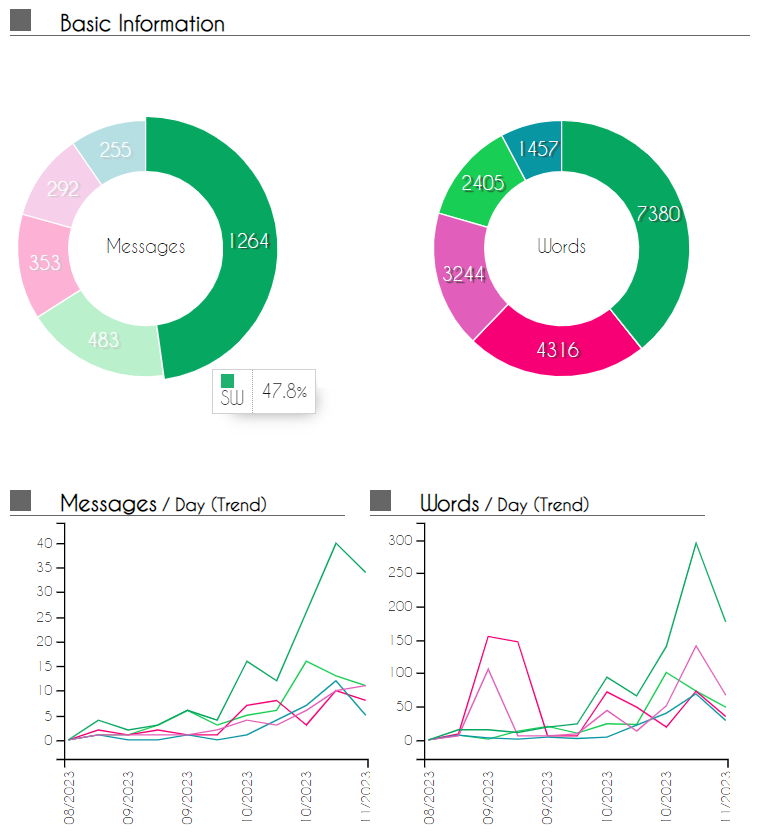

### Project: Connectify

Connectify is a desktop app for managing clients. Connectify helps salespersons manage their clients information records and data, boosting their efficiency in building customer relationships! It has GUI created with JavaFX, and is written in OOP fashion with about 6kLoC of additions above [se-edu AB3](https://github.com/se-edu/addressbook-level3).

Given below are my contributions to the project.

* **New Feature**: Added the logic to keep track of past interactions with clients.
  * What it does: allows the user to keep notes of their interactions with clients, when they happened, and a tag for the general outcome of it.
  * Justification: This feature is a core part of what makes a customer relations manager (CRM) apps work! Remembering the past interactions with clients, so that the user can better manage their relationship with them.
  * Highlights: This enhancement requires composition of many classes, and to display them in a list. The implementation required some thorough planning and incremental design approaches as I also had to integrate the feature with the reminder/follow-ups feature. (Pull requests [\#30](https://github.com/AY2324S1-CS2103T-F11-4/tp/pull/30), [\#67](https://github.com/AY2324S1-CS2103T-F11-4/tp/pull/67), [\#74](https://github.com/AY2324S1-CS2103T-F11-4/tp/pull/74))
  * Highlights: The feature was also made with user experience in mind, and the implementation of "no prefixes needed for notes" and "only either outcome or note is needed" without major bugs took careful and defensive coding. (Pull request [\#49](https://github.com/AY2324S1-CS2103T-F11-4/tp/pull/49))
  * This also required the ability to store the data in a file. It was also a good opportunity to learn about how to store data in a file, and how to read it back. (Pull request [\#94](https://github.com/AY2324S1-CS2103T-F11-4/tp/pull/94))
  * Credits: Tester-D for suggesting interaction outcomes to be not case sensitive. [\#164](https://github.com/AY2324S1-CS2103T-F11-4/tp/issues/164) Which was fixed in (Pull request [\#185](https://github.com/AY2324S1-CS2103T-F11-4/tp/pull/185))

* **New Feature**: Single field Edit macro
  * What it does: QoL change that allows the user to edit a single field of a client. By entering it as a command word.
  * Justification: This feature is a QoL change that allows the user to edit a single field of a client without having to re-enter all the other fields and remember prefixes. This is especially useful when the user only wants to change a single field of a client.
  * Highlights: This change was *efficiently accomplished* with very few lines of code, rather than having to create a new command class for each field, I was able to reuse the existing edit command class to parse new command words. (Pull requests [\#126](https://github.com/AY2324S1-CS2103T-F11-4/tp/pull/126))

* **New Feature**: Reminder Scheduler logic and Reminders
  * What it does: Automatically update reminders for follow-ups with clients every day. Reminders are displayed in the Dashboard GUI. 
  * Justification: This feature is another core part of what makes CRMs apps work! Remembering to follow-up with clients is a key part of maintaining a good relationship with them and ensuring you don't miss out by forgetting to contact your clients.
  * Highlights: This enhancement required coordination with my teammate @lilozz2 who was working on reminders in parallel. I became accustomed to a different workflow of pulling from a teammates branch into a local fork and have gotten very accustomed to handling merge conflicts and resolving them. I also learnt how to use schedulers and threads to implement the reminder scheduler.
  * Credits: The implementation of the reminder was first done by @lilozz2 however there were some bugs with the implementation. I fixed the bugs and refactored the code to make it more readable and maintainable. (Pull requests [\#107](https://github.com/AY2324S1-CS2103T-F11-4/tp/pull/107), [\#108](https://github.com/AY2324S1-CS2103T-F11-4/tp/pull/108), [\#112](https://github.com/AY2324S1-CS2103T-F11-4/tp/pull/112))

* **Code contributed**: [RepoSense link](https://nus-cs2103-ay2324s1.github.io/tp-dashboard/?search=&sort=totalCommits&sortWithin=title&timeframe=commit&mergegroup=&groupSelect=groupByRepos&breakdown=true&checkedFileTypes=docs~functional-code~test-code~other&since=2023-09-22&tabOpen=true&tabType=authorship&tabAuthor=MagnificentCreature&tabRepo=AY2324S1-CS2103T-F11-4%2Ftp%5Bmaster%5D&authorshipIsMergeGroup=false&authorshipFileTypes=docs~functional-code~test-code~other&authorshipIsBinaryFileTypeChecked=false&authorshipIsIgnoredFilesChecked=false%23%2F)

* **Project management**:
  * Format and scribe team meetings in the [team documents](https://docs.google.com/document/d/19_MucS0CbX5lCY85W4KqxPklLnlXyDYzFvD9ZsseDIc/edit?usp=sharing)
  * Set-up and compiled ~68% of bug reports from the mock PE into the [team documents](https://docs.google.com/document/d/19_MucS0CbX5lCY85W4KqxPklLnlXyDYzFvD9ZsseDIc/edit?usp=sharing) while discussing with the team
  * Create milestones and prepare project for submission (Pull request [\#50](https://github.com/AY2324S1-CS2103T-F11-4/tp/pull/50))

* **Enhancements and Bug fixes**:
  * Discover and fix bugs. (Pull requests [\#52](https://github.com/AY2324S1-CS2103T-F11-4/tp/pull/52), [\#99](https://github.com/AY2324S1-CS2103T-F11-4/tp/pull/99), [\#120](https://github.com/AY2324S1-CS2103T-F11-4/tp/pull/120), [\#122](https://github.com/AY2324S1-CS2103T-F11-4/tp/pull/122), [\#135](https://github.com/AY2324S1-CS2103T-F11-4/tp/pull/135), [\#216](https://github.com/AY2324S1-CS2103T-F11-4/tp/pull/216))
  * Improve code quality and refactoring upon self-source or teammates suggestions (Pull requests [\#111](https://github.com/AY2324S1-CS2103T-F11-4/tp/pull/111), [\#116](https://github.com/AY2324S1-CS2103T-F11-4/tp/pull/116), [\#197](https://github.com/AY2324S1-CS2103T-F11-4/tp/pull/197), [\#213](https://github.com/AY2324S1-CS2103T-F11-4/tp/pull/213), [\#217](https://github.com/AY2324S1-CS2103T-F11-4/tp/pull/217))
  * Wrote additional tests for existing features to increase coverage from 61% to 70% as well as additional defensive programming (Pull request [\#185](https://github.com/AY2324S1-CS2103T-F11-4/tp/pull/185), [\#197](https://github.com/AY2324S1-CS2103T-F11-4/tp/pull/197), [\#199](https://github.com/AY2324S1-CS2103T-F11-4/tp/pull/199))
  * Credits: Tester C and E for finding bug [\#156](https://github.com/AY2324S1-CS2103T-F11-4/tp/issues/156) and [\#158](https://github.com/AY2324S1-CS2103T-F11-4/tp/issues/158), fixed in (Pull request [\#190](https://github.com/AY2324S1-CS2103T-F11-4/tp/pull/190))

* **Documentation**:
  * User Guide:
    * Added documentation for the features `interaction` and `edit single field` (Pull requests [\#31](https://github.com/AY2324S1-CS2103T-F11-4/tp/pull/31), [\#68](https://github.com/AY2324S1-CS2103T-F11-4/tp/pull/68), [\#194](https://github.com/AY2324S1-CS2103T-F11-4/tp/pull/194))
    * Documented known issues [\#215](https://github.com/AY2324S1-CS2103T-F11-4/tp/issue/215) and [\#219](https://github.com/AY2324S1-CS2103T-F11-4/tp/issues/219) (Pull request [\#216](https://github.com/AY2324S1-CS2103T-F11-4/tp/pull/216), [\#220](https://github.com/AY2324S1-CS2103T-F11-4/tp/issues/220))
    * Improved readability and user friendliness by restructuring and tweaking the user guide (Pull request [\#194](https://github.com/AY2324S1-CS2103T-F11-4/tp/pull/194), [\#202](https://github.com/AY2324S1-CS2103T-F11-4/tp/pull/202))
    * Added the ***If you're new*** sections and other tips which to help less technical readers (Pull request [\#194](https://github.com/AY2324S1-CS2103T-F11-4/tp/pull/194), [\#207](https://github.com/AY2324S1-CS2103T-F11-4/tp/pull/207), [\#218](https://github.com/AY2324S1-CS2103T-F11-4/tp/pull/218))
    * Added ***Glossary*** section to define technical terms used in the UG [\#220](https://github.com/AY2324S1-CS2103T-F11-4/tp/issues/220) 
  * Developer Guide:
    * Added user stories [\#16](https://github.com/AY2324S1-CS2103T-F11-4/tp/pull/16)
    * Added simple uses cases for adding `interaction` and marking `lead` [\#22](https://github.com/AY2324S1-CS2103T-F11-4/tp/pull/22)  
    * Added implementation details of the `interaction` feature (Pull request [\#78](https://github.com/AY2324S1-CS2103T-F11-4/tp/issues/78))
    * Tweaked Model diagram to be less complex and more comprehensible (Pull request [\#221](https://github.com/AY2324S1-CS2103T-F11-4/tp/issues/221))

* **Community**:
  * Some PRs reviewed (with review comments): [\#29](https://github.com/AY2324S1-CS2103T-F11-4/tp/pull/29), [\#85](https://github.com/AY2324S1-CS2103T-F11-4/tp/pull/85), [\#178](https://github.com/AY2324S1-CS2103T-F11-4/tp/pull/178), but most reviews were done in telegram chat or zoom with my teammates, especailly if I found bugs after merging code
  * Constantly engage groupmates with discussions and meetings for and on the project
  * Contributed to forum discussions (examples: [10](https://github.com/nus-cs2103-AY2324S1/forum/issues/10), [119](https://github.com/nus-cs2103-AY2324S1/forum/issues/119), [132](https://github.com/nus-cs2103-AY2324S1/forum/issues/132), [235](https://github.com/nus-cs2103-AY2324S1/forum/issues/235), [449](https://github.com/nus-cs2103-AY2324S1/forum/issues/449))
  * Helped members in other teams with bug fixes, suggestions to improve app and smoke testing. 

* **Tools**:
  * Integrated codecov to the team repo
