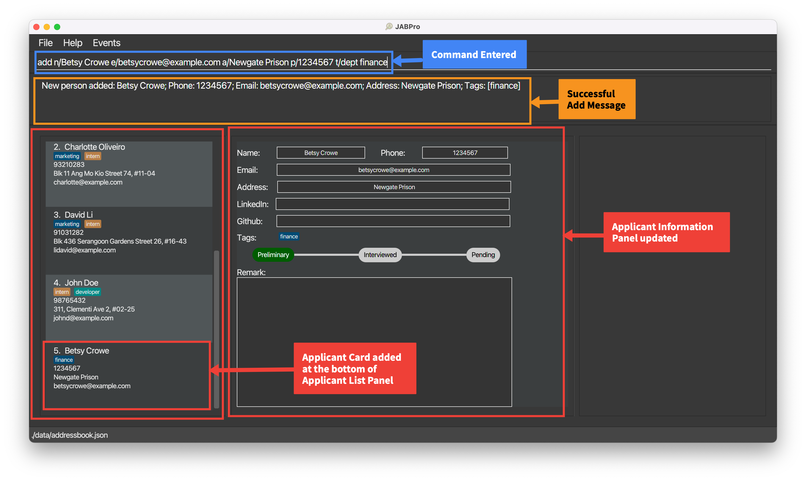
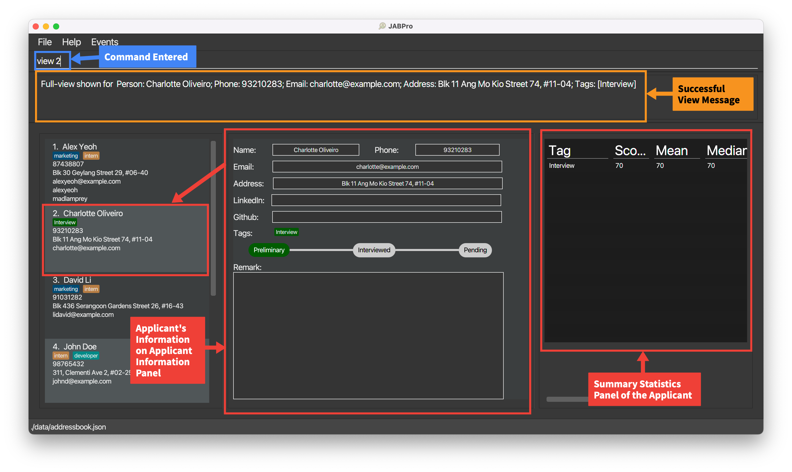

# Project: JABPRO

## Overview
JABPro aims to solve the problem of HR managers having to manage and sort through tons of job applications.  
The problem that we have identified included:
1. Visual Noise and Clutter (Through the use of Excel or other programmes where rows of data are displayed)
2. Lack of a way to easily compare candidates (Having to manually compare rows of data or need to search up statistical formulas)  
The features that I have implemented to tackle these problems are:
1. `view` command to view a candidate's details in a separate panel (to reduce visual noise and clutter) whereby the candidate's details are displayed in full in a very organised and formatted manner.  
This creates a very clean and organised view for the user to easily read and process the information stored for the viewed person.   
2. `filter` command to filter candidates based on statistical metrics and values. Whereby the user can filter and display candidates whose value is greater than or equal to the specified value for the specified statistic metric.
This allows the user to easily compare candidates based on their performance for a particular tag. We use tag as a way to tag assessments that the candidate has taken. This allows the user to easily compare candidates based on their performance for a particular assessment.
  
Thereby additional enhancement that I have implemented to support filter to support `Score` and `ScoreList` are:
1. Overloading the current `edit` command to edit the score of a candidate for a particular assessment.
2. Summary Statistic

## Summary of Contributions
**Code contributed**: [RepoSense link](https://nus-cs2103-ay2324s1.github.io/tp-dashboard/?search=sk2001git&sort=groupTitle%20dsc&sortWithin=title&since=2023-09-22&timeframe=commit&mergegroup=&groupSelect=groupByRepos&breakdown=false&tabOpen=true&tabType=authorship&tabAuthor=sk2001git&tabRepo=AY2324S1-CS2103T-W09-4%2Ftp%5Bmaster%5D&authorshipIsMergeGroup=false&authorshipFileTypes=docs&authorshipIsBinaryFileTypeChecked=false&authorshipIsIgnoredFilesChecked=false)

**Enhancement implemented**:
* `remark`, `edit`(for scores portion) , `filter`, `view` command and features
* `Score`, `ScoreList`, `Remark` and its relevant storing and parsing of data
* Summary Statistic implementation
* UI for View Panel and Summary statistic panel

**Contribution to the UG**:
* Updated the UG for the entire table of contents
* Updated the UG for `Overview of Main Features` for Introduction
* Updated UG for the `add`, `remark`, `filter`, `view`, `edit` command and `Summary Statistic` section

**Contribution to DG**:
* Contributed to DG for writing User Stories 
  * 5 of the `* * *` Must-have features for user stories which links to the commands I have implemented
* Contributed to DG for target user profile
  * 4 target user profiles characteristic
* Contributed to DG for non-functional requirements
  * 3 NFRs
* Contributed to DG for use cases regarding `add`, `remark`, `view`, `Using scores to compare and filter people`
* Contributed to DG for architecture diagram for UI, Storage, Model
* Contributed to DG for feature implementation details for `view`.
* Contributed to DG for manual testing for `add`, `edit`, `view`, `filter`, `remark` features.

**Contribution to team-based tasks**:
* Keeping track of deadlines and objectives
* Separating tasks into workable units for team members each week
* Managing the team's progress and ensuring that everyone is on track
* In charge of overall UG and DG structure and formatting for the team

**Review/mentoring contributions**:
* Reviewed PRs for team members
* Helped team members with their issues and bugs. Especially with design issues and understanding of the code base.

**Contributions beyond the project team**:
* Participated in the PE Dry Run and gave feedback to the other team (About 9 bugs reported, out of which there was 1 major over-arching bug that was reported)

**Test Case Contributions**:
* Covered all the test cases for the commands that I have implemented. Contributed to the team's test case as well as AB3's test case.

### Contributions to Developer Guide(Extracts)

### View feature

#### Implementation

The view feature is implemented using the `ViewCommand` class. It extends `Command` and overrides the `execute()` method to display the person's details in full in a new window.

Like every other command class, it involves a command `ViewCommand` class and a parser `ViewCommandParser`. `ViewCommand Parser` takes in the user input and returns a `ViewCommand` object.

When executed, `ViewCommand` saves the index of the person to be viewed as `LastViewedPersonIndex` in the `Model` and returns a `CommandResult` object with `isView` property being true.

By having a `isView` property in `CommandResult`, the `MainWindow` component is able to toggle the `UI` to the view the person of the `LastViewedPersonIndex` after the command has been executed.

Given below is an example usage scenario and how the view feature behaves at each step.

Step 1. The user launches the application. The `AddressBook` will be initialized with the current saved address book state

User should see the UI as shown below.

Step 2. The user wants to see the full information displayed for the first person in the displayed list. The user enters the command `view 1` to view the first person in the list.

The following sequence diagram shows how the view operation works:

<puml src="diagrams/ViewSequenceDiagram.puml" alt="ViewSequenceDiagram" />

**Note:** The lifeline for `RemarkCommand` and `RemarkCommandParser` should end at the destroy marker (X) but due to a limitation of PlantUML, the lifeline reaches the end of diagram.

User should see the UI as shown below after entering `View 1`

Step 3. The user can then read or process the information stored for the viewed person.

**Note:** The view command can be most effectively used with `search` and `list`. Since the view index is dependent on the Index on the filtered list shown, the user can view the profile after filtering for specific properties in a person using `search` and sorting them using `list`.

Alternatives considered

Alternative 1 (Chosen):   
The view feature is implemented using the `ViewCommand` class. It extends `Command` and overrides the `execute()` method to display the person's details in full in a new window.

Pros: Follows the Software Design Patterns of Command. This is the same pattern used for all other commands thus creating consistency.

Cons: Tougher to implement since other commands do not have the ability to trigger the `ViewCommand` in their execution.  That is we specifically need to set the isView property to true if we want the `ViewCommand` to occur simultaneously with another command.

Alternative 2 (Not Chosen):  
The view feature is implemented using the `ViewCommand` class. It extends `Command` and overrides the `execute()` method to display the person's details in full in a new window.  
Commands that involved viewing will extend `ViewCommand` instead of the `Command` class. All of them are returned as `ViewCommand` to ensure toggling of the UI after command is executed.

Pros: Arguably a more OOP approach since all commands that trigger view IS-A `ViewCommand`.

Cons: You cannot implement any command that does not involve viewing but inherits from any command that is a children of `ViewCommand`.  
An example could be trying to create identical commands that does not toggle the UI after execution. This would require duplication of the exact same command code but inheriting from `Command` instead of `ViewCommand`.

* wants an organized way to keep track of candidates information
* wants to view and manage candidates information in a single place
* wants to attach a score to candidate performance over interview and assessments
* wants to be able to use scores in order to quantitatively compare candidates

| Priority | As a …​        | I want to …​                                                                                                     | So that…​                                                                                                                                  |
|----------|----------------|------------------------------------------------------------------------------------------------------------------|--------------------------------------------------------------------------------------------------------------------------------------------|
| `* * *`  | Hiring Manager | add a candidate's contact information, including name, email, phone number                                       | I can easily access and reach out to candidates when needed                                                                                |
| `* * *`  | Hiring Manager | add notes and comments to candidate profiles to document interview feedback and impressions                      | I can maintain a record of interactions and feedback                                                                                       |
| `* * *`  | Hiring Manager | view a specific job applicant's resume or portfolio                                                              | I can check whether they meet the requirements requested by other department heads                                                         |
| `* * *`  | Hiring Manager | record the score of the different activities such as interviewsor assessments that an applicant might go through | I can use them for effective comparison and filter the candidates easily                                                                   |
| `* * *`  | Hiring Manager | compare candidates using their performance in their assessments or interviews                                    | I can choose the best candidates to move to the next stage of the hiring process and get the best performing candidates objectively        |

**The remaining not mentioned are the use cases for my features related and test cases for manual testing.**

### Contributions to User Guide(Extracts)

### Introduction
1. Table of Contents
2. Overview of Main Features

### Adding an applicant: `add`

Adds an applicant to JABPro.

Format: `add n/NAME p/PHONE_NUMBER e/EMAIL a/ADDRESS [t/[CATEGORY] TAGNAME]…​`

| Type      | Prefix                 | Constraints                                                                                                                 |
|-----------|------------------------|-----------------------------------------------------------------------------------------------------------------------------|
| Mandatory | `n/NAME`               | `NAME` must be alphanumeric (Letters and numbers, no symbols allowed such as `/`, `,` ...).                                 |
| Mandatory | `p/PHONE_NUMBER`       | `PHONE_NUMBER` must contain numbers only and should be at-least 3 digits long.                                              |
| Mandatory | `e/EMAIL`              | `EMAIL` must be the standard email address format (There must be an email-prefix followed by  `@` symbol and email domain). |
| Mandatory | `a/ADDRESS`            | `ADDRESS` can be any value, including special characters such as `#`, `,` ...                                               |
| Optional  | `t/[CATEGORY] TAGNAME` | `TAGNAME` must be alphanumeric with no spaces. Any details after the space will be ignored.                                 |

**Notes regarding additional constraint on `add` command:**
* The uniqueness of the applicant is determined by the name only. This means that you cannot have 2 applicants with the same name in the application book.
* All other fields other than name can be identical between different people in JABPro.
* Applicants added using the `add` command will be added to the end of the list.

**Notes on adding tags:**
* If you would like to tag a user with a tag that has not been categorised yet using the `create` command,
  you can specify the category that you would like it to be categorised to in the `add` command. e.g. `...t/role swe`
* If you are using a tag that has not been categorised yet and you did not specify its category in the `add` command,
  the tag would still be saved but it would be "uncategorised" by default.
* If you have multiple tags in different categories with the same name, you must specify the category when you want to
  add one of these tags to the applicant you are adding.

<box type="tip" seamless>

**Tip:**
* An applicant can have any number of tags (including 0)!
  </box>

An example of the `add` command being successfully executed:
1. Enter the command `add n/Betsy Crowe t/friend e/betsycrowe@example.com a/Newgate Prison p/1234567 t/dept finance`
2. This is the result of the successful `add` command (Take note that command entered will not be shown in the result):

   
    

**Error Handling Table for `add` command:**

| Reason for Error                              | Error Message                                                                     | Remedy / Suggested course of action                                                                                                              |
|-----------------------------------------------|-----------------------------------------------------------------------------------|--------------------------------------------------------------------------------------------------------------------------------------------------|
| Missing add keyword: `add`                    | Unknown command | Follow the command format of `add n/NAME p/PHONE_NUMBER e/EMAIL a/ADDRESS [t/TAGNAME]…​` closely                                                 |
| Missing mandatory fields                      | Invalid command format!                                                           | Ensure that all mandatory fields are filled up.                                                                                                  | 
| Duplicate name                                | This person already exists in the address book                                                      | Ensure that the name of the applicant is unique. That is you cannot add the same name twice. Use some form of extra identification like a number |
| Invalid phone number                          | Phone numbers should only contain numbers, and it should be at least 3 digits long | Ensure that the phone number only contains number and should be at least 3 digits long                                                           |
| Invalid email                                 | Emails should be of the format local-part@domain and adhere to the following constraints:| Ensure that the prefix and domain of the email is correct following the constraints stated by the error                                          |                                                                                                                                                
| Invalid tag name                              | Tag names should only contain alphanumeric characters and should not be blank | Ensure that the tag name only contains alphanumeric characters and should not be blank                                                           |
| Multiple prefixes of the same type being used | Multiple values specified for the following single-valued field(s): `prefix/`      | Remove the duplicate prefix. The command should only have 1 of every prefix except for `t/`                                                       |

<box type="tip" seamless>

**Tip:** To know if it is an error, the command entered will light up in red. It remains in the command box.
1. The error message will be displayed in the result display box.
2. Follow the error handling table for the command  or use the suggested course of action in the result display to rectify the error.

</box>

### Adding a remark to an applicant: `remark`

Edits a remark of an existing applicant in JABPro.
Format: `remark INDEX r/REMARK`

| Type      | Prefix        | Constraints                                                                                                                                 |
|-----------|---------------|---------------------------------------------------------------------------------------------------------------------------------------------|
| Mandatory | `INDEX`       | `INDEX` must be an existing index in the displayed applicant list and it must not be greater than the total number of applicants in JABPro. |
| Optional  | `r/ [REMARK]` | `REMARK` can be any value, including special characters such as `#`, `,` ...                                                                |

**Notes regarding `remark` command:**
* The previous remark is not saved, and instead is replaced by the inputted remark. The command does not add to the existing remark.
* You can empty out a remark by inputting `r/` without any text after it or by omitting the `r/` prefix.
* You can get the remark previously inputted by using the **REMARK** keyword. It will be replaced with the previous remark. The keyword **REMARK** is case-sensitive. This means that `remark 1 r/**remark**` will just replace the remark with the word `**remark**`.
* You can use multiple prefix for `remark` but only the last prefix will be used. This means that `remark 1 r/remark r/remark2` will just replace the remark with `remark2`.

An example of the `remark` command being successfully executed:
1. Enter the command `remark 1 r/Great attitude, hardworking`
2. This is the result of the successful `remark` command (Take note that command entered will not be shown in the result):

3. 
    

An example of the `remark` command being successfully executed with the **REMARK** keyword:
1. Enter the command `remark 1 r/**REMARK** furthermore he is great at teamwork`
2. This is the result of the successful `remark` command (Take note that command entered will not be shown in the result):

   
    

**Error Handling Table for `remark` command:**

| Reason for Error                              | Error Message                         | Remedy / Suggested course of action                                                             |
|-----------------------------------------------|---------------------------------------|-------------------------------------------------------------------------------------------------|
| Missing remark keyword: `remark`              | Unknown command                       | Follow the command format of `remark INDEX r/[REMARK]` closely                                  |
| Missing Index                                 | Invalid command format!               | Ensure that the index is filled up.                                                             |
| Invalid Index                                 | The person index provided is invalid  | Ensure that the index is valid. That is it is a number that is on the displayed applicant list. |
| Negative or 0 Index | Invalid command format! | Ensure that the index is a positive integer and is also a number that is on the displayed applicant list. |

<box type="tip" seamless>

**Tip:** To know if it is an error, the command entered will light up in red. It remains in the command box.
1. The error message will be displayed in the result display box.
2. Follow the error handling table for the command or use the suggested course of action in the result display to rectify the error.

</box>

Additional Examples:
*  `remark 1` Empties the remark of the 1st applicant. It is equivalent to `remark 1 r/`.

### Viewing a applicant's details: `view`

Creates a complete view for details of an applicant in the second main panel and summary statistics (if applicable) of an applicant in the third main panel.

Format: `view INDEX`

| Type      | Prefix  | Constraints                                                                                                                                |
|-----------|---------|--------------------------------------------------------------------------------------------------------------------------------------------|
| Mandatory | `INDEX` | `INDEX` must be an existing index in the displayed applicant list and it must not be greater than the total number of applicant in JABPro. |

**Notes regarding `view` command:**
* The index used will be the same index as the one shown in the displayed applicant list.
* Compatible with search and other features that changes the displayed applicant list. Index always follows the index shown in the displayed applicant list.
* Refer to the [Summary Statistics](#summary-statistics) section for more details on the summary statistics.

<box type="tip" seamless>

**Tip:** Other operations that affect user's data will trigger a refresh of the view.
These include `add`, `edit`, `set`, `remark`, `addL`, `addG`.
This means that the view will be updated to reflect the latest changes to the data for that particular applicant.

</box>

An example of the `view` command being successfully executed:
1. Enter the command `view 3`
2. This is the result of the successful `view` command (Take note that command entered will not be shown in the result):

   
    

An example of the `view` command being successfully executed for applicant with tags and score:
1. Enter the command `view 2` (**Applicant with tags and score**)
2. This is the result of the successful `view` command (Take note that command entered will not be shown in the result):

   
    

**Error Handling Table for `view` command:**

| Reason for Error                              | Error Message                                                                       | Remedy / Suggested course of action                                                             |
|-----------------------------------------------|-------------------------------------------------------------------------------------|--------------------------------------------------------------------------------------------------|
| Missing view keyword: `view`                  | Unknown command | Follow the command format of `view INDEX` closely                                                |
| Missing Index                                 | Invalid command format!                                                             | Ensure that the index is filled up.                                                              |
| Invalid Index                                 | The person index provided is invalid| Ensure that the index is valid. That is it is a number that is on the displayed applicant list.  |

<box type="tip" seamless>

**Tip:** To know if it is an error, the command entered will light up in red. It remains in the command box.
1. The error message will be displayed in the result display box.
2. Follow the error handling table for the command or use the suggested course of action in the result display to rectify the error.

</box>

### Editing a applicant: `edit`

Edits an existing applicant's detail in JABPro

Format: `edit INDEX [n/NAME] [p/PHONE] [e/EMAIL] [a/ADDRESS] [t/TAGNAME]…​ [sc/TAGNAME SCORE]`

| Type      | Prefix             | Constraints                                                                                                                 |
|-----------|--------------------|-----------------------------------------------------------------------------------------------------------------------------|
| Mandatory | `INDEX`            | `INDEX` must be a non-zero unsigned integer and must also not be greater than the total number of applicants in JABPro.     |
| Optional  | `n/NAME`           | `NAME` must be alphanumeric (Letters and numbers, no symbols allowed such as `/`, `,` ...).                                 |
| Optional  | `p/PHONE_NUMBER`   | `PHONE_NUMBER` must contain numbers only and should be at-least 3 digits long.                                              |
| Optional  | `e/EMAIL`          | `EMAIL` must be the standard email address format (There must be an email-prefix followed by  `@` symbol and email domain). |
| Optional  | `a/ADDRESS`        | `ADDRESS` can be any value, including special characters such as `#`, `,` ...                                               |
| Optional  | `t/TAGNAME`        | `TAGNAME` must be alphanumeric with no spaces. Any details after the space will be ignored.                                 |
| Optional  | `sc/TAGNAME SCORE` | `TAGNAME` a tag that is being created or already exist for that applicant. `SCORE` must be a non-negative integer.          |

**Notes regarding `edit` command:**
* At least one of the optional fields must be provided.
* Existing attributes will be updated to the input values.
* There is a way to edit tags and their categories at the same time. Look at the notes for editing tags with categories `t/[CATEGORY] TAGNAME` for more details.

**Notes on editing the tags of the specified applicant for `t/TAGNAME`**:
* When editing tags, the existing tags of the applicant will be removed i.e adding of tags is not cumulative.
* You can remove all the applicant’s tags by typing `t/` without
  specifying any tags after it.
* There is no current way to keep the existing tags and add new tags to the applicant. You will have to re-tag the applicant with the existing tags and the new tags.

**Notes on editing the score of the specified applicant for `sc/TAGNAME SCORE`**:
* The `TAG` in `sc/TAG SCORE` must be a tag of the category `assessment`. You cannot use the `sc/TAG SCORE` field for tags that are not of the `assessment` category.
* The `sc/TAG SCORE` field can only be used after the `t/TAG` field is used if the tag has not been created  or the `TAG` already exist on the applicant.
* The `SCORE` in `sc/TAG SCORE` is non-negative, that is `SCORE` must be more than or equal to 0.
* To clear a tag's score, just re-tag it with the same tag name, but without using the `sc/TAG SCORE` field.

Notes on rules for `edit` command involving tags with categories for `t/[CATEGORY] TAGNAME`:
* Consequently, similar rules for `add` apply to the `edit` command involving tags:
   * If you would like to tag a user with a tag that has not been categorised yet using the `create` command,
     you can specify the category that you would like it to be categorised to in the `edit` command. e.g. `edit 1 t/role swe`
   * If you are using a tag that has not been categorised yet and you did not specify its category in the `add` command,
     the tag would still be saved but it would be "uncategorised" by default.
   * If you have multiple tags in different categories with the same name, you must specify the category when you want to
     tag the specified applicant with one of these tags.

<box type="tip" seamless>

1. Editing an applicant's details will trigger a refresh of the view. This means that the view will be updated to reflect the latest changes to the data for that particular applicant.
2. We strongly recommend that you categorise tags using `create` before using `edit` to tag applicants. This is to reduce the confusion of having two ways to tag applicants.

</box>

An example of the `edit` command being successfully executed:
1. Enter the command `edit 1 n/Alex Ho p/91234567` (**Edit name and phone number**)
2. This is the result of the successful `edit` command (Take note that command entered will not be shown in the result):

   
    

An example of the `edit` command being successfully executed with tags and score:
1. Ensure that you have created a tag `Interview` under the `assessment` category using the `create` command. That is, enter the command `create t/assessment Interview`
2. Enter the command `edit 1 t/Interview sc/Interview 80` (**Edit tag and score**)
3. This is the result of the successful `edit` command (Take note that command entered will not be shown in the result):

   
    

An example of the `edit` command being successfully executed to clear a tags and score:
1. Enter the command `edit 1 t/` (**Clear all tags**)
2. This is the result of the successful `edit` command (Take note that command entered will not be shown in the result):

   
    

**Error Handling Table for `edit` command:**

| Reason for Error                              | Error Message                                                                | Remedy / Suggested course of action                                                                                                                                 |
|-----------------------------------------------|------------------------------------------------------------------------------|---------------------------------------------------------------------------------------------------------------------------------------------------------------------|
| Missing edit keyword: `edit`                  | Unknown command                                                              | Follow the command format of `edit INDEX [n/NAME] [p/PHONE] [e/EMAIL] [a/ADDRESS] [t/TAGNAME]…​ [sc/TAGNAME SCORE]` closely                                         |
| Missing Index                                 | Invalid command format!                                                      | Ensure that the index is filled up.                                                                                                                                 |
| Invalid Index                                 | The person index provided is invalid                                         | Ensure that the index is valid. That is it is a number that is on the displayed applicant list.                                                                     |
| Missing at least one of the field | At least one field to edit must be provided.                                 | Ensure that at least one of the field is filled up and to be changed.                                                                                               |
| Duplicate name                                | This person already exists in the address book                               | Ensure that the name of the applicant is unique. That is you cannot add the same name twice. Use some form of extra identification like a number                    |
| Invalid phone number                          | Phone numbers should only contain numbers, and it should be at least 3 digits long | Ensure that the phone number only contains number and should be at least 3 digits long                                                                              |
| Invalid email                                 | Emails should be of the format local-part@domain and adhere to the following constraints: | Ensure that the prefix and domain of the email is correct following the constraints stated by the error                                                             |                                                                                                                                                
| Invalid tag name                              | Tag names should only contain alphanumeric characters and should not be blank | Ensure that the tag name only contains alphanumeric characters and should not be blank                                                                              |
| Multiple prefixes of the same type being used | Multiple values specified for the following single-valued field(s): `prefix/` | Remove the duplicate prefix. The command should only have 1 of every prefix except for `t/`                                                                          |
| Missing score for tag                         | Invalid score, score must be non-negative integer.                                                        | Ensure that the score is filled up and has a space from the `TAGNAME`.                                                                                              | 
| Invalid tag to attach score | Invalid score tag, tag must a tag of the category assessment and must exist on the applicant | Ensure that the tag is of the category assessment and exist on the applicant. If its the wrong category, use `create`, if it is not tagged to the person use `edit` |

<box type="tip" seamless>

**Tip:** To know if it is an error, the command entered will light up in red. It remains in the command box.
1. The error message will be displayed in the result display box.
2. Follow the error handling table for the command or use the suggested course of action in the result display to rectify the error.

</box>

### Filter job applicants by statistics: `filter`

Filters and display applicants in the current displayed applicant list using statistical metrics and values.

Format:`filter t/TAGNAME met/METRIC val/VALUE` or `filter t/TAGNAME met/METRIC`

| Type      | Prefix       | Constraints                                                                                                        |
|-----------|--------------|--------------------------------------------------------------------------------------------------------------------|
| Mandatory | `t/TAGNAME`  | `TAGNAME` must be a tag that is of the category `assessment`.                                                      |
| Mandatory | `met/METRIC` | `METRIC` must be either `score`, `percentile`, `mean`, `median`.                                                   |
| Optional  | `val/VALUE`  | Optional only for `mean` and `median`. Otherwise, `VALUE` must be a non-negative integer and is a mandatory field. |

**Notes regarding `filter` command:**
* Filter works only on the current list of job applicants displayed. It is essential that you enter `list` before using `filter` to ensure that you are filtering the correct list of job applicants.
* It is strongly recommended that you use `filter` after you have tagged most of the job applicants with a tag that has a score.
* Filters and displays job applicants whose **value** is **greater than or equal** to the specified value for the specified statistic metric.
* For `METRIC` that is `mean` or `median`, the `VALUE` is optional. Specifying a `VALUE` here will be ignored accordingly. `filter t/TAGNAME met/METRIC` is equivalent to `filter t/TAGNAME met/METRIC val/X` where `X` is any positive integer.
* Filter does not edit, update or in any way change the data of the job applicants. It only filters and displays the job applicants.
* Filter does not trigger view, that is your view panels represent the previous applicant you viewed before filtering.
* To get back the **original list with all the applicants**, simply type `list` again.

**Notes on the different metrics:**
Do look at the [Summary Statistics](#summary-statistics) section for more details on the summary statistics metrics.

<box type="tip" seamless>

You should use `filter` after you have tagged most of the job applicants with a tag that has a score.   
This is because some of the metrics such as `percentile`, `mean` and `median` require a certain number of scores to be considered meaningful.
Read more about this in the [Summary Statistics](#summary-statistics) section.

</box>

Set up for examples when you first start JABPro with default data:
1. `list`
2. `create t/assessment interview` to create a tag `interview` under the `assessment` category.
3. `edit 1 t/interview sc/interview 80`
4. `edit 2 t/interview sc/interview 90`
5. `edit 3 t/interview sc/interview 70`
6. The result of the above commands should look like this:

   
    

An example of the `filter` command being successfully executed:
1. Enter the command `list`
2. Enter the command `filter t/interview met/percentile val/80` (**Filter by percentile**)
3. This is the result of the successful `filter` command (Take note that command entered will not be shown in the result):

   
    

An example of the `filter` command being successfully executed with `median`:
1. Enter the command `list`
2. Enter the command `filter t/interview met/median` (**Filter by median**)
3. This is the result of the successful `filter` command (Take note that command entered will not be shown in the result):

   
    

**Error handling for `filter` command:**

| Reason for Error                                        | Error Message                                                                              | Remedy / Suggested course of action                                                                                                                                     |
|---------------------------------------------------------|--------------------------------------------------------------------------------------------|-------------------------------------------------------------------------------------------------------------------------------------------------------------------------|
| Missing filter keyword: `filter`                        | Unknown command!                                                                           | Follow the command format strictly of `filter t/TAGNAME met/METRIC val/VALUE` for score and percentile or `filter t/TAGNAME met/METRIC` for mean or median.             |
| Missing parameters                                      | Incomplete parameter inputs. t/TAG and met/SCORE are compulsory fields. | Enter the command again with the correct parameters.                                                                                                                    |
| Invalid tag as tag has wrong category or does not exist | Tag does not exist!                                                                        | Check that the tag is of the category `assessment` and that the tag exists using `listT`. Use the `create` command if it does not.                                      |
| Invalid metric                                          | Invalid metric provided. Needs to be one of: score, mean, median, percentile               | Check that the metric is one of the following: `score`, `mean`, `median`, `percentile` and that it is spelt correctly. Enter the command again with any of the 4 metric |
| Invalid value                                           | Invalid value provided. Needs to be a non negative integer that is more than or equal to 0 | Check that the value is a non-negative integer that is more than or equal to 0. Enter the command again with the correct value.                                         |
| Missing value                                           | val/VALUE is missing, it is compulsory.                                                    | Enter a value for `val/VALUE` since the metric requires it.                                                                                                             |
| Multiple prefixes of the same type being used           | Multiple values specified for the following single-valued field(s): `prefix/`              | Remove the duplicate prefix. The command should only have 1 of every prefix                                                                                             |

<box type="tip" seamless>

**Tip:** To know if it is an error, the command entered will light up in red. It remains in the command box.
1. The error message will be displayed in the result display box.
2. Follow the error handling table for the command  or use the suggested course of action in the result display to rectify the error.

</box>

**Significance of using `filter` with the metrics `score`, `percentile`, `mean` and `median`:**
In essence, this allows you to find job applicants whose performance rating is above a certain percentile, score or mean/median score for that tag.  
Ideally, this feature can then be used to find the best applicants easily and quickly without having to manually look through the list of applicants.

## Summary Statistics

Summary Statistics is a table generated by JABPro that displays the following information about an applicant:
It is generated for tags that are categorised under the `assessment` category.

| Statistic / Metric | Description                                   |
|--------------------|-----------------------------------------------|
| `score`            | The score of the applicant for the tag.       |
| `mean`             | The mean score of applicant with that tag.    |
| `median`           | The median score of applicant with that tag.  |
| `minimum`          | The minimum score of applicant with that tag. |
| `maximum`          | The maximum score of applicant with that tag. |
| `percentile`       | The percentile of the applicant for that tag. |

<box type="warning" seamless>

You should ensure that you have **sufficient candidates of more than 20** with a score for the tag you are interested in, before using the summary statistics to make comparisons.
</box>

**Notes on why you should have sufficient applicants with a score for the tag you are interested in:**
1. This is due to the fact that these summary statistics rely on concepts such as mean, median and percentile, which are statistical concepts that require a sufficient sample size to be meaningful.
2. For example, if you have only assigned 5 out of 100 applicants, the summary statistics will not be representative of the actual mean, median and percentile for that tag.
3. In this case, you should assign more applicants with a score for that tag, before using the summary statistics to make comparisons.
4. If you have assigned a sufficient number of applicants with a score for that tag, you can use the summary statistics to make comparisons. For example, you want to check if an applicant's score for a tag is more than or equal to half of all the applicant who have a score for that tag, you can use the median to make this comparison.
* A **sufficient number** could be deemed as **any number that is more than 20**, but this is not a hard and fast rule. You should use your own discretion to determine if the number of applicant with a score for that tag is sufficient.

<box type="tip" seamless>

1. Use mostly `median` and `percentile` to make your judgement on the performance of an applicant.
2. `median` to find applicants who are the better performing half
3. `percentile` as where this applicant stands among all other applicants (treat it like a ranking system, the higher the percentile, the better the applicant is performing)

</box>

**Advanced users**
* Understand that `percentile` has limited functionality in some context. This is because if two applicants have the same score, they are `rank` the same. This means that the percentile of both applicants will be the same.
   * If all applicants have the same score, their percentile will all be 0.0. This is because they are all `rank` the same.
   * Additionally, when the spread of scores is small, the percentile will not be able to differentiate between applicants with similar scores.

**Formula used to calculate the summary statistics:**  
**mean** is calculated by using the formula `sum of all scores with that tag / number of applicants with that tag`  
**median** is calculated by using the formula `middle score of all scores with that tag`  
**minimum** is calculated by using the formula `lowest score of all scores with that tag`  
**maximum** is calculated by using the formula `highest score of all scores with that tag`  
**percentile** is calculated by using the formula `number of applicants with a score strictly lower than the applicant / total number of applicants with that tag`  

