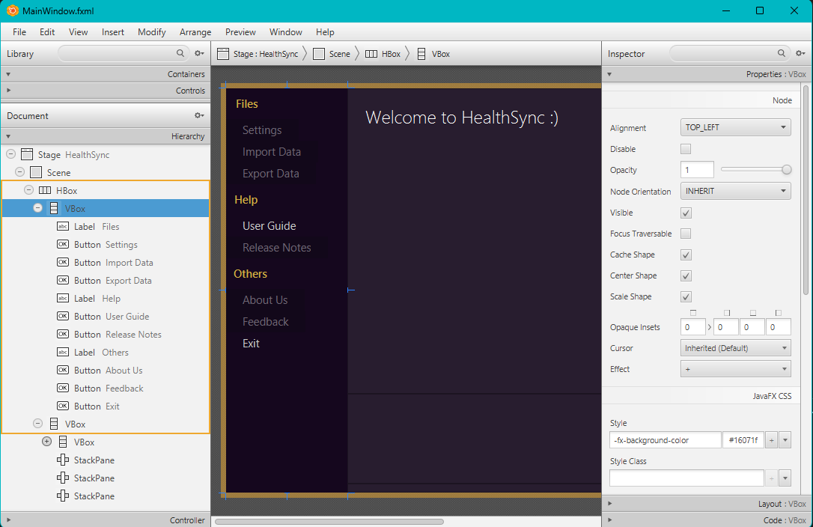
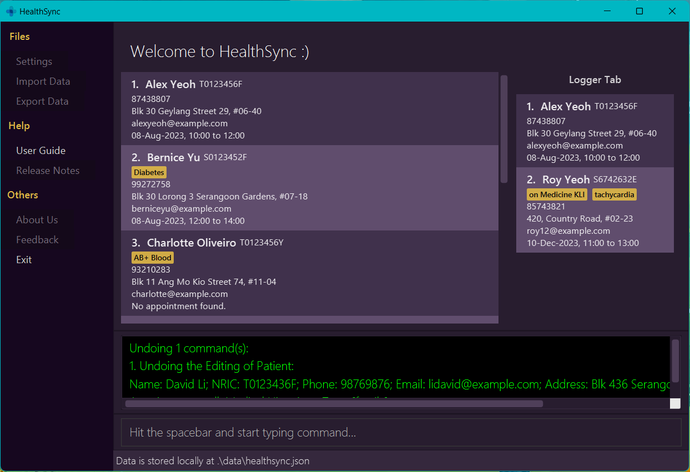

## Project: HealthSync

HealthSync is a desktop address book application used for teaching Software Engineering principles. The user interacts with it using a CLI, and it has a GUI created with JavaFX. It is written in Java, and has about 10 kLoC.

Given below are my contributions to the project.

* **New Feature**:

  1. Added fields like ID, Appointment and Medical Histories.
        * What it does: Allows for necessary fields to be included in the profile
        * Justification: This feature improves the product significantly because a user can now see the ID, appointment timings and medical history at one glance, since all information are bundled in a patient card. This caters to the needs of front desk staff who need to quickly identify patients, their medical histories and arrange appointments.
        * Highlights: This enhancement affects existing commands and commands to be added in future. It required an in-depth analysis of design alternatives. The implementation too was challenging as it required changes to existing models, commands and test cases.

  2. Added logger tab UI to show logged profiles
      * What it does: Allows for logs to be pinned at the right panel of the application
      * Justification: This feature improves the product significantly because a user can now utilise the logger like a memo.
      * Highlights: This enhancement affects log commands. The Person Cards UI are consistent in both the Logger Tab and Patient List View.

  3. Added Menu Sidebar UI
      * What it does: It shows users miscellaneous actions that can be performed in the application (ie. Help, Settings, Exit).
      * Justification: This feature provides a more intuitive way for users to navigate the application. It also supports future integration of file settings and help features.
      * Highlights: The buttons present in this sidebar have their corresponding shortcuts and can be executed through command text box.

  4. Added `spacebar` key shortcut
      * What it does:  Allows users to jump to command text box without using mouse to click on command text box
      * Justification: This feature improves the product significantly as it caters to the habits and characteristics of fast typists.
      * Highlights: This enhancement does not affect other components and is standalone. For future implementations of settings, we can allow users to pick their preferred shortcuts.

* **Code contributed**: [RepoSense link](https://nus-cs2103-ay2324s1.github.io/tp-dashboard/?search=weeehung&sort=groupTitle&sortWithin=title&timeframe=commit&mergegroup=&groupSelect=groupByRepos&breakdown=true&checkedFileTypes=docs~functional-code~test-code&since=2023-09-22)

* **Project management**:
  * Managed releases [`v1.2.1`](https://github.com/AY2324S1-CS2103T-T14-3/tp/releases/tag/v1.2.1) (1 release) on GitHub
  * Assisted in Jar Release [`v1.3`](https://github.com/AY2324S1-CS2103T-T14-3/tp/releases/tag/v1.3) (1 release) on GitHub

* **Enhancements to existing features**:
  * Added new fields necessary for patient tracking.
  * Updated the GUI color scheme (Pull requests [\#107](https://github.com/AY2324S1-CS2103T-T14-3/tp/pull/107))
  * Updated the frontend design of application, including menu sidebar, medical history tags and logger tabs.
  * Wrote additional tests for existing features to increase coverage from 75% to XX% (Pull requests [\#63](), [\#38]())
  * Refactor File Names to be more consistent (Pull requests [\#209](https://github.com/AY2324S1-CS2103T-T14-3/tp/pull/209))

* **Documentation**:
  * User Guide:
    * Added documentation for the features `autosave` [\#30](https://github.com/AY2324S1-CS2103T-T14-3/tp/pull/30)
    * Annotated GUI screenshots with explanations to orientate users [\#209](https://github.com/AY2324S1-CS2103T-T14-3/tp/pull/209)
    * Added Autosave explanation to mention what is saved in the hard disk [\#209](https://github.com/AY2324S1-CS2103T-T14-3/tp/pull/209)
    * Added explanation for edge case of appointment field (0-minute appointment) [\#209](https://github.com/AY2324S1-CS2103T-T14-3/tp/pull/209)
    * Added description for archiving data files (Future implementation) [\#209](https://github.com/AY2324S1-CS2103T-T14-3/tp/pull/209)
  * Developer Guide:
    * Added Product Scope which includes target user profile and value proposition.
    * Added user stories and sort them in terms of priority

* **Community**:
  * PRs reviewed (with non-trivial review comments): [\#74](https://github.com/AY2324S1-CS2103T-T14-3/tp/pull/74), [\#82](https://github.com/AY2324S1-CS2103T-T14-3/tp/pull/82)
  * Contributed to forum discussions (examples: [#253](https://github.com/nus-cs2103-AY2324S1/forum/issues/253))
  * Reported bugs and suggestions for other teams in the class (Issues examples: [#1](https://github.com/WeeeHung/ped/issues/1), [#2](https://github.com/WeeeHung/ped/issues/2), [#3](https://github.com/WeeeHung/ped/issues/3), [#4](https://github.com/WeeeHung/ped/issues/4),)
  * New fields implemented by me are adopted by the team ([#63](https://github.com/AY2324S1-CS2103T-T14-3/tp/pull/63))

* **Tools**:
  * Utitlised JavaFx Scene Builder for building the frontend of the project ([\#107](https://github.com/AY2324S1-CS2103T-T14-3/tp/pull/107))

### **References**:

#### _Usage of Javafx Scene Builder_

#### _Changes to GUI_

